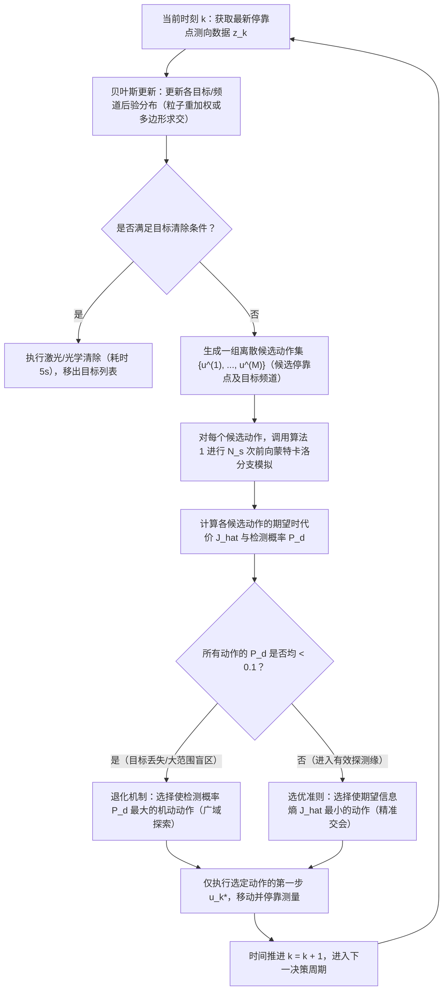

# 14_Ryan_Hedrick_2010_Information_Active_Sensing

## A. 书目信息与核验

- **论文基本信息**：
  - **作者**：Allison Ryan, J. Karl Hedrick
  - **年份**：2010 年（稿件历程：Received 18 February 2009, Accepted 8 January 2010, Available online 25 January 2010）
  - **论文题名**：Particle filter based information-theoretic active sensing
  - **期刊/出版单位**：*Robotics and Autonomous Systems*, Elsevier B.V.（转写本版权行标注：`© 2010 Elsevier B.V. All rights reserved.`；正式文献信息为 Vol. 58, No. 5, pp. 574–585）
  - **DOI/稳定链接**：`10.1016/j.robot.2010.01.003`
- **页码与完整性核验**：
  - **PDF 总页数**：11 页（PDF p. 1 – p. 11）。
  - **正文页码与 PDF 页码对应关系**：MinerU 机械转写本已移除期刊版面的顶栏与底栏印刷页码，仅保留 `<!-- PDF_PAGE: 001 -->` 至 `<!-- PDF_PAGE: 011 -->` 标记。根据期刊发表原件卷期信息，正文印刷起始页为 p. 574，故正文印刷页码与 PDF 页码的严格映射公式为：`正文页码 = 573 + PDF页码`（即 PDF p. 1 对应正文 p. 574，PDF p. 11 对应正文 p. 584）。
  - **全篇定位标注规范**：本拆解报告对所有公式、定理、数据及结论均严格按照【章节 + 正文页码（pp. 574–584） + PDF 页码（p. 1–11）】进行三重精确定位。
- **转写质量与排版疑点标记（严格核验，不猜测）**：
  1. **疑点 1（式 28 排版严重碎裂）**：在 Section 4.1（正文 p. 578，PDF p. 5）第 310–315 行，MinerU OCR 将式 (28) 严重截断为多行无意义字符（`J ≈ Xk+T 1N XNs...`）。经前后文数学逻辑与算法 1 还原，该式为未来观测序列前向推演的蒙特卡洛样本均值 $\hat{J}_k = \frac{1}{N_s}\sum_{s=1}^{N_s} J_k^s$。
  2. **疑点 2（式 10 编号空置）**：在 Section 2.2（正文 p. 576，PDF p. 3）第 142 行，出现孤立的公式编号 `(10)`，前后紧随式 (9) 与式 (11)，正文中无独立数学公式。此处置疑为原文排版排入行间编号或 OCR 错把多行推导中的标号独立成行，拆解时不强加猜测。
  3. **疑点 3（式 34 下标 OCR 格式错误）**：在 Section 4.2（正文 p. 579，PDF p. 6）式 (34) 分母中出现 `(f 1 - f_3)`，字符间夹杂空格，根据多项式插值对称性还原为 $(f_1 - f_3)$。
  4. **疑点 4（低概率截断阈值字符丢失）**：在 Section 4.2（正文 p. 580，PDF p. 7）第 414 行，正文说明虚拟粒子边界截断条件时写为 `p(x_k | x_{k-1}) < .`，小于号后字符丢失（原文应为极小数值 $\epsilon$ 或 $0$）。
  5. **疑点 5（表格参数 OCR 粘连）**：在 Table 2（正文 p. 582，PDF p. 9）中出现 `\sum 5` 与 `g 9.8`，经语义还原分别为过程协方差 $\Sigma = 5 I$ 与重力加速度 $g = 9.8\text{ m/s}^2$。

---

## B. 200 字以内核心摘要

论文研究移动传感器（固定翼无人机机载下视相机）在目标运动及传感器非线性、有限视场、非高斯测量条件下的主动感知（Active Sensing）控制问题。提出一种基于滚动时域控制（RHC）与序贯蒙特卡洛（SMC）的信息驱动规划框架，以最小化未来滤波后验分布的时域累积 Shannon 条件熵为优化目标。针对长预测时域中未来连续观测序列期望积分无解析解的维度灾难，设计了隐马尔可夫前向随机采样算法；并提出基于粒子集 Delaunay 三角剖分的后验概率密度分段线性重构法，推导了无超参数的三角单元二维微分熵闭式解析积分公式。理论证明了状态相关噪声下估计与控制的不可分离性；仿真与试飞数据验证了该方法相比传统纯检测概率（$P_d$）控制能有效消除决策饱和，并保证后验熵严格落在 $3\sigma$ 置信带内。

---

## C. 对应 B 题的位置

- **对应题目步骤**：
  - 主要对应 **Q3（全向干扰源机器狗自动搜索、交会定位与清除全流程在线决策）**；
  - 核心理论与观测模型兼顾支撑 **Q4（定向干扰源漏检、视场截断与负证据更新机制）**。
- **证据等级**：**方法迁移（Method Transfer）**。
- **为何属于该等级**：
  原论文面向单架固定翼无人机追踪单个地面移动目标，系统为连续非线性飞行运动学动力学、测向角连续测量且伴随高斯测向白噪声 $\mathcal{N}(0, \sigma^2)$，目标函数为连续状态空间的粒子滤波 Shannon 信息熵；而 B 题 Q3 属于地面机器狗在离散停靠点开展的 10~16 个未知位置静止无线电干扰源的搜索清除，测向误差为确定性严格有界区间 $[-1^\circ, 1^\circ]$，定位目标为有界凸多边形直径与清除圆覆盖。尽管物理对象和噪声假设不同，但论文提出的**“滚动时域信息增益决策架构（RHC）”**、**“前向多步观测展开以避免单步短视”**、**“单步检测概率（$P_d$）在多步预测中面临饱和失效故必须引入不确定度度量”**的核心方法论，可以直接改造为机器狗在未知源大范围巡逻覆盖（全局探索）与局部逼近交会（多边形收缩）之间动态调度的滚动规划算法。

---

## D. 模型拆解

### 1. 状态、已知量、决策变量、观测量
- **系统状态**：
  - 目标状态 $x_k \in \mathcal{X}$：原论文为二维地面车辆平面坐标与速度；在 B 题中对应各频道静止干扰源的二维空间坐标 $x^{(c)} = (x_T, y_T) \in \mathbb{R}^2$。
  - 传感器平台状态 $y_k$：原论文为无人机位置 $(y_x, y_y)$、飞行航向角 $\psi$ 与滚转角 $\phi$；在 B 题中对应机器狗停靠点坐标 $p_k = (x_k, y_k)$ 及当前测向机驻留频道 $c_k \in \{1, \dots, 20\}$。
- **已知量**：
  - 平台运动学约束与最大转向率 $u_{\max}$（对应 B 题机器狗直线速度 $v = 5\text{ m/s}$）；
  - 传感器测向几何关系、有效接收视场 $\mathcal{F}(y)$（对应 B 题有效接收半径 $R_{\max} \in [1000, 1500]\text{ m}$，测向误差限 $\pm 1^\circ$）；
  - 时间消耗常数：停靠测向耗时 $5\text{ s}$，频道切换耗时 $1\text{ s}$，光学定位 $3\text{ s}$，激光清除 $2\text{ s}$，清除有效半径 $20\text{ m}$。
- **决策变量**：
  - 控制输入序列 $\mathbf{u}_k = \{u_k, u_{k+1}, \dots, u_{k+N-1}\}$：原论文为无人机转弯角速度指令 $\dot{\psi}$；在 B 题中对应机器狗未来 $N$ 个动作序列 $a_k = (\Delta p_{k+1}, c_{k+1})$（即下一个移动停靠点坐标与切换检测的目标频道）。
- **观测量**：
  - 观测变量 $z_k$：原论文包含两类输出，未进入视场或漏检时 $z_k = \emptyset$，在视场内检测到时为目标方位角连续读数 $z_k = \theta(x, y) + v_k$；在 B 题中对应各频道信号检测有无（是否在有效半径内）及在 $[-1^\circ, 1^\circ]$ 误差内的有界示向度测量值 $\theta_k$。

### 2. 核心假设
- **假设 1（隐马尔可夫结构）**：未来观测 $z_k$ 仅条件依赖于当前目标状态 $x_k$ 与平台状态 $y_k$；目标下一时刻状态 $x_{k+1}$ 仅条件依赖于当前状态 $x_k$（Section 3.1 & 4.1）。
- **假设 2（有限视场与视场外零信息）**：传感器具有明确的几何作用足印（Footprint）$\mathcal{F}(y)$。当目标处于视场外时，检测概率为 0，漏检概率为 1；当目标在视场内时，存在基础漏检率 $P_m$（Section 5.1）。
- **假设 3（状态相关噪声与不可分离性）**：当传感器精度受相对距离或跟踪误差调制时（如 $g(x_k - y_k)$），控制与估计强耦合，传统的确定性分离原理（Separation Principle）失效，控制律必须将后验不确定度的演化内生化（Section 2.1 & 2.2）。

### 3. 测量/误差模型
- **原论文连续高斯-漏检混合测量模型（Section 5.1, 正文 p. 582, PDF p. 9, 式 36）**：
  $$p(z_k = \emptyset \mid x_k) = \begin{cases} 1, & x_k \notin \mathcal{F}(y_k) \\ P_m, & x_k \in \mathcal{F}(y_k) \end{cases}$$
  $$p(z_k \in \mathbb{R} \mid x_k) = \begin{cases} 0, & x_k \notin \mathcal{F}(y_k) \\ (1 - P_m)\mathcal{N}(z_k; \theta(x_k, y_k), \sigma^2), & x_k \in \mathcal{F}(y_k) \end{cases}$$
- **B 题对应离散有界示向度测量模型**：
  在 B 题中，高斯噪声项 $\mathcal{N}(z; \theta, \sigma^2)$ 被替换为严格紧支集均匀/有界分布：
  $$z_k^{(c)} \in [\theta(x^{(c)}, p_k) - 1^\circ, \theta(x^{(c)}, p_k) + 1^\circ], \quad \text{当且仅当 } \|x^{(c)} - p_k\| \le R^{(c)} \text{ 且 } c_k = c$$

### 4. 目标函数与约束
- **原论文 RHC 优化问题（Section 3.1, 正文 p. 577, PDF p. 4, 式 18）**：
  $$\min_{u_k, \dots, u_{k+N-1}} \sum_{j=1}^N \mathbf{H}\Big(p(X_{k+j} \mid Z_1, \dots, Z_{k+j})\Big)$$
  $$\text{s.t.} \quad y_{j+1} = g(y_j, u_j), \quad x_{j+1} \sim p(X_{j+1} \mid X_j), \quad z_j \sim p(Z_j \mid X_j; y_j)$$
  其中 $\mathbf{H}(p(X \mid Z)) = \int_z p(z) H(p(X \mid z))\mathrm{d}z$ 为后验微分熵的数学期望。

### 5. 符号到 B 题映射表

| 论文符号 | 原文物理含义与数学性质 | 论文出现位置 | B 题对应符号 | B 题物理含义与数学性质 | 迁移对应关系与处理方式 |
| :--- | :--- | :--- | :--- | :--- | :--- |
| $x_k \in \mathcal{X}$ | 目标状态（2D 平面位置与速度向量） | Sec. 2.1, p. 575; Sec. 3.1, p. 577 | $x^{(c)} = (x_T, y_T)^T$ | 频道 $c$ 对应干扰源的二维空间坐标（静止） | 状态简化：目标速度为 0；状态维度扩展：由单目标扩展为 20 个频道的独立二元存在性与空间坐标 |
| $y_k$ | 传感器平台状态（无人机位置、航向 $\psi$、滚转 $\phi$） | Sec. 3.1, p. 577; Sec. 3.3, p. 578 | $p_k = (x_k, y_k)^T, c_k$ | 机器狗当前停靠点二维坐标及当前工作频道编号 | 由连续曲线轨迹简化为二维平面离散停靠点坐标及离散频道状态 |
| $u_k$ | 控制输入（转弯角速度指令 $\dot{\psi}$，有界） | Sec. 3.1, p. 577; Sec. 3.3, p. 578 | $a_k = (\Delta p_{k+1}, \Delta c_{k+1})$ | 机器狗移动位移向量与频道切换动作 | 由连续动力学微分约束转化为两点间欧氏距离时间代价与频道切换时延约束 |
| $z_k$ | 传感器观测（含空观测 $\emptyset$ 与连续测向角） | Sec. 3.1, p. 577; Sec. 5.1, p. 582 | $z_k^{(c)} = (\text{flag}, \theta_k)$ | 示向度读数（$[0^\circ, 360^\circ)$）与信号检出布尔标志 | 由带有高斯测向噪声的连续角，映射为有界区间 $[\theta - 1^\circ, \theta + 1^\circ]$ 及有限接收半径截断 |
| $\mathcal{F}(y)$ | 传感器几何视场足印（相机投影四边形） | Sec. 5.1, p. 582, Fig. 8 | $B(p_k, R)$ | 机器狗在停靠点 $p_k$ 处的圆形有效检测域（$R \in [1000, 1500]\text{ m}$） | 下视投影视场转化为半径 $R$ 的全向检测圆盘（Q4 转化为 $180^\circ$ 定向半圆盘） |
| $H(p)$ | 连续概率密度函数的 Shannon 微分熵 | Sec. 3.1, p. 577, 式 (16) | $\text{Area}(S^{(c)}_k)$ 或 $\text{Diam}(S^{(c)}_k)$ | 干扰源可行交会定位多边形 $S^{(c)}_k$ 的几何面积或最大直径 | **核心指标替换**：将连续概率分布的信息熵映射为有界误差集合的可行多边形面积/直径，保持不确定度单调递减性质 |
| $N$ | RHC 滚动预测时域步长（论文取 $N=6$ 步） | Sec. 3.1, p. 577; Sec. 5.3, p. 582 | $N_{\text{lookahead}}$ | 机器狗在线前瞻决策的规划步数（建议取 $1 \sim 3$ 步） | 滚动时域思想完全保留，由于停靠测向耗时较长，B 题建议采用短时域离散前瞻（Lookahead） |
| $N_s$ | 观测序列前向推演的蒙特卡洛样本数 | Sec. 4.1, p. 578, 式 (28) | $M_{\text{scenario}}$ | 场景分支模拟采样数（或网格化极值采样点数） | 保持随机采样估计多步期望收益的架构，用于未发现频道的分布评估 |
| $P_m$ | 传感器视场内的固有漏检概率 | Sec. 5.1, p. 582, 表 2, 式 (36) | $0$（附录 2 理想传播） | 题目未设信道衰落漏检，在有效半径内必可检出 | 原文 $P_m$ 用于平滑似然；B 题中无漏检，仅受限于有效距离 $R \in [1000, 1500]\text{ m}$ |

---

## E. 关键公式

### 1. 规范主动感知系统与分离原理失效模型（Section 2）

- **公式 (1)（正文 p. 575，PDF p. 2）**
  $$\begin{aligned} x_{k+1} &= a x_k + b w_k \\ y_{k+1} &= a_s y_k + u_k \\ z_k &= x_k + g(x_k - y_k) v_k \\ w_k &\sim \mathcal{N}(0, W), \quad v_k \sim \mathcal{N}(0, V) \end{aligned}$$
  - **符号解释**：$x_k, y_k$ 分别为目标与传感器位置；$u_k$ 为控制量；$w_k, v_k$ 为独立高斯白噪声序列；$g(x_k - y_k)$ 为距离加权函数，表征测向/测距精度随相对距离恶化。
  - **中文含义**：一维典型主动感知基准模型，将测量噪声方差与传感器-目标跟踪误差耦合。
  - **可否迁移到 B 题**：**否（直接照搬）/ 是（原理支撑）**。B 题测向误差固定在 $[-1^\circ, 1^\circ]$，不随距离衰减，但有效接收半径 $R$ 的硬截断构成了极端的“距离相关非线性感知”，即距离大于 $R$ 时噪声方差骤增至无穷大（完全丢失信号）。

- **公式 (8) & (11)（正文 pp. 575–576，PDF pp. 2–3）**
  $$\mathbf{x}_{k+1} = A \mathbf{x}_k + B w_k + \tilde{L} g(\mathbf{x}_k) v_k$$
  $$\mathbf{X}_{k+1} = A \mathbf{X}_k A^T + B W B^T + \tilde{L} \tilde{L}^T V \mathbf{E}\left[g(\mathbf{x})^2\right]$$
  - **符号解释**：$\mathbf{x}_k = [x_k, e_k, t_k]^T$ 为由目标状态、估计误差、跟踪误差构成的闭环增广状态；$\mathbf{X}_k$ 为其协方差矩阵；$\tilde{L} = [0, -L, 0]^T$。
  - **中文含义**：当传感器噪声状态相关时，误差协方差更新方程不再服从标准 Lyapunov 方程，期望误差收敛（$A$ 是 Hurwitz 矩阵）无法保证协方差有界。
  - **可否迁移到 B 题**：**理论依据**。说明主动感知任务不能像经典控制那样将“路径规划”与“滤波定位”完全解耦，机器狗的移动决策必须直接服务于几何交会不确定度的收敛。

- **公式 (14) & (15)（正文 p. 576，PDF p. 3）**
  $$\mathbf{X}_{k+1} \approx A \mathbf{X}_k A^T + \tilde{L} \tilde{L}^T V C \mathbf{X}_k C^T + B W B^T + \tilde{L} \tilde{L}^T V g(0)^2$$
  $$\begin{bmatrix} x_a \\ x_{na} \end{bmatrix}_{k+1} = \begin{bmatrix} A_1 & 0 \\ A_3 & A_2 \end{bmatrix} \begin{bmatrix} x_a \\ x_{na} \end{bmatrix}_k + \tilde{B}$$
  - **符号解释**：$C = \left.\frac{\mathrm{d}g}{\mathrm{d}\mathbf{x}}\right|_{\mathbf{x}=0} = [0, 0, c]$ 为泰勒展开一阶导；$x_a, x_{na}$ 为协方差矩阵各独立分量的向量化重排；$A_2$ 为主导误差协方差演化的反馈转移阵。
  - **中文含义**：协方差有界收敛的充要条件是矩阵 $A_2$ 的特征值严格位于单位圆内。作者借此在 Fig. 1 中证明了控制增益 $K$ 与观测增益 $L$ 存在严格耦合的稳定域。
  - **可否迁移到 B 题**：**理论支撑**。用于论述 B 题中若只追求“移动距离最短”而不考虑交会夹角几何退化（基线过短或近平行观测），会导致定位误差多边形发散。

---

### 2. 滚动时域信息熵控制与贝叶斯粒子估计模型（Section 3）

- **公式 (16) & (17)（正文 p. 577，PDF p. 4）**
  $$H(p(x)) = \int_{x \in X} - p(x) \log p(x) \mathrm{d}x$$
  $$\mathbf{H}(p(X \mid Z)) = \int_{z \in Z} p(z) H(p(X \mid z)) \mathrm{d}z$$
  - **符号解释**：$H(p(x))$ 为连续状态随机变量 $x$ 的 Shannon 微分熵；$\mathbf{H}(p(X \mid Z)) = \int_{z \in Z} p(z) H(p(X \mid z))\mathrm{d}z$ 为关于未决未来观测 $Z$ 的先验边缘分布 $p(z)$ 取期望后的平均条件熵。
  - **中文含义**：主动感知任务中评估未来动作优劣的标准信息论度量，度量实施动作后系统剩余不确定度的数学期望。
  - **可否迁移到 B 题**：**是（需度量改写）**。B 题若保留概率网格/粒子滤波框架，可直接计算栅格概率分布的信息熵；若采用凸多边形几何框架，则映射为可行域面积积分 $\mathbf{E}[\text{Area}(S_{k+1})]$。

- **公式 (18)（正文 p. 577，PDF p. 4）**
  $$\min_{u_k, \dots, u_{k+N-1}} \sum_{j=1}^N \mathbf{H}\Big(p(X_{k+j} \mid Z_1, \dots, Z_{k+j})\Big) \quad \text{s.t.} \quad \begin{cases} y_{j+1} = g(y_j, u_j) \\ x_{j+1} \sim p(X_{j+1} \mid X_j) \\ z_j \sim p(Z_j \mid X_j; y_j) \end{cases}$$
  - **符号解释**：$N$ 为预测时域长度；式中对未来 $N$ 步的平均条件熵进行时域累加，表示在整个时域窗口内最小化时间平均不确定度。
  - **中文含义**：滚动时域主动感知优化的主数学规划形式，每次求解最优控制序列后仅施加当前拍 $u_k$，随时间滚动重新优化。
  - **可否迁移到 B 题**：**完全可迁移（核心主框架）**。可直接改造为机器狗选择下一停靠点及目标频道的决策模型，平衡单步直奔目标与多步全局探查的收益。

- **公式 (21) & (22)（正文 pp. 577–578，PDF pp. 4–5）**
  $$p(x) = \sum_{i=1}^{N_p} w^i \delta(x - x^i), \quad \sum_{i=1}^{N_p} w^i = 1$$
  $$w_k^i = \frac{w_{k-1}^i p(z_k \mid x_k^i)}{\sum_{j=1}^{N_p} w_{k-1}^j p(z_k \mid x_k^j)}$$
  - **符号解释**：$x^i$ 为第 $i$ 个粒子的物理坐标，$\delta(\cdot)$ 为 Dirac 脉冲函数；$w_k^i$ 为粒子经实际观测 $z_k$ 更新后的归一化重要性权重。
  - **中文含义**：粒子滤波（SMC）经验分布表达及标准重要性重加权贝叶斯更新步。
  - **可否迁移到 B 题**：**可迁移**。若在 B 题 Q3 中采用概率粒子群表示每个频道干扰源的可能空间分布，似然函数 $p(z_k \mid x^i)$ 设为指示函数 $\mathbb{I}\left(x^i \text{ 满足当前停靠点的示向度误差约束}\right)$。

---

### 3. 未来观测序列前向蒙特卡洛预测与代价估计（Section 4.1）

- **公式 (26) & (27)（正文 p. 578，PDF p. 5）**
  $$p(Z_{k+1}, \dots, Z_i \mid z_1, \dots, z_k) = \prod_{j=k+1}^i p(Z_j \mid z_1, \dots, z_{j-1})$$
  $$p(Z_i \mid z_1, \dots, z_{i-1}) = \int_{X_i} p(Z_i \mid x_i) p(x_i \mid z_1, \dots, z_{i-1})\mathrm{d}x_i$$
  - **符号解释**：利用隐马尔可夫图模型（Fig. 3）的链式法则分解未来观测序列的联合概率密度；通过将未观测状态 $x_i$ 边缘化，得到基于历史滤波密度的单步观测先验预测分布。
  - **中文含义**：说明在缺少未来观测时，如何从当前后验状态前向递推生成未来假想观测分布的理论闭环。
  - **可否迁移到 B 题**：**是**。在机器狗规划未来 $N$ 步路径时，利用当前交会多边形内的先验分布，推演未来停靠点可能测得的示向度期望值。

- **公式 (28)（正文 p. 578，PDF p. 5，转写疑点 1 修复）**
  $$J_k \approx \frac{1}{N_s} \sum_{s=1}^{N_s} J_k^s = \frac{1}{N_s} \sum_{s=1}^{N_s} \sum_{i=k+1}^{k+T} H\Big(p(X_i \mid \tilde{z}_1^s, \dots, \tilde{z}_i^s)\Big)$$
  - **符号解释**：$N_s$ 为前向采样的观测轨迹条数；$\tilde{z}_i^s$ 为第 $s$ 条采样路径在时刻 $i$ 的假想观测值；$J_k^s$ 为该条分支上的时域累积熵。
  - **中文含义**：将原本无法解析计算的高维多重观测期望积分，通过有限条蒙特卡洛仿真路径的样本均值进行无偏近似。
  - **可否迁移到 B 题**：**可迁移（Rollout 评估）**。机器狗在候选停靠点集合中搜索时，利用 Monte Carlo 前向推演评估不同候选停靠点序列的平均多边形面积削减收益。

- **公式 (29) & (30)（正文 p. 578，PDF p. 5）**
  $$p(z_k \mid z_1, \dots, z_{k-1}) = \sum_{i=1}^{N_p} w_k^i p(z_k \mid x_k^i) = \sum_{i=1}^{N_p} w_k^i \mathcal{N}\Big(z_k; \mu(x_k^i), \Sigma(x_k^i)\Big)$$
  - **符号解释**：将粒子集代入边缘化积分，使观测预测分布退化为各粒子似然的加权和；当传感器误差为高斯时，预测分布显式表现为高斯混合模型（GMM）。
  - **中文含义**：展示了粒子滤波下抽取假想未来观测的极高计算效率——直接从各粒子对应的高斯混合分布中抽样即可。
  - **可否迁移到 B 题**：**是**。若干扰源位置在多边形内均匀采样若干假设点，各假设点在未来停靠点的理论示向度叠加区间噪声即构成混合预测集合。

---

### 4. 粒子集连续化与 Delaunay 三角剖分熵闭式解析积分（Section 4.2）

- **公式 (32) & (33)（正文 p. 579，PDF p. 6）**
  $$p(X_k \mid z_1, \dots, z_k) = \frac{p(z_k \mid X_k)}{p(z_k \mid z_1, \dots, z_{k-1})} \sum_{i=1}^{N_p} w_{k-1}^i p(X_k \mid x_{k-1}^i)$$
  $$f(x_k^i) = p(z_k \mid x_k^i) \sum_{j=1}^{N_p} w_{k-1}^j p(x_k^i \mid x_{k-1}^j)$$
  - **符号解释**：$f(x_k^i)$ 为利用贝叶斯递推形式直接在粒子点位置处重构出的未归一化连续后验概率密度值。
  - **中文含义**：克服了传统狄拉克粒子集连续熵趋于 $-\infty$ 的根本缺陷，避免了高斯核平滑（KDE）需要人工调参核方差的弊端，完全依据系统物理转移模型与贝叶斯更新实现自然平滑。
  - **可否迁移到 B 题**：**方法论借鉴**。说明不确定度度量必须具备清晰的几何物理意义，不能直接对离散离散点算离散熵。

- **公式 (34)（正文 p. 579，PDF p. 6，核心理论贡献）**
  $$\Delta h = \frac{a}{3} \left\{ - f_3^3 \frac{\frac{5}{6} - \log f_3}{(f_2 - f_3)(f_1 - f_3)} + f_2^3 \frac{\frac{5}{6} - \log f_2}{(f_1 - f_2)(f_2 - f_3)} - f_1^3 \frac{\frac{5}{6} - \log f_1}{(f_1 - f_2)(f_1 - f_3)} \right\}$$
  - **符号解释**：$a$ 为二维平面上某个 Delaunay 三角形单元的几何面积；$f_1, f_2, f_3$ 为该三角形三个顶点处的概率密度函数值（假设两两互不相等）；$\Delta h$ 为该三角形内部连续分布 $-f(x)\log f(x)$ 的解析积分贡献量。
  - **中文含义**：二维平面分段线性连续概率分布 Shannon 微分熵的**闭式解析积分公式**。全域总熵直接等于所有 Delaunay 三角形单元贡献量之和：$H = \sum_{m} \Delta h_m$。
  - **可否迁移到 B 题**：**否（公式无需照搬）/ 是（数学思想借鉴）**。在 B 题有界误差几何体系下，交会定位可行域直接就是多边形，求其面积直接用二维向量叉积（Shoelace 公式）即可解析求出，无需构建三维概率曲面插值，计算更为简捷。

---

## F. 算法与证明

### 1. 算法步骤与执行伪代码

原论文核心算法由两个紧密耦合的模块构成：**前向观测分支模拟与代价评估（Algorithm 1）** 与 **RHC 滚动时域主动感知决策主循环**。

#### 算法 1：任意递归贝叶斯滤波下的长度为 $T$ 观测序列采样与时域累积熵计算
- **输入**：当前时刻 $k$ 的滤波后验状态分布 $p(X_k \mid z_1, \dots, z_k)$，候选控制输入序列 $\{u_k, \dots, u_{k+T-1}\}$，传感器几何模型 $p(Z \mid X; y)$，平台运动模型 $g(y, u)$。
- **输出**：一条未来假想观测轨迹 $[\tilde{z}_{k+1}^s, \dots, \tilde{z}_{k+T}^s]$ 及其对应的时域累积代价样本 $J_k^s$。
- **算法伪代码（正文 p. 578，PDF p. 5，Algorithm 1 中文重构）**：
  ```text
  1: 初始化状态：设当前滤波密度为 p_0 = p(X_k | z_1, ..., z_k)，累积代价 J_s = 0
  2: For i = 1 To T Do:
  3:     (a) 时间预测步：应用过程转移模型，外推一步先验状态分布：
             p_pred = \int p(X_{k+i} | X_{k+i-1}) p(X_{k+i-1} | \tilde{z}_1^s, ..., \tilde{z}_{k+i-1}^s) dX
  4:     (b) 观测采样步：计算传感器预测边缘分布 p(Z_{k+i} | \tilde{z}_1^s, ..., \tilde{z}_{k+i-1}^s)，
             从中独立随机抽取一个假想观测值 \tilde{z}_{k+i}^s
  5:     (c) 测量更新步：将抽取的假想观测 \tilde{z}_{k+i}^s 视为真实测量，执行贝叶斯后验更新：
             p_upd = [ p(\tilde{z}_{k+i}^s | X_{k+i}) * p_pred ] / p(\tilde{z}_{k+i}^s)
  6:     (d) 熵值解析计算：利用 Delaunay 三角剖分式 (34) 计算更新后密度的微分熵 H(p_upd)
  7:     (e) 累加时代价：J_s = J_s + H(p_upd)
  8: End For
  9: Return 假想观测序列与样本时代价 J_s
  ```

#### 算法 2：RHC 滚动时域主动感知决策主流程


- **停止条件**：所有目标均被定位至允许清除半径内（原论文为仿真时长到达；B 题为目标区域内全部 10~16 个干扰源全部完成清除）。
- **时间与空间复杂度分析**：
  - 单次三角剖分与分段线性积分复杂度为 $\mathcal{O}(N_p \log N_p)$，其中 $N_p$ 为粒子数；
  - 若评估 $M$ 个候选控制动作，时域长度为 $T$，蒙特卡洛观测采样数为 $N_s$，则单步决策总计算复杂度为 $\mathcal{O}\left(M \cdot N_s \cdot T \cdot N_p \log N_p\right)$；
  - 原论文指出（Section 4.1, 正文 p. 578），由于采用了隐马尔可夫蒙特卡洛抽样，计算量与时域 $T$ 呈**线性增长** $\mathcal{O}(T)$，彻底打破了传统网格数值积分指数级爆炸 $\mathcal{O}(|\mathcal{Z}|^T)$ 的瓶颈。

### 2. 关键理论分析与证明要点

#### 命题 1（状态相关感知噪声导致确定性分离原理失效，Section 2.1–2.2）
- **条件**：观测噪声强度随相对状态误差 $x - y$ 动态变化，即 $z_k = x_k + g(x_k - y_k) v_k$，其中 $g(\cdot)$ 为非常值非线性加权函数。
- **结论**：
  1. 即使分别设计的线性观测器增益 $L$ 与状态反馈增益 $K$ 能保证期望系统矩阵 $A$ 的特征值全部位于单位圆内（系统均值收敛于 0），误差协方差矩阵仍然可能渐近发散；
  2. 协方差稳定的充要条件转化为增广耦合矩阵 $A_2$（式 15）的谱半径 $\rho(A_2) < 1$；
  3. 控制器必须直接介入估计过程的不确定度调控，路径规划与滤波估计不可解耦。
- **作者证明路径（正文 p. 576，PDF p. 3）**：对非线性权重 $g(\mathbf{x})$ 在原点进行一阶泰勒级数展开 $g(\mathbf{x}) \approx g(0) + C \mathbf{x}$，将协方差递推方程重构为 6 维独立分量的分块下三角线性系统式 (15)，直接对特征子空间 $A_2$ 进行特征值分析。

#### 命题 2（粒子集 Delaunay 分段线性近似的信息熵解析表达，Section 4.2）
- **条件**：粒子滤波后验密度通过式 (33) 在二维离散粒子点处求值，区域通过以粒子点为顶点的 Delaunay 三角剖分进行无缝覆盖，单元内部概率曲面服从线性插值。
- **结论**：任意三角形内部的微分熵重积分 $\iint -f(x, y)\log f(x, y)\mathrm{d}x\mathrm{d}y$ 具有严格的初等函数闭式解（式 34），无需任何空间数值积分，且无需引入人工高斯核平滑的经验带宽参数。
- **作者证明路径（正文 p. 579，PDF p. 6）**：通过建立二维仿射坐标变换，将任意平面三角形映射为标准正三角形，在局部斜坐标系下对被积函数 $(c_1 u + c_2 v + c_3) \log(c_1 u + c_2 v + c_3)$ 执行逐次分部积分解析推导。

#### 命题 3（广域低置信度下信息熵与检测概率指标的等价退化性，Section 5.3）
- **条件**：当目标位置先验不确定性极高，候选动作在预测时域内的检测概率极低（原论文设定阈值为 $P_d < 0.1$）。
- **结论**：最大化检测概率（Maximum $P_d$）与最小化后验条件熵（Minimum Entropy）的选择结果完全重合；但当 $P_d$ 超过阈值后，纯 $P_d$ 指标发生饱和退化，必须依赖条件熵指标提供精细引导。
- **作者论述依据（正文 p. 582，PDF p. 9）**：引用 Ryan 博士论文 [26] 的理论结论，说明当 $P_d \to 0$ 时，信息增益的一阶渐近主部就是检测事件的出现概率；一旦进入近场，由于多个候选动作均能以 $100\%$ 概率看到目标，纯 $P_d$ 失效，而信息熵能进一步区分“单次擦边看到”与“多次正对持续观测”的几何质量差异（Fig. 9 下右图）。

---

## G. 实验与可比指标

### 1. 实验场景与基准参数设计
- **仿真环境 1（高斯基准下的熵估计精度对比，Section 4.3）**：
  - 二维线性高斯随机游走目标，初始协方差 $15 I_2$，过程噪声协方差 $5 I_2$，观测噪声协方差 $25 I_2$（式 35）。
  - 对照基准：Kalman 滤波真实稳态解析微分熵 $H_{\text{true}} = \log \sqrt{(2\pi e)^2 |Z|} = 5.05$。
  - 参评方法：
    1. 粒子经验协方差高斯代用估计；
    2. 传统高斯核平滑（KDE）+ 空间网格数值求积（测试不同平滑核方差参数）；
    3. 本文提出的 Bayes-Delaunay 分段线性解析积分法。
- **仿真环境 2（固定翼无人机 6 秒时域 RHC 视觉跟踪仿真，Section 5）**：
  - 飞行速度 $V = 20\text{ m/s}$，固定飞行高度 $150\text{ m}$，航向角速度上限 $u_{\max} = 0.2\text{ rad/s}$，相机下视开角 $\beta = 48^\circ$。
  - 离散时间步长 $\Delta = 1\text{ s}$，滚动时域 $N = 6\text{ s}$（6 步）。
  - 传感器模型：测向误差标准差 $\sigma = 2.5^\circ$，视场内基础漏检率 $P_m = 0.1$。
  - 候选控制序列：每次决策离散评估 25 条候选飞行指令分支。
  - 粒子规模：500 个粒子（Section 5.1, 表 2）。
- **真机实测环境（Sig Rascal 无人机车载相机实飞航拍，Section 6）**：
  - 小型无人机搭载下视固定相机，对地面沿道路行驶的卡车进行自主视频跟踪与后处理。
  - 滚动前瞻时域：6 步（时间窗口 $1.14\text{ s}$，单步步长 $\Delta = 0.19\text{ s}$）。
  - 观测分支采样数：$N_s = 10$。

### 2. 核心量化指标与关键数值结论
1. **熵计算精度（Section 4.3, 正文 pp. 580–581, PDF pp. 7–8, Fig. 7）**：
   - 传统高斯核平滑（KDE）的均方根误差（RMS Error）高度受制于带宽启发式选取，在参数失配时误差超过 $12\%$，在人工精心调谐后最低误差为 $3\% \sim 4\%$；
   - 本文提出的 Bayes-Delaunay 解析积分法**无需任何经验调谐超参数**，在 2000 个粒子下均方根误差直接稳定在 **$2\%$**；在一维问题（500 粒子）下误差小于 **$1\%$**；相比 Orguner (2008) 算法（2D 下误差 $7\%$）精度提升 3.5 倍。
2. **纯检测概率（$P_d$）指标失效实证（Section 5.3, 正文 p. 582, PDF p. 9, Fig. 9 下右图）**：
   - 在第 4 次决策迭代中，25 个候选控制输入中共有 **6 个候选动作给出了完全相同、毫无差别的确定性预测结果（$P_d = 1.0$）**；
   - 纯检测概率准则此时彻底陷入决策死区，无法选优；而信息论时域累积熵指标不仅能够清晰区分这 6 个动作带来的后续视场覆盖几何质量差异，更选出了能提供最优侧向连续交会观测的机动转弯控制分支。
3. **小样本前向蒙特卡洛预测的置信界验证（Section 6.2, 正文 p. 583, PDF p. 10, Fig. 13）**：
   - 真机飞行数据表明，仅使用 **$N_s = 10$ 条前向观测采样路径**，后验计算得到的真实时域累积熵损失曲线全程严格落入预测的 $3\sigma$ 置信区间内；
   - 证明了小样本量下序贯蒙特卡洛观测展开的统计鲁棒性与在线计算可行性。

---

## H. 可直接用于建模论文的证据卡

### 证据卡 1：主动感知中路径规划与状态估计的不可分离性
- **结论转述**：
  当传感器的观测质量或感知有效性依赖于平台与目标的相对几何状态时（如存在作用距离门槛或测向几何退化），控制回路与估计回路强耦合，经典确定性分离原理失效；控制器必须以“主动减小后验分布不确定度”为直接目标，才能保证闭环滤波误差的协方差有界收敛。
- **精确定位**：Section 2.2，正文 pp. 575–576，PDF pp. 2–3，式 (8)–(15)，Fig. 1。
- **推荐放入 B 题论文章节**：第 3 章或第 4 章“问题 2/3：机器狗路径规划与感知联动决策机理”。
- **必须附带的适用条件**：传感器具有有限测量范围或非线性几何退化；不能假定观测噪声与航迹解耦。

### 证据卡 2：多步时域规划中纯检测概率准则的饱和退化机制
- **结论转述**：
  在多步主动感知规划中，“最大化发现/检测概率（$P_d$）”是一个粗糙且容易饱和的度量，它无法区分“仅仅看到一次”与“多次持续高质量观测”的几何差异（往往出现多个动作 $P_d = 1.0$ 的死区）；必须采用基于后验不确定度收缩（如条件信息熵、交会多边形面积或直径）的时域累加代价函数作为选优标准。
- **精确定位**：Section 1 & 5.3，正文 pp. 574, 582，PDF pp. 1, 9，Fig. 9。
- **推荐放入 B 题论文章节**：第 5 章“问题 3：全向干扰源自动搜索与清除策略——目标函数设计与对比论证”。
- **必须附带的适用条件**：传感器视场有限且规划时域步数 $N > 1$；当所有候选动作 $P_d$ 均极低（$< 0.1$）时允许退化回纯 $P_d$。

### 证据卡 3：滚动时域前向推演（RHC + SMC Rollout）架构的高效性
- **结论转述**：
  针对包含未决未来观测的非线性长时域规划问题，采用隐马尔可夫图模型的链式分解与序贯蒙特卡洛（SMC）前向采样展开，可以将未来多步观测的期望计算复杂度由时域指数爆炸 $\mathcal{O}(|\mathcal{Z}|^T)$ 彻底降低为关于时域长度的线性增长 $\mathcal{O}(T)$，且仅需极少采样分支（如 $N_s = 10$）即可保证实际代价严格落在 $3\sigma$ 置信带内。
- **精确定位**：Section 4.1 & 6.2，正文 pp. 578, 583，PDF pp. 5, 10，式 (26)–(28)，Algorithm 1，Fig. 13。
- **推荐放入 B 题论文章节**：第 5 章“问题 3：在线实时规划算法设计与计算复杂度分析”。
- **必须附带的适用条件**：系统具备马尔可夫性；需要定义明确的观测生成概率模型或几何假设采样模型。

---

## I. 不能照搬的部分（差异分析与针对 B 题的重写方案）

| 维度 | 原文模型设定（Ryan & Hedrick 2010） | B 题竞赛实际设定（2026 全国数模 B 题 Q3） | 为什么不能照搬 | 迁移至 B 题的针对性改写与重构方案 |
| :--- | :--- | :--- | :--- | :--- |
| **噪声本质** | 连续测向高斯白噪声 $\mathcal{N}(0, \sigma^2)$（$\sigma = 2.5^\circ$） | 确定性严格有界测向误差 $[-1^\circ, 1^\circ]$ | 高斯分布具有无穷长尾，而 B 题是确定性紧支集；高斯假设会导致解空间过度发散且无法给出 $100\%$ 的几何安全包络 | 将连续似然函数改写为**紧支撑指示函数** $\mathbb{I}\left(\|\theta_{\text{meas}} - \theta_{\text{true}}\| \le 1^\circ\right)$；用**交会凸多边形（Polytope）**替代高斯协方差椭圆。 |
| **不确定度度量** | 概率分布的连续 Shannon 微分熵 $H(p) = \int -p \log p$ | 几何多边形的最大直径 $\text{Diam}(S)$ 或面积 $\text{Area}(S)$ | 题目 Q1 明确以“多边形直径能否被 $20\text{ m}$ 清除圆覆盖”为评判标准，连续积分熵不具备物理距离直观性 | 将式 (18) 中的熵度量替换为**几何可行域直径/面积**：$J(a_k) = \sum_{c} \omega_c \mathbf{E}\left[\text{Diam}\left(S_{k+1}^{(c)}\right)\right]$。 |
| **运动与感知模式** | 固定翼无人机连续平滑转弯机动；连续下视拍摄 | 机器狗离散移动；**停靠后耗时 5s 测向，切换频道耗时 1s** | 无人机不能悬停，必须考虑最小转弯半径；机器狗可随时转向停止，但每次停靠测向与频段切换有刚性时间成本 | 将连续运动学微分方程简化为**停靠点图遍历模型**，代价函数中必须强行计入**移动时间（$d/5\text{ m/s}$）、停靠检测时间（$5\text{ s}$）及频道切换时间（$1\text{ s}$）**。 |
| **目标规模与多源关联**| 单目标跟踪，空间连续移动车辆 | **10~16 个静止全向干扰源**，空间分布未知，频段互不重叠（20 个正交信道） | 原文无需处理多目标数据关联与频道调度；B 题核心瓶颈在于机器狗只能单频道驻留 | 建立 **20 个相互解耦的信道独立滤波状态机**。利用“信道正交性”避免复杂的多目标关联，将全局调度分解为“哪个频段需要优先测向”与“机器狗下一个停靠点选在哪”。 |
| **探测范围机制** | 平滑视场投影截断 + 内部固有漏检率 $P_m = 0.1$ | 硬性圆形有效接收半径 $R \in [1000, 1500]\text{ m}$，近场 $d \le 5\text{ m}$ 示向度失效 | 原文使用平滑漏检概率更新；B 题中超出 $1000\text{ m}$ 一律无信号，进入 $5\text{ m}$ 内无法测向但可直接清除 | 引入**硬几何圆盘截断模型**与**近场盲区跳跃逻辑**：当距离在 $5\text{ m} \sim 20\text{ m}$ 时启动光学精确定位（耗时 3s）并激光清除（耗时 2s）。 |

---

## J. 一页结论

### 1. 最值得保留的 3 个核心思想
1. **滚动时域前瞻（RHC）的主动感知机制**：将机器狗的运动规划与测向定位深度内生融合，通过向前预测 $1 \sim 2$ 步停靠测向对几何交会形状的改善效果，彻底摆脱“见一步走一步”的局部贪心盲目性。
2. **“广域探索”与“精准交会”的双模态平滑切换准则**：未探明频段在远距离采用“最大化有效覆盖面积（Max $P_d$ 映射）”快速搜索；一旦探明示向度，立即切换为“最小化交会多边形几何直径（Min Entropy 映射）”实施精确定位。
3. **前向推演（Forward Rollout）评估候选停靠点收益**：通过在当前交会多边形内部虚拟撒点，模拟未来到达备选停靠点后的测向交会收缩效果，高效筛选使交会角趋向 $90^\circ$ 最佳正交基线的第二检测点。

### 2. 最关键的 2 个数学公式
- **RHC 滚动时域最小不确定度优化主框架（式 18 改写版）**：
  $$\min_{p_{k+1}, \dots, p_{k+N}} \sum_{j=1}^N \sum_{c=1}^{20} \mathbf{E}\left[\text{Metric}\left(S_{k+j}^{(c)}\right)\right] + \lambda \cdot T_{\text{motion}}(p_k, p_{k+1}, \dots, p_{k+N})$$
- **观测前向模拟的蒙特卡洛期望评估（式 28 改写版）**：
  $$\hat{J}(p_{\text{candidate}}) = \frac{1}{M} \sum_{m=1}^M \text{Diam}\Big(S_{\text{current}} \cap \text{Wedge}(p_{\text{candidate}}, \theta(x^{(m)}, p_{\text{candidate}}) \pm 1^\circ)\Big)$$

### 3. 对 B 题 Q3 最直接的一个落地工程动作

**设计“基于前向交会收益的机器狗停靠测向 RHC 选点器（Stop-and-Go RHC Waypoint Selector）”**：
1. **全局巡逻态**：以半径 $1800\text{ m}$ 目标圆域为基准，预置 7 点蜂窝六边形停靠网络（中心 1 点 + 半径约 $1000\text{ m}$ 环形 6 点），确保 $1000\text{ m}$ 探测圆盘对目标全域实现 $100\%$ 无缝几何覆盖保证；在每个巡逻点执行 20 频道全扫描（停靠测向耗时：$5\text{ s} + 19 \times 1\text{ s} = 24\text{ s}$）。
2. **局部交会态（迁移论文 RHC 核心）**：对已捕获单次示向度但直径大于 $20\text{ m}$ 的频道，在机器狗前进方向前方 $300\sim 600\text{ m}$ 的侧向候选圆弧上散布 8 个备选第二停靠点；对每个候选点，利用论文式 (28) 的前向模拟推演，计算该点与第一检测点构成的示向夹角；直接选取代价函数中**交会角最接近 $90^\circ$ 且行走耗时最少**的候选点作为下一步目标。
3. **清除触发态**：当交会多边形直径收缩至 $20\text{ m}$ 覆盖圆内时，机器狗以直线 $5\text{ m/s}$ 扑向多边形切比雪夫中心，进入 $20\text{ m}$ 范围后触发光学瞄准与激光清除（$3\text{ s} + 2\text{ s} = 5\text{ s}$），完成单源清除闭环。
