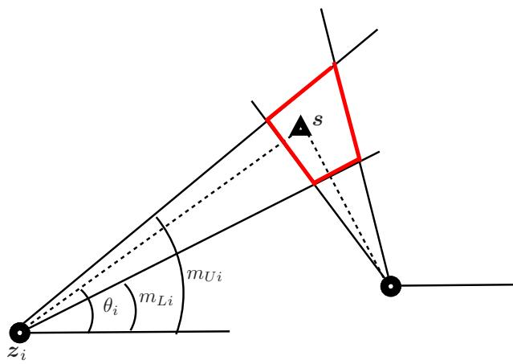
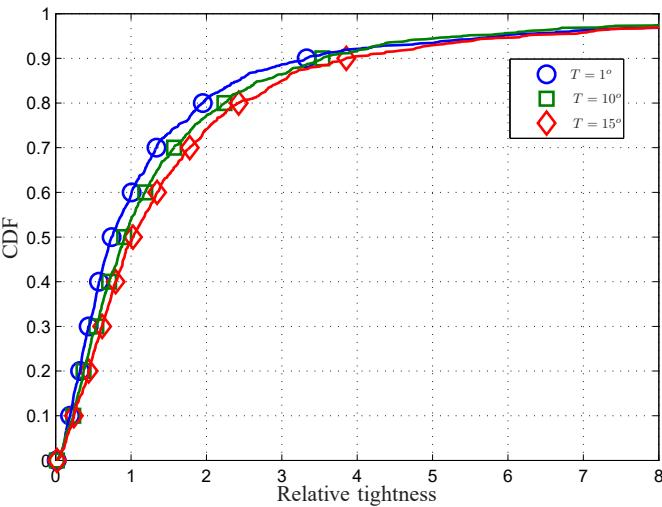
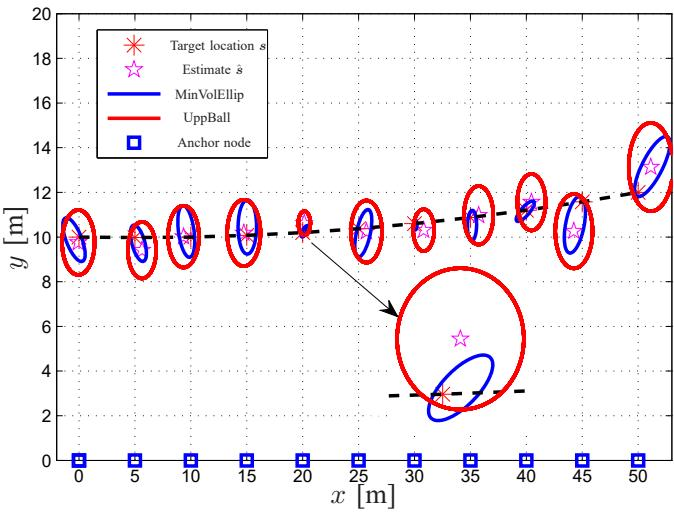

CHALMERS

# Chalmers Publication Library

Characterizing the Worst-Case Position Error in Bearing-Only Target Localization

This document has been downloaded from Chalmers Publication Library (CPL). It is the author´s version of a work that was accepted for publication in:

Workshop on Positioning, Navigation and Communication (WPNC)

Citation for the published paper:

Gholami, M. ; Gezici, S. ; Wymeersch, H. et al. (2015) "Characterizing the Worst-Case Position Error in Bearing-Only Target Localization". Workshop on Positioning, Navigation and Communication (WPNC)

Downloaded from: http://publications.lib.chalmers.se/publication/218784

Notice: Changes introduced as a result of publishing processes such as copy-editing and formatting may not be reflected in this document. For a definitive version of this work, please refer to the published source. Please note that access to the published version might require a subscription.

Chalmers Publication Library (CPL) offers the possibility of retrieving research publications produced at Chalmers University of Technology. It covers all types of publications: articles, dissertations, licentiate theses, masters theses, conference papers, reports etc. Since 2006 it is the official tool for Chalmers official publication statistics. To ensure that Chalmers research results are disseminated as widely as possible, an Open Access Policy has been adopted. The CPL service is administrated and maintained by Chalmers Library.

# Characterizing the Worst-Case Position Error in Bearing-Only Target Localization

Mohammad Reza Gholami♮, Sinan Gezici∗, Henk Wymeersch♭, Erik G. Str¨om♭, and Magnus Jansson♮

♮ ACCESS Linnaeus Center, Electrical Engineering, KTH–Royal Institute of Technology, Stockholm, Sweden

∗ Department of Electrical and Electronics Engineering, Bilkent University, 06800, Ankara, Turkey

♭ Department of Signals and Systems, Chalmers University of Technology, Gothenburg, Sweden

Emails: mohrg@kth.se, gezici@ee.bilkent.edu.tr, {henkw, erik.strom}@chalmers.se, janssonm@kth.se

Abstract—The worst-case position error provides valuable information for efficiently designing location based services in wireless networks. In this study, a technique based on a geometric approach is investigated for deriving a reasonable upper bound on the position error in bearingonly target localization. Assuming bounded measurement errors, it is first observed that the target node location belongs to a polytope. When a single estimate of the target location is available, the maximum distance from the estimate to extreme points of the polytope gives an upper bound on the position error. In addition, a technique based on outer approximation is proposed to confine the location of the target node to an ellipsoid. Simulation results show that the proposed upper bound is tight in many situations. It is also observed that the proposed techniques can be effectively used to derive sets containing the location of target nodes.

Index Terms– Angle of arrival (AOA), position error, upper-bound, outer-approximation, extreme points.

## I. INTRODUCTION

Position information plays a vital role for many location-aware services in next generation wireless systems [1]. In the absence of GPS signals, e.g., due to lack of access to GPS satellites in indoor-type scenarios, the position information can be extracted from a network consisting of a number of reference nodes at known locations via some type of measurements between different nodes such as time-of-flight or angle of arrival (AOA) [2]. In AOA-based localization, the angles estimated between a target and anchor nodes are used to estimate the location of the target node. Different algorithms, e.g., based on maximum likelihood or least squares, can be developed to estimate the location of the target node [3], [4].

Various approaches have been suggested to study the performance of positioning algorithms. For example under some regularity conditions on the distribution of measurement errors, the Cram´er-Rao lower bound (CRLB) provides a lower limit on the variance of any unbiased estimator [5]. It is noted that the CRLB and other performance metrics studied in the literature generally depends on the true location of the target node; hence, they may face some drawbacks for practical applications. In addition, available benchmarks such as the CRLB are useful in the statistical sense, i.e., on average. For example, if only a single estimate of the location is available, it is not clear how existing approaches can provide useful information [6].

Besides the lower bounds on the position estimation error, in some situations we may need to characterize the worst-case position error. The worst-case position error can be useful for designing and offering services in, e.g., position based recommender systems. In this study, we investigate the lowest tractable upper bound (in terms of complexity) on the position error based on a geometric interpretation. To do that, we consider a technique, originally investigated in the previous work for distance based positioning [6], [7], in which the target location is trapped to a closed bounded set (feasible set) and then an upper bound on a single position error is defined with respect to the feasible set. We formulate the problem of obtaining an upper bound on the position error as finding the maximum distance from the estimate to the feasible set, which is a nonconvex problem and in general might be difficult to solve. A relaxation technique can be used to solve the nonconvex problem. Alternatively, assuming the feasible region is bounded, we instead find the extreme points of the feasible set (a polytope) and caculate the maximum distance to those points. Using the estimate and an upper bound, we can also find a ball that contains the location of target node. In addition, when the extreme points of the polytope are available, we can also obtain a minimum volume ellipsoid containing the location of the target node.

In summary, the main contributions of this study are

• an extension of the idea of upper bound to AOAbased localization,

• an upper bound based on the maximum distance from a single estimate to the extreme points of a polytope derived from AOA measurements,

• a minimum volume ellipsoid covering the polytope that contains the location of the target node (without having any estimate of the target location).

The remainder of the paper is organized as follows.

Section II explains the signal model considered in this study. In Section III, an upper bound on the position error is investigated. Simulation results are presented in Section IV. Finally, Section V makes come concluding remarks.

## II. SYSTEM MODEL

Consider a 2D wireless network1 consisting of N anchor nodes located at $\begin{array} { r } { \boldsymbol { z } _ { i } = [ x _ { i } \ y _ { i } ] ^ { T } \in \mathbb { R } ^ { 2 } , i = 1 , \dots , N . } \end{array}$ The angle estimate between the anchor nodes and a target node at unknown location $\pmb { \mathscr { s } } = [ x _ { s } \ y _ { s } ] ^ { T } \in \mathbb { R } ^ { 2 }$ (in radians) is given by [8]

$$
\hat { \theta } _ { i } = \underbrace { \mathrm { a t a n } \frac { y _ { s } - y _ { i } } { x _ { s } - x _ { i } } } _ { \triangleq \theta _ { i } } + n _ { i } , \quad i = 1 , \dots , N\tag{1}
$$

where the measurement error $n _ { i }$ is modeled by some proper distributions [9].

Assumption 1: For the rest of the paper, we assume that $y _ { s } \geq y _ { i } ;$ hence $0 \leq \theta _ { i } \leq \pi .$

To avoid ambiguities due to noise, we modify the estimate in (1) as

$$
\hat { \theta } _ { i } = \operatorname* { m i n } \{ \pi , \operatorname* { m a x } \{ \breve { \theta } _ { i } , 0 \} \} , \quad i = 1 , \ldots , N .\tag{2}
$$

We also assume that the angle $\hat { \theta } _ { i }$ is computed with respect to a global coordinate systems, meaning that the orientation is known in every anchor node.

Based on AOA measurements in (1), we can develop a localization algorithm to estimate the location of the target node. Suppose an estimate of the target location, say $\hat { \boldsymbol { s } } ,$ is available. We are then interested in characterizing the position error defined by

$$
e ( \pmb { s } ) \triangleq \lVert \hat { \pmb { s } } - \pmb { s } \rVert .\tag{3}
$$

It is clear from (3) that the position error depends on the true unknown location $s ;$ hence, it may be difficult to characterize the position error. Instead, we may consider the worst-case position error. As mentioned earlier, the worst-case position error provides useful information for various location based services. To study the worst-case position error, we can consider the following optimization problem:

$$
\begin{array} { l } { \underset { w } { \mathrm { m i n i m i z e } } w } \\ { \mathrm { s u b j e c t ~ t o } ~ e ( s ) \leq w , } \\ { \quad \quad \quad \quad \quad \quad s \in \mathcal { S } , } \end{array}\tag{4}
$$

where $s$ is a feasible set containing the possible values of the location of the target node.

Determining a suitable feasible set in (4) can be quite challenging. We now consider a simple approach to obtain a useful feasible set S. We first make the following assumption [10].

Assumption 2: The measurement errors in (1) is assumed to be distributed over a bounded set, i.e., $\begin{array} { r l } { n _ { i } } & { { } \in { } } \end{array}$ $\{ L _ { i } , U _ { i } \}$

Assumption 2 implies that the measurement error in the AOA estimate in (1) cannot be arbitrarily large. This assumption can, at least approximately, be valid in some practical scenarios, e.g., in cases with high signal-to-noise ratios (SNRs).

We assume that the lower and upper bounds $L _ { i }$ and $U _ { i }$ are a priori known. If $L _ { i }$ and $U _ { i }$ are unknown, they can be estimated from measurements. For example, if there are multiple measurements $\hat { \pmb { \theta } } _ { i } ^ { k } , \ k = 1 , \ldots , \bar { K }$ (K is the number of AOA estimates in the anchor node i) and if K is sufficiently large, we can use the following approach to estimate $\boldsymbol { L } _ { i }$ and $U _ { i }$

$$
\hat { L } _ { i } = \operatorname * { m i n } _ { k } \bar { \hat { \theta } } _ { i } ^ { k } , \qquad \hat { U } _ { i } = \operatorname * { m a x } _ { k } \bar { \hat { \theta } } _ { i } ^ { k } ,\tag{5}
$$

where $\textstyle \bar { \hat { \theta } } _ { i } ^ { k } \triangleq \hat { \theta } _ { i } - ( 1 / K ) \sum _ { i = 1 } ^ { K } \hat { \theta } _ { i }$

From Assumption 2 and the relation in (1), we can conclude that

$$
\underbrace { \operatorname* { m a x } \{ \hat { \theta } _ { i } - U _ { i } , 0 \} } _ { \triangleq m _ { L i } } \leq \theta _ { i } \leq \underbrace { \operatorname* { m i n } \{ \hat { \theta } _ { i } - L _ { i } , \pi \} } _ { \triangleq m _ { U i } }\tag{6}
$$

meaning that the true $\theta _ { i }$ belongs to an interval defined by the estimate $\hat { \theta } _ { i }$ and bounds $\boldsymbol { L } _ { i }$ and $U _ { i }$

We first define the following halfplanes:

$$
\begin{array} { c }  { { \mathcal { H } } _ { i } ^ { L } \triangleq \left\{ \begin{array} { l } { { \displaystyle a _ { l i } ^ { T } s \geq b _ { l i } \mathrm { ~ i f ~ } m _ { L i } \leq \frac { \pi } { 2 } \& } } \\ { { \displaystyle a _ { l i } ^ { T } s \leq b _ { l i } \mathrm { ~ i f ~ } m _ { L i } \geq \frac { \pi } { 2 } \} } \end{array}  } } \\  {\right. { \mathcal { H } } _ { i } ^ { U } \triangleq \left\{ \begin{array} { l } { { \displaystyle a _ { u i } ^ { T } s \geq b _ { u i } \mathrm { ~ i f ~ } m _ { U i } \leq \frac { \pi } { 2 } \& } } \\ { { \displaystyle a _ { u i } ^ { T } s \leq b _ { u i } \mathrm { ~ i f ~ } m _ { U i } \geq \frac { \pi } { 2 } \} } \end{array}  } } \end{\right.array} \end{array}\tag{7}
$$

(8)

where

$$
\mathbf { \delta } \mathbf { a } _ { l i } \triangleq \left[ - \tan ( m _ { L i } ) \ 1 \right] ^ { T }
$$

$$
\mathbf { a } _ { u i } \triangleq [ - \tan ( m _ { U i } ) \ 1 ] ^ { T }\tag{9}
$$

$$
b _ { l i } - \triangleq \tan ( m _ { L i } ) x _ { i } + y _ { i }\tag{10}
$$

$$
b _ { u i } - \triangleq \tan ( { m _ { U i } } ) x _ { i } + y _ { i } .\tag{11}
$$

(12)

We then define the following set (cone):

$$
{ \cal { S } } _ { i } \triangleq \mathcal { H } _ { i } ^ { L } \bigcap \mathcal { H } _ { i } ^ { U } .\tag{13}
$$

From the expressions above, it is clear that the location of the target node belongs to the following convex set:

$$
s \in \mathcal { S } = \bigcap _ { i = 1 } ^ { N } S _ { i } .\tag{14}
$$

As an example, Fig. 1 shows how upper and lower bounds on the AOA estimate can help define a feasible set –a polytope– containing the location of the target node.

  
Fig. 1. An example of AOA localization. The feasible set defined by the red polytope contains the location of the target node.

Remark 1: It may happen that the polyhedron $\boldsymbol { \mathcal { S } }$ is unbounded, e.g., if the target is very far from anchor nodes. But if the target is close to anchor nodes, the polyhedron (polytope) S is closed.

Remark 2: Considering the polytope containing the location of target node, a simple positioning algorithm to obtain a coarse estimate of the location can be designed based on (serial or parallel) projection onto halfplanes $\mathcal { H } _ { i } ^ { L }$ and $\mathcal { H } _ { i } ^ { U }$ . Projection onto a halfspace is simple operation [11] and the resulting algorithm would be of low complexity [12].

## III. AN UPPER BOUND ON A SINGLE POSITION ERROR

We now employ the approach proposed in [6] to find an upper bound on the position error $e ( s )$ . Namely, we consider the following optimization problem:

$$
\begin{array} { r l r } { v _ { b } : } & { \mathrm { m a x i m i z e } \ : \left\| \pmb { s } - \hat { \pmb { s } } \right\| } \\ & { } & { \mathrm { s u b j e c t \ : t o \ : } s \in \displaystyle \bigcap _ { i = 1 } ^ { N } S _ { i } } \\ & { } & { \| s - z _ { i } \| \leq d _ { \operatorname* { m a x } } , \ : i = 1 , \ldots , N } \end{array}\tag{15}
$$

where a constraint is added based on the maximum distance from a target to an anchor node in order to make sure that the feasible region is bounded. Note that such a constraint makes sense in practice since for detecting and estimating the appearance of the target node and the AOA, respectively, we need a minimum level of SNRs, which in turn depends on the distance between two nodes. In fact, when the polytope is unbounded, the last constraint helps have a bounded solution. The optimal value $v _ { b }$ gives an upper bound on the position error, that $\mathrm { i s } , e ( s ) \le v _ { b }$

The problem in (16) is nonconvex and can be difficult to solve [13], [14]. One way to approximately solve the nonconvex problem in (16) is to employ a well-known convex relaxation technique. For details of the approach, see [6], [13].

We now assume that $\boldsymbol { \mathcal { S } }$ is bounded and use another approach to find an upper bound on the position error. Suppose the set of $k$ extreme points of the polytope are denoted by $\mathcal { P } = \{ p _ { 1 } , . . . , p _ { k } \}$ (the vertices of the polytope). It is easy to conclude that the worst-case position error with respect to the ploytope $s$ is given by

$$
v _ { b } = \operatorname* { m a x } _ { i } \| \hat { \pmb { s } } - \pmb { p } _ { i } \| .\tag{16}
$$

Note that finding the extreme points of the polytope S is not difficult if N is not large, specially for 2D networks. Now, if we form a ball with center sˆ and radius $v _ { b }$ , i.e.,

$$
B = \{ { \pmb x } \in \mathbb { R } ^ { 2 } \ | \ \| { \pmb x } - { \hat { \pmb s } } \| \leq v _ { b } \} ,\tag{17}
$$

we can conclude that $s \in B$

Another approach to find a set containing the location of the target node is to find the minimum volume ellipsoid containing the polytope S. To find the (L¨owner-John) ellipsoid, we consider an ellipsoid defined by [15], [16]

$$
\mathcal { E } = \{ \mathbf { { \boldsymbol { x } } } \ | \ \| \boldsymbol { B } \boldsymbol { x } + \boldsymbol { d } \| \leq 1 \}\tag{18}
$$

where B is a $2 \times 2$ symmetric positive definite matrix and $\mathbf { \pmb { d } } \in \mathbb { R } ^ { 2 }$ . The minimum volume ellipsoid is then computed by solving the following convex optimization problem [16]:

$$
\begin{array} { r l } & { \underset { \pmb { B } , \textbf { \textsc { d } } } { \operatorname { m i n i m i z e } } \quad \log \operatorname* { d e t } \pmb { B } ^ { - 1 } } \\ & { \mathrm { s u b j e c t ~ t o } \quad \| \pmb { B } \pmb { p } _ { i } + \pmb { d } \| \le 1 , \quad i = 1 , \dots , N } \end{array}\tag{19}
$$

It is noted that the sets in (17) and (19) are derived differently. For ball defined in (19), an estimate of the location is required, while for the second approach, $\mathrm { i . e . } .$ minimum volume ellipsoid, no prior estimate of the location is required. It is clear that the second approach is more complex than the first technique.

The performance of the proposed approaches is evaluated through computer simulations for a moving target in a 2D network.

## IV. SIMULATION RESULTS

In this section, we evaluate the performance of the proposed techniques for a network consisting of 11 anchor nodes at $z _ { i } = [ 5 ( i - 1 ) \ : 0 ] , \ : i = 1 , \ldots , 1 1$ and a target node moving on a trajectory according to a quadratic curve $y \ = \ 0 . 0 0 1 x ^ { 2 } - 0 . 0 1 x + 1 0$ . We consider a truncated Gaussian distribution over $[ - \pi T / 1 8 0 , \pi T / 1 8 0 ]$ radians dramatized with T degress. To find the extreme points, we first calculate all the crossing points between every pair of lines and then check which points belong to the intersection of halfplanes.

We set the variance of noise $n _ { i }$ equal to 1. In every position of the target, anchor nodes measure AOA and then a least squares (LS) technique is used to find an estimate of the location. For details of the LS algorithm, see, e.g., [17].

  
Fig. 2. The CDF of relative tightness for different noise interval.

To evaluate the tightness of the proposed technique, we consider the relative tightness as $\tau _ { v } \triangleq ( v _ { b } - e ( \pmb { s } ) ) / e ( \pmb { s } )$ [6]. We study the cumulative distribution function (CDF) of $\tau _ { v } ,$ i.e., Pr $\{ \tau _ { v } \le x \}$ . In the following, we generate $e ( s )$ from LS estimation.

Fig. 2 shows the relative tightness for different values of the lower and upper bound on the measurement noise. In every position of the target node, we consider 100 realization of measurement errors. As expected increasing the interval makes the feasible polytope S larger; hence the bound will be larger. As stated in [6], for a relatively fixed estimation error, the relative tightness degrades with increasing (the volume of) the intersection.

Fig. 3 shows how the location of the target node can be confined to feasible sets, a ball and an ellipsoid derived from the upper bound (UppBall) and the minimum volume ellipsoid (MinVolEllip). In this simulation, we set $T = 5$ . In general, MinVolEllip is smaller than UppBall. It is also observed that the geometry of the network plays an important role in the size of the intersection and consequently on the volumes of UppBall and MinVolEllip.

## V. CONCLUSIONS

In this study a technique has been investigated to find an upper bound on the position error. Assuming that measurement errors in AOA estimates are bounded, the location of the target node can be confined to the intersection of a number of halfplanes (a polytope). Then, the maximum distance from an estimate of the location to the polytope determines an upper bound on the position error. In addition, a minimum volume ellipsoid has been derived that contains the location of the target node. Simulation results show that the proposed bound is relatively tight in many situations.

  
Fig. 3. Moving target and feasible sets containing the location of target nodes via outer approximation and upper bound concept. The black dashed line shows the trajectory of the moving target.

## REFERENCES

[1] H. Celebi, I. Guvenc, S. Gezici, and H. Arslan, “Cognitive-radio systems for spectrum, location, and environmental awareness,” IEEE Antennas and Propagation Magazine, vol. 52, no. 4, pp. 41–61, 2010.

[2] G. Mao and B. Fidan, Localization Algorithms and Strategies for Wireless Sensor Networks. Information Science reference, Hershey. New York, 2009.

[3] A. H. Sayed, A. Tarighat, and N. Khajehnouri, “Network-based wireless location: challenges faced in developing techniques for accurate wireless location information,” IEEE Signal Process. Mag., vol. 22, no. 4, pp. 24–40, Jul. 2005.

[4] S. Gezici, “A survey on wireless position estimation,” Wireless Personal Communications, vol. 44, no. 3, pp. 263–282, Feb. 2008.

[5] S. Gezici, Z. Tian, G. B. Giannakis, H. Kobayashi, A. F. Molisch, H. V. Poor, and Z. Sahinoglu, “Localization via ultra-wideband radios: A look at positioning aspects for future sensor networks,” IEEE Signal Process. Mag., vol. 22, no. 4, pp. 70–84, Jul. 2005.

[6] M. R. Gholami, E. G. Str¨om, H. Wymeersch, and M. Rydstr¨om, “On geometric upper bounds for positioning algorithms in wireless sensor networks,” Signal Processing, vol. 111, pp. 179–193, 2015.

[7] M. R. Gholami, E. G. Str ¨om, H. Wymeersch, and S. Gezici, “Upper bounds on position error of a single location estimate in wireless sensor networks,” EURASIP Journal on Advances in Signal Processing, vol. 2014:4, no. 1, 2014.

[8] R. M. Vaghefi, M. R. Gholami, and E. G. Str¨om, “Bearing-only target localization with uncertainties in observer position,” in Proc. IEEE International Symposium on Personal, Indoor and Mobile Radio Communications (PIMRC), September 2010, pp. 238–242.

[9] M. Gavish and A. J. Weiss, “Performance analysis of bearing-only target location algorithms,” IEEE Transactions on Aerospace and Electronic Systems, vol. 28, no. 3, pp. 817–828, 1992.

[10] Y. He, A. Behnad, and X. Wang, “Accuracy analysis of the two-reference-node angle-of-arrival localization system,” IEEE Wireless Communications Letters, 2015.

[11] Y. Censor and S. A. Zenios, Parallel Optimization: Theory, Algorithms, and Applications. Oxford Unversity Press, New York, 1997.

[12] M. R. Gholami, M. Rydstr ¨om, and E. G. Str ¨om, “Positioning of node using plane projection onto convex sets,” in Proc. IEEE Wireless Communication and Networking Conference (WCNC), Apr. 2010.

[13] D. P. Palomar and Y. C. Eldar, Convex Optimization in Signal Processing and Communications. Cambridge University Press, 2010.

[14] A. Ben-Tal and A. Nemirovski, “Lectures on modern convex optimization,” 2012. [Online]. Available: http://www2.isye.gatech. edu/∼nemirovs/Lect ModConvOpt.pdf

[15] S. Boyd, L. E. Ghaoui, E. Feron, and V. Balakrishnan, Linear Matrix Inequalities in Systems and Control Theory. SIAM, Philadelphia, PA, June 1994, vol. 15 of Studies in Applied Mathematics.

[16] S. Boyd and L. Vandenberghe, Convex Optimization. Cambridge University Press, 2004.

[17] K. Ho and Y. Chan, “An asymptotically unbiased estimator for bearings-only and doppler-bearing target motion analysis,” IEEE Trans. Signal Process., vol. 54, no. 3, pp. 809–822, Mar. 2006.