# Mobile robot localization by multiangulation using set inversion

E. Colle ∗, S. Galerne

IBISC, University of Evry, France

a r t i c l e i n f o

Article history:   
Received 22 December 2011   
Received in revised form   
11 September 2012   
Accepted 21 September 2012   
Available online 13 October 2012   
Keywords:   
Robot mobile localization   
Interval analysis   
Inversion set   
Multisensory fusion   
Cooperative environment

## a b s t r a c t

This work is about solving the global localization issue for mobile robots operating in large and cooperative environments. It tackles the problem of estimating the pose of a robot in the environment using real-time data either from the robot on-board sensors or/and from the sensors in the environment or/and the realtime data coming from other robots. The paper focuses on the 3-DOF localization of a mobile robot that is to say the estimation of the robot coordinates $( \mathbf { x } _ { \mathrm { m r } } , \mathbf { y } _ { \mathrm { m r } } , \theta _ { \mathrm { m r } } )$ in a 2D-environment.

The interest of this method lies on the ability to easily integrate a large variety of sensors, from the roughest to the most complex one. The method takes into account the following constraints: a flexible number of measurements, generic goniometric measurements, a statistical knowledge on the measurements limited to the tolerance, and the fact the measurements are acquired both from the robot onboard sensors and the environment sensors. The approach is able to integrate a heterogeneous set of measurements; not only generic goniometric measurements but also range, position given by a tactile tile, complex shape, and dead reckoning measurements. The way that outliers and environment model inaccuracies can be taken into account is described.

The problem of nonlinear bounded-error estimation is viewed as a set inversion. The paper presents the theoretical formulation of the localization method in a bounded-error context and the parameter estimation based on interval analysis. Simulation results as well as real experiments show the interest of the method in a cooperative environment context.

© 2012 Elsevier B.V. All rights reserved.

## 1. Introduction

The ability of a mobile robot to perform various home services for human beings in cluttered or dynamically changing environment, involves a reliable robot localization. In the framework of ubiquitous robotics many studies have attempted to improve the accuracy of robot localization taking advantage of sensor networks. Works are divided into three approaches: localization based on homogeneous sensor networks, localization based on hybrid sensor networks and localization based on sensor networks and onboard robot sensors. As an example of robot localization based on homogeneous sensor networks, Zhang et al. [1] exploited a distributed sensor network using infrared sensors. The infrared sensors were suspended from the ceiling. Han et al. [2] proposed a localization system for mobile agents using passive RFID tags that were arranged on the floor of an indoor space. Other authors like Shenoy and Tan [3]addressed the localization algorithm for wireless sensors in a hybrid sensor network. For accurate localization, the existing research might fuse sensor networks and general sensors. Choi [4,5] proposes a localization scheme based on RFID and Sonar fusion systems. At last robot localization can be based on sensor homogeneous or hybrid sensor networks and onboard robot sensors [6].

The paper addresses the global localization task for mobile robots operating in an indoor cooperative environment. When a set of sensors is deployed in the environment, robots and sensors build a cooperative network robot space. Global localization refers to the problem of estimating the position of a robot in the reference frame, $( x _ { \mathrm { m r } } , y _ { \mathrm { m r } } , \theta _ { \mathrm { m r } } )$ , given the real-time data from the robot onboard sensors and the real-time data coming from sensors in the environment. One of the difficulties is to determine and model measurement errors. The precise characterization of the errors is conceivable in a laboratory but not on a large scale in the framework of cooperative network space. The number and the diversity of sensors are obviously a difficulty for such specific characterization. The errors are usually expressed in terms of stochastic uncertainty models. Due to incomplete information about the measurement process, a stochastic error approach is questionable. Brahim-Belhouari et al. [7] propose an alternative. The measurement error is no longer considered as a random variable with known probability density function but assumed as bounded between lower and upper values. The set representation is thus poorer but it allows easier calculations on the random variables. It requires less statistical knowledge on the variables and makes it possible to treat a much larger class of problems. When the error of measurement on experimental data is known only in the form of a tolerance, which is often the case for the sensors or the network of sensors used in house automation and more generally in the context of ambient intelligence, the set approach is a wellsuited approach. On the contrary and moreover if the problem is a linear and Gaussian problem, this approach is not justified because it is well solved by probabilistic approaches.

Among the classes of problems which can be solved by the set approach, one finds the algorithms branch and bound for solving non-linear problems. The set approach gives a guaranteed result i.e. the solution surely contains the value. The set approach remains little used in the field of mobile robotics. Jaulin et al. [8] was interested in the localization of a robot starting from measurements of ultrasonic sensors by using the interval analysis and by proposing a treatment of the outliers under certain conditions. Drocourt [9] uses the interval analysis for modelling inaccurate measurements of two omnidirectional sensors. This work only uses the measurements provided by onboard sensors for robot localization. This idea has been applied by Lévêque et al. [10] for locating a vehicle with inaccurate telemetric data. More recently, in the field of urban vehicles, works use various sources of outside or onboard measurements. Gning [11] was interested in multisensor fusion by propagation of constraints on the intervals of measurement provided by the hybridization of a GPS, a gyrometer and an odometer. Drevelle and Bonnifait [12] focused on the robustness of set methods in presence of outliers for multi-sensory localization. Our solution is based on works of [8], more precisely on the algorithm RSIVIA which allows the calculation of solutions by tolerating a number q of outliers [13] describes an application of Quimper, a powerful tool able to solve without approximations a set of non-linear equations such as the hyperbolic equations using in the localization of a mobile device, thanks to the interval analysis and the programming of specific contractors. The formalism of Quimper can easily integrate various approaches of localization such as multilateration or goniometry. Although the advantages of the probabilistic methods, by far the most used and the best known ones, we have chosen a boundederror approach based on the interval analysis for the following reasons.

The only assumption to verify is that all the errors are bounded. The respect of this assumption is difficult to prove but there are techniques to reject outliers [14]. If this assumption is verified, then the result is guaranteed. Moreover, as the dimension of the state vector, in our case the x and y position and the orientation of the robot, is equal to three, the data processing is relatively simple and fast. Lambert et al. [15] presents a bounded-error state estimation (BESE) to the localization problem of an outdoor vehicle. Authors claim that the biggest advantage of the BESE approach is the ability to solve the localization problem with better consistency than the Bayesian approach such as particle filters. Experiments point out that the particle filter can locally converge towards a wrong solution due to bias measurements which lead to a huge local inconsistency. Similar experiments with an Extended Kalman Filter (EKF) show the same phenomenon. EKF strongly underestimates its covariance matrix in the presence of repeated biased measurements.

The efficiency and accuracy of the particle filter depends mostly on the number of particles. If the imprecision, i.e. bias and noise, in the available data is high, the number of particles needs to be very large in order to obtain good performances. This may give rise to complexity problems for a real-time implementation [16].

In the context of bounded-error, the paper proposes a localization method based on interval analysis, able to solve the global localization problem in the framework of a cooperative ambient environment. The method takes account of:

– a flexible number of measurements;

– generic goniometric measurements;

– no statistical knowledge about the inaccuracy of measurements, only an admissible interval specified by lower and upper values. The interval is deduced from the sensor tolerance given by manufacturers;

– measurements both coming from the robot onboard sensors and from the home sensors.

One can add that the algorithm is able to provide a result of localization as soon as only one measure is available.

The paper is organized as follows. Section 2 describes the principles of the localization method based on multiangulation specifying the main assumptions. Section 3 briefly introduces interval analysis and set inversion. Section 4 presents the algorithm for the robot localization in the framework of a sensor network. Moreover we show that the approach is able to integrate a heterogeneous set of measurements not only generic goniometric measurements but also range, position given by a tactile tile, complex shape, and dead reckoning. We also explain how to handle certain types of outliers and environment model inaccuracies. The simulation and experimental results are respectively described in Sections 5 and 6.

## 2. Problem statement

The objective of our work is the localization of a mobile robot by using measurements available at a given moment and the a priori known co-ordinates of the markers or the sensors. The goal is not the building of an environment map but the localization of an assumed-lost robot. The environment is modelled by the coordinates of the home markers seen by the robot onboard sensors and by the co-ordinates of the home sensors able to detect the robot. The markers and the sensors are known by their identifier which makes it possible to establish their location in the building.

The localization process is divided into two steps. The first step consists in finding the room of the building in which the robot is located by using the specific identifier associated to each measure. As said before all sensors and markers are labelled by a specific identifier and associated to one room of the building. The second step localizes the robot inside the room by the set approach described below.

The robot localization is computed from several angular measurements by multiangulation. Measurements are provided either by robot onboard sensors or/and by home sensors. Onboard robot sensors detect markers located in the environment. Markers can be either RFID tags or visual tags such as Datamatrix, or reference images. On the contrary, what we call home sensors are able to detect the robot and are fixed on a wall, a ceiling or a corner of the rooms. Whatever sensors, the measurement model can be represented by a cone inside which the presence of the robot is guaranteed. This model is simple enough for including a large variety of bearing sensors such presence detector, laser and US telemeters, camera, RFID . . . .

In the context of the bounded-error method, a measurement $\lambda _ { i }$ is defined by an interval bounded by the lower and upper limits:

$$
\left[ \lambda _ { i } \right] = \left[ \lambda _ { i } - \Delta \lambda _ { i } , \lambda _ { i } + \Delta \lambda _ { i } \right] .\tag{1}
$$

The variables to be estimated are the components of the state vector x

$$
{ \bf x } = ( x _ { R } , y _ { R } , \theta _ { R } ) ^ { \mathrm { T } }\tag{2}
$$

which defines the position and orientation of the robot relatively to the reference frame $R _ { e }$ of the environment (Fig. 1).

The coordinates of the environment markers $M _ { j } = ( x _ { j } , y _ { j } )$ and the coordinates and orientation of the environment sensors $C _ { j } =$ $( x _ { j } , y _ { j } , \theta _ { j } )$ are supposed to be known, to be precise the tolerance interval is restricted to a single point, for the sake of readability.

b  
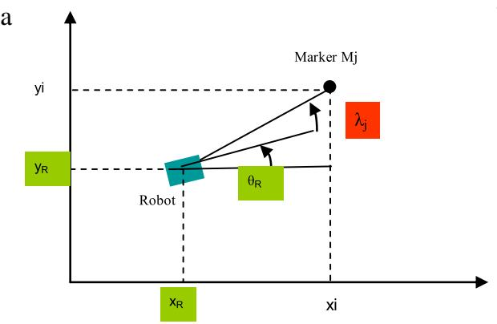

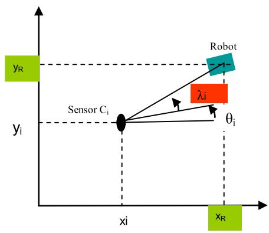  
Fig. 1. (a) Measurement from onboard robot, (b) Measurement from environment sensor $C _ { i } .$

However the method we propose can easily take into account inaccuracies on the marker and sensor coordinates.

In our case the problem can be described by two types of equations. On one hand (Fig. 1(a)), if a robot sensor detects an environment mark $M _ { i } ,$ the measurement depends on the marker coordinates $M _ { i } ( x _ { i } , y _ { i } )$ and the state vector.

$$
\lambda _ { i } = t g ^ { - 1 } \left( \frac { y _ { R } - y _ { i } } { x _ { R } - x _ { i } } \right) - \theta _ { R } .\tag{3}
$$

In the other hand (Fig. 1(b)), if the robot is detected by an environment sensor $C _ { i } ,$ the measurement depends on the sensor coordinates and orientation $C _ { j } ( x _ { j } , y _ { j } , \theta _ { j } )$ and the state vector.

$$
\lambda _ { j } = t g ^ { - 1 } \left( \frac { y _ { R } - y _ { j } } { x _ { R } - x _ { j } } \right) - \theta _ { j } .\tag{4}
$$

The state vector $\mathbf x = ( x _ { R } , y _ { R } , \theta _ { R } ) ^ { \mathrm T }$ is then to be estimated from the M observations $\pmb { \lambda } = ( \lambda _ { 1 } , \dots , \lambda _ { M } )$ with the associated bounded errors $[ \pmb { \lambda } ] = ( [ \lambda _ { 1 } ] , \dots , [ \lambda _ { M } ] )$ and the known data $\mathbf { x } _ { i } = ( x _ { i } , y _ { i } )$ and $\mathbf { x } _ { j } = ( x _ { j } , y _ { j } , \theta _ { j } )$

Estimating state vector x consists in looking for the set S of all admissible values of x that are consistent with Eq. (3) and/or (4) and (1).

In summary, the principal characteristics of the problem are:

– A set of nonlinear equations.

– Two or three unknown parameters $( x _ { R } , y _ { R } )$ and $\theta _ { R } .$

– An adaptable number of measurements.

– A bounded error modelling.

– The initial domain of the parameters can be large.

– Real time constraint (less than one second).

## 3. Set inversion for estimating parameter set

Interval analysis [19] is based on the idea of enclosing real numbers in intervals and real vectors in boxes. The analysis by intervals consists in representing the real or integer numbers by intervals which contain them. This idea allowed algorithms whose results are guaranteed, for example for solving a set of non-linear equations [18,20].

An interval [x] is a set of IR which denotes the set of real interval

$$
[ x ] = \{ x \in \mathrm { I R } | x ^ { - } \leq x \leq x ^ { + } , x ^ { - } \in \mathrm { I R } , x ^ { + } \in \mathrm { I R } \} .\tag{5}
$$

$x ^ { - }$ and $x ^ { + }$ are respectively the lower and upper bounds of [x].

The classical real arithmetic operations can be extended to intervals if $\diamond \in \{ + , - , * , /$ , min, max} and if [x] and [y] are two intervals then

$$
[ x ] \diamond [ y ] = [ \{ x \diamond y | x \in [ x ] , y \in [ y ] \} ] .\tag{6}
$$

Elementary functions also can be extended to intervals.

Given $f : \mathsf { I R } \to \mathsf { I R }$ , such as $f \in$ {cos, sin, arctan, sqr, sqrt, log, $\exp , \ldots \}$ , its interval inclusion $[ f ] ( [ x ] )$ is defined on the interval [x] as follow:

$$
[ x ] \to [ f ] ( [ x ] ) = [ \{ f ( x ) | x \in [ x ] \} ] .\tag{7}
$$

An easy way to compute a natural inclusion function of $f$ is to replace each variable and operator or function by their interval counterparts, for instance [arctan] $| ( [ 0 , + \infty [ ) = [ 0 , \pi / 2 [ .$

Let a function f : $\boldsymbol { \mathrm { I R } } ^ { n }  \boldsymbol { \mathrm { I R } } ^ { m }$ . The interval function $[ \mathbf { f } ] : \mathrm { I R } ^ { n } $ $\boldsymbol { \mathrm { I R } } ^ { m }$ is an inclusion function for f if

$$
\forall [ \mathbf { x } ] \in \mathrm { I R } ^ { n } , \quad f ( [ \mathbf { x } ] ) \subset [ f ] ( [ \mathbf { x } ] )\tag{8}
$$

with IR is the set of real intervals and $\boldsymbol { \mathrm { I R } } ^ { n }$ , the set of n-dimensional boxes.

The minimal inclusion function for ${ \bf f } , [ { \bf f } ] ^ { * }$ is defined as such as for any $[ \mathbf { x } ] , [ \mathbf { f } ] ^ { * } ( [ \mathbf { x } ] )$ is the smallest box that includes $\mathbf { f } ( [ \mathbf { x } ] )$

In addition, if f is only composed of continuous operators and functions and if each variable appears at most once in the expression of f , then the natural inclusion function of f is minimal. The periodical functions such as trigonometric functions require specific treatment. The inclusion function is evaluated by dividing f into a continuous set of monotonic subfunctions.

A subpaving of a box [x] is the union of non-empty and nonoverlapping subboxes of [x]. A guaranteed approximation of a compact set can be bracketed between an inner subpaving $X ^ { - }$ and an outer subpaving $X ^ { + }$ such as $X ^ { - } \subset X \subset X ^ { + }$

Set inversion is the characterization of

$$
X = \{ \mathbf { x } \in \mathrm { I R } ^ { n } | \mathbf { f } ( \mathbf { x } ) \in Y \} = \mathbf { f } ^ { - 1 } ( Y ) .\tag{9}
$$

For any $Y \subset \mathbf { I R } ^ { n }$ and for any function f admitting a convergent inclusion function [f], two subpavings $X ^ { - }$ and $X ^ { + }$ can be obtained with the algorithm SIVIA (Set Inverter Via Interval Analysis). To check if a box [x] is inside or outside X, two tests are used:

I ${ \mathrm { f } } [ f ] ( [ \mathbf { x } ] ) \subset Y$ then [x] is feasible.

I $\operatorname { f } \left[ f \right] ( [ \mathbf { x } ] ) \cap Y = \varnothing$ then [x] is unfeasible.

Else [x] is ambiguous, that is feasible, unfeasible.

Boxes for which these tests failed are bisected except if they are smaller than a required accuracy ε. In this case, boxes remain ambiguous and are added to the 1X subpaving of ambiguous boxes. The outer subpaving is $X ^ { + } = X ^ { - } \cup \Delta X$ . The box is assumed to enclose the solution set X.

The inversion set algorithm can be divided into three steps:

– Select the prior feasible box [x ] assumed to enclose the solution set X;

– Determine the state of a box, feasible, unfeasible or ambiguous;

– Bisect box for reducing $\Delta X .$

<table><tr><td rowspan=1 colspan=2>Algorithm #1 SIVIA ([x0])</td></tr><tr><td rowspan=1 colspan=1>1</td><td rowspan=1 colspan=1> $\overline { { \textnormal { f } ( [ \pmb { f } ] ( [ \mathbf { x } _ { 0 } ] ) \subset Y ) } }$ [x0] is feasible;</td></tr><tr><td rowspan=1 colspan=1>2</td><td rowspan=1 colspan=1>else if [f ]([x0]) ∩ Y = , [x0] is unfeasible;</td></tr><tr><td rowspan=1 colspan=1>3</td><td rowspan=1 colspan=1>else if $( \omega ( [ \mathbf { x } _ { 0 } ] < \varepsilon )$ , [x0] is ambiguous;</td></tr><tr><td rowspan=1 colspan=1>4</td><td rowspan=1 colspan=1>else</td></tr><tr><td rowspan=1 colspan=1>5</td><td rowspan=1 colspan=1>bisect $[ \mathbf { x } _ { 0 } ] , [ \mathbf { x } _ { 1 } ] , [ \mathbf { x } _ { 2 } ] ) ;$ </td></tr><tr><td rowspan=1 colspan=1>6</td><td rowspan=1 colspan=1>SIVIA([x1]);</td></tr><tr><td rowspan=1 colspan=1>7</td><td rowspan=1 colspan=1>SIVIA([x2]);</td></tr><tr><td rowspan=1 colspan=1>8</td><td rowspan=1 colspan=1>endif</td></tr><tr><td rowspan=1 colspan=1>9</td><td rowspan=1 colspan=1>endif</td></tr><tr><td rowspan=1 colspan=1>10</td><td rowspan=1 colspan=1>endif</td></tr></table>

This recursive algorithm ends when ω[x] < ε. The number N of bisection is less than

$$
N = \left( \frac { \omega \left( | x _ { 0 } | \right) } { \varepsilon } + 1 \right) ^ { n }\tag{10}
$$

with $\left[ \mathbf { x } _ { 0 } \right]$ the prior feasible box and n the dimension of the vector [x]. Since in the case of the mobile robot localization the dimension of [x] is three, the solution can be computed with respect to real time.

## 4. Application to mobile robot localization

## 4.1. Generic goniometric measurements

Equations.

Type $\begin{array} { r } { \mathsf { l } \colon \lambda _ { j } = t g ^ { - 1 } \left( \frac { y _ { R } - y _ { j } } { x _ { R } - x _ { j } } \right) - \theta _ { j } } \end{array}$ with $( x _ { j } , y _ { j } )$ and $\theta _ { j }$ the coordinates and orientation of the sensor $C _ { j }$ in the reference frame $R _ { e }$ of the environment.

Type $\begin{array} { r } { 2 \colon \lambda _ { i } = t g ^ { - 1 } \left( \frac { y _ { R } - y _ { i } } { x _ { R } - x _ { i } } \right) - \theta _ { R } } \end{array}$ with $( x _ { i } , y _ { i } )$ , the marker coordinates in the reference frame $R _ { e }$ of the environment.

$$
\begin{array} { r } { M o d e l { : } f ( \mathbf { x } ) = t g ^ { - 1 } ( \frac { y _ { R } - y _ { j } } { x _ { R } - x _ { j } } ) - \theta _ { i } \operatorname { o r } f ( \mathbf { x } ) = t g ^ { - 1 } ( \frac { y _ { R } - y _ { i } } { x _ { R } - x _ { i } } ) - \theta _ { R } . } \end{array}
$$

Parameters: ${ \bf x } = ( x _ { R } , y _ { R } ) ^ { \mathrm { T } } { \bf \delta o r } { \bf x } = ( x _ { R } , y _ { R } , \theta _ { R } ) ^ { \mathrm { T } }$ and [x]: the prior feasible box assumed to enclose the solution set X.

Known data: $\mathbf { x } _ { i } = ( x _ { j } , y _ { j } , \theta _ { j } ) ^ { \mathrm { T } } \operatorname { o r } \mathbf { x } _ { i } = ( x _ { i } , y _ { i } ) ^ { \mathrm { T } } .$

Measurements: $\lambda _ { 1 } , \lambda _ { 2 } , \ldots , \lambda _ { m }$ with their associated upper and lower bounds: $[ \lambda _ { 1 } ] , [ \lambda _ { 2 } ] , \ldots , [ \lambda _ { m } ]$

$$
f ( \mathbf { x } , \mathbf { x } _ { m } ) \in [ \lambda _ { i } ] \}
$$

$$
\operatorname { L e t } s e t F ( \pmb { \operatorname { \mathbf { p } } } ) = ( f ( \pmb { \mathbf { x } } , \pmb { \mathbf { x } } _ { 1 } ) f ( \pmb { \mathbf { x } } , \pmb { \mathbf { x } } _ { 2 } ) f ( \pmb { \mathbf { x } } , \pmb { \mathbf { x } } _ { m } ) ) ^ { \mathrm { T } } .
$$

$$
\mathrm { T h e n } S = [ { \bf p } ] \cap F ^ { - 1 } ( { \bf p } ) .
$$

The characterization of S can be done by SIVIA. The main issue of the inclusion test is the evaluation of the inclusion function of the arctangent.

<table><tr><td rowspan=1 colspan=2>Algorithm #2 Inclusion test $( [ \mathbf { x } ] , [ \lambda _ { i } ] , \mathbf { x } _ { i } , t _ { i } )$ </td></tr><tr><td rowspan=1 colspan=1>1</td><td rowspan=1 colspan=1> $\mathrm { i f } ( [ { \pmb f } ] ( [ { \bf x } ] , { \bf x } _ { i } , t _ { i } ) \subset [ \lambda _ { i } ] ) , [ { \bf x } ]$ is feasible;</td></tr><tr><td rowspan=1 colspan=1>2</td><td rowspan=1 colspan=1>else if $( [ f ] ( [ \mathbf { x } ] , \mathbf { x } _ { i } , t _ { i } ) \cap [ \lambda _ { i } ] = \emptyset )$ , [x] is unfeasible;</td></tr><tr><td rowspan=1 colspan=1>3</td><td rowspan=1 colspan=1>else [x] is ambiguous;</td></tr><tr><td rowspan=1 colspan=1>4</td><td rowspan=1 colspan=1>endif</td></tr><tr><td rowspan=1 colspan=1>5</td><td rowspan=1 colspan=1>endif</td></tr></table>

$f ( { \bf x } ) = t g ^ { - 1 } ( { \bf x } )$ is a discontinuous function on the interval [0, 2π]. The estimation of the arctangent inclusion function takes into account both the discontinuities and the border effects due to the fact we manipulate intervals and not values. If we want to consider most cases, the range of angular measurement can be $\lambda _ { i } \in [ 0 , 2 \pi ]$ and $\Delta \lambda _ { \operatorname* { i m a x } } = \pi / 2$ . Indeed, a presence detector can cover an angular sector up to π radians.

For each available measure $\lambda _ { i } ,$ the inclusion test is done using data associated to $\lambda _ { i } .$ The test fusion is based on the following rule:
<table><tr><td rowspan=1 colspan=2>Algorithm #3 Fusion rule of n inclusion tests</td></tr><tr><td rowspan=1 colspan=1>1</td><td rowspan=1 colspan=1>= $\overline { { \dot { \mathbf { \Psi } } ( T _ { 1 } = = T _ { 2 } = = \cdots = = T _ { n } ) } } ,$ ,Fusion $\mathrm { t e s t } = T _ { 1 } ;$ </td></tr><tr><td rowspan=1 colspan=1>2</td><td rowspan=1 colspan=1>else if $( T _ { 1 } = = \mathrm { u n f e a s i b l e } ) \ : 0 \mathrm { r } \ldots 0 \mathrm { r }$  $( T _ { n } = = \mathrm { u n f e a s i b l e } ) , \mathrm { F u s i o n t e s t } = \mathrm { u n f e a s i b l e } ;$ </td></tr><tr><td rowspan=1 colspan=1>3</td><td rowspan=1 colspan=1> ${ \mathrm { e l s e ~ F u s i o n . t e s t } } = { \mathrm { a m b i g u o u s } } ;$ </td></tr><tr><td rowspan=1 colspan=1>4</td><td rowspan=1 colspan=1>endif</td></tr><tr><td rowspan=1 colspan=1>5</td><td rowspan=1 colspan=1>endif</td></tr></table>

This rule leads to rejecting the result of the algorithm when outliers exist. For processing outliers the fusion rule must be modified as explained below.

## 4.2. Outlier processing

An outlier is a measurement inconsistent with respect to the bounded-error model. If we assume one outlier in a set of three goniometric measurements, we can consider four cases. In the first one the solution is the empty set, there is no common intersection.

In the last two cases, there is a non-empty intersection (Fig. 2). However in Fig. 2(b), the sensor $C _ { 3 }$ provides an undetectable error which leads to an erroneous robot localization. This drawback can be removed by relaxing a given number of q constraints [13]. In the previous example under the assumption that one among three measurements could be erroneous, the algorithm returns the set of solutions well-matched with at least two measurements (Ellipses in Fig. 2(c) and (d)). The principle can be generalized to q potential inconsistent measurements. The main weakness of relaxation is that it generates a larger and possibly discontinuous set of solutions. An application of the principle is given in [17]. In Section 6, some experimental results illustrate the relaxation principle.

## 4.3. Heterogeneous measurement

The approach can take into account a heterogeneous set of measurements. The inclusion test is the same as in the algorithm #2. It only requires another inclusion function well suited to the measurement type as shown in Table 1. Examples are taken from home automation sensors.

The algorithm #2 selects the right inclusion function thanks to the identifier associated to the sensor. The identifier defines the type of measurement. Combining several measurements is performed by the algorithm #3.

Fig. 3 shows the features of three types of measurement with the additional inaccuracy. A ring for goniometric measurement (Fig. 3(a)), a ring and a cone for goniometric and range measurement (Fig. 3(b)) and a square band for tactile tile (Fig. 3(c)).

## 4.4. Processing of environment model inaccuracies

The forward–backward contractor method uses a set of variables represented by interval domains with constraints such as equations [19]. All equations or equation systems are available even not invertible ones. Variables may be as well, well-known input variables as unknown output variables, because all variables are processed in the same way. The forward–backward contractor is based on constraint propagation. This contractor makes it possible to contract the domains in order to progress towards the solution and calculate the output variables (note that input variables may be also contracted depending on the measurement tolerance of some input variables); this process is driven by taking into account any one of the constraints, proceeding by intersection of intervals. The aim of propagation technique is to contract as much as possible the domains of the variables without loosing any solution.

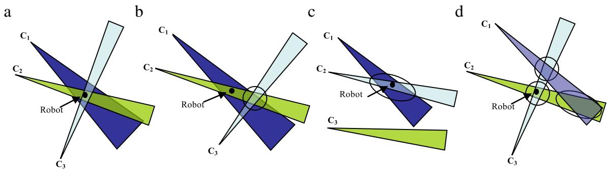

Fig. 2. (a) Correct measurements, (b) undetectable error, (c) one effective outlier, inconsistent measurements.  
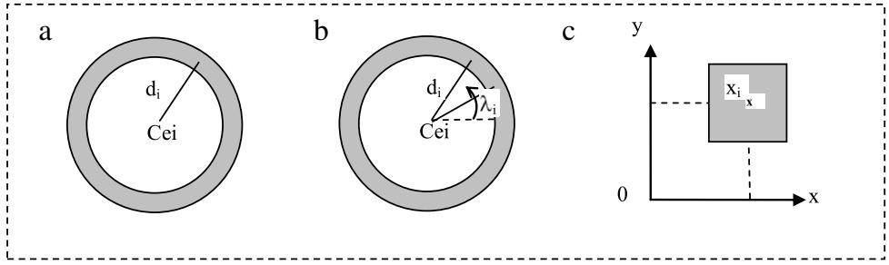  
Fig. 3. Measurement type: (a) Range. (b) Goniometric and range. (c) Tactile tile.

Example of inclusion functions for heterogeneous set of measurements.
<table><tr><td>Type of measurement</td><td>Measurement</td><td>Measurement model</td><td>Inclusion test</td></tr><tr><td>Goniometric (Fig. 1)</td><td> $\mathsf { A n g l e } \lambda _ { i } \thinspace 0 \Gamma \lambda _ { j }$ </td><td> $\begin{array} { r } { \pmb { f } _ { i } ( \mathbf { x } ) = t g ^ { - 1 } \left( \frac { y _ { R } - y _ { j } } { x _ { R } - x _ { j } } \right) - \theta _ { i } \mathrm { o r } } \end{array}$   $\begin{array} { r } { { \pmb f } _ { j } ( { \bf x } ) = t g ^ { - 1 } \left( \frac { y _ { R } - y _ { i } } { x _ { R } - x _ { i } } \right) - \theta _ { R } } \end{array}$ </td><td> $[ { \pmb f } ] ( [ { \pmb x } ] , [ { \pmb x } _ { i } ] ) \subset [ \lambda _ { i } ] \mathrm { o r } [ { \pmb f } ] ( [ { \pmb x } ] , [ { \pmb x } _ { j } ] ) \subset [ \lambda _ { j } ] .$  With x; the environment sensor coordinates and x the marker coordinates</td></tr><tr><td>Range  $( \mathrm { F i g . } 3 ( \mathsf { a } ) )$ </td><td>Range di</td><td> $\pmb { g } ( \mathbf { x } ) = \sqrt { \left( x _ { R } - x _ { j } \right) ^ { 2 } + \left( y _ { R } - y _ { j } \right) ^ { 2 } }$ </td><td> $[ \pmb { g } ] ( [ \mathbf { x } ] , [ \mathbf { x } _ { i } ] ) \subset [ d _ { i } ]$ </td></tr><tr><td>Goniometric and range from the same view point (Fig. ()</td><td> $\mathsf { A n g l e } \lambda _ { i } \thinspace 0 \Gamma \lambda _ { j }$  and range </td><td> $( f _ { i } ( \mathbf { x } ) \operatorname { o r } { } f _ { j } ( \mathbf { x } ) ) \operatorname { a n d } g ( \mathbf { x } )$ </td><td> $( [ \pmb { f } ] ( [ \mathbf { x } ] , [ \mathbf { x } _ { i } ] ) \subset [ \lambda _ { i } ] \operatorname { o r } [ \pmb { f } ] ( [ \mathbf { x } ] , [ \mathbf { x } _ { j } ] ) \subset [ \lambda _ { j } ] )$  and [g](x], [xi]) ⊂ [di]</td></tr><tr><td>Dead reckoning</td><td> $\Delta x _ { i } , \Delta y _ { i } , \Delta \theta _ { i }$ </td><td> $x _ { R n } = x _ { R n - 1 } + \Delta x _ { n } , y _ { R n } = y _ { R n - 1 } + \Delta y _ { n } , \theta _ { R n } =$   $\theta _ { R n - 1 } + \Delta \theta _ { n } \mathrm { a t t i m e } n \mathrm { a n d } n - 1 , 5 \mathrm { e e } [ 1 5 ]$ </td><td> $[ { \bf x } _ { n } ] \subset [ { \bf x } _ { n - 1 } ] + [ \Delta { \bf x } _ { n } ]$ </td></tr><tr><td>Tactile tile (Fig. 3(c))</td><td> ${ \mathrm { C e n t r e } } \thinspace { \mathrm { C o o r d i n a t e s } } ; \thinspace C _ { e } ( x _ { i } , y _ { i } )$ </td><td> $x _ { i } = x _ { R } , y _ { i } = y _ { R }$ </td><td> $[ \mathbf { x } ] \subset [ \mathbf { x } _ { i } ]$ </td></tr><tr><td>Door crossing detector</td><td> $C _ { e i } ( x _ { i } , y _ { i } ) { \mathrm { ~ } } ( s { \mathrm { a m e ~ c a s e ~ a s ~ a ~ } }$  narrow tactile tile</td><td> $x _ { i } = x _ { R } , y _ { i } = y _ { R }$ </td><td> $[ \mathbf { x } ] \subset [ \mathbf { x } _ { i } ]$ </td></tr><tr><td>Complex shape</td><td> $\{ C _ { e i } ( x _ { i } , y _ { i } ) \} \mathrm { f o r } i = 1 \mathrm { t o } n . \mathrm { T h e }$  shape is divided into a set of</td><td> $\mathrm { f o r } i = 1 \mathrm { t o } n , x _ { i } = x _ { R } , y _ { i } = y _ { R }$ </td><td> $\mathrm { f o r } i = 1 \mathrm t 0 n , \mathrm { [ } \mathbf { x } \mathrm { ] } \subset \mathrm { [ } \mathbf { x } _ { i } \mathrm { ] }$ </td></tr><tr><td>GPS</td><td>tactile tiles See [17].</td><td></td><td></td></tr></table>

Consider n variables $x _ { 1 } , \ldots , x _ { n }$ linked by m constraints $C _ { 1 } , \ldots , C _ { m }$ . For each variable $x _ { i } ,$ it is assumed that a prior feasible domain $[ x _ { i } ] = [ x _ { i } ^ { - } , x _ { i } ^ { + } ]$ is known. This domain may be equal to $\mathrm { \Phi } ] - \infty , + \infty [$ if no information is available on x . Interval algebra requiring adapted functions, the constraints must be decomposed into primitive constraints, increasing the number of equations and of variables. Then each constraint is calculated according to each variable using interval intersection. Necessarily, the interval length will decrease. This operation is repeated forward and backward until no more significant contraction can be performed. It can be noted that contraction is a quick method which in some cases can slow down or even stop the localization process before obtaining the desired accuracy. Contraction has to be completed by the bisection method.

This method is able to treat a set of heterogeneous measurement by introducing each measurement equation as a new constraint. We have added a forward–backward contractor step to the bisection algorithm #2 so as to reduce the solution space and so the computing time.

Moreover the method can reduce the environment model inaccuracies. In our case, we assume that home sensors or markers have been initially approximately located in the home reference frame. The interval domain associated to their coordinates can be reduced with further measurements, either online while detecting outliers, or offline during a learning phase. This is obtained by the typical process of the forward–backward contractor which decreases all interval domains of each variable, input variable as well as output variable.

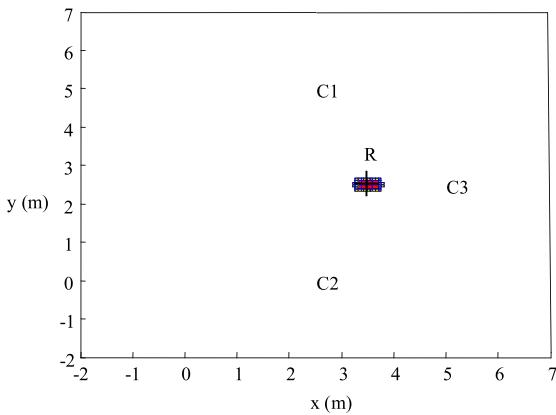  
Fig. 4. 2 DOF robot localization.

## 5. Simulation results

The simulation aims at showing: (i) the feasibility and the interest of the localization method whatever the position of the sensors and the markers, (ii) the ability to integrate a variable number of measurements and various goniometric sensors so far as the sensor model is respected, (iii) the influence of the parameter ε and additional measurement on the localization result. The algorithm is implemented in Matlab.

As said in Section 2 the indoor localization process is divided into two steps. The first step finds the room in which the robot is located by using the particular identifier associated at each measure. The second step localizes the robot inside the room by the set approach described. The paper dealing with the second step experiments are conducted only in an indoor environment composed of one room.

Experimental protocol.

The robot coordinates are specified in the reference frame. The true measures from the sensors are computed given the known coordinates of the sensors and the markers. Then a specified inaccuracy is added to the measurements in the form of upper and lower bounds.

Results.

Fig. 4 shows the robot position $\left( x _ { R } , y _ { R } \right)$ computed by the localization method based on interval analysis using measurements from three home sensors labelled C (Fig. 1(b)). In this case the equations system does not allow the computing of the robot orientation.

The simulation parameters are:

The measurement and its associated upper and lower bounds $[ \lambda _ { i } ] = [ \lambda _ { i } - \Delta \lambda _ { i } , \lambda _ { i } + \Delta \lambda _ { i } ]$ with $\Delta \lambda _ { i } = \pi / 3 6 , \varepsilon = 0 . 1$ m which determines the robot localization accuracy in the x and y axis. The true robot position is (3.5; 2.5) m.

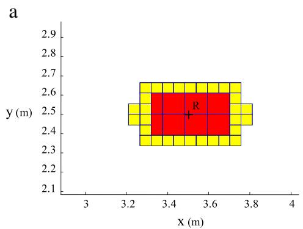

The robot position is represented by two subpavings which include the set of the solution boxes, the feasible subpaving in red (or dark grey) and the ambiguous subpaving in blue/yellow (or light grey). It is necessary to consider both subpavings to guarantee a set containing all possible robot location given the measurements and the noise bounds.

Fig. 5 illustrates the influence of the parameter ε on the localization accuracy. The simulation parameters are: $[ \lambda _ { i } ] = [ \lambda _ { i } -$ $\Delta \lambda _ { i } , \lambda _ { i } + \Delta \lambda _ { i } ]$ with $\Delta \lambda _ { 1 } = \pi / 6 , \Delta \lambda _ { 2 } = \pi / 3 6 , \Delta \lambda _ { 3 } = \pi / 3 6$ . The true robot position is (3.5; 2.5) m.

In $\begin{array} { r } { \mathrm { F i g } . 5 ( \mathsf { a } ) , \varepsilon = 0 . } \end{array}$ 1 m and in Fig. $5 ( \mathrm { b } ) , \varepsilon = 0 . 0 1 \ \mathrm { m }$

A decreasing of the box size reduces the ambiguous subpaving in detriment of the computing time. Adjusting ε is the compromise between the computing time and the localization accuracy.

Fig. 6 shows the robot position and orientation $\left( x _ { R } , y _ { R } , \theta _ { R } \right)$ using three measurements from the robot onboard sensor which detects three markers labelled M (Fig. 1(a)). Note that in this case the equations system allows the computing of the robot orientation.

The simulation parameters are: $\Delta \lambda _ { i } = \pi / 3 6 , \varepsilon = 0 . 0 2$ m. The true robot configuration is (4 m; 3 m, π /4).

For readability only feasible subpaving is displayed. The results are satisfying in terms of localization accuracy. Nevertheless the addition of the third unknown variable $\theta _ { R }$ implicates an increasing of the ambiguous subpaving as illustrated in Fig. 7(a).

One of the interests of the approach is the ability to integrate easily a variable number of measurements. For example if a fourth measurement is available, it is added to other measurements for reducing the localization area (Fig. 7(b)).

The method can without difficulty include both measurements from onboard robot (M) and from home sensors (C) as illustrated in Fig. 8.

Position map.

Three home sensors are placed at the vertices of an equilateral triangle (Fig. 14). The robot position varies from 1 to 6 m in x and y axis. For each position the set of solutions is computed. The result is the 64 robot position map which points up the various form of the subpavings related to the relative positions of the robot with the sensors $( C _ { j } )$

The experiment parameters are: $\Delta \lambda _ { i } = \pi / 1 4 4 , \varepsilon = 0 . 0 5 \mathrm { m }$

It appears that the form and the size of subpavings depend on the position of the robot with respect to the sensors. Nevertheless the computing time remains relatively stable as we will see in Section 6.

In summary, the simulations of the Section 5 have demonstrated that the method is able to take account a variable number of measurements, measurements from onboard and home sensors. This is done very easily thanks to the fusion rule implemented in the algorithm #3. By modifying this rule, some outlier case can be processed as illustrated in Section 6. Moreover the method can handle large initial domain of the parameters in detriment of computing time. However it is possible to decrease the computing time by adjusting the ε parameter.

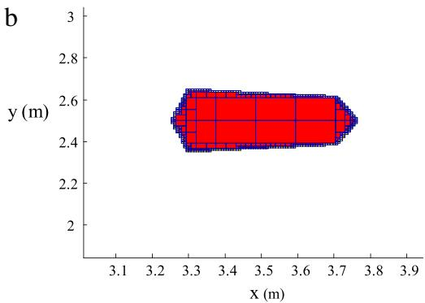  
Fig. 5. 2-DOF robot localization. Feasible subpaving in red (or dark grey) and the ambiguous subpaving in yellow (or light grey): $\left( \mathbf { a } \right) \varepsilon = 0 . 1 \mathrm { m } , \left( \mathbf { b } \right) \varepsilon = 0 . 0 1$ m. (For interpretation of the references to colour in this figure legend, the reader is referred to the web version of this article.)

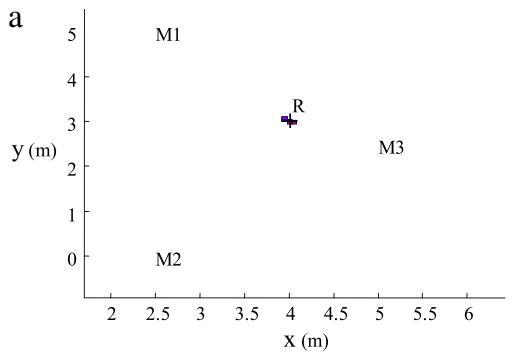

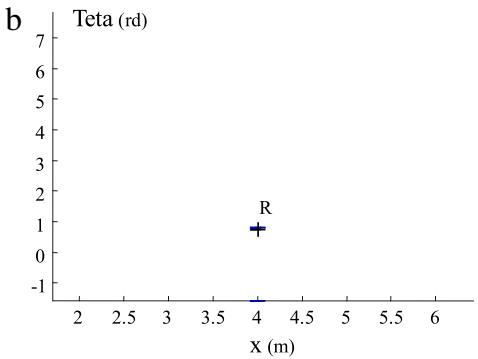  
Fig. 6. 2-DOF robot localization (a) Projection on the x–y plane. (b) Projection on the x–θ plane.

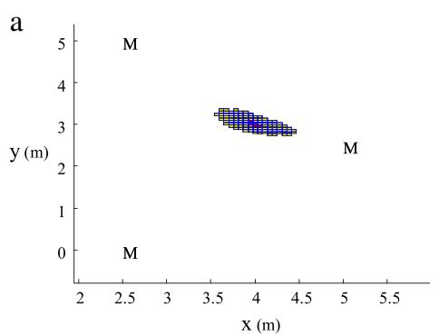

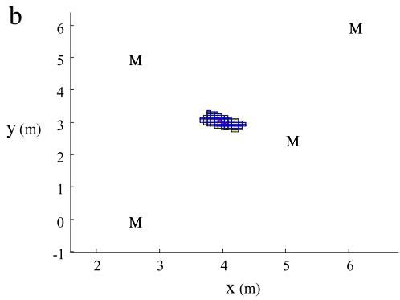  
Fig. 7. 3-DOF robot localization. Projection in the x–y plane: (a) With three available measurements. (b) With four available measurements.

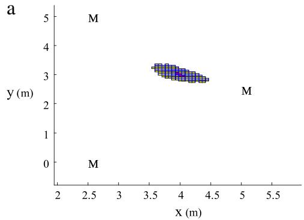

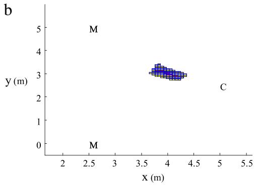

Fig. 8. 3-DOF robot localization. Projection in the x–y plane: (a) The three measurements are acquired by the robot sensor. (b) One of the measurements is acquired by a home sensor (C).  
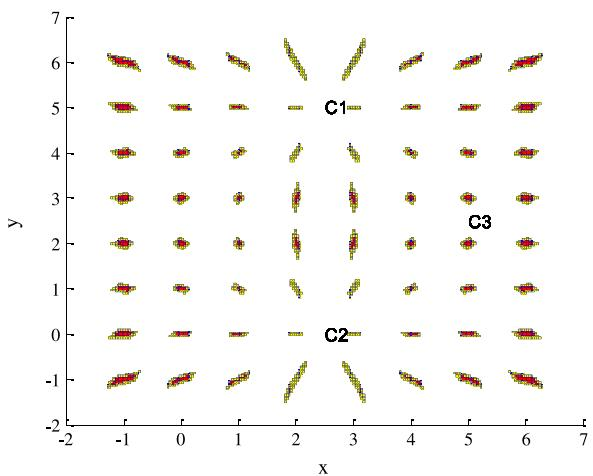  
Fig. 9. 2-DOF robot location map, x and y in meters.

## 6. Experimental results

Real experiments have been performed with a physical robot in a smart environment composed of two rooms for evaluating the localization method based on interval analysis.

Experiments aim at: (i) confirming the simulation results, (ii) showing how outliers could be processed and, (iii) evaluating the influence of the parameter ε on the computing time. The algorithm is implemented in Matlab.

Experimental protocol.

The global dimensions of the test bed are 9.4 m × 6.4 m. The rooms are equipped with presence sensors, video cameras fixed on the top of the walls, a pan video camera on the robot and visual markers. The markers located on the walls are detected by the robot video camera. The markers located on the robot are detected by the video cameras fixed on the walls. Table 2 gives the main characteristics of the test bed sensors. The data of Table 2 are used by the algorithm for determining the inclusion function and the upper and lower bounds associated to the measurement. For example the measurement of a presence sensor positioned on the corner will be $\begin{array} { r } { \lambda _ { j } ~ = ~ t g ^ { - 1 } ( \frac { y _ { R } - 0 } { x _ { R } - 6 . 4 } ) - ( \pi \times 1 3 5 \div 1 8 0 ) } \end{array}$ and the lower and upper bounds will be $\begin{array} { r } { [ \lambda _ { j } ] = [ \lambda _ { j } - ( \frac { \pi \times 4 5 } { 1 8 0 } ) , \lambda _ { i } + ( \frac { \pi \times 4 5 } { 1 8 0 } ) ] } \end{array}$ (see Section 4). It appears that such a presence sensor covers all the room.

Characteristics of the test bed sensors.
<table><tr><td>Sensors</td><td>Presence sensor</td><td>Wall video camera</td><td>Robot video camera</td></tr><tr><td>Precision ()</td><td>±45</td><td>±5</td><td>±5</td></tr><tr><td>Aperture angle (°)</td><td>90</td><td>±55/2</td><td> $\pm 5 5 / 2$ </td></tr><tr><td>Orientation  $\theta _ { j } ( ^ { \circ } ) ( s \mathsf { e e }$  Fig. 1(b))</td><td>135</td><td>225</td><td>Θ robot</td></tr><tr><td>PPosition  $( x _ { j } , y _ { j } ) ( { \mathrm { m } } ) ( { \mathsf { s e e } }$  Fig. 1(b))</td><td>(6.4,0)</td><td>(3, 2.20)</td><td>(x robot, y robot)</td></tr></table>

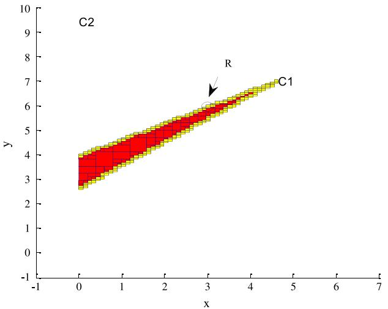  
Fig. 10. 2-DOF robot localization (x and y in meters).

The robot is positioned at a specified coordinates $( x _ { R } , y _ { R } , \theta _ { R } ) .$ Measurements are collected by a gateway which handles the exchanges between the localization computer and the smart environment.

Results.

The Fig. 10 shows the robot position estimated by the method from the measurements provided by a presence sensor (C2) and a wall camera (C1). The feasible subpaving is in red (or dark grey) and the ambiguous subpaving in blue/yellow (or light grey). The true robot position is $( 3 , 5 . 7 ) \pm 0 . 2$ m is depicted by an ellipse. The presence sensor does not improve the localization accuracy but confirms the robot’s presence in the room.

The Fig. 11 shows the robot position estimated by the method from the measurements provided by two wall cameras (C1, C2). The feasible subpaving is in red (or dark grey) and the ambiguous subpaving in blue/yellow (or light grey). The true robot position is $( 3 , 3 . 2 ) \pm 0 . 2$ m is depicted by an ellipse.

A third measurement from the robot video camera not only improves the position accuracy but also provides the robot orientation, $\theta _ { R } = 3 * \pi / 2 ( \mathrm { F i g } . 1 2 )$ . C1 and C2 represent the two wall cameras and M3, the marker detected by the robot video camera. Discussion.

The results of the real experiments are very close of those obtained in simulation. Such results are very useful in poor environments with few sensors because the robot position and orientation are modelled as areas. These areas can be more or less large but it is sure that the robot is inside. Such information is wellsuited to topological space representation which is more and more used in robotics in order to simplify databases and which is able to treat various qualities of data. Therefore in robotics it is also essential that the method has the ability to manage inconsistency when existing outliers and the capacity to perform the localization in real time.

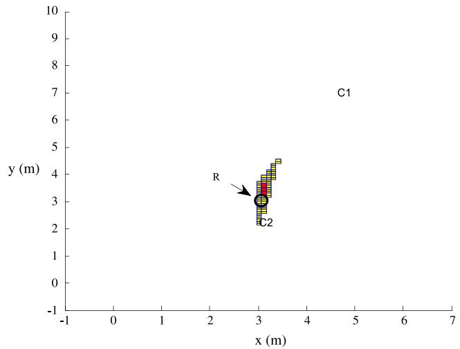  
Fig. 11. 2-DOF robot localization.

We focus on these two points. In the following experiment three home sensors are positioned at the vertices of an equilateral triangle.

## Outlier processing.

In this case the fusion rule of the algorithm #3 is modified applying the principle described in Section 4.2, which consists in relaxing a given number of q constraints. In this case there are three constraints which are the equation of measurement. For example under the assumption that one among three measurements could be erroneous, the algorithm returns the set of solutions wellmatched with at least two measurements.

The experiment parameters are: $\Delta \lambda _ { i } = \pi / 3 6 , \varepsilon = 0 . 0 5 ~ \mathrm { m }$ The true robot position is $( 3 \mathrm { m } ; 5 . 7 \mathrm { m } ) \pm 0 . 2 $ m at the centre of the triangle defined by three home sensors (C ). Only the robot position is computed.

In Fig. 13(a) there is no erroneous measurement and the number of relaxed constraint $q = 0 .$ . The set of the solution is only composed of the subpaving which is the intersection of the three measurements. In Fig. 13(b) the number of relaxed constraints $q = 1$ . The set of solutions increases since including all subpavings is consistent with at least two measurements.

In Fig. $1 4 ( \mathsf { a } )$ the number of relaxed constraints $q = 2 .$ . The set of solutions contains all subpavings consistent with at least one measurement. Therefore the measurement cone of each goniometric sensor appears as an element of the solution. The relaxation technique provides a guaranteed result as long as the number of outliers is below q. The drawbacks are the increasing size of the set of solutions (Fig. 14(a)) and potentially, a discontinuous area (Fig. 14(b)).

Table 3 gives the computing time with respect to the accuracy ε and the number of potential outliers with Matlab software. (Computer Intel R core 2 duo CPU P9400 2.4 GHz.)

The experiment parameters are: $\Delta \lambda _ { i } = \pi / 7 2$ . The true robot position is $( 3 \mathrm { m } ; 5 . 7 \mathrm { m } ) { \pm } 0 . 2 $ m at the centre of the triangle defined by three home sensors (C ). Only the robot position is computed.

When assuming no outlier $( q = 0 )$ the measurement frequency is close to 10 Hz for 1 cm accuracy. If we assume two outliers out of three measurements, the acceptable accuracy is 0.05 m. It is a promising result, easy to improve by using a more efficient programming language. Moreover 66% of inconsistent measurements must be considered as a hard constraint.

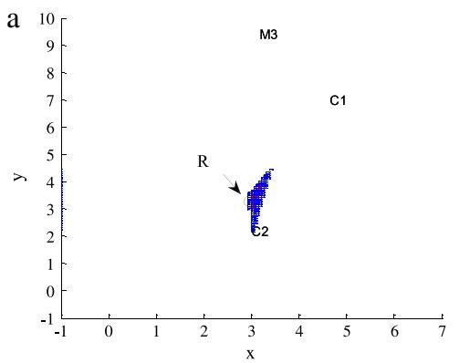

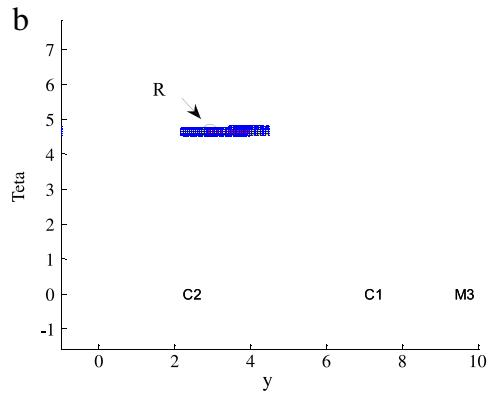  
Fig. 12. 3-DOF robot localization (x, y) in meters and θ in radians. (a) Projection in the x–y plane. (b) Projection in the y–θ plane.

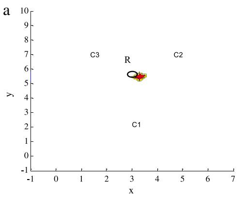

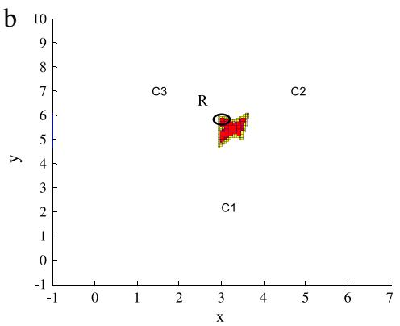  
Fig. 13. 2-DOF robot localization, (a) with no possible outlier among three measurements $( q = 0 ) , ( \mathsf { b } )$ with one possible outlier among three measurements $( q = 1 )$

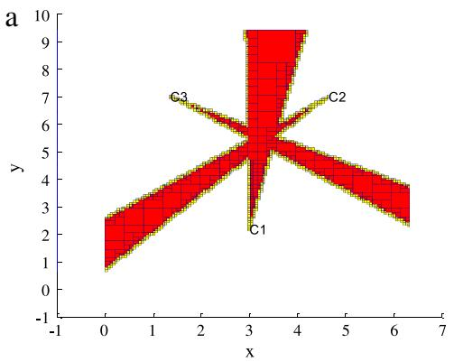

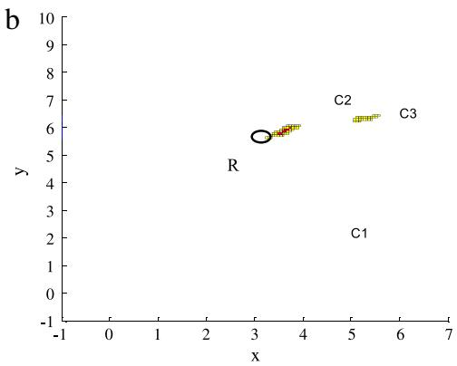  
Fig. 14. 2-DOF robot localization, (a) with two possible outliers among three measurements $( q = 2 ) ( \mathbf { b } )$ with two possible outliers among three measurements $( q = 1 ) .$ The measurement from the sensor 3 is effectively wrong.

Computing time with respect to the accuracy ε and the number of potential outliers.
<table><tr><td>Epsilon/accuracy (m)</td><td>0.5</td><td>0.1</td><td>0.05</td><td>0.01</td><td>0.001</td></tr><tr><td>Computing time (s) with no outlier  $( q = 0 )$ </td><td>0.040</td><td>0.049</td><td>0.059</td><td>0.12</td><td>1.163</td></tr><tr><td>Computing time (s) with one outlier  $( q = 1 )$ </td><td>0.049</td><td>0.070</td><td>0.109</td><td>0.325</td><td>3.232</td></tr><tr><td>Computing time (s) with two outliers  $( q = 2 )$ </td><td>0.079</td><td>0.41</td><td>0.872</td><td>5.096</td><td>61.907</td></tr></table>

Position map.

In order to evaluate a mean computing time for various relative positions of the robot with the sensors (C ), we have taken the same test as used for obtaining the position map of Fig. 9, three home sensors are placed at the vertices of an equilateral triangle. However real experiments being more complex to carry out, we have limited the number of robot positions to ten poses. The robot poses are equally distributed on the map of Fig. 9. Table 4 gives the mean computing time over ten robot poses for three different accuracies ε.

The experiment parameters are: $\Delta \lambda _ { i } = \pi / 7 2$

The results are close to the computing times of the Table 3 with no outlier $( q = 0 )$ . As we said before the computing time is relatively stable whatever the robot position in the map relating to the sensors. It is compatible with the real time needs of robotic application even with a Matlab code.

Table 4  
Mean computing time in seconds with respect to the accuracy for ten robot locations.
<table><tr><td>Epsilon/accuracy (m)</td><td>0.1</td><td>0.05</td><td>0.01</td></tr><tr><td>Mean computing time (s)</td><td>0.016</td><td>0.027</td><td>0.089</td></tr><tr><td>Mean measurement frequency (Hz)</td><td>61</td><td>37</td><td>11</td></tr></table>

## 7. Conclusion

The robot localization is based on the multiangulation method applied on data both from robot and environment sensors. The problem of parameter estimation is solved by a set inversion applied on error bounded data. As the parameter vector dimension is two or three, the computing time is compatible with the real time constraint of mobile robotics as showed in Section 6. The interest of the solution lies on the ability to integrate a large variety of sensors, from the roughest to the most complex one. The sensor model only considers that the measurement is an angle bounded between the lower and upper limits.

The method takes account:

– a flexible number of measurements;

– generic goniometric measurements;

– no statistical knowledge about the inaccuracy of measurements, only an admissible interval specified by lower and upper values. The interval is deduced from the sensor tolerance given by manufacturers;

– measurements both coming from the robot onboard sensors and from the home sensors.

The algorithm is able to provide a result of localization as soon as only one measure is available.

Moreover we show that the approach is able to integrate a heterogeneous set of measurements, not only generic goniometric measurements but also range, position given by a tactile tile, complex shapes, and dead reckoning. We also explain how to handle certain types of outliers and environment model inaccuracies.

The coordinates of the environment markers $M _ { j } = ( x _ { j } , y _ { j } )$ and the coordinates and orientation of the environment sensors $C _ { j } =$ $( x _ { j } , y _ { j } , \theta _ { j } )$ are supposed known for paper readability. However the method we propose can easily take into account inaccuracies on the marker and sensor coordinates. Moreover we propose a technique based on the constraint propagation for improving the precision of location of the sensors and markers. The implementation of this technique and the management of heterogeneous measurements as proposed in Section 4.3 is the purpose of the current work.

Simulation and real experiments have shown the interest of the approach and how the method can be made more reliable by processing outliers.

## References

[1] Z. Zhang, X. Gao, J. Biswas, J.K. Wu, Moving targets detection and localization in passive infrared sensor networks, in: Proceedings of the 10th International Conference on Information Fusion, Quebec, 2007, pp. 1–6.

[2] S. Han, H. Lim, J. Lee, An efficient localization scheme for a differential-driving mobile robot based on RFID system, IEEE Transaction on Industrial Electronics 6 (2007) 3362–3369.

[3] S. Shenoy, J. Tan, Simultaneous localization and mobile robot navigation in a hybrid sensor network, in: Proceedings of IEEE/RSJ International Conference on Intelligent Robots and Systems, Alberta, 2005, pp. 1636–1641.

[4] B.-S. Choi, J.-J. Lee, Mobile robot localization scheme based on RFID and sonar fusion system, in: Proceedings of IEEE International Symposium on Industrial Electronics, Seoul, 2009, pp. 1035–1040.

[5] B.-S. Choi, J.-J. Lee, Sensor network based localization algorithm using fusion sensor-agent for indoor service robot, IEEE Transaction on Consumer Electronics 56 (3) (2010) 1457–1465.

[6] A. Corominas Murtra, J.M. Mirats Tur, A. Sanfeliu, Action evaluation for mobile robot global localization in cooperative environments, Journal of Robotics and Autonomous Systems (2008) Special Issue on Network Robot Systems.

[7] S. Brahim-Belhouari, M. Kieffer, G. Fleury, L. Jaulin, E. Walter, Model selection via worst-case criterion for nonlinear bounded-error estimation, IEEE Instrumentation and Measurement 49 (3) (2000) 653–658.

[8] L. Jaulin, M. Kieffer, E. Walter, D. Meizel, Guaranteed robust nonlinear estimation with application to robot localization, IEEE Transactions on Systems, Man, and Cybernetics Part C: Rev. Applications and Reviews 32 (4) (2002) 254–267.

[9] C. Drocourt, Localization et modélisation de l’environnement d’un robot mobile par coopération de deux capteurs omnidirectionnels, Thèse, 2002.

[10] O. Lévêque, L. Jaullin, D. Meizel, E. Walter, Vehicule localization from inaccurate telemetric data: a set of inversion approach, in: IFAC Symposium on Robot Control SYROCO 97, Nantes, Vol. 1, 1997, pp. 179–186.

[11] A. Gning, Fusion multisensorielle ensembliste par propagation de contraintes sur les intervalles, Thèse, 2006.

[12] V. Drevelle, P. Bonnifait, Robust positioning using relaxed constraintpropagation. in: IROS 2010, Taipei, 10, 2010, pp. 4843–4848.

[13] O. Reynet, L. Jaulin, G. Chabert, Robust TDOA passive location using interval analysis and contractor programming, Radar, Bordeaux, 2009.

[14] L. Jaulin, Robust set-membership state estimation; application to underwater robotics, Automatica 45 (1) (2009) 202–206.

[15] A. Lambert, D. Gruyer, B. Vincke, E. Seignez, Consistent Outdoor Vehicle Localization by Bounded-Error State Estimation, Intelligent Robots and Systems, IROS (2009) 1211–1216.

[16] Fahed Abdallah, Amadou Gning, Philippe Bonnifait, Box particle filtering for nonlinear state estimation using interval analysis, Automatica 44 (3) (2008) 807–815.

[17] V. Drevelle, P. Bonnifait, ENC-GNSS 2009 European Navigation Conference— Global Navigation Satellite Systems, Naples, 2009.

[18] R.E. Moore, Method and Applications of Internal Analysis, SIAM, Philadelphia, 1979.

[19] L. Jaulin, M. Kieffer, O. Didrit, E. Walter, Applied Interval Analysis, Springer-Verlag, 2001.

[20] L. Jaulin, E. Walter, Set inversion via interval analysis for nonlinear boundederror estimation, Automatica 29 (4) (1993) 1053–1064.

  
E. Colle, a first-class professor at the University of Evry, was a director of both the laboratory LSC (Laboratoire des Systèmes Complexes) and IBISC (Informatique, Biologie Intégrative et Systèmes Complexes) until 2008. He is currently the head of group HANDS (HANDicap et Santé) which is involved in diverse projects, such as the Companionable FP7 European project and ANR (Research French Agency) national projects. In addition, he is also a co-creator and (co-leader) of a national federation named IFRATH (Assistance aux personnes handicapées) created in 1996 which aims at federating rehabilitation researches in  
France. Professor Etienne Colle is a specialist in fields of robotics and telerobotics for disabled and elderly people. Current works concern mobile robotics in cooperative environments.

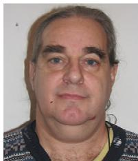

S. Galerne obtained his Ph.D. in robotics in 1985. He is presently a lecturer at IBISC laboratory, in the University of Evry, France. His research interests include principally Human–Machine Cooperation, remote control, rehabilitation engineering and robotics. His current research topic is the ambient assistive robotics for people with loss of autonomy.