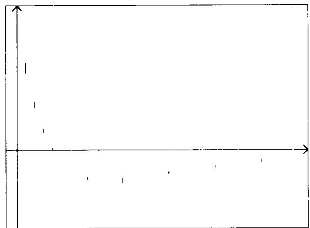
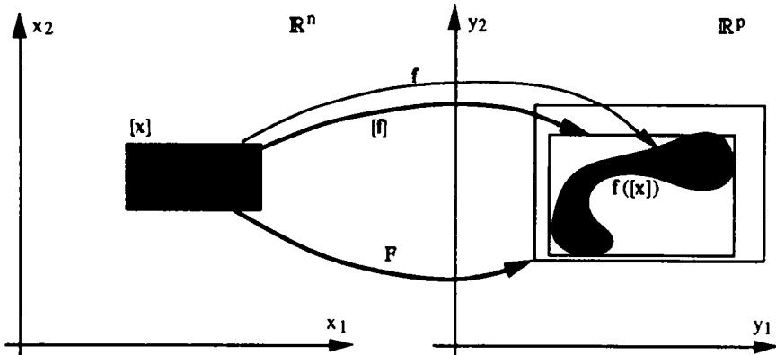
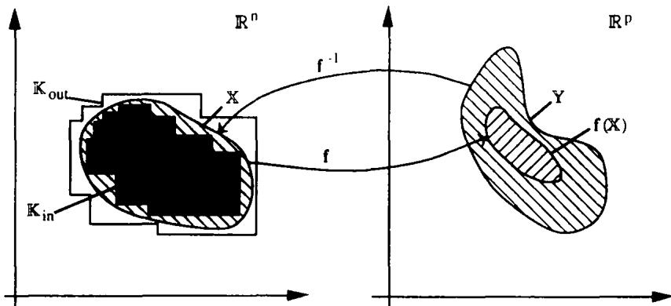
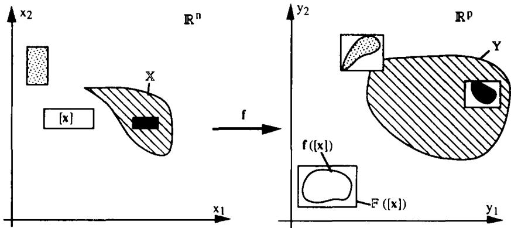
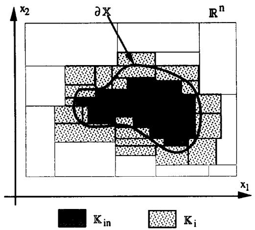
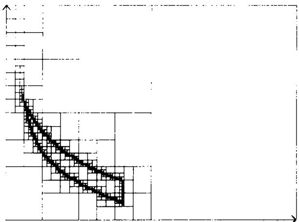
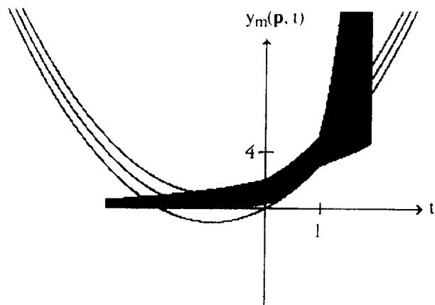

# Set Inversion via Interval Analysis for Nonlinear Bounded-error Estimation ,

LUC JAULIN and ERIC WALTER†

Finding all parameter vectors that are consistent with the data in the sense that the error falls within prior bounds is a problem of set inversion, solved in the general nonlinear case via interval analysis.

Key Words—Bounded errors; global analysis; guaranteed estimates; identification; interval analysis;   
nonlinear equations; nonlinear estimation; parameter estimation; set theory; set inversion.

Abstract—In the context of bounded-error estimation, one is interested in characterizing the set of all the values of the parameters to be estimated that are consistent with the data in the sense that the errors between the data and model outputs fall within prior bounds. While the problem can be considered as solved when the model output is linear in the parameters, the situation is far less advanced in the general nonlinear case. In this paper, the problem of nonlinear bounded-error estimation is viewed as one of set inversion. An original algorithm is proposed, based upon interval analysis, that makes it possible to characterize the feasible set for the parameters by enclosing it between internal and external unions of boxes. The convergence of the algorithm is proved and the algorithm is applied to two test cases. The results obtained are compared with those provided by signomial analysis.

## 1. INTRODUCTION TO BOUNDED-ERROR ESTIMATION

THIS PAPER Is concerned with the problem of estimating the unknown parameters of a model from experimental data collected on a system under given experimental conditions (e.g. location of input and output ports, shape of inputs, measurement times). Let $\mathbf { y } \in \mathbb { R } ^ { n _ { y } }$ be the vector of all these data. It may consist for instance of $\pmb { n } _ { \pmb { y } }$ scalar measurements performed at given times on a single-input-single-output dynamical system, but multi-input-multi-output dynamical systems or static processes could be considered as well. A parametric structure M(.) is assumed for the model of this system, i.e. a set of models parametrized by a vector $\mathbf { p } \in \mathbb { P } \subset \mathbb { R } ^ { n _ { p } }$ to be estimated, where P is the prior feasible set for the parameters. For the experimental conditions used, each model $M ( \mathfrak { p } )$ generates a vector output ${ \bf y } _ { m } ( { \bf p } )$ homogeneous to the data y. The dependency of $\mathbf { y } _ { m }$ in the experimental conditions needs not to be made explicit since these are assumed fixed. The vector function ${ \pmb y } _ { m }$ is assumed to be continuous and locally one-to-one (or identifiable). Define the error between the data and model output by

$$
\mathbf { e } _ { m } ( \mathbf { p } ) = \mathbf { y } - \mathbf { y } _ { m } ( \mathbf { p } ) .\tag{1}
$$

In the context of bounded-error estimation (e.g. Walter, 1990; and the many papers on the subject in Bànyàsz and Keviczky, 1991) it is assumed that $\bullet _ { m } ( \mathfrak { p } )$ must belong to some prior feasible set $\mathbb { E } \subset \mathbb { R } ^ { n _ { \ast } }$ to be admissible, and the problem to be solved is that of finding the set S of all admissible values of p corresponding to an admissible error, i.e.

$$
\mathbb { S } = \{ \boldsymbol { \mathbf { p } } \in \mathbb { P } \mid \boldsymbol { \mathbf { e } } _ { m } ( \boldsymbol { \mathbf { p } } ) \in \mathbb { E } \} .\tag{2}
$$

In what follows, we shall assume that P and E can be defined by finite sets of inequality constraints. For any $\pmb { \mathrm { p } } \in \mathbb { S }$ , there exists e  E such that

$$
\mathbf { y } = \mathbf { y } _ { m } ( \mathbf { p } ) + \mathbf { e } .\tag{3}
$$

Although set-membership estimation can be set in a purely deterministic context, it can also receive a stochastic interpretation. If P and E are, respectively, the support of the prior probability density functions (pdf) for p and for $\bullet _ { m } ( \mathfrak { p } )$ then, from Bayes' rule, S is the support of the posterior pdf for p. If $\mathbb { P } = \mathbb { R } ^ { n _ { \varepsilon } }$ then S is the set of all values of p such that the likelihood of the data is nonzero.

The estimation problem can always be reformulated so as to include the inequalities defining P among those defining E, so that only one prior feasible set needs to be considered. S can then equivalently be defined as

$$
\mathbb { S } = \mathbf { y } _ { m } ^ { - 1 } ( \mathbf { y } - \mathbb { E } ) = \mathbf { y } _ { m } ^ { - 1 } ( \mathbb { Y } ) = \mathbf { e } _ { m } ^ { - 1 } ( \mathbb { E } ) ,\tag{4}
$$

where $ { \mathbf { e } } _ { m } ^ { - 1 }$ and $\mathbf { y } _ { m } ^ { - 1 }$ are the reciprocal functions (in a set-theoretic sense) of $\mathbf { e } _ { m }$ and ${ \bf y } _ { m }$ , and where $\mathbb { Y } = \mathbf { y } - \mathbb { E }$ is the prior feasible set for the model outputs. The problem to be solved thus appears as one of set inversion.

The interested reader is referred to the surveys (Kurzhanski and Vâlyi, 1991; Milanese and Vicino, 199la; Norton, 1987a; Walter and Piet-Lahanier, 1990) for a bibliography on bounded-error estimation. The methods to be used for characterizing S depend on whether $\mathbf { e } _ { m } ( \mathfrak { p } )$ is affine (linear) in p or not. In the first case, the problem of guaranteed estimation can be considered as solved when E is a box. Methods exist to characterize S exactly and recursively (Broman and Shensa, 1990; Mo and Norton, 1990; Walter and Piet-Lahanier, 1989). Ellipsoids and boxes guaranteed to contain S can also be computed (Belforte et al., 1990; Fogel and Huang, 1982; Kurzhanski and Valyi, 1991; Milanese and Belforte, 1982; Pronzato et al., 1989), In the latter case, when the error is nonlinear in the parameters, guaranteed bounded-error estimation is far less advanced. For some types of output-error models, it has been proven (Clément and Gentil, 1990: Norton, 1987b) that S is contained in a union of convex polyhedra, which can be characterized exactly or enclosed in a union of ellipsoids or boxes.

Whether or not the error is affine in p, computing the smallest axis-aligned box containing S can be performed by solving $2 n _ { p }$ problems of mathematical programming. Each of them corresponds to the maximization or minimization of a component of p subject to the $n _ { \mathrm { { c } } }$ inequality constraints that define P and E and thus S. When the error is affine in p, this can be performed by any of the methods available for linear programming, such as Dantzig's simplex or Karmarkar's algorithm, provided that P and E are polytopes. In the general case, global optimization methods are needed if guaranteed results are to be obtained. Among the many methods available for global optimization (e.g. Dixon and Szego, 1975, 1978; Mockus, 1989; Zhigljavsky, 1991) only deterministic methods (Horst and Tuy, 1990; Ratschek and Rokne, 1988) can be used since stochastic methods converge only in probability. In a large number of problems of practical interest (such as the estimation of the parameters of an ARMA model or of a discrete linear state space model), signomial programming can be used (Milanese and Vicino, 1991b).

All the methods available so far to give a guaranteed characterization of S in the nonlinear case were limited to providing a simple-shaped set guaranteed to contain it. In this paper, we propose a new method to obtain a more detailed description of S based on the use of interval analysis for set inversion. This approach is similar to the one currently and independently being developed by Moore (1992).

Section 2 describes two test cases which will be used throughout the paper to illustrate the various notions needed. Section 3 presents interval analysis, the basic tool of the new approach. Section 4 formulates the problem of set inversion and gives some theoretical results. A new algorithm for set inversion via interval analysis (SIVIA) is proposed in Section 5. Using a new distance between compact sets introduced in Section 4, its theoretical properties are studied and the results obtained on the two test cases are described.

## 2. TEST CASES

Two test cases will be considered. The first one deals with approximating a function on a finite interval. It will show that the technique to be described can be used even when the dimension $\pmb { n } _ { y }$ of the data y is infinite. The second test case has already been studied by Milanese and Vicino (1991b) who estimated the smallest axis-aligned box containing the corresponding set S. It will be used to compare the results provided by the signomial and interval-analysis approaches, when both apply.

Test case 1. Find the set S of all values of $\mathbf { p } \in \mathbb { P } = [ 0 , 5 ] \times [ 0 , 5 ] \subset \mathbb { R } ^ { 2 }$ such that

$$
\begin{array} { r l r } {  { | e _ { m } ( \mathbf { p } , t ) | } } \\ & { } & { = | y ( t ) - y _ { m } ( \mathbf { p } , t ) | \leq 1 \quad \forall t \in [ 0 , 1 ] , } \end{array}\tag{5}
$$

where

$$
y ( t ) = t ^ { 2 } + 2 t + 1
$$

and

$$
y _ { m } ( { \bf p } , t ) = p _ { 1 } \exp { ( p _ { 2 } t ) } .\tag{6}
$$

The vector p is feasible if

$$
\forall t \in [ 0 , 1 ] , - 1 \leq e _ { m } ( \mathbf { p } , t ) \leq 1 ,\tag{7}
$$

$$
\Leftrightarrow \left\{ \begin{array} { l l } { \underset { 0 \leq t \leq 1 } { \operatorname* { m i n } } y ( t ) - y _ { m } ( \mathbf { p } , t ) \geq - 1 , } \\ { \underset { 0 \leq t \leq 1 } { \operatorname* { m a x } } y ( t ) - y _ { m } ( \mathbf { p } , t ) \leq 1 . } \end{array} \right.\tag{8}
$$

Thus, the posterior feasible set $\mathbb { S }$ is the same as

if the data $\mathbf { y } = ( \mathbf { 0 } , \mathbf { 0 } ) ^ { T }$ were to be fitted with the model output

$$
\begin{array} { r } { \mathbf { y } _ { m } ( \mathbf { p } ) = \biggr ( \underset { 0 \leq t \leq 1 } { \operatorname* { m i n } } ~ \{ t ^ { 2 } + 2 t + 1 - p _ { 1 } \exp { ( p _ { 2 } t ) } \} , } \\ { \underset { 0 \leq t \leq 1 } { \operatorname* { m a x } } ~ \{ t ^ { 2 } + 2 t + 1 - p _ { 1 } \exp { ( p _ { 2 } t ) } \} \biggr ) ^ { T } , } \end{array}\tag{9}
$$

the admissible set for the error being $\mathbb { E } =$ $\{ { \bf e } \left| - { \bf 1 } \leq { \bf e } \leq { \bf 1 } \right\}$ , where 1 represents the twodimensional vector with all components equal to one.

Test case 2. Assume that at times t= (0.75, 1.5, 2.25, 3, 6, 9, 13, 17, 21, 25)7, the following data have been recorded (one at a time) on a single-output system:

$$
\begin{array} { c } { { { \bf y } = ( 7 . 3 9 , 4 . 0 9 , 1 . 7 4 , 0 . 0 9 7 , - 2 . 5 7 , - 2 . 7 1 , } } \\ { { { \bf \zeta } - 2 . 0 7 , - 1 . 4 4 , - 0 . 9 8 , - 0 . 6 6 ) ^ { T } . } } \end{array}\tag{10}
$$

The scalar output of the model $M ( \mathfrak { p } )$ at a given time t is described by

$$
y _ { m } ( \mathbf { p } , t ) = p _ { 1 } \exp { ( - p _ { 2 } t ) } + p _ { 3 } \exp { ( - p _ { 4 } t ) } .\tag{11}
$$

A MATLAB-like notation will be used (see the notation section), so that the vector of the outputs of the model $M ( \mathfrak { p } )$ for all measurement times t will be denoted by

$$
\begin{array} { r } { \mathbf { y } _ { m } ( \mathbf { p } ) = p _ { 1 } \exp \left( - p _ { 2 } \mathbf { t } \right) + p _ { 3 } \exp \left( - p _ { 4 } \mathbf { t } \right) . } \end{array}\tag{12}
$$

Following (Milanese and Vicino, 1991b), we assume that the set of admissible errors E is given by

$$
\begin{array} { r l } & { \mathbb { E } = [ \mathbf { e } ] = [ - \mathbf { e } _ { \operatorname* { m a x } } , \mathbf { e } _ { \operatorname* { m a x } } ] } \\ & { \quad = \left\{ \mathbf { e } \mid - \mathbf { e } _ { \operatorname* { m a x } } \le \mathbf { e } \le \mathbf { e } _ { \operatorname* { m a x } } \right\} , } \end{array}\tag{13}
$$

where

$$
\mathbf { e } _ { \operatorname* { m a x } } = 0 . 0 5 \left| \mathbf { y } \right| + 0 . 1 * 1 .\tag{14}
$$

lyl is the $\pmb { n } _ { y }$ -dimensional vector with each component equal to the absolute value of the corresponding component of y and 1 is a vector of ones. The prior feasible set for the parameter is the box

$$
\mathbb { P } = [ 2 , 6 0 ] \times [ 0 , 1 ] \times [ - 3 0 , - 1 ] \times [ 0 , 0 . 5 ] .\tag{15}
$$

Figure 1 presents the data. The bars indicate the uncertainty associated with each datum. S is the set of all values of p such that each of these bars contains the scalar model output associated with the same time.

## 3. INTERVAL ANALYSIS

Interval analysis has been a very active field in scientific computation for the last 20 years (e.g. Moore, 1979; Neumaier, 1990; Ratschek and Rokne, 1988). There are now commercially available extensions of FORTRAN and PASCAL that include interval arithmetic among their features (IBM, 1986; Kulisch, 1987). We shall now define the notions of interval analysis that will be used in Section 5 for the description and analysis of SIVIA.

  
FiG. 1. Data with feasible error bars for Test case 2 in the (t, y) space. The frame corresponds to the domain [− 1, 25] × [7, 13].

## 3.1. Boxes

Using boxes in the context of set inversion makes it possible to replace point values of vectors by subsets of the parameter space, thereby allowing a global analysis of infinite sets of points with a finite number of operations. Note that other types of sets based, e.g. on more complex polyhedra or on ellipsoids could be used as well.

Definition 1. An interval [x] of R (or scalar interval) is a closed, bounded and connected set of real numbers $[ x ] = [ x ^ { - } , x ^ { + } ] = \left\{ x \mid x ^ { - } \leq x \leq \right.$ $x ^ { + } \}$

Definition 2. A box [x] of $\mathbb { R } ^ { n }$ (or vector interval) is the cartesian product of n scalar intervals.

The set of all boxes of $\mathbb { R } ^ { n }$ will be denoted by $\mathbb { R } ^ { n }$ . Boxes will be specified indifferently in any of the three following ways:

$$
\begin{array} { l } { { \{ { \bf x } \} = [ x _ { 1 } ^ { - } , x _ { 1 } ^ { + } ] \times [ x _ { 2 } ^ { - } , x _ { 2 } ^ { + } ] \times \cdot \cdot \cdot \times [ x _ { n } ^ { - } , x _ { n } ^ { + } ] } } \\ { { \mathrm { ~ } = [ x _ { 1 } ] \times [ x _ { 2 } ] \times \cdot \cdot \cdot \times [ x _ { n } ] = [ { \bf x } ^ { - } , { \bf x } ^ { + } ] . } } \end{array}\tag{16}
$$

Remark 1. Vectors x of Rn will also be considered as belonging to lR", with ${ \bf x } ^ { - } = { \bf x } ^ { + } =$ X.

Definition 3. The width $w ( [ \mathbf { x } ] )$ of $[ \mathbf { x } ] \in \mathbb { I R } ^ { n }$ , is given by $w ( [ \mathbf { x } ] ) = \operatorname* { m a x } _ { i = 1 \ldots , n } \big \{ x _ { i } ^ { + } - x _ { i } ^ { - } \big \}$

Definition 4. The enveloping box [A] of a bounded subset $\mathbb { A } \subset \mathbb { R } ^ { n }$ is the smallest box of $\mathbb { M } ^ { n }$ that contains A. $[ \mathbb { A } ] = \bigcap \left\{ \left[ \mathbf { x } \right] \in \mathbb { I } \mathbb { R } ^ { n } \mid \mathbb { A } \subset \left[ \mathbf { x } \right] \right\}$

## 3.2. Minimal inclusion functions

The following definition makes it possible to extend all concepts of vector arithmetic to boxes.

Definition 5. Let f be a function from $\mathbb { R } ^ { n }$ to $\mathbb { R } ^ { p }$ The minimal inclusion function of f, denoted by [f], is defined as $[ \mathbf { f } ] : \mathbb { U R } ^ { n } \to \mathbb { R } ^ { p } ; [ \mathbf { x } ] \to [ \{ \mathbf { f } ( \mathbf { x } ) \ | \ \mathbf { x } \in$ [x]}].

[f]([x]) is thus the smallest box of ${ \mathbb { R } } ^ { p }$ that contains $\pmb { \mathrm { f } } ( [ \mathbf { x } ] )$ , i.e. the enveloping box of $\mathbf f ( [ \mathbf x ] )$ . It is easy to compute for elementary arithmetic operators and functions.

Example 1. Addition of boxes of ${ \mathbb { R } } ^ { 2 }$

If

$$
\begin{array} { c } { { \{ { \bf x } \} = [ x _ { 1 } ^ { - } , x _ { 1 } ^ { + } ] \times [ x _ { 2 } ^ { - } , x _ { 2 } ^ { + } ] } } \\ { { = [ x _ { 1 } ] \times [ x _ { 2 } ] = [ { \bf x } ^ { - } , { \bf x } ^ { + } ] , } } \end{array}\tag{17}
$$

$$
\begin{array} { c } { { \{ { \bf y } \} = \left[ y _ { 1 } ^ { - } , y _ { 1 } ^ { + } \right] \times \left[ y _ { 2 } ^ { - } , y _ { 2 } ^ { + } \right] } } \\ { { { \bf \Sigma } = \left[ y _ { 1 } \right] \times \left[ y _ { 2 } \right] = \left[ { \bf y } ^ { - } , { \bf y } ^ { + } \right] , } } \end{array}\tag{18}
$$

and $\mathrm { i f } \ +$ is considered as a function from $\mathbb { R } ^ { 2 } \times \mathbb { R } ^ { 2 }$ to $\mathbb { R } ^ { 2 }$ then, since $( [ \mathbf { x } ] , [ \mathbf { y } ] )$ is a box of ${ \mathbb { R } } ^ { 4 }$

$$
\begin{array} { r l r } {  { \bigl [ + \bigr ] ( [ \mathbf { x } ] , [ \mathbf { y } ] ) } } \\ & { } & { = \bigl [ x _ { 1 } ^ { - } + y _ { 1 } ^ { - } , x _ { 1 } ^ { + } + y _ { 1 } ^ { + } \bigr ] \times \bigl [ x _ { 2 } ^ { - } + y _ { 2 } ^ { - } , x _ { 2 } ^ { + } + y _ { 2 } ^ { + } \bigr ] } \\ & { } & { = \bigl [ \mathbf { x } ^ { - } + \mathbf { y } ^ { - } , \mathbf { x } ^ { + } + \mathbf { y } ^ { + } \bigr ] . } \end{array}
$$

In what follows, $[ + ] ( [ \mathbf { x } ] , [ \mathbf { y } ] )$ will be denoted by $[ { \bf x } ] + [ { \bf y } ]$ , and the same notation will be used for all elementary arithmetic operators.

Example 2. Sum of exponentials.

Consider the function $f : \mathbb { R } ^ { 4 } \to \mathbb { R } ; \quad \mathfrak { p } \to$ $p _ { 1 } \exp \left( p _ { 2 } \right) + p _ { 3 } \exp \left( p _ { 4 } \right)$ .From the monotonicity of the exponential function, we have exp $( [ p _ { i } ] ) = [ { \mathrm { e x p } } ] ( [ p _ { i } ] ) = [ { \mathrm { e x p } } \ ( p _ { i } ^ { - } )$ , exp $\left( \pmb { p } _ { i } ^ { + } \right) ]$ and $[ f ] : \mathbb { I R } ^ { 4 } \to \mathbb { I R } ; [ \mathbf { p } ] \to [ p _ { 1 } ] * \exp { ( [ p _ { 2 } ] ) } + [ p _ { 3 } ] *$ exp $( [ p _ { 4 } ] )$ If $p _ { 1 } > 0$ and $p _ { 3 } > 0$ then $[ f ] ( [ { \bf p } ^ { - } , { \bf p } ^ { + } ] ) = [ p _ { 1 } ^ { - }$ exp $( p _ { 2 } ^ { - } ) + p _ { 3 } ^ { - }$ exp $( p _ { 4 } ^ { - } )$ , $\pmb { p } _ { 1 } ^ { + }$ exp $( p _ { 2 } ^ { + } ) + p _ { 3 } ^ { + }$ exp $\left( p _ { 4 } ^ { + } \right) ]$ .

Example 3. Sinusoid.

Consider now the function $f : \mathbb { R } ^ { 2 } \to \mathbb { R } ; \mathrm { ~ \mathfrak { p } \to ~ }$ $p _ { 1 }$ sin $\pmb { p } _ { 2 }$ .Taking advantage of the fact that the two parameters $p _ { 1 }$ and ${ \pmb p } _ { 2 }$ appear independently in the expression of $f$ , we obtain $[ f ] : { \dot { 0 } } \mathbb { R } ^ { 2 } \to \mathbb { I R } ^ { \cdot }$ • $[ \mathbf { p } ] {  } [ p _ { 1 } \dot { ] } * [ \mathrm { s i n } ] ( [ p _ { 2 } ] \dot { ) }$ , where the minimal inclusion function of sin, denoted by [sin]= $[ \sin ^ { - } , \sin ^ { + } ]$ is defined by:

If 3k Z such that $2 k \pi - \pi / 2 \in \left[ p _ { 2 } \right]$ then sin $^ - ( [ p _ { 2 } ] ) = - 1$ else $\sin ^ { - } \left( \left[ p _ { 2 } \right] \right) = \min \left( \sin p _ { 2 } ^ { - } \right.$ sin $\pmb { p } _ { 2 } ^ { + } )$ , if $\exists k \in \mathbb { Z }$ such that $2 k \pi + \pi / 2 \in \left[ p _ { 2 } \right]$ then sin $( [ p _ { 2 } ] ) = 1$ else sin ${ \bf \tau } ^ { + } ( \{ p _ { 2 } \} ) = \mathbf { m } \mathbf { a } \mathbf { x } ( \sin \dot { p _ { 2 } } \dot { \bf \tau }$ sin $p _ { 2 } ^ { + } )$ $[ \sin ] ( [ p _ { 2 } ] ) = [ \sin ^ { - } { \left( [ p _ { 2 } ] \right) } , \sin ^ { + } { \left( [ p _ { 2 } ] \right) } ] .$

Test case 1. Since $p _ { 1 } \geq 0$ ,the minimal inclusion function for $\mathbf { y } _ { m } ( \mathfrak { p } )$ as defined by (9) is given by

$$
\begin{array} { r l } & { \| \mathbf { y } _ { m } \| ( \left| \left[ \mathbf { p } \right] \right| ) } \\ & { \quad = \left[ \underset { 0 \leq t \leq 1 } { \prod \operatorname* { i n i n } } \left. t ^ { 2 } + 2 t + 1 - p _ { 1 } ^ { + } \exp \left( p _ { 2 } ^ { + } t \right) \right. , \right. } \\ & { \qquad \left. \underset { 0 \leq t \leq 1 } { \prod } \left. t ^ { 2 } + 2 t + 1 - p _ { 1 } ^ { - } \exp \left( p _ { 2 } ^ { - } t \right) \right. \right] } \\ & { \qquad \times \left[ \underset { 0 \leq t \leq 1 } { \prod \operatorname* { m a x } } \left. t ^ { 2 } + 2 t + 1 - p _ { 1 } ^ { + } \exp \left( p _ { 2 } ^ { + } t \right) \right. , \right. } \\ & { \qquad \left. \underset { 0 \leq t \leq 1 } { \prod \operatorname* { m a x } } \left. t ^ { 2 } + 2 t + 1 - p _ { 1 } ^ { - } \exp \left( p _ { 2 } ^ { - } t \right) \right. \right] . } \end{array}\tag{20}
$$

One evaluation of $[ { \pmb y } _ { m } ] ( [ { \pmb \ p } ] )$ thus amounts to solving four simple one-dimensional optimization problems. It is trivial to prove that each of them can be solved using any local optimization method twice (once initialized at $\pmb { t = 0 }$ , then at $t = 1 )$

Test case 2. As $p _ { 1 } { \geq } 0 , p _ { 3 } { \leq } 0$ and $\mathbf { t } > \mathbf { 0 }$ ,the minimal inclusion function for ${ \bf y } _ { m } ( { \bf p } )$ as defined by (12) is

$$
\begin{array} { r } { [ { \bf y } _ { m } ] ( [ { \bf p } ] ) = [ p _ { 1 } ^ { - } \exp { ( - p _ { 2 } ^ { + } { \bf t } ) } + p _ { 3 } ^ { - } \exp { ( - p _ { 4 } ^ { - } { \bf t } ) } , } \\ { p _ { 1 } ^ { + } \exp { ( - p _ { 2 } ^ { - } { \bf t } ) } + p _ { 3 } ^ { + } \exp { ( - p _ { 4 } ^ { + } { \bf t } ) } ] . \qquad } \end{array}\tag{21}
$$

## 3.3. Inclusion functions

When [f] cannot be computed, it can be approximated by a (nonminimal) inclusion function F.

Definition 6. $\mathbb { F } : \mathbb { H } \mathbb { R } ^ { n } \to \mathbb { M } ^ { p }$ is an inclusion function of $\mathbf { f } : \mathbb { R } ^ { n } \to \mathbb { R } ^ { p } { \mathrm { ~ i f ~ } } ( \mathrm { i } ) \ \forall [ \mathbf { x } ] \in \mathbb { I R } ^ { n } , \ \mathbf { f } ( [ \mathbf { x } ] ) \subset \mathbb { F } ( [ \mathbf { x } ] )$ and (ii) $w ( [ \mathbf { x } ] ) {  } 0 { \Rightarrow } w ( \mathbb { F } ( [ \mathbf { x } ] ) ) {  } 0 .$

Remark 2. An inclusion function F exists if and only if f is continuous. Contrary to the minimal inclusion function [f], F is not unique, and ${ [ 1 ] } \subset \mathbb { F }$ . Any intersection of inclusion functions is an inclusion function.

Figure 2 illustrates Definitions 5 and 6. For any function f obtained by composition of elementary operators such $\mathrm { ~ \mathsf { a s } ~ } + , - , * , / ,$ sin, cos, exp, . . . , it is easy to obtain an inclusion function by replacing each of these elementary operators by its minimal inclusion function in the formal expression of f (Moore, 1979). The resulting inclusion function is called natural interval extension in the literature. Relaxing Definition 6 by discarding Condition (ii), it is also possible to take into account the effect of rounding in the computation so as to obtain intervals guaranteed to contain the exact mathematical solutions. It must be noted, however, that the algorithms presented in this paper are guaranteed to converge only if (ii) is valid.

  
FiG. 2. Minimal inclusion function [f]and inclusion function F of a function f.

Example 4. Consider the function $f ( x ) = x ^ { 2 } - x$ A first inclusion function is given by its natural interval extension $\bar { \mathbb { F } } _ { 1 } ( [ x ] ) = \bar { [ \pmb { x } ] ^ { 2 } } - [ \pmb { x } ]$ . It is not the minimal inclusion function [f], since for instance

$$
\begin{array} { l } { { \mathbb F } _ { 1 } ( [ - 1 , 3 ] ) = [ - 1 , 3 ] ^ { 2 } - [ - 1 , 3 ] \qquad } \\ { \qquad = [ 0 , 9 ] + [ - 3 , 1 ] = [ - 3 , 1 0 ] , } \end{array}\tag{22}
$$

when it is trivial to show that $[ f ] ( [ - 1 , 3 ] ) =$ $[ - 0 . 2 5 , 6 ] \subset \mathbb { F } _ { 1 } ( [ - 1 , 3 ] )$ . Another inclusion function can be obtained by factorizing f(x) as $x * ( x - 1 )$ and by writing $\mathbb { F } _ { 2 } ( [ x ] ) = [ x ] ^ { \top } ( [ x ] - 1 )$ so that

$$
\begin{array} { l } { { \mathbb F } _ { 2 } ( [ - 1 , 3 ] ) = [ - 1 , 3 ] * ( [ - 1 , 3 ] - 1 ) } \\ { = [ - 1 , 3 ] * [ - 2 , 2 ] = [ - 6 , 6 ] . } \end{array}\tag{23}
$$

A better inclusion function is given by $\mathbb { F } _ { 3 } = \mathbb { F } _ { 1 } \cap \mathbb { F } _ { 2 }$ , such that $\mathbb { F } _ { 3 } ( [ - 1 , 3 ] ) = [ - \breve { 3 } , 6 ] .$

Thus, depending on the expression used for f(x), substitution of minimal inclusion functions for the elementary operators yields different inclusion functions. How to choose the expression of $f ( x )$ so as to obtain the smallest possible inclusion function apparently remains an open question.

## 3.4. Subpavings

Exploration algorithms aim at covering the space of interest. In the context of interval analysis, covering is performed with sets of boxes, which corresponds to the following notions.

Definition 7. A subpaving of $\mathbb { R } ^ { n }$ is a set of non-overlapping boxes of 0R" with nonzero width.

Definition 8. If A is the subset of $\mathbb { R } ^ { n }$ generated by the union of all boxes of the subpaving K, then K is a paving of A.

When no ambiguity can arise, the notation K will also be used for the subset of R" generated by the union of all boxes of the subpaving K.

Definition 9. The accumulation set of a subpaving K is the limit of the subset of $\mathbb { R } ^ { n }$ formed by the union of all boxes of K with width lower than ε when ε tends to zero.

Remark 3. Since subpavings only contain boxes with nonzero width, the accumulation set of a finite subpaving is necessarily void.

## 4. SET INVERSION AND SET ENCLOSURE

We shall now formulate the problem of computing the inverse of a set by enclosing it between subpavings. We shall also introduce a new distance and the associated notion of continuity to be used for the analysis of the convergence of the new algorithm. The reader only interested in the algorithm can skip this section and proceed directly to Section 5. In what follows, all sets considered will be supposed regular enough for their boundaries to be well defined.

Set inversion problem. Let f be a continuous function from $\dot { \mathbb { R } ^ { n } }$ to $\mathbb { R } ^ { p }$ . Let Y belong to $C ( \mathbb { R } ^ { p } )$ , the set of all compact subsets of $\bar { \mathbb { R } ^ { p } }$ The set inversion problem is that of characterizing the set X such that ${ \mathfrak { X } } = { \mathfrak { r } } ^ { 1 } ( \mathbb { Y } )$ . A possible approach consists of enclosing X between finite subpavings $\mathbb { K } _ { \mathfrak { m } }$ and ${ \mathbb { K } } _ { \mathsf { o u t } }$ in the sense that $\mathbb { K } _ { \mathrm { i n } } \subset \mathbb { X } \subset \mathbb { K } _ { \mathrm { o u t } } .$ The notions of set inversion and enclosure of compact sets between subpavings are illustrated by Fig. 3. Recall that $\pmb { \mathrm { f } } ( \mathbb { X } ) = \pmb { \mathrm { f } } \circ \pmb { \mathrm { f } } ^ { - 1 } ( \mathbb { Y } ) = \mathbb { Y } \cap$ $\mathbf { f } ( \mathbb { R } ^ { n } ) { \overset { \cdot } { \subset } } \mathbb { Y }$ , with f(X) = Y if f is a mapping of $\mathbb { R } ^ { n }$ onto $\mathbb { R } ^ { p }$

  
FiG. 3. Set inversion problem and enclosure of the solution compact.

Table 1 gives the interpretation in the context of bounded-error estimation of the set inversion problem as illustrated by Fig. 3.

## 4.1. Distances

Various distances between compacts will be needed to prove the convergence of the algorithm presented in Section 5.

4.1.1. Hausdorff distance. The separation between two subsets A and B of $\mathbb { R } ^ { n }$ is given by

$$
L _ { \infty } ( \mathbb { A } , \mathbb { B } ) = \operatorname* { i n f } _ { \mathfrak { n } \in \mathbb { A } , \mathfrak { b } \in \mathbb { B } } L _ { \infty } ( \mathbf { a } , \mathbf { b } ) ,\tag{24}
$$

where $L _ { \infty } ( { \mathfrak { a } } , \ b )$ is the distance between a and b induced by the $L _ { \infty } { \tt - n o r m }$ The proximity of $\mathbb { A }$ to B will be characterized by

$$
h _ { \infty } ^ { 0 } ( \mathbb { A } , \mathbb { B } ) = \operatorname* { i n f } \left\{ r \in \mathbb { R } ^ { + } \mid \mathbb { A } \subset \mathbb { B } + r \mathbb { U } \right\} ,\tag{25}
$$

where U is the unit sphere in $( \mathbb { R } ^ { n } , L _ { \infty } )$ . Note that $h _ { \infty } ^ { 0 } ( . , . )$ is not a symmetric operator, and that the proximity may be infinite if A is unbounded. We have

$$
h _ { \infty } ^ { 0 } ( \mathbb { A } , \mathbb { B } ) = \operatorname* { s u p } _ { { \mathbf { a } } \in \mathbb { A } } h _ { \infty } ^ { 0 } ( { \mathbf { a } } , \mathbb { B } )
$$

(here, a is considered as a singleton),

(26)

$$
\mathbb { A } \subset \mathbb { B } \Rightarrow h _ { \infty } ^ { 0 } ( \mathbb { A } , \mathbb { B } ) = 0 ,\tag{27}
$$

$$
h _ { \infty } ^ { 0 } ( \mathbb { A } , \partial \mathbb { B } ) = \operatorname* { m a x } \left\{ h _ { \infty } ^ { 0 } ( \mathbb { A } , \mathbb { B } ) , h _ { \infty } ^ { 0 } ( \mathbb { A } , \hat { \mathbb { B } } ) \right\}\tag{28}
$$

$$
\mathbb { A } \subset \mathbb { B } \Rightarrow h _ { \infty } ^ { \scriptscriptstyle ( ) } ( \mathbb { A } , \mathbb { C } ) \leq h _ { \infty } ^ { \scriptscriptstyle ( ) } ( \mathbb { B } , \mathbb { C } ) ,\tag{29}
$$

where B is the complement of B in $\mathbb { R } ^ { n }$ and B is the boundary of B.

TABLE 1. CORResponDeNCE BeTWeeN THE SET InVersiOn PROBLEM AS SUMMARIZED IN FIG. 3 AND BOUNDED-ERROR ESTIMATION
<table><tr><td>Fig. 3  $\bar { \mathsf { R } } ^ { \circ }$ </td><td>Bounded-error estimation Parameter space  $\bigotimes ^ { n _ { P } }$ </td></tr><tr><td> $\Re ^ { p }$ </td><td>Data (or error) space  $\mathbb { R } ^ { n _ { v } }$ </td></tr><tr><td>-</td><td>Model output  $y _ { m }$  (or error  $\epsilon _ { m } )$ </td></tr><tr><td></td><td>Feasible set for the model output Y (or crror E)</td></tr><tr><td>x  ${ \pmb \mathfrak { u } } ( { \pmb x } )$ </td><td>Posterior feasible set for the parameters S</td></tr><tr><td></td><td>Sct of all model outputs (or crrors) associated with S</td></tr></table>

Proof. We just give a proof for (28), the others being trivial. From (26), $h _ { \infty } ^ { 0 } ( \mathbb { A } , \partial \mathbb { B } ) =$ $\operatorname* { s u p } _ { \mathbf { a } \in \mathbb { A } } h _ { \alpha } ^ { 0 } ( \mathbf { a } , \partial \mathbb { B } )$ . Now

$$
h _ { \infty } ^ { 0 } ( { \mathbf a } , \partial \mathbb { B } ) = { \mathrm { m a x } } \{ h _ { \infty } ^ { 0 } ( { \mathbf a } , \mathbb { B } ) , h _ { \infty } ^ { 0 } ( { \mathbf a } , \bar { \mathbb { B } } ) \} .
$$

Thus

$$
\begin{array} { r l } & { h _ { \infty } ^ { 0 } ( { \mathbb A } , \partial { \mathbb B } ) = \underset { \mathbf { a } \in { \mathbb A } } { \operatorname* { s u p } } \operatorname* { m a x } \left\{ h _ { \infty } ^ { 0 } ( \mathbf { a } , { \mathbb B } ) , h _ { \infty } ^ { 0 } ( \mathbf { a } , \bar { \mathbb B } ) \right\} } \\ & { \quad \quad \quad = \operatorname* { m a x } \left\{ \underset { \mathbf { a } \in { \mathbb A } } { \operatorname* { s u p } } h _ { \infty } ^ { 0 } ( \mathbf { a } , { \mathbb B } ) , \underset { \mathbf { a } \in { \mathbb A } } { \operatorname* { s u p } } h _ { \infty } ^ { 0 } ( \mathbf { a } , \bar { \mathbb B } ) \right\} } \\ & { \quad \quad \quad \overset { ( 2 6 ) } { = } \operatorname* { m a x } \left\{ h _ { \infty } ^ { 0 } ( { \mathbb A } , { \mathbb B } ) , h _ { \infty } ^ { 0 } ( { \mathbb A } , \bar { \mathbb B } ) \right\} . } \end{array}
$$

Definition 10. The Hausdorff distance (e.g. Berger, 1979) between two subsets A and B of $\mathbb { R } ^ { n }$ is given by $h _ { \infty } ( \mathbb { A } , \mathbb { B } ) = \operatorname* { m a x } \left\{ h _ { \infty } ^ { 0 } ( \mathbb { A } , \mathbb { B } ) \right.$ $h _ { \infty } ^ { \scriptscriptstyle 0 } ( \mathbb { B } , \mathbb { A } ) \}$

The operator $h _ { \infty }$ is a distance for $C ( \mathbb { R } ^ { n } )$ , i.e. for any A, B and C belonging to C(R"), it satisfies $\begin{array} { r l } { \mathrm { ( i ) } } & { { } \ h _ { \infty } ( \mathbb { A } , \mathbb { B } ) = 0 \Rightarrow \mathbb { A } = \mathbb { B } , \quad \mathrm { ( i i ) } \quad h _ { \infty } ( \mathbb { A } , \mathbb { B } ) = } \end{array}$ $h _ { \alpha } ( \mathbb { B } , \mathbb { A } )$ and (iii) $h _ { \infty } ( \mathbb { A } , \mathbb { C } ) \leq h _ { \infty } ( \mathbb { A } , \mathbb { B } ) +$ $h _ { \alpha } ( \mathbb { B } , \mathbb { C } )$ . We have

$$
\begin{array} { r } { h _ { \infty } ( \mathbb { A } , \mathbb { B } ) = \operatorname* { i n f } \left. r \mid \mathbb { A } \subset \mathbb { B } + r \mathbb { U } \ \mathrm { a n d } \ \mathbb { B } \subset \mathbb { A } + r \mathbb { U } \right. , } \end{array}\tag{30}
$$

$$
\begin{array} { r } { \mathbb { B } \subset \mathbb { A } \supset h _ { \infty } ^ { 0 } ( \mathbb { A } , \mathbb { B } ) = h _ { \infty } ( \mathbb { A } , \mathbb { B } ) , } \end{array}\tag{31}
$$

$$
h _ { \infty } ^ { \scriptscriptstyle 0 } ( \mathbb { A } , \mathbb { B } ) = h _ { \infty } ( \mathbb { B } , \mathbb { A } \cup \mathbb { B } ) ,\tag{32}
$$

$$
h _ { \infty } ^ { \scriptscriptstyle 0 } ( \mathbb { A } , \partial \mathbb { B } ) = \operatorname* { m a x } \big \{ h _ { \infty } ( \mathbb { B } , \mathbb { A } \cup \mathbb { B } ) , h _ { \infty } ( \bar { \mathbb { B } } , \mathbb { A } \cup \bar { \mathbb { B } } ) \big \} ,\tag{33}
$$

$$
h _ { \infty } ( \mathbb { A } , \mathbb { B } ) \geq h _ { \infty } ( \mathbb { A } \cup \mathbb { C } , \mathbb { B } \cup \mathbb { C } ) .\tag{34}
$$

The proofs for (30), (31), (32) and (34) are trivial, (33) follows directly from (28) and (32).

If the compact obtained by adding to a compact A a single point far from it is $\pmb { h } _ { \infty } .$ far from A, the compact obtained by moving the boundary of A slightly and drilling a finite number of small holes in the result is $\pmb { h } _ { \infty } \mathbf { - c l o s e }$ to ${ \mathbb { A } } .$ This illustrates the coarseness of the characterization of differences between compacts provided by the Hausdorff distance. A finer characterization will be needed to define the convergence conditions of Theorem 1 in Section 5.2.1, which motivates the introduction of new distances.

4.1.2. Complementary Hausdorff distance.

Definition 11. The complementary Hausdorff distance between two subsets A and B of $\mathbb { R } ^ { n }$ is given by $\bar { h } _ { \infty } ( \mathbb { A } , \mathbb { B } ) = h _ { \infty } ( \bar { \mathbb { A } } , \bar { \mathbb { B } } )$

Proposition 1. The operator $\tilde { h } _ { \infty }$ is a semidistance on C(R").

Proof. (i) The operator $\bar { h } _ { \infty }$ is not a distance since $\bar { h } _ { \infty } ( \mathbb { A } , \mathbb { B } ) = 0$ whenever $\mathbb { A }$ and B are singletons. (ii) The symmetry of $\bar { h } _ { \infty }$ results from Definition 11. Let us now check the triangular inequality (iii). For any A, B and C belonging to $C ( \mathbb { R } ^ { n } )$ $\bar { h } _ { \infty } ( \mathbb { A } , \mathbb { B } ) = \bar { h } _ { \infty } ( \bar { \mathbb { A } } , \bar { \mathbb { B } } ) = h _ { \infty } ( \mathrm { c l o ~ \Gamma ~ } ( \bar { \mathbb { A } } )$ clo $( { \tilde { \mathbb { B } } } ) ) =$ $h _ { \infty } ( \mathrm { c l o } ( \bar { \mathbb { A } } ) \cap \mathbb { Z } .$ ,clo $( \tilde { \mathbb { B } } ) \cap \mathbb { Z } )$ where $\mathbb { Z }$ is a very large compact sphere containing $\mathbb { A } , \mathbb { B }$ and C. The triangular inequality satisfied by $h _ { \infty }$ when operating on compacts implies: $h _ { \infty } ( \mathrm { \bar { c l o } } \left( \bar { \mathbb { A } } \right) \cap \mathbb { Z }$ clo $( \bar { \mathbb { B } } ) \cap \mathbb { Z } ) \leq h _ { \infty } ( { \tt c l o \tau } ( \bar { \mathbb { A } } ) \cap \mathbb { Z } , \ { \tt c l o \tau } ( \bar { \mathbb { C } } ) \cap \mathbb { Z } ) \ +$ $\begin{array} { r l } { h _ { \infty } ( \mathrm { c l o } } & { { } ( \bar { \mathbb { C } } ) \cap \mathbb { Z } . } \end{array}$ clo $( \mathbb { B } ) \cap \mathbb { Z } ) = h _ { \infty } ( \mathbb { \bar { A } } , \bar { \mathbb { C } } ) +$ $h _ { \alpha } ( \bar { \mathbb { C } } , \bar { \mathbb { B } } ) = \bar { h } _ { \alpha } ( \mathbb { A } , \mathbb { C } ) + \bar { h } _ { \alpha } ( \mathbb { C } , \mathbb { B } )$

As $h _ { \infty } ,$ the complementary Hausdorff distance $\bar { h } _ { \infty }$ fails to give a fine characterization of the difference between compacts as illustrated by the following example. If the compact obtained by drilling a single small hole in a compact A is not $\bar { h } _ { \infty } \mathrm { - c l o s e }$ to ${ \mathbb A } ,$ the compact obtained by moving the boundary of A slightly and adding a finite number of vectors far from $\mathbb { A }$ to the result is $\pmb { \bar { h } } _ { \infty } \mathbf { - c l o s e }$ to ${ \mathbb { A } } .$

4.1.3. Generalized Hausdorff distance. Combining $\hslash _ { \infty }$ and $\bar { h } _ { \infty , \astrosun }$ , it is possible to obtain a new distance that avoids the defects of each of them.

Definition 12. The generalized Hausdorff distance between two subsets A and B of R" is given by $m _ { \infty } ( \mathbb { A } , \mathbb { B } ) = \operatorname* { m a x } \left( h _ { \infty } ( \mathbb { A } , \mathbb { B } ) , \bar { h } _ { \infty } ( \mathbb { A } , \mathbb { B } ) \right)$

Proposition 2. The operator $\pmb { m } _ { \infty }$ is a distance on $C ( \mathbb { R } ^ { n } )$

Proof. (i) If $m _ { \infty } ( \mathbb { A } , \mathbb { B } ) = 0$ then $h _ { \infty } ( \mathbb { A } , \mathbb { B } ) = 0$ thus $\mathbb { A } = \mathbb { B } . \ ( \mathrm { i i } ) \ m _ { \infty }$ is obviously symmetric. (iii) For any $\mathbb { A } , \mathbb { B }$ and C belonging to $C ( \mathbb { R } ^ { n } ) ,$ the triangular inequalities satisfied by $h _ { \infty }$ and $\bar { \pmb { h } } _ { \infty }$ imply that $m _ { \infty } ( \mathbb { A } , \mathbb { B } ) = \operatorname* { m a x } \left( h _ { \infty } ( \mathbb { A } , \mathbb { B } ) \right.$ , $\bar { h } _ { \infty } ( \mathbb { A } , \mathbb { B } ) ) \leq \operatorname* { m a x } { ( h _ { \infty } ( \mathbb { A } , \mathbb { C } ) + h _ { \infty } ( \mathbb { C } , \mathbb { B } ) , \bar { h } _ { \infty } ( \mathbb { A } , \mathbb { C } ) + }$ $\bar { h } _ { \infty } ( \mathbb { C } , \ \mathbb { B } ) \ \leq$ max $( h _ { \infty } ( \mathbb { A } , \ \mathbb { C } ) , \ \bar { h } _ { \infty } ( \mathbb { A } , \ \mathbb { C } ) ) \ +$ max $( h _ { \infty } ( \mathbb { C } , \mathbb { B } ) , \bar { h } _ { \infty } ( \mathbb { C } , \mathbb { B } ) ) = m _ { \infty } ( \mathbb { A } , \mathbb { C } ) + m _ { \infty } ( \mathbb { C } , \mathbb { B } )$ so that the triangular inequality is satisfied.

## 4.2. Compact enclosure between two subpavings

Let $( C ( \mathbb { R } ^ { n } ) , \subset , m _ { \infty } )$ be the set of all compacts in $\mathbb { R } ^ { n }$ equipped with the partial ordering $\qquad \mathbf { \mu } \subset \mathbf { \mu } \mathbf { a n d }$ the distance $\pmb { m } _ { \infty }$ The set of finite subpavings is dense from outside in $( C ( \mathbb { R } ^ { n } ) , \subset , m _ { \infty } )$ , i.e. we can find an external subpaving ${ \mathbb K } _ { \ o u t }$ as $\pmb { m } _ { \infty } \mathrm { - c l o s e }$ to every compact as desired. This, however, does not necessarily hold true for an internal subpaving. Consider, for instance, a segment of a line in $\bar { \mathbb { R } } ^ { 2 }$ It can be approximated as closely as desired by a subpaving of $\mathbb { R } ^ { 2 }$ from the outside but not from the inside. To avoid this type of problem, we will sometimes restrict consideration to the (large) class of compacts defined as follows.

Definition 13. The compact A is full if clo $( \mathrm { i n t } ( \mathbb { A } ) ) = \mathbb { A }$

The set of all full compact subsets of $\mathbb { R } ^ { n }$ will be denoted by $C _ { f } ( \mathbb { R } ^ { n } )$ . For any $\mathbb { A } \in C _ { f } ( \mathbb { R } ^ { n } )$ , there exist sequences of subpavings $\mathbb { K } _ { \mathrm { i n } } ( k )$ such that

$$
\begin{array} { r } { \{ \begin{array} { l l } { \mathbb { K } _ { \mathrm { i n } } ( k ) \subset \mathbb { A } } \\ { m _ { \infty } ( \mathbb { K } _ { \mathrm { i n } } ( k ) , \mathbb { A } )  0 . } \end{array}  } \end{array}\tag{35}
$$

Proposition 3. $\bar { h } _ { \infty }$ is a distance on $C _ { f } ( \mathbb { R } ^ { n } )$

Proof. (i) For any $\mathbb { A }$ and B belonging to $C _ { f } ( \mathbb { R } ^ { n } )$ $\bar { h } _ { \infty } (  { \mathbb { A } } , \  { \mathbb { B } } ) = h _ { \infty } (  { \bar { \mathbb { A } } } , \  { \bar { \mathbb { B } } } ) = h _ { \infty } ( \operatorname { c l } _ { 0 } \ \left(  { \bar { \mathbb { A } } } \right)$ , clo $\left( { \bar { \mathbb { B } } } \right) =$ $h _ { \infty } ( { \mathsf { c l o } } \left( { \bar { \mathbb { A } } } \right) \cap \mathbb { Z } .$ ,clo $( { \bar { \mathbb { B } } } ) \cap \mathbb { Z } )$ , where $\mathbb { Z }$ is a very large compact sphere containing $\mathbb { A }$ and B. Therefore $\bar { h } _ { \infty } ( \mathbb { A } , \bar { \mathbb { B } } ) = 0 \Rightarrow h _ { \infty } ( \mathrm { c l o } ( \bar { \mathbb { A } } ) \cap \mathbb { Z }$ ,clo (B) $\cap \mathbb { Z } ) = \mathbf { 0 }$ which implies, as $\scriptstyle h _ { \infty }$ is a distance in C(R"), clo $( \bar { \mathbb { A } } ) \cap \mathbf { \bar { Z } } = \mathbf { c l o } \left( \bar { \mathbb { B } } \right) \cap \mathbb { Z } \Leftrightarrow \mathbf { c l o } \left( \bar { \mathbb { A } } \right) =$ clo int $\mathbf { ( A ) } = \mathbf { i n t } \ \mathbf { ( B ) } \Rightarrow$ clo (int $( \mathbb { A } ) ) = { \mathsf { c l o } }$ (int (B)), so that A = B from Definition 13. The two other properties (ii) and (iii) of a distance result from Proposition 1.

All finite subpavings of $\mathbb { R } ^ { n }$ belong to $C _ { f } ( \mathbb { R } ^ { n } )$ The set of finite subpavings is dense from inside and outside in $( C _ { f } ( \mathbb { R } ^ { n } ) , \mathrm { \bar { c } } , m _ { \infty } )$ . Thus for any $\mathbb { X } \in C _ { f } ( \mathbb { R } ^ { n } )$ , it is possible to find finite subpavings $\mathbb { K } _ { \mathfrak { m } }$ and ${ \mathbb K } _ { \ o u t }$ such that $\mathbb { K } _ { \mathrm { i n } } \subset \mathbb { X } \subset \mathbb { K } _ { \mathrm { o u t } }$ and that the subset B(X) of $C ( \mathbb { R } ^ { n } )$ consisting of all compacts $\mathbb { X } ^ { \prime }$ such that $\mathbb { K } _ { \mathrm { i n } } \subset \mathbb { X } ^ { \prime } \subset \mathbb { K } _ { \mathrm { o u t } }$ has a diameter $m _ { \infty } ( \mathbb { K } _ { \mathrm { i n } } , \mathbb { K } _ { \mathrm { o u t } } )$ as small as desired. (X) is therefore a neighborhood of ${ \mathbb X } ,$ so that  is enclosed between $\mathbb { K } _ { \mathfrak { i } _ { \mathfrak { n } } }$ and ${ \mathbb { K } } _ { \ o u t }$

Enclosure of a characteristic Z(X). Let $z$ be an increasing function from $( C ( \mathbb { R } ^ { n } ) , \subset )$ to the partially-ordered metric set $( \mathbb { Z } , \Lt ) . 2 ( \mathbb { X } )$ may for example be its volume vol (X), its enveloping box [X], or any function of X resulting from the maximization of a convex criterion on X. All these characteristics are very easy to compute for subpavings. If $\mathbb { K } _ { \mathrm { i n } } \subset \mathbb { X } \subset \mathbb { K } _ { \mathrm { o u t } } ,$ then $\bar { Z } ( \mathbb { K } _ { \mathrm { i n } } ) \ll$ $Z ( \bar { \mathbb { X } } ) \not \leq \bar { Z } ( \mathbb { K } _ { \mathrm { o u t } } )$ . If Z is continuous around $\mathbb { X } ,$ then $Z ( \mathbb { K } _ { \mathfrak { i n } } ) ^ { \le } Z ( \mathbb { X } )$ and $Z ( \mathbb { K } _ { \mathrm { o u t } } ) { \stackrel { \gg } {  } }$ Z(X)when $m _ { \mathrm { { e } } } ( \mathbb { K } _ { \mathrm { { i n } } } , \mathbb { K } _ { \mathrm { { o u t } } } )  0$

Next section proposes an algorithm that encloses the solution ${ \mathfrak { X } } = { \mathfrak { r } } ^ { 1 } ( \mathbb { Y } )$ of a setinversion problem between two finite subpavings bracketing a neighborhood of X in $( C ( \bar { \mathbb { R } ^ { n } } ) , m _ { \infty } )$ with a diameter as small as desired, provided that $\ulcorner$ is $h _ { \infty }$ and $\bar { h } _ { \infty }$ continuous around Y and X is full. This algorithm will therefore make it possible to bracket any monotonic characteristic Z(X) continuous around X as precisely as desired.

## 5. ALGORITHM FOR SET INVERSION

Set inversion (i.e. finding ${ \mathfrak { X } } = { \mathfrak { r } } ^ { 1 } ( \mathbb { Y } )$ given f and Y) will be addressed in a general setting, before specializing the result to parameter estimation. We shall assume that X is bounded and included in a prior box [x](0), used as the initial search domain.

## 5.1. Set inversion via interval analysis

SIVIA (Set Inverter Via Interval Analysis) applies to any function f for which an inclusion function F can be computed. Note that this class is not restricted to explicit functions, since inclusion functions exist for solutions of differential equations. We shall say that a box [x] of 0R" is feasible if $[ \mathbf { x } ] \subset \mathbb { X }$ and unfeasible if $[ { \bf x } ] \cap \mathbb { X } = \emptyset$ else [x] is ambiguous. Interval analysis gives us two conditions, illustrated by Fig. 4, for deciding the feasibility of a box [x]. If $\mathbb { F } ( [ \mathbf { x } ] ) \subset \mathbb { Y }$ then $\left\{ \mathbf { x } \right\} \subset \mathbb { X } .$ ,so that [x] is feasible. If $\bar { \mathbb { F } } ( [ \mathbf { x } ] ) \cap \mathbb { Y } = \emptyset$ then $[ \mathbf { x } ] \cap \mathbb { X } = \emptyset$ , so that [x] is unfeasible. In all other cases, the box [x] will be said to be indeterminate. Note that an indeterminate box is not necessarily ambiguous, but could be feasible or unfeasible as well.

SIVIA makes an extensive use of a stack of boxes. A stack is a dynamical structure on which only three operations are possible. One may stack, i.e. put an element on top of the stack, unstack, i.e. remove the element located on top of the stack or test the stack for emptiness. We shall call principal plane of a box [x] a symmetry plane of this box that is orthogonal to an axis i of maximal length, i.e. $i \in \{ j | w ( \{ \mathbf { x } \} ) = w ( [ x _ { j } ] ) \}$ . In what follows, $\mathbb { K } _ { \mathfrak { m } }$ and ${ \mathbb { K } } _ { \mathrm { i } }$ will, respectively denote the subpavings of all feasible and indeterminate boxes (Fig. 5); [x](k) will be the box considered at iteration k, and e, will denote the accuracy required for the paving. Upon completion of the algorithm, all indeterminate boxes will have a width lower than or equal to ε,.

The basic structure of SIVIA can be described as follows:

Program inputs

Inclusion function: F

Set to be inverted: Y

Prior feasible box: [x](0)

Required accuracy for the paving: $\varepsilon _ { r }$

Initialization

$$
k = 0 , \mathrm { \ s t a c { k } } = \emptyset , \mathbb { K } _ { \mathrm { i n } } = \emptyset , \mathbb { K } _ { \mathrm { i } } = \emptyset .
$$

Iteration k

Step 1: $\begin{array} { r l } { { \bf { I f } } } & { { } \mathbb { F } ( [ { \bf { x } } ] ( k ) ) \subset \mathbb { Y } , } \end{array}$ then $\mathbb { K } _ { \mathrm { i n } } = \mathbb { K } _ { \mathrm { i n } } \cup$ [x](k). Go to Step 4.

Feasible box and associated image byf

Unfeasible box and associated image

Indeterminate box and associated image

Image set Y and associated reciprocal image X

FIG. 4. Feasibility of boxes.

  
FIG. 5. Enclosure of $\mathbb { X }$ between two subpavings $( \mathbb { K } _ { \mathbf { o u t } } =$ $\mathbb { K } _ { \mathrm { i n } } \cup \mathbb { K } _ { \mathrm { i } } )$

Step 2: If $\mathbb { F } ( [ \mathbf { x } ] ( k ) ) \cap \mathbb { Y } = \emptyset$ , then go to Step 4.

Step 3: If $w ( [ { \bf x } ] ( k ) ) \leq \varepsilon _ { r } ,$ then ${ \mathbb K } _ { \mathrm { i } } = { \mathbb K } _ { \mathrm { i } } \cup [ { \mathbf { x } } ] ( k )$ , else bisect [x](k) along a principal plane and stack the two resulting boxes.

Step 4: If the stack is not empty, then unstack into $[ \mathbf { x } ] ( k + 1 )$ , increment k and go to Step 1.

End.

When one is only interested in specific properties of $\mathbb { X } ,$ special care can be taken to avoid memorizing $\mathbb { K } _ { \mathbf { i n } }$ and ${ \mathbb { K } } _ { \mathrm { i } }$ by use of suitable exhaustive summaries of the properties of ${ \mathbb { K } } _ { \mathbf { i n } }$ and $\mathbb { K } _ { \mathrm { i } }$ of interest (Jaulin and Walter, 1993).

## 5.2. Properties of SIVIA

SIVIA is a finite algorithm, which terminates in less than $\{ w ( [ \mathbf { x } ] ( 0 ) ) / \varepsilon _ { r } + 1 \} ^ { n }$ iterations. It provides the subpavings $\mathbb { K } _ { \mathrm { i n } }$ and ${ \mathbb { K } } _ { \mathrm { i } }$ (the dependency of these subpavings in $\varepsilon _ { r }$ will be omitted for notational simplicity).

5.2.1. Convergence. Let us prove that the enclosure of X generated by SIVIA as

$$
\mathbb { K } _ { \mathrm { i n } } \subset \mathbb { X } \subset \mathbb { K } _ { \mathrm { o u t } } \triangleq \mathbb { K } _ { \mathrm { i n } } \cup \mathbb { K } _ { \mathrm { i } } ,\tag{36}
$$

defines a neighborhood of X with a diameter that converges to zero when ε, tends to zero.

Lemma 1. lim h°(f(Ki), aY) = 0. ε,→0

Proof. If $[ \mathbf { x } ] \in \mathbb { K } _ { \mathrm { i } } .$ then $w ( [ \mathbf { x } ] ) \leq \varepsilon _ { r }$ , and the inclusion function F (to be provided as a program input) satisfies ${ \pmb w } ( \mathbb { F } ( \bar { [ { \bf x } ] } ) ) \to { \bf 0 }$ when $\pmb { \varepsilon } _ { r }  \mathbf { 0 }$ . Now, F([x]) is neither inside nor outside Y and thus intersects its boundary $\partial \mathbb { Y } .$ Consequently, $\forall [ \mathbf { x } ] \in \mathbb { K } _ { \mathrm { i } }$ 7 $h _ { \infty } ^ { \scriptscriptstyle ( ) } ( \mathbf { f } ( [ \mathbf { x } ] ) , \partial \mathbb { V } ) { \to } 0 { \Rightarrow }$ $h _ { \infty } ^ { 0 } ( \mathbf { f } ( \mathbb { K } _ { \mathrm { i } } ) , \partial \mathbb { Y } ) { \to } 0 .$

Theorem 1. If $\ulcorner$ is $\scriptstyle h _ { \infty } -$ and $\bar { h } _ { \infty } { \cdot } \mathsf { c o n t i n u o u s }$

around Y then ${ \mathbb { K } } _ { \mathrm { i n } } , { \mathbb { K } } _ { \mathrm { o u t } }$ and ${ \mathbb { K } } _ { \mathrm { i } }$ satisfy

(i) $R _ { \mathrm { i } } \vec {  } \partial \mathbb { X } ,$

(ii) ${ \mathbb K } _ { \mathrm { o u t } } \vec { \Rightarrow } \mathbb K ,$

(iii) ${ \mathbb K } _ { \mathrm { i n } } { \overset { \mathtt { c } } { \to } } { \mathbb X } ( \mathrm { i f } \vee \mathrm { i s ~ f u l l } ) .$

when $\varepsilon _ { r }$ tends to zero, where $\ 5 \ \mathrm { \textbf { a n d } } \ \overset { = } {  }$ respectively, mean the $h _ { \infty }$ -convergence from within and without.

Proof.

$\begin{array} { r l } { P a r t } & { { } \mathit { ( i ) } } \end{array}$ From $( 3 3 ) , \quad h _ { \infty } ^ { 0 } ( \mathbf { f } ( \mathbb { K } _ { \mathrm { i } } ) , \partial \mathbb { Y } ) = \operatorname* { m a x }$ $\begin{array} { r l r } { \{ h _ { \infty } ( \mathbb { Y } , \mathrm { ~ f ( \mathbb { K } _ { i } ) ~ } \cup \mathbb { Y } ) , } & { { } } & { h _ { \infty } ( \bar { \mathbb { Y } } , \mathrm { ~ f ( \mathbb { K } _ { i } ) ~ } \cup \bar { \mathbb { Y } } ) \} = \operatorname* { m a x } } \end{array}$ $\{ h _ { \infty } ( \mathbb { Y } , \mathbf { f } ( \mathbb { K } _ { \mathrm { i } } ) \cup \mathbb { Y } ) , \ \bar { h } _ { \infty } ( \mathbb { Y } , \overline { { \mathbf { f } ( \mathbb { K } _ { \mathrm { i } } ) \cup \bar { \mathbb { Y } } } } ) \}$ . Lemma 1 therefore implies

$$
\begin{array} { r } { \{ \begin{array} { l l } { h _ { \infty } ( \mathbb { Y } , \mathbf { f } ( \mathbb { K } _ { \mathrm { i } } ) \cup \mathbb { Y } )  0 , } \\ { \bar { h } _ { \infty } ( \mathbb { Y } , \bar { \mathbf { f } } ( \mathbb { K } _ { \mathrm { i } } ) \cup \bar { \mathbb { Y } } )  0 , } \end{array}  } \end{array}\tag{37}
$$

when $\varepsilon _ { r }$ tends to O. Since $\mathbf { f } ^ { - 1 }$ is $h _ { \infty }$ and $\bar { h } _ { \infty }$ continuous around Y, we also have

$$
\begin{array} { r } { \{ h _ { \infty } ( \mathbf { f } ^ { - 1 } ( \mathbb { Y } ) , \mathbf { f } ^ { - 1 } ( \mathbf { f } ( \mathbb { K } _ { \mathrm { i } } ) \cup \mathbb { Y } ) )  0 ,  } \\ {  \bar { h } _ { \infty } ( \mathbf { f } ^ { - 1 } ( \mathbb { Y } ) , \mathbf { f } ^ { - 1 } ( \widetilde { \mathbf { f } } ( \mathbb { K } _ { \mathrm { i } } ) \cup \bar { \mathbb { Y } } ) )  0 .  } \end{array}\tag{38}
$$

Noting Definition 11 and replacing $\mathbf { f } ^ { - 1 } ( \mathbb { Y } )$ by X, we obtain:

$$
\begin{array} { r } { \{ h _ { \infty } ( \mathbb { X } , \mathbf { f } ^ { - 1 } \circ \mathbf { f } ( \mathbb { K } _ { \mathrm { i } } ) \cup \mathbb { X } )   0 , } \\ {  \vphantom { \sum } h _ { \infty } ( \bar { \mathbb { X } } , \mathbf { f } ^ { - 1 } \circ \mathbf { f } ( \mathbb { K } _ { \mathrm { i } } ) \cup \bar { \mathbb { X } } )    0 . } \end{array}\tag{39}
$$

Equations (33) and (39) imply that $h _ { \infty } ^ { 0 } ( \mathbf { f } ^ { - 1 } \circ$ $\mathfrak { f } ( \bar { \mathbb { K } } _ { \mathrm { i } } ) , \partial \mathbb { X } ) \to 0 .$ Since ${ \mathbb K } _ { \mathrm { i } } \subset { \mathbf { f } } ^ { - 1 } \circ { \mathbf { f } } ( { \mathbb K } _ { \mathrm { i } } )$ , (29) then implies that $h _ { \infty } ^ { 0 } ( \mathbb { K } _ { \mathrm { i } } , \mathcal { \alpha } \mathbb { X } ) \to 0$ . Using (31) and the fact that $\partial \mathbb { X } \subset \mathbb { K } _ { \mathfrak { i } }$ , we finally get $h _ { \infty } ^ { \scriptscriptstyle 0 } ( \mathbb { K } _ { \mathrm { i } } , \partial \mathbb { X } ) =$ $h _ { \infty } ( \mathbb { K } _ { \mathrm { i } } , \partial \mathbb { X } ) \to 0$ , which gives (i).

Part (i). From (34), we have $h _ { \infty } ( \mathbb { K } _ { \mathrm { i } } , \partial \mathbb { X } ) \geq$ $h _ { \infty } ( \mathbb { K } _ { \mathrm { i } } \cup \mathbb { X } , \partial \mathbb { X } \cup \mathbb { X } ) \stackrel { ( 3 6 ) } { = } h _ { \infty } ( \mathbb { K } _ { \mathrm { o u t } } , \mathbb { X } )  0 .$

Part (iii). Let $\pmb \varepsilon > 0$ be an infinitely small real number. Since X is full, there exists a finite subpaving ${ \mathbb K } _ { 1 } \subset \mathbb K$ such that

$$
\begin{array} { r } { \left\{ \begin{array} { l l } { h _ { \infty } ( \mathbb { K } _ { 1 } , \mathbb { X } ) < 2 \varepsilon , } \\ { L _ { \infty } ( \mathbb { K } _ { 1 } , \partial \mathbb { X } ) > \varepsilon . } \end{array} \right. } \end{array}\tag{40}
$$

Now, for $\pmb { \varepsilon } _ { r }$ sufficiently small, $h _ { \infty } ( \mathbb { K } _ { \mathrm { i } } , \partial \mathbb { X } ) < \varepsilon .$ thus $\mathbb { K } _ { 1 } \cap \mathbb { K } _ { \mathrm { i } } = \emptyset$ i.e. ${ \mathbb { K } } _ { 1 } \subset { \mathbb { K } } _ { \mathbf { i n } } .$ When $\pmb \varepsilon  \mathbf 0 _ { ; }$ $\mathbb { K } _ { 1 } \underline { { \le } } \underline { { \cdot } }$ X and then $\mathbb { K } _ { \mathrm { i n } } \underline { { \le } } \mathbb { X } .$

5.2.2. Computing time. The computing time increases exponentially with n (Jaulin and Walter, 1993). This is the main limitation of SIVIA.

5.2.3. Memory used. When one is only interested in computing a characteristic of X such as [X] or vol (X), only the stack takes a significant place in memory (Jaulin and Walter, 1993). This place is extraordinarily small, as it

  
FiG. 6. Paving generated by SIVIA for Test case 1 in the $( p _ { 1 } , p _ { 2 } )$ space. The frame corresponds to the search domain ([0, 5])².

can be proved that

$$
\begin{array} { r } { \# \mathrm { s t a c k } < n \cdot \operatorname* { i n t } \big ( \log _ { 2 } ( w ( [ \mathbf { x } ] ( 0 ) ) ) - \log _ { 2 } ( \varepsilon _ { r } ) + 1 \big ) . } \\ { ( 4 1 ) } \end{array}
$$

For instance, if $n = 1 0 0 , ~ w ( [ \mathbf { x } ] ( 0 ) ) = 1 0 ^ { 4 }$ and $\varepsilon _ { r } = 1 0 ^ { - 1 0 }$ , (41) implies that #stack < 4600.

## 6. RESULTS OBTAINED ON THE TEST CASES

The estimation of the parameters of the two test cases described in Section 2 will now be performed using SIVIA. The reader is referred to Table 1 for notation.

Test case 1. For a required accuracy ${ \pmb \varepsilon } _ { r } = { \bf 0 } . { \bf 0 } 1$ , in about 31 sec on a Compaq 386/33, SIVIA produces the paving presented in Fig. 6 while keeping in memory no more than 12 boxes ((41) predicts a number smaller than 18).

The feasible set for the parameters is guaranteed to satisfy

$$
\begin{array} { r l } & { [ 0 . 3 4 2 , 1 . 9 9 2 ] \times [ 0 . 4 2 0 , 2 . 6 4 6 ] \subset [ \mathbb { S } ] } \\ & { \qquad \subset [ 0 . 3 0 3 , 2 . 0 0 2 ] \times [ 0 . 4 0 0 , 2 . 8 1 3 ] , } \\ & { \qquad 0 . 7 6 \leq \mathbf { v o l } ( \mathbb { S } ) \leq 0 . 8 4 . } \end{array}\tag{42}
$$

(43)

The center of [S], i.e. the Tchebyshev center of

  
FIG. 7. Superposition of all feasible exponentials in Test case 1.

S, is a classical point estimator in the bounded-error context. In Test case 1, this estimator gives an estimate which is not feasible as evidenced by Fig. 6. Figure 7 presents the superposition of all exponentials that correspond to a parameter vector belonging to S.

Test case 2. We choose scales for the parameters such that the prior feasible box P becomes a cube with side 1. This just changes the bisection policy used during Step 3. Table 2 indicates the performances of SIVIA for various required accuracies $\varepsilon _ { r } .$ An important information provided by SIVIA, which could not be presented in this paper for obvious reasons, is the detailed description of all the boxes of the subpavings K, and $\mathbb { K } _ { \mathfrak { m } } .$ This information is a much more detailed description of S than [S].

Using a signomial approach, Milanese and Vicino (1991b) find a very good estimate of $[ \mathbb { S } ] = [ 1 7 . 2 , 2 6 . 9 ] \times [ 0 . 3 , 0 . 4 9 ] \times [ - 1 6 . 1 , - 5 . 4 ] \times$ [0.077, 0.136] in about 10 minutes on a VAX 8800 computer. The volume of the set of uncertainty about the location of the parameters drops from vol (P) = 841 to vol ([S]) = 1.16.

Depending on the quality criterion considered, one or the other approach turns out to give better results. If one is interested in computing precise individual parameter uncertainty intervals, then the signomial approach is more efficient. In terms of the volume of the domain guaranteed to contain the parameters, the interval analysis approach gives a better result in 44 sec than the signomial approach in 10 minutes on computers with similar power. In two minutes, SIVIA reduces the volume of the domain guaranteed to contain the parameters by a factor of $1 0 ^ { 4 }$ The resulting vol $( \mathbb { K } _ { \mathrm { o u t } } )$ is 10 times smaller than vol ([S]).

TABlE 2. PeRformanceS oF SIvIA oN TEsT CAsE 2 fOR VariouS RequiReD AccuraciES $\varepsilon _ { r } .$ THE TIMESINDICATED ARE FOR AN IBM-COMPATIBLE COMPAQ 386/33 PERSONAL COMPUTER
<table><tr><td> $\varepsilon _ { r }$ </td><td>Time</td><td>Iterations</td><td> $\mathsf { v o l } ( \mathbb { K } _ { \mathsf { o u t } } )$ </td><td> $\mathsf { v o l } ( \mathbb { K } _ { \mathrm { i n } } )$ </td><td>#Stack</td><td> $\# \mathbb { K } _ { \mathrm { i } }$ </td><td> $\# \mathbb { K } _ { \mathfrak { i n } }$ </td></tr><tr><td></td><td>0.27 sec</td><td>1</td><td>841</td><td></td><td>0</td><td>1</td><td></td></tr><tr><td></td><td>0.49 sec</td><td>31</td><td>368</td><td></td><td>4</td><td>7</td><td>0•</td></tr><tr><td></td><td>1 sec</td><td>167</td><td>135</td><td>•••</td><td>6</td><td>41</td><td>0</td></tr><tr><td></td><td>6 sec</td><td>765</td><td>24</td><td>0</td><td>9</td><td>116</td><td>0</td></tr><tr><td></td><td>18 sec</td><td>2479</td><td>3.9</td><td>0</td><td>11</td><td>304</td><td>0</td></tr><tr><td></td><td>44 sec</td><td>6217</td><td>0.5</td><td>0</td><td>14</td><td> $3 \times 1 0 ^ { 3 }$ </td><td>0</td></tr><tr><td></td><td>2 mn</td><td> $1 4 \times 1 0 ^ { 3 }$ </td><td> $8 \times 1 0 ^ { - 2 }$ </td><td>0</td><td>16</td><td> $7 \times 1 0 ^ { 3 }$ </td><td>0</td></tr><tr><td></td><td>5 mn</td><td> $3 7 \times 1 0 ^ { 3 }$ </td><td> $1 6 \times 1 0 ^ { - 3 }$ </td><td>0</td><td>19</td><td> $\textstyle 5 \times 1 0 ^ { 3 }$ </td><td>0</td></tr><tr><td> $2 ^ { - 8 }$ </td><td>15 mn</td><td> $1 2 \times 1 0 ^ { 4 }$ </td><td> $5 2 \times 1 0 ^ { - 4 }$ </td><td>0</td><td></td><td> $3 \times 1 0 ^ { 4 }$ </td><td>0</td></tr><tr><td> $2 ^ { \circ }$ </td><td>1 h</td><td> $6 6 \times 1 0 ^ { 4 }$ </td><td> $2 6 \times 1 0 ^ { - 4 }$ </td><td> $2 6 \times 1 0 ^ { - 5 }$ </td><td>86</td><td> $1 9 \times 1 0 ^ { 4 }$ </td><td> $1 3 \times 1 0 ^ { 3 }$ </td></tr><tr><td> $\bar { 2 } ^ { - 1 0 }$ </td><td>10 h</td><td> $4 6 \times 1 0 ^ { 5 }$ </td><td> $1 7 \times 1 0 ^ { - 4 }$ </td><td> $6 \times 1 0 ^ { - 4 }$ </td><td>30</td><td> $1 5 \times 1 0 ^ { 5 }$ </td><td> $2 2 \times 1 0 ^ { 4 }$ </td></tr></table>

Table 3. Comparison Of the descriptions [S] and $\bf { \delta } \kappa _ { o u t }$ OF S
<table><tr><td>[S]</td><td> $\mathbb { K } _ { \mathbf { o u t } }$ </td></tr><tr><td>(1Accurate individual parameter uncertainty intervals.</td><td>(1 Pessimistic individual parameter uncertainty intervals.</td></tr><tr><td>(2 Very pessimistic approximation of S. (3) The models belonging to M ([S]) may have completely</td><td>More detailed description of S.</td></tr><tr><td>different behaviors.</td><td>(3) The models belonging to M  $( \mathbb { K } _ { \mathrm { o u t } } )$  have similar behaviors.</td></tr><tr><td>Result expressed very concisely.</td><td>Result suitable for exploitation on a computer.</td></tr></table>

Remark 4. In many practical problems, the set of admissible errors E is only known approximately. It is therefore important to address the problem of the sensitivity of the estimates obtained to a variation ΔY of Y. From Lemma 1, SIVIA will generate a set ${ \mathbb K } _ { \mathfrak { o u t } }$ such that the proximity (25) of ${ \bf y } _ { m } ( { \mathbb K } _ { \ o u t } )$ to both Y and Y + ΔY is small. This means that any model $M ( \mathbf { p } )$ with p belonging to ${ \mathbb { K } } _ { \ o u t }$ has a behavior consistent (or almost consistent) with the data. On the other hand, p may be very far from S and nevertheless such that the error $\bullet _ { m } ( \mathfrak { p } )$ is close enough to E for p to belong to ${ \mathbb K } _ { \ o u t }$ Note that there may be some p in [S] that are such that ${ \bf y } _ { m } ( \pmb { \mathrm { p } } )$ is completely inconsistent with the data.

Table 3 summarizes the properties of two descriptions of S, namely [S] as provided, e.g. by the signomial approach and ${ \mathbb K } _ { \ o u t }$ as provided by SIVIA.

## 7. CONCLUSIONS

Estimating the parameters of a model in the context of bounded errors can be formulated as a problem of set inversion. If this problem can be considered as solved when the model output depends linearly on the parameters to be estimated, the situation is far less advanced in the general nonlinear case considered in this paper. The tools provided by interval analysis appear as very promising, because they make it possible to obtain guaranteed global results, contrary to most methods available so far.

The set inverter via interval analysis proposed here is capable of very quickly eliminating large portions of the parameter space before concentrating on the indeterminate region. Theoretical results have been given on its complexity—in terms of memory and computing time—and on its convergence. The required memory remains extremely limited, even when the number of parameters becomes quite large. As could be expected, the number of boxes (which is proportional to the computing time) increases quickly when the number of parameters increases or when more accuracy is required. SIVIA therefore cannot be used with a high accuracy when the number of parameters is too large. On the other hand, used with a low accuracy, it may very quickly eliminate a large portion of the space to be explored even with a rather large number of parameters. That may be very interesting as an initial procedure before using more local approaches.

To the best of our knowledge, the only other method capable of guaranteeing global results that has been considered in the context of nonlinear estimation from bounded-error data is the signomial approach advocated by Milanese and Vicino. Signomial analysis, when applicable, seems to provide accurate descriptions of the smallest axis-aligned box enclosing the posterior feasible set for the parameters S more quickly than SIVIA. On the other hand SIVIA applies to a larger class of problems of set inversion, and characterizes S in a much more detailed way.

Acknowledgements—The authors wish to thank Professor Kurzhanski and Emmanuel Delaleau for helpful comments during the preparation of this paper.

## REFERENCES

Banyàsz, Cs. and L. Keviczky (Eds) (1991). Prep. 9th IFAC/IFORS Symposium on Identification and System Parameter Estimation, 1,2, IFAC, Budapest.

Belforte, G., B. Bona and V. Cerone (1990). Parameter estimation algorithms for set membership description of uncertainty. Automatica, 26, 887898.

Berger, M. (1979). Espace Euclidien, Triangles, Cercles et sphères; Géométrie 2, Cedic/Fernand Nathan, Paris, pp. 127129.

Broman, V. and M. J. Shensa (1990). A compact algorithm for the intersection and approximation of n-dimensional polytopes. Mathematics and Computers in Simulation, 32, 469480.

Clément, T. and S. Gentil (1990). Recursive membership set estimation for output-error models. Mathematics and Computers in Simulation, 32, 505513.

Dixon, L. C. W. and G. P. Szego (Eds) (1975). Towards Global Optimization. North-Holland, Amsterdam.

Dixon, L. C. W. and G. P. Szego (Eds) (1978). Towards Global Optimization 2. North-Holland, Amsterdam.

Fogel, E. and Y. F. Huang (1982). On the value of information in system identification—bounded noise case. Automatica, 18, 229238.

Horst, R. and H. Tuy. (1990). Global Optimization, Deterministic Approaches. Springer-Verlag, Berlin.

IBM (1986). High-accuracy arithmetic subroutine library (ACRITH). Program description and user's guide, SC 33-6164-02, 3rd ed.

Jaulin, L. and E. Walter (1993). Guaranteed nonlinear parameter estimation from bounded-error data via interval analysis. Mathematics & Computers in Simulation 35, 123127.

Kulisch, U. (Ed.) (1987). PASCAL-SC: A PASCAL Extension for Scientific Computation, Information Manual and Floppy Disks. Teubner, Stuttgart.

Kurzhanski, A. B. and I. Vàlyi (1991). Guaranteed state estimation for dynamic systems: beyond the overviews. Prep. 9th IFAC/IFORS Symposium on Identification and System Parameter Estimation, Budapest, pp. 1033-1037.

Milanese, M. and G. Belforte (1982). Estimation theory and uncertainty intervals evaluation in presence of unknownbut-bounded errors. Linear families of models and estimators. IEEE Trans. Aul. Control, AC-27, 408414.

Milanese, M. and A. Vicino (1991a). Estimation theory for dynamic systems with unknown but bounded uncertainty: an overview. Prep. 9th IFAC/IFORS Symposium on Identification and System Parameter Estimation, Budapest, pp. 859867.

Milanese, M. and A. Vicino (1991b). Estimation theory for nonlinear models and set membership uncertainty. Automatica, 27, 403408.

Mo, S. H. and J. P. Norton (1990). Fast and robust algorithm to compute exact polytope parameter bounds. Mathematics and Computers in Simulation, 32, 481493.

Mockus, J. (1989). Bayesian Approach to Global Optimization. Kluwer, Dordrecht.

Moore, R. E. (1979). Methods and Applications of Interval Analysis, SIAM, PA.

Moore, R. E. (1992). Parameter sets for bounded-error data. Mathematics and Computers in Simulation, 34, 113-119.

Neumaier, A. (1990). Interval Methods for Systems of Equations. Cambridge University Press, Cambridge.

Norton, J. P. (1987a). Identification and application of bounded-parameter models. Aulomatica, 23, 497507.

Norton, J. P. (1987b). Identification of parameter bounds for ARMAX models from records with bounded noise. Int. J. Control, 45, 375390.

Pronzato, L., E. Walter and H. Piet-Lahanier (1989). Mathematical equivalence of two ellipsoidal algorithms for bounded-error estimation. Proc. 28th IEEE Conf. on Decision and Control, Tampa, pp. 19521955.

Ratschek, A. and J. Rokne (1988). New Computer Methods for Global Optimization, John Wiley, New York.

Walter, E. and H. Piet-Lahanier (1989). Exact recursive polyhedral description of the feasible parameter set for bounded error models. IEEE Trans. Aut. Control, AC-34, 911915.

Walter, E. and H. Piet-Lahanier (1990). Estimation of parameters bounds from bounded-error data: a survey. Mathematics and Computers in Simulation, 32, 449-468.

Walter, E. (Ed.) (199o). Special issue on parameter identifications with error bound. Mathematics and (omputers in Simulation, 32, 447607.

Zhigljavsky, A. A. (199l). Theory of (Gilobal Random Search. Kluwer, Dordrecht.

## APPENDIX

## Notation

Brackets I ] are set apart for interval analysis and therefore never used as substitutes for parentheses. The symbols - and +, used as exponents for a quantity, respectively mean the lowest and the largest possible value 1 u quany for this quantity.

Vectors v and vector functions f are printed in bold.   
Vector equations and inequalities are to be understood   
componentwise. Usual scalar functions such as exp,   
$\sin , . . .$ , when applied to vectors are also to be understood   
componentwise. For instance, $\mathrm { i f } \ \mathbf { u } = ( 0 , \pi / 2 , \pi ) ^ { T }$ and v is the   
three-dimensional vector satisfying ${ \pmb { \nu } } _ { \pmb { \nu } } =$ sin $\begin{array} { r } { ( u _ { i } ) \quad 1 \leq i \leq 3 } \end{array}$   
then $\mathbf { \boldsymbol { v } } = \sin \mathbf { \boldsymbol { \left( \mathsf { s } \right) } } = ( \mathbf { 0 } , \mathbf { \boldsymbol { 1 } } , \mathbf { 0 } ) ^ { T }$   
clo (A): closure of A.   
$C ( \mathbb { R } ^ { n } ) { \mathrm { : } }$ set of all compacts of $\mathbb { R } ^ { n } .$   
$C _ { f } ( \mathbb { R } ^ { n } ) \colon$ set of all full compacts of $\mathbb { R } ^ { n }$ (Definition 13).   
$\partial ^ { \prime } \mathbb { A } :$ boundary of A.   
$\bullet _ { m } ( \pmb { \nu } ) \colon$ error between the model output and the data (1).   
E: set of admissible errors.   
ε,: required accuracy for the paving to be obtained.   
$\pmb { \hbar } _ { \infty } ( \mathbb { A } , \mathbb { B } ) ;$ Hausdorff distance (Definition 10).   
$\pmb { h } _ { \infty } \mathrm { : }$ complementary Hausdorf distance (Definition 11).   
$h _ { \infty } ^ { 0 } ( \mathbb { A } , \mathbb { B } ) ;$ proximity of B to A (25).   
$\mathrm { i n t } \left( a \right) :$ integer part of the real a.   
$\tan ( \mathbb { A } ) \colon$ interior of the set ${ \mathbb { A } } .$   
$8 \times 7 =$ set of the boxes of $\mathbb { R } ^ { n } .$   
$\kappa _ { \mathrm { i } } \mathrm { : }$ indeterminate subpaving.   
$\mathbb { K } _ { \mathrm { i n } } , \mathbb { K } _ { \mathrm { o u t } } .$ subpavings enclosing the set to be characterized (36).   
$L _ { \infty } ( { \mathfrak { a } } , \delta ) \colon$ distance between a and b, induced by the $\scriptstyle L _ { \infty } .$ norm.   
$\pmb { L } _ { \infty } ( \mathbb { A } , \pmb { \mathbb { B } } ) ;$ separation between A and B (24).   
$m _ { \infty } ( \mathbb { A } , \mathbb { B } )$ generalized Hausdorff distance (Definition 12).   
$n _ { p } \colon$ dimension of p.   
$n _ { y } \colon$ dimension of $\mathbf { y } , \mathbf { i . e . }$ number of measurements.   
$\mathbf { \sigma } ^ { \mathbf { p } } \cdot$ vector of the parameters of the model to be estimated from the data.   
$\mathbb { P } ;$ prior feasible set for the parameters.   
$\mathbb { S } ;$ posterior feasible set for the parameters (2), (4).   
$\mathbf { \delta u }$ unit sphere in $( \mathbb { R } ^ { n } , L _ { \infty } ) .$   
${ \mathbf { v o l } } ( { \mathbb { A } } ) \colon$ volume of the compact set ${ \mathbb { A } } .$   
$\pmb { w } ( \{ \pmb { \mathfrak { p } } \} ) \colon$ width of a box (Definition 3).   
$\pmb { \mathrm { y } } \mathrm { : }$ vector of all data available on the system.   
$\begin{array} { r } { \dot { \mathbf { y } } _ { m } ( \pmb { \mathsf { p } } ) \colon } \end{array}$ vector of all model outputs. Y: measurement set: $\mathbb { Y } = \dot { \mathbf { y } } - \mathbb { E }$   
[x]: box with the same dimension as x (Definitions 1 and 2).   
[A]: enveloping box of A (Definition 4). $\left\{ \pmb { \eta } \right\} :$ minimal inclusion function of r (Definition 5).   
$\pmb { \mathrm { f } } :$ inclusion function of f (Definition 6). $\ulcorner$ reciprocal function of f, defined $b y \textbf { f } ^ { 1 } ( A ) =$ $\{ \mathbf { x } \in \dot { \mathbb { R } } ^ { n } \mid \mathbf { f } ( \mathbf { x } ) \in \mathbb { A } \}$ $\times :$ Cartesian product of sets. $\# \mathbb { A } :$ cardinal of a finite set ${ \mathbb { A } } .$ $\tilde { \mathbb { A } } :$ complement of A. $\bullet :$ composition operator.