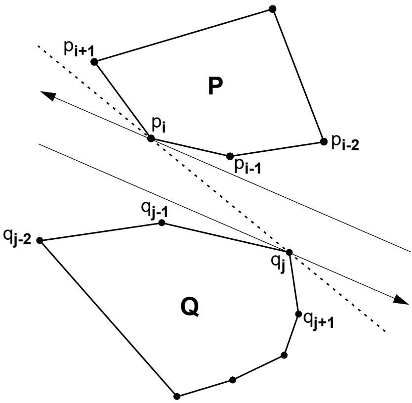
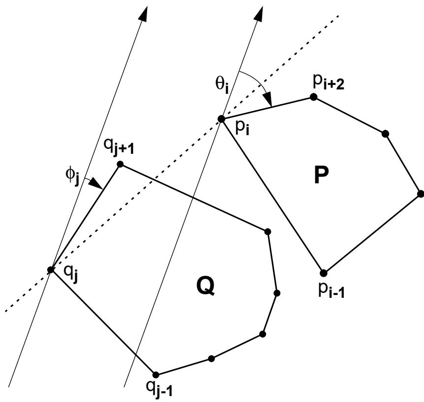
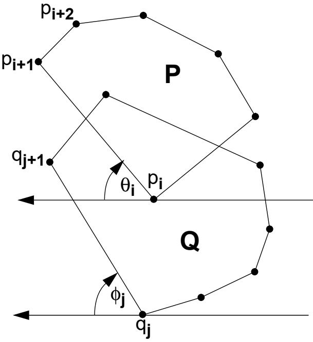
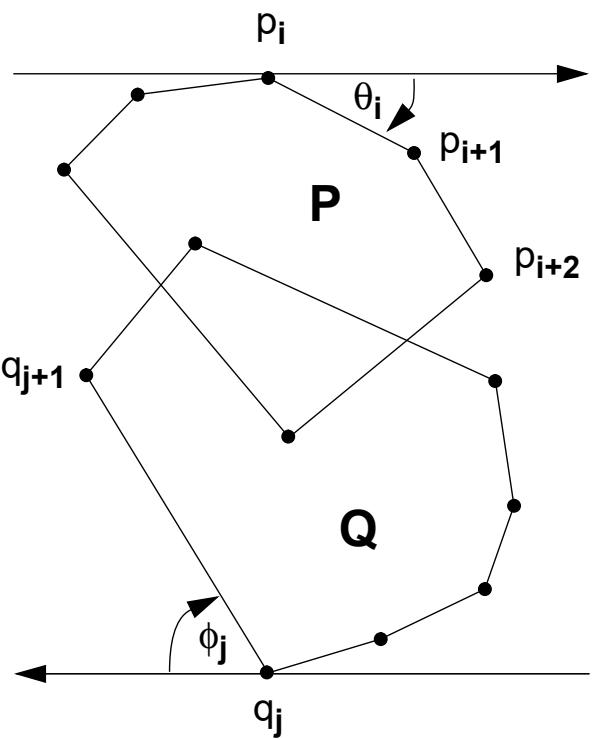
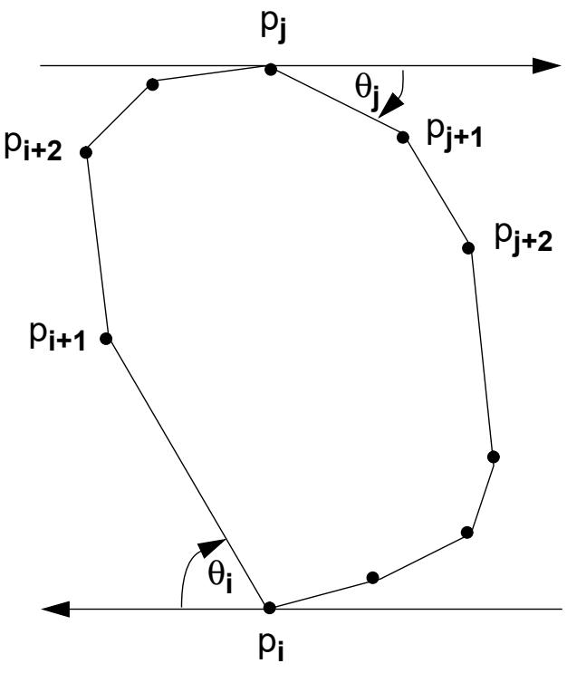
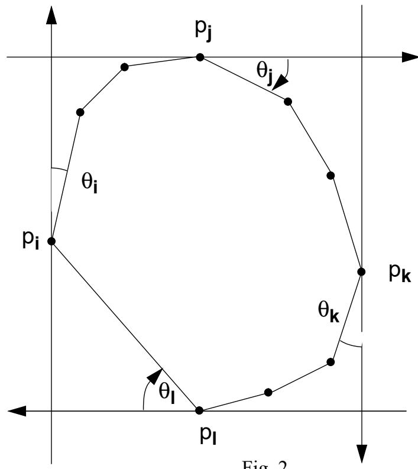

<!-- PDF_PAGE: 001 -->

It turns out however that the pair of vertices determining ${ \dot { \mathbf { d } } } _ { \operatorname* { m i n } } ,$ surprisingly, is neither a co-podal nor an antipodal pair and thus the techniques used with success on $\mathtt { d } _ { \operatorname* { m a x } }$ fail on ${ \bf d } _ { \mathrm { m i n } }$ . Finding an O(n) algorithm for the latter problem remains an open question.

The field of computational geometry is in need of general principles and methodologies that can be used to solve large classes of problems. Shamos [1] established that the Voronoi diagram is one such general structure that can be used to solve a variety of geometric problems efficiently. The results of this paper would indicate that the “rotating calipers” are another general tool for solving geometric problems.

## 8. References

[1] M.I. Shamos, “Computational geometry”, Ph.D. thesis, Yale University, 1978.

[2] H. Freeman and R. Shapira, “Determining the minimum-area encasing rectangle for an arbitrary closed curve”, Comm. A.C.M., Vol. 18, July 1975, pp. 409-413.

[3] F.C.A. Groen et al., “The smallest box around a package”, Tech. Report, Delft University of Technology.

[4] G.T. Toussaint, “Pattern recognition and geometrical complexity”, Proc. Fifth International Conference on Pattern Recognition, Miami Beach, December 1980, pp. 1324- 1347.

[5] R.O. Duda and P.E. Hart, Pattern Classification and Scene Analysis, Wiley, New York, 1973.

[6] B.K Bhattacharya and G.T. Toussaint, “Efficient algorithms for computing the maximum distance between two finite planar sets”, Journal of Algorithms, in press.

[7] G.T. Toussaint and J.A. McAlear, “A simple O(n log n) algorithm for finding the maximum distance between two finite planar sets”, Pattern Recognition Letters, Vol. 1, October 1982, pp. 21-24.

[8] T. Lozano-Perez, “An algorithm for planning collision-free paths among polyhedral ob stacles”, Comm. ACM, Vol. 22, 1979, pp. 560-570.

[9] F.P. Preparata and S. Hong, “Convex hulls of finite sets of points in two and three dimensions”, Comm. ACM, Vol. 20, 1977, pp. 87-93.

[10] H. Edelsbrunner et al., “Graphics in flatland: a case study”, Tech. Rept., University of Waterloo, CS-82-25, August 1982.

[11] L.J. Guibas and F.F. Yao, “On translating a set of rectangles”, Proc. of the Twelfth Annual ACM Symposium on Theory of Computing, Los Angeles, April 1980, pp. 154-160.

[12] J. O’Rourke, “An on-line algorithm for fitting straight lines between data ranges”, Comm. ACM, Vol. 24, September 1981, pp. 574-578.

[13] U. Grenander, Pattern Synthesis, Springer-Verlag, New York, 1976.

<!-- PDF_PAGE: 002 -->

A typical problem in two-dimensional graphics consists of computing all visibility lists of a set of objects for a tour or a path taken on the plane by an observer [10]. The first step of an algorithm for solving this task consists of partitioning the plane into regions $\mathrm { R _ { i } }$ such that the visibility list is the same for an observer stationed anywhere in some fixed region. For two convex polygons the two CS lines partition the plane into the required visibility regions.

## 6.2 Collision avoidance

Visibility and collision avoidance problems are closely related [11]. Given two convex polygons P and Q we may ask whether Q can be translated by an arbitrary amount in a specified direction without “colliding” with P. The CS lines provide an answer to this question.

## 6.3 Range fitting and linear separability

Both of these problems involve finding a line that separates two convex polygons [12]. The critical support lines provide one solution to these problems. Consider Figure 6, where $\operatorname { L } ( \mathfrak { p } _ { \mathrm { i } } , \mathfrak { q } _ { \mathrm { j } } )$ and $\mathrm { L } ( \mathfrak { p } _ { \mathrm { i } - 2 } , \mathfrak { q } _ { \mathrm { i } - 2 } )$ are the two CS lines. Denote their intersection by l\*. We can choose as our separating line that line that goes through $^ { 1 \ast }$ and bisects angle $\mathsf { p } _ { \mathrm { i } } 1 ^ { \ast } \mathsf { q } _ { \mathrm { j } - 2 }$

## 6.4 The Grenander distance

Given two disjoint convex polygons P and Q there are many ways of defining the distance between P and Q. One method already discussed is $\mathtt { d } _ { \operatorname* { m a x } } ( \mathrm { P } , \mathrm { Q } )$ . Grenander [13] uses a distance measure based on CS lines. Let $\mathrm { L E } ( { \mathfrak { p } } _ { \mathrm { i } } , { \mathfrak { p } } _ { \mathrm { i } } )$ denote the sum of the edge lengths of the polygonal chain $\mathsf { p } _ { \mathrm { i } } ^ { \cdot }$ $\mathfrak { p } _ { \mathrm { i + l } } , . . . , \mathfrak { p } _ { \mathrm { j - l } } , \mathfrak { p } _ { \mathrm { j } }$ and refer to Figure 6. The distance between P and Q would be

$$
\mathrm { d _ { s e p } ( P , Q ) = d ( p _ { i } , q _ { j } ) + d ( p _ { i - 2 } , q _ { j - 2 } ) - L E ( p _ { i - 2 } , p _ { i } ) - L E ( q _ { j - 2 } , q _ { j } ) . }
$$

Clearly the computation of $\dot { \mathbf { d } } _ { \mathrm { s e p } }$ is dominated by the computation of CS lines.

## 6.5 Computing the CS lines

Theorem 6.1: Two vertices $\mathsf { p } _ { \mathrm { i } } \varepsilon \mathrm { P }$ and $\mathfrak { q } _ { \mathrm { i } } \mathfrak { E } \mathrm { Q }$ determine a critical support line if, and only if, they form an antipodal pair and $\mathsf { p } _ { 1 + 1 } , \mathsf { p } _ { 1 - 1 }$ lie on one side of $\mathsf { L } ( \mathsf { p } _ { \mathrm { i } } , \mathsf { q } _ { \mathrm { j } } )$ while $\mathfrak { q } _ { \mathrm { j } - 1 } , \mathfrak { q } _ { \mathrm { j } + 1 }$ lie on the other side of $\operatorname { L } ( { \mathfrak { p } } _ { \mathrm { i } } , { \mathfrak { q } } _ { \mathrm { j } } )$

The above theorem allows us to proceed as for finding bridge points. We can determine if an antipodal pair is a CS line pair in O(1) time for a total running time O(n). Thus all the problems mentioned in section 6 can also be solved simply in O(n) time using the “rotating calipers”.

## 7. Conclusion

In section 3 the problem of computing ${ \bf d } _ { \mathrm { m a x } } ( \mathrm { P } , \mathrm { Q } )$ was solved with the rotating calipers. One naturally considers the alternate problem of computing

$$
\mathrm { d _ { \mathrm { m i n } } ( P , Q ) = \begin{array} { l } { { m i n } } \\ { { i , j } } \end{array} \{ d ( p _ { \mathrm { i } } , { \mathrm { p } } _ { \mathrm { j } } ) \} ~ i , j = 1 , 2 , . . . , n . }
$$

  
Fig. 6

<!-- PDF_PAGE: 003 -->

The following theorem leads to the desired algorithm.

Theorem 5.1: Two vertices $\mathsf { p } _ { \mathrm { { i } } } \varepsilon \mathrm { { P } }$ and ${ \mathfrak { q } } _ { \mathrm { i } } \varepsilon { \mathbf { Q } }$ are bridge points if, and only if, they form a co-podal pair and the vertices $\mathfrak { p } _ { \mathrm { i - l } } , \mathfrak { p } _ { \mathrm { i + l } } , \mathfrak { q } _ { \mathrm { j - l } } , \mathfrak { q } _ { \mathrm { j + l } }$ all lie on the same side of $\operatorname { L } ( \mathfrak { p } _ { \mathrm { i } } , \mathfrak { q } _ { \mathrm { j } } )$

For example, in Figure $5 \mathfrak { p } _ { \mathrm { i } }$ and ${ \mathfrak { q } } _ { \mathrm { j } }$ are co-podal but $\mathfrak { q } _ { \mathrm { j } + 1 }$ lies above $\operatorname { L } ( \mathfrak { p } _ { \mathrm { i } } , \mathfrak { q } _ { \mathrm { i } } )$ . Hence $\mathsf { p } _ { \mathrm { i } } \mathsf { q } _ { \mathrm { j } }$ is not a bridge. A simple algorithm for finding the bridges now becomes clear. As the co-podal pairs are being generated during “caliper rotation” we merely test the four adjacent vertices of the co-podal vertices to determine if they lie on the same side of the line collinear with the co-podal vertices, and we stop when two bridges have been found. Thus we can determine whether a co-podal pair is a bridge in O(1) time and the entire algorithm runs in O(n) time.

## 6. Finding Critical Support Lines

Given two disjoint convex polygons P and Q a critical support line is a line $\operatorname { L } ( \mathfrak { p } _ { \mathrm { i } } , \mathfrak { q } _ { \mathrm { i } } )$ such that it is a line of support for P at $\mathsf { p } _ { \mathrm { i } } ,$ for Q at ${ \mathfrak { q } } _ { \mathrm { j } } .$ and such that P and Q lie on opposite sides of $\cdot ( \mathfrak { p } _ { \mathrm { i } } , \mathfrak { q } _ { \mathrm { j } } )$ . Critical support (CS) lines have applications in a variety of problems.

## 6.1 Visibility

  
Fig. 5

<!-- PDF_PAGE: 004 -->

Finally, theorem 4.5 allows us to use the rotating calipers to construct $\mathrm { P } \oplus \mathrm { Q }$ while searching the co-podal pairs of vertices.

Theorem 4.5: Let $\mathsf { z } _ { \mathrm { k } } = \mathsf { p } _ { \mathrm { i } } \oplus \mathsf { q } _ { \mathrm { i } }$ denote the vertex of $\mathrm { P } \oplus \mathrm { Q }$ being considered. Then the succeeding vertex $\begin{array} { r } { z _ { \mathrm { k + 1 } } = \mathsf { p } _ { \mathrm { i } } \oplus \mathsf { q } _ { \mathrm { j + 1 } } \mathrm { i f } \oplus _ { \mathrm { j } } < \mathsf { \theta } _ { \mathrm { i } } , \mathsf { z } _ { \mathrm { k + 1 } } = \mathsf { p } _ { \mathrm { i } + 1 } \oplus \mathsf { q } _ { \mathrm { j } } \mathrm { i f } \theta _ { \mathrm { i } } < \emptyset _ { \mathrm { j } } , \mathrm { a n d } \mathsf { z } _ { \mathrm { k + 1 } } = \mathsf { p } _ { \mathrm { i } + 1 } \oplus \mathsf { q } _ { \mathrm { j } + 1 } \mathrm { i f } \theta _ { \mathrm { i } } = \emptyset _ { \mathrm { j } } } \end{array}$

Thus, each vertex of P $\oplus { } Q$ can be constructed in O(1) time after an O(n) initialization step, and since there are at most 2n such vertices, O(n) time suffices to compute $\mathsf { P } \oplus \mathsf { Q }$

## 5. Merging Convex Hulls

A typical divide-and-conquer approach to finding the convex hull of a set of n points on the plane consists of sorting the points along the x axis and subsequently merging bigger and bigger convex polygons until one final convex polygon is obtained [9]. Performing the merge in linear time will guarantee an O(n log n) upper bound on the complexity of the entire process. Merging two convex polygons P, Q consists of essentially finding two pairs of vertices $\mathrm { p } _ { \mathrm { i } } , \mathrm { p } _ { \mathrm { j } }$ and ${ \mathrm { q } } _ { \mathrm { k } } , { \mathrm { q } } _ { \mathrm { l } }$ such that the new edges $\mathrm { p } _ { \mathrm { i } } \mathrm { q } _ { \mathrm { k } }$ and ${ \mathfrak { q } } _ { \mathrm { l } } { \mathfrak { p } } _ { \mathrm { j } } ^ { . }$ , together with the two outer chains $\mathfrak { q } _ { \mathrm { k } } , \mathfrak { q } _ { \mathrm { k } + 1 } , . . . , \mathfrak { q } _ { \mathrm { l } }$ and $\mathfrak { p } _ { \mathrm { j } } , \mathfrak { p } _ { \mathrm { j } ^ { + } 1 } , . . . , \mathfrak { p } _ { \mathrm { i } }$ form the convex hull of $\mathrm { P } \cup \mathrm { Q }$ . An edge such as $\mathrm { p } _ { \mathrm { i } } \mathrm { q } _ { \mathrm { k } }$ is called a $b r i d g e$ and the vertices making up a bridge (such as $\mathfrak { p } _ { \mathrm { i } }$ and ${ \sf q _ { \bf k } } )$ are referred to as bridge points. While ${ \mathrm { O } } ( { \mathrm { n } } )$ algorithms exist for finding the bridges of two disjoint convex polygons [9], we show here that the bridges can also be computed very simply with the rotating calipers.

  
Fig. 4

## <!-- PDF_PAGE: 005 -->

4. The Vector Sum of Two Convex Polygons

Consider two convex polygons P and Q. Given a point ${ \bf r } = ( { \bf x } _ { \mathrm { r } } , { \bf y } _ { \mathrm { r } } ) \varepsilon$ P and a point $\mathbf { s } = ( \mathbf { x } _ { \mathrm { s } } , \mathbf { y } _ { \mathrm { s } } )$ $\varepsilon _ { \mathrm { ~ Q ~ } }$ , the vector sum of r and ${ \bf S } ,$ denoted by $\mathbf { r } \oplus$ s is a point on the plane $\mathrm { \Delta t = ( x _ { r } + x _ { s } , y _ { r } + y _ { s } ) }$ . The vector sum of the two sets $\mathrm { P }$ and Q, denoted as $\mathsf { P } \oplus \mathsf { Q }$ is the set consisting of all the elements obtained by adding every point in $\mathrm { Q }$ to every point in P. Vector sums of polygons and polyhedra have applications in collision avoidance problems [8]. The following theorems make the problem computable.

Theorem 4.1: $\mathsf { P } \oplus \mathsf { Q }$ is a convex polygon.

Theorem 4.2: $\mathsf { P } \oplus \mathsf { Q }$ has no more than 2n vertices.

Theorem 4.3: The vertices of P $\oplus { } Q$ are vector sums of the vertices of P and $\mathrm { Q }$

These theorems suggest the following algorithms for computing $\mathrm { ~ P ~ @ ~ Q ~ }$ . First compute $\mathsf { p } _ { \mathrm { i } } \oplus$ ${ \mathfrak { q } } _ { \mathfrak { j } } ,$ for ${ \mathrm { i } } , { \mathrm { j } } = 1 , 2 , \ldots ,$ n to obtain $\mathtt { n } ^ { 2 }$ candidates for the vertices of P ⊕ Q. Then apply an O(n log n) convex hull algorithm to the candidates. The total running time of such an algorithm is $\mathrm { O } ( \mathrm { n } ^ { 2 } \log \mathrm { n } )$

We now show that $\mathrm { ~ P ~ } \ @ \mathrm { ~ Q ~ }$ can be computed in ${ \mathrm { O } } ( { \mathrm { n } } )$ time using the rotating calipers. Two vertices $\mathsf { p } _ { \mathrm { { i } } } \varepsilon \mathrm { { P } }$ and ${ \mathfrak { q } } _ { \mathrm { j } } \varepsilon { \mathrm { Q } }$ that admit parallel lines of support in the same direction as illustrated in Figure 4 will be referred to as a co-podal pair. The following theorem allows us to search only copodal pairs of P and Q in constructing $\mathrm { ~ P ~ @ ~ Q ~ }$

Theorem 4.4: The vertices of $\mathsf { P } \oplus \mathsf { Q }$ are vector sums of co-podal pairs of P and $\mathrm { \bf Q }$ to that of the first set. All this can be done in O(n) time. As in Shamos’ diameter algorithm we now have four, instead of two, angles to consider $\theta _ { \mathrm { i } } , \theta _ { \mathrm { i } } , \theta _ { \mathrm { k } }$ and $\theta _ { \mathrm { l } }$ . Let $\theta _ { \mathrm { i } } =$ min $\{ \theta _ { \mathrm { i } } , \theta _ { \mathrm { j } } , { \bar { \theta } } _ { \mathrm { k } } , \theta _ { \mathrm { l } } \}$ ${ \mathrm { W e } } ^ { \bullet } \mathrm { r o } \cdot$ tate” the four lines of support by an angle $\Theta _ { \mathrm { i } } , \mathrm { L } ( \mathrm { p } _ { \mathrm { i } } , \mathrm { p } _ { \mathrm { i + 1 } } )$ forms the base line of the rectangle associated with edge $\mathsf { p } _ { \mathrm { i } } \mathsf { p } _ { \mathrm { i } + 1 }$ and the corners of the rectangle can be computed easily in ${ \mathrm { O } } ( 1 )$ time from the coordinates of $\mathfrak { p } _ { \mathrm { i } } , \mathfrak { p } _ { \mathrm { i } + 1 } , \mathfrak { p } _ { \mathrm { j } } , \mathfrak { p } _ { \mathrm { k } }$ and $\mathsf { p } _ { \mathrm { l } }$ . We now have a new set of angles and the procedure is repeated until we scan the entire polygon. The area of each rectangle can be computed in constant time in this way resulting in a total running time of $\mathrm { O } ( { \mathfrak { n } } )$ . Another O(n) algorithm that implements this idea using a data structure known as a star is described in [4].

  
Fig. 3

## <!-- PDF_PAGE: 006 -->

3. The Maximum Distance Between Two Convex Polygons

Let $\mathbf { P } = ( \mathsf { p } _ { 1 } , \mathsf { p } _ { 2 } , . . . , \mathsf { p } _ { \mathrm { n } } )$ and $\mathrm { Q } = ( \mathrm { q } _ { 1 } , \mathrm { q } _ { 2 } , . . . , \mathrm { q } _ { \mathrm { n } } )$ be two convex polygons. The maximum distance between P and Q, denoted by $\mathrm { d } _ { \mathrm { m a x } } ( \mathrm { P } , \mathrm { Q } )$ , is defined as

$$
{ \bf d _ { \mathrm { { m a x } } } ( P , Q ) } = \begin{array} { c } { { m a x } } \\ { { i , j } } \end{array} \{ { \bf d ( p _ { i } , q _ { j } ) } \} \ { \bf i , j } = 1 , 2 , . . . , { \bf n } ,
$$

where $\mathrm { d } ( \mathsf { p } _ { \mathrm { i } } , \mathsf { q } _ { \mathrm { i } } )$ is the euclidean distance between $\mathfrak { p } _ { \mathrm { i } }$ and ${ \mathfrak { q } } _ { \mathrm { j } }$ . This distance measure has applications in cluster analysis [5]. A rather complicated ${ \mathrm { O } } ( { \mathrm { n } } )$ algorithm for this problem appears in [6]. However, a very simple solution can be obtained by using a pair of calipers as in Figure 3. In Figure 3 the parallel lines of support $\mathrm { L } _ { \mathrm { s } } ( \mathsf { q } _ { \mathrm { i } } )$ and $\mathrm { L _ { s } ( p _ { i } ) }$ have opposite directions and thus $\mathfrak { p } _ { \mathrm { i } }$ and ${ \mathfrak { q } } _ { \mathrm { j } }$ are an antipodal pair between the sets P and Q. The two lines of support define two angles . $\theta _ { \mathrm { i } }$ and $\Phi _ { \mathrm { j } } .$ , and the algorithm proceeds as in the diameter problem of Shamos [1]. Note that $\mathrm { d } _ { \mathrm { m a x } } ( \mathrm { P } , \mathrm { Q } ) \neq$ diameter $\left( \mathrm { P } \cup \mathrm { Q } \right)$ in general and thus we cannot use the diameter algorithm on $\mathrm { P } \cup \mathrm { Q }$ to solve this problem. For further details the reader is referred to [7].

  
Fig. 1

  
Fig. 2  
<!-- PDF_PAGE: 007 -->

In this paper we show that this simple idea can be generalized in two ways: several sets of calipers can be used on one polygon or one pair of calipers can be used on several polygons. We then show that these generalizations provide simple O(n) solutions to a variety of geometrical problems defined on convex polygons. Such problems include the minimum-area enclosing rectangle, the maximum distance between sets, the vector sum of two convex polygons, merging convex polygons, and finding the critical support lines of linearly separable sets. The last problem, in turn, has applications to problems concerning visibility, collision avoidance, range fitting, linear separability, and computing the Grenander distance between sets.

## 2. The Smallest-Area Enclosing Rectangle

This problem has received attention recently in the image processing literature and has applications in certain packing and optimal layout problems [2] as well as automatic tariffing in goodstraffic [3]. Freeman and Shapira [2] prove the following crucial theorem for solving this problem

Theorem 2.1: The rectangle of minimum area enclosing a convex polygon has a side collinear with one of the edges of the polygon.

The algorithm presented in [2] constructs a rectangle in ${ \mathrm { O } } ( { \mathrm { n } } )$ time for each edge of P and selects the smallest of these for a total running time of ${ \mathrm { O } } ( { \mathrm { { n } } } ^ { 2 } )$ .

This problem can be solved in ${ \mathrm { O } } ( { \mathrm { n } } )$ time using two pairs of calipers orthogonal to each other. Let $\mathrm { L _ { s } ( p _ { i } ) }$ denote the directed line of support of the polygon at vertex $\mathfrak { p } _ { \mathrm { i } }$ such that P is to the right of the line. Let $\mathrm { L ( p _ { i } , p _ { j } ) }$ denote the line through $\mathfrak { p } _ { \mathrm { i } }$ and p . The first step consists of finding the ver- $\mathsf { p } _ { \mathrm { j ^ { \prime } } }$ tices with the minimum and maximum x and y coordinates. Let these vertices be denoted by $\mathrm { { p } _ { i } , \mathrm { { p } _ { k } } }$ 2 $\mathsf { p } _ { \mathrm { l } } ,$ and ${ \mathfrak { p } } _ { \mathrm { j } } ,$ respectively, and refer to Figure 2. We next construct $\mathrm { { L } _ { s } ( \mathbf { p } _ { j } ) }$ and $\mathtt { L } _ { \mathtt { s } } ( \mathtt { p } _ { \mathtt { l } } )$ as the first set of calipers in the x direction, and $\mathrm { L _ { s } ( p _ { i } ) , L _ { s } ( p _ { k } ) }$ as the second set of calipers in a direction orthogonal

# <!-- PDF_PAGE: 008 -->

Solving Geometric Problems with the Rotating Calipers \*

Godfried Toussaint   
School of Computer Science McGill University   
Montreal, Quebec, Canada

## ABSTRACT

Shamos [1] recently showed that the diameter of a convex n-sided polygon could be computed in O(n) time using a very elegant and simple procedure which resembles rotating a set of calipers around the polygon once. In this paper we show that this simple idea can be generalized in two ways: several sets of calipers can be used simultaneously on one convex polygon, or one set of calipers can be used on several convex polygons simultaneously. We then show that these generalizations allow us to obtain simple O(n) algorithms for solving a variety of problems defined on convex polygons. Such problems include (1) finding the minimum-area rectangle enclosing a polygon, (2) computing the maximum distance between two polygons, (3) performing the vector-sum of two polygons, (4) merging polygons in a convex hull finding algorithms, and (5) finding the critical support lines between two polygons. Finding the critical support lines, in turn, leads to obtaining solutions to several additional problems concerned with visibility, collision, avoidance, range fitting, linear separability, and computing the Grenander distance between sets.

## 1. Introduction

Let $\mathbf { P } = ( \mathsf { p } _ { 1 } , \mathsf { p } _ { 2 } , . . . , \mathsf { p } _ { \mathrm { n } } )$ be a convex polygon with n vertices in standard form, i.e., the vertices are specified according to cartesian coordinates in a clockwise order and no three consecutive vertices are colinear. We assume the reader is familiar with [1]. In [1] Shamos presents a very simple algorithm for computing the diameter of P. The diameter is the greatest distance between parallel lines of support of P. A line L is a line of support of P if the interior of P lies completely to one side of L. We assume here that L is directed such that P lies to the right of L. Figure 1 illustrates two parallel lines of support. A pair of vertices $\mathrm { { p } _ { i } , \mathrm { { p } _ { j } } }$ is an antipodal pair if it admits parallel lines of support. The algorithm of Shamos [1] generates all O(n) antipodal pairs of vertices and selects the pair with largest distance as the diameter-pair. The procedure resembles rotating a pair of dynamically adjustable calipers once around the polygon. Consider Figure 1. To initialize the algorithm a direction such as the x-axis is chosen and the two antipodal vertices $\mathsf { p } _ { \mathrm { i } }$ and $\mathsf { p } _ { \mathrm { j } }$ can be found in O(n) time. To generate the next antipodal pair we consider the angles that the lines of support at $\mathfrak { p } _ { \mathrm { i } }$ and $\mathsf { p } _ { \mathrm { j } }$ make with edges $\mathsf { p } _ { \mathrm { i } } \mathsf { p } _ { \mathrm { i } + 1 }$ and $\mathsf { p } _ { \mathrm { j } } \mathsf { p } _ { \mathrm { j } + \mathrm { l } }$ , respectively. Let angle $\Theta _ { \mathrm { i } } < \Theta _ { \mathrm { i } }$ . Then we “rotate” the lines of support by an angle θj, and $\mathsf { p } _ { \mathrm { j } + \mathrm { l } } , \mathsf { p } _ { \mathrm { i } }$ becomes the next antipodal pair. This process is continued until we come full circle to the starting position. In the event that $\bar { \mathsf { \theta _ { j } } } = \mathsf { \theta _ { i } }$ three new antipodal pairs are generated.