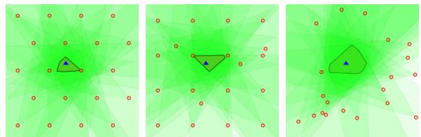
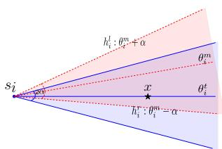
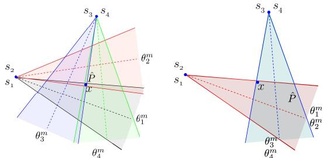
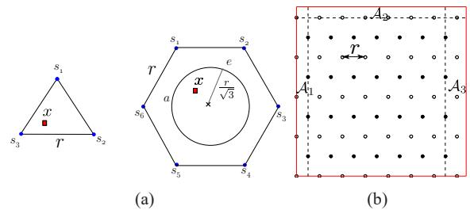

# Sensor Placement and Selection for Bearing Sensors with Bounded Uncertainty

Pratap Tokekar and Volkan Isler

Abstract— We study the problem of placing bearing sensors so as to estimate the location of a target in a square environment. We consider sensors with unknown but bounded noise: the true location of the target is guaranteed to be in a 2α-wedge around the measurement, where α is the maximum noise. The quality of the placement is given by the area or diameter of the intersection of measurements from all sensors in the worst-case (i.e. regardless of the target’s location). We study the bi-criteria optimization problem of placing a small number of sensors while guaranteeing a worst-case bound on the uncertainty.

Our main result is a constant-factor approximation: We show that in general when $\alpha ~ \leq ~ { \frac { \pi } { 4 } } .$ , at most $9 n ^ { * }$ sensors placed on a triangular grid has diameter and area uncertainty of at most $5 . 8 8 U _ { D } ^ { * }$ and 7.76U A respectively, where $n ^ { * } , \bar { U } _ { D } ^ { * }$ and $U _ { A } ^ { * }$ are the number of sensors, diameter and area uncertainty of an optimal algorithm. In obtaining these results, we present some structural properties which may be of independent interest. We also show that in the triangular grid placement, only a constant number of sensors need to be activated to achieve the desired uncertainty, a property that can be used for designing energy/bandwidth efficient sensor selection schemes.

## I. INTRODUCTION

Sensor placement for target localization is a fundamental problem in robotics and sensor networks. A good placement scheme can improve the performance of sensor networks in applications such as intruder detection in surveillance, robot navigation using exteroceptive measurements, and providing location information to mobile devices for location-aware computing – a technology identified as key for the advancement of robotics [3].

Most sensors employed for localization have a strong structure associated with their sensing model. This structure plays a critical role in how information from multiple sensors can be combined. In this paper, we study the sensor placement problem for bearing sensors which are commonly used in robotic and networked sensor systems: monocular cameras, microphone/acoustic arrays, directional radio antennas, passive infrared receivers, etc., all measure bearing towards a target. We consider sensors measuring bearing corrupted by unknown but bounded noise. Bounded noise models provide a useful alternative to probabilistic models especially when a precise device model is not available (perhaps due to the difficulty of calibration or changing device parameters). Such models have long been used for state estimation [2] and for sensor fusion in robotics applications [7].

As an example, consider an application where sensors are deployed to be used as beacons for localizing a navigating robot (Figure 1). At each time instant, the robot can query the sensor network for their bearing measurements towards the robot. In the bounded uncertainty model, the true bearing to the robot is guaranteed to lie in a 2D wedge which is centered at the measured bearing and has an apex angle equal to the maximum sensing noise. Measurements from multiple sensors are combined by intersecting the corresponding wedges. The uncertainty in the robot’s estimate is usually taken to be the diameter or area of the intersection. We seek worstcase quality guarantees for our estimate: Given the true location of the robot, imagine an adversary choosing the noise values for sensors. The true location can be anywhere in the intersection and we would like this set to be “small” no matter where the robot is.

  
Fig. 1: Here, the area of intersection for a square grid1(middle) and random placement (right), for the true robot location (marked by triangle), is 1.32 and 3.27 times that of the triangular placement (left). In this paper, we derive the relationship between the triangular grid parameters and worst-case uncertainty, and show that the number of sensors required are near optimal.

We consider a simple workspace for the problem: The target can lie anywhere within a square without any obstacles or visibility constraints. Even in this basic setting, devising a sensor placement scheme is tricky. It is intuitively clear that the optimal placement should be some kind of a uniform grid. However it is not clear if the grid should be square, triangular or some other shape. Further, optimizing parameters of the grid (e.g. resolution) is not straightforward because as illustrated in Figure 1, the estimate is obtained by combining measurements from all sensors. This makes it difficult to express its area or diameter in closed-form in order to optimize grid parameters. While there have been attempts to find the optimal solution [14], the problem of optimal placement for bearing sensors remains open.

In this paper, we make progress towards solving this fundamental problem. We focus on placement on a triangular grid and derive the relationship between uncertainty and grid resolution. We prove that the number of sensors required to achieve a desired uncertainty is only a constant times that of an optimal algorithm. Furthermore for a triangular grid, only a constant number of sensors can be queried to obtain performance comparable to querying all sensors. This implies for our motivating example, the robot may query only a fixed number of nearby sensors to localize itself without losing much estimation quality.

The rest of the paper is organized as follows: We begin by presenting the related work in Section II. We describe the sensing model and formalize the problem in Section III. The analysis for lower bounds for an optimal placement, and upper bounds for a triangular grid placement is presented in Sections IV and V. Complete proofs for the analysis are presented in the accompanying technical report [13]. We conclude with a discussion of our results in Section VI.

## II. RELATED WORK

The problem of optimizing the placement of sensor nodes has received significant attention from the sensor networks community [15]. A large amount of research has focused on self-localization of networks, for example in the case of mobile, reconfigurable sensor networks [8] and for stationary sensor networks with reference anchor nodes [1]. In our present work, we assume that the locations of the sensors themselves are accurately known and focus on the complementary problem of placing sensors so as to localize targets.

For bearing sensors, the uncertainty in target’s estimate depends on the relative position of the sensors and the target. Motivated by this, Efrat et al. [5] studied the problem of minimizing the number of sensors to be placed in a polygon, such that each point in the polygon is visible from at least two sensors and their relative angle lies within a desired interval. They presented a log factor approximation, up to a fine discretization.

In addition to the relative angles, the uncertainty is also affected by the distance between the sensors and the target. Geometric Dilution of Precision (GDOP) is one measure relating the uncertainty with distance and relative angles. Tekdas and Isler [12] presented a placement scheme which guarantees that for any target location there are always two sensors whose GDOP is a constant factor of the GDOP achieved by any two sensors from an optimal placement. We do not restrict the estimator to use only two sensors, instead, allow combining all measurements. Ercan et al. [6] studied the problem of placing horizontal scan-line cameras along the boundary of a circular room to minimize leastsquares localization error for a target with a given prior. Their placement result shows that a uniform placement along the boundary is optimal. We allow sensors to be placed anywhere within a square workspace, without assuming any prior for the target’s location.

Isler and Magdon-Ismail [9] considered the problem of selecting a small subset of sensors from a given placement; each sensor’s output is a convex subset of the plane. They proved that irrespective of the total number of sensors, there is always a subset of four measurements that can be selected, which when combined yield an intersection area at most twice of that obtained by intersecting all measurements. In their problem, the placement of the sensors and the actual sensor measurements are already given. For the same placement of sensors, this subset would change if the measurement changes. This poses an interesting question whether there is some placement of sensors for which the same subset can be used to approximate the uncertainty region for different (but perhaps “nearby”) measurements. In this paper, we present a result in this direction for bearing measurements with bounded noise.

Bounded uncertainty models have previously been used in robotics problems. Detweiler et al. [4] and Spletzer and Taylor [11] studied the problem of selflocalization in passive beacon fields and robot networks respectively, using sensors yielding bounded uncertainty measurements. Song and O’Kane [10] studied the problem of maintaining approximation for robot’s possible locations obtained by intersecting pre-images from sensors yielding measurements with bounded noise. Set membership estimation [2] is an estimator designed for sensors yielding unknown but bounded noise, which has been applied for robot localization using bearing measurements [7]. We describe our bounded noise sensing and uncertainty model in the next section.

## III. PROBLEM FORMULATION

In this section, we first describe the notation, define the sensing and estimation models, and use them to formulate the problem studied in this paper.

## A. Notation and Sensing Model

  
Fig. 2: The actual measurement $\theta _ { i } ^ { m }$ lies anywhere between $\theta _ { i } ^ { t } \pm$ $\alpha . \ \bar { \theta } _ { i } ^ { t }$ is the true bearing. The wedge for a given measurement is guaranteed to contain the true target location x.

The workspace $\mathcal { A }$ is a $d \times d$ square. The target’s true location x can be anywhere within ${ \mathcal { A } } .$ Consider a sensor placement $S = \{ s _ { 1 } , \ldots , s _ { n } \}$ where each $s _ { i } \in \mathcal A$ denotes the sensor location. Each sensor measures the bearing towards the target as $\theta _ { i } ^ { m } = \theta _ { i } ^ { t } + n _ { i }$ , where $\theta _ { i } ^ { t } \in [ 0 , 2 \pi )$ is the true bearing (Figure 2). $n _ { i } ~ \in ~ [ - \alpha , + \alpha ]$ is the bounded sensor noise. α is the bound on the absolute noise in the sensor. The pre-image of a measurement $\theta _ { i } ^ { m }$ is a 2D wedge (denoted by $W ( s _ { i } , \theta _ { i } ^ { m } ) )$ as shown in Figure 2. This wedge is not the same as a fixed fieldof-view sensor; for the same target location, the sensor can receive any sensing wedge of angular width 2α so long as it contains the true target location.

The target estimate obtained by combining a set of measurements $\theta ^ { m } \ = \ [ \theta _ { 1 } ^ { m } , \dots , \theta _ { n } ^ { \dot { m } } ] ^ { T }$ from n sensors, is defined as the intersection of the n sensing wedges $W ( s _ { i } , \theta _ { i } ^ { m } )$ . That is, $\begin{array} { r } { \hat { P } ( S , \theta ^ { m } ) \triangleq \bigcap _ { i = 1 } ^ { n } W ( s _ { i } , \bar { \theta _ { i } ^ { m } } ) } \end{array}$ . Here $\hat { P }$ is a convex polygonal region which can possibly be unbounded.

## B. Adversarial Formulation of Uncertainty

The size of $\hat { P }$ depends on the actual measurements. Figure 3 shows two instances where the size of $\hat { P }$ differs significantly for different measurements obtained from the same placement of sensors. The actual measurements obtained by the sensors cannot be controlled by the user. However, we will show that by carefully placing the sensors one can guarantee there always exists a good set of valid measurements.

We model the objective using an adversarial process: Given a placement of sensors, an adversary selects a target location within the square and a corresponding set of measurements to maximize the uncertainty in the target estimate. We use two measures (area and diameter2 of $\hat { P } )$ to define the uncertainty. The diameter uncertainty of a placement $S$ is defined as:

  
Fig. 3: Two estimates for the same sensors and target location, but different measurements resulting in different uncertainty. We use worst-case intersection as the uncertainty measure.

$$
U _ { D } ( S ) \triangleq \operatorname* { m a x } _ { x \in \mathcal { A } } \operatorname* { m a x } _ { \theta ^ { m } \in \theta ( x ) } \operatorname { d i a m e t e r } ( \hat { P } ( S , \theta ^ { m } ) ) ,\tag{1}
$$

where $\theta ( x )$ is the set of valid measurements that can be obtained from S for a target location x. The area uncertainty can be similarly defined.

## C. Objective

Broadly, there are two factors that affect the worstcase uncertainty: (i) the number of sensors, and (ii) the location of placed sensors. In this work, we take the approach that the user specifies a desired uncertainty and the objective is to minimize the number of sensors and find the corresponding placement to guarantee that the worst-case uncertainty is below the user-specified value. In particular, we address the following problem:

Find the minimum number of sensors required and the corresponding placement to achieve a desired diameter uncertainty $U _ { D } ^ { * }$ (or area uncertainty $U _ { A } ^ { * } )$

Our main result shows that by placing sensors on a triangular grid-like placement, 9 times as many sensors as an optimal algorithm are sufficient to guarantee 5.88 times the desired diameter uncertainty (respectively, 7.76 times the area uncertainty) when the maximum sensing noise is less than $\frac { \pi } { 4 }$

Theorem 1: Let the maximum absolute noise for bearing sensors be $0 ~ < ~ \alpha ~ \leq ~ \frac { \pi } { 4 }$ . Let the desired diameter uncertainty for a d $\times \ d$ square environment be $\begin{array} { r l r } { U _ { D } ^ { * } } & { { } < } & { \frac { d } { 7 \sin \alpha } } \end{array}$ (respectively, area uncertainty be $\begin{array} { r } { U _ { A } ^ { * } ~ < ~ \frac { \pi \sin ^ { 2 } \alpha } { 1 9 6 } d ^ { 2 } ) } \end{array}$ . If an optimal placement algorithm achieves $U _ { D } ^ { * }$ (respectively, $U _ { A } ^ { * } )$ with $n ^ { * }$ sensors, then a triangular grid-like placement achieves at most $5 . 8 8 U _ { D } ^ { * }$ (respectively, at most $7 . 7 6 U _ { A } ^ { * } )$ with at most $9 n ^ { * }$ sensors.

The analysis for Theorem 1 is based on covering a $d \times d$ square with equilateral triangles of sensors. When the desired uncertainty is higher than the restriction in Theorem 1 and comparable to the size of , an optimal placement may use very few sensors. Nevertheless, even for that case the total number of sensors for the grid-like placement is bounded (given by Lemma 6).

In the following sections, we analyze the number of sensors required for an optimal algorithm and for a triangular grid-like placement. In this paper, we state the key lemmas and sketch their proofs. The full proofs are included in the accompanying technical report [13].

## IV. LOWER BOUNDS FOR OPTIMAL PLACEMENT

In this section, we first present lower bounds on the uncertainty achieved by any placement of sensors in the plane. We apply this to bound the number of sensors placed within by an optimal algorithm.

First consider the case when the maximum sensing noise $\alpha \geq \frac { \pi } { 2 }$ , i.e., the sensing wedges are at least halfplanes. We show that the adversary can always choose a valid measurement set for any placement, such that the sensing wedges have an unbounded intersection.

Lemma 1: For any placement S of n bearing sensors with maximum absolute noise $\alpha \ \geq \ \frac { \pi } { 2 }$ , there exists a measurement set $\theta ^ { m }$ such that the intersection of the wedges $\begin{array} { r } { ( \bigcap _ { i = 1 } ^ { n } W \left( s _ { i } , \theta _ { i } ^ { m } \right) ) } \end{array}$ is unbounded.

Lemma 1 implies that when $\alpha \geq \frac { \pi } { 2 }$ the uncertainty can be as large as , i.e., ${ \cal U } _ { A } ( S ) \ = \ \Theta ( d ^ { 2 } )$ and $U _ { D } ( S ) = \Theta ( d )$ for any placement of sensors, including the optimal. The proof is based on constructing a simple instance when $\begin{array} { r } { \alpha = \frac { \pi } { 2 } } \end{array}$ , i.e., the sensing wedges are halfplanes. We create a measurement set where the lines corresponding to all half-planes pass through the target location. We assign directions to all half-planes to ensure that their intersection is unbounded.

Lemma 1 is not surprising, since $\alpha \geq \frac { \pi } { 2 }$ corresponds to very high noise. In practice, bearing sensors are much more accurate. For the rest of the paper, we only focus on the case when the maximum sensing noise $\alpha < \frac { \pi } { 2 }$

In the following, we will lower bound the uncertainty for any placement parametrized by the distance of the target to the closest sensor. Recall from Equation 1, the uncertainty is defined as the max over all possible target locations, and all valid measurements. Hence, for a lower bound, it is sufficient to consider a particular target location and valid measurement set, as given next.

Lemma 2: If there exists a circle C with radius r which doesn’t contain any sensor from a placement

$S$ of n bearing sensors, then the diameter uncertainty is bounded as $U _ { D } ( S ) \geq$ 2r sin α (respectively, $U _ { A } ( S ) \geq \pi r ^ { 2 } \sin ^ { 2 } \alpha )$

To prove Lemma 2, we show that when the target lies at the center of C and each sensor receives a measurement equal to the true bearing, a circle of radius r sin α centered at the target lies completely within the intersection of all sensing wedges. This instance gives a lower bound for the worst-case uncertainty.

When a desired uncertainty is given, we can apply Lemma 2 to find the radius of the largest such circle lying in the workspace  and not containing any sensor.

Corollary 1: Let $S ^ { * }$ be an optimal placement achieving a desired diameter uncertainty $U _ { D } ^ { * }$ (respectively, area uncertainty $U _ { A } ^ { * } )$ in a square workspace of side d. $\operatorname { I f } r ^ { * }$ is the radius of the largest circle lying completely within $\mathcal { A }$ and not containing any sensor in its interior, then $\begin{array} { r } { r ^ { \ast } \leq \frac { U _ { D } ^ { \ast } } { 2 \sin { \alpha } } } \end{array}$ (respectively, $\begin{array} { r } { r ^ { \ast } \leq \sqrt { \frac { U _ { A } ^ { \ast } } { \pi } } \frac { 1 } { \sin { \alpha } } ) } \end{array}$

Corollary 1 implies an upper bound on how far each point in $\mathcal { A }$ can be from any sensor or the boundary of . This allows us to bound the number of sensors required for an optimal algorithm as a function of $r ^ { * }$ Corollary 2 states that $\Omega \overline { { ( \frac { d ^ { 2 } } { r ^ { 2 } } ) } }$ sensors are needed to guarantee coverage of a $d \times d$ area.

Corollary 2: Let $r ^ { * }$ be the radius of the largest circle within a square of side $d ,$ not containing any sensor from an optimal placement in its interior. If the desired diameter uncertainty is $U _ { D } ^ { * } ~ <$ d sin α (respectively, $U _ { A } ^ { * } ~ < ~ d ^ { 2 } \frac { \pi \sin ^ { 2 } \alpha } { 4 } )$ then the number of sensors for an optimal algorithm $\begin{array} { r } { n ^ { * } \geq \frac { ( d - 2 r ^ { * } ) ^ { 2 } } { \pi r ^ { * 2 } } } \end{array}$

When $d \leq 2 r ^ { * }$ , the desired uncertainty is comparable to ${ \mathcal { A } } ,$ and the optimal algorithm would place very few sensors, yielding a trivial lower bound. The bound on the uncertainty implies that $d > 2 r ^ { * }$ is an interesting case: If $d > 2 r ^ { * }$ , then there is a smaller square within $\mathcal { A }$ where all points are more than $r ^ { * }$ away from the boundary and hence require at least one sensor within $r ^ { * }$ . We can show that the set of circles of radii $r ^ { * }$ drawn about each sensor in the optimal placement, should form a cover of this smaller square, yielding the bound.

## V. PERFORMANCE OF THE TRIANGULAR GRID

Next, we analyze the number of sensors required and the uncertainty for a triangular grid-like placement. While for lower bounds it sufficed to consider specific instances, upper bounds require considering all possible target locations and sets of measurements.

## A. Uncertainty with Triangular Grid

Before the main analysis, first consider two special configurations of sensors: (i) three sensors placed on the vertices of an equilateral triangle $\triangle s _ { 1 } s _ { 2 } s _ { 3 }$ with side r, when $0 ~ < ~ \alpha ~ < ~ \frac { \pi } { 6 }$ , and (ii) six sensors placed on the vertices of a regular hexagon when $\begin{array} { r } { \frac { \pi } { 6 } \leq \alpha \leq } \end{array}$ $\frac { \pi } { 4 }$ . For case (i), the target may lie anywhere within $\triangle s _ { 1 } s _ { 2 } s _ { 3 }$ (Figure 4(a)). We further divide the analysis into intervals based on $\alpha ,$ given next.

Lemma 3: Let $\triangle s _ { 1 } s _ { 2 } s _ { 3 }$ be an equilateral triangle of side r with a bearing sensor placed at each vertex. If the target lies within $\triangle s _ { 1 } s _ { 2 } s _ { 3 }$ and $S = \{ s _ { 1 } , s _ { 2 } , s _ { 3 } \}$ then

$$
U _ { D } ( S ) \leq { \left\{ \begin{array} { l l } { 1 1 . 3 5 r \sin \alpha } & { 0 < \alpha < { \frac { \pi } { 1 8 } } , } \\ { 2 . 0 4 r } & { { \frac { \pi } { 1 8 } } \leq \alpha < { \frac { \pi } { 1 2 } } , } \\ { \left( 1 + { \frac { 1 } { \sqrt { 3 } } } \right) r } & { { \frac { \pi } { 1 2 } } \leq \alpha < { \frac { \pi } { 6 } } } \end{array} \right. }
$$

and,

$$
U _ { A } ( S ) \leq \left\{ \begin{array} { l l } { 2 3 . 4 6 r ^ { 2 } \sin ^ { 2 } \alpha } & { 0 < \alpha < \frac { \pi } { 1 8 } , } \\ { \frac { \sqrt { 3 } r ^ { 2 } } { 4 } + 1 0 . 1 ( r \sin \alpha ) ^ { 2 } } & { \frac { \pi } { 1 8 } \leq \alpha < \frac { \pi } { 1 2 } , } \\ { \frac { 3 \sqrt { 3 } r ^ { 2 } } { 4 } } & { \frac { \pi } { 1 2 } \leq \alpha < \frac { \pi } { 6 } . } \end{array} \right.
$$

The proof partitions the triangle into three regions, and assigns sensors for each region such that any valid set of measurements results in bounded intersection. The sensing wedges corresponding to each partition are approximated to bound their intersection.

When $\alpha \geq \frac { \pi } { 6 }$ , the sensing wedges become too large to result in bounded intersection with just three sensors. Instead we use six sensors, placed on a regular hexagon with center o and side r, to bound their intersection. The target can lie anywhere within a circle of radius $\scriptstyle { \frac { r } { \sqrt { 3 } } }$ centered at o. We find an upper bound to the uncertainty, by finding the intersection of the union of all sensing wedges for each sensor, corresponding to all target locations within the circle.

Lemma 4: Let $s _ { 1 } \ldots s _ { 6 }$ be a regular hexagon of side r and center o with a bearing sensor placed at each vertex, and maximum absolute noise $\textstyle { \frac { \pi } { 6 } } \leq \alpha \leq { \frac { \pi } { 4 } }$ . If the target lies inside a circle of radius $\scriptstyle { \frac { r } { \sqrt { 3 } } }$ centered at o then,

$$
\begin{array} { r l } & { ~ U _ { D } ( \{ s _ { 1 } , \dotsc , s _ { 6 } \} ) \leq r \left( \sin ^ { 2 } \alpha + 3 . 7 6 \sin \alpha + 1 . 2 3 2 \right) } \\ & { { \mathrm { a n d } } , U _ { A } ( \{ s _ { 1 } , \dotsc , s _ { 6 } \} ) \leq 1 . 5 r U _ { D } ( \{ s _ { 1 } , \dotsc , s _ { 6 } \} . } \end{array}
$$

Lemma 4 bounds the intersection when the sensing wedges are at most a quadrant $\textstyle ( \alpha \leq { \frac { \pi } { 4 } } )$ , and the target lies within a circle of radius $\textstyle { \frac { r } { \sqrt { 3 } } }$ Lemma 1 shows that when sensing wedges are at least a half-plane $\textstyle ( \alpha \geq { \frac { \pi } { 2 } } )$ , the resulting intersection can be unbounded in the worstcase. We can extend the result in Lemma 4 for $\alpha = { \frac { \pi } { 2 } } - \epsilon$ with $0 ~ < ~ \epsilon$ , to bound the number of sensors placed on a triangular grid, sufficient to guarantee that the intersection of all wedges is bounded.

Lemma 5: Let the maximum absolute sensing noise be $\begin{array} { r } { \alpha = \frac { \pi } { 2 } - \epsilon \mathrm { ~ w i t h ~ } 0 < \epsilon . \mathrm { ~ I f ~ } \sin ^ { - 1 } \left( \frac { 1 } { \sqrt { 3 } k } \right) + \frac { \pi } { 6 ( k - 1 ) } < } \end{array}$

  
Fig. 4: (a) Based on α, we upper bound the uncertainty when the target lies within an equilateral triangle or a circle contained within a regular hexagon of sensors. (b) We pad the three regions with additional sensors to ensure any point in A is enclosed by an equilateral triangle of sensors.

2ǫ then $\mathcal { O } ( k ^ { 2 } )$ sensors placed on a triangular grid are sufficient for bounded intersection of sensing wedges when the target lies within a circle of radius ${ \frac { r } { \sqrt { 3 } } } .$

## B. Number of Sensors with Triangular Grid

Lemma 3 gives an upper bound on the uncertainty for a placement of sensors in , if there exists an equilateral triangle of sensors enclosing any point in . Since the sensors cannot be placed outside of , regions near the boundary of may not have an enclosing equilateral triangle if sensors are placed only on a triangular grid. The three regions where this occurs are marked $\mathcal { A } _ { 1 } , \mathcal { A } _ { 2 } , \mathcal { A } _ { 3 }$ in Figure 4(b). We place additional sensors within these regions to ensure that any point in $\mathcal { A }$ is enclosed by an equilateral triangle of sensors. Lemma 6 states that $\begin{array} { r } { \mathcal { O } ( \frac { \dot { d } ^ { 2 } } { r ^ { 2 } } ) } \end{array}$ sensors are sufficient to cover a square of area $d \times d .$

Lemma 6 (Upper Bound on Number of Sensors): If $w _ { r } = \lfloor d / r \rfloor + 1 , \tilde { \boldsymbol { w _ { c } } } = \lfloor d / \sqrt { 3 } r \rfloor + 1 , b _ { r } = \lfloor ( d - \frac { r } { 2 } ) / r \rfloor$ $\begin{array} { r } { b _ { c } = \left| \frac { d - \frac { \sqrt { 3 } r } { 2 } } { \sqrt { 3 } r } \right| + 1 } \end{array}$ are the number of sensors in odd and even rows and columns, respectively of a triangular grid with side r in a square of side $d ,$ then $w _ { r } w _ { c } + b _ { r } b _ { c } + 3 ( 2 w _ { r } + b _ { r } ) + 8$ sensors are sufficient to cover the square with equilateral triangles of side r.

The lower and upper bounds obtained can be applied to get the main result of this paper: Recall from Corollary 1, that an optimal algorithm has to place a sensor within distance $\begin{array} { r l r } { r ^ { \ast } } & { { } \le } & { \frac { U _ { D } ^ { \ast } } { 2 \sin { \alpha } } } \end{array}$ (equivalently, $\begin{array} { r } { r ^ { * } \leq \sqrt { \frac { U _ { A } ^ { * } } { \pi } } \frac { 1 } { \sin { \alpha } } ) } \end{array}$ of every point $\mathcal { A }$ to ensure the desired uncertainty. For the triangular grid placement, set the grid length as $\begin{array} { r } { r = \frac { U _ { D } ^ { * } } { 2 \sin \alpha } } \end{array}$ (respectively, $\begin{array} { r } { r = \sqrt { \frac { U _ { A } ^ { * } } { \pi } } \frac { 1 } { \sin { \alpha } } ) } \end{array}$ Hence, $r ^ { * } \leq r .$ Corollary 2 gives a lower bound on the number of sensors required for an optimal algorithm in terms of $r ^ { * }$ , and Lemma 6 gives an upper bound for the grid-like placement in terms of r. Lemma 3 and Lemma 4 bound the uncertainty of the grid-like placement in terms of r. Using $r ^ { * } \leq r$ and substituting the value of r, the result in Theorem 1 can be obtained.

The upper bounds from Lemma 3 and Lemma 4 reveal that only a small number of sensors in our placement suffice to achieve an uncertainty comparable to that obtained by combining all measurements. This is useful when there is prior knowledge about the target location (e.g. a subset of $\boldsymbol { \mathcal { A } } )$ and only those sensors corresponding to the enclosing triangle or hexagon need be queried for their measurements.

Corollary 3: Given a target location x within a square and desired diameter uncertainty $U _ { D } ^ { * }$ (respectively, area uncertainty $U _ { A } ^ { * } )$ , if sensors are placed on a triangular grid with side $\begin{array} { r } { r = \frac { U _ { D } ^ { * } } { 2 \sin \alpha } } \end{array}$ (respectively, $\begin{array} { r } { r = \sqrt { \frac { U _ { A } ^ { * } } { \pi } } \frac { 1 } { \sin { \alpha } } ) } \end{array}$ three sensors are sufficient when $0 < \alpha < \frac { \pi } { 6 }$ and six sensors are sufficient when $\textstyle { \frac { \pi } { 6 } } \leq \alpha \leq { \frac { \pi } { 4 } }$ to ensure diameter uncertainty at most $5 . 8 8 U _ { D } ^ { * }$ (respectively, $7 . 7 6 U _ { A } ^ { * } )$ .

Corollary 3 provides a sensor selection method which may be useful in sensor network applications with energy or bandwidth constraints that require activating only a small number of sensors.

## VI. CONCLUDING REMARKS

In this paper, we studied a placement problem for bearing sensors. We used a bounded uncertainty formulation which allowed us to represent each measurement as a wedge containing the target’s location. The quality of the estimated target location was quantified by the diameter or the area of the intersection of wedges. In this setting, a fundamental question that arises is: What is the minimum number and placement of sensors that guarantees that no matter where the target is, or what the actual measurements are, the uncertainty in the estimate is below a desired level?

This basic question turned out to be surprisingly hard due to the fact that the quality of the estimation depends on the locations of all sensors as well as the actual measurements. Our results provided insights about the structure of this problem and yielded a placement scheme with constant-factor approximation guarantees. In particular, we showed that unless the sensor noise is too large, a placement of sensors on a triangular grid yields a good performance. Further, (excluding some extreme cases) we showed that for the triangular grid placement, if a rough estimate of the target location is available, one can obtain a good estimate by querying only a fixed number of sensors. This latter sensor selection scheme is particularly appealing for resource constrained sensor-network applications.

Can this result be improved, perhaps by showing that the triangular placement is optimal? This is a question we pursue in our future work. Future work also includes addressing sensing limitations such as visibility constraints and placement in complex environments.

## ACKNOWLEDGEMENT

This material is based upon work supported by the National Science Foundation under Grant Nos. 1111638, 0916209, 0917676, 0936710.

## REFERENCES

[1] F. Benbadis, K. Obraczka, J. Cortes, and A. Brandwajn. Explor- ´ ing landmark placement strategies for topology-based localization in wireless sensor networks. EURASIP Journal on Advances in Signal Processing, 2008:138, 2008.

[2] D. Bertsekas and I. Rhodes. Recursive state estimation for a set-membership description of uncertainty. IEEE Transactions on Automatic Control, 16(2):117–128, 1971.

[3] R. D’Andrea. Guest editorial: A revolution in the warehouse: a retrospective on Kiva systems and the grand challenges ahead. IEEE Transactions on Automation Science and Engineering, 9(4):638–639, 2012.

[4] C. Detweiler, J. Leonard, D. Rus, and S. Teller. Passive mobile robot localization within a fixed beacon field. Algorithmic Foundation of Robotics VII, pages 425–440, 2008.

[5] A. Efrat, S. Har-Peled, and J. Mitchell. Approximation algorithms for two optimal location problems in sensor networks. In 2nd International Conference on Broadband Networks, pages 714–723. IEEE, 2005.

[6] A. Ercan, D. Yang, A. El Gamal, and L. Guibas. Optimal placement and selection of camera network nodes for target localization. In International Conference on Distributed Computing in Sensor Systems, pages 389–404. Springer, 2006.

[7] A. Garulli and A. Vicino. Set membership localization of mobile robots via angle measurements. IEEE Transactions on Robotics and Automation, 17(4):450–463, 2001.

[8] L. Hu and D. Evans. Localization for mobile sensor networks. In Proceedings of the 10th annual international conference on Mobile computing and networking, pages 45–57. ACM, 2004.

[9] V. Isler and M. Magdon-Ismail. Sensor selection in arbitrary dimensions. IEEE Transactions on Automation Science and Engineering, 5(4):651–660, 2008.

[10] Y. Song and J. M. O’Kane. Comparison of constrained geometric approximation strategies for planar information states. In Proceedings of the IEEE International Conference on Robotics and Automation, 2012.

[11] J. Spletzer and C. Taylor. A bounded uncertainty approach to multi-robot localization. In Proceedings of the IEEE/RSJ International Conference on Intelligent Robots and Systems, volume 2, pages 1258–1265, 2003.

[12] O. Tekdas and V. Isler. Sensor placement for triangulationbased localization. IEEE Transactions on Automation Science and Engineering, 7(3):681–685, 2010.

[13] P. Tokekar and V. Isler. Sensor placement and selection for bearing sensors with bounded uncertainty. Technical Report 12-006, Department of Computer Science & Engineering, University of Minnesota, February 2012. http://www. cs.umn.edu/research/technical\_reports.php? page=report&report\_id=12-006.

[14] E. Yfantis, G. Flatman, and J. Behar. Efficiency of kriging estimation for square, triangular, and hexagonal grids. Mathematical Geology, 19(3):183–205, 1987.

[15] M. Younis and K. Akkaya. Strategies and techniques for node placement in wireless sensor networks: A survey. Ad Hoc Networks, 6(4):621–655, 2008.