www.elsevier.com/locate/sigpro

# Optimal angular sensor separation for AOA localization

Kutluyıl Dog˘ anc-aya,-, Hatem Hmamb

a School of Electrical and Information Engineering, University of South Australia, Mawson Lakes, S.A. 5095, Australia b Electronic Warfare and Radar Division, Defence Science and Technology Organisation, Edinburgh, S.A. 5111, Australia

Received 26 July 2007; received in revised form 2 November 2007; accepted 20 November 2007 Available online 3 December 2007

## Abstract

This paper establishes the angular separation requirements for angle-of-arrival (AOA) sensors in order to achieve the best mean squared error (MSE) localization performance for arbitrary but fixed sensor ranges. Optimal sensor placement for localization arises in several practical applications such as trajectory optimization for moving sensor platforms, e.g., unmanned aerial vehicles (UAVs). In optimal UAV path planning the angular separation between UAVs is an important parameter that has a significant impact on fuel efficiency and inter-UAV distance constraints. The paper shows that optimal angular sensor separation is in general not unique, and that when all sensors are equidistant from the emitter, there may exist optimal sensor configurations with non-uniform angular sensor separation in addition to equiangular separation. The results of the paper are illustrated with extensive simulation studies. © 2007 Elsevier B V. All rights reserved

Keywords: AOA localization; Optimal sensor placement; Pseudolinear estimator; Fisher information matrix; CRLB

## 1. Introduction

The angle-of-arrival (AOA) localization is a passive localization technique whereby the location of an emitter is determined by triangulation of bearing information collected at a number of sensors. The AOA localization finds application in electronic warfare systems such as passive localization of radars and in mobile positioning in wireless telecommunication systems.

The AOA localization has a rich history. The Stansfield estimator [1], one of the first AOA localization methods, is a weighted least-squares (LS) estimator that can be considered a small bearing noise approximation of the maximum likelihood estimator (MLE) for independent Gaussian bearing noise and no sensor location error [2]. The pseudolinear estimator (PLE) developed in [3] dispenses with prior knowledge of the emitter range required by the Stansfield estimator. For Gaussian bearing noise, the passive emitter localization problem can be cast to a nonlinear LS estimation problem by applying the maximum likelihood solution. In [4] the nonlinear LS problem was linearized by Taylor series expansion, resulting in an iterative Gauss–Newton algorithm. The application of the extended Kalman filter (EKF) to this nonlinear estimation problem was considered in [5]. A modified polar coordinate EKF (MPCEKF) algorithm with improved stability was proposed in [6]. The EKF and MPCEKF are recursive algorithms with large computational complexity. They also require good initialization to avoid divergence [7].

In practical applications of AOA localization, the placement of AOA sensors relative to the emitter location plays a crucial role in determining the estimation performance. For example it is well known that large range-to-baseline ratios tend to produce poor estimation results with large mean squared error (MSE). In this paper we investigate the impact of AOA sensor placements on the localization performance. In particular we study angular sensor separations to minimize the MSE of the localization algorithm under the assumption that the distance from each sensor to the emitter remains constant. This is particularly relevant to trajectory optimization for multiple moving sensor platforms, e.g., unmanned aerial vehicles (UAVs) [8]. In optimal UAV path planning a key consideration is the angular separation between UAVs as this is closely related to fuel efficiency and communication distance constraints. A prediction of how much angular separation or baseline spread is required for optimal emitter localization provides useful tactical information.

The problem of determining the optimal trajectory for a single moving platform with an AOA sensor was addressed in [9]. In this work the optimal trajectory was determined by maximizing the determinant of the Fisher information matrix (FIM), which minimizes the uncertainty area of the estimation algorithm. This approach assumes that the estimation algorithm is nearly efficient, i.e., its error covariance matrix is close to the Cramer– Rao lower bound (CRLB) [10]. The chief reason for using FIM is that it tremendously simplifies the analysis. Deriving and dealing with actual MSE expressions for AOA localization methods can be challenging due to the nonlinear nature of the estimation process. In this paper we also adopt the determinant of FIM as an optimization criterion. It is shown that the maximization of the determinant of FIM over angular sensor separations is equivalent to minimizing the MSE. The optimal angular sensor separation is not unique and there may be infinitely many optimal sensor configurations if the number of sensors is larger than three. It also turns out that for three or more sensors equiangular sensor separation is not the only optimal configuration when sensors are equidistant from the emitter. This observation is important to UAV path optimization as it implies that the UAVs do not need to circle the emitter with uniform angular separation.

The paper is organized as follows. The optimization problem and the assumptions made are stated in Section 2. The main results of the paper are included in Section 3. Section 4 provides geometric interpretation of the main results presented in Section 3. The findings of the paper are illustrated with comprehensive simulations in Section 5. The paper concludes with a discussion of the optimal configurations in Section 6.

## 2. Problem formulation and assumptions

We consider 2D localization by AOA measurements taken at multiple sensors. The general AOA localization problem employing N sensors is depicted in Fig. 1 where $\underline { { \pmb { p } } } = [ p _ { x } , p _ { y } ] ^ { \mathrm { T } }$ is the unknown emitter location with T denoting matrix transpose and $\boldsymbol { r } _ { i } = \left[ x _ { i } , y _ { i } \right] ^ { \mathrm { T } }$ is the location of the ith sensor, $1 \leqslant i \leqslant N$ . The minimum number of AOA sensors required for 2D emitter localization is two. However the larger N the better the localization performance will be. The AOA measurement at sensor i is given by

$$
\tilde { \theta } _ { i } = \theta _ { i } + n _ { i } , \quad \theta _ { i } = \tan ^ { - 1 } \frac { p _ { y } - y _ { i } } { p _ { x } - x _ { i } } ,\tag{1}
$$

where $n _ { i } { \sim } \mathcal { N } ( 0 , \sigma ^ { 2 } )$ is the additive i.i.d. zero-mean Gaussian noise with variance $\sigma ^ { 2 }$ . For simplicity all sensors are assumed to have identical noise variance regardless of the emitter range.

The FIM for AOA localization is [11]

$$
\pmb { \phi } = \left[ \begin{array} { c c } { \phi _ { 1 1 } } & { \phi _ { 1 2 } } \\ { \phi _ { 2 1 } } & { \phi _ { 2 2 } } \end{array} \right] , ~ = \pmb { J } _ { o } ^ { \mathrm { T } } \pmb { \Sigma } ^ { - 1 } \pmb { J } _ { o } ,\tag{2}
$$

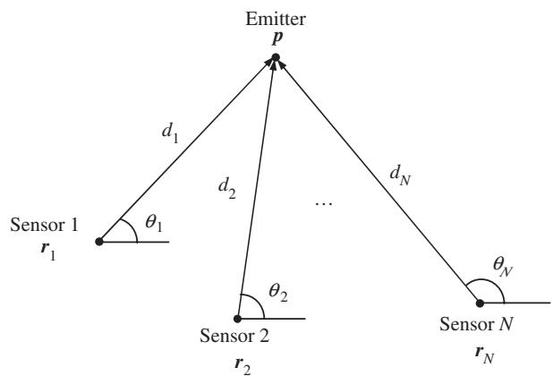  
Fig. 1. AOA localization geometry with N sensors.

where $J _ { o }$ is the Jacobian evaluated at the true emitter location

$$
\begin{array} { r } { J _ { o } = \left[ \begin{array} { c } { u _ { 1 } ^ { \mathrm { T } } / d _ { 1 } } \\ { u _ { 2 } ^ { \mathrm { T } } / d _ { 2 } } \\ { \vdots } \\ { u _ { N } ^ { \mathrm { T } } / d _ { N } } \end{array} \right] , \quad u _ { i } = \left[ \begin{array} { c } { - \sin \theta _ { i } } \\ { \cos \theta _ { i } } \end{array} \right] , \quad d _ { i } = | | { \boldsymbol { p } } - { \boldsymbol { r } } _ { i } | | } \end{array}\tag{3}
$$

and $\pmb { \Sigma }$ is the AOA noise covariance matrix

$$
\Sigma = \sigma ^ { 2 } \left[ \begin{array} { l l l } { 1 } & { } & { \mathbf { 0 } } \\ { } & { \ddots } \\ { \mathbf { 0 } } & { } & { 1 } \end{array} \right] _ { N \times N } .\tag{4}
$$

FIM can be rewritten as

$$
\pmb { \phi } = \frac { 1 } { \sigma ^ { 2 } } \sum _ { i = 1 } ^ { N } \frac { 1 } { d _ { i } ^ { 2 } } \pmb { u } _ { i } \pmb { u } _ { i } ^ { \operatorname { T } } .\tag{5}
$$

Here

$$
\pmb { u } _ { i } = \left[ \begin{array} { r r } { 0 } & { - 1 } \\ { 1 } & { 0 } \end{array} \right] \frac { \pmb { p } - \pmb { r } _ { i } } { d _ { i } }\tag{6}
$$

is a unit vector orthogonal to the bearing vector emanating from the ith sensor.

Observation 1. Moving a sensor from $r _ { i }$ to $2 p - r _ { i }$ (i.e., reflecting the sensor about the emitter) does not affect FIM.

This is easily seen from (5) where replacing $\pmb { u } _ { i }$ with $- { \pmb u } _ { i }$ for any $i , 1 \leqslant i \leqslant N$ , does not change FIM. In (6) substituting $2 p - r _ { i }$ for $r _ { i }$ results in $\pmb { u } _ { i }$ becoming $- { \pmb u } _ { i }$ which verifies the observation. This property will allow us to generate new optimal geometries from a given optimal localization geometry by simply reflecting some of the sensors about the emitter location.

As illustrated in Fig. 2, the area of the 1-s error ellipse (39:4% uncertainty region) of an efficient estimator is given by $\dot { A _ { 1 \sigma } } = \pi / | \mathbf { \dot { \pmb { \phi } } } | ^ { 1 / 2 }$ where $| \cdot |$ denotes determinant. In this paper we employ the criterion of maximizing the determinant of FIM, which is equivalent to minimizing the area of uncertainty ellipse, for finding the optimal sensor locations [9]. This criterion tacitly assumes that the localization algorithm in use is nearly efficient so that its error covariance can be approximated by CRLB, which is the inverse of FIM. The equivalence of the maximization of the determinant of FIM to the minimization of MSE (the trace of CRLB) is established in the next section.

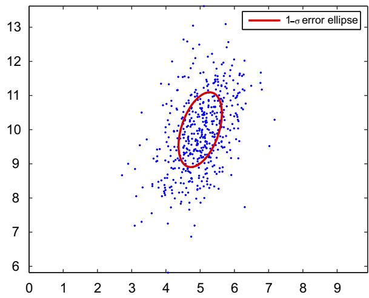  
Fig. 2. Illustration of 1-s error ellipse and a realization of estimates. The area of the ellipse is $\bar { A _ { 1 \sigma } } = \pi / | \pmb { \phi } | ^ { 1 / 2 }$

## 3. The main result

The following result specifies the optimal angular separation for AOA sensors in an arbitrary localization geometry.

Theorem 1. Suppose that the distances from each sensor to the emitter, $d _ { i } ,$ are fixed. Then the maximization of the determinant of FIM is equivalent to

$$
\operatorname* { m i n } _ { \theta _ { 1 } , \dots , \theta _ { N } } \left\| \sum _ { i = 1 } ^ { N } \frac { 1 } { d _ { i } ^ { 2 } } \pmb { v } _ { i } \right\| ^ { 2 } ,\tag{7}
$$

where $\| \cdot \|$ denotes the Euclidean norm and

$$
\begin{array} { r } { \boldsymbol { v } _ { i } = \left[ \begin{array} { l } { \cos 2 \theta _ { i } } \\ { \sin 2 \theta _ { i } } \end{array} \right] . } \end{array}\tag{8}
$$

Proof. Writing $\pmb { u } _ { i } = [ u _ { x } ( i ) , u _ { y } ( i ) ] ^ { \mathrm { T } }$ we have

$$
\pmb { u } _ { i } \pmb { u } _ { i } ^ { \operatorname { T } } = \left[ \begin{array} { c c } { u _ { x } ^ { 2 } ( i ) } & { u _ { x } ( i ) u _ { y } ( i ) } \\ { u _ { x } ( i ) u _ { y } ( i ) } & { u _ { y } ^ { 2 } ( i ) } \end{array} \right]\tag{9}
$$

and

$$
\begin{array}{c} \begin{array} { c c } { { \displaystyle \phi = \frac { 1 } { \sigma ^ { 2 } } \left[ \sum _ { i } \frac { 1 } { d _ { i } ^ { 2 } } u _ { x } ^ { 2 } ( i ) \right. } } & { { \left. \sum _ { i } \frac { 1 } { d _ { i } ^ { 2 } } u _ { x } ( i ) u _ { y } ( i ) \right] } } \\ { { \displaystyle \sum _ { i } \frac { 1 } { d _ { i } ^ { 2 } } u _ { x } ( i ) u _ { y } ( i ) } } & { { \sum _ { i } \frac { 1 } { d _ { i } ^ { 2 } } u _ { y } ^ { 2 } ( i ) } } \end{array} \left( 1 0 { \mathrm { a } } \right.   \\ { { \displaystyle } } & { { \displaystyle = \frac { 1 } { \sigma ^ { 2 } } \left[ \begin{array} { l l } { { \displaystyle \sum _ { i } \frac { 1 } { d _ { i } ^ { 2 } } \sin ^ { 2 } \theta _ { i } } } & { { \displaystyle - \sum _ { i } \frac { 1 } { d _ { i } ^ { 2 } } \sin \theta _ { i } \cos \theta _ { i } } } \\ { { \displaystyle - \sum _ { i } \frac { 1 } { d _ { i } ^ { 2 } } \sin \theta _ { i } \cos \theta _ { i } } } & { { \displaystyle \sum _ { i } \frac { 1 } { d _ { i } ^ { 2 } } \cos ^ { 2 } \theta _ { i } } } \end{array} \right] } } \end{array}\tag{ð10bÞ}
$$

$$
= \frac { 1 } { \sigma ^ { 2 } } \left[ \begin{array} { l l } { \frac { 1 } { 2 } \sum _ { i } \frac { 1 } { d _ { i } ^ { 2 } } ( 1 - \cos 2 \theta _ { i } ) } & { - \frac { 1 } { 2 } \sum _ { i } \frac { 1 } { d _ { i } ^ { 2 } } \sin 2 \theta _ { i } } \\ { - \frac { 1 } { 2 } \sum _ { i } \frac { 1 } { d _ { i } ^ { 2 } } \sin 2 \theta _ { i } } & { \frac { 1 } { 2 } \sum _ { i } \frac { 1 } { d _ { i } ^ { 2 } } ( 1 + \cos 2 \theta _ { i } ) } \end{array} \right]\tag{ð10cÞ}
$$

The determinant of FIM is

$$
\begin{array} { c } { { | \displaystyle | \Phi | = \frac { 1 } { 4 \sigma ^ { 4 } } \left( \left( \displaystyle \sum _ { i = 1 } ^ { N } \frac { 1 } { d _ { i } ^ { 2 } } \right) ^ { 2 } - \left( \displaystyle \sum _ { i = 1 } ^ { N } \frac { 1 } { d _ { i } ^ { 2 } } \sin 2 \theta _ { i } \right) ^ { 2 } \right. } } \\ { { \left. - \left( \displaystyle \sum _ { i = 1 } ^ { N } \frac { 1 } { d _ { i } ^ { 2 } } \cos 2 \theta _ { i } \right) ^ { 2 } \right) . } } \end{array}\tag{ð11Þ}
$$

Since $| \pmb { \phi } | \geqslant 0$ and the $d _ { i }$ are fixed, the maximization of $| \Phi |$ over $\theta _ { i }$ requires the minimization of

$$
\left( \sum _ { i = 1 } ^ { N } \frac { 1 } { d _ { i } ^ { 2 } } \sin 2 \theta _ { i } \right) ^ { 2 } + \left( \sum _ { i = 1 } ^ { N } \frac { 1 } { d _ { i } ^ { 2 } } \cos 2 \theta _ { i } \right) ^ { 2 }\tag{12}
$$

over $\theta _ { i } ,$ which is identical to (7). &

We will call sensor configurations minimizing (7) optimal solutions. Sensor configurations minimizing (7) to zero will sometimes be referred to as maximally optimal solutions in order to distinguish them from other geometries where the solution of (7) is non-zero due to geometric constraints.

We now establish the equivalence of uncertainty area minimization to MSE minimization.

Corollary 1. For constant $d _ { i } ,$ the maximization of the determinant of FIM is equivalent to the minimization of MSE.

Proof. The CRLB can be expressed as

$$
\mathrm { C R L B } = \pmb { \phi } ^ { - 1 } = \frac { 1 } { \vert \pmb { \phi } \vert } \left[ \begin{array} { c c } { \phi _ { 2 2 } } & { - \phi _ { 1 2 } } \\ { - \phi _ { 2 1 } } & { \phi _ { 1 1 } } \end{array} \right] ,\tag{13}
$$

where $\phi _ { 1 2 } = \phi _ { 2 1 }$ . The optimal MSE is given by the trace of the CRLB

$$
\mathrm { M S E } = \frac { \phi _ { 1 1 } + \phi _ { 2 2 } } { | \pmb { \phi } | } .\tag{14}
$$

Using (10), the MSE can be written as

$$
\mathrm { M S E } = \frac { 1 } { \sigma ^ { 2 } | \pmb { \phi } | } \sum _ { i = 1 } ^ { N } \frac { 1 } { d _ { i } ^ { 2 } } .\tag{15}
$$

Thus for fixed $d _ { i } ,$ the MSE is minimized if and only if the determinant of FIM is maximized. &

The special case of all sensors being equidistant from the emitter is considered next.

Corollary 2. For equal sensor ranges, i.e., $d _ { 1 } =$ $d _ { 2 } = \cdot \cdot \cdot = d _ { N } = d .$ , the determinant of FIM is upperbounded by

$$
\frac { N ^ { 2 } } { 4 \sigma ^ { 4 } d ^ { 4 } }\tag{16}
$$

which is attained if and only if

$$
\sum _ { i = 1 } ^ { N } \sin 2 \theta _ { i } = 0 \quad a n d \quad \sum _ { i = 1 } ^ { N } \cos 2 \theta _ { i } = 0 .\tag{17}
$$

Proof. When the sensors are equidistant from the emitter, (10c) becomes

$$
\phi = \frac { 1 } { \sigma ^ { 2 } d ^ { 2 } } \left[ \begin{array} { l l } { \frac { 1 } { 2 } \sum _ { i } ( 1 - \cos 2 \theta _ { i } ) } & { - \frac { 1 } { 2 } \sum _ { i } \sin 2 \theta _ { i } } \\ { - \frac { 1 } { 2 } \sum _ { i } \sin 2 \theta _ { i } } & { \frac { 1 } { 2 } \sum _ { i } ( 1 + \cos 2 \theta _ { i } ) } \end{array} \right]\tag{18}
$$

resulting in

$$
\begin{array} { r } { | \varPhi | = \displaystyle \frac { 1 } { 4 \sigma ^ { 4 } d ^ { 4 } } \left( N ^ { 2 } - \left( \sum _ { i = 1 } ^ { N } \sin 2 \theta _ { i } \right) ^ { 2 } \right. } \\ { \displaystyle \left. - \left( \sum _ { i = 1 } ^ { N } \cos 2 \theta _ { i } \right) ^ { 2 } \right) \leqslant \frac { N ^ { 2 } } { 4 \sigma ^ { 4 } d ^ { 4 } } . } \end{array}\tag{ð19Þ}
$$

The determinant of FIM is maximized if and only if (17) is satisfied. &

When all sensors have the same range $d ,$ the MSE is given by

$$
\mathrm { M S E } = \frac { N } { \sigma ^ { 2 } d ^ { 2 } | \Phi | } \geqslant \frac { 4 \sigma ^ { 2 } d ^ { 2 } } { N } .\tag{20}
$$

The minimum MSE is attained when the angular sensor separation satisfies (17).

Corollary 3. For $N \geqslant 3$ the optimality condition (17) subsumes equiangular sensor separation as a special case.

Proof. Rewrite (17) as

$$
\sum _ { i = 1 } ^ { N } v _ { i } = 0 .\tag{21}
$$

Now let all sensors be placed with uniform angular separation of $2 \pi / N$ , giving $\theta _ { i } = ( 2 \pi / N ) ( i - 1 ) + \theta _ { 0 }$ where $\theta _ { 0 }$ is an angular offset. Then the angle of $\pmb { v } _ { i }$ is $2 \theta _ { i } = 4 \pi / N ( i - 1 ) + 2 \theta _ { 0 } ;$ i.e., the $\pmb { v } _ { i }$ have a uniform angular separation of $4 \pi / N$ . For even $N \left( N \geqslant 4 \right)$ this implies

$$
\pmb { v } _ { i } = \pmb { v } _ { N / 2 + i } , \quad i = 1 , \ldots , N / 2\tag{22}
$$

and

$$
\sum _ { i = 1 } ^ { N } { \pmb v } _ { i } = 2 \sum _ { i = 1 } ^ { N / 2 } { \pmb v } _ { i } = 0\tag{23}
$$

since $\pmb { v } _ { 1 } , \ldots , \pmb { v } _ { N / 2 }$ are uniformly separated by $2 \pi / ( N / 2 )$ . Note that (23) does not hold if $N = 2$ meaning that equiangular separation is not optimal for $N = 2$

For odd $N \left( N \geqslant 3 \right)$ , the ‘‘interleaved’’ sequence

$$
\pmb { v } _ { 1 } , \pmb { v } _ { M + 1 } , \pmb { v } _ { 2 } , \pmb { v } _ { M + 2 } , \dots , \pmb { v } _ { M - 1 } , \pmb { v } _ { N } , \pmb { v } _ { M }\tag{24}
$$

contains unit vectors uniformly separated by $2 \pi / N$ rad, where $M = ( N + 1 ) / 2$ , thereby satisfying (21). &

It is interesting to note that (21) allows nonequiangular sensor separations to yield maximally optimal sensor placements in addition to equiangular separation. We will investigate this in more detail in the next section.

## 4. Geometric interpretation

Using complex exponentials the optimality condition for angular sensor separation given in Theorem 1 can be equivalently written as

$$
\operatorname* { m i n } _ { \theta _ { 1 } , . . . , \theta _ { N } } \left| \sum _ { i = 1 } ^ { N } \frac { 1 } { d _ { i } ^ { 2 } } \mathrm { e } ^ { \mathrm { i } \beta _ { i } } \right| ^ { 2 } , \quad \beta _ { i } \triangleq 2 \theta _ { i } ,\tag{25}
$$

where $j = \sqrt { - 1 } , \mathrm { e } ^ { \mathrm { i } \beta } = \cos \beta + j \sin \beta$ and $| \cdot |$ is the modulus (note that we use the same notation to denote determinant if the argument is a matrix). For $N = 2$ the optimal angular sensor separation is obtained from

$$
\operatorname* { m i n } _ { \theta _ { 1 } , \theta _ { 2 } } \bigg | \frac { 1 } { d _ { 1 } ^ { 2 } } \mathrm { e } ^ { \mathrm { i } \beta _ { 1 } } + \frac { 1 } { d _ { 2 } ^ { 2 } } \mathrm { e } ^ { \mathrm { j } \beta _ { 2 } } \bigg | ^ { 2 } .\tag{26}
$$

Irrespective of the $d _ { i }$ the solution of this minimization problem is

$$
\begin{array} { r } { \mathtt { e } ^ { \mathrm { j } \beta _ { 1 } } = \mathtt { e } ^ { \mathrm { j } ( \beta _ { 2 } \pm \pi ) } , } \end{array}\tag{27}
$$

whereby $\pmb { v } _ { 1 } = - \pmb { v } _ { 2 }$ , leading to $| \theta _ { 1 } - \theta _ { 2 } | = \pi / 2$ as the optimal angular separation (see Fig. 3). When the sensors are equidistant from the emitter, (27) satisfies (17).

In the case of three sensors $( N = 3 )$ , the condition for optimal angular sensor separation takes

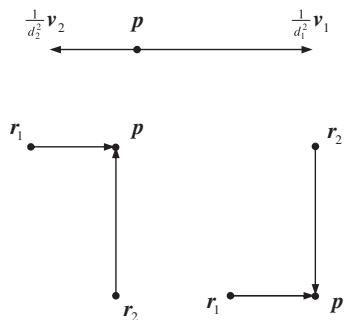  
Fig. 3. Illustration of optimal angular sensor separation for $N = 2$ . Irrespective of $d _ { 1 }$ and $d _ { 2 } ,$ bearing lines must be perpendicular in order to solve the minimization problem in (7).

the form:

$$
\operatorname* { m i n } _ { \theta _ { 1 } , \theta _ { 2 } , \theta _ { 3 } } \left| \frac { 1 } { d _ { 1 } ^ { 2 } } \mathrm { e } ^ { \mathrm { i } \beta _ { 1 } } + \frac { 1 } { d _ { 2 } ^ { 2 } } \mathrm { e } ^ { \mathrm { i } \beta _ { 2 } } + \frac { 1 } { d _ { 3 } ^ { 2 } } \mathrm { e } ^ { \mathrm { j } \beta _ { 3 } } \right| ^ { 2 } .\tag{28}
$$

If the sensor ranges were equal (i.e., $d _ { 1 } = d _ { 2 } = d _ { 3 } = d )$ , (28) could be replaced with

$$
\mathrm { e } ^ { \mathrm { j } \beta _ { 1 } } + \mathrm { e } ^ { \mathrm { j } \beta _ { 2 } } + \mathrm { e } ^ { \mathrm { j } \beta _ { 3 } } = 0 .\tag{29}
$$

For a given $\beta _ { 1 }$ , this equation has the solutions $\beta _ { 2 } =$ $\pm 2 \pi / 3 + \beta _ { 1 }$ and $\beta _ { 3 } = \mp 2 \pi / 3 + \beta _ { 1 }$ The angular sensor separations are accordingly given by $\{ \theta _ { 2 } =$ $\pm \pi / 3 + \theta _ { 1 } , \theta _ { 3 } = \mp \pi / 3 + \theta _ { 1 } \}$ and $\{ \theta _ { 2 } = \mp 2 \pi / 3 + \theta _ { 1 }$ $\theta _ { 3 } = \pm 2 \pi / 3 + \theta _ { 1 } \}$ . There are two distinct maximally optimal sensor configurations; one with $2 \pi / 3 \mathrm { - r a d }$ angular sensor separation and the other with $\pi / 3$ rad (see Fig. 4). The latter configuration can also be obtained from the former by using Observation 1. Note that the angular sensor separation by $\pi / 3$ is not an equiangular separation.

For arbitrary di (28) can be written as an equality

$$
{ \frac { 1 } { d _ { 1 } ^ { 2 } } } \mathrm { e } ^ { \mathrm { j } \beta _ { 1 } } + { \frac { 1 } { d _ { 2 } ^ { 2 } } } \mathrm { e } ^ { \mathrm { j } \beta _ { 2 } } + { \frac { 1 } { d _ { 3 } ^ { 2 } } } \mathrm { e } ^ { \mathrm { j } \beta _ { 3 } } = 0\tag{30}
$$

provided that none of the terms has a modulus larger than the modulus of the sum of the other two terms. The solution to (30) is given by1

$$
\beta _ { 2 } - \beta _ { 1 } = \pm \tan ^ { - 1 } ( \sqrt { \zeta } , b ^ { 2 } - a ^ { 2 } - 1 ) ,\tag{31a}
$$

$$
\beta _ { 3 } - \beta _ { 1 } = \mp \tan ^ { - 1 } ( \sqrt { \zeta } , \ a ^ { 2 } - b ^ { 2 } - 1 ) ,\tag{31b}
$$

where $a = ( d _ { 1 } / d _ { 2 } ) ^ { 2 } , b = ( d _ { 1 } / d _ { 3 } ) ^ { 2 } , \zeta = - ( a + b + 1 )$ $( a - b + 1 ) ( a + b - 1 ) ( a - b - 1 )$ and $\tan ^ { - 1 } ( y , x )$ is the four-quadrant inverse tangent of $y / x .$ . Eq. (31) in general leads to four distinct maximally optimal sensor placement configurations obtained by reflecting each of the sensors about the emitter location using Observation 1. Fig. 5 illustrates two of the optimal angular separation configurations.

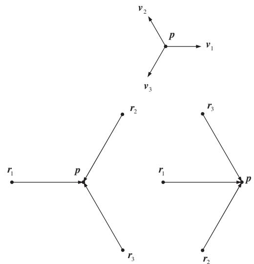  
Fig. 4. Illustration of maximally optimal angular sensor separation for $N = 3$ with equal sensor ranges. Two optimal configurations exist with sensor separation by $2 \pi / 3$ and $\pi / 3$

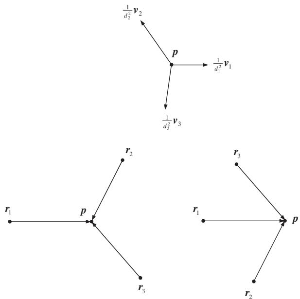  
Fig. 5. Maximally optimal angular sensor separation for $N = 3$ with different sensor ranges $( d _ { 1 } = 6 , d _ { 2 } = 5 , d _ { 3 } = 5 . 5 )$ where $\beta _ { 2 } -$ $\beta _ { 1 } = 1 2 5 . 1 ^ { \circ }$ and $\beta _ { 3 } - \beta _ { 1 } = - 9 8 . 3 ^ { \circ }$ . Only two of the four distinct optimal configurations are shown.

If there exits $m \in \{ 1 , 2 , 3 \}$ such that

$$
\frac { 1 } { d _ { m } ^ { 2 } } > \sum _ { 1 \leqslant i \leqslant 3 } \frac { 1 } { d _ { i } ^ { 2 } }\tag{32}
$$

that is, one of the terms in (30) has a modulus greater than the modulus of the sum of the other terms, then (30) has no solution. This is also equivalent to $\zeta < 0$ in (31), which yields a complex solution. In this case we seek to minimize (28) in order to maximize the determinant of FIM. The minimizing solution is given by placing ${ \mathfrak { v } } _ { m }$ in the opposite direction to the other vectors, i.e.,

$$
\mathrm { e } ^ { \mathrm { j } \beta _ { k } } = - \mathrm { e } ^ { \mathrm { j } \beta _ { m } } , \quad k \in \{ 1 , 2 , 3 \} \backslash m\tag{33}
$$

which results in the following optimal angular separation as illustrated in Fig. 6

$$
\theta _ { k } = \pm \frac { \pi } { 2 } + \theta _ { m } , \quad k \in \{ 1 , 2 , 3 \} \backslash m .\tag{34}
$$

Here n denotes set subtraction.

For $N = 4$ and equal sensor ranges, the maximally optimal angular separation is determined from

$$
\mathrm { e } ^ { \mathrm { j } \beta _ { 1 } } + \mathrm { e } ^ { \mathrm { j } \beta _ { 2 } } + \mathrm { e } ^ { \mathrm { j } \beta _ { 3 } } + \mathrm { e } ^ { \mathrm { j } \beta _ { 4 } } = 0 .\tag{35}
$$

The solutions to the above equation are simply given by placing a pair of complex exponentials in the opposite direction to the other pair, e.g.,

$$
\begin{array} { r } { \mathtt { e } ^ { \mathrm { j } \beta _ { 2 } } = \mathtt { e } ^ { \mathrm { j } ( \beta _ { 1 } \pm \pi ) } , } \end{array}\tag{36a}
$$

$$
\mathrm { e } ^ { \mathrm { j } \beta _ { 4 } } = \mathrm { e } ^ { \mathrm { j } ( \beta _ { 3 } \pm \pi ) }\tag{36b}
$$

giving $\theta _ { 2 } = \theta _ { 1 } \pm \pi / 2$ and $\theta _ { 4 } = \theta _ { 3 } \pm \pi / 2$ . We observe that there are infinitely many distinct maximally optimal configurations since $\theta _ { 1 }$ and $\theta _ { 3 }$ are arbitrary. The maximally optimal configurations are characterized by the property that angle pairs $\{ \theta _ { 1 } , \theta _ { 2 } \}$ and $\{ \theta _ { 3 } , \theta _ { 4 } \}$ define perpendicular bearing lines as depicted in Fig. 7. The equiangular separation is a special case of (36) with $\theta _ { 2 } - \theta _ { 1 } = \theta _ { 3 } - \theta _ { 2 } =$ $\theta _ { 4 } - \theta _ { 3 } = \pm \pi / 2$

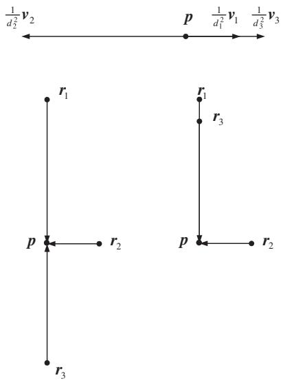  
Fig. 6. Optimal angular sensor separation for $N = 3$ when the minimum value of (28) is not zero or (32) holds.

If the sensors have different ranges to the emitter and (7) can be minimized to zero, the maximally optimal sensor configurations will obey

$$
{ \frac { 1 } { d _ { 1 } ^ { 2 } } } \mathrm { e } ^ { \mathrm { j } \beta _ { 1 } } + { \frac { 1 } { d _ { 2 } ^ { 2 } } } \mathrm { e } ^ { \mathrm { j } \beta _ { 2 } } + { \frac { 1 } { d _ { 3 } ^ { 2 } } } \mathrm { e } ^ { \mathrm { j } \beta _ { 3 } } + { \frac { 1 } { d _ { 4 } ^ { 2 } } } \mathrm { e } ^ { \mathrm { j } \beta _ { 4 } } = 0 .\tag{37}
$$

Assuming that $\beta _ { 1 } = 0$ with no loss of generality and $\beta _ { 2 }$ is given, the solution to the above equation ${ \mathrm { i s } } ^ { 1 }$

generalized to an arbitrary number of sensors. In general, if

$$
\frac { 2 } { d _ { m } ^ { 2 } } > \sum _ { i = 1 } ^ { N } \frac { 1 } { d _ { i } ^ { 2 } } , \quad m = \arg \operatorname* { m i n } _ { i } d _ { i }\tag{42}
$$

then the optimal angular separation is governed by

$$
\theta _ { k } = \pm \frac { \pi } { 2 } + \theta _ { m } , \quad k \in \{ 1 , . . . , N \} \backslash m .\tag{43}
$$

Such a geometry arises when one sensor is very close to the emitter in comparison with the others. If (42) is true, (7) cannot be minimized to zero, i.e., a

$$
\begin{array} { r l r } { \beta _ { 3 } = \tan ^ { - 1 } \bigg ( \frac { a ^ { 2 } ( \cos ^ { 2 } \beta _ { 2 } - 1 ) ( a ^ { 2 } + b ^ { 2 } - c ^ { 2 } + 2 a \cos \beta _ { 2 } + 1 ) \pm \sqrt { \gamma } ( a \cos \beta _ { 2 } + 1 ) } { a \sin \beta _ { 2 } } , - ( ( a \cos \beta _ { 2 } + 1 ) ( a ^ { 2 } + b ^ { 2 } - c ^ { 2 } + 2 a \cos \beta _ { 2 } + 1 ) \pm \sqrt { \gamma } ( a \cos \beta _ { 2 } + 1 ) } & \\ {  } & {  } & {  } \\  + 2 a \cos \beta _ { 2 } + 1 ) \pm \sqrt { \gamma } ) \bigg ) , \quad \quad \quad \quad \quad ( \mathrm  ~ c ~ o ~ s ~ e ~ - ~ c ~ e ~ - ~ c ~ e ~ - ~ c ~ e ~ - ~ c ~ e ~ - ~ c ~ e ~ - ~ c ~ e ~ - ~ c ~ e ~ - ~ c ~ e ~ - ~ c ~ e ~ - ~ c ~ e ~ - ~ c ~ e ~ - ~ c ~ e ~ - ~ c ~ e ~ - ~ c ~ e ~ - ~ c ~ e ~ - ~ c ~ e ~ - ~ c ~ e ~ - ~ c ~ e ~ - ~ c ~ e ~ - ~ c ~ e ~ - ~ c ~ e ~ - ~ c ~ e ~ - ~ c ~ e ~ - ~ c ~ e ~ - ~ c ~ e ~ - ~ c ~ e ~ - ~ c ~ e ~ - ~ c ~ e ~ - ~ c ~ e ~ - ~ c ~ e ~ - ~ c ~ e ~ - ~ c ~ e ~ - ~ c ~ e ~ - ~ c ~ e ~ - ~ c ~ e ~ - ~ c ~ e ~ - ~ c ~ e ~ - ~ c ~ e ~ - ~ c ~ e ~ - ~ c ~ e ~ - ~ c ~ e ~ - ~ c ~ e ~ - ~ c ~ e ~ - ~ c ~ e ~ - ~ c ~ e ~ - ~ c ~ e ~ - ~ c ~ e ~ - ~ c ~ e ~ - ~ c ~ e ~ - ~ c ~ e ~ - ~ c ~ e ~ - ~ c ~ e ~ - ~ c ~ e ~ - ~ c ~ e ~ - ~ c ~ e ~ - ~ c ~ e ~ - ~ c ~ e ~ - ~ c ~ e ~ - ~ c ~ e ~ - ~ c ~ e ~ - ~ c ~ e ~ - ~ c ~ e ~ - ~ c ~ e ~ - ~ c ~ e ~ - ~ c ~ e ~ - ~ c ~ e ~ - ~ c ~ e ~ - ~ c ~ e ~ - ~ c ~ e ~ - ~ c ~ e ~ - ~ c  \end{array}\tag{38aÞ}
$$

38bÞ

where $a = d _ { 1 } ^ { 2 } / d _ { 2 } ^ { 2 } , b = d _ { 1 } ^ { 2 } / d _ { 3 } ^ { 2 } , c = d _ { 1 } ^ { 2 } / d _ { 4 } ^ { 2 }$ and

$$
\begin{array} { c } { { \gamma = a ^ { 2 } ( \cos ^ { 2 } \beta _ { 2 } - 1 ) ( ( a ^ { 2 } - b ^ { 2 } - c ^ { 2 } + 2 a \cos \beta _ { 2 } + 1 ) ^ { 2 } } } \\ { { { } } } \\ { { - 4 b ^ { 2 } c ^ { 2 } ) . } } \end{array}\tag{39Þ}
$$

If $\beta _ { 2 }$ is such that $\gamma$ is negative, then a maximally optimal angular sensor separation satisfying (37) cannot be found. This places a limitation on the values of $\beta _ { 2 }$ that can be used to obtain a maximally optimal configuration. Fig. 8 illustrates maximally optimal angular separations for $N = 4$ that satisfy (37).

If one of the terms in (37) has a modulus greater than the modulus of the sum of the other terms, i.e., there exists $m \in \{ 1 , 2 , 3 , 4 \}$ such that

$$
\frac { 1 } { d _ { m } ^ { 2 } } > \sum _ { 1 \leqslant i \leqslant 4 } \frac { 1 } { d _ { i } ^ { 2 } }\tag{40}
$$

then the optimal configuration is given by

$$
\theta _ { k } = \pm \frac { \pi } { 2 } + \theta _ { m } , \quad k \in \{ 1 , 2 , 3 , 4 \} \backslash m .\tag{41}
$$

In this case the angular separation between the ‘‘dominant’’ sensor at $r _ { m }$ and the other sensors is $\pm \pi / 2$ rad. This optimal configuration can be

maximally optimal configuration cannot be obtained. In this case the determinant of FIM has the maximum value

$$
\operatorname* { m a x } _ { \theta _ { 1 } , \ldots , \theta _ { N } } | \boldsymbol { \varPhi } | = \frac { 1 } { 4 \sigma ^ { 4 } } \left( \left( \sum _ { i = 1 } ^ { N } \frac { 1 } { d _ { i } ^ { 2 } } \right) ^ { 2 } - \left( \frac { 2 } { d _ { m } ^ { 2 } } - \sum _ { i = 1 } ^ { N } \frac { 1 } { d _ { i } ^ { 2 } } \right) ^ { 2 } \right) ,\tag{ð44aÞ}
$$

$$
= \frac { 1 } { \sigma ^ { 4 } d _ { m } ^ { 2 } } \sum _ { \stackrel { { \scriptstyle i \leqslant i \leqslant N } } { i \neq m } } \frac { 1 } { d _ { i } ^ { 2 } }\tag{ð44bÞ}
$$

which corresponds to the minimum MSE

$$
\mathrm { M S E } = \sigma ^ { 2 } d _ { m } ^ { 2 } \frac { \sum _ { i = 1 } ^ { N } \frac { 1 } { d _ { i } ^ { 2 } } } { \sum _ { 1 \le i \le N } \frac { 1 } { d _ { i } ^ { 2 } } } .\tag{45}
$$

For $N \geqslant 4$ there are infinitely many maximally optimal sensor configurations unless (42) holds. Maximally optimal configurations can be identified by following the approach that was adopted in this section. Alternatively the sensors can be grouped into smaller clusters with two or three sensors. Then a maximally optimal angular separation can be found by optimizing angular sensor separation in each cluster. Rotation of the optimized clusters does not affect the optimality and can be used to obtain distinct maximally optimal sensor configurations. This is particularly appealing when all sensors have the same range. As an example, for $N = 5 ,$ , we can consider grouping the sensors into two clusters with three and two sensors $\mathcal { C } = \{ 3 , 2 \}$ or a single cluster with all five sensors $\mathcal { C } = \{ 5 \}$ , where $\mathcal { C }$ is the set of cluster sizes (the number of sensors in each cluster). For $N = 6$ the sensors can be grouped into clusters $\mathcal { C } = \{ 2 , 2 , 2 \}$ or $\mathcal { C } = \{ 3 , 3 \}$ . For a larger number of sensors similar clustering can be applied to simplify the task of finding a maximally optimal sensor configuration.

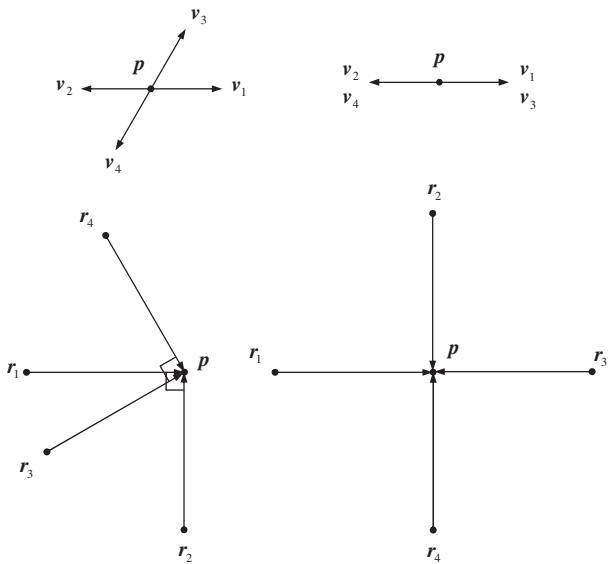  
Fig. 7. Examples of maximally optimal angular sensor separations for $N = 4$ with equal sensor ranges. Note that the sensor pairs $\{ r _ { 1 } , r _ { 2 } \}$ and $\{ r _ { 3 } , r _ { 4 } \}$ have perpendicular bearing lines with the equiangular sensor separation being a special case.

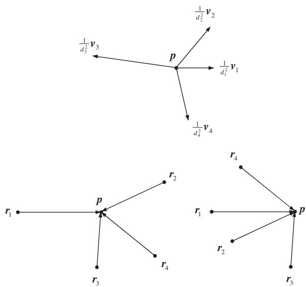  
Fig. 8. Maximally optimal angular sensor separation for $N = 4$ with different sensor ranges $( d _ { 1 } = 6 , \ d _ { 2 } = 5 , \ d _ { 3 } = 4 , \ d _ { 4 } = 5 )$ where $\beta _ { 1 } = 0 ^ { \circ }$ , $\beta _ { 2 } = 5 0 ^ { \circ }$ , $\beta _ { 3 } = 1 7 2 . 2 ^ { \circ }$ and $\beta _ { 4 } = - 7 7 . 8 ^ { \circ }$ . Only two of the optimal configurations are shown.

## 5. Simulation examples

The simulated localization scenarios use the geometry depicted in Fig. 9 where sensor 1 has the AOA angle $\theta _ { 1 } = 0$ and the emitter is at the origin with no loss of generality. The objective is to determine $\theta _ { 2 } , . . . , \theta _ { N }$ for the given $d _ { i }$ so as to minimize the MSE performance for emitter localization. In the simulations the cases of $N = 3 .$ , 4 and 5 are considered. The PLE and MLE are used to check the MSE performance in optimal configurations. The MLE is implemented using the Nelder– Mead simplex method [12] and is initialized to the true emitter location to ensure convergence.

Fig. 10 shows the determinant of FIM and the corresponding contour plot as a function of $\theta _ { 2 }$ and $\theta _ { 3 }$ for $N = 3$ and equal sensor ranges (i.e., $d _ { 1 } =$ $d _ { 2 } = d _ { 3 } = 1 0 0 \mathrm { m } )$ ). The bearing noise standard deviation is $\sigma = 5 ^ { \circ }$ . The maximum value of $| \Phi |$ is $3 . 8 7 9 7 \times 1 0 ^ { - 4 }$ which is attained if $\{ \theta _ { 2 } , \theta _ { 3 } \} \in$ $\{ \{ - 1 2 0 ^ { \circ } , - 6 0 ^ { \circ } \} , \{ - 1 2 0 ^ { \circ } , 1 2 0 ^ { \circ } \} , \{ - 6 0 ^ { \circ } , - 1 2 0 ^ { \circ } \} , \{ - 6 0 ^ { \circ }$ $6 0 ^ { \circ } \} , \ \{ 6 0 ^ { \circ } , - 6 0 ^ { \circ } \} , \ \{ 6 0 ^ { \circ } , 1 2 0 ^ { \circ } \} , \ \{ 1 2 0 ^ { \circ } , \ - 1 2 0 ^ { \circ } \} , \ \{ 1 2 0 ^ { \circ }$ $6 0 ^ { \circ } \} \}$ . As illustrated in Fig. 4 there are only two distinct maximally optimal geometries, one with $6 0 ^ { \circ }$ separation between the sensors, and the other with 120	 separation representing an equiangular sensor separation. For these geometries the bias and MSE of the PLE and MLE were estimated using 10,000 Monte Carlo simulations. The estimation results are listed in Table 1. Considering that the optimal MSE for the simulated geometry is $4 \sigma ^ { 2 } d ^ { 2 } / \bar { N } = 1 0 1 . 5 3 9 1$ [see (20)], we conclude that the optimized geometries do lead to significantly improved localization performance.

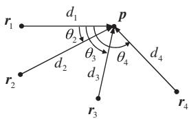

Fig. 9. Simulated localization geometry with $\theta _ { 1 } = 0$ and $\boldsymbol { p } = [ 0 , 0 ] ^ { \mathrm { T } }$

a  
a  
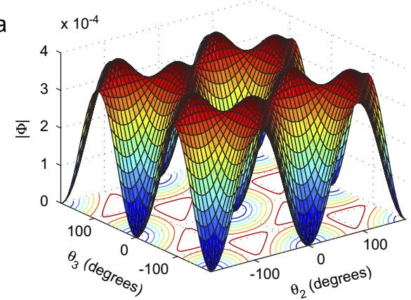  
b

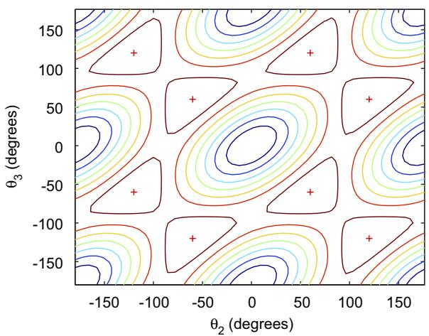  
Fig. 10. (a) The determinant of FIM as a function of $\theta _ { 2 }$ and $\theta _ { 3 }$ for $N = 3$ and equal sensor ranges, and (b) the contour plot of the determinant of FIM with maxima indicated with ‘þ’.

Bias and MSE performance $( N = 3 )$
<table><tr><td></td><td colspan="2">PLE</td><td colspan="2">MLE</td></tr><tr><td></td><td>Bias norm</td><td>MSE</td><td>Bias norm</td><td>MSE</td></tr><tr><td> $6 0 ^ { \circ }$  separation</td><td>0.2593</td><td>102.4700</td><td>0.1136</td><td>102.7051</td></tr><tr><td> $1 2 0 ^ { \circ }$  separation</td><td>0.1570</td><td>104.8630</td><td>0.1003</td><td>102.4685</td></tr></table>

We next consider a localization scenario where the sensors have different ranges to the emitter. For $N = 3$ , $d _ { 1 } = 1 0 0 \mathrm { m } , d _ { 2 } = 9 0 \mathrm { m }$ and $d _ { 3 } = 8 0 \mathrm { m }$ Fig. 11 shows the determinant of FIM versus $\theta _ { 2 }$ and $\theta _ { 3 }$ . The determinant of FIM has the maximum value of $6 . 2 1 5 1 \times 1 0 ^ { - 4 }$ for bearing noise standard deviation $\sigma = 5 ^ { \circ }$ . The maximally optimal bearing angles $\{ \theta _ { 2 } , \theta _ { 3 } \}$ maximizing jUj belong to the set $\{ \{ \beta _ { 2 } / 2 ,$ $\beta _ { 3 } / 2 \} , ~ \{ ( \beta _ { 2 } - 3 6 0 ^ { \circ } ) / 2 , \beta _ { 3 } / 2 \} , ~ \{ \beta _ { 2 } / 2 , ( \beta _ { 3 } + 3 6 0 ^ { \circ } ) / 2 \}$ $\{ ( \beta _ { 2 } { - } 3 6 0 ^ { \circ } ) / 2 , ( \beta _ { 3 } { + } 3 6 0 ^ { \circ } ) / 2 \} , \{ - \beta _ { 2 } / 2 , { - } \beta _ { 3 } / 2 \} , \{ - ( \beta _ { 2 } { - }$ $3 6 0 ^ { \circ } ) / 2 , - \beta _ { 3 } / 2 \} , \ \{ - \beta _ { 2 } / 2 , - ( \beta _ { 3 } + 3 6 0 ^ { \circ } ) / 2 \} , \ \{ - ( \beta _ { 2 } -$ $3 6 0 ^ { \circ } ) / 2 , - ( \beta _ { 3 } + 3 6 0 ^ { \circ } ) / 2 \} \}$ where $\beta _ { 2 } = 9 1 . 9 2 0 6 ^ { \circ }$ and $\beta _ { 3 } = - 1 2 7 . 8 4 4 4 ^ { \circ }$ . There are four distinct maximally optimal angular sensor separations that are given by the first four members of the above set (see Fig. 12). The remaining four configurations are simply mirror images of the first four configurations. The bias and MSE of the PLE and MLE for the distinct maximally optimal configurations were estimated using 10,000 Monte Carlo simulations and are listed in Table 2. In this case the optimal MSE is 80:2244. We observe that the PLE and MLE do not have identical performance for all optimal configurations. For example, configuration 4, which resembles equiangular separation, produces a relatively small bias.

b  
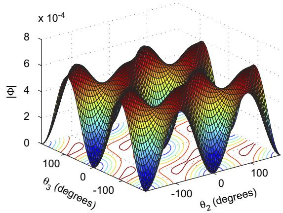

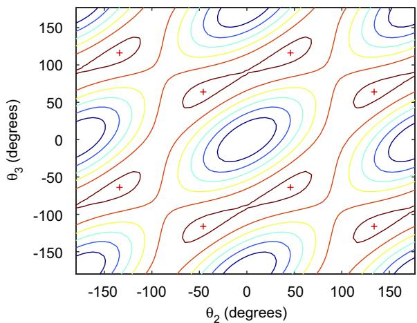  
Fig. 11. (a) The determinant of FIM as a function of y and $\theta _ { 3 }$ for $N = 3$ and sensor ranges $d _ { 1 } = 1 0 0 \mathrm { m }$ $d _ { 2 } = 9 0$ m and $d _ { 3 } = 8 0 \mathrm { m }$ , and (b) the contour plot of the determinant of FIM with maxima indicated with ‘þ’.

Bringing one of the three sensors close to the emitter while keeping the other sensors away from it creates a situation where the inequality in (32) becomes valid. The optimal separation in this case is given by (34), i.e., the sensor with the smallest range is separated from the others perpendicularly. Fig. 13 illustrates this for sensor ranges $d _ { 1 } = 3 0 \mathrm { m }$ 1, $d _ { 2 } =$ 90 m and $d _ { 3 } = 1 0 0 \mathrm { m }$ , and bearing noise $\sigma = 5 ^ { \circ }$ . The determinant of FIM is maximized when $\theta _ { 2 } , \theta _ { 3 } \in$ $\{ - 9 0 ^ { \circ } , 9 0 ^ { \circ } \}$ which represents two distinct configurations as in Fig. 6. The maximum value of jUj is 0.0043. Table 3 shows the bias and MSE of the PLE and MLE for the distinct optimal configurations using 10,000 Monte Carlo simulations. The minimum MSE obtained from (45) is 40.9340. Both estimators favour the optimal geometry with sensors 2 and 3 on the opposite sides of the emitter.

Fig. 14 shows the determinant of FIM versus $\theta _ { 3 }$ and $\theta _ { 4 }$ with $\theta _ { 1 } = 0 ^ { \circ }$ and $\theta _ { 2 } = 3 0 ^ { \circ }$ for $N = 4$ sensors and sensor ranges $d _ { 1 } = 1 0 0 \mathrm { n }$ m, $d _ { 2 } = 9 0$ m, $d _ { 3 } = 7 0$ m and $d _ { 4 } = 8 0 \mathrm { m }$ . It is possible to vary $\theta _ { 2 }$ to obtain other maximally optimal angular separations as long as $\gamma$ in (39) remains positive. The bearing noise standard deviation is $\sigma = 5 ^ { \circ }$ . The bearing angle pairs $\{ \theta _ { 3 } , \theta _ { 4 } \}$ maximizing the determinant of FIM are given by the set $\{ \{ \beta _ { 3 1 } / 2 , \beta _ { 4 1 } / 2 \}$ ,

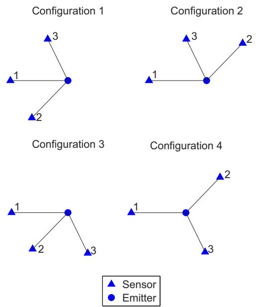  
Fig. 12. Distinct maximally optimal configurations for $N = 3$ and different sensor ranges.

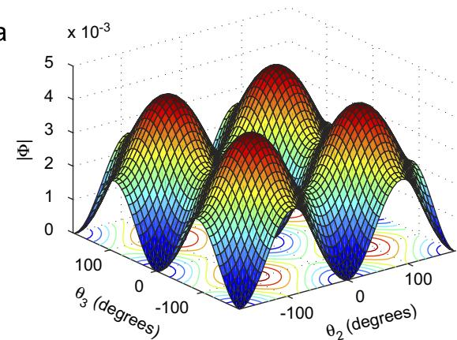

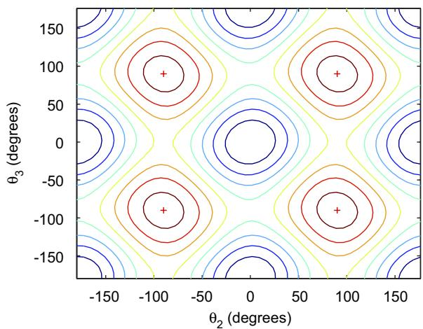  
Fig. 13. (a) The determinant of FIM as a function of $\theta _ { 2 }$ and $\theta _ { 3 }$ for N ¼ 3 and sensor ranges $d _ { 1 } = 3 0 \mathrm { m }$ $d _ { 2 } = 9 0 \mathrm { m }$ and $d _ { 3 } = 1 0 0 \mathrm { m } .$ , and (b) the contour plot of the determinant of FIM with maxima indicated with $\cdot _ { + } ,$

Bias and MSE performance (N ¼ 3, different sensor ranges)
<table><tr><td> $\{ \theta _ { 2 } , \theta _ { 3 } \}$ </td><td colspan="2">PLE</td><td colspan="2">MLE</td></tr><tr><td></td><td>Bias norm</td><td>MSE</td><td>Bias norm</td><td>MSE</td></tr><tr><td> $\{ \beta _ { 2 } / 2 , \beta _ { 3 } / 2 \}$ </td><td>0.3003</td><td>82.3443</td><td>0.1114</td><td>81.7197</td></tr><tr><td> $\{ ( \beta _ { 2 } - 3 6 0 ^ { \circ } ) / 2 , \beta _ { 3 } / 2 \}$ </td><td>0.3811</td><td>81.4945</td><td>0.0333</td><td>80.8305</td></tr><tr><td> $\{ \beta _ { 2 } / 2 , ( \beta _ { 3 } + 3 6 0 ^ { \circ } ) / 2 \}$ </td><td>0.3860</td><td>80.1846</td><td>0.0586</td><td>81.8269</td></tr><tr><td> $\{ ( \beta _ { 2 } - 3 6 0 ^ { \circ } ) / 2 , ( \beta _ { 3 } + 3 6 0 ^ { \circ } ) / 2 \}$ </td><td>0.0472</td><td>83.8571</td><td>0.0378</td><td>83.2766</td></tr></table>

Table 3  
Bias and MSE performance (N ¼ 3, different sensor ranges)
<table><tr><td> $\{ \theta _ { 2 } , \theta _ { 3 } \}$ </td><td colspan="2">PLE</td><td colspan="2">MLE</td></tr><tr><td></td><td>Bias norm</td><td>MSE</td><td>Bias norm</td><td>MSE</td></tr><tr><td> $\{ 9 0 ^ { \circ } , 9 0 ^ { \circ } \}$ </td><td>0.7231</td><td>42.7069</td><td>0.0740</td><td>42.1065</td></tr><tr><td> $\{ 9 0 ^ { \circ } , - 9 0 ^ { \circ } \}$ </td><td>0.1056</td><td>41.6384</td><td>0.0683</td><td>41.5284</td></tr></table>

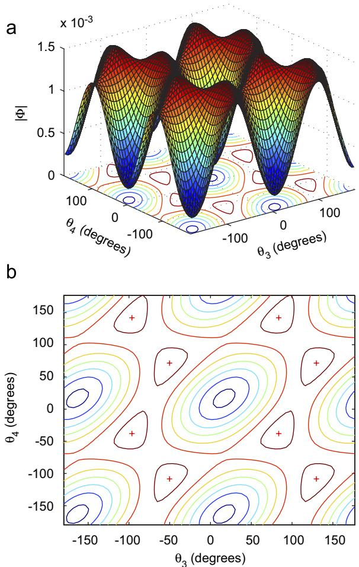  
Fig. 14. (a) The determinant of FIM as a function of $\theta _ { 3 }$ and $\theta _ { 4 }$ for $N = 4 , \ \theta _ { 2 } = 3 0 ^ { \circ }$ and sensor ranges $d _ { 1 } = 1 0 0 \mathrm { m }$ $d _ { 2 } = 9 0 \mathrm { m }$ $d _ { 3 } = 7 0 \mathrm { m }$ and $d _ { 4 } = 8 0 \mathrm { m }$ , and (b) the contour plot of the determinant of FIM with maxima indicated with $\cdot _ { + } ,$

$\{ ( \beta _ { 3 1 } - 3 6 0 ^ { \circ } ) / 2 , \beta _ { 4 1 } / 2 \} , \{ \beta _ { 3 1 } / 2 , ( \beta _ { 4 1 } + 3 6 0 ^ { \circ } ) / 2 \} , \ \{ ( \beta _ { 3 1 } -$ $3 6 0 ^ { \circ } ) / 2 , ( \beta _ { 4 1 } + 3 6 0 ^ { \circ } ) / 2 \} , \quad \{ \beta _ { 3 2 } / 2 , \beta _ { 4 2 } / 2 \}$ $\{ ( \beta _ { 3 2 } +$ $3 6 0 ^ { \circ } ) / 2 , \beta _ { 4 2 } / 2 \} , \quad \{ \beta _ { 3 2 } / 2 , ( \beta _ { 4 2 } - 3 6 0 ^ { \circ } ) / 2 \}$ $\{ ( \beta _ { 3 2 } +$ $3 6 0 ^ { \circ } ) / 2 , ( \beta _ { 4 2 } - 3 6 0 ^ { \circ } ) / 2 \} \}$ where $\beta _ { 3 1 } = 1 6 7 . 3 2 0 0 ^ { \circ }$ $\beta _ { 3 2 } = \ - 1 0 0 . 3 8 3 5 ^ { \circ }$ , $\beta _ { 4 1 } = - 7 6 . 1 6 0 3 ^ { \circ }$ and $\beta _ { 4 2 } =$ $1 4 3 . 0 9 6 8 ^ { \circ }$ as obtained from (38). The distinct maximally optimal configurations are illustrated in Fig. 15. The maximum of jUj is 0.0015, yielding a minimum MSE of 52.1794. The bias and MSE estimates of the PLE and MLE for the maximally optimal configurations are shown in Table 4.

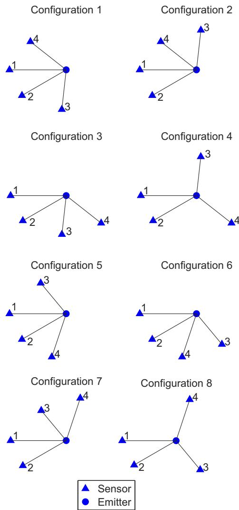  
Fig. 15. Distinct maximally optimal configurations for $N = 4$ and different sensor ranges with $\theta _ { 1 } = 0$ and $\theta _ { 2 } = 3 0 ^ { \circ }$

The final simulation considers a localization scenario with $N = 5$ sensors. All sensors are equidistant from the emitter with $d = 1 0 0 \mathrm { m }$ . The sensors are clustered into two groups with three and two sensors. The group with three sensors comprises sensors 1, 2 and 3 with bearing angles $\theta _ { 1 } = 0 , \theta _ { 2 } =$ $6 0 ^ { \circ }$ and $\theta _ { 3 } = - 6 0 ^ { \circ }$ , which represents a maximally optimal configuration for three sensors. The determinant of FIM as a function of $\theta _ { 4 }$ and $\theta _ { 5 }$ is shown in Fig. 16. The maximum value achieved is 0.0011 which is identical to the upper-bound given in Corollary 2. The bearing angles maximizing the determinant of FIM are not unique and form a set of lines defined by $| \theta _ { 5 } - \theta _ { 4 } | = 9 0 ^ { \circ }$ representing a $9 0 ^ { \circ }$ separation between $\theta _ { 4 }$ and $\theta _ { 5 }$ regardless of the actual value of the either angle. This means that the determinant of FIM is maximized by any perpendicular angle pair $\{ \theta _ { 4 } , \theta _ { 5 } \}$ , which is maximally optimal for the cluster of sensors 4 and 5, independent of rotation. Thus there are infinitely many distinct maximally optimal configurations obtained by rotating optimal sensor clusters as discussed in Section 4. Four such configurations are shown in Fig. 17. Table 5 lists the bias and MSE estimates for these maximally optimal configurations. The minimum MSE given by (20) is 60.9235. The bias of the PLE is significantly larger than that of the MLE for all configurations while the MSE performance somewhat varies from one configuration to another with configuration 2 producing the best MSE performance.

Table 4  
Bias and MSE performance (N ¼ 4)
<table><tr><td rowspan="2"> $\{ \theta _ { 3 } , \theta _ { 4 } \}$ </td><td colspan="2">PLE</td><td colspan="2">MLE</td></tr><tr><td>Bias norm</td><td>MSE</td><td>Bias norm</td><td>MSE</td></tr><tr><td> $\{ \beta _ { 3 1 } / 2 , \beta _ { 4 1 } / 2 \}$ </td><td>0.6181</td><td>53.0705</td><td>0.0645</td><td>52.5850</td></tr><tr><td> $\{ ( \beta _ { 3 1 } - 3 6 0 ^ { \circ } ) / 2 , \beta _ { 4 1 } / 2 \}$ </td><td>0.6414</td><td>52.6376</td><td>0.0460</td><td>52.6524</td></tr><tr><td> $\{ \beta _ { 3 1 } / 2 , ( \beta _ { 4 1 } + 3 6 0 ^ { \circ } ) / 2 \}$ </td><td>0.4923</td><td>54.1014</td><td>0.0888</td><td>52.5953</td></tr><tr><td> $\{ ( \beta _ { 3 1 } - 3 6 0 ^ { \circ } ) / 2 , ( \beta _ { 4 1 } + 3 6 0 ^ { \circ } ) / 2 \}$ </td><td>0.3069</td><td>53.9769</td><td>0.0673</td><td>52.9520</td></tr><tr><td> $\{ \beta _ { 3 2 } / 2 , \beta _ { 4 2 } / 2 \}$ </td><td>0.5560</td><td>53.3838</td><td>0.0483</td><td>52.5868</td></tr><tr><td> $\{ ( \beta _ { 3 2 } + 3 6 0 ^ { \circ } ) / 2 , \beta _ { 4 2 } / 2 \}$ </td><td>0.5040</td><td>53.7554</td><td>0.0674</td><td>52.5008</td></tr><tr><td> $\{ \beta _ { 3 2 } / 2 , ( \beta _ { 4 2 } - 3 6 0 ^ { \circ } ) / 2 \}$ </td><td>0.4883</td><td>53.3606</td><td>0.0135</td><td>52.5549</td></tr><tr><td> $\{ ( \beta _ { 3 2 } + 3 6 0 ^ { \circ } ) / 2 , ( \beta _ { 4 2 } - 3 6 0 ^ { \circ } ) / 2 \}$ </td><td>0.4690</td><td>54.9129</td><td>0.0640</td><td>53.0437</td></tr></table>

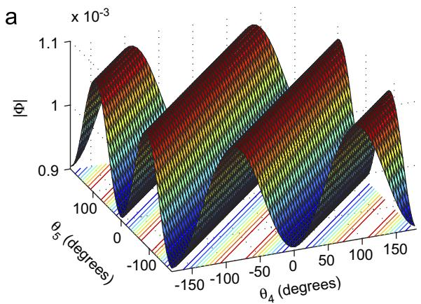

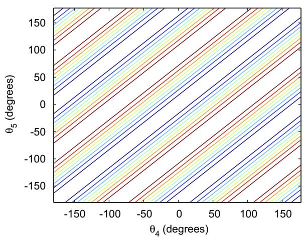  
Fig. 16. (a) The determinant of FIM as a function of $\theta _ { 4 }$ and $\theta _ { 5 }$ for N ¼ 5, $\theta _ { 2 } = 6 0 ^ { \circ }$ , $\theta _ { 3 } = - 6 0 ^ { \circ }$ and equal sensor ranges $d = 1 0 0 \mathrm { m }$ , and (b) the contour plot of the determinant of FIM.

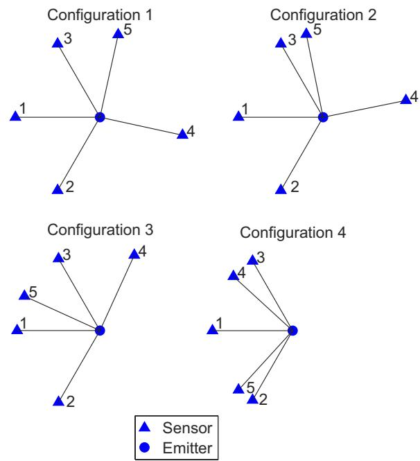  
Fig. 17. Maximally optimal configurations for $N = 5$ obtained by rotating the cluster of sensors 4 and 5.

Table 5  
Bias and MSE Performance (N ¼ 5)
<table><tr><td>Configuration</td><td colspan="2">PLE</td><td colspan="2">MLE</td></tr><tr><td></td><td>Bias norm</td><td>MSE</td><td>Bias norm</td><td>MSE</td></tr><tr><td>1</td><td>0.2076</td><td>60.4219</td><td>0.0503</td><td>60.7546</td></tr><tr><td>2</td><td>0.2469</td><td>60.1014</td><td>0.0950</td><td>59.9449</td></tr><tr><td>3</td><td>0.4674</td><td>60.1201</td><td>0.0936</td><td>60.8365</td></tr><tr><td>4</td><td>0.5366</td><td>61.0679</td><td>0.0459</td><td>62.5985</td></tr></table>

## 6. Conclusions and discussion

In this paper we have developed a complete characterization of optimal angular separation for AOA sensors in passive localization problems. Theorem 1 states the key optimization problem that must be solved to obtain optimal sensor configurations. A detailed interpretation of the optimality condition was provided. Optimal sensor configurations were illustrated with comprehensive computer simulations.

The theoretical development for determining optimal sensor placement assumes perfect knowledge of the emitter location. In practical applications the exact location of the emitter is not available. However a rough estimate of the likely region of the emitter would be sufficient to determine where the sensors should be positioned to obtain significantly improved localization results. In this context the results of the paper can be utilized to establish guidelines for sensor placement leading to improved performance.

In the simulations presented in Section 5 we noticed that both the PLE and MLE get very close to the optimal MSE even though neither of them is an efficient estimator. For sufficiently large N the MLE becomes approximately efficient and unbiased. The PLE on the other hand suffers from severe bias problems. It was shown in [13] that the asymptotic bias of the PLE is dependent on $\pmb { p } - \pmb { \bar { r } }$ where r¯ is the mean sensor location. This suggests that a geometry with small $\| p - { \bar { r } } \|$ will have a small PLE bias. An evidence of this is seen in configuration 4 in Fig. 12 for which the PLE has a relatively small bias (Table 2). For this optimal configuration the mean sensor location is $\bar { r } = \left[ - 0 . 7 5 6 2 , - 2 . 3 8 6 2 \right] ^ { \mathrm { T } }$ which is very close to the emitter location. Out of all optimal configurations shown in Fig. 12, configuration 4 has the smallest $\| p - { \bar { r } } \|$ . Generalizing this to arbitrary geometries, one can conclude that the PLE would favour optimal configurations with the smallest $\| p - { \bar { r } } \|$ as far as its bias performance is concerned. For equal sensor ranges, equiangular sensor separation has $\| \pmb { p } - \bar { r } \| = 0$ and is therefore the best optimal configuration for the PLE. The future work will focus on extending the results presented in this paper to optimal trajectory control for moving AOA sensor platforms.

## References

[1] R.G. Stansfield, Statistical theory of DF fixing, Journal of IEE 94 (15) (December 1947) 762–770.

[2] M. Gavish, A.J. Weiss, Performance analysis of bearingonly target location algorithms, IEEE Trans. Aerosp. Electron. Syst. 28 (3) (1992) 817–828.

[3] S.C. Nardone, A.G. Lindgren, K.F. Gong, Fundamental properties and performance of conventional bearings-only target motion analysis, IEEE Trans. Automatic Control 29 (9) (September 1984) 775–787.

[4] W.H. Foy, Position-location solutions by Taylor-series estimation, IEEE Trans. Aerosp. Electron. Syst. 12 (2) (March 1976) 187–194.

[5] K. Spingarn, Passive position location estimation using the extended Kalman filter, IEEE Trans. Aerosp. Electron. Syst. 23 (4) (July 1987) 558–567.

[6] H.D. Hoelzer, G.W. Johnson, A.O. Cohen, Modified polar coordinates—the key to well behaved bearings-only ranging, Technical Report 78-M19-0001A, IBM Shipboard and Defence Systems, Manassas, VA, August 1978.

[7] D. Lerro, Y. Bar-Shalom, Bias compensation for improved recursive bearings-only target state estimation, in: Proceedings of American Control Conference, Seattle, Washington, June 1995, pp. 648–652.

[8] K. Dog˘ anc-ay, Online optimization of receiver trajectories for scan-based emitter localization, IEEE Trans. Aerosp. Electron. Syst. 43 (3) (2007) 1117–1125.

[9] Y. Oshman, P. Davidson, Optimization of observer trajectories for bearings-only target localization, IEEE Trans. Aerosp. Electron. Syst. 35 (3) (1999) 892–902.

[10] S.M. Kay, Fundamentals of Statistical Signal Processing: Estimation Theory, Prentice-Hall, Upper Saddle River, NJ, 1993.

[11] D.J. Torrieri, Statistical theory of passive location systems, IEEE Trans. Aerosp. Electron. Syst. 20 (March 1984) 183–198.

[12] J.A. Nelder, R. Mead, A simplex method for function minimization, Comput. J. 7 (1965) 308–313.

[13] K. Dog˘ anc-ay, On the bias of linear least squares algorithms for passive target localization, Signal Process. 84 (3) (2004) 475–486.