<!-- PDF_PAGE: 001 -->

# Cautious Greedy Strategy for Bearing-Only Active Localization: Analysis and Field Experiments \*

Joshua Vander Hook † Department of Computer Science University of Minnesota Minneapolis, MN 55455 jvander@cs.umn.edu

Pratap Tokekar Department of Computer Science University of Minnesota Minneapolis, MN 55455 tokekar@cs.umn.edu

Volkan Isler Department of Computer Science University of Minnesota Minneapolis, MN 55455 isler@cs.umn.edu

## Abstract

We study the problem of optimally choosing bearing measurement locations for actively localizing a stationary target in minimum time. The targets are transmitting radio tags, and bearing measurements are acquired from radio signal strength by a robot carrying a directionally-sensitive radio antenna. Actively localizing radio tags has many applications in surveillance, search and rescue, and environmental and wildlife monitoring. Our work is motivated by the task of monitoring radio-tagged invasive fish using robots.

An active localization algorithm is provided which is guaranteed to locate a target up to desired uncertainty in near-optimal time, which includes time spent in traveling as well as taking measurements. Since bearing measurements inferred from radio signals have an inherent ambiguity associated with them, the proposed algorithm chooses measurements to minimize the risk of ambiguous measurements. We present a closed-form bound on the cost to locate a target using the presented active localization strategy. For comparison, the first known lower bound on the time required by any active localization algorithm (including the unknown optimal) is presented. Finally, we bound the ratio of the upper and lower bounds, showing the cost of our algorithm is within a constant factor of optimal. Robust initialization strategies which are motivated by practical sensing limitations are provided. Our algorithm is shown to reliably locate radio tags to a desired uncertainty in simulations and multiple field experiments.

## 1 Introduction

In this paper, we study the problem of deploying a mobile robot to locate a transmitting radio source. The robot may take measurements of the bearing to the source, but each measurement takes time and is corrupted by probabilistic noise. This problem is challenging because the measurement locations must be computed without knowledge of the true location of the source. In addition, radio-source localization is particularly challenging because of the unusual measurement model: the Radio Signal Strength Indicator (RSSI) varies and is unreliable when used for range information. Therefore, bearing measurements are constructed by rotating a directionally-sensitive antenna. For radially symmetric directionally-sensitive antennas, instead of returning the bearing towards the source (or “target”), the returned result is a line which passes through the target and sensor. These “ambiguous” measurements further complicate the source-estimation problem (see Figure 1). In Section 2 we discuss the bearing measurement process, and quantify our assumptions and measurement models. In Section 5, we show why radio signal strength measurements often require complicated filters to estimate the source. As a primary contribution, we then discuss how to move the sensor after each measurement to deal with these problems.

<!-- PDF_PAGE: 002 -->

This work is motivated by locating stationary groups of radio-tagged invasive fish using robots [Tokekar et al., 2013]. Locating transmitting radio sources has other immediate applications, most notably search and rescue using distress beacons. In these settings, it is often desirable to locate the transmitting source as quickly as possible. Because a complete search of the environment can be prohibitively expensive, we are motivated to use an active localization algorithm. Such an algorithm actively chooses measurement locations so as to better localize the transmitting source. By reacting to the result of each measurement, an active localization algorithm is an online process, which, if correctly designed, can have significant savings over a pre-defined, offline strategy.

However, it is often difficult to quantify these savings because the measurement values are not known in advance. A misleading measurement sequence could cause the robot to waste significant time before the source is located. Therefore, in this work our primary contribution is both an online algorithm to locate a radio source, and a complete cost analysis of the algorithm which applies to any measurement sequence. In particular, we are able to bound the cost of executing the algorithm even in the worst case, as well as provide an expected-case analysis. To preserve generality, we include system parameters such as the cost per measurement, cost to relocate the robot, and sensor noise, making the closed-form solution useful for many different systems or application domains. We present the details of the algorithm in Section 6.1. We further discuss a robust initialization procedure in Section 6.2. The cost of our algorithm is derived in Section 7.

To show the robustness of our algorithm to various starting conditions, we provide a direct comparison of the performance of our algorithm to that of the (unknown) optimal algorithm. We find that the gap between the two is small and bounded by a constant. We provide a complete proof of this in Section 8. A useful novel result of our analysis is a general lower bound on the cost of any active localization algorithm which uses bearing sensors, presented in Section 8.1.

Finally, the algorithm is experimentally validated in simulation (Section 9) and using a mobile robot deployed on frozen lakes in Minnesota, USA, as shown in Section 10. We present a series of field deployments in which a mobile rover can initialize a consistent hypothesis, and choose a small, bounded number of measurement locations to locate multiple radio tags with good accuracy, all with close adherence to the theoretical results.

## 2 Problem Statement

Our problem setup is illustrated in Figure 1. We will estimate the target’s position at time t as a two dimensional Gaussian distribution with mean ${ \hat { x } } ( t )$ and covariance $\Sigma ( t )$ , with eigenvalues $\sigma _ { x } ^ { 2 }$ and $\sigma _ { y } ^ { 2 } .$ Our objective is to define a sequence of sensor positions ${ \mathcal { S } = \{ s ( 1 ) , s ( 2 ) , \cdot \cdot \cdot , s ( N ) \} }$ such that the posterior covariance after incorporating all N measurements is reduced below a threshold. That is, $\sigma _ { x } ( N ) \leq \gamma$ $\sigma _ { x } ( 0 ) , \ \sigma _ { y } ( N ) \leq \gamma \cdot \sigma _ { y } ( 0 )$ with $0 < \gamma < 1$ . Our metric of system cost is captured by the time required to execute the measurement sequence . Let $\begin{array} { r } { D ( S ) = \sum _ { i = 0 } ^ { N - 1 } | | s ( i + 1 ) - s ( i ) | | _ { 2 } } \end{array}$ be the distance traveled over the tour of the N measurement locations. Note that the distance between measurements may not be equal. The cost is the sum of the N measurement times and $\textstyle { \frac { D ( S ) } { v } }$ , for robot velocity v. We will assume for simplicity the robot travels with constant velocity and can turn in negligible time. Let $t _ { m }$ be the time required to gather one bearing measurement. Then we state our optimization problem as,

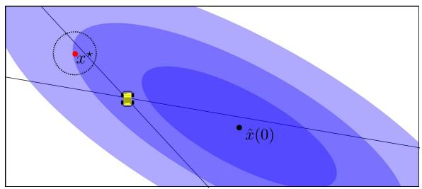  
(a)

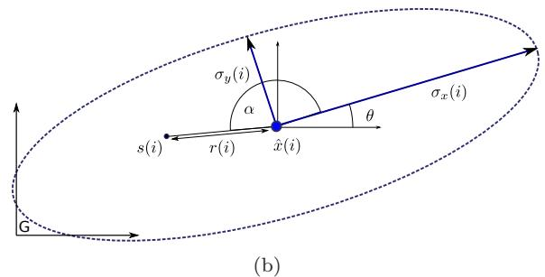  
<!-- PDF_PAGE: 003 -->

Figure 1: (a). Problem setup. A robot, without knowledge of the true target location $x ^ { \star }$ but with an initial hypothesis of the target location, ˆx(0), must find measurement locations to shrink the uncertainty about $x ^ { \star }$ . Measurements taken far from $x ^ { \star }$ , for example, near ${ \hat { x } } ( 0 )$ will ultimately provide small information about $x ^ { \star }$ , and are thus wasteful. Shown is an example of a “double wedge” or ambiguous measurement cone: From just one measurement, it is not clear if the target is near ${ \hat { x } } ( 0 )$ or $x ^ { \star }$ . (b). The notation and problem formulation. A sensor location at time $i ,$ denoted $s ( i )$ , is described by $( r ( i ) , \alpha ( i ) )$ . Here $r ( i )$ is the range from the sensor to the current hypothesis, ${ \hat { x } } ( i )$ and $\alpha ( i )$ denotes the orientation with respect to the line formed by the major axis of the covariance ellipse, Σ(i), with eigenvalues $\sigma _ { x } ( i )$ and $\sigma _ { y } ( i )$ and orientation $\theta ( i )$ with respect to a global frame.

$$
\operatorname* { m i n i m i z e } _ { \mathcal { S } = \{ s ( 1 ) , \cdots , s ( N ) \} } T ( S ) = N \cdot t _ { m } + { \frac { D ( S ) } { v } }\tag{1}
$$

subject to:

$$
\begin{array} { c } { { \sigma _ { x } ( N ) \leq \gamma \cdot \sigma _ { x } ( 0 ) } } \\ { { \sigma _ { y } ( N ) \leq \gamma \cdot \sigma _ { y } ( 0 ) } } \\ { { N \geq 1 } } \end{array}
$$

For simplicity of notation, we will assume the robot has unit velocity, and drop the v term from the cost function. This optimization problem is challenging because:

1. N is unknown. The objective function requires minimizing the size of the measurement sequence, as well as the displacement between measurements. This is especially crucial when the measurement time $t _ { m }$ is non-negligible. As we will see in the next section, previous literature often assumes a fixed N, corresponding to a fixed time horizon.

2. We wish to find or approximate the global optimal solution. A gradient-based search may find a local minimum which satisfies the constraints, but cannot make any statements about convergence relative to global optimality. A search for the global optimal strategy is exponential in $N ,$ and therefore infeasible.

3. We remove the assumption about a constant distance between measurements. In the next section we show this assumption is common but is not valid for the problem of choosing discrete measurement locations.

4. Each bearing measurement is ambiguous. The bi-modal nature of the radio bearing measurements complicates the filtering process. In the worst case, an exponential number of hypotheses must be maintained.

<!-- PDF_PAGE: 004 -->

We now review the literature for approaches to solve related problems.

## 3 Related Work

In active localization, the objective is to decide where to take measurements to maximize the performance of a given estimator. Conversely, tracking and estimation literature takes a passive approach: the task is to design an estimator which is robust when given arbitrary measurements. In particular, the problem of estimating a track for a maneuvering target using bearing-only measurements has been well studied (e.g., [Li and Jilkov, 2001, Li and Jilkov, 2003, Li and Jilkov, 2005]). However, designing an estimator does not address the problem of choosing good measurement locations. Thus, work on improved filter design would be orthogonal, but easily incorporated into our active localization algorithm.

For estimating target state with ambiguous bearing measurements, [Derenick et al., 2011] considered radiobased measurements in the context of cooperative localization for teams of mobile robots. A Multi-Hypothesis Extended Kalman Filter was used and it was shown that the robots’ motion could disambiguate the hypotheses. However, no active motion strategy was provided. [Forney et al., 2012] recently designed a particle filter-based estimator for disambiguating the sign of the bearing measurement toward a transmitting tag embedded on leopard sharks. Again, active localization was not considered.

Disregarding the discrete bearing measurement model, several works exist in optimizing the robot trajectory while assuming bearing measurements are obtained continuously in time. [Hoffmann and Tomlin, 2010] explored such an objective, though their main contribution was a distributed approximation for the mutual information between the sensors and target, which is not applicable to this work, since a single robot will visit all measurement locations. [Martinez and Bullo, 2006] produced an algorithm to route bearing sensors which were constrained to travel in pre-defined geometric areas, but could not produce general strategies for one or more robots. [Frew, 2009] provided a fixed-horizon optimization for the so-called Fixed Information, Minimum Time problem. [Frew, 2003] provided an action-space search over possible sensor trajectories to minimize the determinant of the posterior covariance. A similar result was produced by [Zhou and Roumeliotis, 2011], who routed robots to minimize the trace of the posterior covariance. In these works no global optimality conditions were explored and no time bounds were given for the algorithms. Additionally, we relax the constraint of fixed travel time (or constant distance) between measurements.

In [Tokekar et al., 2013] and [Tokekar et al., 2011] we provided three algorithms to find measurement locations, each based on a search over the discretized space around the robot. Discretization and search over state space was computationally demanding, and the results were limited to a fixed-sized displacement between measurements because of the discretization size. Furthermore, there was no systematic approach for dealing with the ambiguity of measurements.

Other results exist which use simplified noise models but cannot be directly applied to real-world deployments. Regarding the ambiguous sensing model, the infinite-line sensor was considered by [Bopardikar, 2010], in the context of pursuit-evasion games. A finite-time capture strategy was provided by using pairs of measurements to resolve the ambiguity. Sensor noise was not considered, making localization of a static target trivial under the assumptions and sensing model proposed. More recently, [Borri et al., 2011] considered the problem of locating a stationary target using a fixed, small number of stationary half-plane sensors deployed. The goal, similar to ours, was to minimize the number of sensor queries and the length of the tour between them. However, the target was restricted to a discrete set of locations, and sensor positions were known a priori, resulting in a divide-and-search strategy which does not generalize to our setting. In this work we use noise models calibrated from real-world data, and confirm our findings with field deployments. We also require no discrete constraints on the environment or target location to solve a more general version of the problem.

Similar to ambiguous bearing measurements, range-only measurements can lead to multiple hypotheses about the target location. [Merino et al., 2010] studied the problem of active localization using range-only measurements from radio sensors. They represent multiple hypotheses with a Gaussian Mixture Model (GMM). The robot’s direction is greedily chosen from a discretized set which maximizes the change in the entropy of the GMM. Zhou and Roumeliotis [Zhou and Roumeliotis, 2008] studied the problem of tracking a single moving target with multiple robots measuring the range to the target. They show that the problem of determining the sensing locations for all robots minimizing the trace of the target’s posterior covariance for the next time step is NP-Hard, and present two heuristics to solve the problem. [Morbidi and Mariottini, 2012] studied the single and multi-target active tracking problem with a team of robots with 3D range sensors. The authors present a gradient-based controller for controlling the team of robots to (locally) minimize the uncertainty in estimating the target’s location. [Scerri et al., 2007] used radio signal strength to estimate the range to radio sources and a grid-based Bayesian filter to estimate the location of each radio source. A path-search algorithm based on Rapidly Exploring Random Trees was proposed, but lacked any theoretical guarantees. Due to the differences in sensing model, these results for range-only sensors cannot be directly applied for bearing sensors. Furthermore, unlike these works, we consider the case where each measurement takes non-zero time and the objective is to minimize the travel and measurement time to localize the target to a desired uncertainty bound.

<!-- PDF_PAGE: 005 -->

We also present a bound on the optimal bearings-only localization algorithm. Previous results in this direction include [Hammel et al., 1989], who numerically calculated an optimal trajectory using the determinant of the Fischer Information Matrix (FIM) evaluated at the true target location. In this work, no closed-form solution was provided, and the bounds presented in this paper generalize the result by optimizing the number and spacing of the measurements. [Bishop and Pathirana, 2008] directly evaluated the determinant of the FIM to find sufficient conditions for an optimal placement of sensors, whereas we solve for the placement uniquely, and minimize the cost of travelling between sensor locations.

In our previous work, we defined a search algorithm which guaranteed that the robot would find a position from which it can detect a tagged fish in pre-defined regions of the lake [Tokekar et al., 2013]. [Song et al., 2011] and [Song et al., 2012] considered a similar problem of searching for and localizing multiple radio sources. The objective was to find a location which corresponds to the maximum signal strength of the transmitting source. A “Ridge Walking Algorithm” was proposed to repeatedly traverse the area around each radio source, making the final uncertainty a function of the signal strength. The main results apply to radio sources which are infrequently transmitting, and so the time-to-locate a source is an unbounded random variable. These works are complementary, since we assume the robot begins in detection range and use bearing measurements to reduce the uncertainty. Furthermore we allow the final required precision to be specified, and provide explicit, absolute bounds on localization time.

A greedy algorithm is presented in this work which provides the next measurement location in closed-form, removing the need for any state-space search. It is shown how to select measurement locations to limit the effect of ambiguity, and to bound the time spent by the robot during the localization, while providing a guarantee of posterior covariance. Finally we show that no other bearing-based algorithm can perform significantly better than ours, by providing a lower-bound on the optimal cost directly. A preliminary version of this paper appeared as [Vander Hook et al., 2012b]. In the current version we improve theoretical results and their presentation, include additional field trials and simulations, and discuss related issues which were previously omitted. In particular, the analysis in Section 8.1 is shown to apply to the general bearings-only localization task. Finally, we also present a way to initialize prior estimates of the target using a simple searchbased strategy. The initialization routine work was previously presented in [Vander Hook et al., 2012a].

## 4 Preliminaries

In this section we briefly review the necessary background and define our notation. We have had success in field experiments using the Extended Kalman Filter (EKF) for this application, and hence base our algorithm with respect to this common filtering technique. The closed-form representation for the EKF allows us to make guarantees about algorithm execution time and completeness as elaborated in the next sections. We leave the generalization to other techniques to future work, but provide a direct comparison in Section 9.

<!-- PDF_PAGE: 006 -->

Consider Figure 1(b). We begin with the robot at location ${ { \cal G } _ { s ( 0 ) } }$ , according to a global coordinate frame G . The true target location, $G _ { x ^ { \star } }$ is unknown, but we may take bearing measurements from any location, s(i) of the form $\begin{array} { r } { z ( i ) = h \left( { ^ G } x ^ { \star } , { ^ G } s ( i ) \right) = \tan ^ { - 1 } \left( \frac { G _ { s _ { y } } ( i ) - { ^ G } x _ { y } ^ { \star } } { { ^ G } s _ { x } ( i ) - { ^ G } x _ { x } ^ { \star } } \right) } \end{array}$ . However, the bearing is actually the orientation of a line which passes through the sensor and target. Since it is not clear if the measured bearing points towards or away from the target, we call it an ambiguous measurement.

A sequence of measurements is denoted $S = \{ s ( 1 ) , \cdot \cdot \cdot , s ( N ) \}$ . We assume an initial two-dimensional Gaussian hypothesis in a world frame G , with mean $G _ { \hat { x } }$ and covariance $\Sigma ( i ) \ ( \mathrm { i . e . , } \ x ^ { \star } \sim { \mathcal N } ( ^ { G } \hat { x } ( i ) , \Sigma ( i ) )$ . For convenience of analysis and notation, we will describe sensor locations in polar coordinates with respect to the target hypothesis, i.e. $s ( i ) = ( \alpha ( i ) , r ( i ) )$ . The local frame about ˆx is oriented with respect to the covariance ellipse, with the x axis corresponding to the major axis (eigenvector with the larger eigenvalue) at each time step. We denote a series of sensor locations as ${ \cal S } = \{ s ( 1 ) , \cdots , s ( N ) \}$ , with measurements $\mathcal { Z } = \{ \boldsymbol { z } ( 1 ) , \cdots , \boldsymbol { z } ( N ) \}$ .

We employ an EKF to merge the measurements acquired. The EKF requires that the measurement noise is Gaussian. The equations that describe the EKF updates are [Bar-Shalom et al., 2001],

$$
\hat { x } ( i + 1 ) = \hat { x } ( i ) + K _ { i } y ( i )\tag{2}
$$

$$
\Sigma ( i + 1 ) = \Sigma ( i ) - \Sigma ( i ) \left( H _ { i } ^ { T } S _ { i } ^ { - 1 } H _ { i } \right) \Sigma ( i )\tag{3}
$$

with:

$$
H _ { i } = \nabla _ { \hat { x } ( i ) } h ( \hat { x } ( i ) , s ( i ) ) = \frac { 1 } { r ( i ) } \left[ - \sin \alpha ( i ) \cos \alpha ( i ) \right]\tag{4}
$$

$$
S _ { i } = H _ { i } \Sigma ( i ) H _ { i } ^ { T } + \sigma _ { s } ^ { 2 }\tag{5}
$$

$$
K _ { i } = \Sigma _ { i - 1 } H _ { i } ^ { T } S _ { i } ^ { - 1 }
$$

$$
y _ { i } = z _ { i } - h ( { \hat { x } } ( i ) , s ( i ) )
$$

As noted by [Thrun et al., 2005], the covariance update step from the EKF (Equation 3) can be re-arranged to a more convenient form, known as the Extended Information Filter.

$$
\begin{array} { r l } { \Sigma ^ { - 1 } ( i + 1 ) = \Sigma ^ { - 1 } ( i ) + H _ { i } ^ { T } R ^ { - 1 } H _ { i } } & { { } } \\ { \quad } & { { } = \Sigma ^ { - 1 } ( i ) + \displaystyle \frac { 1 } { r ^ { 2 } \sigma _ { s } ^ { 2 } } \left[ \cfrac { \sin ^ { 2 } \alpha ( i ) } { - \sin \alpha ( i ) \cdot \cos \alpha ( i ) } \right. \left. - \sin \alpha ( i ) \cdot \cos \alpha ( i ) \right] } \\ { \quad } & { { } \cos ^ { 2 } \alpha ( i ) } \end{array}\tag{6}
$$

Equation (6) follows because of the form of $h ( \cdot )$ for bearing-only tracking. As described, for bearings constructed with directional radio antenna a double-wedge sensing model is used. A significant consequence of this sensing model is the ambiguity regarding which side of the robot the measurement originated from. So, before applying the EKF update equations, we must resolve this ambiguity as discussed next.

## 5 Addressing ambiguity

In this section we show how to structure a measurement sequence to minimize the impact of ambiguous bearing measurements. To see the effect of ambiguous measurements, consider the situation shown in Figure 2. In Figure $2 ( \mathrm { a } )$ , a mobile robot arrives at position $s ( i )$ and takes a measurement, as shown by the line $z - s ( i ) - z ^ { \prime }$ . Notice that the line can be separated into two rays, which we define $s ( i ) – z$ and $s ( i ) – z ^ { \prime }$ with the angles $0 \leq | z | < | z ^ { \prime } | \leq \pi$ . Note that $z ^ { \prime } = z + \pi$ , and z is the “forward-facing” part of the measurement, or the part of the line segment which passes closer to the point ${ \hat { x } } ( i )$ . Both rays represent a deviation from the expected measurement (the line $s ( i ) \ – \hat { x } ( i )$ , corresponding to angle 0). After performing a Bayesian update of the target hypothesis using the ambiguous measurement, the target PDF will also be bi-modal, as shown in Figure $2 ( \mathrm { c ) }$

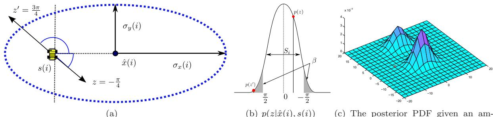  
<!-- PDF_PAGE: 007 -->

(b) p(z|xˆ(i), s(i))  
(c) The posterior PDF given an ambiguous measurement.  
Figure 2: (a) Ambiguous measurements produce two possible bearings (z and $z ^ { \prime } )$ . (b) The EKF approx imates the measurement probability as a Gaussian with mean zero and variance $S _ { i }$ . (c) The PDF of the target hypothesis after updating the Gaussian prior shown in (a) with measurements $z ^ { \prime }$ and z.

Analytically, we can see this as follows. Let $p ( \hat { x } ( i + 1 ) )$ represent the posterior PDF of the target, $Z =$ $\{ z \} \cup \{ z ^ { \prime } \}$ be an ambiguous measurement which we decompose as described into two rays, $s ( i )$ be the sensor location, and $x ( i )$ the prior hypothesis.

$$
\begin{array} { r l } { p ( x ( i + 1 ) | x ( i ) , s ( i ) , Z ) \propto } & { p ( x ( i + 1 ) | x ( i ) , s ( i ) , z ) \cdot p ( z | x ( i ) , s ( i ) ) } \\ & { + p ( x ( i + 1 ) | x ( i ) , s ( i ) , z ^ { \prime } ) \cdot p ( z ^ { \prime } | x ( i ) , s ( i ) ) } \end{array}\tag{7}
$$

This PDF is well-approximated by a mixture of two Gaussians, one for each peak in the PDF given the new measurement (see Figure $2 ( \mathrm { c } ) )$ . A reasonable practice is to use two Gaussian hypotheses, weighted as shown. However, splitting the PDF with each measurement will lead to an exponential number of hypotheses over multiple measurements. To address this problem, it is necessary to discard or combine hypotheses with low relative weights (see [Reid, 1979, Blackman, 2004, Cox and Hingorani, 1996]). However, if the robot takes a measurement from a location very close to the peak of the prior hypothesis, the weights $p ( z | x ( i ) , s ( i ) )$ and $p ( z ^ { \prime } | x ( i ) , s ( i ) )$ may be equal and no hypothesis can be discarded.

The key observation which motivates our choice of measurement locations is the following: The likelihood $p ( z ^ { \prime } | x ( i ) , s ( i ) )$ is highly dependent on the sensor location relative to the target hypothesis. As we will show below, one can always choose measurement locations such that $p ( z | x ( i ) , s ( i ) )$ is much higher than $p ( z ^ { \prime } | x ( i ) , s ( i ) )$ . In this way only one Gaussian hypothesis will have a high weight after each measurement.

Specifically, we choose measurement locations such that $p ( z ^ { \prime } | x ( i ) ) \ll p ( z | x ( i ) )$ for any value of z. This is challenging because the measurement value $( z )$ is only given as the approximate distribution $p ( z | x ( i ) )$ To proceed, let $\beta$ be a parameter describing the maximum acceptable probability that the target is in fact “behind” the sensor (corresponding to $z ^ { \prime }$ being the correct bearing). We can choose locations such that $p ( z ^ { \prime } | x ( i ) )$ is always less than $\beta$ using the following lemma (a proof of which is delayed until Appendix A).

Lemma 1. $L e t \Phi ( a )$ be the Gaussian CDF such that $\Phi ( a ) = p ( x \leq a )$ when $x \sim \mathcal { N } ( 0 , 1 )$ . Define a threshold parameter $\beta$ and true measurement $z ^ { \star }$ . Define sensing locations in radial coordinates $( \alpha ( i ) , r ( i ) )$ centered around the current target hypothesis. Then any sensing location satisfying,

$$
r ( i ) \geq \sqrt { \frac { \sigma _ { x } ^ { 2 } ( i ) \sin ^ { 2 } \alpha ( i ) + \sigma _ { y } ^ { 2 } ( i ) \cos ^ { 2 } \alpha ( i ) } { \sigma _ { \beta } ^ { 2 } - \sigma _ { s } ^ { 2 } } }
$$

$$
w i t h ~ c o n s t a n t \colon \sigma _ { \beta } = \frac { \pi } { 2 \cdot \Phi ^ { - 1 } \left( 1 - \frac { \beta } { 2 } \right) }\tag{8}
$$

will also satisfy $p ( z ^ { \prime } | x ( i ) , s ( i ) ) \leq \beta$

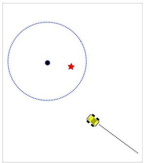  
(a)

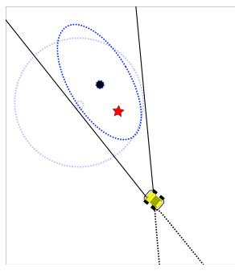  
(b)

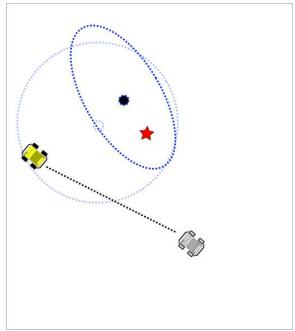  
(c)  
<!-- PDF_PAGE: 008 -->

Figure 3: One measurement step of the cautious strategy presented in Algorithm 1. Shown is a covariance ellipse and target hypothesis (circle), along with the true target location (star). (a) The robot moves to a location perpendicular to the direction of highest uncertainty. (b) A bearing measurement is collected, and the hypothesis is updated. The “backward facing” cone (dashed lines) is discarded. (c) The now-reshaped covariance ellipse has a new direction of highest uncertainty, and the process repeats.

Lemma 1 defines an “ellipse of closest approach” around the target hypothesis, with principal axes defined as a function of the uncertainty in the estimate. Effectively, we have defined a strategy which truncates part of the PDF by discarding the possibility that the target is behind the sensor. The amount of discarded probability mass is approximated by the $\beta$ parameter. As $\beta  0$ , none of the PDF is truncated, but the measurement locations become infinitely far away. Perhaps intuitively, in the following sections we show that the parameter $\beta$ captures the trade-off between time spent localizing a target, and the accuracy of the final estimate. In particular, the time required to locate a target will follow directly in closed form in Section 7 as a function of $\beta .$ First, we formally specify our algorithm.

## 6 The β-Cautious Algorithm

We now introduce our main algorithm. In essence, we present a greedy algorithm which outputs a measurement location based on the current hypothesis. At each time step, it will output a measurement location which can minimize the maximum eigenvalue of the covariance matrix. Such an algorithm is often called E-Optimal in literature [Pukelsheim, 2006].

Algorithm 1 β-Cautious Strategy $\left( s _ { 0 } , \hat { x } _ { 0 } , \Sigma _ { 0 } , \beta , \gamma , \sigma _ { s } ^ { 2 } \right)$   
1: σβ ← 2 · Φ−1 (1 − β2 ) π   
2: $\sigma _ { x } ^ { 2 } ( 0 ) , \sigma _ { y } ^ { 2 } ( 0 ) \gets$ eigenvalues $\left( \Sigma _ { 0 } \right)$   
3: i 1   
4: while $\sigma _ { x } ( i ) \geq \gamma \cdot \sigma _ { x } ( 0 ) { \mathrm { ~ o r ~ } } \sigma _ { y } ( i ) \geq \gamma \cdot \sigma _ { y } ( i )$ d o   
5: Polar frame at $\hat { x } ( i - 1 )$ aligned with $\sigma _ { x } ( i - 1 )$   
6: $\begin{array} { r } { r ( i )  \frac { \sigma _ { x } ( i - 1 ) } { \sqrt { \sigma _ { \beta } ^ { 2 } - \sigma _ { s } ^ { 2 } } } } \end{array}$   
7: Let $s ( i )$ be the closer of $( r ( i ) , \frac { \pi } { 2 } )$ or $( - r ( i ) , \frac { \pi } { 2 } )$   
8: Collect measurement $z ( i )$ from $s ( i )$   
9: $\hat { x } ( i ) , \Sigma ( i ) \gets \mathrm { e k f . u p d a t e } ( z ( i ) , \sigma _ { s } , \hat { x } ( i - 1 ) , \Sigma _ { i - 1 } )$   
10: $\sigma _ { x } ^ { 2 } ( i ) , \sigma _ { y } ^ { 2 } ( i ) \gets$ eigenvalues(Σ(i))   
11: $i \gets i + 1$   
12: end while

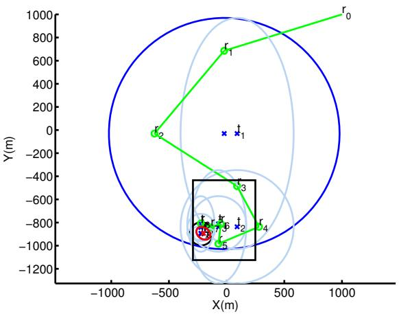  
<!-- PDF_PAGE: 009 -->

(a) Full run

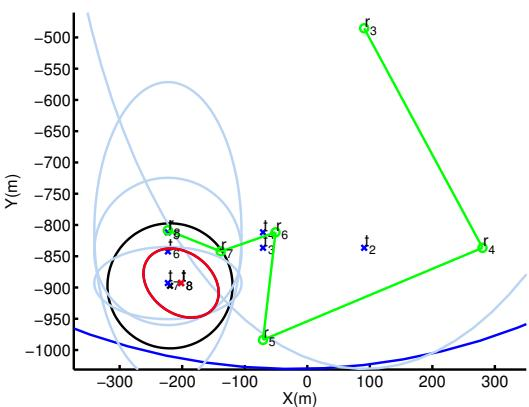  
(b) Zoomed in boxed area  
Figure 4: A simulated execution of the cautious strategy. This figure is best viewed in color. (a) the full run. (b) Detail of the boxed region in the first figure. A red ellipse denotes the final target covariance, the black circle is the desired uncertainty, blue is prior estimate, and green is the robot path and measurement locations. The robot travels in a roughly zig-zag path towards the target, while the target hypothesis shifts rectilinearly towards the true target.

## 6.1 Algorithm Description

Each measurement location is subject to the constraint given in Lemma 1. Specifically, fix $\alpha = \textstyle { \frac { \pi } { 2 } }$ with respect to the larger eigenvalue $/$ eigenvector pair at every time step $( \sigma _ { x }$ in this notation). Thus, Equation 8 simplifies to,

$$
r \geq \frac { \sigma _ { x } } { \sqrt { \sigma _ { \beta } ^ { 2 } - \sigma _ { s } ^ { 2 } } }\tag{9}
$$

As $\sigma _ { x } \  \ 0$ , r strictly decreases, and thus the range (relative to the hypothesis) between measurements decreases as well. Since the algorithm produces measurement locations which begin far away from the hypothesis (as a function of $\beta )$ , and only approach when the variance decreases, we call the algorithm $\beta \mathrm { . }$ -Cautious.

Algorithm 1 presents the detailed implementation of our algorithm. At each time step, the robot moves to a position perpendicular to the eigenvector with the largest eigenvalue. The robot chooses the smallest range satisfying Equation 9. Figure 3 shows a pair of measurements and the path of the robot. In general, there are two such locations, so it is easiest to choose the closer of the two. This process repeats until both eigenvalues are below the desired threshold. Figure 4 shows a full simulated execution of the algorithm. As the uncertainty $\left( \sigma _ { x } \right)$ decreases with more measurements, the robot approaches closer to the hypothesis for obtaining the measurements, as per Equation 9.

Since the algorithm reduces the largest eigenvalue at every measurement step, it is guaranteed to satisfy the constraint $\Sigma ( N ) \leq \gamma \cdot \Sigma ( 0 )$ in finite time. We use the EKF update routine (Equation 2 and Equation 3) as a subroutine. Since all operations are available in closed form, and the size of the covariance is small and fixed, Algorithm 1 has a constant computational complexity. While a greedy, multi-target extension is possible, we focus on the analysis of the single-target algorithm in this work.

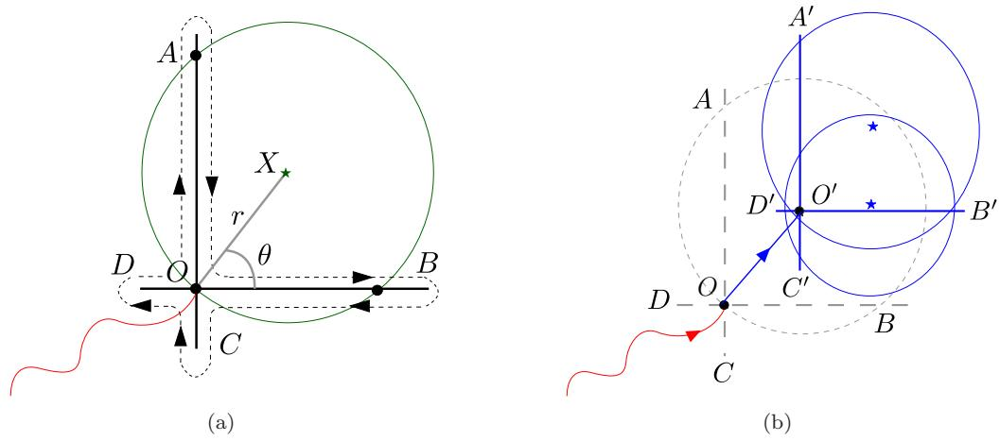  
<!-- PDF_PAGE: 010 -->

Figure 5: Search-Based Initialization. (a) The robot continues along an arbitrary but fixed direction until it cannot detect the signal from X (at position A). The robot then returns to O and repeats the same strategy along a perpendicular line (B). In general, the O can lie in the interior of the sensing circle, hence the robot also searches along C and D (b) A second search from the center of the first circle will reveal all nearby tags, provided the sensing range is larger than the spacing between targets.

## 6.2 Initialization of Prior Estimates

So far, we have assumed that an initial estimate $\mathcal { N } ( \hat { x } ( 0 ) , \Sigma ( 0 ) )$ is available. However, during a search operation on a frozen lake, such an initial estimate is not usually available. Typically the robot begins by following a pre-defined search path (see [Tokekar et al., 2013] for more details). The search path brings the robot into sensing range of a target. To proceed with bearing-only localization, we must construct an initial estimate of the target location.

This initialization problem was challenging because the sensing ranges of individual radio tags may vary based on the depth of the tag, the age of the tag, and other environmental factors and hence the signal strength cannot directly be used. A straightforward technique might be to use a small number of bearing measurements to initialize the prior estimate. This is undesirable for RSSI-based bearings because of the significant time required, the high sensor noise, and the ambiguity.

Instead, for completeness we present the relevant details of a bounded-time strategy which forms a consistent initial estimate by exploiting the limited sensing range of the sensor. We assume that each tag has an isotropic sensing range, and so the detected tag X is at the center of a sensing circle $C _ { X }$ of radius r. The circle $C _ { X }$ is used to initialize the three-sigma bounds of a Gaussian prior estimate. In practice, we do not expect the sensing area to be circular. The circle is only used as a conservative prior estimate and input into the localization algorithm discussed in the previous section.

Note that both X (the origin of $C _ { x } )$ and r are initially unknown. Our objective is to estimate both of these quantities. By finding three points (or more) on the perimeter of $C _ { X }$ we can solve for X and r. To find these points, the local search proceeds as follows. First, from the point of first detection (O), the robot moves in a fixed direction with respect to the global frame (e.g., North or angle α). Then, when the robot can no longer detect the target X (position A in Figure 5) it reverses direction and returns to O. The line segment traversed in these two steps is referred to as a search path. A full execution of four search paths is shown in Figure 5. We then fit a circle to these four points, which estimates the sensing circle $C _ { X }$ . The localization strategy requires a 2D Gaussian distribution, which we construct as follows: We use the center of the circle as the mean of the distribution (ˆx(0)), and the radius of the circle as the 3-σ of the covariance in both the x and y directions.

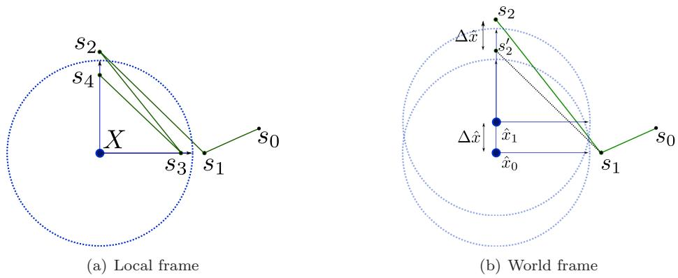  
<!-- PDF_PAGE: 011 -->

Figure 6: The measurement sequence $\boldsymbol { S } = \{ s _ { 0 } \ldots s _ { 4 } \}$ (a) the target hypothesis shifts vertically because of the measurement received at $s _ { 1 }$ . (b) The next measurement location $\left( s _ { 2 } \right)$ must be shifted by the same amount to satisfy the range constraint.

We can establish the cost as follows (refer to Figure 5). Let angle AOX be θ. By design, the angle AOB is $\frac { \pi } { 2 }$ The distance AB is 2r and segment OA has length 2r cos θ while OB has length 2r sin θ. Each of the four search paths $( O A , \ldots , O D )$ must be covered twice. With velocity $v ,$

$$
T _ { \mathrm { i n i t } } = { \frac { 4 r } { v } } \cos \theta + { \frac { 4 r } { v } } \sin \theta + 4 \cdot \epsilon\tag{10}
$$

where ǫ is the time taken to recognize the robot has left $C _ { X }$ , turn around, and re-enter $C _ { X }$ Note that θ is unknown and can take any value between 0 and 2π, depending on the relative orientation of the targe position with respect to the first search direction. To obtain the worst-case cost, we maximize the cost function with respect to θ. A straightforward derivation shows the cost is maximum when θ = 45 degrees for a maximum cost of,

$$
\operatorname* { m a x } _ { \theta } \ T _ { \mathrm { i n i t } } = 2 ^ { \frac { 5 } { 2 } } { \frac { r } { v } } + 4 \cdot \epsilon\tag{11}
$$

The expected search time, assuming θ is uniform in the range [0, 2π] is $\begin{array} { r } { \mathbb { E } \left[ T _ { \mathrm { i n i t } } \right] = 2 \frac { r } { v } + 4 \epsilon } \end{array}$ The sensing range of the antennas in our system is typically less than 100m. Hence, the time taken by the described initialization procedure is no more than taking four bearing measurements per tag. Furthermore, a strategy that relies on a small number of bearing measurements for initialization may lead to an inconsistent estimate if the (small number of) initial bearing measurements contain significant noise. Additionally, our searchbased initialization becomes even more cost effective as the number of nearby tags (with overlapping sensing circles) increases [Vander Hook et al., 2012a].

## 7 Bounding the Cost of the β-Cautious Algorithm

To bound the time required to execute the algorithm on a real system, we first consider the number of measurements required to achieve the requested covariance reduction. We begin by showing that $\mathrm { ~ a ~ } \beta -$ Cautious measurement sequence decreases covariance (increases information) by a constant factor at each time step. From this follows a bound on the number of measurements required to reach the desired covariance in Lemma 3. Because the measurement values are unknown (random) variables, the state of the target is unknown for each time step. Therefore it is necessary to find a worst-case change in hypothesis location for each measurement, and bound the time required to shift the measurement location to compensate. The results derived here are confirmed in simulations (see Section 9) and field experiments (Section 10). The proofs which are omitted for brevity are included in Appendices B—E.

We begin by deriving the exact covariance reduction from a β-Cautious measurement strategy.

<!-- PDF_PAGE: 012 -->

Lemma 2. If a pair of measurements is taken from $\begin{array} { r l } { \alpha ( i ) \ = } & { { } \frac { \pi } { 2 } } \end{array}$ with range constraint (from Lemma 1) $\begin{array} { r } { r ( i ) = \frac { \sigma _ { x } ( i ) } { \sqrt { \sigma _ { \beta } ^ { 2 } - \sigma _ { s } ^ { 2 } } } } \end{array}$ , the variance both x and y directions is decreased by a constant factor,

$$
\sigma _ { x } ^ { 2 } ( i + 2 ) = \frac { \sigma _ { \beta } ^ { 2 } } { \sigma _ { s } ^ { 2 } } \sigma _ { x } ^ { 2 } ( i ) { \mathrm { ~ } w i t h ~ } \sigma _ { \beta } > \sigma _ { s } { \mathrm { ~ } ( s e e ~ L e m m a ~ } 1 )\tag{12}
$$

In addition, the alignment of the major and minor axes of the posterior covariance does not rotate from the prior.

The above lemma guarantees that after each pair of measurements the covariance decreases by a factor of $\frac { \sigma _ { \beta } ^ { 2 } } { \sigma _ { s } ^ { 2 } }$ . A straightforward derivation shows an upper bound on the number of measurements required to reduce the eigenvalues of the covariance by a factor of $\gamma ,$ to achieve the desired bounds.

Lemma 3. Let the time-stamped range for each measurement be $r ( i )$ and the corresponding maximum variance be $\sigma _ { x } ^ { 2 } ( i )$ (covariance $\Sigma ( i ) ) ,$ at time-step i. While constraining the range as defined in Lemma 1, such that $\begin{array} { r } { r \ge \frac { \sigma _ { x } } { \sqrt { \sigma _ { \beta } ^ { 2 } - \sigma _ { s } ^ { 2 } } } } \end{array}$ , the number of measurements required to satisfy the uncertainty objective, $\sigma _ { x } ( N ) \leq \gamma \cdot \sigma _ { x } ( 0 )$ with $0 < \dot { \gamma } \le 1$ is

$$
N = 4 \log _ { \left( \frac { \sigma _ { \beta } ^ { 2 } } { \sigma _ { s } ^ { 2 } } \right) } \left( \frac { 1 } { \gamma } \right)
$$

Using the number of measurements for a problem instance, it is possible to estimate the distance traveled over a tour of the measurement locations. Note that the measurement locations are specified as $( r ( i ) , \alpha ( i ) )$ pairs with respect to ${ \hat { x } } ( i )$ , the hypothesis at each time-step. An example of a measurement sequence with $N = 4$ is shown in Figure 10. Because the hypothesis may move after new measurements, it is not trivial to solve for the distance traveled. The general form of the distance traveled is,

$$
D ( S _ { a l g } ) \leq \sum _ { i = 1 } ^ { N - 1 } | | s ( i + 1 ) - s ( i ) | | + | | \hat { x } ( i + 1 ) - \hat { x } ( i ) | |
$$

The first quantity is the total distance traveled by the robot in the target’s frame fixed at each step (Figure $\mathrm { 6 ( a ) ) }$ . The second quantity is the shift between the hypothesis, i.e., the shift in the target’s local frame after each measurement (Figure $6 ( \mathrm { b } ) _ { , }$ ). Both quantities admit upper-bounds, as follows.

Since the covariance does not rotate, in the local frame of the target hypothesis, the measurement sequence simply alternates between both principal axes (as shown in Figure $\mathrm { 6 ( a ) ) }$ ). Each measurement takes place at fixed range, $\begin{array} { r } { r ( i ) = \frac { \sigma ( i ) } { \sqrt { \sigma _ { \beta } ^ { 2 } - \sigma _ { s } ^ { 2 } } } } \end{array}$ in the corresponding local frame. Intuitively, this allows an upper-bound on the worst case travel distance of the robot in the local frame in terms of the covariance at each step.

Lemma 4. The total displacement between sensor locations in the local frame of the hypothesis $( i . e .$ , disregarding hypothesis displacement) satisfies

$$
\sum _ { i = 1 } ^ { N - 1 } | | s ( i + 1 ) - s ( i ) | | \leq \sum _ { i = 1 } ^ { N - 1 } \frac { \sqrt { 2 } } { \sqrt { \sigma _ { \beta } ^ { 2 } - \sigma _ { s } ^ { 2 } } } \sigma _ { x } ( i )
$$

Using the EKF update equations we can compute the maximum displacement between the target hypothesis for any measurement that can be obtained in terms of the covariance at that step (Figure 6(b)). This allows us to bound the total shift in the local frame centered at the hypothesis at each measurement step.

Lemma 5. The total shift in the target hypothesis from a measurement sequence of size N is bounded above as,

$$
\sum _ { i = 1 } ^ { N - 1 } | | \hat { x } ( i + 1 ) - \hat { x } ( i ) | | \leq \sum _ { i = 1 } ^ { N - 1 } \sigma _ { x } ( i ) \frac { \pi \sqrt { \sigma _ { \beta } ^ { 2 } - \sigma _ { s } ^ { 2 } } } { \sigma _ { \beta } ^ { 2 } }
$$

<!-- PDF_PAGE: 013 -->

We add the target displacement at each step to the distance traveled between each measurement, which preserves the upper bound by the triangle inequality (cf. Figure 6(b)). The above three lemmas together give a bound on the number of measurements and distance traveled by the robot. We can now fully bound the time required to localize a target.

Theorem 1. The total time taken by the β-Cautious strategy is given $a s ,$

$$
T ( S _ { \beta } ) \leq \sigma _ { x } ( 0 ) \cdot \left( \frac { \sqrt { 2 } } { \sqrt { \sigma _ { \beta } ^ { 2 } - \sigma _ { s } ^ { 2 } } } + \frac { \pi \sqrt { \sigma _ { \beta } ^ { 2 } - \sigma _ { s } ^ { 2 } } } { \sigma _ { \beta } ^ { 2 } } \right) \cdot \left[ \frac { 1 - \sqrt { \gamma } } { 1 - \frac { \sigma _ { s } } { \sigma _ { \beta } } } \right] + 4 \log _ { \left( \frac { \sigma _ { \beta } ^ { 2 } } { \sigma _ { s } ^ { 2 } } \right) } \left( \frac { 1 } { \gamma } \right) + D ( s _ { 0 } , s _ { 1 } )\tag{13}
$$

Proof. The time spent localizing a target consists of travel time and measurement time. The time spent measuring is simply $N \cdot t _ { m }$ , where N follows from Lemma 3. To bound the time spent travelling, we use the distance bounds from Lemmas 4 and 5. Note that we have assumed unit velocity, otherwise, the following must be scaled by the velocity of the robot.

$$
D ( S _ { a l g } ) \leq \sum _ { i = 1 } ^ { N - 1 } \sigma _ { x } ( i ) \frac { \sqrt { 2 } } { \sqrt { \sigma _ { \beta } ^ { 2 } - \sigma _ { s } ^ { 2 } } } + \sum _ { i = 1 } ^ { N - 1 } \sigma _ { x } ( i ) \frac { \pi \sqrt { \sigma _ { \beta } ^ { 2 } - \sigma _ { s } ^ { 2 } } } { \sigma _ { \beta } ^ { 2 } }
$$

Note the two series can be combined. Factoring out and grouping all constants yields,

$$
D ( S _ { a l g } ) \leq \left( \frac { \sqrt { 2 } } { \sqrt { \sigma _ { \beta } ^ { 2 } - \sigma _ { s } ^ { 2 } } } + \frac { \pi \sqrt { \sigma _ { \beta } ^ { 2 } - \sigma _ { s } ^ { 2 } } } { \sigma _ { \beta } ^ { 2 } } \right) \cdot \sum _ { i = 1 } ^ { N - 1 } \sigma _ { x } ( i )
$$

To proceed, note that $\begin{array} { r } { \sigma _ { x } ( i ) = \left( \frac { \sigma _ { s } } { \sigma _ { \beta } } \right) ^ { i } \sigma _ { x } ( 0 ) } \end{array}$ (See Equation 12). Then the summation is a geometric series, with solution as follows.

$$
\sigma _ { x } ( 0 ) \cdot \left[ \sum _ { i = 1 } ^ { N - 1 } \left( \frac { \sigma _ { s } } { \sigma _ { \beta } } \right) ^ { i } \right] \leq \sigma _ { x } ( 0 ) \cdot \left[ \sum _ { i = 1 } ^ { N } \left( \frac { \sigma _ { s } } { \sigma _ { \beta } } \right) ^ { i } \right] = \sigma _ { x } ( 0 ) \cdot \left[ \frac { 1 - \sqrt { \gamma } } { 1 - \frac { \sigma _ { s } } { \sigma _ { \beta } } } \right]
$$

The desired result follows. Note we have added $D ( s _ { 0 } , s _ { 1 } )$ , the time to travel between the initial sensor location and the first measurement location.

From here we would like to point out some intuitive results of this upper bound. First, as $\gamma  1$ , the algorithm requires no time to execute. This is because the difference between the final (requested) covariance and the initial covariance becomes small. Essentially, this shows the adaptivity of the algorithm: A good initial estimate or less restrictive desired uncertainty will lower execution time.

Notice also that as $\frac { \sigma _ { s } } { \sigma _ { \beta } }  1 $ , the work required approaches infinity. Intuitively, constraining the variance, with caution, to a value comparable to the noise in the sensor results in measurements taken from very distant locations (see Equation 9), which provide small information gains (see Equation 6). The effect of $\sigma _ { \beta }$ as a function of $\beta$ is further explored using simulations studies in Section 9.

## 8 Bounds on the Optimal Cost

The previous section established an upper-bound on the worst-case cost of using the $\beta \mathrm { . }$ -Cautious strategy to locate a stationary target. In this section we establish lower-bounds on the cost of the optimal measurement sequence. Using these bounds, we then show that no other algorithm can localize a stationary target significantly faster, as a function of the system parameters and desired final uncertainty.

<!-- PDF_PAGE: 014 -->

In the following section we present a general lower bound on the cost of any bearing-only active localization sequence, even one which does not suffer from ambiguous measurements. We compare this to the cost of the proposed algorithm in Section 8.2. Beginning in Section 8.3 we consider the worst-case execution time for the proposed algorithm, compared to that of any other online algorithm. We specify both costs as a function of the same true target location and hypothesis. This allows a direct comparison of both algorithms against a common, uncontrollable adversary (e.g., Nature) in Section 8.4.

## 8.1 Lower Bound for an Offline Algorithm

We begin by deriving a lower bound on the time required to execute the optimal measurement sequence which is planned offline–in other words, with respect to the true target location. This lower bound is a function of the system parameters, and therefore is general and applies to any mobile bearing sensor and any reasonable method of fusing the measurements. This result is presented in Theorem 2.

Our proof makes use of the Cramer-Rao Lower Bound (CRLB or C) [Van Trees, 1971] as follows. Continue to assume the measurements are distributed around the true target without bias, given the probability density function $\mathcal { Z } \sim f ( S ; { \mathbf x } ) . \mathbb { C } ( S , { \mathbf x } )$ is defined as the inverse of the Fisher Information Matrix (FIM, or F) and gives the minimum covariance about a random vector x given a series of observations . The Fisher Information Matrix has each $( i , j )$ element given with respect to the $i ^ { \mathrm { t h } }$ element of x as follows.

$$
\mathbb { F } ( i , j ) = \mathbb { E } \left[ \frac { \partial } { \partial \mathbf { x } ( i ) } \ln \left( f ( S ; \mathbf { x } ) \right) \frac { \partial } { \partial \mathbf { x } ( j ) } \ln \left( f ( S ; \mathbf { x } ) \right) \right]\tag{14}
$$

The matrix F tells us several important things. First, if F is rank-deficient, then no efficient estimator exists with finite variance for the given observation sequence and target x. That is, it is impossible to achieve the objective, $\Sigma _ { N } \preceq \gamma ^ { 2 } \cdot \Sigma _ { 0 }$ Second, F contains all the information about the sensor locations and true target location. Thus, for a possible location $\hat { \mathbf { x } } ,$ the information gain is as follows. $f ( S , \mathbf { x } ) \sim \mathcal { N } ( h ( \mathbf { x } , s ( i ) ) , S ( i ) )$ and so $\begin{array} { r } { \frac { \partial } { \partial \mathbf { x } ( i ) } \ln f ( S ; \mathbf { x } ) \bar { = } H _ { i } } \end{array}$ (see Equation 4). Then F reduces to (which is of the same form as Equation 6).

$$
\mathbb { F } ( S ) = \sum _ { i = 1 } ^ { N } \frac { 1 } { \sigma _ { s } } H ^ { T } H\tag{15}
$$

We can now explore the structure of the CRLB for an optimal measurement sequence. Let an optimal trajectory be denoted $S = \{ s ( 0 ) , s ( 1 ) , \cdot \cdot \cdot s ( k ) \}$ with cost $T ( S )$ as follows.

$$
\begin{array} { l } { \displaystyle T ( S ) = k \cdot t _ { m } + D ( S ) } \\ { \displaystyle \qquad = k \cdot t _ { m } + \sum _ { i = 1 } ^ { k } | | s ( i ) - s ( i - 1 ) | | _ { 2 } } \end{array}
$$

We make no assumptions about the algorithm used to localize the target, other than a non-zero time requirement for each measurement. Notice in this case the number of measurements $k ,$ and the corresponding measurement locations are both unknown. Also, note that the optimal algorithm must be a function of the measurement cost. At one extreme, $t _ { m } \to 0 ,$ , the total cost to localize a target is dominated by travel time, and the optimal strategy will not travel far and will take many measurements. At the other extreme for high $t _ { m }$ , the optimal strategy can afford to pay for large displacements to gain a minimal number of maximally-informative measurements.

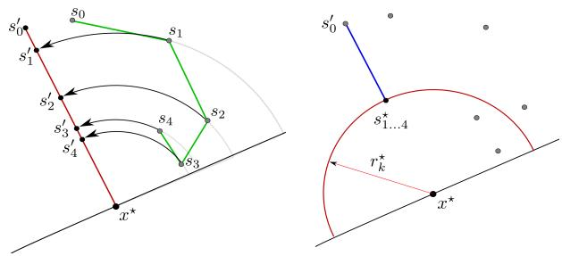  
<!-- PDF_PAGE: 015 -->

Figure 7: An illustration of the sequence $S ^ { \prime }$ . An arbitrary trajectory (left) is lower-bounded by a wellstructured trajectory $S ^ { \prime }$ (right), according to Lemmas 6 through $^ { 7 . }$

By constraining the final covariance and treating the prior covariance $\Sigma ( 0 )$ as an “observation” of the target state, the information gain from the sequence of measurements described by $\boldsymbol { s }$ is given by Equation 15 as $\Sigma ( k ) ^ { - 1 } = \mathbb { F } ( \mathcal { S } ) + \Sigma ( 0 ) ^ { - 1 }$ Taking the trace of this equation provides the following relationship, where each $\alpha ( i )$ and $r ( i )$ of are unknown.

$$
{ \frac { 1 } { \sigma _ { x } ^ { 2 } ( k ) } } + { \frac { 1 } { \sigma _ { y } ^ { 2 } ( k ) } } = { \frac { 1 } { \sigma _ { x } ^ { 2 } ( 0 ) } } + { \frac { 1 } { \sigma _ { y } ^ { 2 } ( 0 ) } } + \sum _ { i = 1 } ^ { k } { \frac { 1 } { r ^ { 2 } ( i ) \sigma _ { s } ^ { 2 } } } [ \sin ^ { 2 } \alpha ( i ) + \cos ^ { 2 } \alpha ( i ) ]\tag{16}
$$

The trace shows the net information gain about both eigenvalues. By applying the net measurement gain directly to one eigenvalue, we can lower-bound the amount of work required to reduce both eigenvalues. The previous relationship becomes:

$$
\frac { 1 } { \sigma _ { x } ^ { 2 } ( k ) } = \frac { 1 } { \sigma _ { x } ^ { 2 } ( 0 ) } + \sum _ { i = 1 } ^ { k } \frac { 1 } { r ^ { 2 } ( i ) \sigma _ { s } ^ { 2 } }\tag{17}
$$

Note this is equivalent to setting each $\alpha ( i )$ to $\frac { \pi } { 2 }$ as shown in Figure $7 \ ( \mathrm { l e f t } )$ The resulting straight-line trajectory is labelled $S ^ { \prime }$ . Now we can explore the structure given by $S ^ { \prime }$

The next lemma shows that $S ^ { \prime }$ can be structured such all measurements are taken from the same location without decreasing the information gain given by Equation 17.

Lemma 6. The sequence $S ^ { \prime }$ takes all measurements from one location.

Proof. To find a contradiction, assume not: that $S ^ { \prime }$ contains measurements from more than one location. Then the sequence $S ^ { \prime }$ takes a measurement from ranges various ranges, each given as $r ( i )$ Let $r _ { m i n }$ be the minimum of all these ranges. The information gain (Equation 17) will be $\begin{array} { r } { \frac { 1 } { r ^ { 2 } ( i ) } \le \frac { 1 } { r _ { m i n } ^ { 2 } } } \end{array}$ . Since the sequence already pays to travel to $r _ { m i n }$ , the closest position, we could move all measurements to the closest location $\left( \mathrm { a t } ~ r _ { m i n } \right)$ without incurring extra cost, but gaining extra information. This contradicts the assumption that $S ^ { \prime }$ is optimal. □

Lemma 7. Assume the sequence $S ^ { \prime }$ takes $k ^ { \star }$ measurements. Then the optimal range from $x ^ { \star }$ for taking all measurements is given $b y _ { ; }$

$$
r _ { o p t } = \sqrt { k ^ { \star } } \cdot \frac { \sigma _ { x } ( 0 ) } { \sigma _ { s } } \sqrt { \frac { \gamma ^ { 2 } } { 1 - \gamma ^ { 2 } } }
$$

incurring a total time cost $o f ,$

$$
T ( \mathcal S ^ { \prime } ) = k ^ { \star } \cdot t _ { m } + r ^ { \star } - \sqrt k \cdot \frac { \sigma _ { x } ( 0 ) } { \sigma _ { s } } \sqrt { \frac { \gamma ^ { 2 } } { 1 - \gamma ^ { 2 } } }\tag{18}
$$

where $r ^ { \star }$ is the distance from the starting robot location to $x ^ { \star }$

<!-- PDF_PAGE: 016 -->

Proof. Returning to Equation 17, it is clear that all $r ( i )$ are equal from Lemma 7. Since the trajectory satisfies the objective of reducing uncertainty, $\sigma _ { x } ^ { 2 } ( k )$ is upper-bounded by $\gamma ^ { 2 } \sigma _ { x } ^ { 2 } ( 0 )$ . Substituting this inequality into Equation 17 produces the following relationship.

$$
r ( k ) = \sqrt { k } \frac { \sigma _ { x } ( 0 ) } { \sigma _ { s } } \sqrt { \frac { 1 - \gamma ^ { 2 } } { \gamma ^ { 2 } } }\tag{19}
$$

By assuming $k = k ^ { \star }$ , the result follows.

The result of the previous lemmas is the trajectory shown in Figure $7 \ \mathrm { ( r i g h t ) }$ Notice that the range $r _ { o p t }$ is proportional to the square root of the number of measurements taken. Since $k \geq 1$ it is tempting to simply lower-bound the time requirement by substituting $k = 1$ into Equation 18. However, this would unfairly restrict the optimal strategy to travel to a position from which a single measurement would be sufficient. Instead, we must find the trade-off between $r _ { o p t }$ and k as a function of the system parameters, $t _ { m } , \gamma .$ , and $\sigma _ { x } ( 0 )$ , which determine the optimal number of measurements.

Theorem 2. Let $S _ { O F F } ^ { \star }$ be the optimal offline, bearing-only (not-necessarily-ambiguous) measurement sequence. $I f S _ { O F F } ^ { \star }$ requires $T ( S _ { O F F } ^ { \star } )$ time to reduce $\sigma _ { x }$ and $\sigma _ { y }$ by the constant $\gamma _ { \mathrm { { ; } } }$ when centered at the true target location, then $T ( S ^ { \prime } )$ is a lower bound on $T ( S _ { O F F } ^ { \star } )$ as follows:

$$
T ( \mathcal { S } _ { O F F } ^ { \star } ) \geq T ( \mathcal { S } ^ { \prime } ) = \operatorname* { m a x } \left[ r ^ { \star } - \frac { \sigma ^ { 2 } ( 0 ) } { 2 \cdot t _ { m } \sigma _ { s } ^ { 2 } } \left( \frac { \gamma ^ { 2 } } { 1 - \gamma ^ { 2 } } \right) , 0 \right] + t _ { m }
$$

Proof. Notice Equation 18 is a function of $k ,$ the unknown number of measurements, and the known problem parameters, $\gamma , \sigma _ { x } ( 0 )$ , and $\sigma _ { s }$ . Let $\sigma _ { 0 } ^ { 2 }$ be the larger of the two eigenvalues of Σ(0). We can minimize the cost with respect to k. Taking the derivative of Equation (18) and setting equal to zero yields,

$$
k = \frac { \sigma ^ { 2 } ( 0 ) } { 4 t _ { m } ^ { 2 } \sigma _ { s } ^ { 2 } } \left( \frac { \gamma ^ { 2 } } { 1 - \gamma ^ { 2 } } \right)\tag{20}
$$

Substituting this results in a distance traveled of

$$
D ( S ^ { \prime } ) = r ^ { \star } - \frac { \sigma ^ { 2 } ( 0 ) } { 2 \cdot t _ { m } \sigma _ { s } ^ { 2 } } \left( \frac { \gamma ^ { 2 } } { 1 - \gamma ^ { 2 } } \right)
$$

Now observe that in general the starting range to the true target may be less than $r ^ { \star }$ , requiring no movement.   
Then from the optimal location, take $k \geq 1$ measurements to find the desired result.

The closed-form expression for k in Equation 20 follows intuition: As the prior uncertainty $( \sigma ( 0 ) ^ { 2 } )$ increases, more measurements are required. As the measurement time $t _ { m }$ increases, the optimal strategy reduces k (and subsequently moves closer). As the sensor noise $\sigma _ { s }$ increases, the optimal strategy takes fewer measurements from closer positions. Based on this lower bound, we compare the cost of our proposed algorithm with that of an optimal offline algorithm.

## 8.2 Comparison with the β-Cautious Strategy

In this section we show that the proposed algorithm produces a measurement sequence which is, on average, within a constant factor of the optimal offline cost. In what follows, it is convenient to make use of the

<!-- PDF_PAGE: 017 -->

following constants.

$$
{ \begin{array} { r l r } & { N = 4 \log _ { \left( { \frac { \sigma _ { \beta } ^ { 2 } } { \sigma _ { s } ^ { 2 } } } \right) } \left( { \frac { 1 } { \gamma } } \right) } & { \qquad { \mathrm { ( L e m m a ~ 3 ) } } } \\ & { C _ { d i s t } = \left( { \frac { { \sqrt { 2 } } } { \sqrt { \sigma _ { \beta } ^ { 2 } - \sigma _ { s } ^ { 2 } } } } + { \frac { \pi { \sqrt { \sigma _ { \beta } ^ { 2 } - \sigma _ { s } ^ { 2 } } } } { \sigma _ { \beta } ^ { 2 } } } \right) \cdot \left[ { \frac { 1 - { \sqrt { \gamma } } } { 1 - { \frac { \sigma _ { s } } { \sigma _ { \beta } } } } } \right] \qquad } & { \qquad { \mathrm { ( T h e o r e m ~ 1 ) } } } \\ & { C _ { 3 } = { \frac { 1 } { 2 \sigma _ { s } ^ { 2 } t _ { m } } } { \frac { \gamma ^ { 2 } } { 1 - \gamma ^ { 2 } } } \qquad } & { \qquad { \mathrm { ( T h e o r e m ~ 2 ) } } } \end{array} }
$$

We consider the case when the hypothesis is not very close to the starting location of the robot, given by $\hat { r } ( 0 ) > C _ { 3 } \sigma ( 0 ) ^ { 2 }$ This assumption is not too restrictive. For example in our application $C _ { 3 } \approx 6 \times 1 0 ^ { - 4 }$ since $\begin{array} { r } { t _ { m } \approx 1 2 0 , \sigma _ { s } \approx \frac { \pi } { 1 2 } } \end{array}$ , and $\gamma \approx . 1$ (as stated in Section 10). In field trials, $\hat { r } ( 0 ) \approx \sigma ( 0 ) \approx 1 0 0 m$ In subsequent analysis we also use ${ \hat { r } } ( 0 )$ instead of $| | s ( 0 ) - s ( 1 ) | |$ in the upper-bound, since the range to the hypothesis is always greater than the distance between the starting location and the first measurement.

The robot begins with an estimate of $x ^ { \star }$ as ${ \hat { x } } ,$ , a two-dimensional Gaussian, but the optimal offline algorithm has access to $x ^ { \star }$ Thus, a direct comparison of the two could produce arbitrarily bad results. One such example is $x ^ { \star } \approx s ( 0 )$ and $\hat { r } ( 0 ) \to \infty ;$ the β-Cautious strategy travels toward the hypothesis, while the offline algorithm does not. However, such cases occur with very small probability and it is reasonable to expect that on average the costs will be similar. Therefore we take a weighted average (expectation) over possible configurations of the robot and true target, conditioned on the prior hypothesis.

As before, let $T ( S )$ be the time cost of a sequence as given by Equation 1. Let the true target location be $x ^ { \star }$ Given the β-Cautious measurement sequence, $S _ { \beta }$ with cost $T ( S _ { \beta } ( x ^ { \star } ) )$ , we would like to compare to the unknown optimal solution, $S _ { O F F } ^ { \star }$ with cost $T ( S _ { O F F } ^ { \star } ( x ^ { \star } ) )$ . We will define the expected performance ratio as $\frac { \mathbb { E } _ { x ^ { \star } } [ T ( S _ { \beta } ( x ^ { \star } ) ) ] } { \mathbb { E } _ { x ^ { \star } } [ T ( S _ { O F F } ^ { \star } ( x ^ { \star } ) ) ] }$ . We derive a bound next.

Theorem 3. Let $x ^ { \star }$ be the true target location given a prior estimate $\mathcal { N } ( \hat { x } ( 0 ) , \Sigma ( 0 ) )$ . Let $\hat { r } ( 0 ) > C _ { 3 } \sigma ( 0 ) ^ { 2 }$ and $\hat { r } ( 0 ) > | | s ( 0 ) - s ( 1 ) |$ . In expectation over $x ^ { \star }$ , the time taken by the β-Cautious algorithm is less than a constant times the optimal algorithm:

$$
\frac { \mathbb { E } _ { x ^ { \star } } [ T ( S _ { \beta } ( x ^ { \star } ) ) ] } { \mathbb { E } _ { x ^ { \star } } [ T ( S _ { O F F } ^ { \star } ( x ^ { \star } ) ) ] } \leq C
$$

with

$$
C = \frac { N \cdot t _ { m } + C _ { d i s t } \sigma ( 0 ) + \hat { r } ( 0 ) } { t _ { m } + \hat { r } ( 0 ) - C _ { 3 } \sigma ( 0 ) ^ { 2 } }\tag{21}
$$

Proof. Since $T ( S ^ { \prime } ) \le T ( S _ { O F F } ^ { \star } )$ (Theorem 2), and $S ^ { \prime }$ does not change as a function of $\mathcal { Z }$ it suffices to show that

$$
\frac { \mathbb { E } _ { x ^ { \star } } [ T ( S _ { \beta } ( x ^ { \star } ) ) ] } { \mathbb { E } _ { x ^ { \star } } [ T ( S ^ { \prime } ( x ^ { \star } ) ) ] } = \frac { \mathbb { E } _ { x ^ { \star } } [ N \cdot t _ { m } + C _ { d i s t } \sigma ( 0 ) + | | s ( 0 ) - s ( 1 ) | | ] } { \mathbb { E } _ { x ^ { \star } } [ \operatorname* { m a x } ( r ^ { \star } ( 0 ) - C _ { 3 } \sigma ( 0 ) ^ { 2 } , 0 ) + t _ { m } ] } \leq C\tag{22}
$$

where C does not depend on $x ^ { \star }$

To establish a constant bound, we would like to remove all variables which involve the true target location (a random variable), or the measurement values. Note that the upper-bound established in Theorem 1 is not a function of the true target location. It remains to find the lower expected bounds.

Observe that the denominator contains the maximum of two convex functions, which is a convex function. Since the norm $r ^ { \star } ( 0 ) = | | \boldsymbol { s } ( 0 ) - \boldsymbol { x } ^ { \star } | |$ is a convex function, the mean distance to the target is less than the

<!-- PDF_PAGE: 018 -->

distance to the mean of the prior. Finally, by Jensen’s inequality, $\mathbb { E } [ f ( x ) ] \geq f ( \mathbb { E } [ x ] )$ if the function $f ( x )$ is convex. Since we again consider the case of $\hat { r } ( 0 ) > C _ { 3 } \sigma ( 0 ) ^ { 2 }$ , this provides a lower bound as

$$
\mathrm { E q u a t i o n ~ } 2 2 \leq \frac { N \cdot t _ { m } + C _ { d i s t } \sigma ( 0 ) + \hat { r } ( 0 ) } { \mathbb { E } _ { x ^ { \star } } [ r ^ { \star } ( 0 ) - C _ { 3 } \sigma ( 0 ) ^ { 2 } ] + \mathbb { E } _ { x ^ { \star } } [ t _ { m } ] } \leq \frac { N \cdot t _ { m } + C _ { d i s t } \sigma ( 0 ) + \hat { r } ( 0 ) } { t _ { m } + \hat { r } ( 0 ) - C _ { 3 } \sigma ( 0 ) ^ { 2 } }
$$

In expectation over the true target location and measurement noise, the β-Cautious costs only a constant factor more than the optimal algorithm which knows the true target location. □

## 8.3 Worst-Case Online Cost

We now consider the case of an optimal algorithm operating without the access to the true target location. Such an algorithm executes with the same restrictions as the β-Cautious algorithm: it begins with a prior estimate and must react to the value of each measurement $\mathrm { i . e . }$ , iteratively update the hypothesis using EKF and plan measurement locations. As before, we assume the measurement sequence $\mathcal { Z }$ is chosen by an independent adversary, similar to the analysis in Section 7, and present a lower bound on the cost of an optimal online algorithm in the worst-case.

As seen in Section 7, the hypothesis may shift as a result of a measurement. To connect this result to the previous theorem, we first show there always exists a measurement sequence in which the hypothesis does not shift.

Lemma 8. $I f s ( i )$ is the sensing location from where the $i ^ { t h }$ measurement is obtained and $\mathcal { N } ( \hat { x } ( i - 1 ) , \Sigma ( i - 1 ) )$ is the prior target hypothesis, then there exists a measurement $z ( i )$ such that

$$
| | \hat { x } ( i - 1 ) - s ( i ) | | = | | \hat { x } ( i ) - s ( i ) | |
$$

where $\mathcal { N } ( \hat { x } ( i ) , \Sigma ( i ) )$ is the posterior target hypothesis obtained using EKF update.

Proof. The proof follows directly from the EKF update equations given in Equation 2 when the residual is zero $( \mathrm { i . e . , } y ( i ) = 0 )$ □

The above lemma suggests that for every instance, any algorithm, including the online optimal algorithm, can receive a valid set of measurements where the mean of the hypothesis does not change with the EKF update (the covariance, however, changes). If the adversary can increase the cost by choosing other measurements, then Equation 23 is a lower-bound on the worst case cost. Otherwise, it is exactly the worst-case cost.

Theorem 4. Let $S _ { O N L } ^ { \star }$ be the optimal online, bearing-only (not-necessarily-ambiguous) measurement sequence. Let $S _ { O N L } ^ { \star }$ require time $T ( S _ { O N L } ^ { \star } ( \mathcal { Z } ) )$ to reduce $\sigma _ { x }$ and $\sigma _ { y }$ by the constant $\gamma$ using EKF updates. Then $T ( S ^ { \prime } )$ is also a lower bound on the maximum time required by $S _ { O N L } ^ { \star }$ as follows.

$$
\operatorname* { m a x } _ { \mathcal { Z } } T ( S _ { O N L } ^ { \star } ( \mathcal { Z } ) ) \geq T ( S ^ { \prime } ) = \operatorname* { m a x } \left[ \hat { r } ( 0 ) - \frac { \sigma ^ { 2 } ( 0 ) } { 2 \cdot t _ { m } \sigma _ { s } ^ { 2 } } \left( \frac { \gamma ^ { 2 } } { 1 - \gamma ^ { 2 } } \right) , 0 \right] + t _ { m }\tag{23}
$$

Proof. First, by Lemma $^ { 8 , }$ there exists a measurement sequence such that the hypothesis does not shift position. In this case, we are examining the case of a measurement sequence gathering information about a fixed point, ˆx(0). Then the covariance after all measurements are collected is exactly the same form as that of the FIM, given in Equation 15. The full analysis is similar to that of Theorem 2. However, in this case, substitute ${ \hat { x } } ( 0 )$ for $x ^ { \star }$ to arrive at the desired value for $T ( S ^ { \prime } )$ □

The presented bound is similar to Theorem 2, except the dependence is on initial hypothesis $\hat { r } ( 0 )$ instead of the true target location $x ^ { \star }$ . The sequence ${ \mathcal { S } } ^ { \prime } .$ , when executed with respect to the true target location, defines a global minimum cost for any algorithm. When executed with respect to the prior hypothesis, it defines a lower-bound on the time taken by any online algorithm which uses an EKF or similar estimators.

## <!-- PDF_PAGE: 019 -->

8.4 Comparison of Worst Case Online Performance

In this section we define the performance ratio as the ratio of the worst-case execution times of two measurement sequences. Using the result of Section 7 and the previous section, we show that the performance ratio of the β-Cautious Strategy and any other online strategy is bounded above by a constant.

Theorem 5. Given a prior estimate of a target location $\sim \mathcal { N } ( \hat { x } ( 0 ) , \Sigma ( 0 ) )$ , let be the measurements received by an active localization algorithm. Let ${ \hat { r } } ( 0 ) > C _ { 3 } \sigma ( 0 ) ^ { 2 }$ and $\hat { r } ( 0 ) > | | s ( 0 ) - s ( 1 ) | |$ For any true target location, the time taken by the β-Cautious algorithm for any system parameters $\beta , t _ { m } , \gamma .$ , and $\sigma _ { s }$ is less than a constant times worst-case cost of the optimal online algorithm employing an EKF. Furthermore, for our known system values, the time required by the β-Cautious algorithm satisfies,

$$
\frac { \operatorname* { m a x } _ { \mathcal { Z } } ~ T ( S _ { \beta } ( \mathcal { Z } ) ) } { \operatorname* { m a x } _ { \mathcal { Z } } ~ T ( S _ { O N L } ^ { \star } ( \mathcal { Z } ) ) } \le 5 . 4 3 9\tag{24}
$$

Proof. maxZ $T ( S _ { \beta } ( { \mathcal { Z } } ) )$ was presented in closed form in Theorem 1, where we again let ${ \hat { r } } ( 0 ) > | | s ( 0 ) - s ( 1 ) | |$ Since $S ^ { \prime }$ is a lower bound on the worst case online algorithm, as shown in Theorem 4, we have that $T ( S ^ { \prime } ) \leq$ max $T ( S _ { O N L } ^ { \star } ( \mathcal { Z } ) )$ . Then it suffices to show that

$$
\frac { \operatorname* { m a x } _ { \boldsymbol { z } } ~ T ( S _ { \beta } ( \boldsymbol { \mathcal { Z } } ) ) } { \operatorname* { m a x } _ { \boldsymbol { z } } ~ T ( S _ { O N L } ^ { \star } ( \boldsymbol { \mathcal { Z } } ) ) } \leq \frac { N \cdot t _ { m } + C _ { d i s t } \sigma ( 0 ) + \hat { r } ( 0 ) } { \hat { r } ( 0 ) - C _ { 3 } \sigma ( 0 ) ^ { 2 } + t _ { m } } \leq 5 . 4 3 9\tag{25}
$$

The values for the remainder of the terms $( \sigma _ { s } , \gamma$ , and $t _ { m } )$ which determine N, $C _ { 3 }$ and $C _ { d i s t }$ will be constant, but depend on the specific system used. We use the known system values from Section 10, initial hypothesis uncertainty and range from Section 6.2, and $\beta = . 1$ . For reference, $\begin{array} { r } { \hat { r } ( 0 ) \approx \sigma ( 0 ) \approx 1 0 0 , t _ { m } \approx 1 2 0 , \sigma _ { s } \approx \frac { \pi } { 1 2 } , } \end{array}$ and $\gamma \approx . 1$

The results presented in Theorem 3 show the β-Cautious algorithm is within a constant of the optimal offline strategy on average. Theorem 5 shows that no other algorithm will have a significantly lower worst case performance. However, the constants established in Equation 21 and Equation 24 still depend on system noise, measurement time, and other non-random factors. In the next section, we evaluate the effect of these parameters on the comparisons in simulation.

## 9 Simulations

In this section we conduct numerical studies of the main results presented. First studied is the effect of Lemma 1 which shows that the $\beta \mathrm { . }$ -Cautious Strategy chooses measurement locations to minimize the effect of keeping only a single hypothesis. Second, we illustrate the upper-bound presented in Theorem 1 as a function of the system parameters and starting conditions. Finally, we illustrate Theorem 2 and Theorem 3 to show how the performance ratio (time required divided by optimal time) changes with the starting conditions.

Our simulated setup was as follows. The β-Cautious Strategy was implemented as described in Section 6. An initial hypothesis was given as $\hat { x } ( 0 ) \sim \mathcal { N } ( \mathbf { 0 } _ { 2 \times 1 } , \sigma ^ { 2 } ( 0 ) \cdot \mathbf { I } _ { 2 \times 2 } )$ , with $\sigma ( 0 ) = 1 0 0$ . The sensor is initially placed 220 meters away from ${ \hat { x } } ,$ measurement time was assumed to be 120, and sensor noise $\sigma _ { s }$ was set to 15 degrees. The true target location, $x ^ { \star }$ , was repeatedly drawn with replacement from the prior for $N = 1 0 0 0$ trials. For each such $x ^ { \star }$ , the algorithm was run, and all measurement locations and values were recorded. Some of the parameters were individually varied to illustrate their effect, as shown in Table 1. As discussed in Section 10, these parameters closely match our field implementation.

The first results (Figures 8 and 9) evaluate the assertions of Section 5, namely that by carefully choosing measurement locations for an EKF, we can closely approximate the bi-modal measurement PDF. For this evaluation, we compared the performance of the β-Cautious Strategy with a multiple hypotheses filter. There are two predominant alternative methods for producing a target estimate from multiple hypotheses, both of which we implemented for comparison. First, the output could be the most likely of the hypotheses (the target estimate, ${ \hat { x } } _ { i }$ with highest $p ( \hat { x } _ { i } | Z )$ , for measurement sequence $Z )$ . A multiple hypothesis Extended Kalman Filter (MH-EKF) [Reid, 1979] captures this approach. Another interpretation of the hypotheses is available through a Gaussian Sum Filter (GSF, proposed in [Alspach and Sorenson, 1972], but also realized in Interacting Mixture Model-based filters [Bar-Shalom and Tse, 1975, Bar-Shalom et al., 2001]). Using the GSF and similar methods, the output is the weighted average of all hypotheses. In both cases, we did not implement measurement gating or hypothesis merging, since these are alternative methods of truncating the PDF (see [Reid, 1979,Blackman, 2004,Cox and Hingorani, 1996]), and instead maintained all the hypotheses for comparison.

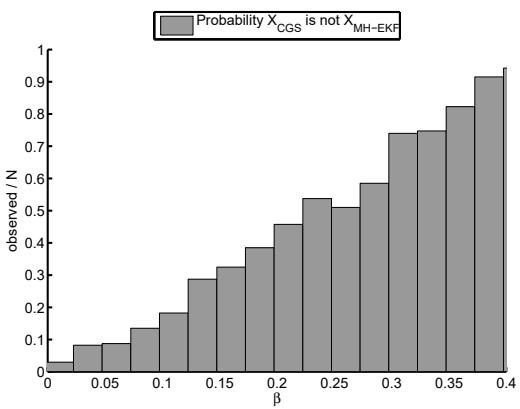  
(a)

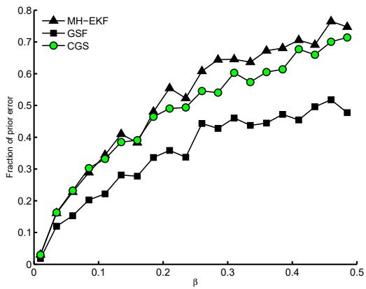  
(b)  
<!-- PDF_PAGE: 020 -->

Figure 8: (a) The observed probability that the MH-EKF tracks a different hypothesis than the $\beta -$ Cautious Strategy. Note that for small $\beta ,$ the $\beta \mathrm { . }$ -Cautious strategy causes the EKF to track the correct hypothesis more often. (b) The normalized error of the final estimate $( | | \hat { x } ( n ) - x ^ { \star } | | / | | \hat { x } ( 0 ) - x ^ { \star } | | )$ as a function of the $\beta$ parameter. The median error is shown for the Gaussian Sum Filter, MH-EKF, and β-Cautious Strategy using an EKF. Note that increasing $\beta$ results in more error, but at less cost as shown in Figure 10.

Table 1: Simulation Parameters
<table><tr><td></td><td>Range  $( r ( 0 ) )$ </td><td>Measurement Time  $\left( t _ { m } \right)$ </td><td>Desired Precision (C)</td><td> $\beta$ </td></tr><tr><td>Value</td><td>220 meters</td><td>120 sec</td><td>.1</td><td>.1</td></tr><tr><td>Evaluated in</td><td>Fig 11(a)</td><td>Fig 11(d)</td><td> $\mathrm { F i g 1 0 ( a ) , 1 0 ( b ) , 1 0 ( c ) , 1 1 ( c ) }$ </td><td>Fig 10(d),11(b)</td></tr></table>

As implied by Lemma 1, we expect that decreasing $\beta$ would reduce the necessity for tracking multiple hypotheses. This can be checked by verifying that a multiple-hypotheses filter does not produce significantly different output when $\beta$ is small. The β-Cautious Strategy was run as designed (using an EKF to estimate the target state). Depending on the specific setting for $\beta ,$ the algorithm chose an adaptive sequence of measurement locations, of length $k \in [ 4 , 1 2 ]$ Using the measurement locations and values, the set of $2 ^ { k }$ hypotheses was then created using Eq. (7) (during execution the algorithm did not have access to these other hypotheses). The $2 ^ { k }$ individual hypotheses correspond to all combinations of “forward” or “backward” measurements for each measurement location. The β-Cautious Strategy, by employing an EKF, tracks one of the $2 ^ { k }$ hypotheses directly—corresponding to all “forward” measurements—and discards the rest. Conversely, the MH-EKF will evaluate all the hypotheses, and output highest weighted hypothesis as the target estimate. According to Lemma 1, we would expect that small $\beta$ would correspond to similar output between both algorithms. In Figure 8(a), we plot the observed probability that the $\beta \mathrm { . }$ Cautious Strategy tracks a hypothesis different from the MH-EKF as a function of β. We see that for small values of $\beta ,$ this occurs with very small probability. Also shown is the output of an EKF which has the correct, un-ambiguous bearings as input. As expected, with small $\beta ,$ the un-ambiguous EKF has nearly identical output. These observations confirm the idea that $\beta$ captures the risk from ambiguous measurements, i.e., of tracking the “wrong” hypothesis.

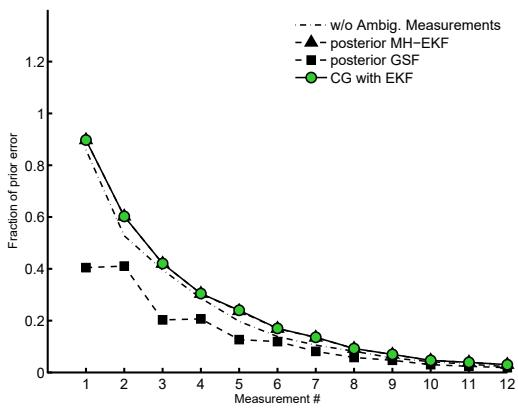  
<!-- PDF_PAGE: 021 -->

(a) $\beta = . 0 1$

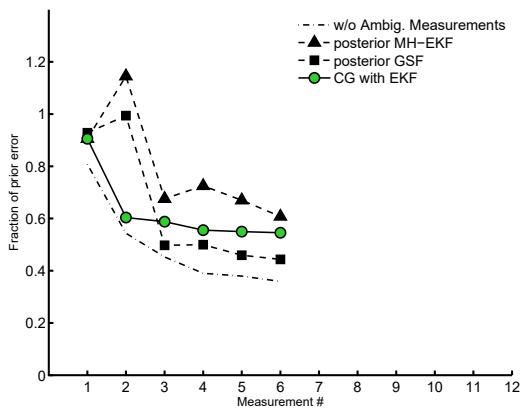  
(b) $\beta = . 2 6$  
Figure 9: Two examples of the effect of the parameter $\beta ,$ comparing the difference in final estimates using an EKF, MH-EKF, and Gaussian Sum Filter. Shown is the median error over 1000 trials, after each measurement, for all three filters, as well as an “omniscient” EKF which was given the correct, un-ambiguous measurements. (a) With $\beta = . 0 1$ , we notice agreement and small final error. (b) With $\beta > . 2 .$ , we notice reduced performance in all filters. These observations suggest that the measurement locations corresponding to low values of $\beta$ are useful for mitigating the effect of ambiguous measurements, as suggested by Lemma 1.

Another meaningful comparison is the error of the final estimates using all three methods (GSF, MH-EKF, and β-Cautious ), which is presented in Figure 8(b) and Figure 9. In all simulations, the final covariance was equal, but the error of the estimate was observed to vary with $\beta .$ Figure 8(b) shows the median error of the final estimate for $\beta \in [ . 0 1 , . 4 5 ]$ Note that increasing the caution requirement $( \beta \to 0 )$ , produces less error in the estimate of the target location, even though the covariance does not change. Interestingly all filter output was less accurate as $\beta$ increased, suggesting that the β-Cautious measurement locations are valuable for other filtering techniques, not just the EKF. Figure 9 shows the error after each measurement, for two values of $\beta$ and all three filtering techniques. In Figure 9(b), the median decrease (posterior error over prior error) was 40% at best, while it was less than 3% in Figure 9(a).

As shown in Section $^ { 7 , }$ the parameter $\beta$ has a significant effect on the time required to localize the target, but so do the other system parameters and starting conditions. The focus of the next simulations is to evaluate the effect of these parameters on the maximum time required to localize a target. For each different simulation, one parameter was varied (see Table 1). Equation 13 is plotted, along with the aggregate observed values for the time to localize the target. In all cases, the theoretical bounds held as shown in Figure 10.

The final simulations (Figure 11), examine the relationship between the β-Cautious strategy and the optimal algorithm. The distance traveled and number of measurements required was recorded. Shown is the theoretical constant, derived in Section 8.2. Below this is the mean observed time $T ( S _ { \beta } )$ divided by the mean of the lower bound on the optimal time, $T _ { S ^ { \prime } }$ from Equation (23).

From these trials, and the theoretical results already presented, we conclude that the $\beta$ parameter captures a trade off between the accuracy of the final estimate and the time spent localizing a target. Small $\beta$ leads to better accuracy for all filters examined, at the cost of increased time spent traveling and taking measurements. Crucially, it was observed that using an Extended Kalman Filter is sufficient to produce final estimates which are consistent and accurate, for small values of $\beta$

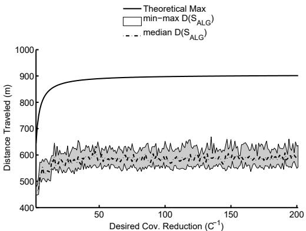  
<!-- PDF_PAGE: 022 -->

(a) Distance $( D ( S _ { \beta } ) )$ $\mathrm { v s } \ \gamma ^ { - 1 }$

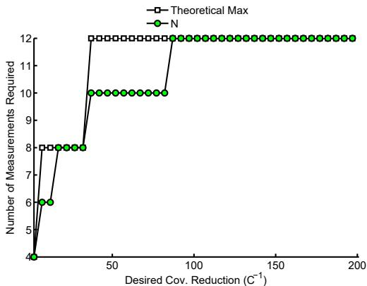  
(b) # Maximum Measurements vs $\gamma ^ { - 1 }$

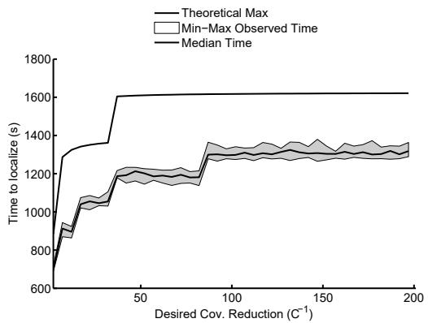  
(c) Maximum Time $( T ( S _ { \beta } ) )$ vs $\gamma ^ { - 1 }$

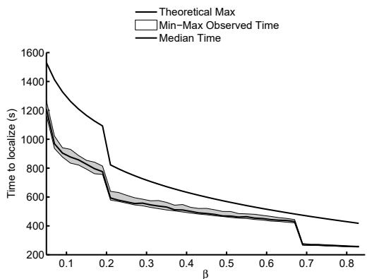  
(d) Maximum Time $( T ( S _ { \beta } ) )$ vs $\beta$  
Figure 10: Simulations studies of the possible configurations and the resulting upper bound. We vary the final required uncertainty (γ), and evaluate the costs as shown in Theorem 1. (a) the distance traveled as γ decreases (corresponding to a more precise final estimate). (b) the number of measurements taken. (c) the total execution time as $\gamma$ decreases. In (d), is the tradeoff between increasing the parameter $\beta$ and the resulting time required to localize the target. Note that the target can be localized quicker by increasing risk. The discrete drops in time correspond to removing a measurement from the sequence and the remaining reduction in time is from placing the measurements closer together. Both will cause more error in the final estimate, as shown in Figure 8(b).

The time bound in Theorem 1 was predicated on the use of the EKF, through Lemma 1 (however the results in Section 8.1 apply to any unbiased filter [Van Trees, 1971]). An interesting future result would be to bound the shift in the hypothesis location for other filtering techniques, allowing similar upper bounds to be established when measurements are planned against the corresponding output. In this work, we have observed that when using the β-Cautious Strategy, the EKF performs as good as more “expressive” filters so long as $\beta$ is small, thus allowing a closed-form guarantee of the time required to localize the target. In the next section, we will show that our assumptions and results hold during field deployments.

## 10 Field Experiments

After establishing the upper bound in closed form and in simulation and evaluating the consistency of the algorithm, we deployed our system for field trials. Before presenting the results, we give the details of our field implementation.

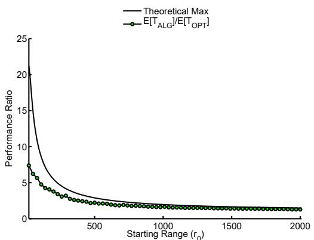  
<!-- PDF_PAGE: 023 -->

(a) Ratio vs ˆr(0)

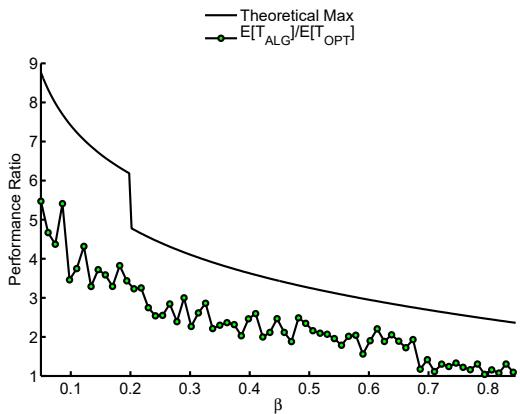  
(b) Ratio vs β

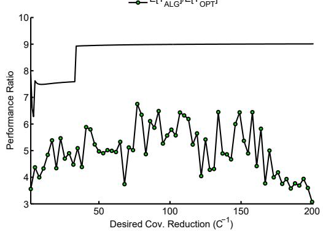  
(c) Ratio vs γ

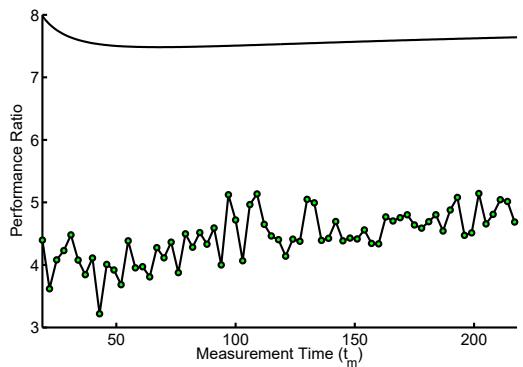  
(d) Ratio vs Measurement time $t _ { m }$  
Figure 11: The theoretical performance ratio (Equation (21)) and observed performance ratio $( \mathbb { E } [ T ( S _ { \beta } ) ] / \mathbb { E } [ T ( S ^ { \prime } ) ] )$ as a function of: (a) the starting range to the hypothesis, ˆr(0), (b) the desired risk (increasing β), and (c) the measurement time (increasing $t _ { m } )$ . Note that in some cases the theoretical bounds are quite loose. This results from our analysis: we provide an upper-bound on the worst case. In practice, the worst-case is rarely if ever encountered.

Our platform, shown in Figure 12, is composed of a mobile robot and directional antenna mounted on a servo motor. Our goal is to provide this system as a drop-in augmentation for humans tracking the radiotagged fish. An on-board laptop computer controls the majority of the high-level planning. Our software architecture is based on the Robot Operating System [ROS, ] and is modular enough to allow us to re-deploy on a robotic boat during the summer months [Tokekar et al., 2013]. The winter-time chassis is a Clearpath Robotics Husky A100. The Husky has a maximum velocity of less than 2m/s. Typically, we operate at 1m/s.

The antenna and an example tag are shown in Figure 12. The radio tags operate in the 48-50 MHz range and emit an uncoded pulse at approximately 1.1 Hz. These transmissions are detectable from approximately 100 meters. Thus, it is possible to determine if a target is nearby simply by sampling a non-zero signal strength indicator.

To find the bearing to the target, we rotate the antenna to find the orientation which corresponds to the maximum signal strength. We typically sample every 15◦. To find a bearing with maximum signal strength which does not lie directly on a sampled orientation, we fit a polynomial to the samples and solve for the bearing of maximum signal strength as shown in [Tokekar et al., 2011]. We have established from field trials that the process of taking a bearing measurement requires approximately 1-2 minutes. We have calibrated the bearing measurements using radio transmitters deployed in known locations, and established that the measurements have approximately a Gaussian error of $\sigma _ { s } \approx 1 5 ^ { \circ }$ . Since the antenna is symmetric, the true bearing is unknown. Instead, the inferred bearing could point towards, or away from the target, as previously discussed.

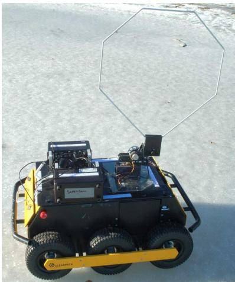  
(a)

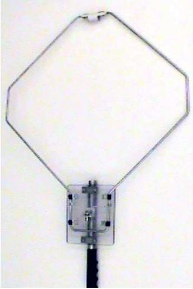  
(b)

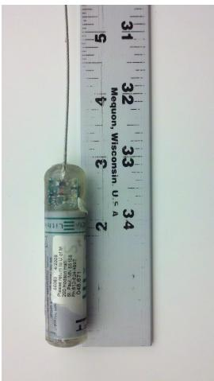  
(c)  
<!-- PDF_PAGE: 024 -->

Figure 12: (a) The robotics platform employed in field tests. Notice the octagonal antenna used to detect nearby radio transmitters, and the servo-motor used to rotate the antenna. The robot has been tested on multiple lakes in Minnesota, USA, including Lakes Gervais, Staring, Keller, and Phalen. (b) The antenna used to gather bearing measurements. The antenna is radially symmetric, producing ambiguous bearing measurements. The antenna is approximately 56cm (22 in) in diameter and is mounted on a servo-motor attached to the robotic chassis. (c) A radio transmitter which is surgically implanted in invasive fish. Each transmitter $\left( \mathrm { o r } \ ^ { 6 } { \cdot } \mathrm { t a g } ^ { 3 } \right)$ has a unique frequency and transmits an uncoded pulse at approximately 1.1 Hz. The tags are nearly 7.5cm (3 in) long.

The total system weighs less than 40kg, and is routinely operated on lakes with only a few inches of ice cover. Battery life is currently limited to 3-4 hours of continuous operation. The robot can be remotely operated, including taking bearing measurements automatically or manually, direct velocity control, or point-to-point navigation. In our field deployments, the robot operated entirely autonomously.

We conducted two types of experiments. In the first set of trials, we evaluated the sensing model and the upper-bound directly. For these experiments, a transmitting radio tag was placed in a field measuring approximately 64 by 70 meters (Figure 13(a)). We provided a prior target estimate for each trial, and evaluated the cost to localize the target to the desired bounds and the accuracy of the final estimate. The second set of trials was used to verify the intended application, including the transition from a search phase to a completed localization, including initializing consistent hypotheses for each nearby target (Figure 13(b) and Figure 14). We present one example from the first set, and two from the second set.

In the first example, shown in Figure 13(a), the input was a starting hypothesis which encompassed the experiment area (2-σ bounds was 70 meters, with a starting error of 30 meters). The goal of these trials was to establish the correctness of the upper-bound, and verify that a small number of measurements is sufficient to localize a static target. Using these starting parameters, and the system data reported in Figure 10, we can derive the expected time using Equation 13. Constructing bearing measurements take less than 2 minutes and the chassis velocity is approximately 1 meter per second $( t _ { m } \approx 1 2 0 )$ ). To achieve a desired final covariance of less than one tenth the original, we expect a travel distance of less than 350 meters, and 4 measurements (based on Equation 13). We found that the experimental results agreed with the theoretical analysis. Specifically, the final covariance was less than 6 meters, one sigma bound, four measurements were required, and the robot traveled less than 70 meters in the given example. The final error of the estimate

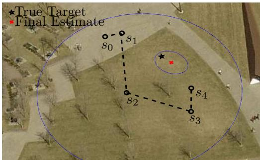  
(a)

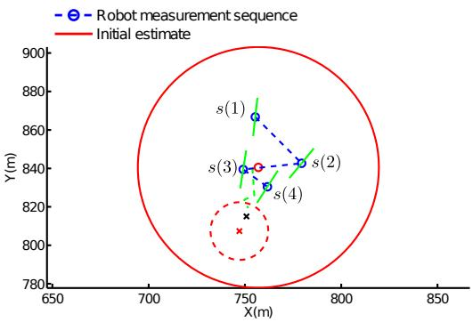  
(b)  
<!-- PDF_PAGE: 025 -->

Figure 13: Two single-target field trials. Parameters were $\sigma _ { \beta } ^ { 2 } = 1$ and $\begin{array} { r } { \sigma _ { s } ^ { 2 } = \left( \frac { \pi } { 8 } \right) ^ { 2 } } \end{array}$ In both cases, the time for the system to localize the target adhered to the theoretical bounds. (a): The 2 σ uncertainty ellipses are shown for the prior and final estimates. The final error was less than 5 meters after only 4 measurements. The total experiment area was approximately 70 meters by 64 meters. (b): At Lake Gervais, MN. USA. With no prior information, the initial estimate was constructed using the routine described in Section 6.2, producing the large red circle shown. The measurement locations narrowed the uncertainty to the final circle given as a dashed line. The true target location is labelled as a black $ { \mathrm { ^ 6 x } } ^ { \prime }$

## was less than 4 meters.

The next experiments (see one example in Figure 13(b) conducted on a frozen lake in Minnesota) were to verify the algorithm and system in the intended operating environment, as well as the initialization procedure described. We deployed radio tags in known locations, and attempted to localize them using no prior estimate. The robot was started from inside the sensing circle of a single tag. The robot constructed an initial estimate using the initialization routine discussed in Section 6.2, then localized the target by choosing measurement locations as shown.

Finally, in Figure 14), we test the full algorithm: from no prior estimates to initialization and localization of two nearby targets. Two tags were deployed and their GPS coordinates recorded. The robot was sent along a path which intersected the sensing radius of one of the tags. From a position from which it could detect the nearby tag (Figure 14(a), with frequency 48341 detected), it first searched for the boundaries of the sensing circle. Then, it returned to the center of this circle and searched for other nearby tags (detecting the sensing circle corresponding to tag 48931 in Figure 14(b)). Finally, it began the iterative process of enumerating candidate measurement locations and taking measurements of either tag. The final measurement locations and the corresponding frequency for each is displayed in Figure 14(c), with the final estimates shown in Figure 14(d) compared with the initial estimates and the recorded GPS locations of the tags. The GPS locations are accurate to within 5 meters.

The final covariance for 48341 had eigenvalues $5 6 \mathrm { m } ^ { 2 }$ and $1 6 8 \mathrm { m } ^ { 2 }$ (corresponding to an error ellipse with radii 7m and 12m), starting from an initial covariance with eigenvalues $\mathrm { 1 3 8 0 m ^ { 2 } }$ . The final covariance for 48931 had eigenvalues $4 9 \mathrm { m } ^ { 2 }$ and $\mathrm { 1 2 7 m ^ { 2 } }$ (radii 7m and 11m), starting from an initial covariance with eigenvalues $\mathrm { 1 7 5 8 m ^ { \bar { 2 } } }$ . The final error for 48341 and 48931 were 27m and 23m respectively.

We found that in all cases in all experiments, the number of measurements matched the predicted upper bounds and the distance traveled was less than the theoretical limit. This leads us to believe that the theoretical bounds are a good prediction of the performance of the system, and produce reliable estimates of the time required to localize one or more nearby targets.

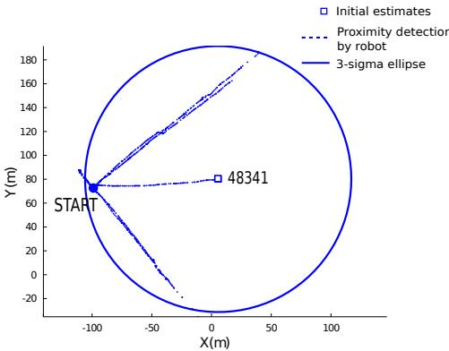  
<!-- PDF_PAGE: 026 -->

(a) First Local Search

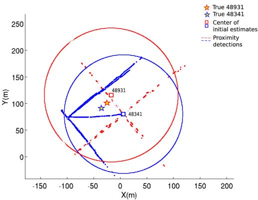  
(b) Aggregation Search

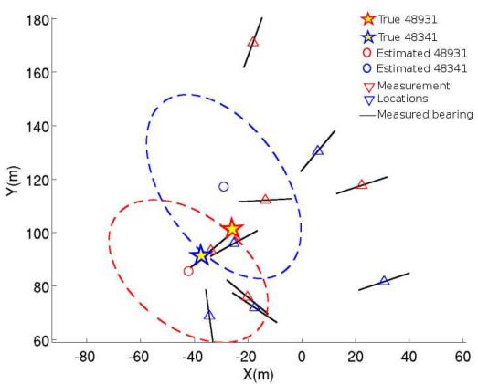  
(c) Measurement Locations for two nearby targets

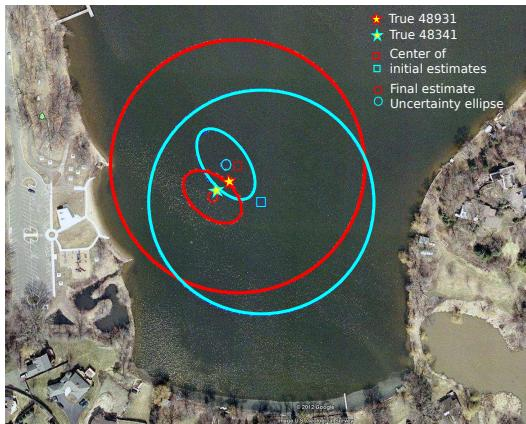  
(d) Final Estimates vs True

Figure 14: A successful experiment demonstrating the localization of two nearby targets concurrently. For this trial no prior information was available. After detecting a nearby target, the algorithm proceeds in three steps: (a), searching for the boundaries of the first detected target, (b), searching for the boundaries of the remaining targets, and (c), using bearing measurements to reduce the uncertainty in the target estimates. (d) The initial and final uncertainty shown on a map. The experiment area was approximately 300 meters across and final error of the estimates was less than 15 meters.

## 11 Conclusion

In this work, we examined the problem of using a mobile robot to locate a radio transmitter. The robot employed a directional antenna and we presented an active localization algorithm suitable for systems which have non-zero measurement time. A novel bearing measurement model was discussed, along with a potential application domain and its challenges. The problem was formulated as a minimum-time, active localization problem with high measurement cost. We showed that, in the case of using RSSI-based bearing measurements, ambiguity can be mitigated by structuring the measurement sequence carefully. The algorithm was analyzed to show an upper bound on the time cost as a function of the system parameters (sensing noise, measurement time, chassis velocity) and tracking objective (initial uncertainty versus final requested uncertainty). The resulting closed form analysis is amenable to engineering trade-offs and comparisons with other bearing-only active localization algorithms.

We also presented the first lower-bound on the optimal cost of bearing-only localization of static targets. The lower-bound will be useful to algorithm and system designers as a base-line comparison. To compare the performance of the β-Cautious algorithm directly to the unknown optimal algorithm, we presented simulations and closed form analysis. We also presented a comparison to the optimal cost of an online, EKFbased algorithm, which allowed us to present a worst-case bound. Thus, we have shown that our presented algorithm is near optimal when used in the application described.

<!-- PDF_PAGE: 027 -->

Finally, we discussed a robust initialization procedure. The combination of initialization and localization ensures a target can be localized in bounded time. In field experiments, a mobile robot was able to locate two transmitting radio tags to within desired uncertainty in predictable, bounded time.

One extension we have identified for these algorithms is to accommodate cooperating robots. A major challenge when designing a field system for cooperative tracking with multiple robots is communication. The communication constraint complicates the optimal algorithm design: When and where should the robots meet to communicate? Does the optimal multi-robot algorithm enforce communication constraints at all or should the robots proceed independently?

Finally, we are working to extend the results to a moving target. In this setting, and unlike many results in active localization, we do not have a clean, closed-form set of motion models to examine. Rather, the target motion is unpredictable and possibly not confined by kinematic models. In the worst case, the target may be adversarial: attempting to flee from the robot.

## Acknowledgments

The authors would like to thank Stergios Roumeliotis for useful discussions and suggestions and Przemek Bajer for providing fish-tracking domain expertise. This work is supported by NSF Awards #1111638, #0916209, #0917676, #0936710.

## References

Robot operating system. Accessed November, 2012.

Alspach, D. and Sorenson, H. (1972). Nonlinear bayesian estimation using gaussian sum approximations. IEEE Transactions on Automatic Control, 17(4).

Bar-Shalom, Y., Li, X.-R., and Kirubarajan, T. (2001). Estimation with Applications to Tracking and Navigation. John Wiley & Sons, Inc., New York, USA.

Bar-Shalom, Y. and Tse, E. (1975). Tracking in a cluttered environment with probabalistic data association. Automatica, 11:451—460.

Bishop, A. and Pathirana, P. (2008). Optimal trajectories for homing navigation with bearing measurements. In Proceedings of the 2008 International Federation of Automatic Control Congress.

Blackman, S. (2004). Multiple hypothesis tracking for multiple target tracking. IEEE AE Systems Magazine, 19(1).

Bopardikar, S. D. (2010). Pursuit Strategies for Autonomous Vehicles. PhD thesis, University of California, Santa Barbara.

Borri, A., Bopardikar, S. D., Hespanha, J., and Di Benedetto, M. D. (2011). Hide-and-seek with directional sensing. In World Congress, volume 18, pages 9343–9348.

Cox, I. and Hingorani, S. (1996). An efficient implementation of reid’s multiple hypothesis tracking algorithm and its evaluation for the purpose of visual tracking. IEEE Transactions on Pattern Analysis and Machine Intelligence, 18(2).

Derenick, J., Fink, J., and Kumar, V. (2011). Localization Using Ambiguous Bearings from Radio Signal Strength. In Proc. IEEE/RSJ International Conference on Intelligent Robots and Systems. IEEE.

<!-- PDF_PAGE: 028 -->

Forney, C., Manii, E., Farris, M., Moline, M., and Lowe, C. (2012). Tracking of a Tagged Leopard Shark with an AUV: Sensor Calibration and State Estimation. In International Conference on Robotics and Automation, pages 5315–5321.

Frew, E. (2009). Providing quality of service of information through mobility. In Proceedings of the American Control Conference, pages 2160–2165.

Frew, E. W. (2003). Observer Trajectory Generation for Target-Motion Estimation Using Monocular Vision. PhD thesis, Stanford University.

Hammel, S. E., Liu, P. T., Hilliard, E. J., and Gong, K. F. (1989). Optimal observer motion for localization with bearing measurements. Computers and Mathematics with Applications, 18(1-3):171 – 180.

Hoffmann, G. and Tomlin, C. (2010). Mobile sensor network control using mutual information methods and particle filters. IEEE Transactions on Control, pages 1–16.

Li, X. R. and Jilkov, V. P. (2001). Survey of maneuvering target tracking: III. Measurement models. Proceedings of SPIE, 4473(August):423–446.

Li, X. R. and Jilkov, V. P. (2003). Survey of maneuvering target tracking: I: dynamic models. IEEE Transactions on Aerospace and Electronic Systems, 39(4):1333–1364.

Li, X. R. and Jilkov, V. P. (2005). Survey of maneuvering target tracking: V: multiple-model methods. IEEE Transactions on Aerospace and Electronic Systems, 41(4):1255–1321.

Martinez, S. and Bullo, F. (2006). Optimal sensor placement and motion coordination for target tracking. Automatica, 42(4):661–668.

Merino, L., Caballero, F., and Ollero, A. (2010). Active sensing for range-only mapping using multiple hypothesis. In Intelligent Robots and Systems (IROS), 2010 IEEE/RSJ International Conference on, pages 37–42. IEEE.

Morbidi, F. and Mariottini, G. L. (2012). Active target tracking and cooperative localization for teams of aerial vehicles. Control Systems Technology, IEEE Transactions on, PP(99):1–1.

Pukelsheim, F. (2006). Optimal Design of Experiments. Classics in Applied Mathematics. Society for Industrial and Applied Mathematics.

Reid, D. (1979). An algorithm for tracking multiple targets. IEEE Transactions on Automatic Control, ac-24(6).

Scerri, P., Glinton, R., Owens, S., Scerri, D., and Sycara, K. (2007). Geolocation of rf emitters by many uavs. In AIAA Infotech@Aerospace 2007 Conference and Exhibit.

Song, D., Kim, C., and Yi, J. (2012). Simultaneous localization of multiple unknown and transient radio sources using a mobile robot. IEEE Transactions on Robotics, 28(3):668–680.

Song, D., Member, S., Kim, C.-y., and Yi, J. (2011). On the Time to Search for an Intermittent Signal Source Under a Limited Sensing Range. Robotics, IEEE Transactions on, 27(2):313–323.

Thrun, S., Burgard, W., Fox, D., et al. (2005). Probabilistic robotics, volume 1. MIT press Cambridge, MA.

Tokekar, P., Branson, E., Vander Hook, J., and Isler, V. (2013). Coverage and Active Localization for Monitoring Invasive Fish with an Autonomous Boat. IEEE Robotics and Automation Magazine, 20(3):33–41.

Tokekar, P., Vander Hook, J., and Isler, V. (2011). Active target localization for bearing based robotic telemetry. In Proc. IEEE/RSJ International Conference on Intelligent Robots and Systems.

Van Trees, H. (1971). Detection, estimation, and modulation theory: Nonlinear modulation theory. Wiley Classics Library. Wiley.

<!-- PDF_PAGE: 029 -->

Vander Hook, J., Tokekar, P., Branson, E., Bajer, P. G., Sorensen, P. W., and Isler, V. (2012a). Local-Search Strategy for Active Localization of Multiple Invasive Fish. In Siciliano, B. and Khatib, O., editors, 13th International Symposium on Experimental Robotics, page To Appear. Springer Tracts in Advanced Robotics.

Vander Hook, J., Tokekar, P., and Isler, V. (2012b). Cautious Greedy Strategy for Bearing-based Active Localization : Experiments and Theoretical Analysis. In Proc. IEEE International Conference on Robotics and Automation.

Zhou, K. and Roumeliotis, S. (2011). Multirobot active target tracking with combinations of relative obser vations. Robotics, IEEE Transactions on, 27(4):678–695.

Zhou, K. and Roumeliotis, S. I. (2008). Optimal motion strategies for range-only constrained multisensor target tracking. Robotics, IEEE Transactions on, 24(5):1168–1185.

## A Proof of Lemma 1

Essentially, we want the probability mass of the target distribution outside the $\pm \frac { \pi } { 2 }$ window to be less than $\beta ,$ as shown in Figure Figure 2(b). Recall that the innovation, $\left( z - \hat { z } \right)$ is assumed to be normally distributed with variance given by S from Equation 5. This implies $\frac { z - \hat { z } } { \sqrt { S } } \sim \mathcal { N } ( 0 , 1 )$ ). Thus,

$$
\begin{array} { c } { { p ( z - \hat { z } \geq \displaystyle \frac { \pi } { 2 } ) = p ( \displaystyle \frac { z - \hat { z } } { \sqrt { S } } \geq \displaystyle \frac { \pi } { 2 \sqrt { S } } ) } } \\ { { = 1 - \Phi \left( \displaystyle \frac { \pi } { 2 \sqrt { S } } \right) } } \end{array}\tag{26}
$$

with the function Φ representing the standard Gaussian CDF. We want this probability to be less than $\frac { \beta } { 2 }$

$$
1 - \Phi ( { \frac { \pi } { 2 { \sqrt { S } } } } ) \leq { \frac { \beta } { 2 } }  { \sqrt { S } } \leq { \frac { \pi } { 2 \cdot \Phi ^ { - 1 } ( 1 - { \frac { \beta } { 2 } } ) } }\tag{27}
$$

We call the right hand side $\sigma _ { \beta }$ in the remainder of the paper, which makes the variance constraint in (27) $S \le \sigma _ { \beta } ^ { 2 }$ From this relationship we can derive a constraint on the measurement locations as follows. We begin by substituting the value of S from the EKF formulation.

$$
\begin{array} { l } { S = H \Sigma H ^ { T } + R } \\ { S = \left[ \frac { - \sin \alpha } { r } \quad \frac { \cos \alpha } { r } \right] \left[ \frac { \sigma _ { x } ^ { 2 } } { 0 } \quad 0 \right] \left[ \frac { - \sin \alpha } { \frac { r } { r } } \right] + \sigma _ { s } ^ { 2 } } \\ { S = \frac { 1 } { r ^ { 2 } } \left( \sigma _ { x } ^ { 2 } { \sin } ^ { 2 } \alpha + \sigma _ { y } ^ { 2 } \cos ^ { 2 } \alpha \right) + \sigma _ { s } ^ { 2 } } \end{array}
$$

Notice that all values of the previous equation are known, except for the position of the sensor $( r ( i )$ and $\alpha ( i ) )$ . Applying the maximum variance constraint $S \le \sigma _ { \beta } ^ { 2 }$ allows us to find a range constraint for measurement locations.

$$
r \geq \sqrt { \frac { \sigma _ { x } ^ { 2 } \sin ^ { 2 } \alpha + \sigma _ { y } ^ { 2 } \cos ^ { 2 } \alpha } { \sigma _ { \beta } ^ { 2 } - \sigma _ { s } ^ { 2 } } }\tag{28}
$$

## B Proof of Lemma 2

Consider the information form of the covariance update given in Equation 6. Substituting the value of H and R gives a one-step closed form recursion as follows.

<!-- PDF_PAGE: 030 -->

$$
\Sigma ( i + 1 ) ^ { - 1 } = \Sigma ( i ) ^ { - 1 } + \frac { 1 } { \sigma _ { s } ^ { 2 } } \left[ \frac { - \sin \alpha ( i ) } { { r ( i ) } } \right] \left[ \frac { - \sin \alpha ( i ) } { { r ( i ) } } \right. \left. \frac { \cos \alpha ( i ) } { { r ( i ) } } \right]
$$

Note that α alternates between $\frac { \pi } { 2 }$ and 0 to find the following recursion for each pair of measurements.

$$
\Sigma ( i + 2 ) ^ { - 1 } = \Sigma ( i ) ^ { - 1 } + \left[ \frac { 1 } { \sigma _ { s } ^ { 2 } r ( i ) ^ { 2 } } \begin{array} { c c } { { 0 } } \\ { { 0 } } \end{array} \right] + \left[ 0 \begin{array} { c c } { { 0 } } & { { 0 } } \\ { { \frac { 1 } { \sigma _ { s } ^ { 2 } r ( i + 1 ) ^ { 2 } } } } \end{array} \right]
$$

Substitute the value for $r ( i )$ from (9) and expand Σ to find:

$$
\Sigma ( i + 2 ) ^ { - 1 } = \left[ { \frac { 1 } { \sigma _ { x } ^ { 2 } ( i ) } } \quad \quad 0 \atop { \sigma _ { y } ^ { 2 } ( i ) } \right] + \left[ { \frac { \sigma _ { \beta } ^ { 2 } - \sigma _ { s } ^ { 2 } } { \sigma _ { s } ^ { 2 } \sigma _ { x } ^ { 2 } ( i ) } } \quad \quad 0 \atop { \sigma _ { \beta } ^ { 2 } - \sigma _ { s } ^ { 2 } \sigma _ { y } ^ { 2 } ( i ) } \right] = \left[ { \frac { 1 } { \sigma _ { x } ^ { 2 } ( i ) } } \left( 1 + { \frac { \sigma _ { \beta } ^ { 2 } - \sigma _ { s } ^ { 2 } } { \sigma _ { s } ^ { 2 } } } \right) \quad \quad 0 \atop { 0 \atop { \sigma _ { y } ^ { 2 } ( i ) } } \left( 1 + { \frac { \sigma _ { \beta } ^ { 2 } - \sigma _ { s } ^ { 2 } } { \sigma _ { s } ^ { 2 } } } \right) \right]
$$

Since $1 + \frac { \sigma _ { \beta } ^ { 2 } - \sigma _ { s } ^ { 2 } } { \sigma _ { s } ^ { 2 } } = \Bigg ( \frac { \sigma _ { \beta } ^ { 2 } } { \sigma _ { s } ^ { 2 } } \Bigg )$ the above factors to

$$
\Sigma ( i + 2 ) ^ { - 1 } = \left( \frac { \sigma _ { \beta } ^ { 2 } } { \sigma _ { s } ^ { 2 } } \right) \cdot \Sigma ( i ) ^ { - 1 }\tag{29}
$$

Thus each pair of measurements is a constant-factor increase in information, or a decrease in prior uncertainty.

## C Proof of Lemma 3

Suppose the measurement sequence takes N measurements. The covariance at the end of the measurement sequence is required to be

$$
\Sigma ( N ) = \left[ \begin{array} { c c } { \gamma ^ { 2 } \cdot \sigma _ { x } ^ { 2 } ( 0 ) } & { 0 } \\ { 0 } & { \gamma ^ { 2 } \cdot \sigma _ { y } ^ { 2 } ( 0 ) } \end{array} \right] = \gamma ^ { 2 } \cdot \Sigma ( 0 )
$$

Since each pair of measurements reduces the uncertainty in both x and y direction by a constant factor, we have from Equation 12,

$$
\Sigma ( i + 2 ) ^ { - 1 } = \left( \frac { \sigma _ { \beta } ^ { 2 } } { \sigma _ { s } ^ { 2 } } \right) \cdot \Sigma ( i ) ^ { - 1 }
$$

The above shows,

$$
\frac { 1 } { \gamma ^ { 2 } } \Sigma ( 0 ) ^ { - 1 } = ( \frac { \sigma _ { \beta } ^ { 2 } } { \sigma _ { s } ^ { 2 } } ) ^ { \frac { N } { 2 } } \cdot \Sigma ( 0 ) ^ { - 1 }  N = 4 \log _ { ( \frac { \sigma _ { \beta } ^ { 2 } } { \sigma _ { s } ^ { 2 } } ) } ( \frac { 1 } { \gamma } )
$$

## D Proof of Lemma 4

In the local frame of the target hypothesis, measurements are taken along the x and y axis at fixed, decreasing ranges. To derive an upper bound, we can solve a circular case with both starting variances equal to the maximum, i.e. $\sigma _ { x } ( 0 ) = \sigma _ { y } ( 0 ) = \operatorname* { m a x } ( \sigma _ { x } , \sigma _ { y } )$

First, note that each sensor location is along a principal axis of the local coordinate frame, with ˆx at the origin. Note also that there are $\begin{array} { l } { { \frac { N } { 2 } } } \end{array}$ movements from the x axis to the y axis and $\begin{array} { r } { \frac { N } { 2 } - 1 } \end{array}$ movements from y

<!-- PDF_PAGE: 031 -->

to x axes. Each measurement takes place at fixed range, $\begin{array} { r } { r ( i ) = \frac { \sigma ( i ) } { \sqrt { \sigma _ { \beta } ^ { 2 } - \sigma _ { s } ^ { 2 } } } \mathrm { ~ a n d ~ } r ( i + 1 ) \le r ( i ) } \end{array}$ . Thus, we have the following relationship.

$$
\begin{array} { l } { \displaystyle \sum _ { i = 1 } ^ { N - 1 } | | s ( i + 1 ) - s ( i ) | | = \sum _ { i = 1 } ^ { \frac { N } { 2 } } | | s ( 2 i - 1 ) - s ( 2 i ) | | + \sum _ { i = 1 } ^ { \frac { N } { 2 } - 1 } | | s ( 2 i ) - s ( 2 i + 1 ) | } \\ { \displaystyle \qquad \leq \sum _ { i = 1 } ^ { \frac { N } { 2 } } \sqrt { 2 } \cdot r ( 2 i - 1 ) + \sum _ { i = 1 } ^ { \frac { N } { 2 } - 1 } \sqrt { 2 } \cdot r ( 2 i ) } \\ { \displaystyle \qquad \leq \sum _ { i = 1 } ^ { \frac { N } { 2 } } \frac { \sqrt { 2 } } { \sqrt { \sigma _ { \beta } ^ { 2 } - \sigma _ { s } ^ { 2 } } } \sigma _ { x } ( 2 i - 1 ) + \sum _ { i = 1 } ^ { \frac { N } { 2 } - 1 } \frac { \sqrt { 2 } } { \sqrt { \sigma _ { \beta } ^ { 2 } - \sigma _ { s } ^ { 2 } } } \sigma _ { y } ( 2 i ) } \end{array}
$$

Note that $\sigma _ { x } ( 0 ) = \sigma _ { y } ( 0 )$ and after a pair of measurements, the variances are again equal $( \mathrm { i } . \mathrm { e } . , \ \sigma _ { x } ( i ) =$ $\sigma _ { y } ( i + 1 ) ,$ . The desired result follows.

## E Proof of Lemma 5

To examine $| | \hat { x } ( i + 1 ) - \hat { x } ( i ) | |$ (the shift from a single measurement), observe that the difference between two hypothesis locations is given in closed form by the EKF as $\hat { x } ( i + 1 ) = \hat { x } ( i ) + K ( i + 1 ) \left[ z ( i ) - \hat { z } ( i ) \right]$ ]. We can find the maximum shift as follows (we drop the current time indices i for clarity).

$$
\begin{array} { r l } { \hat { x } ( i + 1 ) - \hat { x } = K \left[ z - \hat { z } \right] } & { { } } \\ { = \Sigma H ^ { T } \left[ H \Sigma H ^ { T } + \sigma _ { s } ^ { 2 } \right] ^ { - 1 } \left[ z - \hat { z } \right] } & { { } } \\ { = \left[ \sigma _ { x } ^ { 2 } } & { { } 0 \right] \left[ \frac { - \frac { 1 } { r } \sin \alpha } { r } \right] \left[ \frac { 1 } { r ^ { 2 } } \left( \sigma _ { x } ^ { 2 } \sin ^ { 2 } \alpha + \sigma _ { y } ^ { 2 } \cos ^ { 2 } \alpha \right) + \sigma _ { s } ^ { 2 } \right] ^ { - 1 } \left[ z - \hat { z } \right] } & { { } } \end{array}
$$

Observe that $\alpha ,$ takes the value $\frac { \pi } { 2 }$ and 0 over a pair of measurements. The two possible values of $\hat { x } ( i + 1 ) - \hat { x }$ are,

$$
\hat { x } ( i + 1 ) - \hat { x } = \left[ \frac { - \sigma _ { x } ^ { 2 } } { \frac { 1 } { r } \sigma _ { x } ^ { 2 } + r \cdot \sigma _ { s } ^ { 2 } } \right] | z - \hat { z } |
$$

$$
{ \mathrm { i f ~ } } \alpha = { \frac { \pi } { 2 } }
$$

$$
\hat { x } ( i + 1 ) - \hat { x } = \left[ \frac { 0 } { \frac { \sigma _ { y } ^ { 2 } } { \frac { 1 } { r } \sigma _ { y } ^ { 2 } + r \cdot \sigma _ { s } ^ { 2 } } } \right] | z - \hat { z } |
$$

$$
\mathrm { i f } \ \alpha = 0
$$

From which we can see that when the sensor is at a location perpendicular to the direction of $\sigma _ { x } ~ ( \mathrm { r e s p . } ~ \sigma _ { y } )$ the target hypothesis will shift only in the $\pm x \ ( \mathrm { r e s p . } \pm y )$ direction. We can proceed with measurements corresponding to $\alpha = \textstyle { \frac { \pi } { 2 } }$ , as the other direction is similar. By including the constraint on range, $\begin{array} { r } { r = \frac { \sigma _ { x } } { \sqrt { \sigma _ { \beta } ^ { 2 } - \sigma _ { s } ^ { 2 } } } } \end{array}$

$$
\| \hat { x } ( i + 1 ) - \hat { x } \| = | z - \hat { z } | \cdot \left( \frac { \sigma _ { x } \sqrt { \sigma _ { \beta } ^ { 2 } - \sigma _ { s } ^ { 2 } } } { \sigma _ { \beta } ^ { 2 } } \right)
$$

Finally, notice that the innovation, $z - { \hat { z } } ,$ cannot be more than $\pi$ in a bearing-only setting. This gives a final upper bound on the displacement of the hypothesis along the perpendicular axis as,

$$
| | \hat { x } ( i + 1 ) - \hat { x } | | \leq \sigma _ { x } \cdot \frac { \pi \sqrt { \sigma _ { \beta } ^ { 2 } - \sigma _ { s } ^ { 2 } } } { \sigma _ { \beta } ^ { 2 } }
$$