# UAV Path Planning for Passive Emitter Localization

KUTLUYIL DOGAN ¸² CAY, Senior Member, IEEE University of South Australia

A path planning algorithm is presented for uninhabited aerial vehicles (UAVs) trying to geolocate an emitter using passive payload sensors. The objective is to generate a sequence of waypoints for each vehicle that minimizes localization uncertainty. The path planning problem is cast as a nonlinear programming problem using an approximation of the Fisher information matrix (FIM) and solved at successive waypoints to generate vehicle trajectories. The effectiveness of the proposed algorithm is illustrated with simulation examples.

IEEE Log No. T-AES/48/2/943809.

Refereeing of this contribution was handled by S. Morano.

Author’s address: School of Electrical and Information Engineering, University of South Australia, Mawson Lakes, SA 5095, Australia, E-mail: (k.dogancay@ieee.org).

## I. INTRODUCTION

Passive geolocation of radio emitters has many civilian and military applications including mobile user localization in wireless communication networks, asset localization, and target location and tracking in electronic warfare. In this paper we consider the geolocation of a stationary emitter by a team of uninhabited aerial vehicles (UAVs) equipped with a heterogeneous mix of passive payload sensors. The autonomous control of UAVs plays an important role in emitter localization. A key objective of autonomous control is to determine the optimal UAV waypoints on route to an emitter in order to maximize the localization accuracy for the available payload sensors. The emitter localization performance depends not only on the measurement performance of payload sensors, but also on the localization geometry. An exact performance measure for emitter localization is often not available due to the nonlinear nature of the estimation problem. This necessitates the use of an approximate performance measure in the hope of capturing the optimality features of the location estimator.

Path planning and optimization for UAVs has been an active research area. The Fisher information matrix (FIM) has been consistently used as an approximate optimization criterion. In the context of bearings-only target motion analysis, maximizing the determinant of FIM as an observer control objective was considered in [1—5]. A decentralized information-theoretic approach for UAV path optimization for bearings-only localization was proposed in [6]. The proposed control algorithm employs the information filter to facilitate distributed processing and aims to maximize the mutual information gain from sensor measurements, which is equivalent to maximizing the logarithm of the determinant of predicted FIM. This optimization criterion is closely related to the D-optimality criterion, which is commonly used in optimal experimental design [7—9]. The optimal control problem employs a numerical parameterized solution using mathematical programming (sequential quadratic programming) and does not consider physical or geometric constraints.

In [10] a cooperative estimation method was developed based on the nonlinear extended set membership filter in lieu of the extended Kalman filter (EKF). The nonlinear extended set membership filter uses bounded sets rather than probabilistic distributions, thereby enabling imposition of bounds on model and measurement uncertainties. The proposed bounded cooperative estimation method was integrated into a path planning algorithm based on evolutionary computing. Path planning optimizes intersection of uncertainty ellipsoids using evolutionary computation, which can be computationally expensive. This work uses a realistic nonlinear dynamic model for the sensor platform and can be applied to multiple aircraft equipped with radar.

In [11] posterior Cramer-Rao lower bound (PCRLB) is used as an optimization criterion for controlling sensor trajectories in bearings-only target tracking under the tacit assumption that the target state estimator approximately achieves PCRLB. The proposed trajectory optimization algorithm uses the Riccati-like recursion derived in [12] to compute the inverse of PCRLB by means of Monte Carlo integration. It then calculates the sequence of FIMs for possible sensor trajectories over a grid. A computationally demanding multi-step trajectory planning is also proposed and shown to perform better. No geometric constraints are considered in this work.

In [13] direct collocation with nonlinear programming (DCNLP) is applied to the problem of tracking moving or stationary targets with one or more UAVs. The objective is to survey a target by generating a UAV trajectory that provides maximum viewing time for a camera mounted on the UAV. DCNLP is a general method for solving optimal control problems with a nonlinear objective function and nonlinear constraints. It transforms the optimal control problem into a nonlinear programming problem. This involves discretization of the UAV trajectory into a number of segments and approximation of the equations of motion along the segments with cubic polynomials.

To enable real-time target state estimation and trajectory optimization on small and micro UAVs with limited computational capability, a parameterized trajectory optimization method was developed in [14]. A family of optimal parameterized trajectories are computed offline for possible sensor-target geometries within the field of view of the sensor (a camera) based on minimization of “information cost,” which is equivalent to maximizing the determinant of FIM. Parameterized optimal trajectories are stored in look-up tables and then used by the UAV to determine the waypoints to be followed. This approach is only suitable for a single UAV. Geometric constraints and the use of multiple UAVs would make the memory requirements for a look-up table prohibitive.

Normalized gradient-based UAV steering algorithms were developed in [15], [16] based on maximizing the determinant of FIM. Threat and collision avoidance was also achieved by means of objective function modification to create local minima at locations to be avoided. The minimum clearance distance from a threat location is controlled by the so-called risk parameter even though an exact relationship between the clearance distance and the risk parameter is not readily available.

In the work presented in this paper we consider path planning for multiple UAVs with heterogeneous payload sensors. The objective is to maximize the emitter geolocation performance by minimizing localization uncertainty. A maximum likelihood estimator (MLE) is employed to obtain an emitter location estimate from current sensor measurements. The maximum likelihood estimates are processed by a Kalman filter to produce filtered location estimates. To generate optimal UAV waypoints we use direct maximization of the determinant of FIM rather than gradient-ascent approximation which is only locally optimal. The FIM is approximated using filtered emitter location estimates. Physical and geometric path constraints such as maximum distance bounds between UAVs and avoidance of no-fly zones are represented by nonlinear inequality constraints. This leads to the formulation of the UAV path planing problem as a nonlinear programming problem where the determinant of FIM is the function to be maximized subject to a set of nonlinear inequality constraints including the UAV turn rate. We employ an interior point method based on logarithmic barrier functions to transform this nonlinear programming problem into a simple parameterized unconstrained optimization problem which is solved at each UAV waypoint. The proposed path planning algorithm does not make use of look-up tables and as such does not have excessive memory requirements even for a large number of UAVs.

The paper is organized as follows. Section II provides a review of passive emitter localization techniques considered in this paper, viz., angle-of-arrival (AOA), time-difference-of-arrival (TDOA) and scan-based (SC) localization. Section III derives the hybrid MLE for emitter location using a heterogeneous mix of sensors and presents a Kalman filter for maximum likelihood estimates. Section IV defines the UAV path planning problem and develops a nonlinear programming solution for waypoint updates. In Section V an interior point optimization solution is developed for the UAV path planning problem in the presence of physical and geometric path constraints. Section VI presents simulation examples for the proposed UAV steering algorithm. Conclusions are drawn in Section VII.

## II. REVIEW OF PASSIVE EMITTER LOCALIZATION TECHNIQUES

## A. AOA Localization

Let $\mathbf { s } = [ s _ { x } , s _ { y } ] ^ { \mathrm { T } }$ be the location of a stationary emitter in two-dimensional Cartesian coordinates (the superscript T denotes the matrix transpose operator). In AOA localization s is estimated from bearing angle measurements by means of triangulation [17]. The bearing angle (AOA) of the emitter signal collected by UAV i at time $k \in \{ 0 , 1 , \ldots \}$ is

$$
\theta _ { i } ( k ) = \tan ^ { - 1 } \frac { \Delta y _ { i } ( k ) } { \Delta x _ { i } ( k ) } , \qquad - \pi < \theta _ { i } ( k ) \le \pi\tag{1}
$$

where $\Delta y _ { i } ( k ) = s _ { \mathrm { v } } - p _ { i } ^ { \mathrm { v } } ( k ) , \Delta x _ { i } ( k ) = s _ { \mathrm { x } } - p _ { i } ^ { \mathrm { x } } ( k )$ , and $\mathbf { p } _ { i } ( k ) = [ p _ { i } ^ { x } ( k ) , p _ { i } ^ { y } ( k ) ] ^ { \mathrm { T } }$ is the location of UAV i at time instant k.

The bearing measurements are corrupted by additive noise, i.e.,

$$
\widehat { \theta } _ { i } ( k ) = \theta _ { i } ( k ) + n _ { i } ^ { \mathrm { A } } ( k ) , \qquad - \pi < \widehat { \theta } _ { i } ( k ) \leq \pi\tag{2}
$$

where ${ \hat { \theta } } _ { i } ( k )$ is the bearing measurement taken by UAV i at time k and $n _ { i } ^ { \mathrm { A } } ( k )$ is the bearing noise, which is assumed to be zero-mean white Gaussian. The Gaussian noise assumption, which applies to all sensor types considered in this paper, provides a convenient mathematical framework for the development of the MLE. If the actual measurement noise differs from Gaussianity, as may be the case in some practical situations, the MLE becomes a nonlinear least-squares estimator.

## B. TDOA Localization

TDOA localization utilizes the time delay between the emitter signals received at multiple UAVs. The time delay estimates (i.e., TDOA estimates) computed using cross-correlation [18] are multiplied by the speed of propagation (the speed of light for RF emitters) to obtain range-difference-of-arrival (RDOA) estimates. Each RDOA defines a hyperbola of possible emitter locations, and the emitter location is fixed by the intersection of multiple RDOA hyperbolae. For two-dimensional (2D) localization at least three TDOA sensors are necessary even though four sensors are often preferred in order to avoid undesirable “ghost” emitter locations.

At time instant k, RDOA for UAVs i and j is

$$
g _ { i j } ( k ) = \| \mathbf { d } _ { j } ( k ) \| - \| \mathbf { d } _ { i } ( k ) \|\tag{3}
$$

where $\mathbf { d } _ { i } ( k ) = \mathbf { s } - \mathbf { p } _ { i } ( k )$ is the emitter range vector from UAV i and $\| \cdot \|$ denotes the Euclidean norm. The noisy RDOA estimates are given by

$$
\hat { g } _ { i j } ( k ) = g _ { i j } ( k ) + n _ { i j } ^ { \mathrm { T D } } ( k )\tag{4}
$$

where $n _ { i j } ^ { \mathrm { T D } } ( k )$ is a zero-mean Gaussian noise. The $n _ { i j } ^ { \mathrm { T D } } ( k )$ become correlated if the corresponding RDOA estimates share the same sensor, resulting in a nondiagonal covariance matrix for the RDOA noise [19].

## C. Scan-Based Localization

SC emitter localization [20] is an effective method for geolocating scanning emitters such as mechanically scanned radars with periodic scanning patterns. It exploits periodic beam scans to derive geometric constraints on the emitter location. Fig. 1 depicts localization of a scanning emitter in 2D plane by three UAVs. The UAVs measure the time of intercept (TOI) of the emitter beam corresponding to the peak location of its mainlobe. Assuming prior knowledge of the emitter scan rate ! and neglecting the time delay due to UAV range differences and sensor motion, the angle $\alpha _ { i j } ( k )$ subtended by the chord between ${ \bf p } _ { i } ( k )$ and ${ \bf p } _ { j } ( k )$ is given by

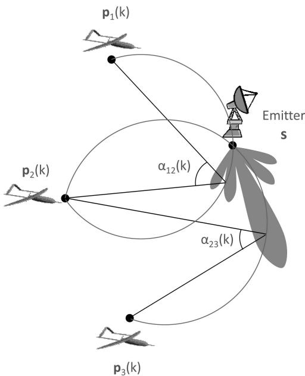  
Fig. 1. SC emitter localization.

$$
\alpha _ { i j } ( k ) = \omega | t _ { j } ( k ) - t _ { i } ( k ) |\tag{5}
$$

where $t _ { i } ( k )$ is the TOI at UAV i. For a given $\alpha _ { i j } ( k )$ , the loci of all possible emitter locations form a circular arc between ${ \bf p } _ { i } ( k )$ and ${ \bf p } _ { j } ( k )$ (see Fig. 1). This follows from the inscribed angle theorem which states that all angles subtended by a given chord must be the same as long as they are on the same side of the chord (i.e., they remain either acute or obtuse). The emitter location is given by the intersection of the circular arcs defined by the subtended angles $\alpha _ { i j } ( k )$ . As can be gleaned from Fig. 1, the SC emitter location solution becomes ambiguous if all UAVs are cocircular with the emitter [21].

The subtended angle measurements are given by

$$
\hat { \alpha } _ { i j } ( k ) = \alpha _ { i j } ( k ) + n _ { i j } ^ { \mathrm { S } } ( k )\tag{6}
$$

where the angle measurement noise $n _ { i j } ^ { \mathrm { S } } ( k )$ is assumed to be zero-mean Gaussian. As in TDOA localization, the $n _ { i j } ^ { \mathrm { S } } ( k )$ become correlated if they share the same sensor.

## III. PASSIVE EMITTER GEOLOCATION

## A. Maximum Likelihood Estimator

The MLE enjoys asymptotic efficiency and asymptotic unbiasedness, and, for sufficiently large signal-to-noise ratio (SNR), it is approximately efficient.

Assuming Gaussian measurement noise, statistical independence between different sensor data and fixed noise covariance matrices, the maximum likelihood

cost function can be expressed as

$$
J _ { \mathrm { M L E } } ( \mathbf { s } ) = \underbrace { J _ { \mathrm { A } } ( \mathbf { s } ) } _ { \mathrm { A O A } } + \underbrace { J _ { \mathrm { T D } } ( \mathbf { s } ) } _ { \mathrm { T D O A } } + \underbrace { J _ { \mathrm { S } } ( \mathbf { s } ) } _ { \mathrm { s c a n - b a s e d } } .\tag{7}
$$

Let $N _ { \mathrm { X } } \geq 0$ denote the number of UAVs carrying sensor $\mathbf { X }$ where X is A for AOA, TD for TDOA and S for scan-based (note that $N = N _ { \mathrm { A } } + N _ { \mathrm { T D } } + N _ { \mathrm { S } }$ is the total number of UAVs in the team). Also let $\bar { \mathbf { p } _ { i } ^ { \mathrm { X } } } , i =$ $1 , \ldots , N _ { \scriptscriptstyle \mathrm { X } }$ denote the location of the ith UAV carrying sensor X. In what follows we drop the discrete time indices to simplify the notation.

The maximum likelihood cost function for AOA sensors is given by

$$
J _ { \mathrm { A } } ( \mathbf { s } ) = \mathbf { e } _ { \mathrm { A } } ^ { \mathrm { T } } ( \mathbf { s } ) \Sigma _ { \mathrm { A } } ^ { - 1 } \mathbf { e } _ { \mathrm { A } } ( \mathbf { s } ) , \qquad \mathbf { e } _ { \mathrm { A } } ( \mathbf { s } ) = { \hat { \boldsymbol { \theta } } } - { \boldsymbol { \theta } } ( \mathbf { s } )\tag{8}
$$

where $\hat { \boldsymbol { \theta } }$ is the vector of AOA measurements and μ(s) is the vector of exact AOA values as a function of emitter location s:

$$
\hat { \pmb { \theta } } = \left[ \begin{array} { c } { \hat { \theta } _ { 1 } } \\ { \vdots } \\ { \hat { \theta } _ { N _ { \mathrm { A } } } } \end{array} \right] , \qquad \pmb { \theta } ( \mathbf { s } ) = \left[ \begin{array} { c } { \mathcal { L } \mathbf { d } _ { 1 } ^ { \mathrm { A } } ( \mathbf { s } ) } \\ { \vdots } \\ { \mathcal { L } \mathbf { d } _ { N _ { \mathrm { A } } } ^ { \mathrm { A } } ( \mathbf { s } ) } \end{array} \right] .\tag{9}
$$

Here $\angle { \bf z }$ is the bearing angle of vector z and ${ \bf d } _ { i } ^ { \mathrm { X } } ( { \bf s } )$ denotes the emitter range vector from the ith UAV carrying sensor X:

$$
\mathbf { d } _ { i } ^ { \mathrm { X } } ( \mathbf { s } ) = \mathbf { s } - \mathbf { p } _ { i } ^ { \mathrm { X } } .\tag{10}
$$

The covariance matrix for AOA measurements has the following form

$$
\Sigma _ { \mathrm { A } } = \sigma _ { \mathrm { A } } ^ { 2 } \left[ \begin{array} { c c c } { \lVert \mathbf { d } _ { 1 } ^ { \mathrm { A } } ( \mathbf { s } _ { 0 } ) \rVert ^ { \gamma } } & & { \mathbf { 0 } } \\ & { . . . } \\ { \mathbf { 0 } } & & { \lVert \mathbf { d } _ { N _ { \mathrm { A } } } ^ { \mathrm { A } } ( \mathbf { s } _ { 0 } ) \rVert ^ { \gamma } } \end{array} \right]\tag{11}
$$

where $\sigma _ { \mathrm { A } } ^ { 2 }$ is the so-called reference AOA noise variance at unit range, $0 \leq \gamma < 2$ is the power loss exponent, and ${ \bf s } _ { 0 }$ is an initial guess for the emitter location that allows us to estimate the emitter range. In the context of UAV waypoint optimization, an initial guess ${ \bf s } _ { 0 }$ is usually available from an emitter location estimate computed at the previous waypoint update. Since the measurement noise is statistically independent between different sensors, $\Sigma _ { \mathrm { A } }$ is a diagonal matrix. Noise variances for individual AOA sensors (i.e., the diagonal entries of $\Sigma _ { \mathrm { A } } )$ are dependent on the emitter range and the power loss exponent. SNR is expected to increase with smaller emitter range. Supposing that the signal power remains constant, this translates into smaller noise variance for smaller emitter range. The rate at which the noise variance changes with the emitter range is determined by °. We assume that all sensor measurements, be it AOA, TDOA, or SC, have the same power loss exponent.

The TDOA cost function is

$$
J _ { \mathrm { T D } } ( \mathbf { s } ) = \mathbf { e } _ { \mathrm { T D } } ^ { \mathrm { T } } ( \mathbf { s } ) \Sigma _ { \mathrm { T D } } ^ { - 1 } \mathbf { e } _ { \mathrm { T D } } ( \mathbf { s } ) , \qquad \mathbf { e } _ { \mathrm { T D } } ( \mathbf { s } ) = \hat { \mathbf { g } } - \mathbf { g } ( \mathbf { s } )\tag{12}
$$

where $\hat { \bf g }$ is the vector of RDOA measurements and g(s) is the vector of exact RDOA values as a function of emitter location s:

$$
\hat { \mathbf { g } } = \left[ \begin{array} { c } { \hat { g } _ { 1 2 } } \\ { } \\ { \vdots } \\ { } \\ { \hat { g } _ { 1 , N _ { \mathrm { I D } } } } \end{array} \right] , \qquad \mathbf { g } ( \mathbf { s } ) = \left[ \begin{array} { c } { \lVert \mathbf { d } _ { 2 } ^ { \mathrm { T D } } ( \mathbf { s } ) \rVert - \lVert \mathbf { d } _ { 1 } ^ { \mathrm { T D } } ( \mathbf { s } ) \rVert } \\ { } \\ { \vdots } \\ { \lVert \mathbf { d } _ { N _ { \mathrm { I D } } } ^ { \mathrm { T D } } ( \mathbf { s } ) \rVert - \lVert \mathbf { d } _ { 1 } ^ { \mathrm { T D } } ( \mathbf { s } ) \rVert } \end{array} \right] .
$$

The TDOA covariance matrix is [19]

(13)

$$
\begin{array} { r l } { \Sigma _ { \mathrm { T D } } = \sigma _ { \mathrm { T D } } ^ { 2 } \left( \lVert \mathbf { d } _ { 1 } ^ { \mathrm { T D } } ( \mathbf { s } _ { 0 } ) \rVert ^ { \gamma } \left[ \begin{array} { l l l } { 1 } & { \cdots } & { 1 } \\ { \vdots } & { \ddots } & { \vdots } \\ { 1 } & { \cdots } & { 1 } \end{array} \right] \right. } & { { } } \\ { + \left. \left[ \begin{array} { l l l } { \lVert \mathbf { d } _ { 2 } ^ { \mathrm { T D } } ( \mathbf { s } _ { 0 } ) \rVert ^ { \gamma } } & { } & { \mathbf { 0 } } \\ { } & { \ddots } & { } \\ { \mathbf { 0 } } & { } & { \lVert \mathbf { d } _ { N _ { \mathrm { D } } } ^ { \mathrm { T D } } ( \mathbf { s } _ { 0 } ) \rVert ^ { \gamma } } \end{array} \right] \right) } \end{array}\tag{14}
$$

where $\sigma _ { \mathrm { T D } } ^ { 2 }$ is the reference TDOA noise variance at unit range. The formulation of $J _ { \mathrm { T D } } ( \bf { s } )$ assumes that the first UAV with TDOA sensor is the reference receiver; i.e., all TDOA measurements are taken with respect to the receiver at ${ \bf p } _ { 1 } ^ { \mathrm { T D } }$

The SC maximum likelihood cost function is given by [15]

$$
J _ { \mathrm { S } } ( \mathbf { s } ) = \mathbf { e } _ { \mathrm { S } } ^ { \mathrm { T } } ( \mathbf { s } ) \Sigma _ { \mathrm { S } } ^ { - 1 } \mathbf { e } _ { \mathrm { S } } ( \mathbf { s } ) , \qquad \mathbf { e } _ { \mathrm { S } } ( \mathbf { s } ) = { \hat { \boldsymbol { \alpha } } } - { \boldsymbol { \alpha } } ( \mathbf { s } )\tag{15}
$$

where $\hat { \alpha }$ is the vector of subtended angle measurements and ®(s) is the vector of exact subtended angles as a function of emitter location s:

$$
\begin{array} { r } { \hat { \pmb { \alpha } } = \left[ \begin{array} { c } { \hat { \alpha } _ { 1 2 } } \\ { \vdots } \\ { \hat { \alpha } _ { N _ { \mathrm { S } } - 1 , N _ { \mathrm { S } } } } \end{array} \right] , \qquad \pmb { \alpha } ( \mathbf { s } ) = \left[ \begin{array} { c } { \cos ^ { - 1 } \frac { \mathbf { d } _ { 1 } ^ { \mathrm { S } } ( \mathbf { s } ) \cdot \mathbf { d } _ { 2 } ^ { \mathrm { S } } ( \mathbf { s } ) } { \left\| \mathbf { d } _ { 1 } ^ { \mathrm { S } } ( \mathbf { s } ) \right\| \left\| \mathbf { d } _ { 2 } ^ { \mathrm { S } } ( \mathbf { s } ) \right\| } } \\ { \vdots } \\ { \cos ^ { - 1 } \frac { \mathbf { d } _ { N _ { \mathrm { S } } - 1 } ^ { \mathrm { S } } ( \mathbf { s } ) \cdot \mathbf { d } _ { N _ { \mathrm { S } } } ^ { \mathrm { S } } ( \mathbf { s } ) } { \left\| \mathbf { d } _ { N _ { \mathrm { S } } - 1 } ^ { \mathrm { S } } ( \mathbf { s } ) \right\| \left\| \mathbf { p } _ { N _ { \mathrm { S } } } ^ { \mathrm { S } } \right\| } } \end{array} \right] . } \end{array}\tag{16}
$$

Here x y denotes vector dot product between x and $\mathbf { y } .$ The covariance matrix for SC sensor errors is

$$
\Sigma _ { S } = \omega ^ { 2 } \sigma _ { S } ^ { 2 } \left[ \begin{array} { l l l l l l } { \nu _ { 1 2 } } & { - \nu _ { 2 } } & & & & { \mathbf { 0 } } \\ { - \nu _ { 2 } } & { \nu _ { 2 3 } } & { - \nu _ { 3 } } & & & \\ & { - \nu _ { 3 } } & { \nu _ { 3 4 } } & { \ddots } & & \\ & & { \ddots } & { \ddots } & { - \nu _ { N _ { S } - 1 } } \\ { \mathbf { 0 } } & & & & { - \nu _ { N _ { S } - 1 } } & { \nu _ { N _ { S } - 1 , N _ { S } } } \end{array} \right]\tag{17}
$$

where $\sigma _ { \mathrm { S } } ^ { 2 }$ is the reference TOI noise variance at unit range, and

$$
\nu _ { i j } = \lVert \mathbf { d } _ { i } ^ { \mathrm { S } } ( \mathbf { s } _ { 0 } ) \rVert ^ { \gamma } + \lVert \mathbf { d } _ { j } ^ { \mathrm { S } } ( \mathbf { s } _ { 0 } ) \rVert ^ { \gamma } , \qquad \nu _ { i } = \lVert \mathbf { d } _ { i } ^ { \mathrm { S } } ( \mathbf { s } _ { 0 } ) \rVert ^ { \gamma } .
$$

We assume that the subtended angles are measured between consecutive UAVs carrying SC sensors.

The hybrid MLE is given by

$$
\hat { \bf s } = \underset { { \bf s } } { \arg \operatorname* { m i n } } J _ { \mathrm { M L E } } ( { \bf s } ) .\tag{18}
$$

Considering the terms that make up $J _ { \mathrm { M L E } } ( { \bf s } )$ we observe that (18) is a nonlinear least-squares estimator, which is a consequence of the Gaussian noise assumption. For arbitrary N the hybrid MLE does not have a closed-form solution. Iterative numerical minimization methods such as the Gauss-Newton and Nelder-Mead simplex algorithms [22, 23] can be employed to solve (18). These numerical methods require an initial guess which can be obtained from a previous MLE run or by using another closed-form estimator.

We have intentionally assumed fixed noise covariance matrices in order to simplify the computation of MLE. In general it is possible to make the noise covariances dependent on the emitter location, which will introduce additional logarithmic terms into (7) [24].

## B. Kalman Filtering of Maximum Likelihood Estimates

The maximum likelihood location estimates sˆ(k), generated at time instants $k = 0 , 1 , 2 , . . . ,$ can be filtered via a Kalman filter to produce improved estimation results. For a stationary emitter the state-space model for emitter location estimates is described by an unforced dynamical model:

$$
\begin{array} { c } { { { \bf s } ( k + 1 ) = { \bf s } ( k ) } } \\ { { { \hat { \bf s } } ( k ) = { \bf s } ( k ) + { \bf w } ( k ) } } \end{array}\tag{19}
$$

where s(k) is the unknown emitter location $\mathbf { ( s = s ( 0 ) = }$ $\mathbf { s } ( 1 ) = \cdots )$ , sˆ(k) is the maximum likelihood estimate of emitter location at time $k ,$ and w(k) is the estimation error. The error vector w(k) is assumed to have zero mean and covariance matrix approximately given by the inverse FIM evaluated at the predicted emitter location $\Phi ^ { - 1 } ( \mathbf { s } ( k - 1 \mid k - 1 ) )$ (see Section IVC for a detailed discussion of FIM). Note that for the unforced dynamical model $\mathbf { s } ( k | k - 1 ) = \mathbf { s } ( k - 1 | k - 1 )$

The filtered emitter location estimate $\mathbf { s } ( k \mid k )$ and its covariance $\mathbf { P } ( k \mid k )$ are given by the Kalman filter update equations:

$$
\begin{array} { r } { \begin{array} { l } { \mathbf { s } ( k + 1 \mid k + 1 ) = \mathbf { s } ( k \mid k ) + \mathbf { K } ( k + 1 ) \tilde { \mathbf { z } } ( k + 1 ) } \\ { \mathbf { P } ( k + 1 \mid k + 1 ) = ( \mathbf { I } - \mathbf { K } ( k + 1 ) ) \mathbf { P } ( k \mid k ) } \\ { \qquad \tilde { \mathbf { z } } ( k + 1 ) = \hat { \mathbf { s } } ( k + 1 ) - \mathbf { s } ( k \mid k ) } \\ { \qquad \mathbf { K } ( k + 1 ) = \mathbf { P } ( k \mid k ) ( \mathbf { P } ( k \mid k ) + \Phi ^ { - 1 } ( \mathbf { s } ( k \mid k ) ) ) ^ { - 1 } } \end{array} } \end{array}\tag{20}
$$

where ${ \bf s } ( 0 | 0 ) = { \hat { \bf s } } ( 0 )$ and $\mathbf { P } ( 0 \mid 0 ) = \Phi ^ { - 1 } ( \hat { \mathbf { s } } ( 0 ) )$

## IV. UAV PATH PLANNING FOR EMITTER LOCALIZATION

## A. Problem Definition

We consider 2D emitter localization by a team of N UAVs with a heterogeneous mix of payload sensors. The possible sensor types are AOA, TDOA, and SC. The hybrid MLE and Kalman filter estimate discussed in Section III are used to estimate the emitter location. If all UAVs carry the TDOA sensor, at least three UAVs are needed for unique emitter localization (likewise for the SC sensor). Some localization geometries may require even more sensors. For AOA localization the minimum number of sensors is two. If a heterogeneous mix of sensors is used, at least a pair of TDOA or SC sensors must be part of the sensor mix.

The UAV path planning problem involves the calculation of UAV waypoints at discrete time instants $k = 0 , 1 , 2 , \ldots$ . The time interval between waypoint updates is T seconds. The sensor measurements for emitter localization are assumed to be synchronized with waypoint updates. The UAVs are assumed to be equipped with GPS (Global Positioning System) so that the central processing unit responsible for steering the UAVs can query their locations.

The proposed UAV waypoint-update/steering algorithm is

$$
\mathbf { p } _ { i } ( k + 1 ) = \mathbf { p } _ { i } ( k ) + \mathbf { u } _ { i } ( k ) , \qquad i = 1 , . . . , N , \quad k = 0 , 1 , . . .\tag{21}
$$

where the UAV waypoint update or control vector ${ \bf u } _ { i } ( k )$ satisfies the norm and turn rate constraints

$$
\lvert \lvert \mathbf { u } _ { i } ( k ) \rvert \rvert = \nu T\tag{22a}
$$

$$
| \angle \mathbf { u } _ { i } ( k + 1 ) - \angle \mathbf { u } _ { i } ( k ) | \leq \varphi .\tag{22b}
$$

Here v is the constant cruising speed of the UAVs (assumed to be the same for all UAVs with no loss of generality) and $\varphi$ is the turn rate. In addition to (22) the updated UAV waypoints may be subject to a number of inequality constraints:

$$
\| \mathbf { p } _ { i } ( k + 1 ) - \mathbf { p } _ { j } ( k + 1 ) \| \leq \rho , \qquad i , j \in \{ 1 , . . . , N \} , \quad i \neq j\tag{23a}
$$

$$
\| \mathbf { p } _ { i } ( k + 1 ) - \mathbf { c } _ { j } \| \geq \kappa _ { j } , \qquad i = 1 , \ldots , N , \quad j = 1 , \ldots , M .\tag{23b}
$$

The inequality constraint (23a) imposes an upper bound on the distances between the UAVs at time instant $k + 1$ . In practice these distance constraints may correspond to the maximum communications range between the UAVs (i.e., the connectivity constraint). If the maximum communications range is exceeded, the communication link between the affected UAVs becomes unreliable. The inequality in (23b) is a set of hard constraints that aims to maintain a minimum clearance distance $\kappa _ { j }$ from a given location $\mathbf { c } _ { j } , j = 1 , \hdots , M$ . These hard constraints can be configured to achieve collision and/or obstacle/threat avoidance through appropriate selection of $\mathbf { c } _ { j }$ and $\kappa _ { j } .$ . The inequalities can also be modified to define arbitrary noncircular no-fly zones. Fig. 2 illustrates the constrained UAV waypoint update problem.

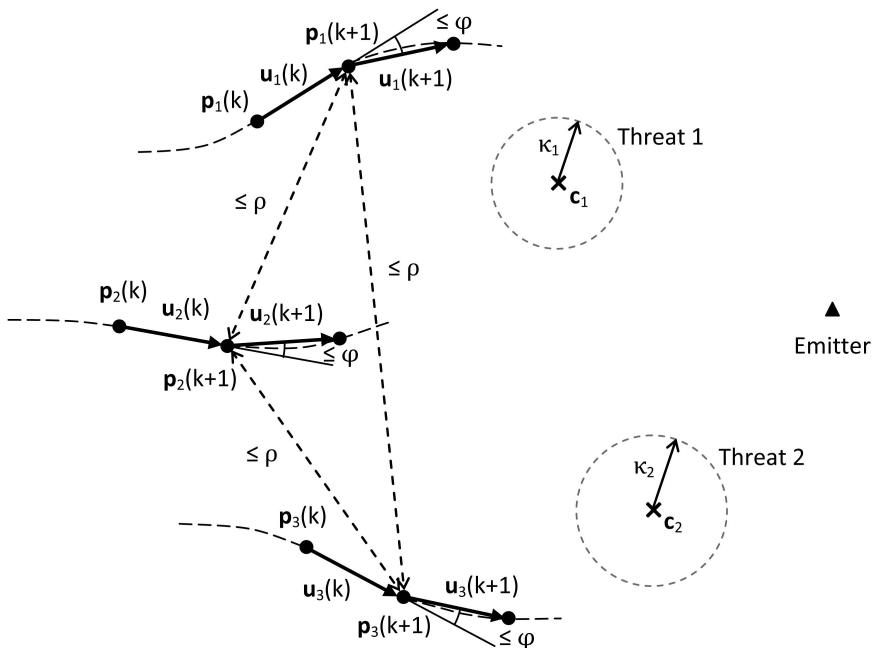  
Fig. 2. Illustration of UAV waypoint updates subject to physical and geometric path constraints.

The constraints in (22) must be strictly adhered to since they are part of the UAV dynamics. Therefore if a conflict occurs between (22) and (23), (22) always takes the priority. In order to avoid consequential undesirable UAV maneuvers violating the set constraints, the constraint parameters $\rho$ and $\kappa _ { j }$ in (23) may need to be selected conservatively. This is achieved by setting $\rho$ smaller and $\kappa _ { j }$ larger than their respective desired values.

## B. Minimizing the Area of Uncertainty Region

Suppose that the maximum likelihood location estimator in (18) is unbiased and efficient. Then the covariance matrix of the maximum likelihood estimates will be identical to the Cramer-Rao lower bound (CRLB) with the area of the 1-¾ error ellipse (39.4% confidence region) given by [5]

$$
A _ { 1 \sigma } = \frac { \pi } { | \Phi ( \mathbf { s } ) | ^ { 1 / 2 } } .\tag{24}
$$

Here $\Phi ( \mathbf { s } )$ is the FIM of the location estimates and denotes determinant. By definition the FIM is equal to the inverse of the CRLB. As is clear from (24) the area of the 1-¾ error ellipse is inversely proportional to the determinant of FIM. Therefore by maximizing the determinant of FIM we minimize the estimation uncertainty area and improve the accuracy of emitter location estimates. Maximizing the determinant of FIM is equivalent to minimizing ln ©(s) which is known as the D-optimality criterion in the optimal experimental design literature [9]. Even though (24) is valid for an unbiased and efficient estimator, it can still be used as an approximate optimization criterion for the hybrid MLE at moderate-to-large SNR levels. The FIM is easy to compute for the hybrid emitter location problem at hand (see Section IVC). Therefore maximizing the determinant of FIM as an optimization criterion affords a simple solution. Insistence on using the exact covariance matrix for the hybrid MLE rather than its approximation given by the CRLB would unduly complicate the optimization problem.

Fig. 3 depicts the proposed solution to the UAV path planning problem based on maximizing the determinant of FIM at successive waypoints. Given the sensor measurements collected at time instant k, the maximum likelihood estimate and Kalman update of the emitter location are calculated. The FIM requires knowledge of the true emitter location. Since the true emitter location is unknown, the FIM is approximated by replacing the true emitter location with the filtered estimate produced by the Kalman filter. The next waypoints for the UAVs are determined by maximizing the determinant of FIM over the UAV control vectors. When the UAVs arrive at the next waypoints new sensor measurements are collected and the entire process is repeated until the geolocation mission is completed. At each waypoint update the UAVs are steered to new waypoints where the emitter localization performance is expected to improve. The improved location estimates in turn

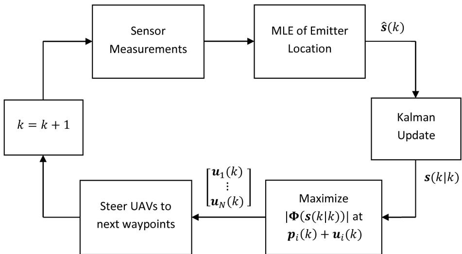  
Fig. 3. UAV path planning for emitter localization based on maximizing determinant of FIM.

produce better approximations for the FIM, resulting in more accurate waypoints. Thus the waypoint update process leads to better emitter location estimates and more accurate approximations of the FIM as k increases.

Consider the nonlinear cost function1 that we wish to minimize by steering the UAVs:

$$
f ( \vartheta ( k ) , \pi ( k ) , \mathbf { s } ( k \mid k ) ) = \frac { 1 } { \left| \Phi ( \pi ( k + 1 ) , \mathbf { s } ( k \mid k ) ) \right| } .\tag{25}
$$

Here $\Phi ( \pi ( k + 1 ) , \mathbf { s } ( k \mid k ) )$ is the FIM at $k + 1$ approximated by substituting the filtered emitter location estimate $\mathbf { s } ( k \mid k )$ for the true emitter location ${ \mathbf s } ; \pi ( k + 1 )$ is the vector of updated waypoints at $k + 1 \colon$

$$
\pi ( k + 1 ) = \pi ( k ) + \left[ \begin{array} { c c c c c } { \mathbf { u } _ { 1 } ( k ) } \\ { \vdots } \\ { \mathbf { u } _ { N } ( k ) } \end{array} \right] , \pi ( k ) = \left[ \begin{array} { c c c c c } { \mathbf { p } _ { 1 } ( k ) } \\ { \vdots } \\ { \mathbf { p } _ { N } ( k ) } \end{array} \right]\tag{26}
$$

and $\vartheta ( k )$ is the vector of angular directions for the control vectors

$$
\pmb { \vartheta } ( k ) = [ \vartheta _ { 1 } ( k ) , \vartheta _ { 2 } ( k ) , . . . , \vartheta _ { N } ( k ) ] ^ { \mathrm { T } }\tag{27}
$$

with control vectors ${ \bf u } _ { i } ( k )$ given by

$$
\mathbf { u } _ { i } ( k ) = \nu T \left[ \begin{array} { l } { \cos \vartheta _ { i } ( k ) } \\ { \sin \vartheta _ { i } ( k ) } \end{array} \right] , \qquad i = 1 , . . . , N .\tag{28}
$$

The cost function $f ( \cdot )$ gives a measure of location estimation uncertainty as a function of the UAV positions ${ \bf p } _ { i } ( k )$ , the control vectors ${ \bf u } _ { i } ( k )$ , and the

Kalman filter location estimate $\mathbf { s } ( k \mid k )$ at time k. The UAV path planning algorithm in Fig. 3 can be formulated as

$$
\underbrace { \left[ \begin{array} { l } { \vartheta _ { 1 } ^ { * } ( k ) } \\ { \vdots } \\ { \vartheta _ { N } ^ { * } ( k ) } \end{array} \right] } _ { \vartheta ^ { * } ( k ) } = \underbrace { \arg \operatorname* { m i n } _ { \scriptstyle \mathbf { i } = 1 , \ldots , N } f ( \vartheta ( k ) , \pi ( k ) , \mathbf { s } ( k \mid k ) ) } _ { - \pi < \vartheta _ { i } ( k ) \leq \pi , \ i = 1 , \ldots , N } f ( \vartheta ( k ) , \pi ( k ) , \mathbf { s } ( k \mid k ) )\tag{29a}
$$

$$
\mathbf { u } _ { i } ( k ) = \nu T \left[ \begin{array} { l } { \cos \vartheta _ { i } ^ { * } ( k ) } \\ { \sin \vartheta _ { i } ^ { * } ( k ) } \end{array} \right] , \qquad i = 1 , \ldots , N\tag{29b}
$$

where the $\vartheta _ { i } ^ { * } ( k )$ are the optimal bearing angles for control vectors that steer the UAVs to the next waypoints $\mathbf { p } _ { i } ( k + 1 )$ . Defining the optimization problem in terms of angular directions $\vartheta _ { i } ( k )$ eliminates the norm constraint $\lvert \lvert \mathbf { u } _ { i } ( k ) \rvert \rvert = \nu T$ by absorbing it into the cost function $f ( \cdot )$ . The nonlinear programming solution in (29) overcomes the inaccuracies associated with the gradient-based steering algorithms proposed in [15], [16] by maximizing the determinant of FIM directly over ${ \bf u } _ { i } ( k )$ . As we will see in Section V it also provides an effective way to incorporate physical and geometric constraints into the path planning problem.

The proposed UAV path optimization algorithm in (29) requires the minimization of $f ( \cdot )$ over $\vartheta ( k )$ at each waypoint update. Several numerical minimization techniques are available to find the optimal $\vartheta ^ { * } ( k )$ such as the Gauss-Newton and Nelder-Mead simplex algorithms. These algorithms are locally convergent and therefore require a good initialization to avoid convergence to a local minimum. We propose the following initialization strategies.

1) Set the initial angular directions to point to the estimated emitter location:

$$
\vartheta _ { i } = \angle ( \mathbf { s } ( k \mid k ) - \mathbf { p } _ { i } ( k ) ) , \qquad i = 1 , \ldots , N .\tag{30}
$$

2) Find the gradient of $J ( \pi ( k ) ) = \left| \Phi ( \pi ( k ) , \mathbf { s } ( k \mid k ) ) \right|$ with respect to ${ \bf p } _ { i } ( k )$

$$
\pmb { \xi } _ { i } = \frac { \partial J ( \pi ( k ) ) } { \partial \mathbf { p } _ { i } ( k ) } , \qquad i = 1 , . . . , N\tag{31a}
$$

and initialize the angular directions to

$$
\vartheta _ { i } = \angle \xi _ { i } , \qquad i = 1 , \ldots , N .\tag{31b}
$$

The first initialization strategy is simple and works well in general. The second strategy is more accurate, but it requires more computation. The gradient of $J ( \pi ( k ) )$ can be numerically calculated using a first-order finite difference approximation [15]. These initialization strategies can give significantly different results if the emitter range from the UAVs is large compared with the UAV baseline. The main reason for this is that (31a) provides initialization that locally maximizes the determinant of approximated FIM consistent with (29). On the other hand, (30) always initializes the heading angles to point to the emitter, which is likely to be in close agreement with (31a) only if the UAVs are in close proximity of the emitter.

## C. FIM for Heterogeneous Sensors

The FIM for hybrid location estimation employing AOA, TDOA, and SC sensors is given by

$$
\begin{array} { r l } & { \Phi ( \mathbf { s } ) = \mathbf { J } _ { \mathrm { A } } ^ { \mathrm { T } } ( \mathbf { s } ) \Sigma _ { \mathrm { A } } ^ { - 1 } ( \mathbf { s } ) \mathbf { J } _ { \mathrm { A } } ( \mathbf { s } ) + \mathbf { J } _ { \mathrm { T D } } ^ { \mathrm { T } } ( \mathbf { s } ) \Sigma _ { \mathrm { T D } } ^ { - 1 } ( \mathbf { s } ) \mathbf { J } _ { \mathrm { T D } } ( \mathbf { s } ) } \\ & { \qquad + \mathbf { J } _ { \mathrm { S } } ^ { \mathrm { T } } ( \mathbf { s } ) \Sigma _ { \mathrm { S } } ^ { - 1 } ( \mathbf { s } ) \mathbf { J } _ { \mathrm { S } } ( \mathbf { s } ) } \end{array}\tag{32}
$$

where $\mathbf { J } _ { \mathrm { X } } ( \mathbf { s } )$ is the Jacobian of the measurement error for UAVs carrying sensor X (here X is A for AOA sensors, TD for TDOA sensors, and S for SC sensors) and $\Sigma _ { \mathrm { X } } ( \mathbf { s } )$ is the measurement noise covariance matrix. The covariance matrices $\Sigma _ { \mathrm { A } } ( \mathbf { s } ) , \Sigma _ { \mathrm { T D } } ( \mathbf { s } )$ , and $\Sigma _ { \mathrm { S } } ( \mathbf { s } )$ are given by (11), (14), and (17), respectively, after replacing ${ \bf s } _ { 0 }$ with the true emitter location s.

Equation (32) is nothing but the inverse of CRLB for the hybrid location estimate:

$$
\mathbf { C R L B } = ( \mathbf { J } _ { \mathrm { H } } ^ { \mathrm { T } } \mathbf { \Sigma } \mathbf { \Sigma } _ { \mathrm { H } } ^ { - 1 } \mathbf { J } _ { \mathrm { H } } ) ^ { - 1 }\tag{33}
$$

where $\mathbf { J } _ { \mathrm { H } }$ is the block diagonal Jacobian matrix of the AOA, TDOA, and SC errors

$$
\mathbf { J } _ { \mathrm { H } } = \left[ \begin{array} { l l l } { \mathbf { J } _ { \mathrm { A } } } & & { \mathbf { 0 } } \\ & { \mathbf { J } _ { \mathrm { T D } } } & \\ { \mathbf { 0 } } & & { \mathbf { J } _ { \mathrm { S } } } \end{array} \right]\tag{34}
$$

and $\Sigma _ { \mathrm { H } }$ is the augmented covariance matrix

$$
\Sigma _ { \mathrm { H } } = \left[ \begin{array} { l l l } { \Sigma _ { \mathrm { A } } } & & { \mathbf { 0 } } \\ & { \Sigma _ { \mathrm { T D } } } \\ { \mathbf { 0 } } & & { \Sigma _ { \mathrm { S } } } \end{array} \right] .\tag{35}
$$

The Jacobian matrices for AOA and TDOA sensors are

$$
\mathbf { J } _ { \mathrm { A } } ( \mathbf { s } ) = { \frac { \partial \mathbf { e } _ { \mathrm { A } } ( \mathbf { s } ) } { \partial \mathbf { s } } } = { \left[ \begin{array} { l } { \displaystyle { \frac { 1 } { \lVert \mathbf { d } _ { 1 } ^ { \mathrm { A } } ( \mathbf { s } ) \rVert } } [ \sin \theta _ { 1 } ( \mathbf { s } ) , - \cos \theta _ { 1 } ( \mathbf { s } ) ] } \\ { \quad } \\ { \vdots } \\ { \displaystyle { \frac { 1 } { \lVert \mathbf { d } _ { N _ { \mathrm { A } } } ^ { \mathrm { A } } ( \mathbf { s } ) \rVert } } [ \sin \theta _ { N _ { \mathrm { A } } } ( \mathbf { s } ) , - \cos \theta _ { N _ { \mathrm { A } } } ( \mathbf { s } ) ] } \end{array} \right] } _ { N _ { \mathrm { A } } \times 2 }
$$

and

$$
\begin{array} { l } { \displaystyle { { \bf J } _ { \mathrm { T D } } } ( { \bf s } ) = \frac { \partial { \bf e } _ { \mathrm { T D } } ( { \bf s } ) } { \partial { \bf s } } } \\ { = - [ \frac { 1 } { \| { \bf d } _ { 2 } ^ { \mathrm { T D } } ( { \bf s } ) \| } ( { \bf d } _ { 2 } ^ { \mathrm { T D } } ( { \bf s } ) ) ^ { \mathrm { T } } - \frac { 1 } { \| { \bf d } _ { 1 } ^ { \mathrm { T D } } ( { \bf s } ) \| } ( { \bf d } _ { 1 } ^ { \mathrm { T D } } ( { \bf s } ) ) ^ { \mathrm { T } } ] } \\ { ~ \vdots ~ } \\ { \displaystyle \frac { 1 } { \| { \bf d } _ { N _ { \mathrm { D } } } ^ { \mathrm { T D } } ( { \bf s } ) \| } ( { \bf d } _ { N _ { \mathrm { T D } } } ^ { \mathrm { T D } } ( { \bf s } ) ) ^ { \mathrm { T } } - \frac { 1 } { \| { \bf d } _ { 1 } ^ { \mathrm { T D } } ( { \bf s } ) \| } ( { \bf d } _ { 1 } ^ { \mathrm { T D } } ( { \bf s } ) ) ^ { \mathrm { T } } ] _ { ( N _ { \mathrm { T D } } - 1 ) \times 2 } } \end{array} .\tag{36a}
$$

The Jacobian for SC sensors is

(36b)

$$
\begin{array} { r l r } { \displaystyle \mathbf { J } _ { \mathrm { S } } ( \mathbf { s } ) = \frac { \partial \mathbf { e } _ { \mathrm { S } } ( \mathbf { s } ) } { \partial \mathbf { s } } } & \\ { = \displaystyle \left[ \frac { \partial e _ { 1 } } { \partial \mathbf { s } } } & { \frac { \partial e _ { 2 } } { \partial \mathbf { s } } . . . \frac { \partial e _ { N _ { \mathrm { S } } - 1 } } { \partial \mathbf { s } } \right] ^ { \mathrm { T } } } \end{array}\tag{37}
$$

(38)

where [15]

$$
\begin{array} { l } { { \displaystyle { \frac { \partial e _ { i } } { \partial { \bf s } } } = - \frac { \partial } { \partial { \bf s } } \cos ^ { - 1 } h _ { i } } \qquad } & { { ( 3 9 } } \\ { { \displaystyle \vphantom { \frac { \partial ^ { 2 } e _ { i } } { \partial { \bf s } } } } } \\ { { \displaystyle \vphantom { \frac { \partial ^ { 2 } e _ { i } } { \partial { \bf s } } } } } \\ { { \displaystyle \vphantom { \frac { \partial ^ { 2 } e _ { i } } { \partial { \bf s } } } } } \\ { { \displaystyle \vphantom { \frac { \partial ^ { 2 } e _ { i } } { \partial { \bf s } } } } } \end{array}\tag{a}
$$

and

(39b)

$$
h _ { i } = \frac { \eta _ { i } } { \delta _ { i } } , \qquad \eta _ { i } = \mathbf { d } _ { i } ^ { \mathrm { S } } ( \mathbf { s } ) \cdot \mathbf { d } _ { i + 1 } ^ { \mathrm { S } } ( \mathbf { s } ) , \qquad \delta _ { i } = \big \| \mathbf { d } _ { i } ^ { \mathrm { S } } ( \mathbf { s } ) \big \| \big \| \mathbf { d } _ { i + 1 } ^ { \mathrm { S } } ( \mathbf { s } ) \big \| .\tag{40}
$$

## V. CONSTRAINED PATH OPTIMIZATION

The waypoint optimization problem defined in (29) is often subject to a number of nonlinear constraints arising from physical and geometric constraints in relation to the maximum distance bounds between the UAVs, and the avoidance of obstacles and/or threats (see (23a) and (23b)). The incorporation of these constraints into the nonlinear programming problem in (29) leads to the following constrained optimization problem

$$
\operatorname* { m i n } _ { \vartheta ( k ) } f ( \vartheta ( k ) , \pi ( k ) , \mathbf { s } ( k \mid k ) )\tag{41a}
$$

$$
\mathrm { s u b j e c t ~ t o } \quad g _ { 1 i j } ( \vartheta ( k ) ) \leq 0 \qquad \mathrm { a n d } \qquad g _ { 2 i j } ( \vartheta ( k ) ) \leq 0\tag{41b}
$$

1157

where $\vartheta _ { i } ( k ) \in ( - \pi , \pi ] , i = 1 , \ldots , N$ , and

$$
\begin{array} { c } { { g _ { 1 i j } ( \vartheta ( k ) ) = \| { \bf p } _ { i } ( k ) + { \bf u } _ { i } ( k ) - { \bf p } _ { j } ( k ) - { \bf u } _ { j } ( k ) \| - \rho , } } \\ { { \mathrm { } } } \\ { { i = 1 , . . . , N - 1 , \quad j = i + 1 , . . . , N } } \\ { { g _ { 2 i j } ( \vartheta ( k ) ) = \kappa _ { j } - \| { \bf p } _ { i } ( k ) + { \bf u } _ { i } ( k ) - { \bf e } _ { j } \| , } } \\ { { \mathrm { } } } \\ { { i = 1 , . . . , N , \quad j = 1 , . . . , M } } \end{array}\tag{42}
$$

(43)

are the time-varying constraint functions. Note that the requirement $\vartheta _ { i } ( k ) \in ( - \pi , \pi ]$ can be relaxed to $\pmb { \vartheta } ( k ) \in \mathbb { R } ^ { N }$ if the angles are subsequently wrapped to the interval $( - \pi , \pi ]$

The optimization problem in (41) is a nonlinear programming problem with a nonlinear cost function and nonlinear inequality constraints. Several methods are available for solving such constrained optimization problems, including barrier and interior point methods, penalty methods, and primal-dual methods [25]. In this paper we use an interior point method to solve the waypoint optimization problem in (41). The main idea behind interior point methods is to construct a parameterized unconstrained minimization problem by means of a logarithmic barrier function. The barrier function prevents the solutions of the unconstrained problem from leaving the interior set defined by

$$
\mathcal { T } ( k ) = \{ \vartheta ( k ) \in \mathbb { R } ^ { N } \ | \ g _ { 1 i j } ( \vartheta ( k ) ) < 0 , g _ { 2 i j } ( \vartheta ( k ) ) < 0 \} .\tag{44}
$$

A logarithmic barrier function that achieves this requirement is given by

$$
\begin{array} { r } { c ( \vartheta ( k ) ) = - \displaystyle \sum _ { i = 1 } ^ { N - 1 } \displaystyle \sum _ { j = i + 1 } ^ { N } \ln ( - g _ { 1 i j } ( \vartheta ( k ) ) ) } \\ { - \displaystyle \sum _ { i = 1 } ^ { N } \displaystyle \sum _ { j = 1 } ^ { M } \ln ( - g _ { 2 i j } ( \vartheta ( k ) ) ) . } \end{array}\tag{45}
$$

We note that $c ( \vartheta ( k ) )$ is defined in the interior set $\mathcal { T } ( k )$ If any of the constraint functions approaches zero from the negative side, $c ( \vartheta ( k ) )$ tends to infinity.

The interior point method is defined by the parameterized unconstrained minimization problem

$$
\vartheta ^ { \ast } ( k , \mu ) = \underset { \vartheta ( k ) \in \mathcal { I } ( k ) } { \arg \operatorname* { m i n } } f ( \vartheta ( k ) , \pi ( k ) , \mathbf { s } ( k \mid k ) ) + \mu c ( \vartheta ( k ) ) ,\tag{46}
$$

where $f ( \vartheta ( k ) , \pi ( k ) , \mathbf { s } ( k \mid k ) ) + \mu c ( \vartheta ( k ) )$ is the composite function and $\mu$ is the barrier parameter. Solving (46) iteratively for decreasing values of $\mu ,$ for example, using the Newton barrier method [26], produces a sequence of $\vartheta ^ { * } ( k , \mu )$ that converges to the global solution of the constrained optimization problem in (41) as $\mu \to 0$ . In the interest of keeping the computational complexity in check, we propose to solve (46) only for a fixed $\mu$ and use the solution to obtain the angular directions for the control vectors

${ \bf u } _ { i } ( k ) . \mathrm { A s } \ \mu  0 , f ( \vartheta ( k ) , \pi ( k ) , \mathbf { s } ( k \mid k ) ) + \mu c ( \vartheta ( k ) )$ behaves like $f ( \vartheta ( k ) , \pi ( k ) , \mathbf { s } ( k \mid k ) )$ , making the barrier function inconsequential as long as the constraints are non-zero. Therefore, in order to make sure that the solution of (46) for a fixed $\mu$ is close to the global minimizer, $\mu$ should be set to a very small positive number.

When solving (46) using a numerical minimization technique, it is important to make sure that the initial guess is an interior point, i.e., a member of the interior set (k). One option to meet this requirement is to use a set of K equally spaced angles $2 \pi i / K$ $i = 0 , 1 , \ldots , K - 1$ , and search over these angles for the best initialization $\vartheta \in { \mathcal { T } } ( k )$ that minimizes $f ( \pmb { \vartheta } , \pi ( k ) , \mathbf { s } ( k \mid k ) ) + \mu c ( \pmb { \vartheta } )$ . This grid-search-based initialization method involves $K ^ { \bar { N } }$ composite function evaluations in the worst case scenario and is therefore computationally expensive.

An alternative low-complexity initialization strategy is to use (30) to generate a set of initial control vector angles and then to perform a grid search only for those initial angles that violate the inequality constraints. This provides a very effective and low complexity initialization technique by reducing the number of composite function evaluations significantly. Since (30) always generates an initialization pointing at the estimated emitter location, the only constraint that is likely to be violated is a hard constraint around a threat. Thus in most cases it will be sufficient to identify the initial angles that violate $g _ { 2 i j } ( \vartheta ( k ) ) \leq 0$ . This alternative strategy should be able to find a feasible initial guess if it exists since it resorts to grid search for angles that cannot be initialized using (30).

We complete the treatment of the nonlinear constraints by considering the turn rate constraint defined in (22b). The turn rate constraint takes priority over all other constraints and therefore must be applied last. It imposes a bound on the directional angles of the control vectors:

$$
| \vartheta _ { i } ( k + 1 ) - \vartheta _ { i } ( k ) | \leq \varphi , \qquad i = 1 , \ldots , N .\tag{47}
$$

A simple way to impose this constraint is to limit the maximum angular deviation to $\varphi .$ That is, if the optimal control vector given by (46) obeys (47), then no action is required. $\operatorname { I f } ,$ however, the resulting control vector violates (47), then the direction angle of the control vector is hard limited so that $| \vartheta _ { i } ( k + 1 ) - \vartheta _ { i } ( k ) |$ ${ } = \varphi .$

The turn rate constraint may violate some of the nonlinear constraints as a result of limiting UAV maneuverability. As a consequence, it is often necessary to set the maximum distance and obstacle/threat avoidance parameters conservatively. This is illustrated in Fig. 4 for the case of obstacle/threat avoidance. The situation shown in Fig. 4 can be considered the worst case scenario

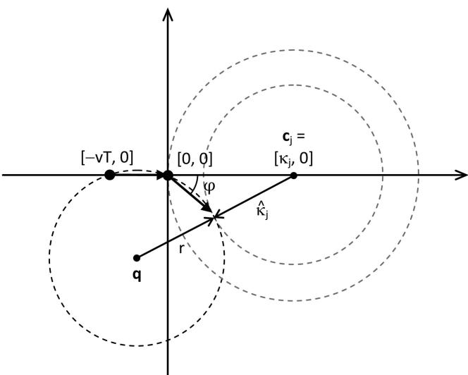  
Fig. 4. Violation of hard constraint caused by maximum turn rate ', reducing effective clearance distance to $\hat { \kappa } _ { j } .$

## TABLE I

UAV Steering Algorithm Based on Interior Point Optimization   
Given   
UAV locations $\mathbf { p } _ { 1 } ( k ) , . . . , \mathbf { p } _ { N } ( k )$   
Constraint parameters $\rho , \ \{ \kappa _ { j } , \mathbf { c } _ { j } \} , \ \varphi$   
Sensor measurements ${ \widehat { \pmb \theta } } ( k ) ,$ , gˆ(k), ®ˆ (k)   
Compute maximum likelihood emitter location estimate sˆ(k)   
Obtain the filtered location estimate s(k k) using the Kalman   
update   
Solve the parameterized unconstrained minimization problem   
(46) for $\vartheta ^ { * } ( k , \mu )$   
Apply the turn rate constraint in (47) by limiting angular   
deviation   
Compute the control vectors in (29b)   
Steer UAVs to the next waypoints using (21)

since it causes the deepest penetration into the hard constraint at the maximum turn rate. The three UAV waypoints at $[ - \nu T , 0 ] ^ { \mathrm { T } } , [ 0 , 0 ] ^ { \mathrm { T } }$ , and $\nu T [ \cos \varphi , - \sin \varphi ] ^ { \mathrm { T } }$ define a circle of radius r centred at q representing the UAV trajectory:

$$
r = { \frac { \nu T } { \sin \varphi } } { \sqrt { { \frac { 1 } { 2 } } ( 1 + \cos \varphi ) } }\tag{48a}
$$

$$
\mathbf { q } = - { \frac { \nu T } { 2 \sin \varphi } } \left[ 1 + \cos \varphi \right] .\tag{48b}
$$

The effective clearance from $\mathbf { c } _ { j }$ is given by

$$
\begin{array} { l } { { \hat { \kappa } _ { j } = \| { \bf q } - { \bf e } _ { j } \| - r } } \\ { { \displaystyle ~ = \sqrt { \left( \frac { \nu T } { 2 } + \kappa _ { j } \right) ^ { 2 } + \frac { ( \nu T ) ^ { 2 } } { 4 \sin ^ { 2 } \varphi } ( 1 + \cos \varphi ) ^ { 2 } } } } \\ { { \displaystyle ~ - \frac { \nu T } { \sin \varphi } \sqrt { \frac { 1 } { 2 } ( 1 + \cos \varphi ) } } } \end{array}\tag{49}
$$

where $\hat { \kappa } _ { j } \le \kappa _ { j }$ . Suppose the desired clearance is $\hat { \kappa } _ { j } .$ Then $\kappa _ { j }$ that guarantees this clearance for a given turn

rate $\varphi$ is

$$
\begin{array} { l } { \kappa _ { j } = \sqrt { \displaystyle \left( \hat { \kappa } _ { j } + \frac { \nu T } { \sin \varphi } \sqrt { \frac { 1 } { 2 } ( 1 + \cos \varphi ) } \right) ^ { 2 } - \left( \frac { \nu T } { 2 \sin \varphi } ( 1 + \cos \varphi ) \right) ^ { 2 } } } \\ { \displaystyle ~ - \frac { \nu T } { 2 } . } \end{array}
$$

If the turn rate is so small that the penetration into the hard constraint is likely to exceed the control vector norm vT, then the clearance distance $\kappa _ { j }$ should be reduced temporarily when solving (46) in order to avoid having an empty interior set.

The computational steps of the proposed UAV steering algorithm are summarized in Table I.

## VI. SIMULATION EXAMPLES

In this section we present several simulation examples to demonstrate the application of the optimal UAV steering algorithm developed in Section V. In all simulations the emitter is located at $\mathbf { s } = [ 1 0 0 0 0 , 3 0 0 0 ] ^ { \mathrm { T } }$ m and is assumed to have a scan rate of $\omega = \pi$ rad/s. A team of three UAVs is used to geolocate the emitter $( \mathrm { i } . \mathrm { e } . , N = 3 )$ . The initial UAV locations at the beginning of the geolocation mission are

$$
\begin{array} { r l } & { \mathbf { p } _ { 1 } ( 0 ) = [ 1 0 0 0 , 1 0 0 0 ] ^ { \mathrm { T } } \mathrm { ~ m } } \\ & { \mathbf { p } _ { 2 } ( 0 ) = [ 2 0 0 0 , 0 ] ^ { \mathrm { T } } \mathrm { ~ m } } \\ & { \mathbf { p } _ { 3 } ( 0 ) = [ 1 0 0 0 , - 1 0 0 0 ] ^ { \mathrm { T } } \mathrm { ~ m } . } \end{array}
$$

All UAVs have the same cruising speed $\nu = 3 0$ m/s with a waypoint update period of $T = 1 0 \ \mathrm { s } .$ . The turn rate for the UAVs is $\varphi = 4 0 ^ { \circ } ~ ( \mathrm { i . e . , } ~ 4 ^ { \circ } / \mathrm { s } )$ unless otherwise stated. The power loss exponent for emitter signals is $\gamma = 0 . 8$ and the reference sensor measurement errors for AOA, TDOA, and SC sensors are $\sigma _ { \mathrm { A } } = 0 . 0 0 5 ^ { \circ } , \sigma _ { \mathrm { T D } } = 0 . 0 8$ 8, and $\sigma _ { \mathrm { S } } = 2 . 5 \times 1 0 ^ { - 5 }$ , respectively. The barrier parameter for interior point optimization is set to $\mu = 1 0 ^ { - 1 0 }$

The mean-squared error (MSE) for emitter location estimates is given by

$$
\mathrm { M S E } = \operatorname { t r } ( \mathbf { P } ( k \mid k ) )\tag{51}
$$

where tr denotes matrix trace and $\mathbf { P } ( k \mid k )$ is the filtered estimation covariance of the Kalman filter. The Kalman filter uses the true power loss exponent to calculate the covariance of maximum likelihood estimates.

## A. Homogeneous Payload Sensors

In the first set of simulations we highlight the differences between optimal UAV paths when the UAVs have homogeneous payload sensors of different type. The UAV steering algorithm assumes a power loss exponent of $\gamma _ { a } = 2$ which is different to the true power loss exponent. No threat avoidance or maximum distance bounds between the UAVs are

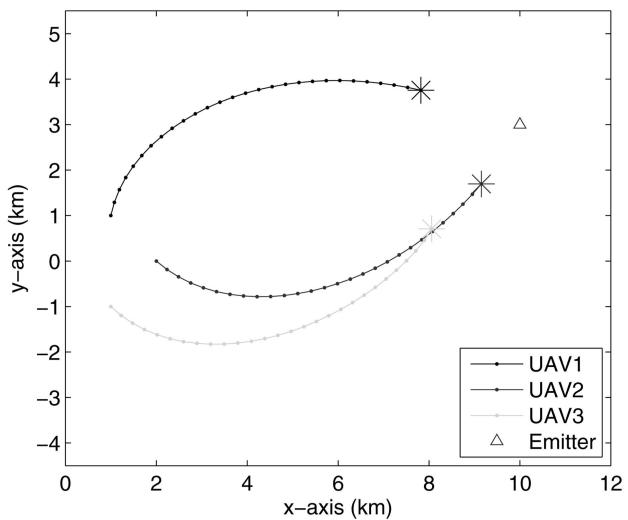  
(a)

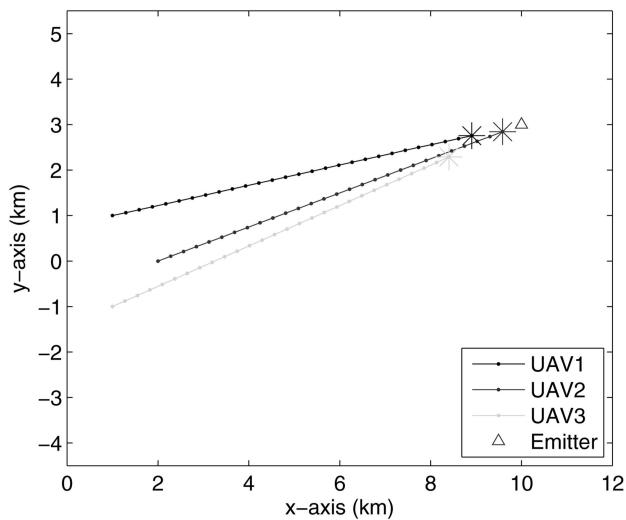  
(b)

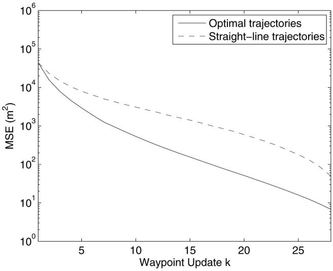  
(c)  
Fig. 5. Path planning for three UAVs with AOA sensors. (a) Optimal paths (final UAV locations are marked with ¤). (b) Straight-line paths. (c) Evolution of MSE for optimal and straight-line paths.

considered. The initialization given by (30) is used to solve the nonlinear optimization problem (46) at each waypoint update.

Figs. 5, 6, and 7 show the optimal UAV paths and the evolution of MSE when all payload sensors are AOA, TDOA, and SC sensors, respectively. To demonstrate the effectiveness of the proposed path planning algorithm, the MSE of optimal trajectories is compared with that of straight-line UAV trajectories, whereby each UAV is steered directly towards the estimated emitter location as illustrated in Fig. 5(b). In the case of three AOA sensors, the optimal sensor placement is given by 60± or 120± (equiangular) separation when the sensors are equidistant from the emitter [27]. For TDOA and SC sensors the 120± separation is the only optimal configuration for N = 3 [28, 15]. The optimal 60± sensor separation results in more compact UAV trajectories for AOA sensors, whereas the 120± separation tends to expand the baseline between the UAVs, as is evident from Figs. 6 and 7. In Fig. 6(a) UAV2 is observed to veer off a straight path in the early stages of the geolocation mission. This can be attributed to the turn rate constraint preventing UAV2 from making sharp turns as would be required by the path planning algorithm to achieve an optimal TDOA localization geometry. Indeed if no turn rate constraints were imposed, UAV2 would do an almost 180± u-turn at k = 4.

The optimal waypoints are calculated until the UAVs “reach” the emitter or the MSE is below a given threshold, whichever occurs first. If there is a requirement to reduce the MSE further, the UAVs may be directed to rotate around the estimated emitter location in an optimal formation such as equiangular separation.

## B. Heterogeneous Payload Sensors

Figs. 8 and 9 show the optimal UAV paths and the evolution of MSE for two heterogeneous sensor mixes SC, SC, AOA and TDOA, TDOA, AOA, respectively.

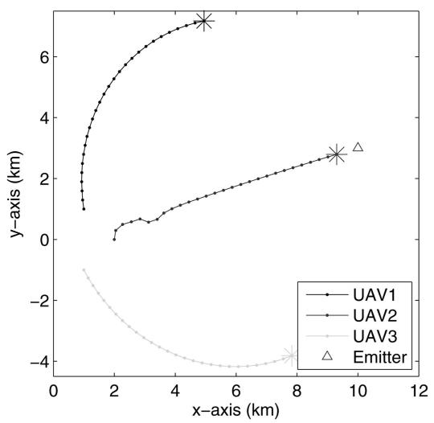  
(a)

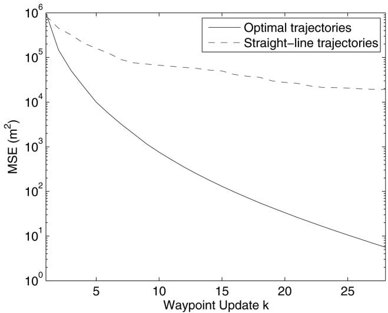  
(b)  
Fig. 6. (a) Optimal UAV paths for TDOA payload sensors (final UAV locations are marked with ). (b) Evolution of MSE for optimal and straight-line paths.

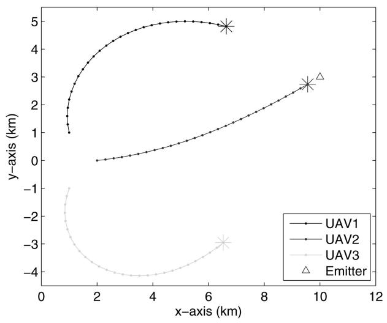  
(a)

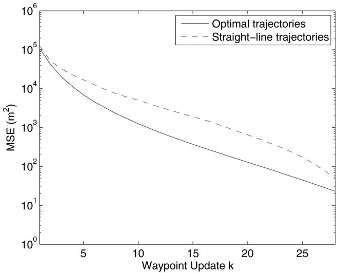  
(b)  
Fig. 7. (a) Optimal UAV paths for SC payload sensors (final UAV locations are marked with ). (b) Evolution of MSE for optimal and straight-line paths.

The optimal UAV trajectories exhibit significant differences for different payload sensor combinations. The SC-SC sensor pair and the TDOA-TDOA sensor pair can be considered to provide an additional bearing line to couple with the bearing line generated by the AOA sensor. Based on this interpretation the optimal sensor configuration would require the two bearing lines to be perpendicular [27]. For the SC-SC pair this is achieved if the two UAVs with SC sensors are collinear with the emitter and the line passing through these UAVs and the emitter is perpendicular to the bearing line emanating from the third UAV. This is roughly what we see in Fig. 8(a). For the TDOA-TDOA pair, similar arguments lead to an optimal configuration where the two UAVs with TDOA sensors are collinear with the emitter and the emitter is the mid-point between these UAVs, creating a bearing line perpendicular to the line passing through these UAVs and the emitter, and the third UAV with the AOA sensor is collocated with either of the two UAVs. The UAV trajectories in Fig. 9(a) roughly represent a geometry of this kind.

## C. Hard Constraints and Turn Rate

In this simulation we consider a geolocation scenario with hard constraints representing circular no-fly zones centred at threat locations ${ \bf { c } } _ { 1 } =$ $[ 4 0 0 0 , 4 0 0 0 ] ^ { \mathrm { T } }$ m and $\mathbf { c } _ { 2 } = [ 8 0 0 0 , - 5 0 0 ] ^ { \mathrm { T } }$ m with clearance distances $\kappa _ { 1 } = 1 0 0 0$ m and $\kappa _ { 2 } = 1 2 0 0$ m. The power loss exponent is assumed to be $\gamma _ { a } = 1$ . The parametric unconstrained minimization problem in (46) is initialized using the low-complexity grid search method described in Section V with the number of angles set to K = 32. Fig. 10 shows the simulated optimal UAV paths and the evolution of the MSE. The hard constraints around the threat locations are successfully avoided by the UAV steering algorithm.

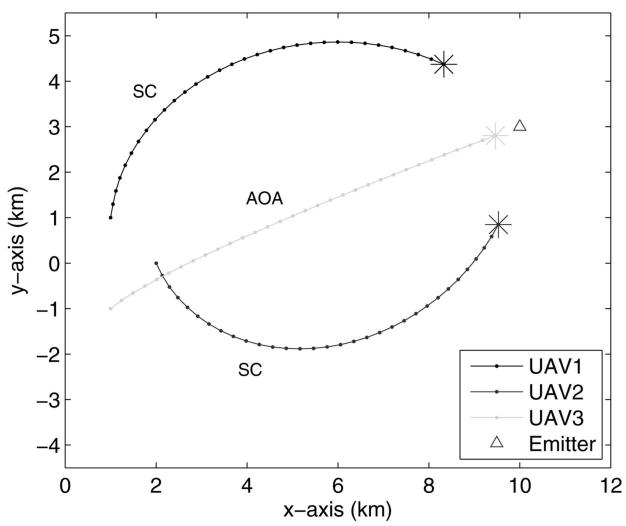  
(a)

  
(b)  
Fig. 8. (a) Optimal paths for UAVs with SC, SC and AOA payload sensors (final UAV locations are marked with ). (b) Evolution of MSE.

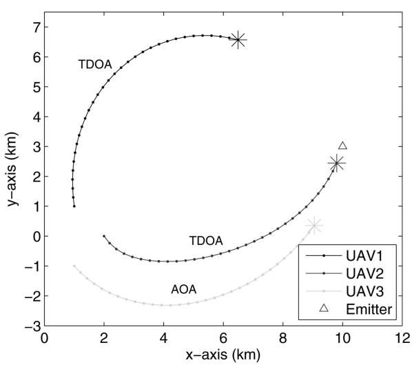  
(a)

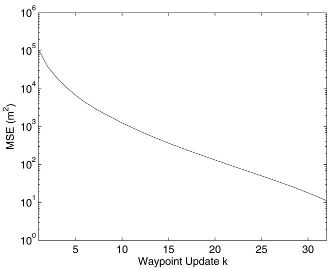  
(b)  
Fig. 9. (a) Optimal paths for UAVs with TDOA, TDOA and AOA payload sensors (final UAV locations are marked with ). (b) Evolution of MSE.

We next illustrate the impact of the turn rate on the achievable clearance from a threat location with a simulation example. The simulated geometry has a single threat at $\mathbf { c } _ { 1 } = [ 5 9 0 0 , 9 9 0 ] ^ { \mathrm { T } }$ m with $\kappa _ { 1 } = 1$ km. All three UAVs have SC sensors and the UAV turn rate is $\varphi = 3 0 ^ { \circ }$ , which is intentionally chosen small in order to make the impact of the turn rate more visible. The simulated optimal UAV trajectories and the evolution of MSE are shown in Fig. 11. According to (49) the effective clearance distance is $\hat { \kappa } _ { 1 } = 0 . 7$ km. The effective hard constraint with clearance $\hat { \kappa } _ { 1 }$ is shown in Fig. 11(b). Evidently the

clearance parameter must be chosen larger than the desired clearance distance in particular if the turn rate is small.

## D. Connectivity Constraints

Fig. 12 shows the simulated UAV paths, inter-UAV distances and the evolution of MSE for a team of UAVs with TDOA, TDOA, and AOA sensors. In this simulation the maximum distance between the UAVs is set to $\rho = 7 0 0 0$ m. There are also two threats at $\mathbf { c } _ { 1 } = [ 5 0 0 0 , 0 ] ^ { \mathrm { T } }$ m and $\mathbf { c } _ { 2 } = [ 8 0 0 0 , - 1 0 0 0 ] ^ { \mathrm { T } }$ m with $\kappa _ { 1 } = 1 0 0 0 ~ \mathrm { m }$ and $\kappa _ { 2 } = 1 2 0 0 ~ \mathrm { m }$ . The low-complexity grid search method with K = 32 is used to initialize (46) at each waypoint update. Figs. 12(a) and (b) confirm that the UAVs obey the inter-UAV distance bound, i.e., the connectivity constraints, while avoiding the hard constraints.

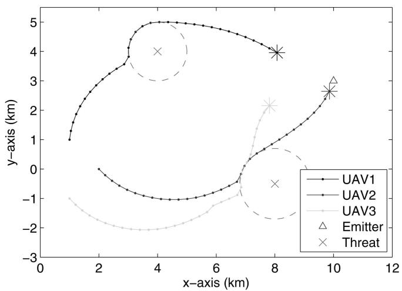  
(a)

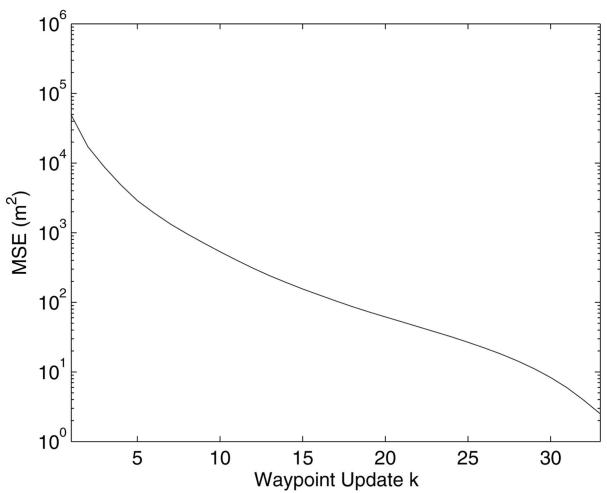  
(b)

Fig. 10. (a) Optimal paths for UAVs with AOA payload sensors in presence of hard constraints (final UAV locations are marked with ). (b) Evolution of MSE.  
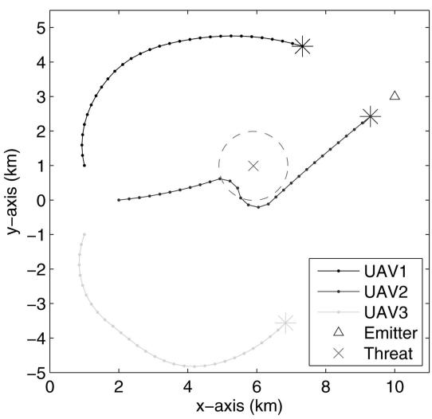  
(a)

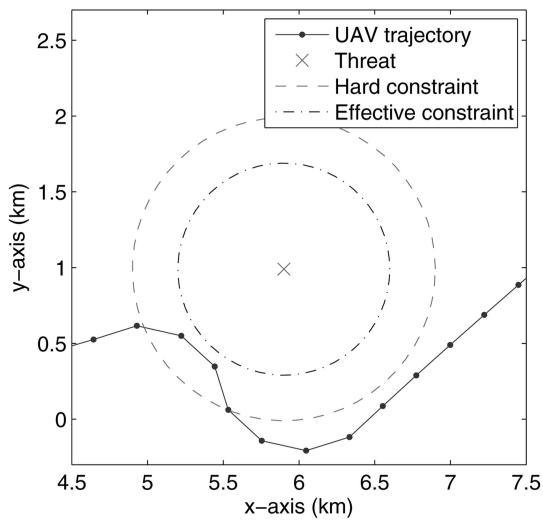  
(b)  
Fig. 11. Impact of turn rate on UAV maneuvers around a hard constraint. (a) Optimal UAV trajectories. (b) Close-up of UAV path around hard constraint $( \kappa _ { 1 } = 1$ km, $\hat { \kappa } _ { 1 } = 0 . 7$ km).

## E. Wind Gust Effects

The UAV flight paths may be disturbed by wind gusts, resulting in position offsets with respect to the waypoints. The effect of wind can be modelled by an additive noise on the waypoints. The noise representing the wind gust is obtained by passing a zero-mean white noise through the Davenport filter [29]. The transfer function of the discrete-time Davenport filter is

$$
H _ { d } ( z ) = \frac { 0 . 1 5 8 4 z ^ { 3 } - 0 . 3 7 6 5 z ^ { 2 } + 0 . 2 7 1 6 z - 0 . 0 5 3 4 } { z ^ { 4 } - 2 . 9 9 5 1 z ^ { 3 } + 3 . 0 8 9 3 z ^ { 2 } - 1 . 1 9 3 0 z + 0 . 0 9 8 8 } .\tag{52}
$$

To simulate the wind gust disturbances for each $\mathrm { U A V } ,$ a correlated Gaussian noise $v _ { i } ( k ) , i =$ $1 , \ldots , N$ , is generated by passing a zero-mean white Gaussian noise with unit variance $n _ { i } ( k )$ through the discrete-time Davenport filter. The wind direction $\phi _ { i } ( k )$ is assumed to be southeasterly with $\pm 1 0 ^ { \circ }$ uniform variation. The additive noise disturbing the UAV positions is given by

$$
\omega _ { i } ( k ) = ( \bar { \upsilon } + \zeta _ { i } v _ { i } ( k ) ) \left[ \begin{array} { c } { { \cos \phi _ { i } ( k ) } } \\ { { \sin \phi _ { i } ( k ) } } \end{array} \right]\tag{53}
$$

where $\bar { \upsilon }$ is the mean wind noise and $\zeta _ { i }$ is a scale factor representing the wind gust strength. The actual UAV positions at time instant k are given by ${ \bf p } _ { i } ( k ) + \omega _ { i } ( k )$ where ${ \bf p } _ { i } ( k )$ is the optimal waypoint for UAV i computed at the previous waypoint.

Fig. 13 shows the effect of wind gust disturbances on the optimal UAV paths and the MSE performance for SC, SC, AOA payload sensors (c.f. Fig. 8). The wind gust parameters are $\bar { v } = 1 0 0$ and $\zeta _ { 1 } = \zeta _ { 2 } = \zeta _ { 3 } =$ 250. We observe that the UAV steering algorithm manages to keep the UAVs on track despite significant wind gust disturbances on the calculated optimal waypoints.

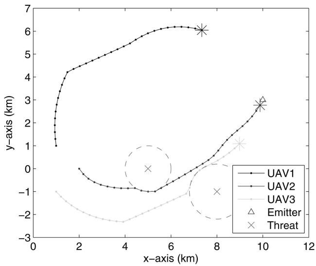  
(a)

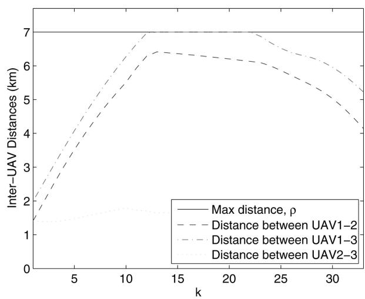  
(b)  
Fig. 12. (a) Optimal paths for UAVs with TDOA, TDOA, AOA sensors in presence of two threats and subject to connectivity constraints (½ = 7 km). (b) Distances between UAVs.

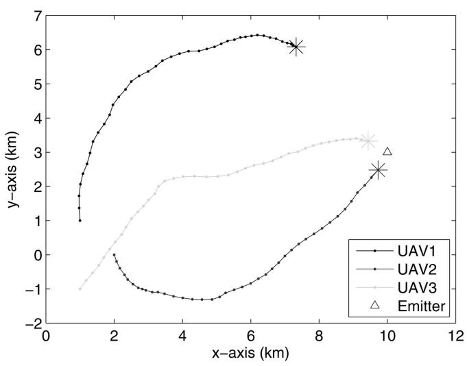  
(a)

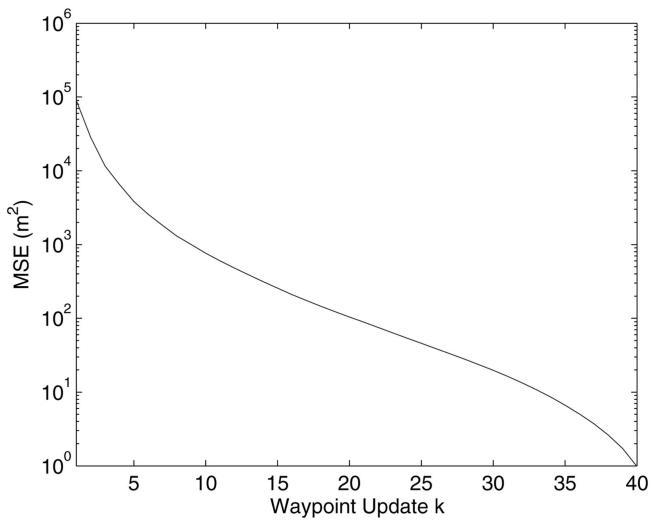  
(b)  
Fig. 13. (a) Optimal UAV paths for SC, SC, AOA payload sensors subject to wind gust disturbances (final UAV locations are marked with ). (b) Evolution of MSE.

## VII. CONCLUSIONS

A UAV steering algorithm was developed for emitter localization using a heterogeneous mix of passive payload sensors. The effectiveness of the proposed steering algorithm was illustrated with several simulation examples. The steering algorithm solves a nonlinear programming problem based on maximizing the determinant of an approximated FIM at each UAV waypoint update to determine the next waypoints. A hybrid MLE and Kalman filter were used to geolocate the emitter. Threat/obstacle avoidance and maximum inter-UAV distance bounds were represented by inequality constraints. UAV turn rate constraints were implemented by imposing a bound on the angular directions of the UAV control vectors in accordance with the UAV heading and the maximum turn rate. The effect of turn rate constraints on hard constraint clearances was also discussed and illustrated with a simulation example.

The proposed steering algorithm is robust in the sense that the steered UAVs do not have to reach the computed waypoints. Indeed if the UAV flight paths are disturbed by wind gust, no accumulation of errors is incurred by the waypoint update process since the waypoint optimization is done for a set of given UAV positions independent of previous waypoints.

The paper has considered myopic path optimization in that the UAV trajectories are optimized over one step of the control vector. A more effective

and yet computationally expensive approach would be multi-step look-ahead optimization [30]. Future work will focus on the reduced complexity realization of multi-step optimization techniques for UAV path optimization.

## REFERENCES

[1] Le Cadre, J-P. and Jauffret, C. Discrete-time observability and estimability analysis for bearings-only target motion analysis. IEEE Transactions on Aerospace and Electronic Systems, 33, 1 (Jan. 1997), 178—201.

[2] Le Cadre, J-P. Optimization of the observer motion for bearings-only target motion analysis. In Proceedings of the 36th Conference on Decision and Control (CDC ’97), San Diego, CA, Dec. 1997, 3126—3131.

[3] Passerieux, J. M. and Van Cappel, D. Optimal observer maneuver for bearings-only tracking. IEEE Transactions on Aerospace and Electronic Systems, 34 (July 1998), 777—788.

[4] Tremois, O. and Le Cadre, J-P. Optimal observer trajectory in bearings-only tracking for manoeuvring sources. IEE Proceedings–Radar, Sonar and Navigation, 146, 1 (Feb. 1999), 31—39.

[5] Oshman, Y. and Davidson, P. Optimization of observer trajectories for bearings-only target localization. IEEE Transactions on Aerospace and Electronic Systems, 35, 3 (1999), 892—902.

[6] Grocholsky, B., Makarenko, A., and Durrant-Whyte, H. Information-theoretic coordinated control of multiple sensor platforms. In Proceedings of the IEEE International Conference on Robotics and Automation (ICRA ’03), vol. 1, Taipei, Taiwan, Sept. 2003, 1521—1526.

[7] Fedorov, V. V. Theory of Optimal Experiments. New York: Academic Press, 1972.

[8] Goodwin, G. C. and Payne, R. L. Dynamic System Identification: Experiment Design and Data Analysis. New York: Academic Press, 1977.

[9] Ucinski, D.´ Optimal Measurement Methods for Distributed Parameter System Identification. Boca Radon, FL: CRC Press, 2005.

[10] Ousingsawat, J. and Campbell, M. E. On-line estimation and path planning for multiple vehicles in an uncertain environment. International Journal of Robust and Nonlinear Control, 14, 8 (2004), 741—766.

[11] Hernandez, M. L. Optimal sensor trajectories in bearings-only tracking. In Proceedings of the 7th International Conference on Information Fusion (FUSION 2004), vol. 2, Stockholm, Sweden, June 2004, 893—900.

[12] Tichavsky, P., Muravchik, C. H., and Nehorai, A.´ Posterior Cramer-Rao bounds for discrete-time nonlinear´ filtering. IEEE Transactions on Signal Processing, 46, 5 (May 1998), 1386—1396.

[13] Geiger, B. R., et al. Optimal path planning of UAVs using direct collocation with nonlinear programming. In Proceedings of the AIAA Guidance, Navigation, and Control Conference, Keystone, CO, Aug. 2006.

[14] Corbets, J. B. and Langelaan, J. W. Parameterized trajectories for target localization using small and micro unmanned aerial vehicles. In Proceedings of the American Control Conference, Seattle, WA, June 2008, 672—677.

[15] Dogan¸² cay, K. Online optimization of receiver trajectories for scan-based emitter localization. IEEE Transactions on Aerospace and Electronic Systems, 43, 3 (July 2007), 1117—1125.

[16] Dogan¸ ² cay, K., et al. Centralized path planning for unmanned aerial vehicles with a heterogeneous mix of sensors. In Proceedings of the International Conference on Intelligent Sensors, Sensor Networks and Information Processing (ISSNIP 2009), Melbourne, Australia, Dec. 2009, 91—96.

[17] Torrieri, D. J. Statistical theory of passive location systems. IEEE Transactions on Aerospace and Electronic Systems, AES-20 (Mar. 1984), 183—198.

[18] Knapp, C. H. and Carter, G. C. The generalized correlation method for estimation of time delay. IEEE Transactions on Acoustics, Speech, and Signal Processing, ASSP-24, 4 (Aug. 1976), 320—327.

[19] Chan, Y. T. and Ho, K. C. A simple and efficient estimator for hyperbolic location. IEEE Transactions on Signal Processing, 42, 8 (Aug. 1994), 1905—1915.

[20] Hmam, H. Scan-based emitter passive localization. IEEE Transactions on Aerospace and Electronic Systems, 43, 1 (Jan. 2007).

[21] Shimshoni, I. On mobile robot localization from landmark bearings. IEEE Transactions on Robotics and Automation, 18, 6 (Dec. 2002), 971—976.

[22] Kay, S. M. Fundamentals of Statistical Signal Processing: Estimation Theory. Upper Saddle River, NJ: Prentice-Hall, 1993.

[23] Nelder, J. A. and Mead, R. A simplex method for function minimization. Computer Journal, 7 (1965), 308—313.

[24] Gustafsson, F. and Gunnarsson, F. Mobile positioning using wireless networks. IEEE Signal Processing Magazine, 22, 4 (July 2005), 41—53.

[25] Bertsekas, D. P. Nonlinear Programming (2nd ed.). Belmont, MA: Athena Scientific, 1999.

[26] Forsgren, A., Gill, P. E., and Wright, M. H. Interior methods for nonlinear optimization. SIAM Review, 44, 4 (2002), 525—597.

[27] Dogan¸ ² cay, K. and Hmam, H. Optimal angular sensor separation for AOA localization. Signal Processing, 88, 5 (May 2008), 1248—1260.

[28] Dogan¸² cay, K. and Hmam, H. On optimal sensor placement for time-difference-ofarrival localization utilizing uncertainty minimization. In Proceedings of the European Signal Processing Conference (EUSIPCO 2009), Glasgow, UK, Aug. 2009, 1136—1140.

Gawronski, W. Modeling wind-gust disturbances for the analysis of antenna pointing accuracy. IEEE Antennas and Propagation Magazine, 46, 1 (Feb. 2004), 50—58.

Tian, X., Bar-Shalom, Y., and Pattipati, K. R. Multi-step look-ahead policy for autonomous cooperative surveillance by UAVs in hostile environments. In Proceedings of the IEEE Conference on Decision and Control (CDC 2008), Cancun, Mexico, Dec. 2008, 2438—2443.

KutluyIl Dogan¸ ² cay (S’90–M’91–SM’01) received the B.S. degree with honors in electrical and electronic engineering from Bogazi¸ ² ci University, Istanbul, Turkey, in 1989, the M.Sc. degree in communications and signal processing from Imperial College, The University of London, London, UK, in 1992, and the Ph.D. degree in telecommunications engineering from The Australian National University, Canberra, A.C.T., Australia, in 1996.

Since November 1999, he has been with the School of Electrical and Information Engineering, University of South Australia, where he is currently an associate professor. His research interests span statistical and adaptive signal processing, and its application to defence and communication systems. He serves as a consultant to defence and private industry in signal processing and communications related projects.

Dr. Dogan¸ ² cay received the 2005—2006 Tall Poppy Science Award of the Australian Institute of Political Science. He was the Signal Processing and Communications Program Chair of the 2007 Information, Decision and Control Conference. He serves on the Editorial Board of the Signal Processing journal of EURASIP and the EURASIP Journal on Advances in Signal Processing. He is a past Chair of the IEEE South Australia Communications and Signal Processing Chapter. He is an elected member of the Signal Processing Theory and Methods (SPTM) Technical Committee and an associate member of the Sensor Array and Multichannel (SAM) Technical Committee of the IEEE Signal Processing Society.