<!-- PDF_PAGE: 001 -->

# On the Time to Search for an Intermittent Signal Source Under a Limited Sensing Range

Dezhen Song, Senior Member, IEEE, Chang-Young Kim, and Jingang Yi, Senior Member, IEEE

Abstract—A mobile robot with a limited sensing range is deployed to search for a stationary target that intermittently emits short duration signals. The searching mission is accomplished as soon as the robot receives a signal from the target. We propose the expected searching time (EST) as a primary metric to evaluate different robot motion plans under different robot configurations. To illustrate the proposed metric, we present two case studies. In the first case, we analyze two common motion plans: a slap method (SM) and a random walk (RW). The EST analysis shows that the SM is asymptotically faster than the RW when the searching space size increases. In the second case, we compare a team of n homogeneous low-cost robots with a super robot that has the sensing range equal to that of the summation of the n robots. Our analysis shows that the low-cost robot team takes Θ(1/n) time, while the super robot takes $\Theta ( 1 / \sqrt { n } )$ time as $n  \infty .$ . Our metrics successfully demonstrate their ability in assessing the searching performance. The analytical results are also confirmed in simulation and physical experiments.

Index Terms—Coverage, intermittent signal source, mobile robots, searching time.

## I. INTRODUCTION

M OBILE robots are often employed to perform searchingtasks, such as finding a black box in a remote area after tasks, such as finding a black box in a remote area after an airplane crash, searching for victims after an earthquake or a mine collapse disaster, or locating artifacts on the ocean floor. In many cases, the target can intermittently emit short duration signals to assist with the search. For example, an airplane black box transmits radio signals periodically. An earthquake victim may knock rubble from time to time. The searching task is accomplished once the robot detects the signal emitted by the target. However, the robot usually has a limited sensing range. It seems straightforward that we can use the traditional coverage-based motion plans to guide the robot to cyclically scan the searching space to locate the target. However, the time to search for the target is inherently random and, hence, remains unknown despite its importance in many searching and rescue applications.

To address this new problem, we propose the expected searching time (EST) as a primary metric to assess the searching ability of a robot or a robot team. We model the searching process as a delayed renewal reward process [1] and derive the EST as a function of the searching space size, the signal transmission rate, and the robot sensing range. The resultant closed-form solution of the metrics can be used to analyze the searching efficiency for different robot configurations and searching plans. Since the model components can be obtained from online measurements and known robot parameters, a great benefit of the resulting model is its capability of predicting the EST for an ongoing searching process. This characteristic is important for time-critical searching and rescue applications. The analytical results are confirmed in simulation and physical experiments.

The rest of the paper is organized as follows. We begin with the related work in Section II. We define the problem in Section III. We derive the EST in a closed form in Section IV. The two case studies are presented in Section V. The analytical results are validated in simulation and physical experiments in Section VI before we conclude the paper.

## II. RELATED WORK

Searching for an object in physical space is one of the most important tasks for robots or humans. When prior information such as the spatial distribution of the target is known, this is comparable with the foraging behavior of animals [2]. For this case, the searching problem is actually a nonlinear optimization problem in operations research [3] with searching time/path length as objective functions. If the searching space is a graph, Trummel and Weisinger show this is an nondeterministic polynomial time-hard problem [4].

However, prior target information is often not available. If the target is continuously emitting signals, just simply scanning the entire searching space once enables the robot to find the target. Since the maximum searching time is the time to cover the entire searching space, the searching problem becomes a coverage problem [5]–[7]. For a known environment, a coverage problem for a single robot often employs different approaches to decompose the searching space and output a continuous path that allows the robot to cover the entire searching space. If the searching space can be modeled as a set of w-disjoint discrete choices, searching for a target with a limited sensing range and w-choice is known as a w-lane cow-path problem [8]. For coverage problems over a small region and considering scene topologies, the problem can be reduced to the art gallery (AG) problem in computational geometry [9], [10]. In Euclidean space, if the coverage strategy is to linearly partition the searching space to form a connected path, this is known as the slap method (SM)

<!-- PDF_PAGE: 002 -->

or the trapezoid method [11], [12]. Independently, this method is regarded as a type of linear search problems in the applied math and operations research societies [13].

While the searching time is well understood for the coverage problems [14], [15], this is not the case when the searching process depends on the signal emitted by the target because the collocation of the robot and the target does not necessarily mean that the target is found. Benkoski et al. [16] classify searching problems into two categories: stationary targets and moving targets. Our problem deals with stationary targets. However, Benkoski’s classification does not include cases that the target emits transmit signals, which is different from the one-sided search on which Benkoski’s classification is based.

Another set of related work is robot exploration and mapping problems, where the environment is not previously known [17]. The task is not only to cover the entire space but to output the true representations of the environment as well. Recent advances in using a multirobot team to perform exploration and mapping tasks mainly focuses on the coordination of the robot/sensor team [18]–[21] under various dynamics, communication, sensing, and energy constraints. Although not directly applicable to our problem, researchers have accumulated interesting empirical results: Using a team of low-cost robots usually performs faster and more fault-tolerant [22] than a single expensive robot (ASER). This really inspires our problem because we want to see if our analytical model can show similar results under similar constraints/conditions.

Our group has built experience in searching for targets that intermittently transmit signals by developing algorithms and systems to detect an unknown wireless sensor network [23]–[25]. In these problems, the robot can accumulate the information about the target location over time through the signal strength readings and antenna models. The searching problem is less difficult because the robot can utilize the information in the planning process. However, such information is often not available in many searching tasks, which is the focus of this paper. This paper extends our previous conference paper [26] by adding spatiotemporal sensory coverage (SSC) metric analysis and physical experiment results.

## III. PROBLEM DEFINITION

As illustrated in Fig. 1, a single robot searches for a single target in a squared 2-D Euclidean space with a side length of $a .$ Let us define $d _ { s }$ as the maximum sensing distance of the sensor on the robot. The robot travels at the constant speed of v. To formulate the problem and focus on the most relevant issues, we make the following assumptions.

1) There is no prior information about possible locations of the target. Therefore, the target is assumed to be uniformly distributed in the searching space.

2) The target transmits short duration signals periodically according to a Poisson process with a known rate $\lambda .$ . The signal duration is short due to energy concerns. A Poisson process is a good approximation to a general random arrival process in stochastic modeling [1]. In some cases, the target may be a continuous beacon, but it is very difficult to be detected due to environment conditions or unreliable sensing, which can also be modeled as a target with intermittent signals.

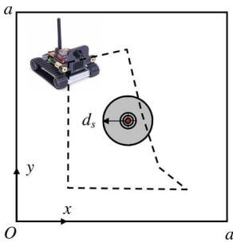  
Fig. 1. Robot attempts to search for a target (the red dot) that intermittently emits short duration signals in a square. The gray circle is the region that the robot can sense the signal from the target. The dashed line is a robot trajectory.

3) During the searching process, the target is static. The searching space is much larger than the sensing distance: $a \gg d _ { s }$

Condition 1 (Sensing condition): The robot cannot sense the signal unless an actively transmitting target is within distance $d _ { s }$ due to the sensing range limit.

As illustrated in Fig. 1, Condition 1 defines a circle centered at the target with the radius of $d _ { s } ,$ , which is the region that robot has a chance to sense the target. We refer to the region as “the circle” in the rest of the paper. Due to the fact that the robot does not know the location of the target, the actual position of the circle in the searching space is also unknown.

Condition 2 (Termination condition): The searching task is accomplished as soon as the robot senses a signal sent by the target.

Condition 2 implies that the robot cannot find an inactive target even it is collocated with the target. For example, an airplane is not be able to notice the survivor on an island if the person does not send a signal (e.g., fire or smoke). However, only one signal reception is needed in the searching process. Conditions 1 and 2 establish a new type of searching problem as oppose to a regular coverage problem. Let us define $T _ { s }$ as the searching time for the robot to find the target. Therefore, our problem is defined as follows.

Problem Statement 1 (EST computation): Given $\lambda , d _ { s }$ , and a, calculate the EST $E ( T _ { s } )$ , where $E ( \cdot )$ denotes the expected value function.

## IV. MODELING

One immediate question about Problem Statement 1 is whether we can obtain the EST without referring to or being limited to a particular motion plan. To address this dependency, we first characterize the motion plans based on their outcomes before modeling the EST.

## <!-- PDF_PAGE: 003 -->

A. Renewal Process and Characterizing Planners

Periodically, the robot trajectory planner outputs a motion plan and the robot executes the plan during the searching process. The system is naturally a repetitive scanning process during which the robot enters and leaves the circle until Condition 1 is satisfied. During the probabilistic nature, the process is a random process with a stopping time.

The repetitiveness in coverage can be modeled as a renewal process [1]. Letting interarrival time $X _ { m }$ denote the time between the $( m - 1 ) \mathrm { s t }$ and mth event, a renewal process can be viewed as a generalization of Poisson process with $\{ X _ { m } , m = 1 , 2 , \ldots \}$ being independently and identically distributed $( i . i . d . )$ random variables. Note that the distributions of $X _ { m }$ can be any type but must be i.i.d.

To facilitate our analysis, we partition the continuous trajectory of the robot into many repetitive i.i.d. tours.

Definition 1: A tour starts or restarts at the moment when the robot first enters the target circle during the single independent scanning.

The dashed line in Fig. 1 illustrates a tour. Tours may be quite different depending upon the planner. For example, tour length varies each time if the robot follows a random walk (RW). As another example, a deterministic planner usually has a fixed tour trajectory. An event happens when each tour starts. The tour length are the interarrival time of events.

Based on Condition 2, we know that the robot does not accumulate the knowledge regarding the target location from one tour to another tour because no signal has been perceived before the moment the searching mission is accomplished. Note that a tour can contain multiple intersections with the circle in a general case. Tour definition is a way of partitioning the trajectory and does not have to be synchronized exactly with how the robot planner works. Hence, each tour length is i.i.d. as long as the motion planner does not change its planning algorithm. Therefore, the searching process as a renewal process.

During each tour, the robot spends some time inside the circle and some time outside the circle, which are defined as $\tau _ { \mathrm { I N } }$ and τ , respectively. Hence, $\tau _ { \mathrm { I N } } + \tau _ { \mathrm { O U T } }$ is the overall duration for the tour.

The characteristics of renewal process allows us to compute its limiting properties by focusing on individual periods. For example, we immediately know that the long run probability of being inside the circle is $\tau _ { \mathrm { I N } } / ( \tau _ { \mathrm { I N } } + \tau _ { \mathrm { O U T } } )$ from the property of renewal processes.

If the trajectory only intersects the circle once in each period, when a tour begins, the robot first spends $\tau _ { \mathrm { I N } }$ inside the circle followed $\tau _ { \mathrm { O U T } }$ outside the circle. This yields an alternating renewal process. If there are many intersections between the circle and the tour, then $\tau _ { \mathrm { I N } }$ and τOUT are not two continuous time segments but a summation of many fragmented segments, which can be computed by conditioning on the number of intersections. For simplicity of analysis and due to the limited space, we will focus on the single intersection case in the rest of paper. Readers can follow our methods to analyze multiple intersection cases.

## B. Modeling the EST

Without loss of generality, we assume the robot starts the searching process from the origin which is on the boundaries of the searching space. It takes some time to reach the circle where the first tour starts. Let us define the time as delay D. From Conditions 1 and 2, we know that the robot cannot find the target in D. The searching process is a delayed alternating renewal process. Define $T _ { s } ^ { c }$ as the time to find the target after the robot enters the repetitive tours. Hence, the EST is as follows:

$$
E ( T _ { s } ) = E ( D ) + E ( T _ { s } ^ { c } ) .\tag{1}
$$

Define N as the number of signal transmissions during τIN in a tour. Since the arrival process of the signal transmission is Poisson, N conforms to a Poisson distribution

$$
P ( N = k ) = \frac { e ^ { - \lambda \tau _ { \mathrm { I N } } } ( \lambda \tau _ { \mathrm { I N } } ) ^ { k } } { k ! } , k = 0 , 1 , 2 , . . . , \infty .\tag{2}
$$

We know that event $N > 0$ means that at least one signal transmission happens during $\tau _ { \mathrm { I N } }$ . This means the target is found. Therefore, we can compute $E ( T _ { s } ^ { c } )$ by conditioning on N

$$
E ( T _ { s } ^ { c } ) = E ( T _ { s } ^ { c } | N > 0 ) P ( N > 0 ) + E ( T _ { s } ^ { c } | N = 0 ) P ( N = 0 )\tag{3}
$$

where $P ( N > 0 ) = 1 - e ^ { - \lambda \tau _ { \mathrm { I N } } }$ and $P ( N = 0 ) = e ^ { - \lambda \tau _ { \mathrm { I N } } }$ according to (2). Note that $N < 0$ is not possible due to the fact that N is a counting variable.

Now let us compute $E ( T _ { s } ^ { c } | N > 0 )$ . Since event $N > 0$ is equivalent to event $T _ { s } ^ { c } \le \tau _ { \mathrm { I N } }$ , we have

$$
E ( T _ { s } ^ { c } | N > 0 ) = E ( T _ { s } ^ { c } | T _ { s } ^ { c } \leq \tau _ { \mathrm { I N } } ) = \frac { 1 } { \lambda } - \frac { \tau _ { \mathrm { I N } } e ^ { - \lambda \tau _ { \mathrm { I N } } } } { 1 - e ^ { - \lambda \tau _ { \mathrm { I N } } } }\tag{4}
$$

because the conditional distribution $T _ { s } ^ { c } | T _ { s } ^ { c } \leq \tau _ { \mathrm { I N } }$ is a truncated exponential distribution [1], [27]. It is worth noting that (4) is valid only if $\tau _ { \mathrm { I N } } > 0$ , which is guaranteed according to Definition 1. However, we know

$$
E ( T _ { s } ^ { c } | N = 0 ) = \tau _ { \mathrm { I N } } + \tau _ { \mathrm { O U T } } + E ( T _ { s } ^ { c } )\tag{5}
$$

because the robot cannot find the inactive target in the current tour and has to start all over again in next tour.

Plugging (4) and (5) into (3) and (1), we have the following result.

Theorem 1: Given the expected time $E ( D )$ for the robot to reach the circle, the Poisson arrival rate λ of target signals, the traveling time $\tau _ { \mathrm { I N } }$ inside the circle, and the traveling time τOUT outside the circle, then the EST of the target is as follows:

$$
E ( T _ { s } | \tau _ { \mathrm { I N } } , \tau _ { \mathrm { O U T } } ) = E ( D ) + \frac { 1 } { \lambda } + \tau _ { \mathrm { O U T } } \frac { e ^ { - \lambda \tau _ { \mathrm { I N } } } } { 1 - e ^ { - \lambda \tau _ { \mathrm { I N } } } } .\tag{6}
$$

This is a conditional expectation because $\tau _ { \mathrm { I N } }$ and $\tau _ { \mathrm { O U T } }$ are often random variables. Since $E ( D )$ and λ are independent of $\tau _ { \mathrm { I N } }$ and $\tau _ { \mathrm { O U T } }$ , the unconditional EST can be obtained as follows:

$$
E ( T _ { s } ) = E ( D ) + \frac { 1 } { \lambda } + E \left( \tau _ { \mathrm { O U T } } \frac { e ^ { - \lambda \tau _ { \mathrm { I N } } } } { 1 - e ^ { - \lambda \tau _ { \mathrm { I N } } } } \right) .\tag{7}
$$

The formulation of EST given in Theorem 1 has a surprisingly succinct format revealing the relationship between the

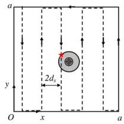

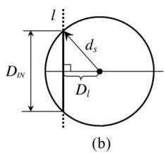  
(a)  
<!-- PDF_PAGE: 004 -->

Fig. 2. (a) Sample motion plan for the SM. (b) How a tour (line l) intersects the circle of the target.

EST and the corresponding variables. To further explain (7), let us consider the following extreme cases.

Case 1: When $\lambda \to \infty$ , it means that the target continuously transmits signals. The searching time becomes the time that it takes for the robot to enter the circle. The problem degenerates to the traditional coverage problem, where $E ( T _ { s } ) = E ( D )$

Case 2: When $\tau _ { \mathrm { { O U T } } } = 0 .$ , it means that the signal emitted by the target is so powerful that the circle defined by $d _ { s }$ can cover the entire searching space. In this case, $E ( D ) = 0$ . Hence, $E ( T _ { s } ) = 1 / \lambda$ , the mean interarrival time of signals. The robot finds the target as soon as the target emits a signal.

Remark 1: It is worth noting that (7) does not depend on a particular motion plan or the shape/dimension of the searching space, which makes it widely applicable in practice. Indeed, the EST can be also applied to analyze searching tasks carried by humans. In many cases, the signal transmission rate λ is known; $E ( D )$ can be estimated based on observations; τ can be estimated based on $d _ { s }$ and v; and $\tau _ { \mathrm { O U T } }$ can be measured based on observations that how often a robot would revisit a region with the same size of the circle. Based on the known information and online measurements, we can even predict the EST for an ongoing searching process regardless its motion plan, which is of great importance in applications, where the searching time literally means life or death.

## V. ANALYSIS OF COMMON SEARCHING STRATEGIES

Theorem 1 can be used to analyze the searching performance under different robot motion plans and configurations. We begin with demonstrating how Theorem 1 can reveal the difference between two motion plans from common coverage methods: the SM and the RW.

## A. Slap Method Versus the Random Walk

1) Slap Method: Also known as the trapezoidal decomposition [11], [12] in robotics research, SM sequentially scans the entire searching space back and forth. Fig. 2(a) illustrates the robot motion plan for the square case. The plan is a set of y-axis parallel lines [appears as vertical lines in Fig. 2(a)] that cover the entire searching space. The vertical lines are interconnected using the boundaries of the searching space to formulate a complete tour. To guarantee an intersection between the circle and the tour, the distance between adjacent vertical lines is set to be $2 d _ { s }$

The red $\ " { \star } \ "$ in Fig. 2(a) indicates the starting point of the tour. Since tours are exactly the same in the SM, the subsequent tours start exactly at the same location. The overall tour length is approximately $a ^ { 2 } / ( 2 d _ { s } )$ . Given the robot speed v, it takes

$$
\tau _ { \mathrm { I N } } + \tau _ { \mathrm { O U T } } \approx \frac { a ^ { 2 } } { 2 v d _ { s } }\tag{8}
$$

time for the robot to finish the tour. Since the target could be anywhere in the searching space with equal probabilities, we obtain

$$
E ( D ) \approx \frac { \left( \tau _ { \mathrm { I N } } + \tau _ { \mathrm { O U T } } \right) } { 2 } = \frac { a ^ { 2 } } { 4 v d _ { s } } .\tag{9}
$$

To use the result in Theorem 1, the remaining undetermined variable is $\tau _ { \mathrm { I N } }$ . Let us define $D _ { \mathrm { I N } }$ as the distance traveled inside the circle. $D _ { \mathrm { I N } }$ is the length of intersection when the line intersects the circle, as illustrated in Fig. 2(b). Here, we ignore the boundary effect, where the circle is not a full circle because $a \gg d _ { s }$ . Line l in Fig. 2(b) is a part of the tour. When l intersects the circle, we define $D _ { l }$ as the distance between the center of the circle and the line. Since the target is uniformly distributed in the $2 { \cdot } \mathrm { D }$ space, $D _ { l } \sim U ( 0 , d _ { s } )$ is uniformly distributed. From Fig. 2(b), we know

$$
\tau _ { \mathrm { I N } } = \frac { D _ { \mathrm { I N } } } { v } = \frac { 2 \sqrt { d _ { s } ^ { 2 } - D _ { l } ^ { 2 } } } { v } .\tag{10}
$$

Plugging (8)–(10) into (7) and conditioning on $D _ { l }$ , we have

$$
E ( T _ { s } | D _ { l } ) \approx \frac { a ^ { 2 } } { 4 v d _ { s } } + \frac { 1 } { \lambda } + \left( \frac { a ^ { 2 } } { 2 v d _ { s } } - \frac { 2 \sqrt { d _ { s } ^ { 2 } - D _ { l } ^ { 2 } } } { v } \right) \phi ( \lambda , D _ { l } )
$$

where

(11)

$$
\phi ( \lambda , D _ { l } ) = \frac { 1 } { e ^ { 2 \lambda \sqrt { d _ { s } ^ { 2 } - D _ { l } ^ { 2 } } / v } - 1 } .\tag{12}
$$

Since $a \gg d _ { s } , \tau _ { \mathrm { O U T } } \gg \tau _ { \mathrm { I N } }$ , and $2 \sqrt { d _ { s } ^ { 2 } - D _ { l } ^ { 2 } } / v$ is negligible if compared with $a ^ { 2 } / 2 v d _ { s }$ , we have

$$
E ( T _ { s } | D _ { l } ) \approx \frac { a ^ { 2 } } { 4 v d _ { s } } + \frac { 1 } { \lambda } + \frac { a ^ { 2 } } { 2 v d _ { s } } \phi ( \lambda , D _ { l } ) .\tag{13}
$$

Hence, we have the EST for the SM

$$
\begin{array} { c } { { E ( T _ { s } ) = \displaystyle \int _ { \delta = 0 } ^ { d _ { s } } E ( T _ { s } | D _ { l } = \delta ) \frac { 1 } { d _ { s } } d \delta } } \\ { { \approx \displaystyle \frac { a ^ { 2 } } { 4 v d _ { s } } + \frac { 1 } { \lambda } + \frac { a ^ { 2 } } { 2 v d _ { s } } g ( d _ { s } , \lambda ) } } \end{array}
$$

where

$$
g ( d _ { s } , \lambda ) = E ( \phi ( \lambda , D _ { l } ) ) = \int _ { \delta = 0 } ^ { d _ { s } } \frac { 1 } { d _ { s } } \phi ( \lambda , \delta ) d \delta .\tag{15}
$$

Let $\delta = d _ { s }$ cos $\theta ,$ , we can transform (15) into

$$
g ( d _ { s } , \lambda ) = \int _ { \theta = 0 } ^ { \pi / 2 } \frac { 1 } { e ^ { 2 \lambda d _ { s } \sin \theta / v } - 1 } \sin \theta d \theta .\tag{16}
$$

When λ and $d _ { s } / \imath$ v are very small, (15) can be further simplified

$$
g ( d _ { s } , \lambda ) \approx \frac { \pi v } { 4 \lambda d _ { s } } - 1 .\tag{17}
$$

Remark 2: Equation (14) suggests that a fast robot (large v) with great sensing distance $d _ { s }$ reduces the EST. This conclusion agrees with our intuition that mobility and sensing are the key elements in searching. However, it also takes the target’s cooperation to further reduce the EST. When the robot reaches its speed and sensing limit, the only way to reduce EST is to increase λ. Of course, the target usually has energy constraints and cannot arbitrarily increase λ.

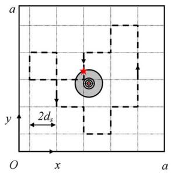  
(a)

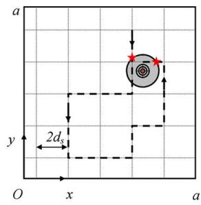  
(b)  
<!-- PDF_PAGE: 005 -->

Fig. 3. Robot motion plan based on a 2-D lattice-based RW. Two types of tours are illustrated here. (a) Closed tour. (b) Unclosed tour.

The analysis assumes the distance between vertical lines is $2 d _ { s } ,$ , which ensures there is only one intersection between the circle and the tour. When a smaller spacing is used, the overall tour length increases, and so does τIN . The analysis is slightly more complicated because it needs to be conditioned on the number of intersections between the tour and the circle. The results actually share a similar format with (13) and the same asymptotic properties with respect to a, v, and λ. Since our focus is to compare the asymptotic behavior of the SM with that of the RW, we omit the analysis here.

In the earlier calculation, we ignore the boundary effect on the final result. When the circle is located at the boundary of the square, distance $D _ { \mathrm { I N } }$ cannot be computed using (10). Since the target has to be located within $d _ { s }$ distance of the boundary for the boundary case, the probability that such an event happens is less than $4 d _ { s } a / a ^ { 2 } = 4 d _ { s } / a \ll 1$ , since $d _ { s } \ll a .$ Hence, its impact to the final EST is negligible because $D _ { \mathrm { I N } }$ for such a case is not significantly different from that of the nonboundary case. Therefore, we will ignore boundary effect in the rest of the paper.

2) Random Walk: Another popular motion plan is to employ a 2-D RW to traverse the searching space. As illustrated in Fig. 3, we partition the entire searching space using a 2-D finite lattice with a spacing of $2 d _ { s }$ in each dimension. Denoting $N _ { s }$ as the number of lattice nodes, we have $N _ { s } = a ^ { 2 } / 4 d _ { s } ^ { 2 }$ nodes. A finer lattice is possible but usually associated with higher energy cost because the robot has to make a lot more turns.

The robot always moves from one lattice node to its neighboring node with equal probabilities. The robot does not cross the boundaries. According to [28], this is a finite 2-D lattice with reflective boundaries. Recall that a tour starts at the moment the robot enters the circle. Since the robot might not enter the circle at the exactly same location in different tours, each tour is not necessarily a completely closed curve as that in the SM case. The closed curve tour in Fig. 3(a) only happens with a probability of $1 / 4 .$ , whereas the unclosed tour in Fig. 3(b) has a probability of $3 / 4$

To compute the EST given in (7), we need to compute $E ( D )$ Recall that the robot always starts at origin. Given the location of target $( X _ { t } , Y _ { t } )$ , computing the mean time that it takes the robot to follow the RW to reach a particular location $( X _ { t } , Y _ { t } )$ is the mean first passage time (MFPT) [29], [30] problem in stochastic modeling. The exact solution to this problem is expressed in the format of pseudo-Green functions and cannot be explicitly analyzed. Since $a \gg d _ { s }$ , there are a large number of nodes $a ^ { 2 } / 4 d _ { s } ^ { 2 }$ in the 2-D lattice, and each robot move takes $2 d _ { s } / v$ time. Hence, we can apply the recent results of MFPT using its asymptotic format in [31]

$$
E ( D | X _ { t } , Y _ { t } ) \approx { \frac { a ^ { 2 } } { 2 v d _ { s } } } \bigg ( \alpha _ { 0 } + \alpha _ { 1 } \ln \sqrt { X _ { t } ^ { 2 } + Y _ { t } ^ { 2 } } \bigg )\tag{18}
$$

where $\alpha _ { 0 }$ and $\alpha _ { 1 }$ are constants and can be determined by Monte Carlo methods. According to [31], $\alpha _ { 0 }$ and $\alpha _ { 1 }$ strikingly do not depend on lattice size but on local transitional properties. Hence

$$
E ( D ) = \int _ { 0 } ^ { a } \int _ { 0 } ^ { a } E ( D | X _ { t } = x , Y _ { t } = y ) { \frac { 1 } { a ^ { 2 } } } d x d y\tag{19}
$$

$$
\approx \frac { \alpha _ { 0 } a ^ { 2 } } { 2 v d _ { s } } + \frac { \alpha _ { 1 } } { 2 v d _ { s } } \int _ { 0 } ^ { a } \int _ { 0 } ^ { a } \ln { \sqrt { x ^ { 2 } + y ^ { 2 } } } d x d y .\tag{20}
$$

Since

$$
\int _ { 0 } ^ { a } \int _ { 0 } ^ { a } \ln \sqrt { x ^ { 2 } + y ^ { 2 } } d x d y = a ^ { 2 } \ln a + \frac { \pi + 2 \ln 2 - 6 } { 4 } a ^ { 2 }
$$

we have

$$
E ( D ) \approx \frac { a ^ { 2 } } { 2 v d _ { s } } \bigg ( \alpha _ { 0 } + \alpha _ { 1 } \ln a + \alpha _ { 1 } \frac { \pi + 2 \ln 2 - 6 } { 4 } \bigg ) .\tag{21}
$$

The remaining unknown term in (7) is $E ( \tau _ { \mathrm { { O U T } } } ( e ^ { - \lambda \tau _ { \mathrm { { I N } } } } ) /$ $( 1 - e ^ { - { \lambda \tau _ { \mathrm { I N } } } } ) )$ Given the robot speed $v , \tau _ { \mathrm { I N } }$ is uniquely determined by the distance in the circle $D _ { \mathrm { I N } }$ , which is independent of the overall trajectory. In addition, $E ( \tau _ { \mathrm { O U T } } ) \approx E ( \tau _ { \mathrm { O U T } } + \tau _ { \mathrm { I N } } )$ given that $a \gg d _ { s }$ . Hence

$$
E \left( \tau _ { \mathrm { O U T } } \frac { e ^ { - \lambda \tau _ { \mathrm { I N } } } } { 1 - e ^ { - \lambda \tau _ { \mathrm { I N } } } } \right) \approx E ( \tau _ { \mathrm { O U T } } + \tau _ { \mathrm { I N } } ) E \left( \frac { e ^ { - \lambda \tau _ { \mathrm { I N } } } } { 1 - e ^ { - \lambda \tau _ { \mathrm { I N } } } } \right) .\tag{22}
$$

Since the 2-D lattice-based RW is undirected and symmetric in transitional probability, from [32], we know that the stationary probability of visiting node i is $\pi _ { i } = n _ { d } ( i ) / 2 m _ { e }$ , where $n _ { d } ( i )$ is the degrees of freedom of node i and $m _ { e }$ is the total number of edges in the lattice. For a nonboundary node, $n _ { d } ( i ) = 4$ and $m _ { e } \approx 4 N _ { s }$ . Hence

$$
\pi _ { i } = \frac { 1 } { N _ { s } } = \frac { 4 d _ { s } ^ { 2 } } { a ^ { 2 } } .
$$

Without loss of generality, we assume node i is the node closest to the target. This means that $\pi _ { i }$ is the long run probability that the robot intercepts the circle. Let $( x _ { i } , y _ { i } )$ be the node $i \mathrm { \ ' } _ { \mathrm { s } }$ position. Given node i is the nearest node to the target and recall target location is $( X _ { t } , Y _ { t } )$ , then we know $| x _ { i } - X _ { t } | \leq d _ { s }$ and $| y _ { i } - Y _ { t } | \le d _ { s }$ based on the lattice definition. Therefore, the conditional probability that the robot is inside the circle, given that node i is visited, is the area ratio between the circle and the square with a side length of $2 d _ { s } \colon p _ { c | i } = \pi d _ { s } ^ { 2 } / 4 d _ { s } ^ { 2 } = \pi / 4$ because the target is uniformly distributed in the searching space. Hence, the unconditional long run probability that the robot stays inside the circle is $p _ { c } = p _ { c | i } \pi _ { i } = \pi d _ { s } ^ { 2 } / a ^ { 2 }$

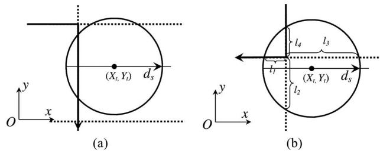  
<!-- PDF_PAGE: 006 -->

Fig. 4. How the robot trajectory in solid line intersects the circle. (a) Scenario 1) When the nearest lattice point on tour is located outside the circle. (b) Scenario 2) When the nearest lattice point on tour is located inside the circle. The dashed line in the figure is part of the lattice.

We can obtain the same long run probability using the renewal-reward theorem [1] if we view $\tau _ { \mathrm { I N } }$ as the reward function for each period

$$
\frac { E ( \tau _ { \mathrm { I N } } ) } { E ( \tau _ { \mathrm { O U T } } + \tau _ { \mathrm { I N } } ) } = p _ { c } = \frac { \pi d _ { s } ^ { 2 } } { a ^ { 2 } } .\tag{23}
$$

Plugging (23) into (22), we have

$$
E \left( \tau _ { \mathrm { 0 U T } } \frac { e ^ { - \lambda \tau _ { \mathrm { I N } } } } { 1 - e ^ { - \lambda \tau _ { \mathrm { I N } } } } \right) \approx \frac { a ^ { 2 } } { \pi d _ { s } ^ { 2 } } E ( \tau _ { \mathrm { I N } } ) E \left( \frac { e ^ { - \lambda \tau _ { \mathrm { I N } } } } { 1 - e ^ { - \lambda \tau _ { \mathrm { I N } } } } \right)\tag{24}
$$

Now, we focus on the computation of $\tau _ { \mathrm { I N } }$ . Since the lattice has a spacing of $2 d _ { s }$ , two scenarios exist when the tour on the lattice intersects the circle: 1) The next lattice point on the tour is inside the circle, and 2) the next lattice point on the tour is outside the circle, as illustrated in Fig. 4. Let us define events that scenarios 1) and 2) happen as events $E _ { i }$ and $E _ { o }$ , respectively. Since the circle center is uniformly located in the searching space

$$
P ( E _ { i } ) = \frac { \pi d _ { s } ^ { 2 } } { 4 d _ { s } ^ { 2 } } = \frac { \pi } { 4 } = 1 - P ( E _ { o } ) .\tag{25}
$$

When event $E _ { o }$ happens, we know that the robot trajectory intersects the circle as a straight line, as shown in Fig. 4(a). Hence, we have

$$
\tau _ { \mathrm { I N } } | E _ { o } = \frac { D _ { \mathrm { I N } } } { v }\tag{26}
$$

where $D _ { \mathrm { I N } }$ is defined in (10), and the right side of | is the condition for the equality to be true. This is a notation convention widely used in stochastic modeling [1]

$$
E ( \tau _ { \mathrm { I N } } | E _ { o } ) = \frac { \pi d _ { s } } { 2 v }\tag{27}
$$

$$
E \left( \frac { e ^ { - \lambda \tau _ { \mathrm { I N } } } } { 1 - e ^ { - \lambda \tau _ { \mathrm { I N } } } } | E _ { o } \right) = g ( d _ { s } , \lambda ) .\tag{28}
$$

When event $E _ { i }$ happens, one lattice point is inside the circle. As illustrated in Fig. 4(b), the lattice point inside the circle partitions the lattice edges inside the circle into four parts: $l _ { 1 } , l _ { 2 } , l _ { 3 }$ and $l _ { 4 }$ . When a robot trajectory intersects the circle, the part of the trajectory inside the circle can be divided into two segments, which are defined as $L ^ { \prime }$ and $L ^ { \prime \prime }$ , respectively. $L ^ { \prime }$ refers to the segment that the robot takes to arrive at the lattice node and $L ^ { \prime \prime }$ refers to the segment that the robot takes to leave the circle. Hence

$$
\tau _ { \mathrm { I N } } | E _ { i } = \frac { L ^ { \prime } + L ^ { \prime \prime } } { v } .
$$

Since $L ^ { \prime }$ and $L ^ { \prime \prime }$ have equal probabilities to take $l _ { 1 } , l _ { 2 } , l _ { 3 }$ , and $l _ { 4 }$ there is a total of $2 ^ { 4 } = 1$ 6 combinations. Conditioning on the 16 $( L ^ { \prime } , L ^ { \prime \prime } )$ combinations and the circle center location $( X _ { t } , Y _ { t } )$ , we obtain the same results, as shown in (27) and (28). Combining those results for the $E _ { i }$ and $E _ { o }$ events by conditioning on them, we have the unconditional expected values $E ( \tau _ { \mathrm { I N } } )$ and $E \left( e ^ { - \lambda \tau _ { \mathrm { I N } } } / ( 1 - e ^ { - \lambda \tau _ { \mathrm { I N } } } ) \right)$ coincidentally sharing the same formats, as in (27) and (28), respectively. Plugging the two expectations, (21) and (24) into (7), we can obtain the EST for the RW case

$$
\begin{array} { c } { { E ( T _ { s } ) \approx \displaystyle \frac { a ^ { 2 } } { 2 v d _ { s } } \bigg ( \alpha _ { 0 } + \alpha _ { 1 } \ln a + \alpha _ { 1 } \frac { \pi + 2 \ln 2 - 6 } { 4 } \bigg ) } } \\ { { + \displaystyle \frac { 1 } { \lambda } + \frac { a ^ { 2 } } { 2 d _ { s } v } g ( d _ { s } , \lambda ) . } } \end{array}\tag{29}
$$

Comparing (29) with (14), we have the following conclusion. Corollary 1: With the same square field side length $^ { a , }$ the sensing range $d _ { s }$ , and the signal transmission rate λ, the EST value of the SM is asymptotically smaller than that of the RW when $a  \infty$

Proof: It is straightforward because $E ( T _ { s } ) = \Theta ( a ^ { 2 } )$ for the SM from (14), while $E ( T _ { s } ) = \Theta ( a ^ { 2 }$ ln a) for the RW according to (29).

So far, our analysis are limited to cases in open 2-D Euclidean space. It is possible to extend the analysis to more general cases if certain conditions are satisfied.

Remark 3: For 2-D space with obstacles: The 2-D space must be fully connected. The trajectory generated by motion planner should ensure the uniform coverage of the searching space for the SM. For the RW, the lattice may not be regularly shaped as in the paper. To ensure the long run uniform coverage, the transitional probability at each node should be symmetric. These conditions are common in many search tasks. When the conditions are satisfied, then both Theorem 1 and Corollary 1 hold.

Remark 4: For 3-D cases: The target circle becomes the target ball. Theorem 1 can be directly applied to 3-D cases, but the analysis of the SM and the RW needs to be modified. For example, the searching space size should be measured by its volume instead of its area. The results for the 3-D SM and the 3-D RW are different, but the overall approach should be similar. The extension should be straightforward. Since most searching tasks are 2-D, we focus on 2-D cases in this paper.

Note that although slower than that of the SM, RW-based methods have memoryless property and do not require complex coordination and communication, which results in more and cheaper robots. A comparison between cheap robot team and ASER is the next goal.

## <!-- PDF_PAGE: 007 -->

B. Analysis of Different Robot Configurations

Theorem 1 can also be used to analyze cases under different robot configurations. Here, we compare two configurations:

1) Low-cost robot team case: We have n identically configured low-cost robots. To coordinate the searching, we partition the searching space into n subsquare fields with an area of $a ^ { 2 } / n$ each and allocate one robot for each subsquare field.

2) A single expensive robot case: We have an expensive robot equipped with a highly capable sensor that has a sensing area equal to the combination of those of the n low-cost robots. If each of the low-cost robot has a sensing range of $d _ { s }$ , then the area of the combined sensing region for n robots is $n \pi d _ { s } ^ { 2 }$ provided that there is no overlap of sensing region between any two robots. Therefore, the sensing distance for the expensive robot is set to $d _ { s } ^ { \prime } = \sqrt { n } d _ { s }$ to ensure ASER has the area of sensing coverage that is no less than that of low-cost robot team (LCRT) at any given time.

We are now ready to compare these two robot configurations. Since the SM is asymptotically faster than the RW, we build on the SM results in (29). For the LCRT, only one robot actually has the target in its subfield. Hence, the rest of $n - 1$ robots are irrelevant in the searching process. Compared with the original EST in (29), we just need to replace a with $a / \sqrt { n }$ . Defining the searching time for the LCRT as $T _ { s } ^ { \prime } ,$ , we have

$$
E ( T _ { s } ^ { \prime } ) \approx { \frac { a ^ { 2 } } { 4 v n d _ { s } } } + { \frac { 1 } { \lambda } } + { \frac { a ^ { 2 } } { 2 v n d _ { s } } } g ( d _ { s } , \lambda ) .\tag{30}
$$

Defining the searching time for the ASER as $T _ { s } ^ { \prime \prime }$ , we have

$$
E ( T _ { s } ^ { \prime \prime } ) \approx { \frac { a ^ { 2 } } { 4 v { \sqrt { n } } d _ { s } } } + { \frac { 1 } { \lambda } } + { \frac { a ^ { 2 } } { 2 v { \sqrt { n } } d _ { s } } } g ( { \sqrt { n } } d _ { s } , \lambda ) .\tag{31}
$$

From (16), it is straightforward to see that

$$
g ( \sqrt { n } d _ { s } , \lambda ) \to 0 \mathrm { a s } n \to \infty .\tag{32}
$$

Therefore, we have the following conclusion.

Corollary 2: When traveling at the same velocity $v ,$ the LCRT can find the target asymptotically faster than the ASER does when n increases, if $1 / \lambda$ is not the dominating factor in the EST.

Proof: From (31) and (32), we know $E ( T _ { s } ^ { \prime \prime } ) = \Theta ( 1 / \sqrt { n } +$ $1 / \lambda )$ . From (30), we know $E ( T _ { s } ^ { \prime } ) = \Theta ( 1 / n + 1 / \lambda )$ . Hence, the conclusion follows.

If we use RW in comparing LCRT and ASER, Corollary 2 still holds. We skip the analysis because the EST of RW shares a similar format of that of the SM and the proof is similar as well. Note that the conclusion is established based on the circular sensing region, the result would be different if a different sensing topology is used.

Remark 5: This analysis also shows that if there are cost functions associated with the number of robots, different sensor options, or different velocity options available, we can use the EST results as an objective function to optimize the robot configuration for the task.

The result in Corollary 2 is actually not very intuitive at the first sight. We have not expected such a significant difference in the comparison. This conclusion is rather interesting because it shows that an expensive robot with superior sensing capability is not as good as a large number of low-cost robots with less capable sensors when searching for targets that intermittently transmits short duration signals.

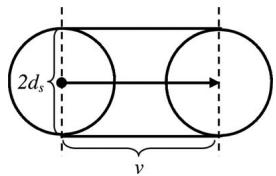  
Fig. 5. Linear SSC during a unit time.

A more intuitive explanation of the result in Corollary 2 is that the ability of searching is directly determined by SSC of the moving robot.

Definition 2: Given the robot travels at a speed of v with a sensory radius of $d _ { s } .$ , SSC is measured by the area of the swept region per unit time aSSC .

For example

$$
a _ { \mathrm { S S C } } = \pi d _ { s } ^ { 2 } + 2 d _ { s } v\tag{33}
$$

for a robot travels along a line (see Fig. 5). For a LCRT with the SM-based trajectories, SSC is the summation of n nonoverlapping robots: $\pi n d _ { s } ^ { 2 } + 2 n d _ { s } v$ . However, SSC for the corresponding ASER becomes $\pi n d _ { s } ^ { 2 } + 2 \sqrt { n } d _ { s } v .$ , which is less than that of LCRT. This is consistent with the result in Corollary 2.

When the robot does not travel along a line during the unitary time, its SSC becomes inevitably smaller than that in (33). For example, during the RW, the robot makes a lot more turns than that of the SM, which decreases SSC over the course of searching and results in a longer EST, as shown in Corollary 1.

The SSC analysis can also be used to predict the behavior of two different RW setups for the robot team. In the aforementioned LCRT setup, we partition the searching space into n equally sized subareas, which is defined as LCRT-P-RW with P-RW stands for the partition-based RW. As we know, the EST of LCRT-P-RW is longer than that of LCRT with the SM, which is abbreviated as LCRT-SM. Another possible way of coordinating n RW-based robots is that we do not partition the searching space but release all n robots at the same origin and let them compete. The searching stops when any robot finds the target. We name the method as LCRT-C-RW, where C-RW stands for the competition-based RW. For the LCRT-C-RW process, we can compute EST using order statistic [33], since the searching time is the smallest of n i.i.d. random variables. Although the resulting EST can be obtained either analytically or computationally [34], it cannot be expressed in a simple closed-form format for comparison study. We will not elaborate the process. However, the introduction of SSC can quickly compare LCRT-C-RW to LCRT-P-RW:

Lemma 1: The expected SSC of the LCRT-P-RW is always larger than that of the LCRT-C-RW.

Proof: In the LCRT-C-RW process, there is a nonzero probability $p _ { o }$ that the sensing region between robots overlaps, which reduces its effective SSC, whereas the LCRT-P-RW does not allow the overlap to happen. Let us define $a _ { \mathrm { S S C - P } }$ and $a _ { \mathrm { S S C - C } }$ as the SSC for LCRT-P-RW and LCRT-C-RW, respectively. Denote $\epsilon _ { a }$ as the reduction of SSC caused by the overlap. Conditioning on the overlapping event $E ^ { \prime }$ , we have

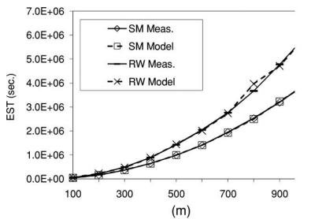  
(a)

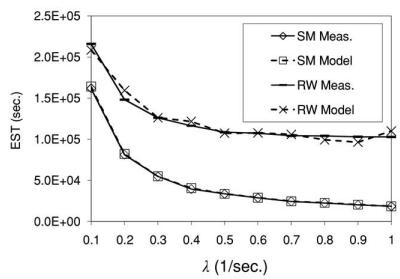

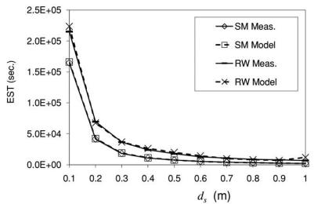  
(c)

(b)  
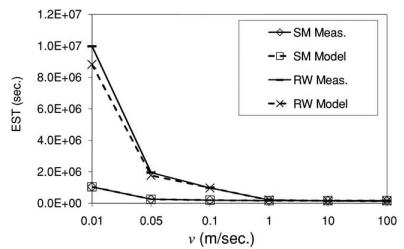

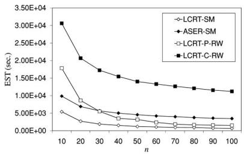  
(d)  
(e)  
<!-- PDF_PAGE: 008 -->

Fig. 6. Simulation results in (a)–(d) for validating Theorem 1 with respect to a, $\lambda , d _ { s }$ , and v, respectively. SM stands for the slap method. RW stands for the RW. Model means the model prediction of the EST. Meas. means the measured mean searching time. (e) Simulation results for comparing four different robot configurations. Recall that LCRT stands for the low-cost robot team and ASER stands for a single expensive robot.

$$
\begin{array} { r l r } {  { E ( a _ { \mathrm { S S C - C } } ) = E ( a _ { \mathrm { S S C - C } } | \overline { { E ^ { \prime } } } ) ( 1 - p _ { o } ) + E ( a _ { \mathrm { S S C - C } } | E ^ { \prime } ) p _ { o } } } \\ & { } & { ~ = E ( a _ { \mathrm { S S C - P } } ) ( 1 - p _ { o } ) + ( E ( a _ { \mathrm { S S C - P } } ) - E ( \epsilon _ { a } ) ) p _ { o } } \\ & { } & { ~ < E ( a _ { \mathrm { S S C - P } } ) ~ ( 3 4 ) } \end{array}
$$

since $\epsilon _ { a }$ is positive.

Remark 6: This result indicates that the searching efficiency of LCRT-C-RW is not as good as LCRT-P-RW. Actually, the combination of EST and SSC analyses can help us to identify the most efficient coordination strategy with respect to different searching space partition, robot allocation, or robot formation methods for the robot team. Two interesting observations can be summarized here.

1) For the robot trajectory, try to search in straight lines to maximize the SSC. An optimal control problem can be formulated if searching directions are forced to change due to searching space constraints.

2) For the robot team, try to avoid overlapping among searching regions of robots. Partitioning the searching space is a good practice. We could also use a particular formation to achieve this.

## VI. EXPERIMENTS

We test our results using Monte Carlo simulation and physical experiments.

## A. Simulation

Simulation allows us to examine theoretical results across complete parameter ranges without the limitation of hardware conditions. The simulation results are illustrated in Fig. 6(a)–(e).

TABLE I  
PARAMETER SETTINGS FOR RESULTS IN SIMULATION AND PHYSICAL EXPERIMENTS
<table><tr><td>Figure</td><td>a (m)</td><td>λ (1/sec.)</td><td>ds (m)</td><td>v (m/s)</td></tr><tr><td>Fig. 6(a)</td><td>100-1000</td><td>0.1</td><td>1.0</td><td>1.0</td></tr><tr><td>Fi Fig. (b)</td><td>200</td><td>0.1-1.0</td><td>1.0</td><td>1.0</td></tr><tr><td>Fig. 6(c)</td><td>200</td><td>0.1</td><td>1-10</td><td>1.0</td></tr><tr><td>Fig. 6(d)</td><td>200</td><td>0.1</td><td>1.0</td><td>0.01-100</td></tr><tr><td>Fig. (e)</td><td>200</td><td>0.1</td><td>1.0</td><td>1.0</td></tr><tr><td>Figs. 9&amp;10</td><td>100</td><td>0.1</td><td>0.2</td><td>0.20</td></tr></table>

Each data point in those figures is an average of 10 000 independent trials. At the beginning of each trial, we reset the robot position to be at (0, 0) and generate the target location according to a 2-D uniform distribution. We then run the robot according to the selected motion plan and finish the trial as soon as the target is found.

1) Validating Theorem 1 and Corollary 1: We test Theorem 1 using both the SM and the RW because Theorem 1 is supposed to be independent of motion plans. The simulation is set up with different $a , \lambda , d _ { s }$ , and v settings in Table I. In each setting, we collect both the model predicted EST and the measured mean searching time. The measured mean searching time is the average of the searching time over the 10 000 trials [the “Meas.” values in Fig. 6(a)–(d)]. The model predicted ESTs, which are the “Model” values in Fig. 6, refer to the predicted ESTs according to the measured $D , \lambda , \tau _ { \mathrm { I N } }$ , and $\tau _ { \mathrm { O U T } }$ values in the experiment. In other words, we record their values and average them over the 10 000 trials to obtain the estimation of $1 / \lambda , E ( D )$ , and $E ( \tau _ { \mathrm { O U T } } ( e ^ { - \lambda \tau _ { \mathrm { I N } } } ) / ( 1 - e ^ { - \lambda \tau _ { \mathrm { I N } } } ) )$ . We then feed them into (7) to obtain the model prediction of the EST.

As illustrated in Fig. 6(a)–(d), the model prediction is consistent with the measured mean searching time under all settings. The curve trends with respect to $a , \lambda , d _ { s }$ , and v in Fig. 6(a)– (d) are also consistent with our analysis in (14) and (29). The

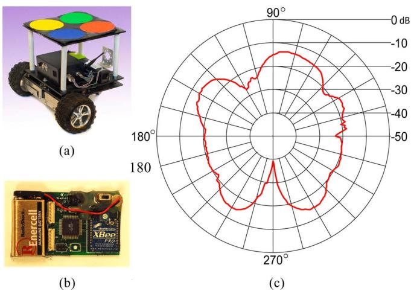  
<!-- PDF_PAGE: 009 -->

Fig. 7. (a) Mobile robot used in the experiment. (b) Xbee Pro RF module used as the signal source, which is the target. (c) RF radiation pattern of the Xbee Pro. This plot is from the product specification sheet of Digi International Inc. This is also the shape of the real-sensing region.

EST increases as the field side length a increases. The EST decreases as $\lambda , d _ { s }$ , and v increase. All figures show that the RW is slower than the SM. In particular, Fig. 6(a) is consistent with the asymptotic difference in Corollary 1.

2) Validating Corollary 2 and Lemma 1: We have also implemented different LCRT and ASER robot configurations. Again, the parameter settings are in the Table I. The measured ESTs for both the configurations are shown in Fig. 6(e). It is clear that the EST for the LCRT-SM is always much smaller than that of the ASER-SM. This is consistent with Corollary 2. In addition, the EST for the LCRT-P-RW is always much smaller than that of the LCRT-C-RW, which is consistent with Lemma 1. What is interesting is the fact that the EST of the LCRT-P-RW is initially bigger than that of the ASER-SM but becomes smaller than that of the ASER-SM as n increases. The curves in the figure also show the general trend that the EST decreases as the n increases. This is consistent with our analysis. In addition, as n becomes large, the curve levels at a nonzero value. This indicates that the signal transmission rate dominates the searching time in this case. Hence, it is not desirable to arbitrarily increase n because the marginal benefit would decrease. Actually, with an appropriate cost function, readers can extend the analysis to find an optimal number of robots for a given searching task. This would be very meaningful in resource-constrained searching process.

## B. Physical Experiments

1) Hardware and Experiment Setup: In the physical experiment, we use a mobile robot to search for a buried intermittent radio beacon (see Fig. 7). This process emulates the search of a black box after a plane crash. The robot is custom made in our laboratory. The robot measures $5 0 \times 4 7 \times 5 0 \mathrm { c m ^ { 3 } }$ in size. The robot has two front drive wheels and one rear cast wheel and uses a typical differential driving structure. During the experiment, the robot traveling speed is set at 20 cm/s. The maximum robot operation time between recharging is 4 h. Buried under the floor, the target is a Zigbee radio source, which is an XBee Pro node [see Fig. 7(b)] with a chip antenna from Digi International Inc. (formerly known as MaxStream Inc). We program the radio to allow it to transmit one packet every $1 0 \mathrm { ~ s ~ } ( \lambda = 0 . 1 )$ .

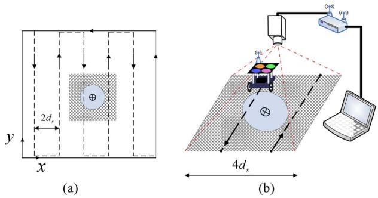  
Fig. 8. Physical experiment settings for the “accelerated” configuration. (a) Shaded area covers the circle. (b) Close-up view of the experiment setup for the shaded area and the overhead camera.

One notable difference between the simulation and the physical experiment is the shape of the sensing region. Although the radio antennas are omnidirectional, the radiation pattern [see Fig. 7(c)] is irregular. The shape of the radiation pattern is the shape of the sensing region. Since $a = 1 0 0$ m in our settings, we decrease antenna sensitivity to ensure $a \gg d _ { s }$ . After calibration and adjusting antenna sensitivity, we approximate the reception region with a circle $( d _ { s } = 0 . 2 \ : \mathrm { m } )$ . The physical experiment parameters are summarized in Table I.

Since the robot has a slow speed and a small sensing region, recall that the field size is $\mathrm { 1 0 ^ { 4 } ~ m ^ { 2 } }$ , it is estimated that it takes the robot at least $1 0 ^ { 6 }$ s to find the target. However, the robot only has 4-h continuous operation time due to our hardware limitations. When the robot travels outside the sensing region, it cannot receive signals and does not provide information for the searching process. Therefore, we setup the experiment in an “accelerated” configuration. In this configuration, we do not drive the robot according to the motion plan when the robot is far away from the signal source. Instead, we fast forward the time to the next moment that the robot is close to the signal source. Fig. 8 illustrates the setup. The shaded area in Fig. 8(a) is the region, which is a square with a side length of 4ds . The region fully encloses the sensing region as shown in the figure. The robot obtains its location from an overhead camera, as illustrated in Fig. 8(b). The overhead camera is an Arecont Vision 3100 networked video camera. The camera recognizes color markers on the top of the robot, and computes the robot position and orientation subsequently. Configured at a 640 × 480-pixel resolution, it is capable of reaching an accuracy of ±2.0 cm with 16 Hz frame rate.

We first validate Corollary 1 in the physical experiment. The results are summarized in Fig. 9. Each entry is an average of 100 trials. The marker positions indicate the mean value of the 100 trials and the vertical bars are the range of ±σ, with $\sigma$ being the standard deviation. The entries with solid vertical bars are physical experiment results, whereas the entries with dashed vertical bars represent the corresponding simulation results. As shown in the figure, the physical experiment results are consistent with those of the simulation despite the significant difference in sensing region shape. Both results confirmed that the SM has a shorter EST than that of the RW. Unlike the simulation, we cannot repeat the experiments under a large range of various parameter settings due to hardware limitations.

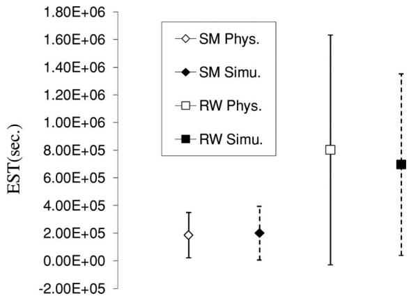  
<!-- PDF_PAGE: 010 -->

Fig. 9. Comparing the EST of the SM and the RW. Note that “Phys.” means the physical experiment results, while “Simu.” represents simulation results. The vertical bars correspond to [− $\cdot \sigma , \sigma ]$ with σ as the standard deviation.

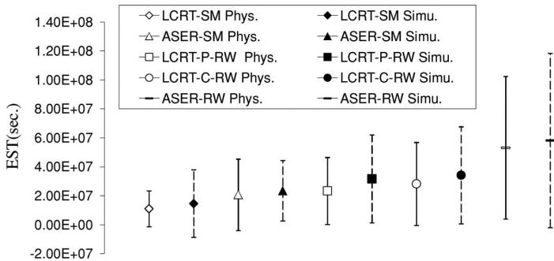  
Fig. 10. Comparing the EST of different LCRT and ASER configurations.

In the second setup, we validate Corollary 2 and Lemma 1 by comparing different LCRT and ASER configurations. The results are shown in Fig. 10. Again, we follow the same legend convention of mean and standard deviation, as in Fig. 9. Each entry indicates the mean value and the standard deviation of 100 trials. The simulation results and the physical experiment results are consistent. The results conclude that the increasing order of EST of all configurations is as follows:

## {LCRT-SM, ASER-SM, LCRT-P-RW, LCRT-C-RW,

## ASER-RW}

with LCRT-SM being the best and ASER-RW being the worst searching methods, respectively. This result is consistent with Corollary 2 and Lemma 1. In addition, the fact that ASER-SM is faster than LCRT-P-RW and ASER-RW is slower than LCRT-C-RW is rather interesting and worth further study in the future.

## VII. CONCLUSION AND FUTURE WORK

We analytically modeled the EST and SSC for a robot with a limited sensing range to search for a target that intermittently emits short duration signals. We presented the closed-form model for the EST. The EST model is motion-plan independent and can be used to analyze different motion plans or robot configurations. We demonstrated the analysis process using two case studies. In the first case, we analyzed the SM and the RW and found that the SM is asymptotically faster than the RW. In the second case, our analysis revealed the interesting result that a LCRT is always asymptotically faster than an expensive robot when the sensory coverage is the same. In both cases, the results demonstrated the usefulness and the capability of our EST analysis. Our theoretically results were extensively tested using simulation and physical experiments. The experimental results were consistent with the analytical models.

This paper will lead to a rich set of exciting future work. As an extension, we will analyze cases, where multiple targets are needed to be searched. We will also develop the EST metrics for the searching of a moving target, an uncooperating target, or multiple sensor combinations. Different sensor models will also be considered. In addition, we also need to consider cases, where obstacles clutter the searching space.

## ACKNOWLEDGMENT

The authors would like to thank E. Frazzoli, E. Frew, J. Xiao, and R. Volz for their insightful discussions. They would also like to thank Y. Xu, J. Zhang, A. Aghamohammadi, and W. Li for their input and contributions to the Networked Robots Laboratory, Texas A&M University.

## REFERENCES

[1] S. Ross, Introduction to Probability Models, 9th ed. ed. New York: Academic, 2007.

[2] E. Gelenbe, N. Schmajuk, J. Staddon, and J. Reif, “Autonomous search by robots and animals: A survey,” Robot. Auton. Syst., vol. 22, no. 1, pp. 23–34, 1997.

[3] L. Stone Ed., Theory of Optimal Search, 2nd ed. ed. Alexandria, VA: Military Applications Section, Oper. Res. Soc. Amer., 1989.

[4] K. Trummel and J. Weisinger, “The complexity of the optimal searcher path problem,” Oper. Res., vol. 34, no. 2, pp. 324–327, Mar./Apr. 1986.

[5] H. Choset, “Coverage for robotics—A survey of recent results,” Ann. Math. Artif. Intell., vol. 31, no. 1–4, pp. 113–126, Oct. 2001.

[6] S. Martinez, J. Cortes, and F. Bullo, “Motion coordination with distributed information,” IEEE Control Syst. Mag., vol. 27, no. 4, pp. 75–88, Aug. 2007.

[7] M. Schwager, D. Rus, and J. Slotine, “Decentralized, adaptive control for coverage with networked robots,” Int. J. Robot. Res., vol. 28, no. 3, pp. 357–375, Mar. 2009.

[8] M. Kao, J. Reif, and S. Tate, “Searching in an unknown environment: An optimal randomized algorithm for the cow-path problem,” Inf. Comput., vol. 131, no. 1, pp. 63–79, Nov. 1996.

[9] M. de Berg, M. van Kreveld, M. Overmars, and O. Schwarzkopf, Computational Geometry, Algorithms and Applications. New York: Springer-Verlag, 1991.

[10] S. Eidenbenz, C. Stamm, and P. Widmayer, “Inapproximability results for guarding polygons and terrains,” Algorithmica, vol. 31, no. 1, pp. 79–113, 2001.

[11] F. Preparata and M. Shamos, Computational Geometry: An Introduction. Berlin, Germany: Springer-Verlag, 1985.

[12] J. Latombe, Robot Motion Planning. Boston, MA: Kluwer, 1991.

[13] A. Beck and M. Beck, “Son of the linear search problem,” Israel J. Math., vol. 48, no. 2–3, pp. 109–122, 1984.

[14] A. Lopez-Ortiz and S. Schuierer, “Online parallel heuristics and robot´ searching under the competitive framework,” in Proc. SWAT, 2002, pp. 260–269.

[15] R. Baeza-Yates, J. Culberson, and J. Rawlins, “Searching in the plane,” Inf. Comput., vol. 106, no. 2, pp. 234–252, Oct. 1993.

<!-- PDF_PAGE: 011 -->

[16] S. Benkoski, M. Monticino, and J. Weisinger, “A survey of the search theory literature,” Naval Res. Logistics, vol. 38, no. 4, pp. 469–494, Aug. 1991.

[17] S. Thrun, W. Burgard, and D. Fox, Probabilistic Robotics. Cambridge, MA: MIT Press, 2005.

[18] K. Laventall and J. Cortes, “Coverage control by multi-robot networks with limited-range anisotropic sensory,” Int. J. Control, vol. 82, no. 6, pp. 1113–1121, Jun. 2009.

[19] P. Brass, “Bounds on coverage and target detection capabilities for models of networks of mobile sensors,” ACM Trans. Sens. Netw., vol. 3, no. 2, art. 9, Jun. 2007.

[20] M. Batalin and G. Sukhatme, “The design and analysis of an efficient local algorithm for coverage and exploration based on sensor network deployment,” IEEE Trans. Robot., vol. 23, no. 4, pp. 661–675, Aug. 2007.

[21] D. Fox, J. Ko, K. Konolige, B. Limketkai, D. Schulz, and B. Stewart, “Distributed multirobot exploration and mapping,” Proc. IEEE, vol. 94, no. 7, pp. 1325–1339, Jul. 2006.

[22] W. Burgard, M. Moors, C. Stachniss, and F. Schneider, “Collaborative multi-robot exploration,” IEEE Trans. Robot., vol. 21, no. 3, pp. 376– 386, Jun. 2005.

[23] D. Song, J. Yi, and Z. Goodwin, “Localization of unknown networked radio sources using a mobile robot with a directional antenna,” in Proc. Amer. Control Conf., New York, Jul. 2007, pp. 5952–5957.

[24] D. Song, C. Kim, and J. Yi, “Simultaneous localization of multiple unknown CSMA-based wireless sensor network nodes using a mobile robot with a directional antenna,” J. Intell. Serv. Robots, vol. 2, no. 4, pp. 219– 233, Oct. 2009.

[25] D. Song, C. Kim, and J. Yi, “Monte carlo simultaneous localization of multiple unknown transient radio sources using a mobile robot with a directional antenna,” in Proc. IEEE Int. Conf. Robot. Autom., Kobe, Japan, May 2009, pp. 3154–3159.

[26] D. Song, C. Kim, and J. Yi, “Stochastic modeling of the expected time to search for an intermittent signal source under a limited sensing range,” presented at the Robot.: Sci. Syst. Conf., Zaragoza, Spain, Jun. 2010.

[27] F. Al-Athari, “Estimation of the mean of truncated exponential distribution,” J. Math. Statist., vol. 4, no. 4, pp. 284–288, 2008.

[28] M. Brummelhuis and H. J. Hilhorst, “How a random walk covers a finite lattice,” Physica A: Statist. Mech. Appl., vol. 185, no. 1–4, pp. 35–44, Jun. 1992.

[29] S. Condamin, O. Benichou, and M. Moreau, “First-passage times for´ random walks in bounded domains,” Phys. Rev. Lett., vol. 95, no. 26, pp. 260601-1–260601-4, Dec. 2005.

[30] J. D. Noh and H. Rieger, “Random walks on complex networks,” Phys. Rev. Lett., vol. 92, no. 11, pp. 118701-1–118701-4, Mar. 2004.

[31] S. Condamin, O. Benichou, V. Tejedor, R. Voituriez, and J. Klafter, “Firstpassage times in complex scale-invarant media,” Nature, vol. 450, pp. 77– 80, Nov. 2007.

[32] L. Lovasz, “Random walks on graphs: A survey,” in Combinatorics: Paul Erdos is Eighty. vol. 2, D. Miklos and V. T. Sos, Eds. Budapest, Hungary: Janos Bolyai Math. Soc., 1993, pp. 1–46.

[33] N. Balakrishnan and A. Cohen, Order Statistics & Inference: Estimation Methods. New York: Academic, 1991.

[34] C. Rose and M. Smith, “Computational order statistics,” Mathematica J, vol. 9, no. 4, pp. 790–802, 2005.

  
Dezhen Song (S’02–M’04–SM’09) received the B.S. and M.S. degrees from Zhejiang University, Hangzhou, China, in 1995 and 1998, respectively, and the Ph.D. degree from the University of California, Berkeley, in 2004.

He is currently an Associate Professor with Texas A&M University, College Station. His research interests include networked robotics, distributed sensing, computer vision, surveillance, and stochastic modeling.

Dr. Song was the recipient at the Kayamori Best

Paper Award at the 2005 IEEE International Conference on Robotics and Automation (with J. Yi and S. Ding). He was also the recipient of the National Science Foundation Faculty Early Career Development (CAREER) Award in 2007. From 2007 to 2009, he was a Co-Chair of IEEE Robotics and Automation Society Technical Committee on Networked Robots. He is an Associate Editor of IEEE TRANSACTIONS ON ROBOTICS and the IEEE TRANSACTIONS ON AUTOMATION SCIENCE AND ENGINEERING.

Chang-Young Kim received the B.S. degree in electrical engineering from Korea University, Seoul, Korea, in 2005. He is currently working toward the Ph.D. degree with the Department of Computer Science and Engineering, Texas A&M University, College Station.

He was with GIT Co., Ltd, Seoul, where he was engaged in the fields of automotive and embedded systems. His current research interests include mobile robots, networked robots, radio localization, robot navigation, sensor networks, and surveillance.

Jingang Yi (S’99–M’02–SM’07) received the B.S. degree in electrical engineering from Zhejiang University, Hangzhou, China, in 1993, the M.Eng. degree in precision instruments from Tsinghua University, Beijing, China, in 1996, and the M.A. degree in mathematics and the Ph.D. degree in mechanical engineering from the University of California, Berkeley, in 2001 and 2002, respectively.

He is currently an Assistant Professor of mechanical engineering with Rutgers University, Piscataway, NJ. His research interests include autonomous robotic

systems, dynamic systems and control, and automation science and engineering, with applications to biomedical systems, civil infrastructural and transportation systems, and semiconductor manufacturing.

Prof. Yi is the recipient of the 2010 National Science Foundation Faculty Early Career Development (CAREER) Award. He has coauthored papers that have received the Kayamori Best Paper Award at the 2005 IEEE International Conference on Robotics and Automation. He is currently an Associate Editor of the ASME Dynamic Systems and Control Division and the IEEE Robotics and Automation Society Conference Editorial Boards. He was also the Guest Editor for the IEEE TRANSACTIONS ON AUTOMATION SCIENCE AND ENGINEERING.