# Simultaneous Localization of Multiple Unknown and Transient Radio Sources Using a Mobile Robot

Dezhen Song, Senior Member, IEEE, Chang-Young Kim, Student Member, IEEE,

and Jingang Yi, Senior Member, IEEE

Abstract—We report system and algorithm developments that utilize a single mobile robot to simultaneously localize multiple unknown transient radio sources. Because of signal source anonymity, short transmission durations, and dynamic transmission patterns, the robot cannot treat the radio sources as continuous radio beacons. To deal with this challenging localization problem, we model the radio source behaviors using a novel spatiotemporal probability occupancy grid that captures transient characteristics of radio transmissions and tracks posterior probability distributions of radio sources. As a Monte Carlo method, a ridge walking motion planning algorithm is proposed to enable the robot to efficiently traverse the high-probability regions to accelerate the convergence of the posterior probability distribution. We also formally show that the time to find a radio source is insensitive to the number of radio sources, and hence, our algorithm has great scalability. We have implemented the algorithms and extensively tested them in comparison with two heuristic methods: a random walk and a fixed-route patrol. The localization time of our algorithms is consistently shorter than that of the two heuristic methods.

Index Terms—Localization, networked robots, wireless sensor network.

## I. INTRODUCTION

A WIRELESS sensor network is usually composed of alarge number of miniature wireless sensor nodes with selfconfigurable ad hoc networking capabilities. Its ability to collect and gather information remotely over a large region makes it a powerful tool in many applications. It may be used as a new espionage tool that threatens our security and privacy. For example, an enemy may deploy a sensor network in a battlefield to detect our troop movements. We need a countermeasure for the potential misuse of the fast-developing sensor-network technology.

From a listener perspective, a wireless sensor network is a large set of multiple unknown transient radio sources. Here, we report system and algorithm developments that enable a single mobile robot to simultaneously localize multiple unknown transient radio sources (see Fig. 1). Since the robot is equipped with a directional antenna and on-board positional sensors, the robot knows its own position and can detect received signal strengths (RSS) as it travels in the field of radio sources. When the radio sources and communication protocols are unknown, the robot cannot treat the radio sources as continuous radio beacons. More specifically,

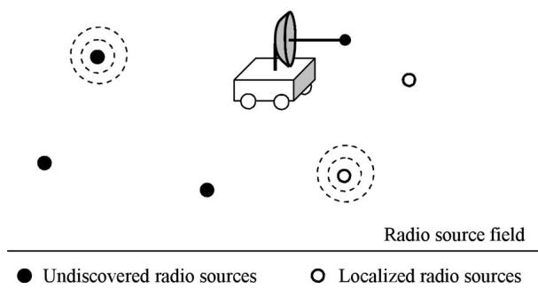  
Fig. 1. Schematics of deployment of a single mobile robot to localize unknown transient radio sources. The radio sources with dashed circles indicate that they are sending radio signals.

1) the number of radio sources is unknown,

2) the periods of radio transmission are short,

3) the signal source cannot be identified, and

4) radio sources transmit intermittently.

To deal with this challenging localization problem, we model the radio source behaviors using a novel spatiotemporal probability occupancy grid (SPOG) that captures transient characteristics of radio transmissions and tracks their posterior probability distributions. We then propose an SPOG update algorithm that incrementally updates the SPOG as radio transmissions are intercepted. We also propose a Monte Carlo ridge walking motion planning algorithm that enables the robot to efficiently traverse high-probability regions to accelerate the convergence of the posterior probability distributions of radio source locations. We formally show that the time to find a radio source is insensitive to the number of radio sources, and hence, our algorithm has great scalability. We have implemented the algorithms and extensively tested them in comparison with two heuristics: a random walk and a fixed-route patrol. In experiments, the localization time of our algorithms is consistently shorter than that of the two heuristic methods.

The rest of the paper is organized as follows. We begin with a review of related work in Section II. We present the system architecture and the problem definition in Section III. In Section IV, we introduce the sensing model. Building on the outcome of the sensing model, a robot motion planer is introduced in Section V. The overall algorithms and localization time bounds are presented in Section VI. We validate our model and algorithm through experiments in Section VII. We conclude the paper in Section VIII.

## II. RELATED WORK

Localization of unknown transient radio sources relates to three research fields that includes radio frequency (RF)-based localization, simultaneous localization and mapping (SLAM), and occupancy grid methods.

RF-based localization has witnessed fast development as wireless communication technologies grow rapidly [1]–[5]. Signal strength, the time or the time difference of arrival [6], [7], angle/bearing [6], and phase shift are commonly used in deriving the locations of signal sources using triangulation-based approaches. Researchers in sensor and wireless network communities have studied the RF-based localization problem extensively [8]–[14]. In their problem setup, sensors usually have some prior knowledge about radio signals, such as source identification, packet length, network protocols/configurations, source signal strength, and transmission rates. For example, recent developments of range-free localization use the prior knowledge or part of it to estimate sensor locations by network connectivity [15]–[18]. Nonparametric belief propagation [19] and the sequence-based localization [20] methods are proposed. Recent work also focuses on distributed solutions [21]–[24].

As a very relevant work, in [2], the authors use a network of wireless access points to localize a mobile unit. This can be viewed as a dual version of our problem. They use multiple static listeners to localize a single mobile transmitter, while we try to localize multiple static transmitters using a mobile listener. As another closely related work, in [11], the authors try to localize sensor-network nodes with a mobile beacon. The mobile beacon and the sensor-network nodes are assumed to share the network information. This type of work can be viewed as the localization of “friendly” radio sources.

In robotics research, the SLAM is defined as the process of mapping the environment and localizing robot position at the same time [25]–[27]. Although both SLAM and our approach are built on the Bayesian methods, the SLAM assumes that the environment is static or close to static. Directly applying the SLAM methods to our problem is not appropriate because networked radio sources create a highly dynamic environment, where the signal-transmission patterns change quickly. Although recent advance in the SLAM allows tracking of moving objects [28], the environment largely remains static.

Since the authors introduce occupancy grid maps as a probabilistic sensor model in [29] and [30], the occupancy grid has been proved to be an elegant representation of the sensor coverage for mobile robot applications, such as localization and mapping [25]. Recent work further improves occupancy grid maps to incorporate multisensor fusion, an inverse sensor model, and a forward sensor model. Occupancy grid-based methods have recently been adapted to a variety of applications including gas/odor source localization [31]. The existing occupancy grid-based methods focus on using the spatial probabilistic representation to describe sensing uncertainty and are not capable of dealing with time-variant environments. In this study, we extend the occupancy grid methods into the temporal dimension to deal with the dynamic characteristics of the transient radio transmissions.

In [32], the authors also work on a similar problem that enables a robot to search for multiple radio transmitters. In their setup, the robot needs to find all transmitters in an indoor environment. Again, all transmitters are treated as continuous beacons. The main focus of their approach is to provide a robust gradient-based method to guide the robot to search for the transmitters at the presence of complex and noise indoor signal fields. The transient behaviors and signal correspondence are not concerns of the approach.

We work on localization of unknown and transient radio sources [33], [34]. In our previous works [35] and [36], we use a single mobile robot that is equipped with a log-periodic dipole array antenna to localize unknown networked sensor nodes. By the usage of a particle-filter approach, we assume that the carrier sensing multiple access (CSMA)-based protocol is used among the networked radio sources. However, this method suffers from the restrictive assumption on the CSMA protocol and scalability issue of the particle-filter method. In this paper, we relax the assumption and develop a protocol-independent localization scheme that extends our previous conference paper [37] by adding new convergence analysis and experimental results.

## III. SYSTEM DESIGN AND PROBLEM DEFINTION

## A. System Architecture

Fig. 2(a) illustrates the hybrid system architecture. The robot knows its own position from the Global Positioning System or other localization sensors and wants to search/localize the unknown signal sources. From the robot perspective, the input is the RSS readings from the directional antenna with the corresponding antenna orientations. The output of the system is the planned trajectory for the robot to execute in the following period. The entire system is built around the SPOG, which tracks each cell’s probability of containing a radio source and its transmission rate.

The system updates the SPOG whenever a radio transmission is detected by the antenna. The antenna model outputs the posterior probability distribution of the signal source as the inputs to the SPOG. This update process is described by a continuous time system. As a convention in this paper, we use t to denote the continuous time.

On the other hand, the robot plans its motion periodically. We denote the period length by τ0, which is carefully chosen to ensure that the robot has enough time to execute the planned trajectory. At the beginning of each period, the robot plans its trajectory based on the current SPOG. This decision-making process is a discrete time system. We denote the discrete time index variable by $k \in \mathbb N$

Fig. 2(b) illustrates the relationship between the continuous time system and the discrete time system. Let $t ^ { k } \in \mathbb { R }$ be the exact time at the moment of the discrete time k. We define the kth period as the time interval between $t ^ { k - 1 }$ and $t ^ { k }$ . Hence, $t ^ { k } - t ^ { k - 1 } = \tau _ { 0 }$ for $k > 1$ . We also define $t _ { j } ^ { k } \in \mathbb { R }$ as the exact time when the jth radio transmission occurs in the kth period: $t ^ { k - 1 } \leq t _ { i } ^ { k } < t ^ { k }$ . The index variable $j$ is reset to zero at the beginning of each period.

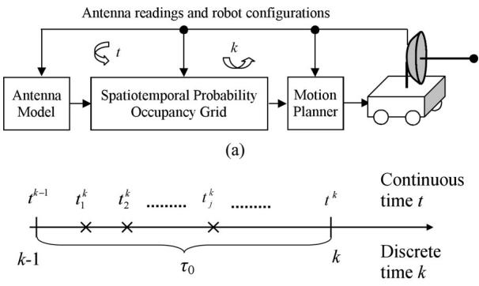  
× : The moment when a wireless transmission occurs. (b)  
Fig. 2. (a) System diagram and (b) system timing.

## B. Problem Setup

To formulate the localization problem, we make the following assumptions.

1) Both the robot and radio sources are located in an obstaclefree 2-D Euclidean space. Radio sources are stationary and can be treated as points. In the later section, we will discuss how to handle obstacles.

2) The network traffic is light and each transmission is short. This is the typical characteristic of a low-power sensor network.

3) Each radio transmission is transmitted at the same power level. This assumption can be relaxed if the robot is equipped with an orthogonal antenna pair, which can provide directional information regardless of the transmission power. For example, in recent works [38] and [39], the authors show how to obtain distance to a radio source using multiple antennas with different polarizations and/or signal ratios.

4) The radiation pattern of the radio sources is circular because most miniature wireless sensors are equipped with omnidirectional antennas.

Because of the transient transmission and the fact that the robot cannot associate a signal with its source, the robot cannot simply triangulate the signal source. Since only one robot is considered, the single robot perspective makes it more difficult than the cases where multiple robots or receivers are used.

## C. Spatiotemporal Probability Occupancy Grid

We introduce the SPOG to track the posterior spatiotemporal distributions of radio sources. To define the SPOG, we partition the entire field into equally sized square cells using a grid. Let us define cell index set $I : = \{ 1 , \ldots , n \}$ , where n is the total number of cells. Define $i \in I$ as a cell index variable. The size of each cell is determined by the RSS resolution of the antenna. Inside each cell, we approximate radio source locations using locations of the cell center. Define $C _ { i }$ as the event that cell i contains at least one radio source and $P ( C _ { i } )$ as the probability that event $C _ { i }$ occurs. Hence, $\textstyle \sum _ { i \in I } P ( C _ { i } )$ equals the number of cells that contain radio sources if $P ( C _ { i } )$ converges to a correct value in the Monte Carlo localization process. $P ( C _ { i } )$ tracks the radio source location distribution and is the spatial component of the SPOG. Localizing radio sources becomes finding cells that ensure $P ( C _ { i } ) > 0$

At time $t _ { j } ^ { k }$ , a transmission occurs. We define $C _ { i } ^ { 1 }$ as the event that cell i is the active radio source at time $t _ { j } ^ { k }$ . Define $C _ { i } ^ { 0 }$ as the event that cell i is inactive at time $t _ { j } ^ { k }$ . Hence

$$
P ( C _ { i } ^ { 0 } ) + P ( C _ { i } ^ { 1 } ) = 1 \mathrm { a n d } \sum _ { i \in I } P ( C _ { i } ^ { 1 } ) = 1\tag{1}
$$

because there is only one active transmission when the transmission is detected. We ignore the collision case because we take an RSS measurement as soon as the transmission is initiated. The probability of two or more transmissions that are initiated at the exact same moment is negligible in a light-traffic network. $C _ { i } ^ { 1 }$ is determined by the relative radio transmission rate and is the temporal part of the SPOG. Unlike a regular occupancy grid, the SPOG is unique because each cell is described by two types of correlated random events: the spatial event $C _ { i }$ and the temporal events $C _ { i } ^ { 0 }$ and $C _ { i } ^ { 1 }$

## D. Problem Formulation

Fig. 2(a) suggests that the overall localization problem can be divided into two subproblems: a sensing problem and a motion planning problem. Let a random variable $Z _ { j } ^ { k } \in \mathbb { N }$ be the corresponding RSS reading at time $t _ { j } ^ { k }$ . Note that the RSS readings are from a receiver with a discrete resolution. Define $\mathbf { Z } ( Z _ { i } ^ { k } )$ as the set of all RSS values sensed from the beginning of the localization process to the moment when $Z _ { j } ^ { k }$ is sensed. We also define a set $\mathbf { Z } ^ { - } ( Z _ { j } ^ { k } ) : = \mathbf { Z } ( Z _ { j } ^ { k } ) \setminus \{ Z _ { j } ^ { k } \}$ , which is the set of all RSS readings from the beginning of the localization process to the moment right before $Z _ { j } ^ { k }$ is sensed. Define $P ( C _ { i } | \mathbf { Z } ( Z _ { j } ^ { k } ) )$ as the conditional probability that cell i contains at least one radio source given the RSS set $\mathbf { Z } ( Z _ { j } ^ { k } )$ ). Following the same convention, we define the conditional probabilities $P ( C _ { i } | \mathbf { Z } ^ { - } ( Z _ { j } ^ { k } ) )$ , $P ( C _ { i } ^ { 1 } | \mathbf { Z } ( Z _ { i } ^ { k } ) )$ , and $P ( C _ { i } ^ { 1 } | \mathbf { Z } ^ { - } ( Z _ { j } ^ { k } ) )$ . The sensing problem updates the SPOG when a new transmission is detected.

Problem 1 (Sensing Problem): Given the current RSS $Z _ { j } ^ { k }$ the previous RSS set $\mathbf { Z } ^ { - } ( Z _ { j } ^ { k } )$ , $P ( C _ { i } | \mathbf { Z } ^ { - } ( Z _ { j } ^ { k } ) )$ , $\dot { P ( C _ { i } ^ { 1 } | \mathbf { Z } ^ { - } ( Z _ { j } ^ { k } ) ) }$ , and the corresponding robot configurations, compute $P ( \tilde { C } _ { i } | \mathbf { Z } ( Z _ { i } ^ { k } ) )$ and $P ( C _ { i } ^ { 1 } | \mathbf { Z } ( Z _ { j } ^ { k } ) )$ ) for each cell i.

At the beginning of each period $k ,$ we plan the robot trajectory. Let us define the robot position and orientation as ${ \bf \bar { r } } ( t ) = [ x ( t ) , y ( t ) , \theta ( t ) ] ^ { T } \in \mathbb { R } ^ { 2 } \times \bar { S }$ , where $S = ( - \pi , \pi ]$ is the orientation angle set. Since the antenna is fixed on the robot and points to the robot forwarding direction, $\theta ( t )$ is also the antenna orientation. Define $j _ { \mathrm { m a x } }$ as the index for the last transmission sensed in period k. Therefore, we can define the motion planning problem for time $k ( \mathrm { o r } t ^ { k } )$ as follows.

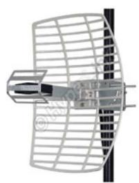

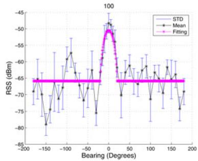  
(a)  
(b)  
Fig. 3. HyperGain HG2415G parabolic directional antenna properties. (a) Antenna photo and (b) calibrated radiation pattern.

Problem 2 (Radio Source Localization Motion Planning): Given the current SPOG, which are the sets $\{ P ( C _ { i } | \bar { \mathbf { Z } } ( Z _ { j _ { \operatorname* { m a x } } } ^ { k } ) ) | i \in I \}$ and $\{ P ( C _ { i } ^ { 1 } | \mathbf { Z } ( Z _ { j _ { \operatorname* { m a x } } } ^ { k } ) ) | i \in I \}$ , plan the robot trajectory $\{ \mathbf { r } ( t ) | t ^ { k } \leq t < t ^ { k + 1 } \}$ that enables the robot to quickly localize radio sources.

This overall approach is a Monte Carlo method with following localization condition.

Definition 1 (Localization Condition): A radio source is believed to be located at cell i if $P ( C _ { i } | \mathbf { Z } ( Z _ { j } ^ { k } ) ) \geq p _ { t }$ for a given probability threshold $p _ { t }$

## IV. SENSING MODELING

We address the sensing problem first. The sensing problem actually has two components: an antenna model and an SPOG update process.

## A. Antenna Model

The antenna model describes the property of the directional antenna. As illustrated in Fig. 3, we use a HyperGain HG2415G parabolic antenna in our system. We have introduced the antenna model in [36]. For completeness, we briefly reiterate the model here.

Bearing and distance are the two most important variables in an antenna model [40]. Let $( x _ { j } ^ { k } , y _ { j } ^ { k } , \theta _ { j } ^ { k } )$ be the robot configuration when the jth radio transmission in the kth period is sensed. Let $( x _ { i } , y _ { i } )$ be the location of cell center. Define $d _ { i j } ^ { k }$ as the distance from the robot to the center of the cell:

$$
d _ { i j } ^ { k } = \sqrt { ( x _ { j } ^ { k } - x _ { i } ) ^ { 2 } + ( y _ { j } ^ { k } - y _ { i } ) ^ { 2 } } .\tag{2}
$$

Let $\phi _ { i j } ^ { k }$ be the bearing of the cell with respect to the robot:

$$
\phi _ { i j } ^ { k } = \mathrm { a t a n } 2 ( y _ { j } ^ { k } - y _ { i } , x _ { j } ^ { k } - x _ { i } ) - \theta _ { j } ^ { k } .\tag{3}
$$

By the assumption that the active radio source is located in cell i, the expected RSS $s _ { i }$ of the directional antenna is given as

$$
s _ { i } = c \cdot ( d _ { i j } ^ { k } ) ^ { - \beta } \varphi ( \phi _ { i j } ^ { k } )\tag{4}
$$

where c is a constant depending on radio transmission power, and $( d _ { i j } ^ { k } ) ^ { - \beta }$ is the signal decay function. The directivity of the antenna is captured by the term $\varphi ( \phi _ { i j } ^ { k } )$ , which describes the radiation pattern of the antenna. Note that $d _ { i j } ^ { k } > d _ { a }$ , where $d _ { a }$ is the length of the longest physical dimension of the antenna. We obtain $c = 6 3 . 0 9$ and the decay factor $\beta = 2 . 5 3$ for our antenna from the calibration process. Our $\beta$ value conforms to the widely accepted notion that the decay factor is between 2 and 4 [41].

Since our receiver uses dBm as an RSS unit, we have to take a $1 0 \log _ { 1 0 }$ with respect to (4):

$$
\mu _ { i } = 1 0 \big ( \log _ { 1 0 } c - \beta \log _ { 1 0 } d _ { i j } ^ { k } + \log _ { 1 0 } \varphi ( \phi _ { i j } ^ { k } ) \big )\tag{5}
$$

where $\mu _ { i }$ is the expected RSS in units of dBm. From the antenna theory and the results from the antenna calibration, we perform curve fitting to obtain the radiation pattern function as illustrated in Fig. 3(b):

$$
\varphi ( \phi _ { i j } ^ { k } ) = \left\{ \begin{array} { l l } { 1 , } & { \mathrm { i f ~ } d _ { i j } ^ { k } \leq d _ { a } , } \\ { \cos ^ { 2 } \big ( 4 \phi _ { i j } ^ { k } \big ) , } & { \mathrm { i f ~ } \phi _ { i j } ^ { k } \in [ \pm 2 0 ^ { \circ } ] \mathrm { ~ a n d ~ } d _ { i j } ^ { k } > d _ { a } } \\ { \cos ^ { 2 } \big ( 8 0 ^ { \circ } \big ) , } & { \mathrm { ~ o t h e r w i s e . } } \end{array} \right.\tag{6}
$$

Note that the peak at the zero bearing in Fig. 3(b) is about 15 dB·m higher than the average of nonpeak regions, which confirms antenna specifications.

Equations (5) and (6) describe the expected RSS given that the radio transmission is from cell i. However, the RSS is not a constant but a random variable because of the uncertainties in radio transmissions, receiver resolution, and background noises. Therefore, the mean value of $Z _ { j } ^ { k }$ is $\mu _ { i }$ . From the antenna calibration, we know that the distribution of $Z _ { j } ^ { k }$ can be approximated by a normal distribution with a density function of

$$
g _ { i } ( \zeta ) \approx \frac { 1 } { \sqrt { 2 \pi \sigma ^ { 2 } } } e ^ { - \frac { ( \zeta - \mu _ { i } ) ^ { 2 } } { 2 \sigma ^ { 2 } } }\tag{7}
$$

where the value of $\sigma$ is 3.3 that is obtained from the antenna calibration.

Let

$$
G _ { i } ( z ) : = \int _ { - \infty } ^ { z } g _ { i } ( \zeta ) d \zeta\tag{8}
$$

be the cumulative density function of the normal distribution, where z is the RSS value.

Define $P ( Z _ { j } ^ { k } = z | C _ { i } ^ { 1 } )$ ) as the conditional probability that the RSS is an integer z given cell i contains at least an active radio source. $P ( Z _ { j } ^ { k } = z | C _ { i } ^ { 1 } )$ actually is the overall antenna model. Since $Z _ { j } ^ { k }$ can only take integer values, we have

$$
\begin{array} { l } { { P ( Z _ { j } ^ { k } = z | C _ { i } ^ { 1 } ) = G _ { i } ( z + 0 . 5 ) - G _ { i } ( z - 0 . 5 ) } } \\ { { \displaystyle = \int _ { z - 0 . 5 } ^ { z + 0 . 5 } g _ { i } ( \zeta ) d \zeta } } \end{array}\tag{9}
$$

as a function of $z$ and $\mu _ { i }$ . Because of high antenna resolution and small integration intervals, (9) can be further approximated as

$$
P ( Z _ { j } ^ { k } = z | C _ { i } ^ { 1 } ) \approx \alpha g _ { i } ( z )\tag{10}
$$

where $\alpha = \frac { 1 } { \sum _ { z = z _ { \mathrm { m i n } } } ^ { z _ { \mathrm { m a x } } } g _ { i } \left( z \right) }$ is the normalization factor that ensures

$$
\sum _ { z = z _ { \mathrm { m i n } } } ^ { z _ { \mathrm { m a x } } } P ( Z _ { j } ^ { k } = z | C _ { i } ^ { 1 } ) = 1 .
$$

Here, $z _ { \mathrm { m i n } }$ and $z _ { \mathrm { m a x } }$ are the minimum and the maximum RSS that the antenna can sense, respectively. In fact, the antenna sensitivity is tuned to satisfy the following condition:

$$
z _ { \mathrm { m a x } } \le 1 0 \log _ { 1 0 } c : = \mu _ { \mathrm { m a x } }\tag{11}
$$

so that we can fully utilize the sensitivity and resolution of the antenna. Any RSS that is stronger than $z _ { \mathrm { m a x } }$ is perceived as zmax .

## B. Determining Grid Resolution

The variance of reception σ in (7) can also be used to choose an appropriate cell size. More cells mean more computation. Indeed, later we will show that the overall algorithm is $O ( n ^ { 2 } )$ On the other hand, a sparse grid would lead to low localization resolution. We use a 2σ-separation rule as follows. Let cell i and cell s be two adjacent cells. If a radio source that is located at cell i emits a signal, then the expected RSS values from robots that are located at cells i and s would be $\mu _ { i }$ and $\mu _ { s }$ , respectively. In addition, $\mu _ { i } = \mu _ { \operatorname* { m a x } }$ because of the signal saturation. The 2σ-separation rule is that we choose the cell size such that

$$
\mu _ { i } - \mu _ { s } = 2 \sigma .\tag{12}
$$

Define $d _ { i s }$ the distance between adjacent centers of cells i and s. From (5) and (12), we have

$$
d _ { i s } = 1 0 ^ { \frac { 1 } { \beta } \left( 0 . 2 \sigma + \log _ { 1 0 } \cos ^ { 2 } \left( 8 0 ^ { \circ } \right) \right) } .\tag{13}
$$

## C. Updating the SPOG

When a radio transmission with an RSS level of z is sensed, we are interested in $P ( C _ { i } | Z _ { i } ^ { k } = z )$ which is the conditional probability that cell i contains at least one radio source given the RSS is z. According to (1), we have

$$
P ( C _ { i } | Z _ { j } ^ { k } = z ) = P ( C _ { i } , C _ { i } ^ { 1 } | Z _ { j } ^ { k } = z ) + P ( C _ { i } , C _ { i } ^ { 0 } | Z _ { j } ^ { k } = z ) .
$$

Since event ${ C } _ { i } ^ { 1 }$ implies event $C _ { i }$ , the joint event $( C _ { i } , C _ { i } ^ { 1 } )$ is the same as $C _ { i } ^ { 1 }$ . Hence,

$$
P ( C _ { i } | Z _ { j } ^ { k } = z ) = P ( C _ { i } ^ { 1 } | Z _ { j } ^ { k } = z ) + P ( C _ { i } , C _ { i } ^ { 0 } | Z _ { j } ^ { k } = z ) .\tag{14}
$$

According to Bayes’ theorem

$$
P ( C _ { i } ^ { 1 } | Z _ { j } ^ { k } = z ) = \frac { P ( Z _ { j } ^ { k } = z | C _ { i } ^ { 1 } ) P ( C _ { i } ^ { 1 } ) } { \sum _ { i \in I } P ( Z _ { j } ^ { k } = z | C _ { i } ^ { 1 } ) P ( C _ { i } ^ { 1 } ) } .\tag{15}
$$

Equation (15) describes the posterior conditional distribution of the active radio source given the RSS is z. If we assume that the radio transmission is equally likely to be initiated by any cell in the grid, which means that $P ( C _ { i } ^ { 1 } )$ is the same across all cells, then the posterior condition distribution actually captures the radiation pattern (see Fig. 4).

The second term $P ( C _ { i } , C _ { i } ^ { 0 } | Z _ { j } ^ { k } = z )$ in (14) is the joint conditional probability that there is at least one radio source in cell i and none of the radio sources in cell i transmits given the RSS is z. Joint event $( C _ { i } , C _ { i } ^ { 0 } )$ implies the following information.

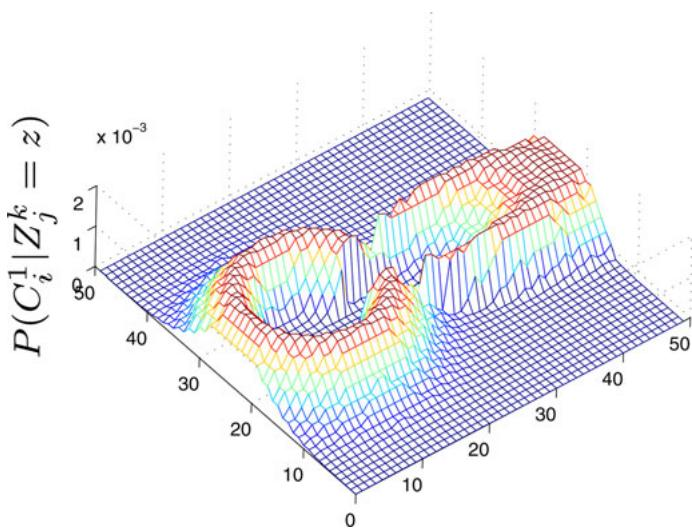  
Fig. 4. Distribution of $P ( C _ { i } ^ { 1 } | Z _ { j } ^ { k } = z )$ over a $5 0 \times 5 0$ grid for the directional antenna given that $P ( C _ { i } ^ { 1 } )$ is the same across all cells.

1) Since none of radio sources in cell i is transmitting, the condition $Z _ { j } ^ { k } = z$ cannot provide additional information for event $C _ { i }$ , which implies $P ( C _ { i } | Z _ { i } ^ { k } = z ) = P ( C _ { i } )$

2) There must be one active cell $s , s \in I$ and $s \neq i .$

3) Joint conditional event $( C _ { i } , C _ { i } ^ { 0 } | Z _ { i } ^ { k } = z )$ is equivalent to the union of the collection of events $\{ ( C _ { i } , C _ { s } ^ { 1 } | Z _ { j } ^ { k } =$ $z ) , s \neq i , s \in I \}$ because of no collision.

4) Events $C _ { i }$ and $C _ { s } ^ { 1 }$ are independent.

Therefore, we can obtain

$$
P ( C _ { i } , C _ { i } ^ { 0 } | Z _ { j } ^ { k } = z ) = P ( C _ { i } ) \sum _ { s \neq i , s \in I } P ( C _ { s } ^ { 1 } | Z _ { j } ^ { k } = z ) .\tag{16}
$$

Note that $P ( C _ { s } ^ { 1 } | Z _ { j } ^ { k } = z )$ can be computed using (15). By the substitution of (15) and (16) into (14), we obtain

$$
\begin{array} { l } { P ( C _ { i } | Z _ { j } ^ { k } = z ) } \\ { = \frac { \displaystyle \left( { P ( Z _ { j } ^ { k } = z | C _ { i } ^ { 1 } ) P ( C _ { i } ^ { 1 } ) } \right. } { \displaystyle \left. + P ( C _ { i } ) \sum _ { s \neq i , s \in I } P ( Z _ { j } ^ { k } = z | C _ { s } ^ { 1 } ) P ( C _ { s } ^ { 1 } ) \right) } . } \end{array}\tag{17}
$$

Unfortunately, (15) and (17) cannot be directly used in the system because $P ( C _ { i } )$ and $P ( C _ { i } ^ { 1 } )$ are not available. We have to rely on the conditional versions of $P ( C _ { i } )$ and $P ( C _ { i } ^ { 1 } )$ that build on the observation $\mathbf { Z } ^ { - } ( Z _ { j } ^ { k } )$ . We can derive the following from (15) by adding $\mathbf { Z } ^ { - } ( Z _ { j } ^ { k } )$ as the condition:

$$
\begin{array} { r l } & { P ( C _ { i } ^ { 1 } | \{ Z _ { j } ^ { k } = z \} \cup \mathbf { Z } ^ { - } ( Z _ { j } ^ { k } ) ) } \\ & { = \frac { P ( Z _ { j } ^ { k } = z | C _ { i } ^ { 1 } , \mathbf { Z } ^ { - } ( Z _ { j } ^ { k } ) ) P ( C _ { i } ^ { 1 } | \mathbf { Z } ^ { - } ( Z _ { j } ^ { k } ) ) } { \sum _ { s \in I } P ( Z _ { j } ^ { k } = z | C _ { s } ^ { 1 } , \mathbf { Z } ^ { - } ( Z _ { j } ^ { k } ) ) P ( C _ { s } ^ { 1 } | \mathbf { Z } ^ { - } ( Z _ { j } ^ { k } ) ) } . } \end{array}\tag{18}
$$

Since the conditional event $Z _ { j } ^ { k } = z$ is independent of the previous RSS values $\mathbf { Z } ^ { - } ( Z _ { i } ^ { k } )$ given $C _ { i } ^ { 1 }$ , we know $P ( Z _ { j } ^ { k } =$ $z | C _ { i } ^ { 1 } , \mathbf { Z } ^ { - } ( Z _ { j } ^ { k } ) ) = P ( Z _ { j } ^ { k } = \bar { z } | C _ { i } ^ { 1 } )$ . According to the definition,

$\{ Z _ { j } ^ { k } = z \} \cup \mathbf { Z } ^ { - } ( Z _ { j } ^ { k } ) = \mathbf { Z } ( Z _ { j } ^ { k } )$ . Equation (18) can be rewritten as

$$
P ( C _ { i } ^ { 1 } | \mathbf { Z } ( Z _ { j } ^ { k } ) ) = \frac { P ( Z _ { j } ^ { k } = z | C _ { i } ^ { 1 } ) P ( C _ { i } ^ { 1 } | \mathbf { Z } ^ { - } ( Z _ { j } ^ { k } ) ) } { \sum _ { s \in I } P ( Z _ { j } ^ { k } = z | C _ { s } ^ { 1 } ) P ( C _ { s } ^ { 1 } | \mathbf { Z } ^ { - } ( Z _ { j } ^ { k } ) ) } .\tag{19}
$$

Similarly, from (17), we can derive the following:

$$
\begin{array} { r l } & { P ( C _ { i } | \mathbf { Z } ( Z _ { j } ^ { k } ) ) } \\ & { = \frac { \Big ( P ( Z _ { j } ^ { k } = z | C _ { i } ^ { 1 } ) P ( C _ { i } ^ { 1 } | \mathbf { Z } ^ { - } ( Z _ { j } ^ { k } ) ) } { + P ( C _ { i } | \mathbf { Z } ^ { - } ( Z _ { j } ^ { k } ) ) } } \\ & { = \frac { \Big ( \begin{array} { l } { \begin{array} { r l } & { \sum _ { s \neq i , s \in I } P ( Z _ { j } ^ { k } = z | C _ { s } ^ { 1 } ) P ( C _ { s } ^ { 1 } | \mathbf { Z } ^ { - } ( Z _ { j } ^ { k } ) ) } \end{array} } \end{array} \Big ) } { \sum _ { s \in I } P ( Z _ { j } ^ { k } = z | C _ { s } ^ { 1 } ) P ( C _ { s } ^ { 1 } | \mathbf { Z } ^ { - } ( Z _ { j } ^ { k } ) ) } . } \end{array}\tag{20}
$$

Equations (19) and (20) provide a recursive formulation for updating the SPOG when a new radio transmission is sensed.

## V. ROBOT MOTION PLANNING

We threshold $P ( C _ { i } | \mathbf { Z } ( Z _ { j } ^ { k } ) )$ to determine if cell i contains at least a radio source (see Definition 1). The rate that $P ( C _ { i } | \mathbf { Z } ( Z _ { i } ^ { k } ) )  1$ for cells that contain radio sources determines localization speed and accuracy. Equations (19) and (20) show that $P ( C _ { i } | \mathbf { Z } ( Z _ { i } ^ { k } ) )$ largely depends the antenna model $P ( Z _ { i } ^ { k } = z | C _ { i } ^ { 1 } ) = \alpha \bar { g _ { i } } ( z )$ , which actually is a function of robot configurations. We can design robot configurations to increase $P ( C _ { i } | \mathbf { Z } ( Z _ { i } ^ { k } ) )$ , which will increase convergence speed. A good motion planner should warrant a good convergence speed.

Recall that (20) predicts $P ( C _ { i } | \mathbf { Z } ( Z _ { j } ^ { k } ) )$ at time k. At the moment before time $k ,$ define $w _ { s } : = \bar { P } ( C _ { s } ^ { 1 } | \mathbf { Z } ^ { - } ( Z _ { i } ^ { k } ) ) , s \in I$ , which are constants. To simplify the notation, we define $\xi _ { k } =$ $P ( C _ { i } | \mathbf { Z } ( Z _ { j } ^ { k } ) )$ and $\xi _ { k - 1 } = P ( C _ { i } | \mathbf { Z } ^ { - } ( Z _ { j } ^ { k } ) )$ . Then, (20) can be rewritten as

$$
\xi _ { k } = \xi _ { k - 1 } + \frac { ( 1 - \xi _ { k - 1 } ) w _ { i } } { \sum _ { s \in I } g _ { s } ( z ) w _ { s } } .\tag{21}
$$

We are interested in choosing a robot configuration $( x _ { j } ^ { k } , y _ { j } ^ { k } , \theta _ { j } ^ { k } )$ to maximize the posterior probability $P ( C _ { i } | \mathbf { Z } ( Z _ { j } ^ { k } ) )$ . Since $w _ { s } , s \in I$ , and $\xi _ { k - 1 }$ are constants at the moment prior to time $k , ( 2 1 )$ implies that the maximization of the posterior probability is

$$
( x _ { j } ^ { k * } , y _ { j } ^ { k * } , \theta _ { j } ^ { k * } ) = \arg \operatorname* { m a x } _ { ( x _ { j } ^ { k } , y _ { j } ^ { k } , \theta _ { j } ^ { k } ) } \xi _ { k }
$$

$$
= \arg \operatorname* { m i n } _ { ( x _ { j } ^ { k } , y _ { j } ^ { k } , \theta _ { j } ^ { k } ) } \frac { \sum _ { s \in I } g _ { s } ( z ) w _ { s } } { g _ { i } ( z ) }\tag{22}
$$

$$
= \arg \operatorname* { m i n } _ { ( x _ { j } ^ { k } , y _ { j } ^ { k } , \theta _ { j } ^ { k } ) } \sum _ { s \in I } w _ { s } r _ { s i } ( z )\tag{23}
$$

where

$$
r _ { s i } ( z ) = \frac { g _ { s } ( z ) } { g _ { i } ( z ) } = e ^ { - \frac { 1 } { 2 \sigma ^ { 2 } } [ ( z - \mu _ { s } ) ^ { 2 } - ( z - \mu _ { i } ) ^ { 2 } ] }\tag{24}
$$

$( x _ { j } ^ { k * } , y _ { j } ^ { k * } , \theta _ { j } ^ { k * } )$ is the optimal robot configuration, and

$$
\mu _ { s } = 1 0 \big ( \log _ { 1 0 } C - \beta \log _ { 1 0 } d _ { s j } ^ { k } + \log _ { 1 0 } \varphi ( \phi _ { s j } ^ { k } ) \big ) \quad \forall s \in I .\tag{25}
$$

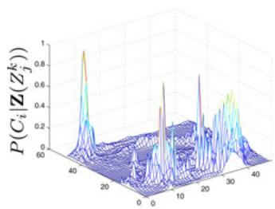  
(a)

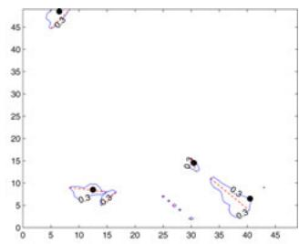  
(b)  
Fig. 5. (a) Example of $P ( C _ { i } | \mathbf { Z } ( Z _ { j } ^ { k } ) )$ distribution and (b) radio source locations, a sample level set $L ( 0 . 3 )$ , and ridges over a $5 0 \times 5 0$ grid for the case. The radio source locations are shown with black dots. The level set is bounded inside the blue solid lines. The red dashed lines denote the corresponding ridges for the level set components.

To simplify the notation, let us define $\begin{array} { r } { r _ { i } : = \sum _ { s \in I } w _ { s } r _ { s i } ( z ) } \end{array}$ . Recall that $w _ { s } = P ( C _ { s } ^ { 1 } | \mathbf { Z } ^ { - } ( Z _ { i } ^ { k } ) ) , s \in I$ . From statistics [42], [43], we know that $r _ { i }$ is the likelihood ratio for two candidate distributions: the univariate Gaussian distribution that is represented by $g _ { i } ( z )$ and the Gaussian mixture that is represented by $\sum _ { s \in I } w _ { s } g _ { s } ( z )$ . Let us use the Gaussian mixture as $\mathcal { H } _ { \mathrm { 0 } }$ hypothesis and the univariate Gaussian as $\mathcal { H } _ { 1 }$ hypothesis for the likelihood ratio test of the unknown distribution of the random noise in $z .$ Minimizing $r _ { i }$ actually minimizes the likelihood that noise in z is from the Gaussian mixture as opposed to the univariate Gaussian distribution. This is very intuitive for our problem.

The optimization problem in (23) is not directly solvable because z is the RSS of the future reception at time k and $r _ { i }$ is not available. Therefore, to find the global optimal $( x _ { j } ^ { k * } , y _ { j } ^ { k * } , \theta _ { j } ^ { k * } )$ for the nonlinear optimization problem is impractical. Actually, a robust local optimal solution would be a good candidate solution because the solution can also effectively accelerate the posterior probability convergence for $\xi _ { k }$ . Defining $\mathbf { x } _ { j } ^ { k } = \binom { x _ { j } ^ { k } } { y _ { j } ^ { k } }$ and $\mathbf { x } _ { i } = \big [ _ { y _ { i } } ^ { x _ { i } } \big ]$ , we have the following lemma with its proof in the Appendix.

Lemma 1: If the robot is located at the center of the cell i at time $k , \mathbf { x } _ { i } ^ { k } = \mathbf { x } _ { i }$ , then the likelihood ratio $r _ { i }$ is located at a local minima regardless of future reception z.

Remark 1: Note that Lemma 1 and its proof do not specify robot orientation $\theta _ { j } ^ { k }$ . This is because of the fact that the RSS receiver is saturated when $\mathbf { x } _ { j } ^ { k }  \mathbf { x } _ { i }$ according to (6). Hence, $\varphi = 1$ is constant in (25), which means that the $\theta _ { j } ^ { k }$ value is irrelevant.

Lemma 1 suggests that the principle of the motion planning is to drive the robot into the cells with the high $P ( C _ { i } | \mathbf { Z } ( Z _ { j } ^ { k } ) )$ values. This principle inspires us to develop a ridge walking algorithm (RWA) for the robot motion planning.

Fig. 5(a) illustrates an example of the distribution of $P ( C _ { i } | \mathbf { Z } ( Z _ { j } ^ { k } ) )$ over a $5 0 \times 5 0 ~ \mathrm { g r i d }$ . The actual radio source positions are shown as black dots in Fig. 5(b). $P ( C _ { i } | \mathbf { Z } ( Z _ { i } ^ { k } ) )$ value is much larger in the area adjacent to radio sources than that of other areas. To study the spatial distribution of $P ( C _ { i } | \mathbf { Z } ( Z _ { j } ^ { k } ) )$ ), we introduce level set $L ( p ) , p \in ( 0 , 1 ]$ as follows:

$$
L ( p ) = \{ i | P ( C _ { i } | \mathbf { Z } ( Z _ { j } ^ { k } ) ) \geq p , i \in I \} .\tag{26}
$$

Let us envision that a plane parallel to the ground plane intersects the mountain-like $P ( C _ { i } | \mathbf { Z } ( Z _ { j } ^ { k } ) )$ distribution at height $p$ in Fig. ${ 5 ( \mathrm { a ) } }$ . The intersection generates $L ( p )$ that contains all cells with $P ( C _ { i } | \mathbf { Z } ( Z _ { i } ^ { k } ) )$ above the plane. Fig. 5(b) illustrates the level set $L ( 0 . 3 )$ for the example shown in Fig. 5(a).

Fig. 5(b) also shows that $L ( p )$ usually consists of several disconnected components. Define $l _ { \mathrm { m a x } }$ as the total number of the disconnected components and $L _ { l }$ as the lth component, $l = 1 , \ldots , l _ { \mathrm { m a x } }$ . Therefore, $L ( p ) = L _ { 1 } \cup L _ { 2 } \cup \dots \cup L _ { l _ { \operatorname* { m a x } } }$ , and $L _ { l } \cap L _ { m } = \emptyset$ , where $m \neq l$ and $m = 1 , 2 , \ldots , l _ { \mathrm { m a x } }$ . For the lth component, we define its ridge $R _ { l }$ as the line segment defined by points $( x ^ { \prime } , y ^ { \prime } )$ and $( x ^ { \prime \prime } , y ^ { \prime \prime } )$ on $L _ { l } \colon$

$$
\begin{array} { c } { R _ { l } = \{ ( x , y ) | x = ( 1 - \alpha ) x ^ { \prime } + \alpha x ^ { \prime \prime } \nonumber } \\ { y = ( 1 - \alpha ) y ^ { \prime } + \alpha y ^ { \prime \prime } , \alpha \in [ 0 , 1 ] \} } \end{array}\tag{27}
$$

where points $( x ^ { \prime } , y ^ { \prime } )$ and $( x ^ { \prime \prime } , y ^ { \prime \prime } )$ are the two points on $L _ { l }$ such that the distance between $( x ^ { \prime } , y ^ { \prime } )$ and $( x ^ { \prime \prime } , y ^ { \prime \prime } )$ is the maximum.

If the robot walks on the ridge, the probability that the robot is close to a potential radio source is high. Because of the walk ing direction, the antenna always points along the ridge, which ensures the most sensitive reception region of the antenna to overlap with the lth component. In the RWA, there are two types of robot motion: on-ridge movements and off-ridge movements. Since the on-ridge movement is the effective movement for the localization purpose, it is desirable for the robot to allocate its time to on-ridge movements as much as possible. The off-ridge movement denotes the travel in-between ridges for the robot. Since we have a fixed time period, we set the robot to travel at its fastest speed along the shortest path for off-ridge movements to save time for on-ridge movements.

We treat the end point of each on-ridge segment as a vertex. We define edges as the line segments connecting different vertices on the 2-D plane. With a vertex set $V ,$ an edge set E, and a graph $G ( V , E )$ , to find the shortest path is an instance of the traveling salesman problem (TSP). The only difference is that edges corresponding to on-ridge movements must be included in the solution. We can modify the original TSP by treating each on-ridge edge and its two end points as a super vertex. Then, solving the TSP provides an efficient trajectory for the robot. Define $v _ { \mathrm { m a x } }$ as the maximum velocity that the robot can travel. The time available for on-ridge movements tON is

$$
t _ { \mathrm { O N } } = \tau _ { 0 } - d _ { \mathrm { O F F } } / v _ { \mathrm { m a x } }\tag{28}
$$

where $d _ { \mathrm { O F F } }$ is the total length of off-ridge edges. We allocate $t _ { \mathrm { O N } }$ to each ridge proportional to the probability that the corresponding component contains a radio source. For component $l ,$ we define the time the robot spend on the ridge $R _ { l }$ as $\tau _ { l }$ Therefore

$$
\tau _ { l } = \frac { \sum _ { i \in L _ { l } } P ( C _ { i } | \mathbf { Z } ( Z _ { j } ^ { k } ) ) } { \sum _ { i \in L ( p ) } P ( C _ { i } | \mathbf { Z } ( Z _ { j } ^ { k } ) ) } t _ { \mathrm { O N } } .\tag{29}
$$

With $\tau _ { l }$ and the length of each ridge, it is trivial to find the robot velocity for the ridge. If the low-cost robot cannot accurately control its speed, then we cannot execute the precise time allocation in (29). If so, we can simply set the robot to its maximum speed for off-ridge movements and minimum speed for on-ridge movements.

Algorithm 1: SPOG Update Algorithm   
input : the received RF signal strength $Z _ { j } ^ { k } = z$   
output: $P ( C _ { i } | \mathbf { Z } ( Z _ { j } ^ { k } ) ) , P ( C _ { i } ^ { 1 } | \mathbf { Z } ( Z _ { j } ^ { k } ) ) , i \in \overline { { I } } ,$ and $\mathbb { C } ^ { * }$   
for $i \in I$ do O(n)   
Compute distance $d _ { i j } ^ { k }$ using (2) O(1)   
Compute bearing $\phi _ { i j } ^ { k }$ using (3) O(1)   
Compute radiation pattern $\varphi ( \phi _ { i j } ^ { k } )$ using (6) O(1)   
Compute $\mu _ { i }$ using (5) O(1)   
Compute $g _ { i } ( z )$ using (7) O(1)   
Compute $G _ { i } ( z )$ using (8) O(1)   
Compute $P ( Z _ { j } ^ { k } = z | C _ { i } ^ { 1 } )$ using (9) O(1)   
for $i \in I$ do O(n)   
Compute $P ( C _ { i } ^ { 1 } | \mathbf { Z } ( Z _ { i } ^ { k } ) )$ using (19) O(n)   
Compute $P ( C _ { i } | \mathbf { Z } ( Z _ { j } ^ { k } ) )$ using (20) O(n)   
if $P ( C _ { i } | \mathbf { Z } ( Z _ { i } ^ { k } ) ) > \tilde { p _ { t } }$ and $i \notin \mathbb { C } ^ { * }$ then   
$\big \lfloor \mathbb { C } ^ { * } = \mathbb { C } ^ { * } \cup \{ i \}$ O(1)

## VI. ALGORITHMS

## A. Algorithm Pseudo Code and Complexity

To summarize our analysis, we present two algorithms including an SPOG update algorithm and the RWA. Corresponding to the sensing problem in Section III-D, the SPOG update algorithm (i.e., Algorithm 1) runs when a radio signal is detected. Define set $\mathbb { C } ^ { * }$ as the set of cells that contain radio sources with the initial value $\mathbb { C } ^ { * } = \varnothing$ . Recall that $p _ { t }$ is the probability threshold for finding the radio source. The robot reports the cells that satisfy $P ( C _ { i } | \mathbf { Z } ( Z _ { j } ^ { k } ) ) > p _ { t }$ as the cells that contain at least one radio source.

Recall that n is the total number of cells. It is clear that the complexity of Algorithm 1 is $O ( n ^ { 2 } )$ . The initial value settings are $P ( C _ { i } | \mathbf { Z } ( Z _ { 0 } ^ { 0 } ) ) = 0$ and $P ( C _ { i } ^ { 1 } | \mathbf { Z } ( Z _ { 0 } ^ { 0 } ) ) = 1 / n$

The RWA runs every τ0 time. As illustrated in Algorithm 2, the robot performs random walking until set $L ( p ) \neq \emptyset$ at the initialization stage. Then, the robot switches into the normal ridge walking mode. The robot stops when no additional radio source has been found in $k _ { \mathrm { m a x } }$ consecutive periods, where $k _ { \mathrm { m a x } }$ is a preset iteration number. For the Euclidean TSP, we can also use approximation approaches, such as the minimum spanning tree (MST) approximation [44, p. 969]. If so, the overall complexity can be reduced to $O ( n + l _ { \mathrm { m a x } } ^ { 2 } )$

## B. Localization Time

An important question that remains to be answered is how long does it take for the RWA to find a radio source. We need to find the upper bound of the searching/localization time. Let $T _ { s }$ denote the searching time. Obviously, $T _ { s }$ is related to how often the radio source transmits. To facilitate our analysis, let us assume that the radio source i transmits according to a Poisson process with a rate of $\lambda _ { i }$ . Since we are looking for the upper bound of $T _ { s } ,$ , we also tighten the convergence condition by increasing the probability threshold $p _ { t }$ in Definition 1. Threshold $p _ { t }$ is set high so that the robot must receive a saturated signal when considering radio source i found. It means that the robot must receive the transmission within the distance of $d _ { a }$ of the radio source. This defines a sensing circle with its center located at the radio source i and a radius of $d _ { a }$

<table><tr><td>Algorithm 2: Ridge Walking Algorithm</td></tr><tr><td>input  $: P ( C _ { i } | \mathbf { Z } ( Z _ { j } ^ { k } ) ) , P ( C _ { i } ^ { 1 } | \mathbf { Z } ( Z _ { j } ^ { k } ) ) , i \in I$  output: Robot motion  $\{ \mathbf { r } ( t ) | t ^ { k } \leq \check { t } < t ^ { k + 1 } \}$  and  $\mathbb { C } ^ { * }$  Compute  $L ( p )$  O(n)</td></tr><tr><td>if  $L ( p ) = \emptyset$  then L  $\{ \mathbf { r } ( t ) | t ^ { k } \leq t < t ^ { k + 1 } \}$  = random walk O(1)</td></tr><tr><td>else</td></tr><tr><td>Find all disconnected components in  $L ( p )$   $O ( n )$ </td></tr><tr><td>Compute  $R _ { l }$  for each  $L _ { l }$   $O ( n )$ </td></tr><tr><td>Construct graph G and solve TSP  $O ( l _ { \mathrm { m a x } } ^ { 2 } )$  Compute  $d _ { \mathrm { o F F } }$   $O ( l _ { \mathrm { m a x } } )$  Compute using (28) (1)</td></tr></table>

Without loss of generality, we assume the field of localization as a disk with a radius of 1. Define $T _ { \mathrm { T S P } }$ to be the amount of time for the robot to finish a TSP tour in the RWA. Let $\tau _ { \mathrm { I N } }$ and τ be portions of the tour within and outside distance of $d _ { a }$ of radio source $i ,$ respectively. Hence

$$
T _ { \mathrm { T S P } } = \tau _ { \mathrm { I N } } + \tau _ { \mathrm { O U T } } .\tag{30}
$$

We have the following theorem.

Theorem 1: The expected searching time $E ( T _ { s } )$ of radio source i has the following upper bound:

$$
E ( T _ { s } ) \leq \frac { \tau _ { 0 } } { 1 - e ^ { - \lambda _ { i } \tau _ { 0 } } } + \frac { 1 } { \lambda _ { i } } + \frac { 4 \sqrt { 3 } } { v _ { \mathrm { a v g } } } \Big [ \frac { 1 } { 2 } + E \big ( \frac { e ^ { - \lambda _ { i } \tau _ { \mathrm { I N } } } } { 1 - e ^ { - \lambda _ { i } \tau _ { \mathrm { I N } } } } \big ) \Big ]\tag{31}
$$

where $v _ { \mathrm { a v g } }$ is the average traveling speed of the robot and defined in (40).

Proof: From [34, Th. 1], we know that the expected time to search for a transient signal source is

$$
E ( T _ { s } ) = E ( D ) + \frac { 1 } { \lambda _ { i } } + E \left( \tau _ { \mathrm { O U T } } \frac { e ^ { - \lambda _ { i } \tau _ { \mathrm { I N } } } } { 1 - e ^ { - \lambda _ { i } \tau _ { \mathrm { I N } } } } \right)\tag{32}
$$

where $D$ is the amount of time from the beginning to the moment that the robot is within the distance $d _ { a }$ of the radio source i during the repetitive TSP tours. It is clear that $D$ is a random variable. From Algorithm 2, the robot performs random walk in the first period to initialize the SPOG. The expect value of $D$ can be obtained by conditioning on the event $A _ { i }$ that radio source i has at least one transmission during the initial $\tau _ { 0 }$ time. If $A _ { i }$ is true, then the TSP tour planned at the end of first period would come across the sensing circle of the radio source i. If $A _ { i }$ is not true, the system returns to the same initial state because the chance that the next TSP tour will come across the sensing circle is negligible. Hence, we have

$$
E ( D | A _ { i } ) = \tau _ { 0 } + E ( T _ { \mathrm { T S P } } ) / 2\tag{33}
$$

$$
\begin{array} { r } { E ( D | \bar { A } _ { i } ) \approx \tau _ { 0 } + E ( D ) . } \end{array}\tag{34}
$$

From the property of a Poisson process, we know

$$
P ( \bar { A } _ { i } ) = e ^ { - \lambda _ { i } \tau _ { 0 } } \mathrm { a n d } P ( A _ { i } ) = 1 - e ^ { - \lambda _ { i } \tau _ { 0 } } .\tag{35}
$$

Combining (35) with (33) and (34), we have

$$
\begin{array} { c l c r } { { } } & { { } } & { { E ( D ) = E ( D | A _ { i } ) P ( A _ { i } ) + E ( D | \bar { A } _ { i } ) P ( \bar { A } _ { i } ) } } \\ { { } } & { { } } & { { = \displaystyle \frac { \tau _ { 0 } } { 1 - e ^ { - \lambda _ { i } \tau _ { 0 } } } + E ( T _ { \mathrm { T S P } } ) / 2 . } } \end{array}\tag{36}
$$

In addition, since τIN $\ll$ τ and $\tau _ { \mathrm { I N } }$ is independent of $T _ { \mathrm { T S P } }$ the last term of (32) can be approximated as

$$
E \left( \tau _ { \mathrm { O U T } } \frac { e ^ { - \lambda _ { i } \tau _ { \mathrm { I N } } } } { 1 - e ^ { - \lambda _ { i } \tau _ { \mathrm { I N } } } } \right) \approx E ( T _ { \mathrm { T S P } } ) E \left( \frac { e ^ { - \lambda _ { i } \tau _ { \mathrm { I N } } } } { 1 - e ^ { - \lambda _ { i } \tau _ { \mathrm { I N } } } } \right) .\tag{37}
$$

If the TSP tour straightly crosses the sensing circle with a speed of v, we have shown how to compute $\begin{array} { r } { E \big ( \frac { { e } ^ { - \big ( \lambda _ { i } \tau _ { \mathrm { I N } } } } { 1 - e ^ { - \lambda _ { i } \tau _ { \mathrm { I N } } } } \big ) } \end{array}$ in [34]:

$$
E \left( \frac { e ^ { - \lambda _ { i } \tau _ { \mathrm { I N } } } } { 1 - e ^ { - \lambda _ { i } \tau _ { \mathrm { I N } } } } \right) = \int _ { 0 } ^ { \pi / 2 } \frac { 1 } { e ^ { \frac { 2 \lambda _ { i } d _ { a } \sin \theta } { v } } - 1 } \sin \theta d \theta .\tag{38}
$$

When the field is large, the TSP tour consists of long and straight line segments. Equation (38) is a good approximation for general $\begin{array} { r } { E \big ( \frac { { e } ^ { - \displaystyle \lambda _ { i } \tau _ { \mathrm { I N } } } } { 1 - e ^ { - \displaystyle \lambda _ { i } \tau _ { \mathrm { I N } } } } \big ) } \end{array}$ . By the substitution of (36) and (37) into (32), we have

$$
\begin{array} { r } { E ( T _ { s } ) = \displaystyle { \frac { \tau _ { 0 } } { 1 - e ^ { - \lambda _ { i } \tau _ { 0 } } } } + \frac { 1 } { \lambda _ { i } } + E ( T _ { \mathrm { T S P } } ) } \\ { \times \left[ \frac { 1 } { 2 } + E \left( \frac { e ^ { - \lambda _ { i } \tau _ { \mathrm { I N } } } } { 1 - e ^ { - \lambda _ { i } \tau _ { \mathrm { I N } } } } \right) \right] . } \end{array}\tag{39}
$$

Define $L _ { \mathrm { T S P } }$ as the length of the TSP tour and $v _ { \mathrm { a v g } }$ as the average speed during the tour that satisfies

$$
E ( T _ { \mathrm { T S P } } ) = E ( L _ { \mathrm { T S P } } ) / v _ { \mathrm { a v g } } .\tag{40}
$$

Define $L _ { \mathrm { M S T } }$ as the summation of MST edges for the vertices in the TSP tour. From [44], we know that $L _ { \mathrm { T S P } } \leq 2 L _ { \mathrm { M S T } }$ since triangle inequalities are satisfied for the Euclidean TSP. Define $\mathcal { E }$ as the edge index set for the MST and $e _ { l }$ as the lth edge in $\mathcal { E } .$ From its definition, we know that $\begin{array} { r } { L _ { \mathrm { M S T } } = \sum _ { l \in \mathcal { E } } | e _ { l } | } \end{array}$ and that

$$
L _ { \mathrm { M S T } } = \sqrt { \left( \sum _ { l \in \mathcal { E } } \left. e _ { l } \right. \right) ^ { 2 } } \leq \sqrt { 2 \sum _ { l \in \mathcal { E } } \left. e _ { l } \right. ^ { 2 } } .\tag{41}
$$

Since all vertices are located inside a unit disk and distances are Euclidean, from [45, Th. 1], we have

$$
\sum _ { l \in { \mathcal { E } } } | e _ { l } | ^ { 2 } \leq 6\tag{42}
$$

regardless of the number of vertices in the graph. Combining (40)–(42), we have

$$
E ( T _ { \mathrm { T S P } } ) \leq 4 \sqrt { 3 } / v _ { \mathrm { a v g } } .\tag{43}
$$

Equation (31) is proved by substituting (43) into (39).

Remark 2: An important result that is given by Theorem 1 is the fact that entries in (31) are not sensitive to the number of radio sources. This means that our RWA has excellent scalability when the number of radio sources increases.

## C. Extensions

Increasing localization accuracy, handling of uneven transmission rates, and dealing with obstacles in the searching region are the three important extensions for application purposes.

Increasing localization accuracy: We discretize the searching space, and the localization accuracy is inherently limited by grid resolution. If the localization accuracy cannot satisfy application requirement, we can run a postprocessing algorithm to increase the accuracy. Once a cell that contains a radio source is identified, we can verify all RSSs to identify transmissions that are initiated by the source based on distances between the cell center and the robot positions when transmissions occurred. We can identify a group of transmissions that are within a preset distance threshold since the robot has less range ambiguity when it moves closer to the source. Based on the transmissions, we can estimate the source location using the maximum likelihood estimator by minimizing the Mahalanobis distance. The process can provide both mean and variance of the source position. Since the method is a standard approach [46], we omit the details. In fact, when the cell is identified, the problem can be reduced to the regular localization problem with multiple measurements.

Handling of uneven transmission rates: The RWA tracks highprobability regions by patrolling. This is an efficient approach when the transmission rates of radio sources are close to each other. If a few nodes transmit significantly more frequently than others, their residing cells can be quickly identified. This often happens if the sensor network employs some nodes as routers. In such cases, repeatedly visiting the cells is inefficient, and the RWA needs to remove ridges corresponding to the identified nodes before solving the TSP such that the robot can focus on searching for the remaining nodes.

Dealing with obstacles in the searching region: In the presence of obstacles, the SPOG framework can be easily adapted by marking obstacle-occupied cells as nontraversable. For motion planning, we can still use the idea of RWA but connecting the ridges in the presence of obstacle is different because simple line connections may not work. This can be addressed by using the established techniques in motion planning, such as sampling- or rapid-exploring random tree (RRT)-based approaches [47]. Depending upon the methods that are used, the path length, which is the most important factor that determines the convergence speed, may vary, and the final searching time analysis should reflect the complexity of obstacles.

## VII. EXPERIMENTS

We have implemented the algorithms using Microsoft Visual C++ .NET 2005 with OpenGL on a PC desktop with an Intel 2.13-GHz Core 2 Duo CPU and 2-GB RAM. The machine runs Microsoft Windows XP. The algorithms are tested in the hardware-driven simulation and physical experiments. The antenna on the robot is HyperGainT Model HG2415G that is a

2.4-GHz 15-dBi reflector grid antenna. The radio sources are Zigbee nodes, which are XBeeT with ZigBeeT/802.15.4 OEM RF Modules by MaxStream, Inc. The antenna is calibrated first with the radio sources. The calibration is conducted at 328 configurations and 6560 readings have been collected. The calibrated antenna model is represented as the coefficients in (5) and σ in (7).

## A. Simulation

We use the data from the real hardware to drive the simulation experiments here.

The grid is a square with $5 0 \times 5 0$ cells. Each grid cell has a size of $5 . 0 8 \times 5 . 0 8 \mathrm { c m ^ { 2 } }$ . Each radio source generates radio transmission signals according to an independently and identically distributed Poisson process with a rate of $\lambda = 0 . 0 1 2$ packets per second. The threshold $p _ { t } = 0 . 8$ and the level set parameter $\begin{array} { r } { p = { \frac { 6 } { n } } \sum _ { i } P ( C _ { i } | \mathbf { Z } ( Z _ { j } ^ { k } ) ) } \end{array}$ , where the constant 6 is determined by many experimental trials. During each trial of the simulation, we randomly generate radio source locations in the 50× 50 grid.

The first experiment we conducted is to study how fast the RWA can localize all radio sources under different $\tau _ { 0 }$ settings. This determines how often we should run the RWA. Fig. 6(a) shows the test results. We change the radio source number from 2 to 10 during the simulation. Each point in Fig. 6(a) is an average of 10 trials. It is interesting that the RWA is at its best performance when $\tau _ { 0 } = 8 0 0 :$ s, regardless of the radio source number. This means that the robot needs to listen to each radio for an expected value of $8 0 0 \lambda = 9 . 6$ times before repeating the algorithm.

Fig. 6(b) illustrates how $P ( C _ { i } | \mathbf { Z } ( Z _ { j } ^ { k } ) )$ converges at the radio source for a trial with six radio sources. It is clear that $P ( C _ { i } | \mathbf { Z } ( Z _ { j } ^ { k } ) )$ tends monotonically toward 1. This is what we expect to see: $P ( C _ { i } | \mathbf { Z } ( Z _ { j } ^ { k } ) )  1$ for cells containing radio sources.

We also compare our algorithms to two intuitive heuristics, namely, a random walk and a fixed-route patrol. The random walk is chosen because it is considered as the most conservative approach. According to [34], a 2-D lattice-based random walk can cover the entire field over a long run. Hence, it does not have a blind spot. The fixed-route patrol traverses the field using a predefined route that scans all cells. It warrants equal coverage but might not visit cells with radio sources frequent enough because of the route length. We increase the radio source number from 2 to 10 to observe the performance of each method. For each trial, we test all three methods. We repeat for 10 trials for each radio source number and compute the average time required for the localization of all radio sources. Fig. 6(c) illustrates comparison results. It is clear that the RWA significantly outperforms the two heuristics in terms of localization time. The result can be explained that the robot motion for the two heuristics does not consider sensor location distribution and, hence, cannot achieve good performance.

## B. Physical Experiments

We test both SPOG update and RWA in physical experiments. The physical experiment is conducted in a $\mathrm { 1 0 \times 1 0 ~ m ^ { 2 } }$ field, which is evenly divided into $5 0 \times 5 0$ cells. Each cell has a side length of 20 cm. The threshold for the SPOG convergence is $p _ { t } = 0 . 7 .$

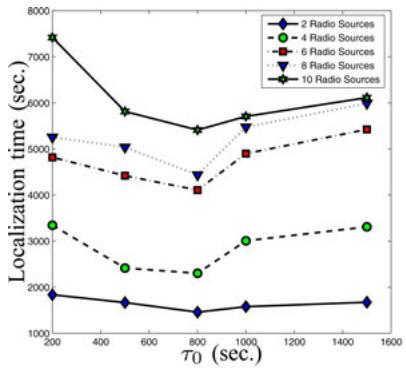  
(a)

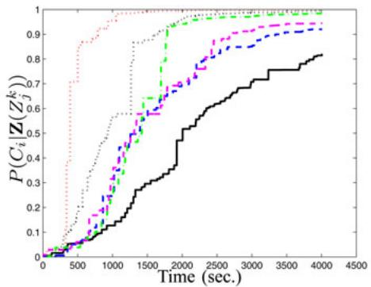  
(b)

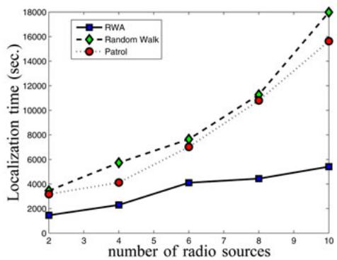  
(c)  
Fig. 6. Simulation results. (a) RWA performance versus $\tau _ { 0 } ,$ , (b) convergence of $P ( C _ { i } | \mathbf { Z } ( Z _ { j } ^ { k } ) )$ at radio source locations for a six-radio source case, and (c) localization time comparison among the RWA, the random walk, and the fixed-route patrol.

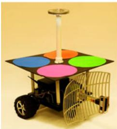  
(a)

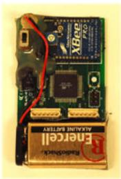  
(b)

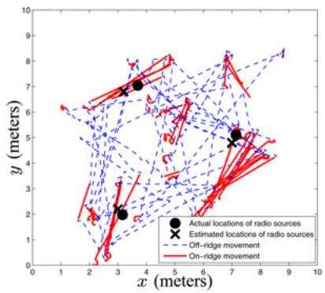  
(c)

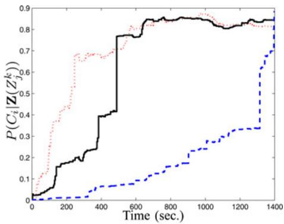  
(d)  
Fig. 7. Physical experiment hardware and results. (a) Robot. (b) RF source is XBeeT with ZigBeeT/802.15.4 OEM RF Modules by MaxStream, Inc. (c) Sample robot trajectory. (d) Convergence of $P ( C _ { i } | \mathbf { Z } ( Z _ { i } ^ { k } ) )$ for cells containing radio sources.

The robot is custom made in our laboratory [see Fig. 7(a)]. The robot measures $5 0 \times 4 7 \times 5 0 \mathrm { c m ^ { 3 } }$ in size. The robot has two front drive wheels and one rear cast wheel and uses a typical differential driving structure. The robot has a maximum traveling speed $v _ { \mathrm { m a x } }$ of 40 cm/s. The four color patches on the top of the robot are used for obtaining robot location and orientation from an overhead camera that is mounted at a height of a three-story building. The top sliver ring above the color patches contains white LEDs that are used to illuminate the color patches at night for night experiments. The vision-based localization system can provide the robot with location at an accuracy of ±5 cm in each dimension of position and orientation $\mathrm { a t \pm 3 . 5 ^ { \circ } }$ at a frame rate of 11 frames/s.

Fig. 7(b) illustrates the aforementioned radio sources. We use three such radio sources in the experiment. Each of them is programmed with a Poisson transmission rate of 0.05 packets/s. We set $\tau _ { 0 } = 1 6 0 \mathrm { s }$ in the experiments. Fig. 7(c) illustrates the actual robot trajectory, actual location of the three radio sources, and the estimated locations of the radio sources. It is clear that the robot has successfully found all three radio sources with reasonable accuracy. The on-ridge and off-ridge parts of the robot trajectory are represented by red solid lines and blue dashed lines, respectively. The fact that most of on-ridge movements are close to the radio sources indicates that the RWA is effective.

Fig. 7(d) illustrates how $P ( C _ { i } | \mathbf { Z } ( Z _ { j } ^ { k } ) )$ converges at the three radio source cells during the physical experiment. Similar to what we have seen in simulation results in Fig. 6(b), $P ( C _ { i } | \mathbf { Z } ( Z _ { j } ^ { k } ) )$ of these cells tends toward 1. The cell represented by the blue dashed line has the slowest growing rate because the corresponding radio source transmits the fewest number of signals.

## VIII. CONCLUSION AND FUTURE WORK

System and algorithm developments that enable a mobile robot to localize multiple unknown transient radio sources have been reported. By the employment of a Monte Carlo approach, the radio transmission activities using an SPOG have been modeled and an SPOG update algorithm to track the radio source location and transmission rates has been proposed. Based on the SPOG, an RWA for robot motion planning by accelerating the SPOG convergence rate has been developed. For the n-cell grid, the SPOG update algorithm runs in $O ( n ^ { 2 } )$ time and the RWA runs in $O ( n + l _ { \mathrm { m a x } } ^ { 2 } )$ time. The fact that the time to find a radio source is insensitive to the number of radio sources, and hence, our algorithm has great scalability has been formally proved. The algorithm using simulation with the data from the real hardware and a physical experiment has been tested. In the simulation experiment, algorithms with a random walk and a fixed-route patrol heuristics have been compared. Our algorithms showed a consistently faster localization speed than that of the two heuristics. In the physical experiment, the SPOG and RWA have been tested in the setup that directs the mobile robot to search for three radio sources. The physical experiment results showed that the system and algorithm development were successful.

In the future, we are interested in extending SPOG and RWA to design a decentralized multiple-robot localization scheme. Tracking moving radio sources is another interesting extension of the proposed framework. We will consider various kinodynamic and energy constraints imposed by robots. More efficient motion planning strategies considering obstacles in the environment and optimal velocity profile will be explored for these problems. We will also apply the algorithms to human tracking in search and rescue and animal tracking in the nature environment.

## APPENDIX

## PROOF OF LEMMA 1

From (23), each entry in the Jacobian of $r _ { i }$ with respect to $\mu _ { s } , s \in I$ , can be computed as follows:

$$
\frac { \partial r _ { i } } { \partial \mu _ { s } } = \left\{ \begin{array} { l l } { \frac { w _ { s } } { \sigma ^ { 2 } } ( z - \mu _ { s } ) r _ { s i } ( z ) , } & { \mathrm { i f ~ } s \neq i } \\ { - \sum _ { a \in I , a \neq i } \frac { w _ { a } } { \sigma ^ { 2 } } ( z - \mu _ { i } ) r _ { a i } ( z ) , } & { \mathrm { i f ~ } s = i } \end{array} \right.\tag{44}
$$

where $a \in I$ is the new index variable. By the use of the chain rule, we obtain

$$
\begin{array} { l } { \displaystyle \frac { \partial r _ { i } } { \partial x _ { j } ^ { k } } = \sum _ { s \in I } \frac { \partial r _ { i } } { \partial \mu _ { s } } \frac { \partial \mu _ { s } } { \partial x _ { j } ^ { k } } } \\ { \displaystyle = - \sum _ { s \in I , s \neq i } \frac { w _ { s } } { \sigma ^ { 2 } } r _ { s i } ( z ) ( \mu _ { i } - \mu _ { s } ) \frac { \partial ( \mu _ { i } - \mu _ { s } ) } { \partial x _ { j } ^ { k } } . } \end{array}\tag{45}
$$

From (5), we know

$$
\mu _ { i } - \mu _ { s } = 1 0 \beta \log _ { 1 0 } \frac { d _ { s j } ^ { k } } { d _ { i j } ^ { k } } + 1 0 \log _ { 1 0 } \frac { \varphi ( \phi _ { i j } ^ { k } ) } { \varphi ( \phi _ { s j } ^ { k } ) } .\tag{46}
$$

By the substitution of (2) into the previous equations, we can compute its partial derivative with respect to x as follows:

$$
\frac { \partial ( \mu _ { i } - \mu _ { s } ) } { \partial x _ { j } ^ { k } } = 1 0 \beta \left( \frac { x _ { j } ^ { k } - x _ { s } } { ( d _ { s j } ^ { k } ) ^ { 2 } } - \frac { x _ { j } ^ { k } - x _ { i } } { ( d _ { i j } ^ { k } ) ^ { 2 } } \right) .\tag{47}
$$

Combining (45) and (47), we have

$$
\frac { \partial r _ { i } } { \partial x _ { j } ^ { k } } = - 1 0 \beta \sum _ { s \in I , s \neq i } \frac { w _ { s } } { \sigma ^ { 2 } } r _ { s i } ( z ) ( \mu _ { i } - \mu _ { s } ) \left( \frac { x _ { j } ^ { k } - x _ { s } } { ( d _ { s j } ^ { k } ) ^ { 2 } } - \frac { x _ { j } ^ { k } - x _ { i } } { ( d _ { i j } ^ { k } ) ^ { 2 } } \right) ,\tag{48}
$$

Similarly, we obtain

$$
\frac { \partial r _ { i } } { \partial y _ { j } ^ { k } } = - 1 0 \beta \sum _ { s \in I , s \neq i } \frac { w _ { s } } { \sigma ^ { 2 } } r _ { s i } ( z ) ( \mu _ { i } - \mu _ { s } ) \left( \frac { y _ { j } ^ { k } - y _ { s } } { ( d _ { s j } ^ { k } ) ^ { 2 } } - \frac { y _ { j } ^ { k } - y _ { i } } { ( d _ { i j } ^ { k } ) ^ { 2 } } \right)\tag{49}
$$

Defining $\begin{array} { r } { \nabla \mathbf { r } ^ { T } = [ \frac { \partial r _ { i } } { \partial x _ { i } ^ { k } } , \frac { \partial r _ { i } } { \partial y _ { i } ^ { k } } ] } \end{array}$ , we can verify the first-order optimality condition by computing $\nabla \mathbf { r } ^ { T } ( \mathbf { x } _ { j } ^ { k } - \mathbf { x } _ { i } )$ at the neighborhood of $( \mathbf { x } _ { j } ^ { k } = \mathbf { x } _ { i } )$

(50)

$$
\begin{array} { r l } & { \nabla \mathbf { r } ^ { T } ( s _ { k } ^ { \theta } - x _ { k } ) } \\ & { = 1 0 \beta \sum _ { s \in L \times s _ { k } } \frac { w _ { S } } { \alpha ^ { 2 } } r _ { s \in \mathcal { S } } ( z ) ( \beta \mu - \mu _ { s } ) } \\ & { \times \left\{ \left( \frac { \alpha _ { k } ^ { k } } { ( \delta _ { k } ^ { k } ) ^ { 2 } } - x _ { k } ^ { \theta _ { s } ^ { k } } - \frac { \alpha _ { k } ^ { k } } { ( \delta _ { k } ^ { k } ) ^ { 2 } } \right) ( x _ { s } ^ { k } - x _ { k } ) \right. } \\ & { + \left. \left( \frac { \beta _ { k } ^ { 2 } } { ( \delta _ { k } ^ { k } ) ^ { 2 } } - \frac { \beta _ { k } ^ { 2 } } { ( \delta _ { k } ^ { k } ) ^ { 2 } } - y _ { k } ^ { \theta _ { s } ^ { \prime } } \right) ( \beta s _ { j } ^ { k } - y _ { k } ) \right\} } \\ & { \approx - 1 0 \beta \sum _ { s \in L \times s _ { k } } \frac { w _ { S } } { \alpha ^ { 2 } } r _ { s \in \mathcal { S } } ( z ) ( \beta \mu _ { s } - \mu _ { s } ) } \\ & { \times \left\{ - \frac { ( \alpha _ { k } ^ { k } - x _ { k } ) ^ { 2 } + ( \beta _ { k } ^ { k } - y _ { k } ) ^ { 2 } } { ( \delta _ { k } ^ { k } ) ^ { 2 } } \right\} . } \end{array}\tag{51}
$$

Note that the approximation from (50) to (51) is based on the fact that $\begin{array} { r } { \left| \frac { x _ { j } ^ { k } - \overline { { x _ { s } } } } { ( d _ { s j } ^ { k } ) ^ { 2 } } \right| \ll \left| \frac { x _ { j } ^ { k } - x _ { i } } { ( d _ { i j } ^ { k } ) ^ { 2 } } \right| } \end{array}$ and $\begin{array} { r } { \left| \frac { y _ { j } ^ { k } - y _ { s } } { ( d _ { s j } ^ { k } ) ^ { 2 } } \right| \ll \left| \frac { y _ { j } ^ { k } - y _ { i } } { ( d _ { i j } ^ { k } ) ^ { 2 } } \right| } \end{array}$ when ${ \bf x } _ { j } ^ { k }  { \bf x } _ { i }$ . From (51), we know

$$
\operatorname* { l i m } _ { \mathbf { x } _ { j } ^ { k }  \mathbf { x } _ { i } } \nabla \mathbf { r } ^ { T } ( \mathbf { x } _ { j } ^ { k } - \mathbf { x } _ { i } ) = 1 0 \beta \sum _ { s \in I , s \neq i } \frac { w _ { s } } { \sigma ^ { 2 } } r _ { s i } ( z ) ( \mu _ { i } - \mu _ { s } ) \geq 0 .\tag{52}
$$

Therefore, $\mathbf { x } _ { j } ^ { k } = \mathbf { x } _ { i }$ is a local minima (see [48]) regardless of the z value. This proof relies on the limiting format of the first-order sufficient condition instead of a regular format because of the degeneracy in ratio computation. -

## ACKNOWLEDGMENT

The authors would like to thank K. Goldberg, R. Volz, E. Frew, and J. Xiao for their insightful discussions. The authors would also like to thank Q. Hu and Z. Goodwin for their contributions to the earlier implementation and experiments and Y. Xu, W. Li, H. Li, Y. Lu, and H. Ge for their inputs and contributions to the Networked Robots Laboratory, Texas A&M University.

## REFERENCES

[1] P. Bahl and V. N. Padmanabhan, “RADAR: An in-building RF-based user location and tracking system,” in Proc. IEEE Int. Conf. Comput. Commun., 2000, pp. 775–784.

[2] J. Letchner, D. Fox, and A. LaMarce, “Large-scale localization from wireless signal strength,” in Proc. Nat. Conf. Artif. Intell., 2005, pp. 15–20.

[3] N. Malhotra, M. Krasniewski, C. Yang, S. Bagchi, and W. Chappell, “Location estimation in ad hoc networks with directional antennas,” in Proc. 25th IEEE Int. Conf. Distrib. Comput. Syst. Washington, DC: IEEE Computer Society, 2005, pp. 633–642.

[4] M. Youssef, A. Agrawala, and U. Shankar, “Wlan location determination via clustering and probability distributions,” in Proc. IEEE Pervasive Comput. Commun., 2003, p. 143.

[5] G. Mao, B. Fidan, and B. Anderson, “Wireless sensor network localization techniques,” Comput. Netw., vol. 51, no. 7, pp. 2529–2553, 2007.

[6] A. Savvides, C. Han, and M. B. Strivastava, “Dynamic fine-grained localization in ad-hoc networks of sensors,” in Proc. ACM SIGMOBILE, Rome, Italy, Jul. 2001, pp. 166–179.

[7] B. H. Wellenhoff, H. Lichtenegger, and J. Collins, Global Positioning System: Theory and Practice. New York: Springer-Verlag, 1997.

[8] N. Bulusu, J. Heidemann, and D. Estrin, “GPS-less low cost outdoor localization for very small devices,” IEEE Pers. Commun. Mag., vol. 7, no. 5, pp. 28–34, Oct. 2000.

[9] X. Ji and H. Zha, “Sensor positioning in wireless ad-hoc sensor networks using multidimensional scaling,” in Proc. IEEE Int. Conf. Comput. Commun., 2004, pp. 2562–2661.

[10] K. Lorincz and M. Welsh, “Motetrack: A robust, decentralized approach to RF-based location tracking,” in Proc. Int. Workshop Location Context-Awareness Pervasive,, 2005, pp. 63–82.

[11] M. Sichitiu and V. Ramadurai, “Localization of wireless sensor networks with a mobile beacon,” in Proc. 1st IEEE Int. Conf. Mobile Ad hoc Sens. Syst., 2004, pp. 174–183.

[12] N. Bulusu, V. Bychkovskiy, D. Estrin, and J. Heidemann. (2002, Oct.). Scalable, ad hoc deployable rf-based localization. in Grace Hopper Celebration of Women in Computing Conf. 2002, Vancouver, BC, Canada. Los Angeles, CA: UCLA Press. [Online]. Available:http://www.cs.ucla.edu/bulusu/papers/Bulusu02a.html.

[13] D. Koutsonikolas, S. Das, and Y. Hu, “Path planning of mobile landmarks for localization in wireless sensor networks,” Comput. Commun., vol. 30, pp. 2577–2592, 2007.

[14] T. Sit, Z. Liu, M. Ang, and W. Seah, “Multi-robot mobility enhanced hopcount based localization in ad hoc networks,” Robot. Auton. Syst., vol. 55, pp. 244–252, 2007.

[15] T. He, C. Huang, B. M. Blum, J. A. Stankovic, and T. Abdelzaher, “Rangefree localization schemes for large scale sensor networks,” in Proc. 9th Annu. Int. Conf. Mobile Comput. Netw., 2003, pp. 81–95.

[16] D. Niculescu and B. Nath, “DV based positioning in ad hoc networks,” Telecommun. Syst., vol. 22, no. 1–4, pp. 267–280, 2003.

[17] Y. Shang and W. Ruml, “Improved MDS-based localization,” in Proc. IEEE Int. Conf. Comput. Commun., Hong Kong, 2004, pp. 2640–2651.

[18] P. Biswas and Y. Ye, “Semidefinite programming for ad hoc wireless sensor network localization,” in Proc. 3rd Int. Symp. Inf. Process. Sens. Netw., Berkeley, CA, Apr. 2004, pp. 46–54.

[19] A. Ihler, I. Fisher, J. W., R. Moses, and A. Willsky, “Nonparametric belief propagation for self-localization of sensor networks,” IEEE J. Sel. Areas Commun., vol. 23, no. 4, pp. 809–819, Apr. 2005.

[20] K. Yedavalli and B. Krishnamachari, “Sequence-based localization in wireless sensor networks,” IEEE Trans. Mobile Comput., vol. 7, no. 1, pp. 81–94, Jan. 2008.

[21] J. A. Costa, N. Patwari, and A. O. H. Iii, “Distributed weightedmultidimensional scaling for node localization in sensor networks,” ACM Trans. Sens. Netw., vol. 2, pp. 39–64, 2005.

[22] U. Khan, S. Kar, and J. Moura, “A linear iterative algorithm for distributed sensor localization,” in Proc. 42nd Asilomar Conf. Signals, Syst. Comput., Oct. 2008, pp. 1160–1164.

[23] U. Khan, S. Kar, and J. Moura, “Distributed sensor localization in random environments using minimal number of anchor nodes,” IEEE Trans. Signal Process., vol. 57, no. 5, pp. 2000–2016, May 2009.

[24] U. Khan, S. Kar, and J. Moura, “Diland: An algorithm for distributed sensor localization with noisy distance measurements,” IEEE Trans. Signal Process., vol. 58, no. 3, pp. 1940–1947, Mar. 2010.

[25] S. Thrun, W. Burgard, and D. Fox, Probabilistic Robotics. Cambridge, MA: MIT Press, 2005.

[26] J. Kelly and G. S. Sukhatme, “Visual-inertial sensor fusion: Localization, mapping and sensor-to-sensor self-calibration,” Int. J. Robot. Res., vol. 30, no. 1, pp. 56–79, 2011.

[27] E. S. Jones and S. Soatto, “Visual-inertial navigation, mapping and localization: A scalable real-time causal approach,” Int. J. Robot. Res., vol. 30, no. 4, pp. 407–430, 2011.

[28] C. Wang, C. Thorpe, S. Thrun, M. Hebert, and H. Durrant-Whyte, “Simultaneous localization, mapping and moving object tracking,” Int. J. Robot. Res., vol. 26, no. 9, pp. 889–916, Sep. 2007.

[29] A. Elfes, “Occupancy grids: A probabilistic framework for robot perception and navigation” Ph.D. dissertation, Dept. Elect. Comput. Eng., Carnegie Mellon Univ., Pittsburgh, PA, 1989.

[30] H. P. Moravec, “Sensor fusion in certainty grids for mobile robots,” Artif. Intell. Mag., no. 9, pp. 61–74, 1988.

[31] G. Ferri, M. Jakuba, E. Caselli, V. Mattoli, B. Mazzolai, D. Yoerger, and P. Dario, “Localizing multiple gas/odor sources in an indoor environment using Bayesian occupancy grid mapping,” in Proc. Int. Conf. Intell. Robots Syst., Nov. 2007, pp. 566–571.

[32] X. Zhang, Y. Sun, J. Xiao, and F. Cabrera-Mora, “Theseus gradient guide: An indoor transmitter searching approach using received signal strength,”

in Proc. IEEE Int. Conf. Robot. Autom., Shanghai, China, May. 2011, pp. 2560–2565.

[33] C. Kim, D. Song, Y. Xu, and J. Yi, “Localization of multiple unknown transient radio sources using multiple paired mobile robots with limited sensing ranges,” in Proc. IEEE Int. Conf. Robot. Autom., Shanghai, China, May 2011, pp. 5167–5172.

[34] D. Song, C. Kim, and J. Yi, “On the time to search for an intermittent signal source under a limited sensing range,” IEEE Trans. Robot., vol. 27, no. 2, pp. 313–323, Apr. 2011.

[35] D. Song, J. Yi, and Z. Goodwin, “Localization of unknown networked radio sources using a mobile robot with a directional antenna,” in Proc. Am. Control Conf., New York, Jul. 2007, pp. 5952–5957.

[36] D. Song, C. Kim, and J. Yi, “Simultaneous localization of multiple unknown CSMA-based wireless sensor network nodes using a mobile robot with a directional antenna,” J. Intell. Serv. Robots, vol. 2, no. 4, pp. 219– 233, Oct. 2009.

[37] D. Song, C. Kim, and J. Yi, “Monte carlo simultaneous localization of multiple unknown transient radio sources using a mobile robot with a directional antenna,” in Proc. IEEE Int. Conf. Robot. Autom., Kobe, Japan, May 2009, pp. 3154–3159.

[38] M. Kim and N. Y. Chong, “Direction sensing rfid reader for mobile robot navigation,” IEEE Trans. Autom. Sci. Eng., vol. 6, no. 1, pp. 44–54, Jan. 2009.

[39] Y. Sun, J. Xiao, and F. Cabrera-Mora, “Robot localization and energyefficient wireless communications by multiple antennas,” in Proc. IEEE/RSJ Int. Conf. Intell. Robots Syst., St. Louis, MO, Oct. 2009, pp. 377–381.

[40] W. L. Stutzman and G. A. Thiele, Antenna Theory and Design. New York: Wiley, 2003.

[41] R. S. Elliott, Antenna Theory and Design. Piscataway, NJ: IEEE Press, 2003.

[42] B. Garel, “Likelihood ratio test for univariate Gaussian mixture,” J. Statist. Plan. Infer., vol. 96, pp. 325–350, 2001.

[43] C. Delmas, “On likelihood ratio tests in Gaussian mixture models,” Indian J. Statist., vol. 65, no. 3, pp. 513–531, Aug. 2003.

[44] T. Cormen, C. E. Leiserson, R. Rivest, and C. Stein, Eds., Instruction to Algorithms. Cambridge, MA: McGraw-Hill, 1989.

[45] C. Ambuhl, “An optimal bound for the MST algorithm to compute en-¨ ergy efficient broadcast trees in wireless networks,” in Automata, Languages and Programming (Lecture Notes in Computer Science Series 3580), L. Caires, G. Italiano, L. Monteiro, C. Palamidessi, and M. Yung, Eds. Berlin, Germany: Springer-Verlag, 2005, pp. 1139–1150.

[46] G. McLachlan, Discriminant Analysis and Statistical Pattern Recognition. New York: Wiley-Interscience, 1992.

[47] H. Choset, W. Burgard, S. Hutchinson, G. Kantor, L. E. Kavraki, K. Lynch, and S. Thrun, Principles of Robot Motion: Theory, Algorithms, and Implementation. Cambridge, MA: MIT Press, Apr. 2005.

[48] M. Bazaraa, H. Shelrali, and C. Shetty, Nonlinear Programming: Theory and Algorithms. New York: Wiley, 1993, p. 132, Def. 4.1.1.

Dezhen Song (S’02–M’04–SM’09) received the B.S. and M.S. degrees from Zhejiang University, Hangzhou, China, in 1995 and 1998, respectively, and the Ph.D. degree from the University of California, Berkeley, in 2004.

He is currently an Associate Professor with the Department of Computer Science and Engineering, Texas A&M University, College Station, TX. His primary research interests include networked robotics, distributed sensing, computer vision, surveillance, and stochastic modeling.

Dr. Song received the Kayamori Best Paper Award at the 2005 IEEE International Conference on Robotics and Automation (with J. Yi and S. Ding). He received the National Science Foundation Faculty Early Career Development (CAREER) Award in 2007. He co-chaired IEEE Robotics and Automation Society Technical Committee on Networked Robots from 2007 to 2009. He is an Associate Editor of the IEEE TRANSACTIONS ON ROBOTICS and an Associate Editor of the IEEE TRANSACTIONS ON AUTOMATION SCIENCE AND ENGINEERING.

Chang-Young Kim (S’11) received the B.S. degree in electrical engineering from Korea University, Seoul, Korea, in 2005. He is currently working toward the Ph.D. degree with the Department of Computer Science and Engineering, Texas A&M University, College Station.

He was with the GIT Co., Ltd, Seoul, where he was involved in the fields of automotive and embedded systems. His research interests include mobile robots, networked robots, radio localization, robot navigation, sensor networks, and surveillance.

Jingang Yi (S’99–M’02–SM’07) received the B.S. degree in electrical engineering from Zhejiang University, Hangzhou, China, in 1993, the M.Eng. degree in precision instruments from Tsinghua University, Beijing, China, in 1996, and the M.A. degree in mathematics and the Ph.D. degree in mechanical engineering from the University of California, Berkeley, in 2001 and 2002, respectively.

He is currently an Assistant Professor with the Department of Mechanical and Aerospace Engineering, Rutgers University, Piscataway, NJ. His research

interests include autonomous robotic systems, dynamic systems and control, and automation science and engineering, with applications to biomedical systems, civil infrastructural and transportation systems, and semiconductor manufacturing.

Dr. Yi received the 2010 National Science Foundation Faculty Early Career Development (CAREER) Award. He has co-authored papers that received the Kayamori Best Paper Award from the 2005 IEEE International Conference on Robotics and Automation. He currently an Associate Editor of the American Society of Mechanical Engineers Dynamic Systems and Control Division and the IEEE Robotics and Automation Society Conference Editorial Boards. He is an Associate Editor for the IEEE TRANSACTIONS ON AUTOMATION SCIENCE AND ENGINEERING.