<!-- PDF_PAGE: 001 -->

# A study of robotic search strategy for multi-radiation sources in unknown environments


Hua Bai a,1, Wenrui Gao a,b,1, Haofei Ma a, Pengchao Ding a, Gongcheng Wang a, Wenda Xu a, Weidong Wang a,∗, Zhijiang Du a

a Robotics Institution, Harbin Institute of Technology, China

b Link Sense Laboratory, Nanjing Research Institute of Electronics Technology, China

## a r t i c l e i n f o

Article history:   
Received 29 October 2021   
Received in revised form 17 June 2023   
Accepted 4 September 2023   
Available online 9 September 2023

Keywords:   
Particle filter   
Information gain   
RRT   
Receding horizon   
Differential evolution

## a b s t r a c t

This paper focuses on the multiple radiation source search problems, where the mobile robot identifies the number and parameters of sources online while exploring an unknown environment. The radiation superposition and the limited observations improve the difficulty of estimation, and the exploration trajectory is also associated with estimation. A novel search strategy based on receding horizon planning is proposed, which includes the observation, estimation, and exploration modules. The observation module filters and records the radiation intensity for estimation. In the estimation module, an adaptive differential evolution algorithm is integrated into the peak suppression particle filter to avoid the local optimum. The multi-source radiation gain model is conceived to determine the observation position in the exploration module. The strategy trades off exploration of unknown areas and exploitation of known radiation fields. The results of simulations and experiments demonstrate that the proposed strategy can identify the parameters and quantities of all sources in multi-modal radiation fields. Furthermore, our strategy exhibits superior performance in searching for multi-radiation sources in unknown environments compared with the boustrophedon path and the Next-Best-View planner.

© 2023 Elsevier B.V. All rights reserved.

## 1. Introduction

Radioactive materials have made significant contributions to medicine and industry. However, they also pose severe threats when radioactive and nuclear accidents occur [1–3]. When the radiation sources get out of control, the operators must wear nuclear protective equipment to search for them. The mobile robots that can autonomously seek out radiation sources may protect the operators from radiation [4,5]. This paper focuses on robotic search strategies that can find out the parameters of sources while exploring unknown scenarios.

Several studies have been done on source term estimation, which is the basis for source search. The essence of these approaches is to infer the parameters that can most likely fit the radiation observations. Some studies employed fixed sensor arrays to measure the radiation field. In these studies, the position and measurement of each sensor are usually known. The leastsquares or maximum likelihood estimation (MLE) is efficient in the face of one source [6–10]. However, these methods do not apply to multi-source term estimation (MSTE). In MSTE, observations are the cumulative intensities from multiple sources, but the number of sources is unknown. Cheng et al. [11] coupled the MSTE with a limited discretization grid. Each discrete position was predicted according to the constraints of the observation model. Since the resolution of the grid limits the estimated accuracy, the method cannot be applied to large-scale scenarios. Ding et al. [12] used the Gaussian mixture model (GMM) and Bayesian information criterion to figure out the number of sources. They considered the superposition of radiation fields. But the algorithm needs a known number of sources, so it has to run after the radiation field is sampled. Therefore, the subsequent studies focused on the efficiency of estimation. Morelande et al. [10] compared the results in MLE and Bayesian estimation. They proved that as the number of sources increases, Bayesian estimation has better accuracy and efficiency. On this basis, an estimation framework was proposed in research [13], which integrates the particle filter, fusion range, and mean shift. The framework selectively evaluates and updates the particles based on the fusion range.

The above methods have limitations where the sensor arrays have not been deployed. In contrast, using robots equipped with sensors has significant advantages. However, robots need iterative searches to observe and estimate the radiation field. Therefore, the robot search strategies have gradually attracted scholars’ attention. The observation–estimation–exploration (OEE) iteration has become a generic search pattern.

<!-- PDF_PAGE: 002 -->

The studies [14–19] discussed search strategies in singlesource scenarios. Tandon et al. used Bayesian data fusion to figure out the parameters of sources [14]. Given the fluctuation of background radiation, the work [15] proposed a prediction framework based on iterative MLE. Han et al. [16] proposed a circular loop search strategy with a decreasing radius based on radiation gradient and contour information. On this basis, three strategies were compared in [17] to evaluate search efficiency. Huo et al. [18] proposed a search strategy based on the particle filter and the partial observation Markov decision process (POMDP). The information entropy was used to select appropriate behaviors for the next exploration. Similarly, a novel strategy was proposed for source localization in unknown environments, which provides a new idea for source search in unknown environments [19].

The multi-radiation source search (MRSS) is still a problem worth studying. Ristic et al. [20] proposed a strategy for searching multi-sources for the first time that combined particle filter with POMDP. Newaz et al. [21] combined variational Bayesian inference and the Hough transform to balance predicted accuracy and exploration efficiency. In the scene where multiple point sources exist, Gao et al. [22] proposed a method based on the peak-suppressed particle filter (PSPF) to figure out the parameters online. Then Wang et al. [23] fused the Gaussian process and PSPF to improve the accuracy and robustness. In order to solve the overfitting in the maximum likelihood expectation maximization (ML-EM) algorithm, Hellfeld et al. proposed an additive pointsource localization algorithm [24]. Kishimoto et al. designed a method to generate the measurement paths that surround the radiation sources [25].

Search strategies become more sophisticated when the scenario is unknown [26]. Groves et al. combined the radiation costmap with the topological costmap for path planning [27]. Mascarich et al. [28] proposed a framework to combine a field estimation and spectroscopy algorithm with an informative path planning strategy for GPS-denied radioactive environments. The work in [29] developed a curiosity-driven path planner to estimate a 3D-distributed radiation field.

For unknown radiation environments containing multiple point sources, we propose an online MRSS strategy with three modules: observation, estimation, and exploration. In the estimation module, we combine adaptive differential evolution (ADE) with the PSPF algorithm to avoid the results being trapped in the local optimum. In the exploration module, the paths are generated based on rapidly exploring random trees (RRT) and a radiation gain model. According to the optimal leaf-node criterion, the path with the best gain is extracted, which balances exploration and exploitation. Additionally, the strategy employs a receding horizon path planning paradigm to iterate the observation, estimation, and exploration modules. Finally, we evaluate the performance of the proposed strategy in GPS-denied radioactive scenarios. Specifically, the main contributions of this work are as follows:

(1) A novel robotic search strategy was suggested for unknown radiation scenarios where multiple point sources exist. And its performance was evaluated in simulations and actual experiments.

(2) We combine ADE optimization with the PSPF algorithm to improve estimation accuracy under the same observation conditions.

(3) An exploration scheme was proposed based on the radiation gain model to trade off exploration of unknown areas and exploitation of known radiation fields.

The remainder of this paper is organized as follows: Section 2 introduces two core issues in the MRSS and the components of the entire system. Section 3 describes the ADE-PSPF algorithm that identifies the number and parameters of sources, namely the estimation module. Section 4 presents the procedure for the best path generation, namely the exploration module. The simulations and experiments coupled with quantitative analysis are provided in Section 5. The conclusion is drawn in Section 6.

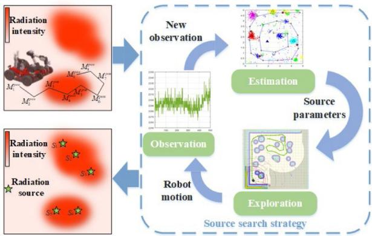  
Fig. 1. The process of radiation source searching by robot.

## 2. Problem and system description

## 2.1. Problem description

The suspicious area consists of several radiation fields, each of which has an unknown number of sources. Mobile robots with sensors cannot densely observe the radiation field because the robot’s endurance is limited [30] and the radiation fluctuates in the short term [31]. Estimation based on observations of coupled fields is also a challenging problem. Fig. 1 shows the process of source searching.

To simplify the calculation, we assume that all point sources have the same height and are of the same type. Therefore, a source’s parameter can be represented by its intensity $S ^ { i n t }$ and two-dimensional position $S ^ { p o s }$ . The kth source can be parameterized as a three-dimensional vector $S _ { k } = [ S _ { k } ^ { x } , S _ { k } ^ { y } , S _ { k } ^ { i n t } ]$ . We define $M _ { i } ^ { p o s }$ and $M _ { i } ^ { i n t }$ as the position and intensity of the ith observation point, respectively. This paper focuses on the problem of point-source search in coupled radiation fields. In this paper, the sources and sensors are higher than the obstacles to prevent obstacles from affecting the radiation superposition. Radiation propagation from point sources in the air obeys the inverse square law [32]. Given a set of sources $\{ S _ { k } \} , k = 1 , \ldots , N s ,$ the superposed intensity (mean radiation count) at the observation position $M _ { i } ^ { p o s }$ is as follows:

$$
\left\{ \begin{array} { l } { { \displaystyle M _ { i } ^ { i n t } = I _ { c u m } ^ { \prime } ( M _ { i } ^ { p o s } , \{ S _ { k } \} _ { k = 1 } ^ { N s } ) = E \tau _ { i } \left( \sum _ { k = 1 } ^ { N s } \mathbb { Z } ( M _ { i } ^ { p o s } , S _ { k } ) + R _ { b a c k } ^ { i } \right) } } \\ { { \displaystyle \mathbb { Z } ( M _ { i } ^ { p o s } , S _ { k } ) = \frac { S _ { k } ^ { i n t } } { h ^ { 2 } + \left| M _ { i } ^ { p o s } - S _ { k } ^ { p o s } \right| ^ { 2 } } \cdot e x p \left( - \mu _ { a i r } \left| M _ { i } ^ { p o s } - S _ { k } ^ { p o s } \right| \right) } } \end{array} \right.\tag{1}
$$

where E represents the conversion constant from nSv/h to counts per second (CPS), $\tau _ { i }$ is the duration of ith observation and $R _ { b a c k } ^ { i }$ denotes the fluctuating background radiation. The total number of radiation sources is represented by Ns. h is the height of the source from the observation plane. $S _ { k } ^ { \bar { p } o s } = [ S _ { k } ^ { x } , S _ { k } ^ { y } ]$ is the position of the kth source. $\mu _ { a i r }$ is the air absorption coefficient which depends on the energy spectrum of gamma radiation. For cobalt-60 sources, this coefficient equals $\mathit { \bar { 6 . 8 6 } } \times \mathit { 1 0 ^ { - 3 } } \mathit { \Pi } \mathfrak { m } ^ { - 1 }$ [33] and $\left| M _ { i } ^ { p o s } - S _ { k } ^ { p o s } \right|$ indicates the observation distance between $M _ { i } ^ { p o s }$ and $S _ { k } ^ { p o s }$ . Since the robot was restricted to relatively small search areas (about a few tens of meters), we adopted the approximation $e x p \left( - \mu _ { a i r } \left| M _ { i } ^ { p o s } - S _ { k } ^ { p o s } \right| \right) \approx 1$

<!-- PDF_PAGE: 003 -->

The two core issues in the MRSS are as follows:

## (1) Effective non-parametric estimation from the multi-modal radiation field

The particle filter becomes a fundamental method for source term estimation [18–23]. A particle corresponds to the parameter of a source, and the state of sources can be approximated by particle swarms. When there are multiple sources, we may obtain multiple solutions. We are interested in finding all solutions, each corresponding to an actual source. It is significant to figure out the global optimal solution under the same observation conditions.

## (2) The contradiction between exploration and exploitation in search

The load capacity and endurance of robots are limited. Searching for radiation sources in unknown environments is more challenging. The robot employs information about the radiation field and the geometric structure to search the entire suspicious area. The strategy needs to not only explore the unknown region but also exploit the nearby radiation field.

The two issues are interrelated. The estimation provides information about sources and requires the appropriate observations that exploration contributes. This work proposes a novel robotic search strategy that aims to quickly and accurately figure out each source’s parameters in an unknown environment.

## 2.2. System description

The receding horizon method is used because neither the radiation field nor the geometric structure are known. We identify the parameters of each source through the OEE iterations. As shown in Fig. 2, the overall system mainly comprises three modules: the observation module samples and filters the radiation intensity to reduce fluctuations. The identification of source parameters depends on the estimation module. The exploration module determines the next observation position.

After the robot and the particle swarms have been initialized, the estimation module starts to infer source terms. Subsequently, update the radiation field confidence (RFC) according to the predicted result. Continue to execute the other modules until the termination condition is met. In the exploration module, the candidate path set is generated by the RRT algorithm and costmap. Then, evaluate the gain of the node in the path set according to the radiation gain model to screen out the path whose leaf node has the highest gain. Eventually, the robot moves to the target node and observes. Through the iterations of the three modules, the robot will gradually enrich the observation dataset and improve prediction accuracy.

## 3. Source term estimation based on ADE-PSPF

In the sequential prediction, each particle swarm is affected by the others, and as iterations progress, the particle diversity may decrease. When the state of particle swarms is stable, they may get stuck in a local optimum. The particle swarms cannot get much closer to the actual solution without leaving the local optimum.

In differential evolution, the scale factor controls the amplification of the difference vector, which is related to the global optimization ability. The crossover rate determines the diversity of individuals in the population. Therefore, the scale factor and crossover rate should change based on particle weights. We combine the ADE and PSPF, which increase the diversity of particles, to avoid the local optimum.

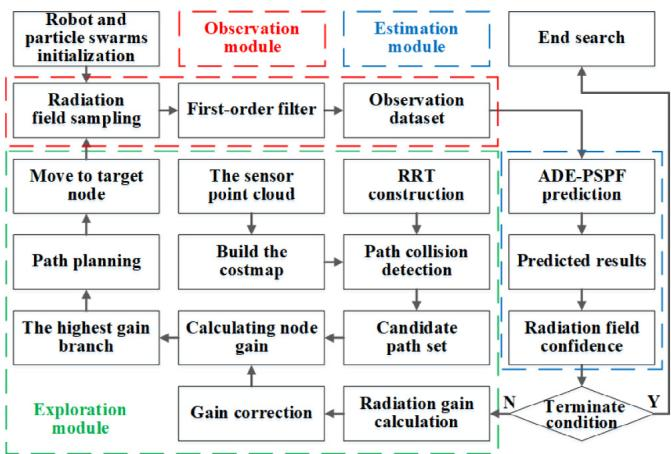  
Fig. 2. The framework of the proposed search strategy.

```latex
Algorithm 1 The ADE-PSPF Algorithm
Input: Sensor data $\mathcal { M } = \{ M _ { i } ^ { i n t } , M _ { i } ^ { p o s } \} _ { i = 1 } ^ { N o }$
Output: Radiation source parameters $\boldsymbol { S } = \{ S _ { k } \} _ { k = 1 } ^ { N s }$
1: for s=1 to $N _ { p s }$ do
2: for r=1 to $N _ { p }$
3: $p _ { r , { \cdot } }$ ~rand(configmin, configmax)
4: end for
5: end for
6: for $i { = } 1 , { \ldots } , N _ { o }$ do
7: for $s { = } 1$ to $N _ { p s }$ do
8: for r=1 to $N _ { p }$ do
9: $w _ { s y n } ^ { s , r }  w _ { o b s } ^ { s , r } \bullet w _ { p s } ^ { s , r } \bullet w _ { d i s t } ^ { s , r }$
10: end for
11: $\{ p _ { s , r } \} _ { r = 1 } ^ { N p }  \mathrm { A D E } _ { - }$ resampling
12: $C _ { s }$ ←Mean Shift $( \{ p _ { s , r } \} _ { r = 1 } ^ { N p } )$
13: end for
14: $\mathcal { F } \gets \mathsf { 1 }$ Confidence( {Cs }N−1 , M )
15: if $\mathcal { F } > \mathcal { F } _ { b e s t }$ then
16: $\{ C _ { s } ^ { b e s t } , \mathcal { P } _ { s } ^ { b e s t } , \mathcal { F } _ { b e s t } \} _ { s = 1 } ^ { N p s }  \{ C _ { s } , \mathcal { P } _ { s } , \mathcal { F } \} _ { s = 1 } ^ { N p s }$
17: end if
18: end for
19: if $\mathcal { F } _ { b e s t } > T H R _ { e n d }$ then
20: $\begin{array} { r } { S = \{ S _ { k } \} _ { k = 1 } ^ { N s } {  } \{ C _ { s } ^ { b e s t } \} _ { s = 1 } ^ { N p s } , N _ { p s } { \geq } N _ { s } } \end{array}$
21: else then
22: repeat Lines 6-18 loop
23: end if
```

## 3.1. Overall ADE-PSPF framework

Particle filter and differential evolution have similar ideas. They continuously extrapolate the results based on current information through iterative updates. On the other hand, each individual or particle can be seen as a possible state. The larger the particle weight in the particle filter, the closer the particle is to the actual term. In differential evolution, the higher fitness of the individual means that it is closer to the optimum of the objective function. In this paper, the state space of the particles is regarded as the search space of the differential evolution. The particles move to a higher posterior probability position through ADE optimization. In mutation operation, the scale factor based on the particle weight can avoid particle impoverishment. The ADE-PSPF algorithm mainly contains synthesized particle weight calculation, ADE resampling, and RFC calculation. The ADE-PSPF is summarized in Algorithm 1.

## <!-- PDF_PAGE: 004 -->

3.2. Synthesized particle weight computing

Divide the state space into $N _ { p s }$ particle swarms. Each particle swarm $\mathcal { P } _ { s }$ contains $N _ { p }$ particles, which is used to estimate the parameters of a source. The particle swarm can be expressed as below:

$$
\mathcal { P } _ { s } = \{ p _ { s , r } \in \mathbb { R } ^ { 3 } \} _ { r = 1 } ^ { N p } , s \in [ 1 , . . . , N _ { p s } ]\tag{2}
$$

The synthesized weight represents the degree of approximation from a particle to its corresponding source. The weight correlates with the observation weight and also considers the interference between various particle swarms and the superposition of the radiation fields. Furthermore, sequential prediction can realize the iterative update of the particle in different swarms. The synthesized weight $w _ { s y n } ^ { s , r }$ is computed as follows:

$$
\left\{ \begin{array} { l } { { w _ { s s p } ^ { s , r } = w _ { o b s } ( M _ { i } ^ { i n t } , p _ { s , r } , C _ { - s } ) \cdot w _ { p s } ( p _ { s , r } , \theta _ { p s } ) \cdot w _ { d i s t } ( p _ { s , r } , C _ { - s } ) } } \\ { { w _ { o b s } ( M _ { i } ^ { i n t } , p _ { s , r } , C _ { - s } ) = \displaystyle { \frac { f _ { p } ( M _ { i } ^ { i n t } | I ^ { \prime } ( p _ { s , r } , C _ { - s } ) ) } { f _ { p } ( \left| I ^ { \prime } ( p _ { s , r } , C _ { - s } ) \right| | I ^ { \prime } ( p _ { s , r } , C _ { - s } ) ) } } } } \\ { { w _ { d i s t } ( p _ { s , r } , C _ { - s } ) = \displaystyle { \frac { 1 } { 1 + e x p [ ( \theta _ { d i s t } - f _ { d } ( p _ { s , r } , C _ { - s } ) ) / b _ { d i s t } ] } } } } \\ { { w _ { p s } ( p _ { s , r } , \theta _ { p s } ) = ( 1 - \alpha ) + \alpha \cdot \displaystyle { \frac { 1 } { 1 + e x p [ ( p _ { s , r } ^ { i n t } - \theta _ { p s } ) / b _ { p s } ] } } } } \\ { { f _ { p } ( N _ { Z } | \lambda ( \{ S _ { k } \} ) ) = \displaystyle { \frac { \lambda ( \{ S _ { k } \} ) ^ { N _ { Z } } } { N _ { Z } ! } } e x p ( - \lambda ( \{ S _ { k } \} ) ) } }  \end{array} \right.\tag{3}
$$

An explanation of the terms in the Eq. (3) follows:

(1) $w _ { o b s }$ denotes the observation weight. $M _ { i } ^ { i n t }$ represents the observed intensity; $I ^ { \prime } ( p _ { s , r } , C _ { - s } )$ is the estimated intensity computed from the particle $p _ { s , r }$ and other swarms’ centroids $C _ { - s } . \lfloor \cdot \rfloor$ denotes the rounding operation; and $f _ { p } ( \cdot )$ indicates the Poisson probability distribution function. $N _ { Z }$ represents the number of particles to the sensor during the measurement. $\lambda ( \{ S _ { k } \}$ represents the number of average particles calculated based on set $\{ S _ { k } \}$

(2) $w _ { d i s t }$ and $w _ { p s }$ indicate the peak suppression and swarm distance correction factor respectively. $\theta _ { d i s t }$ and $\theta _ { p s }$ are the horizontal offset value of the correction curve. $b _ { d i s t }$ and $b _ { p s }$ respectively denote the scale parameters. $f _ { d } ( \cdot )$ is the minimal distance between current particle and other swarms’ centroids, and α indicates the vertical adjustment parameter of the peak suppression. In [22] we described the formulas in detail.

## 3.3. ADE resampling

In the resampling stage, an ADE algorithm based on particle weights is designed to improve the prediction accuracy with the same number of iterations. The flow of the ADE resampling process is as follows:

(1) The particles in each swarm are regarded as the ADE initial population. The number of individuals in a population is equal to the number of particles. The gth generation population can be expressed as $\{ p _ { s , r } ( g ) \} _ { r = 1 } ^ { N p }$ . The synthesized particle weight calculation formula is regarded as the fitness function, denoted as w(·).

(2) A mutation operation based on particle weight is designed to obtain mutant individuals, and as follows:

$$
\begin{array} { c } { { v _ { s , r } ( g ) = p _ { s , r } ( g ) + { \cal F } _ { 1 } \cdot ( p _ { s } ^ { b e s t } ( g ) - p _ { s , r } ( g ) ) } } \\ { { + { \cal F } _ { 2 } \cdot ( p _ { s } ^ { r 1 } ( g ) - p _ { s } ^ { r 2 } ( g ) ) } } \end{array}\tag{4}
$$

where $p _ { s , r } ( g )$ is the sampled particle(target individual); $p _ { s } ^ { b e s t } ( g )$ represents the particle with the highest weight (the individual with the best fitness value in the current population). $p _ { s } ^ { r 1 } ( g )$ and $p _ { s } ^ { r 2 } ( g )$ are the randomly selected particles $\stackrel { \prime } { r } \ne r 1 \ne r 2 ) . \ F _ { 1 } = \alpha$ $\left( 1 - w _ { s , r } \right)$ and $F _ { 2 } = \beta \cdot ( w _ { s , r 1 } - \overline { { w } } _ { s , r } ) / w _ { s , r 1 } )$ represent the adaptive scaling factor. α is the elite movement scale used to control the distance between $p _ { s } ^ { b e s t } ( g )$ and $p _ { s , r } ( g )$ , and $w _ { s , r }$ is the particle weight corresponding to $p _ { s , r } ( g ) . \beta$ is the random movement scale used to control the distance between $p _ { s } ^ { r 1 } ( g )$ and $p _ { s } ^ { r 2 } ( g ) . w _ { s , r 1 }$ is the particle weight corresponding to $p _ { s } ^ { r 1 } ( \bar { g } )$ , and $\overline { { w } } _ { s , r }$ is the average value of the particle weight.

(3) In crossover operation, test individuals are generated. It should be pointed out that this stage is different from the standard crossover operation. We adjust the crossover rate based on particle weights to control the proportion of mutant individuals among the trial individuals.

$$
u _ { s , r } ( g ) [ j ] = \left\{ \begin{array} { l l } { v _ { s , r } ( g ) [ j ] } & { , r a n d < C R \mathrm { o r } j = j _ { r a n d } } \\ { p _ { s , r } ( g ) [ j ] + \sigma ^ { r } } & { , o t h e r w i s e } \end{array} \right.\tag{5}
$$

where, $C R = C R _ { b a s e } + C R _ { s c a l e } ( w _ { s , r } - \overline { { w } } _ { s , r } ) / w _ { s , r }$ is the crossover rate adaptively adjusted based on the particle weight. It can be seen that the influence of the mutation individuals will increase as the particle weight improve. When the random number does not meet the crossover condition, the target individual will add a Gaussian noise $\sigma _ { } ^ { r } ,$ , whose mean value is zero to avoid particle impoverishment.

(4) Compare the fitness of the two individuals and select the individual with better fitness. The process is as follows:

$$
p _ { s , r } ( g + 1 ) = \left\{ \begin{array} { l l } { u _ { s , r } ( g ) } & { , w ( u _ { s , r } ( g ) ) > w ( p _ { s , r } ( g ) ) } \\ { p _ { s , r } ( g ) } & { , o t h e r w i s e } \end{array} \right.\tag{6}
$$

(5) If the limit of the iteration number is reached, the current individuals will be the input of the mean shift algorithm to compute the centroid of each particle swarm. Otherwise, let $p _ { s , r } ( g + 1 )$ be the initial individual for the next iteration. Then, calculate the weight, normalize it, and repeat step (2) to step (5).

## 3.4. The radiation field confidence calculation

Since the mean shift algorithm cannot cluster the redundant particle swarms, we obtain the centroids of effective particle swarms. The recursive non-parametric prediction can be realized by centroid representation.

Based on the observation data $\{ M _ { i } ^ { i n t } , M _ { i } ^ { p o s } \} _ { i = 1 } ^ { N o }$ and the prediction centroids $\{ C _ { s } \} _ { s = 1 } ^ { N p s }$ , the RFC can be calculated when at least one particle swarm has the centroid. The RFC can be computed from the expression:

$$
\left\{ \begin{array} { l } { \displaystyle { \mathcal { F } ( \{ M _ { i } ^ { i n t } , M _ { i } ^ { p o s } \} _ { i = 1 } ^ { N o } , \{ C _ { s } \} _ { s = 1 } ^ { N p s } ) } } \\ { \displaystyle = \frac { 1 } { N o } \cdot \sum _ { i = 1 } ^ { N o } \frac { f _ { p } ( M _ { i } ^ { i n t } | I _ { c u m } ^ { \prime } ( M _ { i } ^ { p o s } , \{ C _ { s } \} _ { s = 1 } ^ { N p s } ) ) } { f _ { p } ( \left\lfloor I _ { c u m } ^ { \prime } ( M _ { i } ^ { p o s } , \{ C _ { s } \} _ { s = 1 } ^ { N p s } ) \right\rfloor | I _ { c u m } ^ { \prime } ( M _ { i } ^ { p o s } , \{ C _ { s } \} _ { s = 1 } ^ { N p s } ) ) } } \end{array} \right.\tag{7}
$$

where $I _ { c u m } ^ { \prime } ( \cdot )$ represents the cumulative radiation intensity based on the predictions at a specific position. It is similar to $\mathbb { E } { \mathsf { q . } } ( 1 ) ,$ , but here $C _ { s } , s = 1 , \ldots , N _ { p s }$ represents a potential source parameter.

The configuration maintenance [22] will start when the current RFC is lower than the historical best confidence. It utilizes the particle swarms, which have the highest confidence, as the basis for recovery. When the multi-modal balance is broken, it can ensure that the best state is returned.

## 4. Exploration strategy based on radiation gain

When the radiation environment is unknown, OEE iteration is a general strategy. The observations around the sources are more meaningful for estimation [27]. We propose an exploration approach based on RRT and the radiation gain model. The candidate paths or branches are generated according to the costmap and RRT, which are regarded as the basis of path evaluation. Then, evaluate each candidate node based on the radiation gain model. Finally, determine the best path using the optimal leaf-node criterion.

## <!-- PDF_PAGE: 005 -->

4.1. Path generation based on RRT

We use the RRT structure to construct paths in the robot configuration space. In addition, the predictions often change with the exploration. Hence, the robot only executes the first edge of the branch whose leaf node has the highest gain. Repeating the above procedure can efficiently search the unknown region and sample the radiation field. The path generation based on the RRT is as follows:

(1) Build a new tree based on the current state of the robot, where the configuration space includes the 2D position and the angle of rotation. The nodes that grow uniformly are added to the expanded tree to ensure the possibility of motion in all directions.

$$
\mathcal { T } _ { i n i t } ^ { \prime } = \mathcal { O } \cup \psi , ( \psi _ { h } \cap C _ { f r e e } ) \in \psi , h = 1 , 2 , \cdot \cdot \cdot N _ { u n i }\tag{8}
$$

where $\mathcal { T } _ { i n i t } ^ { \prime }$ denotes the expanded tree uniformly initialized. $\psi$ represents the set of collision-free nodes and edges starting from the robot position. $\psi _ { h }$ means the hth node and edge combination extending from the current position in the circumferential direction. $C _ { f r e e }$ is a collision-free configuration space, $N _ { u n i }$ and represents the total number of uniform sampling.

(2) In order to prevent high-gain branches, the algorithm adds the rest of the best branch to the tree in the next iteration. It also updates the gain according to the latest estimation.

$$
\mathcal { T } _ { i n i t } = \mathcal { T } _ { i n i t } ^ { \prime } \cup B\tag{9}
$$

where $\mathcal { T } _ { i n i t }$ is the entire initialized expansion tree, and B represents the remaining part of the best branch produced by the planner in the previous iteration.

(3) Randomly sample in the collision-free space $q _ { r a n d } \in C _ { f r e e }$ and find the nearest neighbor node $q _ { n e a r }$ of the random sampling point $q _ { r a n d }$ in the extended tree $\mathcal { T } _ { i n i t }$

(4) Perform collision detection according to costmap and generate an appropriate leaf node combined with the distance threshold $( S _ { m i n }$ and $S _ { m a x } )$ . Add node $q _ { n e w }$ to the extended tree. The connection between $q _ { n e a r }$ and $q _ { n e w }$ determines the rotation angle of $q _ { n e w } ,$ , which can be expressed as:

$$
q _ { n e w } ( \theta ) = a t a n 2 ( y _ { n e w } - y _ { n e a r } , x _ { n e w } - x _ { n e a r } )\tag{10}
$$

Since the robot executes the first edge of the branch, the construction does not include edge reconnection to improve efficiency.

(5) Iteratively execute steps (3) and (4) until the iteration times reach the threshold. The set of candidate paths consists of the above branches.

The path generation process includes expanded tree initialization, spatial random sampling, new node generation, and branch construction.

## 4.2. Radiation gain evaluation

## 4.2.1. Radiation gain model

Enlightened by the idea of surrounding search, we proposed a multi-source radiation gain model. It conforms to the following principles:

(1) The model should guide the robot to observe emphatically around the radiation sources.

(2) When the sensor is close to the radiation source, the measurement deviation increases significantly. The algorithm should control the observation distance (distance from point source to sensor).

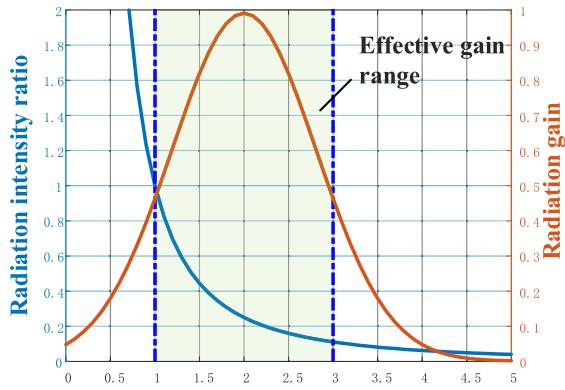  
Distance from node to source (m)  
Fig. 3. Changes in radiation intensity ratio and gain at different observation distances.

(3) Similar to the radiation field, the multi-source radiation gain can also be superposed. It is necessary to reduce the abnormal gain in the sources’ common neighborhood.

This section introduces the radiation gain model based on the above principles. For omnidirectional radiation sensors, the measured intensity is related to the observation distance. Similarly, the radiation gain macroscopically increases as distance is reduced. Given principle $( 2 ) ,$ it is necessary to decrease the node’s gain when it is too close to the sources.

In Fig. 3, the blue curve shows the relationship between measured intensity and observation distance in a single-source scenario. When the observation distance is less than 1 m, the radiation intensity ratio (the measured intensity divided by the intensity whose observation distance equals 1 m) changes sharply. When the distance exceeds 3 m, the ratio changes slowly, which leads to a relatively small contribution to the estimation.

The effective gain range is controlled between 1 m and 3 m, which conforms to principle (1) and (2). In one radiation source scene, the radiation gain function at the node $n _ { t }$ is defined as:

$$
\widetilde { G } _ { s r c } ( n _ { t } ) = \sigma _ { d i s t } ^ { g a i n } + \frac { 1 - \sigma _ { d i s t } ^ { g a i n } } { \sqrt { 2 \pi } r _ { s r c } } \cdot e x p ( \frac { - ( d _ { s r c } ^ { ( t ) } - d _ { s r c } ) ^ { 2 } } { 2 { r _ { s r c } } ^ { 2 } } )\tag{11}
$$

where $r _ { s r c }$ is the radiation gain coefficient, which is used to adjust the range of radiation gain. $d _ { s r c } ^ { ( t ) }$ means the distance from the node n to source. $d _ { s r c }$ represents the radiation gain’s peak distance. $\sigma _ { d i s t } ^ { \dot { g } a i n }$ denotes the background value of the radiation gain.

In the multi-source scenario, the radiation gain becomes as follows:

$$
\left\{ \begin{array} { l l } { \widetilde { G } _ { s r c } ( n _ { t } ) = \displaystyle \sum _ { k } ^ { N _ { s } } \widetilde { G } _ { s r c } ^ { ( t , k ) } ( n _ { t } ) } \\ { \widetilde { G } _ { s r c } ^ { ( t , k ) } ( n _ { t } ) = \displaystyle \sigma _ { d i s t } ^ { g a i n } + \frac { 1 - \sigma _ { d i s t } ^ { g a i n } } { \sqrt { 2 \pi } r _ { s r c } } \cdot \exp ( - \frac { ( d _ { s r c } ^ { ( t , k ) } - d _ { s r c } ) ^ { 2 } } { 2 { r _ { s r c } } ^ { 2 } } ) } \end{array} \right.\tag{12}
$$

where $\widetilde { G } _ { s r c } ^ { ( t , k ) } ( n _ { t } )$ denotes the radiation gain contributed by the kth radiation source at node $n _ { t } ,$ and $N _ { s }$ is the total number of predicted sources. $d _ { s r c } ^ { ( t , k ) }$ represents the distance from the node $n _ { k }$ to the kth radiation source.

When multiple point sources are concentrated in a local area, the superposition of gains will lead to abnormalities in the common neighborhood, as shown in Fig. 4. The situation destroys the gain near the source and ultimately causes the robot to be unable to perform the surrounding observations.

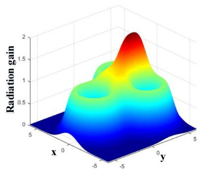

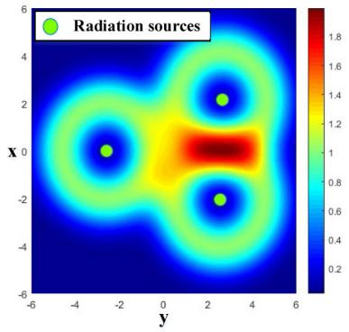  
<!-- PDF_PAGE: 006 -->

Fig. 4. The radiation gain in the multi-source scenario.

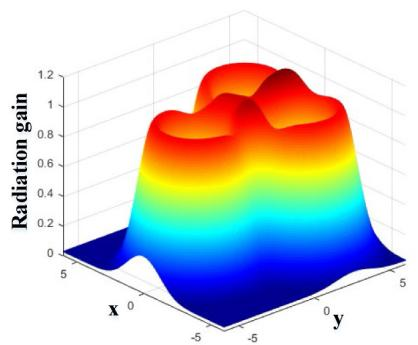

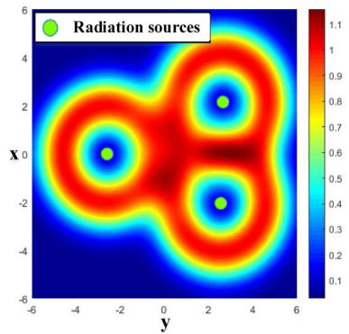  
Fig. 5. The radiation gain with superposition suppression.

This paper designs the superposition suppression factor to eliminate the abnormality. The kth source’s suppression factor $F _ { s r c } ^ { ( t , k ) } ( n _ { t } )$ at node n is as follows:

$$
\begin{array} { l } { { F _ { s r c } ^ { ( t , k ) } ( n _ { t } ) = \displaystyle \sum _ { j , j \neq k } ^ { N _ { s } } ( 1 - C _ { s u p } ^ { d i s t } + \frac { C _ { s u p } ^ { d i s t } } { 1 + e x p [ ( T _ { s u p } ^ { d i s t } - d _ { t } ^ { ( k , j ) } ) / S _ { s u p } ^ { d i s t } ] } ) } } \\ { { d _ { t } ^ { ( k , j ) } = \left| n _ { t } - ( C _ { k } ^ { p o s } + C _ { j } ^ { p o s } ) / 2 \right| } } \end{array}\tag{13}
$$

where $d _ { t } ^ { ( k , j ) }$ represents the distance from node $n _ { t }$ to the midpoint of the kth and jth sources. |·| is the second norm. $C _ { k } ^ { p o s }$ and $C _ { j } ^ { p \sp { \underline { { { s } } } } \sp { \underline { { { s } } } } }$ are the positions of the kth and jth sources respectively. $T _ { s u p } ^ { d i s t }$ is the parameter for adjusting the translation scale of the suppression curve. $S _ { s u p } ^ { d i s t }$ denotes the scale parameter for adjusting the rate of change of the suppression curve. $C _ { s u p } ^ { d i s t }$ represents the coefficient of the superposition suppression range and is as follows:

$$
C _ { s u p } ^ { d i s t } = \sigma _ { r } ^ { d i s t } + \frac { 1 - \sigma _ { r } ^ { d i s t } } { 1 + e x p [ ( d _ { r } ^ { ( k , j ) } - T _ { r } ^ { d i s t } ) / S _ { r } ^ { d i s t } ] }\tag{14}
$$

where $\sigma _ { r } ^ { d i s t }$ is the background value of the suppression range’s coefficient. $d _ { r } ^ { ( k , j ) }$ means the distance from the kth to the jth source. $T _ { r } ^ { d i s t }$ denotes the parameter for adjusting the translation distance of the suppression range curve. $S _ { r } ^ { \ ' { d i s t } }$ represents the parameter for adjusting the gain suppression range curve. $\sigma _ { c r t } ^ { d i s t }$ indicates the background value of the suppression range’s coefficient.

In summary, the multi-source radiation gain model at node $n _ { t }$ is as follows:

$$
G _ { s r c } ( n _ { t } ) = \sum _ { k } ^ { N _ { s } } \widetilde { G } _ { s r c } ^ { ( t , k ) } ( n _ { t } ) \cdot F _ { s r c } ^ { ( t , k ) } ( n _ { t } )\tag{15}
$$

Fig. 5 shows the multi-source radiation gain considering superposition suppression. Comparing the gain distribution in Figs. 4 and 5, we can draw the following conclusions:

(1) When two sources are close to each other, the suppression factor can eliminate the abnormal gain.

(2) The suppression factor will not change the radiation gain in places where the gain is not superimposed.

## 4.2.2. Best branch extraction

Source search is different from other environmental exploration missions in that it needs to focus on the area around sources. The gain should consider the distance cost to constrain the gain at the farthest node. In addition, the frequent rotation will reduce the search efficiency of the robot. The gain should also include the rotation cost. Given the above costs, the gain relationship between node $n _ { t }$ and its parent node $n _ { t - 1 }$ in the expansion tree can be as follows:

$$
G a i n _ { c u m } ( n _ { t } ) = G a i n _ { c u m } ( n _ { t - 1 } ) + G a i n _ { s r c } ( n _ { t } ) \cdot C _ { d i s t } ^ { ( t , t - 1 ) } \cdot C _ { r o t } ^ { ( t , t - 1 ) }\tag{16}
$$

where $G a i n _ { c u m } ( n _ { t } )$ is the accumulation radiation gain at node $n _ { t } .$ $G a i n _ { s r c } ( n _ { t } )$ denotes the multi-source radiation gain of node nt . $C _ { d i s t } ^ { ( t , t - 1 ) }$ and $C _ { r o t } ^ { ( t , t - 1 ) }$ represent the distance and rotation cost, respectively. And their specific calculation method is as follows:

$$
\left\{ \begin{array} { l l } { C _ { d i s t } ^ { ( t , t - 1 ) } = \exp ( - \eta _ { s r c } ^ { g a i n } \cdot \widetilde { d } _ { s r c } ^ { ( t , t - 1 ) } ) } \\ { \widetilde { d } _ { s r c } ^ { ( t , t - 1 ) } = \widetilde { d } _ { s r c } ^ { ( t - 1 , t - 2 ) } + \Vert \overline { { n _ { t - 1 } } } \overrightarrow { n _ { t } } \Vert } \end{array} \right.\tag{17}
$$

where $\eta _ { s r c } ^ { g a i n }$ denotes the distance attenuation constant. $\widetilde { d } _ { s r c } ^ { ( t , t - 1 ) }$ is the path distance from node $n _ { t }$ to node $n _ { t - 1 }$

$$
\left\{ \begin{array} { l l } { C _ { r o t } ^ { ( t , t - 1 ) } = \exp ( \theta _ { t } ^ { 2 } / \sigma _ { \theta } ^ { 2 } ) } \\ { \theta _ { t } = \operatorname { a r c c o s } ( \frac { \overrightarrow { n _ { t - 1 } n _ { t } } \cdot \overrightarrow { n _ { t - 2 } n _ { t - 1 } } } { \lVert \overrightarrow { n _ { t - 1 } n _ { t } } \rVert \cdot \lVert \overrightarrow { n _ { t - 2 } n _ { t - 1 } } \rVert } ) } \end{array} \right.\tag{18}
$$

where $\theta _ { t }$ is the angle between the target vector and the previous planning vector. $\sigma _ { \theta }$ denotes the scale factor in the rotation cost function.

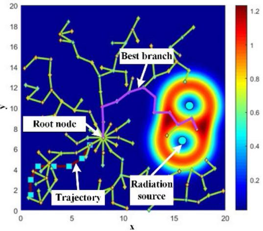  
<!-- PDF_PAGE: 007 -->

Fig. 6. The best branch in the two-point source scenario. The level of radiation gain is displayed by color. The green branches are the candidate, and the purple branch is optimal.. (For interpretation of the references to color in this figure legend, the reader is referred to the web version of this article.)

We can iteratively calculate the gain at each node based on the cumulative gain. On this basis, compare the leaf node’s gain and extract the branch that has the best-gain node. Fig. 6 shows the extracted results in a two-source scene and indicates the radiation gain by color. The branch with the highest gain is closer to the sources than the other branches. According to the gain model and optimal leaf-node criterion, the proposed approach can find the best branch from the extended tree.

## 4.2.3. Gain correction

The radiation gain generates gravitation, which prompts the robot to explore the sources’ neighborhoods. However, when the robot has not yet observed the entire radiation field, the predictions often deviate from the actual state of the sources. This paper corrects the gravitation to mitigate the misleading caused by prediction bias and greedy search.

We propose the observation intensity correction (OIC) to improve search efficiency. The corrected gain is according to the predictions and the observed intensities. Considering that the intensity at the node cannot be directly calculated, the correction utilizes the observed intensity closest to the node to judge the confidence of the predictions. The OIC is as follows:

$$
C _ { o b s } ( n _ { t } ) = \sigma _ { s r c } ^ { g a i n } + \frac { 1 - \sigma _ { s r c } ^ { g a i n } } { 1 + e x p [ ( T _ { s r c } ^ { g a i n } - I _ { t } ^ { n e a r } / I _ { s r c } ^ { b a c k } ) / S _ { s r c } ^ { g a i n } ] }\tag{19}
$$

where $I _ { t } ^ { n e a r }$ is the radiation intensity at node $n _ { t }$ closest to the node. $I _ { s r c } ^ { b i c k }$ denotes the background radiation, and $T _ { s r c } ^ { g a i n }$ is the horizontal offset of the OIC curve. $S _ { s r c } ^ { g a i n }$ indicates the scale parameter of the OIC. $\sigma _ { s r c } ^ { g a i n }$ is the background value of the OIC.

It is significant to find all the sources within finite iterations. When the robot has exploited the known radiation field, it is necessary to allocate exploration opportunities to unknown regions to protect several sources from being missed. This paper designs the redundant sampling correction (RSC) to prevent the robot from excessively sampling. The calculation process is as follows:

$$
C _ { r s } ( n _ { t } ) = 1 + \frac { ( \sigma _ { r s } - 1 ) \cdot e x p ( N _ { s a m } ^ { ( t ) } - S _ { r s } \cdot d _ { n e a r } ^ { ( t ) } ) } { e x p ( S _ { r s } \cdot d _ { n e a r } ^ { ( t ) } - N _ { s a m } ^ { ( t ) } ) + e x p ( N _ { s a m } ^ { ( t ) } - S _ { r s } \cdot d _ { n e a r } ^ { ( t ) } ) }\tag{20}
$$

where $d _ { n e a r } ^ { ( t ) }$ is the distance from node $n _ { t }$ to its nearest radiation source. $N _ { s a m } ^ { ( t ) }$ represents the number of nodes that have been sampled in the neighborhood of the radiation source. $S _ { r s }$ is the scale parameter of RSC. $\sigma _ { r s }$ is the slight offset.

For online search, the robot can only estimate based on several observations at each iteration. Given the diversity of observation positions, we propose the repeat exploring correction (REC) to reduce the gain in explored areas. The robot can iteratively explore the whole region with REC. The REC is expressed as follows:

$$
C _ { r e x } ( n _ { t } ) = \prod _ { b } ^ { N _ { n b h } } e x p ( \frac { - 1 } { ( d _ { ( t , b ) } / S _ { r e x } ) + \sigma _ { r e x } } )\tag{21}
$$

where $d _ { ( t , b ) }$ is the distance between node $n _ { t }$ and the bth observation point. $S _ { r e x }$ indicates the scale parameter of REC. $\sigma _ { r e x }$ is the offset. $N _ { n b h }$ is the total number of observation points in the neighborhood of node $n _ { t }$

In summary, the cumulative calculation formula of the radiation gain is as follows:

$$
\begin{array} { r l } & { G a i n _ { c u m } ( n _ { t } ) = G a i n _ { c u m } ( n _ { t - 1 } ) + G a i n _ { s r c } ( n _ { t } ) \cdot C _ { d i s t } ^ { ( t , t - 1 ) } \cdot C _ { r o t } ^ { ( t , t - 1 ) } } \\ & { \phantom { G a i n } \cdot C _ { o b s } ( n _ { t } ) \cdot C _ { r s } ( n _ { t } ) \cdot C _ { r e x } ( n _ { t } ) } \end{array}\tag{22}
$$

Fig. $7 ( \mathsf { a } ) \mathsf { - } ( \mathsf { c } ) ,$ respectively, show the trajectories that iterate 50 times without the above three corrections. The above trajectories indicate that the uncorrected gain model limits the search efficiency. Fig. 7(d) shows the trajectory considering the above corrections. With the help of these corrections, the robot focused on the neighborhood of sources and roughly explored the low-radiation area.

Fig. 8 presents the RFC of the above trajectories. It indicates that prediction accuracy with corrections has significantly improved. The comparison of RFC also proves the necessity of corrections. It should be noted that RFC is abnormally high at the beginning of the iteration. This phenomenon is caused by too few observations. As the exploration scope expands, the RFC will gradually become more reasonable.

## 5. Simulation and experiment

## 5.1. Evaluation of ADE-PSPF algorithm

We compared the results of different algorithms based on the same observations. The scenes are designed based on the Robot Operating System (ROS) and Gazebo simulation software. In the simulation, the measurements are determined based on the inverse square law and the source terms. In order to approximate the actual scenario, we added background radiation and white Gaussian noise to the measurements. The background radiation exhibits constant fluctuations on the scale of nanosieverts per hour (nSv/h). This noise level was employed to assess the performance of ADE-PSPF. In the source search, we utilized this noise level to evaluate the effectiveness of the observation intensity correction. To mitigate the influence of noise, the robot employs a first-order filter to process a series of 100 measurements while observing the radiation field. The result of this filtering process is regarded as the intensity corresponding to the observation point. Furthermore, during the weight-updating process, it is crucial to subtract the mean value of the background radiation from the filtered observations. Given that background radiation can be easily obtained in both simulated and experimental environments, this preprocessing approach is feasible.

Fig. 9 presents the radiation field and observation trajectory in the simulation scenario. We utilize five particle swarms to predict four sources with unknown positions and intensities. Table 1 shows the configuration of the environment, where each swarm contains 150 particles in the ADE-PSPF. In contrast, each swarm in the PSPF algorithm has 150 or 300 particles. In order to accurately evaluate the ADE resampling, other parts of the algorithm are the same.

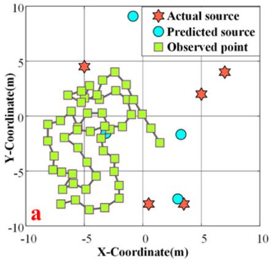

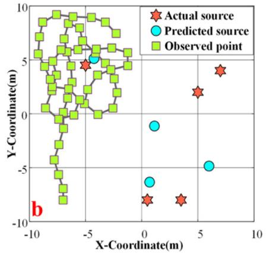

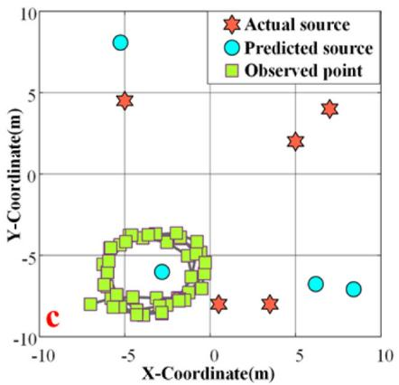

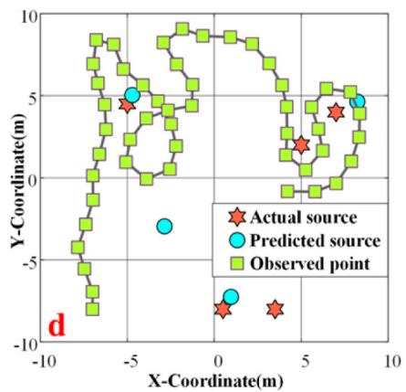  
<!-- PDF_PAGE: 008 -->

Fig. 7. The trajectory and results at step 50, (a) without observation intensity correction, (b) without redundant sampling correction, (c) without repeat exploring correction, and (d) consider all corrections.

Table 1  
The configuration of simulation environment.
<table><tr><td>Scenario item</td><td>Parameter setting</td></tr><tr><td>Size of Surveillance area</td><td> $5 \mathrm { ~ m ~ } \times 5 \mathrm { ~ m ~ }$ </td></tr><tr><td>Number of particles</td><td> $1 5 0 ~ 0 \Gamma ~ 3 0 0$ </td></tr><tr><td>Parameters about radiation sources</td><td>(1.8, 1.3, 820), (3.8, 1.9, 850), (3.2, 3.9, 880), (1.3, 3.1, 860)</td></tr><tr><td>Background radiation</td><td>150 nSv/h (SD: 100 nSv/h)</td></tr></table>

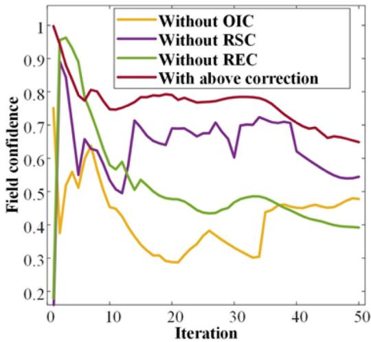  
Fig. 8. The RFC in 50 iterations under different circumstances.

Fig. 10 shows the RFC and the resampling runtime in the iterations. In order to achieve an accurate contrast, each algorithm was run 50 times. After 15 iterations, the average RFC of the ADE-PSPF algorithm is 91.7%, which has the highest accuracy among the three algorithms. Its average resampling time is 3.88 s. The mean runtime of the resampling of the PSPF algorithm (with 150 particles) is 2.11 s, but the mean RFC is only 81.3%. Comparing the RFC and resampling time, the conclusions are as follows:

(1) When the number of iterations is the same, the ADE strategy significantly improves the particle swarm’s efficiency in searching for the actual parameters.

(2) When the number of particles is the same, the ADE strategy causes the runtime of resampling to increase. As the search ability of each particle improves, ADE-PSPF can reduce the number of particles to balance efficiency and accuracy.

(3) Since the iteration times of the ADE optimization can be changed, the runtime can meet the requirements of online search.

When the swarm number is less than the actual source number, ADE-PSPF cannot accurately estimate the source parameters. However, each swarm is loosely coupled in ADE-PSPF. The proposed method can increase the number of swarms to infer more precise source parameters. Therefore, we evaluated the effectiveness of this method in this scenario. Fig. 11 shows the change in prediction results (we adjusted the swarm number at step 11). When the number of swarms is insufficient, the predicted source number is wrong. Compared with Fig. 10, RFC cannot achieve the previous accuracy in steps 1–10. However, when the number of swarms exceeded the number of sources, ADE-PSPF quickly found more accurate parameters. Additionally, RFC increased with the reduction of location error (LE) and intensity error (IE). Therefore, when the robot searches for sources, the proposed method can adjust the number of swarms based on RFC.

Table 2  
<!-- PDF_PAGE: 009 -->

The results with different distance between sources.
<table><tr><td>Distance</td><td colspan="3">ADE-PSPF</td><td colspan="3">PSPF</td></tr><tr><td></td><td>RFC</td><td> $\mathrm { L E ~ ( m ) }$ </td><td> $\mathrm { I E ~ } ( \mathrm { n S v / h } )$ </td><td>RFC</td><td> $\mathrm { L E } \ ( \mathrm { m } )$ </td><td> $\mathrm { I E \ ( n S v / h ) }$ </td></tr><tr><td>1,4 m</td><td> $0 . 9 5 \pm 0 . 0 3$ </td><td> $0 . 1 9 \pm 0 . 1 3$ </td><td> $3 7 . 8 1 \pm 1 3 . 9 2$ </td><td> $0 . 9 0 \pm 0 . 0 5$ </td><td> $0 . 3 7 \pm 0 . 1 8$ </td><td> $5 9 . 8 3 \pm 3 0 . 6 2$ </td></tr><tr><td>1.2 m</td><td> $0 . 9 4 \pm 0 . 0 4$ </td><td> $0 . 3 1 \pm 0 . 2 2$ </td><td> $5 2 . 2 3 \pm 2 1 . 3 0$ </td><td> $0 . 8 9 \pm 0 . 0 3$ </td><td> $0 . 4 4 \pm 0 . 1 2$ </td><td> $6 4 . 0 7 \pm 2 3 . 5 4$ </td></tr><tr><td>1.0 m</td><td> $0 . 9 4 \pm 0 . 0 5$ </td><td> $0 . 2 9 \pm 0 . 2 3$ </td><td> $5 1 . 8 2 \pm 2 9 . 7 3$ </td><td> $0 . 8 8 \pm 0 . 0 5$ </td><td> $0 . 4 6 \pm 0 . 1 8$ </td><td> $6 8 . 5 0 \pm 4 2 . 0 6$ </td></tr><tr><td>0.8 m</td><td> $0 . 9 3 \pm 0 . 0 6$ </td><td> $0 . 3 1 \pm 0 . 1 8$ </td><td> $5 5 . 7 5 \pm 2 9 . 4 1$ </td><td> $0 . 8 7 \pm 0 . 0 5$ </td><td> $0 . 4 7 \pm 0 . 0 8$ </td><td> $6 8 . 9 2 \pm 2 6 . 8 4$ </td></tr><tr><td>0.6 m</td><td> $0 . 9 0 \pm 0 . 0 1$ </td><td> $0 . 3 3 \pm 0 . 0 6$ </td><td> $6 1 . 5 1 \pm 2 2 . 1 2$ </td><td> $0 . 8 5 \pm 0 . 0 6$ </td><td> $0 . 4 9 \pm 0 . 1 9$ </td><td> $7 2 . 7 7 \pm 3 3 . 4 2$ </td></tr></table>

Table 3  
The results with different IDR.
<table><tr><td rowspan="2">ADE-PSPF</td><td colspan="3"></td><td colspan="3">PSPF</td></tr><tr><td>IDR RFC</td><td> $\mathrm { L E } \ ( \mathrm { m } )$ </td><td> $\mathrm { I E \ ( n S v / h ) }$ </td><td>RFC</td><td> $\mathrm { L E } \ ( \mathrm { m } )$ </td><td> $\mathrm { I E \ ( n S v / h ) }$ </td></tr><tr><td>10%</td><td> $0 . 9 5 \pm 0 . 0 1$ </td><td> $0 . 2 6 \pm 0 . 0 5$ </td><td> $1 3 0 . 1 1 \pm 4 4 . 5 0$ </td><td> $0 . 8 9 \pm 0 . 0 1$ </td><td> $0 . 5 5 \pm 0 . 1 2$ </td><td> $1 2 1 . 3 4 \pm 5 4 . 3 5$ </td></tr><tr><td>20%</td><td> $0 . 9 3 \pm 0 . 0 1$ </td><td> $0 . 4 2 \pm 0 . 1 3$ </td><td> $1 6 9 . 6 1 \pm 9 0 . 5 5$ </td><td> $0 . 8 8 \pm 0 . 0 5$ </td><td> $0 . 5 4 \pm 0 . 2 2$ </td><td> $1 5 6 . 7 7 \pm 5 5 . 2 3$ </td></tr><tr><td>30%</td><td> $0 . 9 2 \pm 0 . 0 1$ </td><td> $0 . 3 8 \pm 0 . 1 2$ </td><td> $1 8 9 . 8 8 \pm 4 0 . 6 8$ </td><td> $0 . 8 7 \pm 0 . 0 1$ </td><td> $0 . 6 1 \pm 0 . 1 3$ </td><td> $2 4 7 . 9 7 \pm 6 0 . 6 9$ </td></tr><tr><td>40%</td><td> $0 . 9 1 \pm 0 . 0 1$ </td><td> $0 . 5 4 \pm 0 . 1 9$ </td><td> $2 7 5 . 4 7 \pm 3 9 . 1 5$ </td><td> $0 . 8 6 \pm 0 . 0 2$ </td><td> $0 . 6 5 \pm 0 . 1 4$ </td><td> $2 3 0 . 2 9 \pm 9 5 . 9 2$ </td></tr><tr><td>50%</td><td> $0 . 9 0 \pm 0 . 0 1$ </td><td> $0 . 6 7 \pm 0 . 0 5$ </td><td> $3 9 4 . 9 1 \pm 1 1 0 . 5 9$ </td><td> $0 . 8 5 \pm 0 . 0 3$ </td><td> $0 . 7 1 \pm 0 . 1 5$ </td><td> $3 2 8 . 6 5 \pm 4 1 . 7 6$ </td></tr></table>

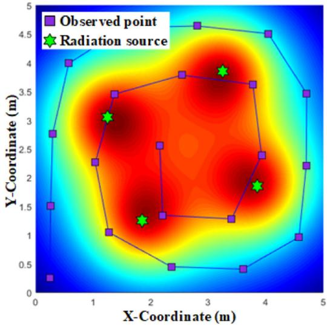

Fig. 9. The radiation field and observation trajectory in the simulation.  
In the case of nuclear accidents, the radiation sources may be randomly distributed. So we compared the predicted results when the distance between point sources was changed. Fig. 12 shows the radiation field and observation trajectory. In the experiment, the distance between sources ranged from 0.6 m to 1.4 m. Table 2 shows the RFC, LE, and IE of ADE-PSPF and PSPF. As the distance between sources decreases, both LE and IE improve. However, ADE-PSPF outperforms PSPF. When the distance between sources equals 0.6 m, the average LE exceeds half of the distance between sources. The results indicated that the proposed method cannot accurately identify the source terms when the distance between two point sources is less than 0.6 m.  
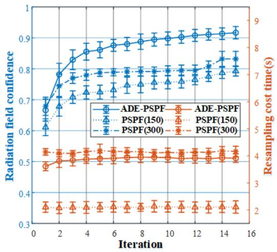  
Fig. 10. The RFC and resampling runtime in iterations.

Then we tested ADE-PSPF in which the intensity differences of the sources were changed. Table 3 presents the experimental results, where the intensities of the sources belong to the arithmetic progression. We compared the performance when the intensity difference ratio (IDR) was 10% to 50%. As the IDR increased, the LE and IE decreased. However, ADE-PSPF achieved a better performance. When IDR exceeded 50%, the ESR of the algorithm decreased rapidly, implying that ADE-PSPF is not suitable for high IDR scenarios. The errors are mainly caused by the wrong number of predicted sources. For example, if the radiation field produced by a centroid can be approximated as a superposition of two radiation fields, then the parameters with a high RFC may not be corrected. Although many algorithms have been devoted to solving this problem, there is still no perfect method.

## 5.2. Validation of the strategy in simulation environments

In this section, we used two radiation scenarios to evaluate different search strategies. Fig. 13 displays the two simulated scenarios. In order to simulate the actual environment, the obstacles are randomly arranged in both scenarios. Table 4 shows the scenes’ configuration.

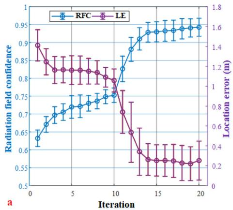

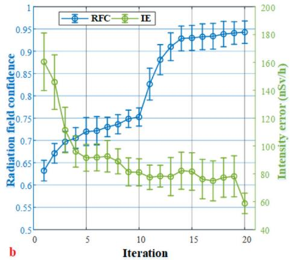  
<!-- PDF_PAGE: 010 -->

Fig. 11. The effect of swarm number on predicted results (RFC, LE, and IE) in iterations. In steps 1–10, we use three swarms to estimate. In steps 11–20, the number of swarms becomes five.

Table 4  
The configuration of simulation environment for MRSS.
<table><tr><td colspan="2">Scenario item</td><td>Parameter setting</td></tr><tr><td colspan="2">The scope of the scene</td><td> $2 1 \textrm { m } \times 2 1 \textrm { m }$ </td></tr><tr><td colspan="2">Number of RRT nodes</td><td>50</td></tr><tr><td colspan="2">Number of particles in each swarm</td><td>250</td></tr><tr><td colspan="2">Background radiation</td><td>160 nSv/h (SD: 80 nSv/h)</td></tr><tr><td rowspan="4">Scenario 1</td><td>Initial robot state</td><td>(-7.0, -8.0, 90°)</td></tr><tr><td>Swarms and sources number</td><td>4 and 3</td></tr><tr><td>Parameters about sources</td><td>(0.5, 2.0, 1050), (-1.5, 0.0, 1200),(1.5, −1.5, 950)</td></tr><tr><td>Radiation field distribution</td><td>One multi-modal radiation field</td></tr><tr><td rowspan="4">Scenario2</td><td>Initial robot state</td><td>(-3.0, 7.0, 0°)</td></tr><tr><td>Swarms and sources number</td><td>5 and 4</td></tr><tr><td>Parameters about sources</td><td>(0.5, −4.0, 900), (-1.5, −6.0, 950),(2.5, 7.0, 985), (0.5, 5.0, 950)</td></tr><tr><td>Radiation field distribution</td><td>Two multi-modal radiation fields</td></tr></table>

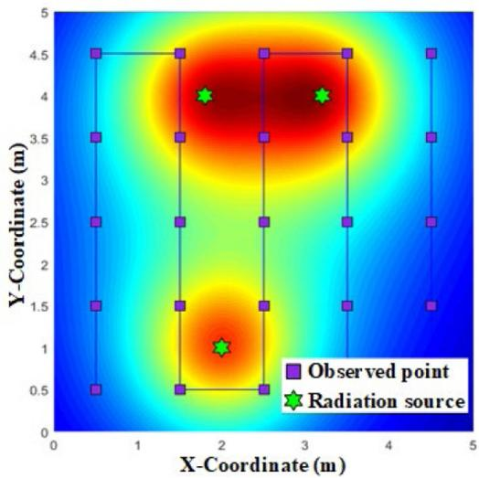  
Fig. 12. The radiation field and observation trajectory in the simulation.

## 5.2.1. Three radiation sources search

In the first scene, there are three sources close to each other; they create a multi-modal radiation field. The robot starts at the area’s boundary to test its ability to find sources. Fig. 14 shows the distribution of particle swarms and the observation trajectory during the search. The entire exploration process is summarized as follows:

(1) During the stage of tracking down suspicious sources (iterations 1–36), the robot kept tracking the closest predicted source (Fig. 14(a)–(c)) because the radiation gain attracted it. At this stage, the robot has not yet detected the high radiation. So the OIC reduces the gain around the inaccurately predicted source (pseudo source), which results in the robot exploring the unknown areas. Fig. 15 shows the RFC, which indicates the predicted result is not accurate at this stage.

(2) Fig. 14(d)–(g) indicate the robot is at the surrounding observation phase (iterations 37–63). The observed intensity increased, and these observations are more useful for prediction. There is still a prediction deviation; even the number of predicted sources does not match the actual number at this stage. However, because of the REC, the radiation gain guided the robot to surround, which ensured the positional diversity of observations. In the process of surrounding exploration, the accuracy of ADE-PSPF prediction has significantly improved. When the robot observed the neighborhood of sources (Fig. 14(g)), the number of sources in the predictions became correct.

(3) The final predicted result and the entire observation trajectory are shown in Fig. 14(i). In the stage of exploring unknown regions (iterations 64–83), the RSC and REC drove the robot to areas that had not yet been explored. In order to ensure online search, ADE-PSPF randomly selects parts of the observations for prediction in each iteration. When surrounding observations were complete, the deviation of the prediction still decreased with iteration. In exploring the unknown area, the robot gradually moved away from the area of high radiation. In the termination criterion, we set a RFC threshold and a threshold for the number of iterations to stop searching. Therefore, the robot continues to search until the RFC is not improved in ten consecutive iterations. When the robot had explored 83 times, the RFC reached 94.23%.

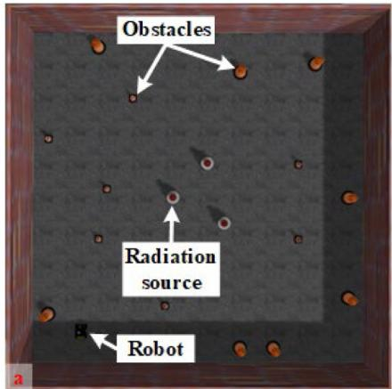

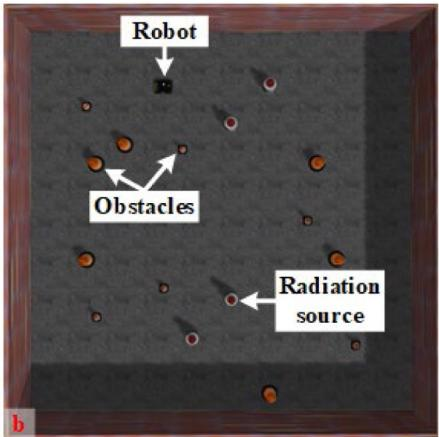  
<!-- PDF_PAGE: 011 -->

Fig. 13. Two scenarios in the simulation. (a) the three-source scenario. (b) the four-source scenario.

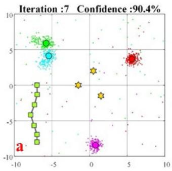

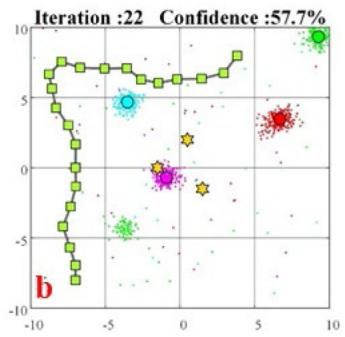

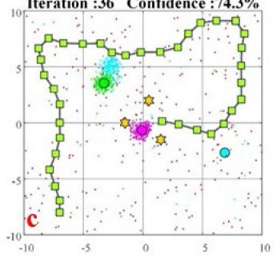

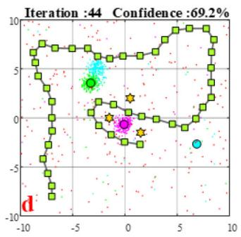

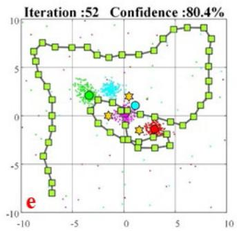

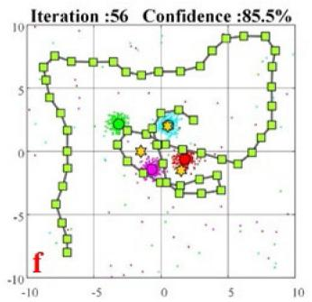

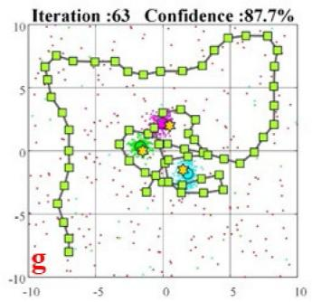

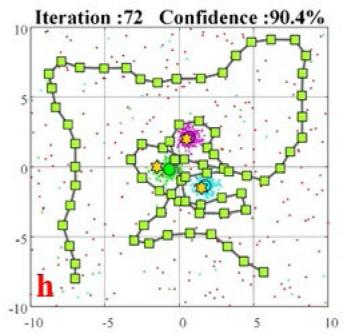

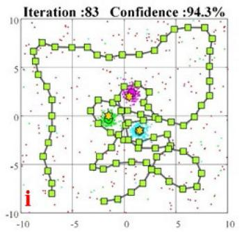  
Fig. 14. In the first scenario, the predicted results and the observation trajectory are shown at (a) iteration 7, (b) iteration 22, (c) iteration 36, (d) iteration 44, (e) iteration 52, (f) iteration 56, (g) iteration 63, (h) iteration 72, and (i) iteration 83.

## 5.2.2. Four radiation sources search process

In the four-source scene, there are two relatively independent radiation fields. Each field consists of two radiation sources. This simulation wants to verify the proposed method’s robustness in the case where all sources are not distributed in a local area. Fig. 16 shows the results and the observation trajectory during searching. The entire process is summarized as follows:

(1) In the surrounding observation phase (iterations 1–25), the robot exploited the nearest radiation field. When the robot has observed the common neighborhood of the two sources, it starts to perform surrounding observations around the predicted source (Fig. 16(a)). With the help of REC, the observations maintained a sufficient distance. After iteration 25, the robot began to observe unknown areas. The predicted result gradually became correct. However, the predictions deviated from the actual terms in the unknown region. In Fig. 17, although the RFC was high at this stage, it can only represent the predicted accuracy in the known area. Since the observations were not enough, the RFC has fluctuated dramatically.

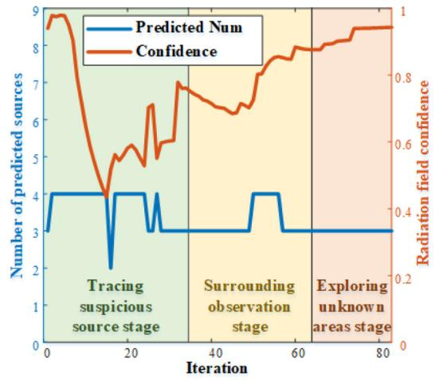  
<!-- PDF_PAGE: 012 -->

Fig. 15. RFC and number of predicted sources in the three-source simulation.

(2) Fig. 16(c)–(d) show the results and the observation trajectories in the stage of tracking the suspicious source (iterations 26–46). When the robot tracks a source, it approaches the source by the shortest path (Fig. 16(d)). During this phase, the OIC helped the robot keep moving toward the suspicious sources. Since the pseudo-sources’ intensity is close to that of the background radiation, ADE-PSPF eliminated the predicted results. At this stage, since the new observations are not near the sources, the RFC does not improve significantly.

(3) In the surrounding observation phase, the robot detected high radiation again (iterations 47–73). At the beginning of the stage, due to the deviation from the prediction, the robot did not explore the common neighborhood of the two sources (Fig. 16(f)). Due to the three corrections, the robot successfully explored the region. In addition, the RFC has significantly improved.

(4) In the stage of exploring the unknown area (iterations 74– 91), ADE-PSPF eliminated the interference of pseudo sources. And the RFC continued to increase by 3.3% after the number of sources was matched. Fig. 16(i) shows the final predicted results and the observation trajectory. At iteration 91, the RFC reached 88.7%.

## 5.2.3. Simulation result analysis

Fig. 18(a) and (b) show, respectively, the LE and IE in the first scenario. For the convenience of observation, we set the maximum LE to 2.5 m. In the stage of tracing suspicious sources, ADE-PSPF cannot accurately estimate the locations of the sources due to a lack of observations in the source neighborhood. After iteration 50, the LE decreased rapidly, but the IE increased. Since the robot has not observed the entire radiation field yet, ADE-PSPF cannot accurately infer the source number. ADE-PSPF fitted the radiation fields using four sources, and the intensity of each source is underestimated. After iteration 56 (Fig. 14(f)), the number of predicted sources became correct, and both errors decreased rapidly. This process proves that the surrounding observations worked.

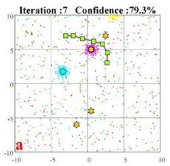

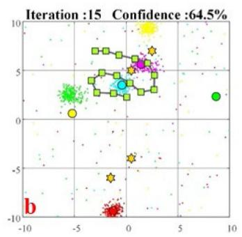

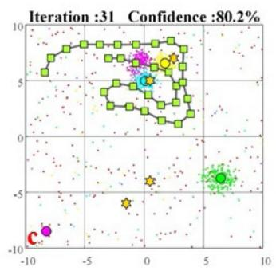

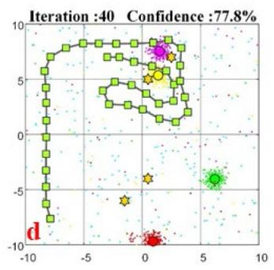

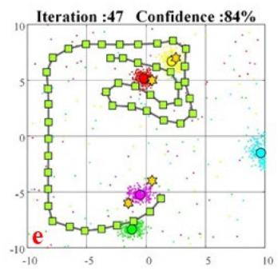

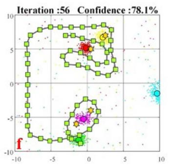

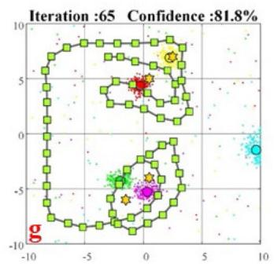

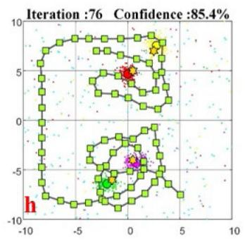

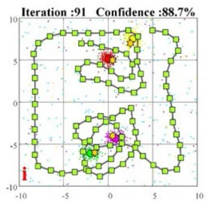  
Fig. 16. In the first scenario, the predicted results and the observation trajectory are shown at (a) iteration 7, (b) iteration 15, (c) iteration 31, (d) iteration 40, (e) iteration 47, (f) iteration 56, (g) iteration 65, (h) iteration 76, and (i) iteration 91.

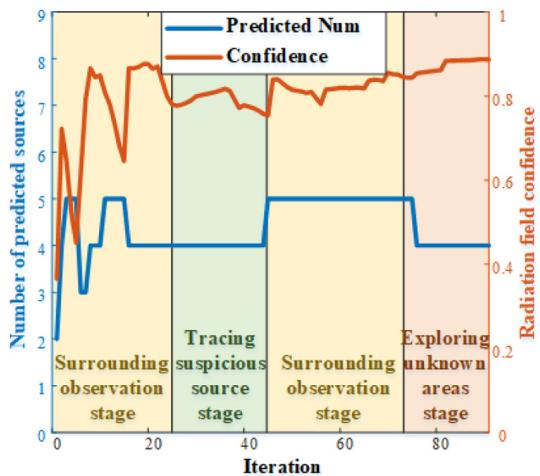  
<!-- PDF_PAGE: 013 -->

Fig. 17. RFC and number of predicted sources in the four-source simulation.

Fig. 19(a) and (b) show, respectively, the LE and IE in the second scene. In the phase of surrounding observation and tracing suspicious sources, both errors changed obviously. Many possible distributions in the unknown regions lead to this phenomenon. In the second surrounding observation phase, the number of predicted sources exceeded the actual number, which led to an increase in the IE. But the maximum error and the fluctuation range are less than those in the previous stages. Since all the radiation fields have been observed, both errors have significantly decreased.

Fig. 20(a) and (b) respectively show the runtime of different items in the two scenes. Their average runtime is shown in Table 5. The runtime of the robot movement and tree construction are almost irrelevant to the number of sources. The different number of particle swarms leads to the different runtime of ADE-PSPF. In the first scene, at iteration 58, the robot needed to rotate in a wide range to move to the target point, so the movement time reached 7.0 s. The results prove the proposed strategy can identify the terms online.

Table 5  
The runtime of the algorithm during the search.  
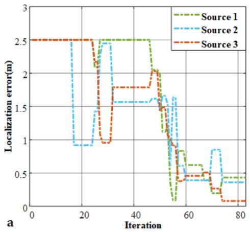

<table><tr><td>Item</td><td>3 sources</td><td>4 sources</td></tr><tr><td>RRT construction</td><td>0.48 s</td><td>0.37 s</td></tr><tr><td>ADE-PSPF prediction</td><td>5.83 s</td><td>7.37 s</td></tr><tr><td>Robot movement</td><td>3.81 s</td><td>3.88 s</td></tr></table>

Furthermore, we compared the performance of different search strategies to quantitatively analyze the error. The Boustrophedon Path (BP) ensures that the robot observes the whole scene uniformly [34]. And the Next-Best-View Planner (NBVP) is based on information gain, focusing on searching for the most favorable area where the robot perceives the whole environment [35]. They are both widely employed in search missions [36]. To ensure the results are reliable, each search strategy was run 20 times. In a real MRSS mission, the robot uses finite iterations to identify all parameters [37]. So we compare the success rate (SR), RFC, LE, and IE, when the number of iterations is the same. If the algorithm correctly predicts the number of sources, the estimation is successful. SR represents the proportion of successful experiments out of 20 experiments.

Table 6 shows the performance of the proposed strategy (PS), BP, and NBVP. The means and standard deviations of the metrics are compared. The PS has the smallest errors, which indicates that it can best exploit the radiation field information. For source search tasks, SR is also an important metric. The SR shows that PS is robust in the three strategies. Comparing the results of the two scenarios, we find that the source’s sparse distribution will increase the difficulty of prediction. This is because the particle filter uses only one observation per prediction. Compared to IE, the reduction of LE will significantly improve RFC. The results in the two scenarios confirmed that PS can effectively identify the parameters of sources in an unknown environment.

## 5.3. Four-point sources search experiment

We used a mobile robot to search the real environment to evaluate the suggested strategy more objectively. Since we do not have enough cobalt-60 sources to test the proposed method, we used ultraviolet (UV) radiation sources instead. As an electromagnetic wave, gamma radiation shares many of the same wave properties as light. All electromagnetic radiation (also called electromagnetic energy) is made up of minute packets of energy, or ’particles,’ called photons, which travel in a wave-like pattern. Consequently, the number of photons received by the sensor is directly proportional to the source intensity within a given time unit. The Poisson distribution is appropriate for characterizing the probability distribution of random events occurring within a specific time interval. We use the probability mass function of the Poisson distribution to evaluate the observation weight (approximation between the predicted number of received photons and the actual number of received photons) from a microscopic (photon) perspective. Similar to gamma radiation measurements, the UV radiation measurements varies randomly over time. UV radiation measurements include noise from the environment and sensors. To accurately measure both radiations, the observations at each location are determined by multiple measurements. Therefore, it is important to establish the propagation model of ultraviolet radiation.

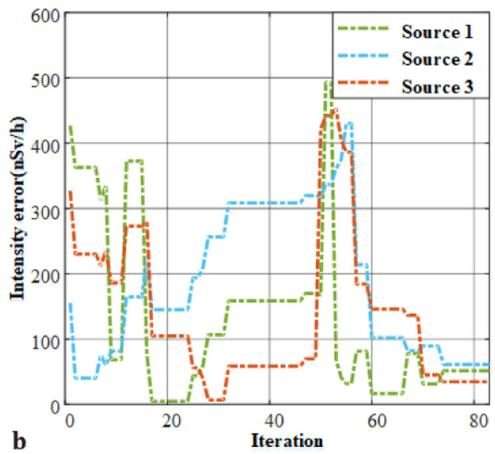  
Fig. 18. The (a) localization error and (b) intensity error in the first simulation.

Table 6  
<!-- PDF_PAGE: 014 -->

The results of the proposed strategy, BP and NBVP in the two scenario.
<table><tr><td rowspan="2"></td><td colspan="3">Three-source scenario</td><td colspan="3">Four-source scenario</td></tr><tr><td>PS</td><td>BP</td><td>NBVP</td><td>PS</td><td>BP</td><td>NBVP</td></tr><tr><td>SR</td><td>85%</td><td>80%</td><td>65%</td><td>70%</td><td>45%</td><td>50%</td></tr><tr><td>RFC</td><td> $0 . 9 5 \pm 0 . 0 1$ </td><td> $0 . 8 6 \pm 0 . 0 3$ </td><td> $0 . 7 7 \pm 0 . 1 1$ </td><td> $0 . 8 8 \pm 0 . 0 5$ </td><td> $0 . 7 2 \pm 0 . 0 5$ </td><td> $0 . 7 9 \pm 0 . 1 1$ </td></tr><tr><td>LE</td><td> $0 . 2 5 \pm 0 . 0 5$ </td><td> $1 . 1 9 \pm 0 . 3 7$ </td><td> $1 . 3 2 \pm 0 . 6 1$ </td><td> $0 . 4 3 \pm 0 . 2 5$ </td><td> $1 . 2 0 \pm 0 . 2 4$ </td><td> $0 . 9 2 \pm 0 . 6 2$ </td></tr><tr><td>IE</td><td> $1 2 4 . 7 2 \pm 4 7 . 4 1$ </td><td> $1 2 9 . 9 6 \pm 3 7 . 6 4$ </td><td> $1 0 4 . 8 2 \pm 1 8 . 8 6$ </td><td> $7 7 . 6 8 \pm 4 7 . 0 1$ </td><td> $9 7 . 1 5 \pm 3 3 . 7 7$ </td><td> $1 4 5 . 4 2 \pm 1 . 0 1$ </td></tr></table>

We used the Philips TUV PL-L36W4P UVLS and UV245 A sensors to measure the UV irradiation intensity. Fig. 21 shows the test scene for UV irradiation intensity. We counted the intensities whose irradiation distance was from 0.8 m to 3.8 m. To reduce the interference of radiation fluctuations, we sampled 500 times at each location. Then use the intensity, which is processed by a first-order filter, as the observation result corresponding to the distance. Fig. 22 displays the fitted curve of the intensity based on the least-squares method. According to the fitted result, we draw the following conclusions:

(1) The UV intensity attenuates according to the 1.90th power of the observation distance. And the intensity changes in inverse proportion to the square of the distance. Taking into account background radiation and sensor error, the two types of sources follow the same propagation model.

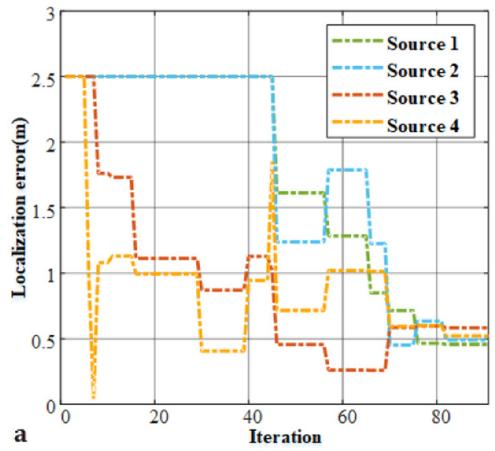

(2) UV radiation has a weaker penetration than ionizing radiation. In the experimental scene, the height of obstacles should be lower than the observation plane. The constraint prevents the observation intensity from changing abruptly due to the occluded UV ray.

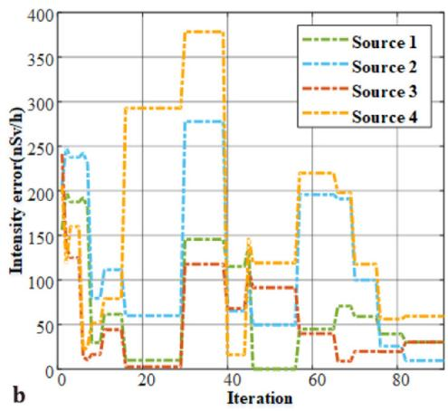  
Fig. 19. The (a) location error and (b) intensity error in the second simulation.

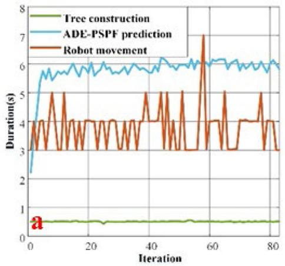

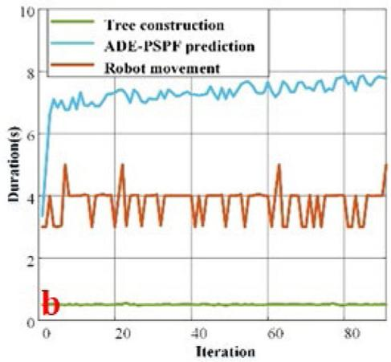  
Fig. 20. The runtime of the different items in the (a) three-source and (b) four-source scenarios.

Table 7  
<!-- PDF_PAGE: 015 -->

The configuration of four-point source environment.
<table><tr><td>Scenario item</td><td>Parameter setting</td></tr><tr><td>The scope of the scene</td><td>15m × 12 m</td></tr><tr><td>Number of RRT nodes</td><td>60</td></tr><tr><td>Number of particles in each swarm</td><td>250</td></tr><tr><td>Initial robot state</td><td>(0.0, 0.0, 0)</td></tr><tr><td>Swarms and sources number</td><td>5 and 4</td></tr><tr><td>Parameters about sources</td><td>(4.1, −5.35, 4641), (7.3, −5.35, 4791), (4.9, −8.55, 4845) , (8.1, −8.55, 4961)</td></tr><tr><td>Radiation field distribution</td><td>One multimodal radiation field</td></tr></table>

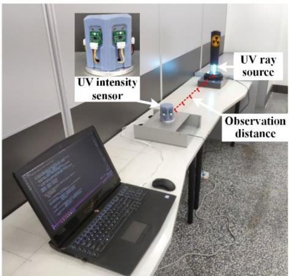  
Fig. 21. The experimental scenario for observing the UV ray intensity.

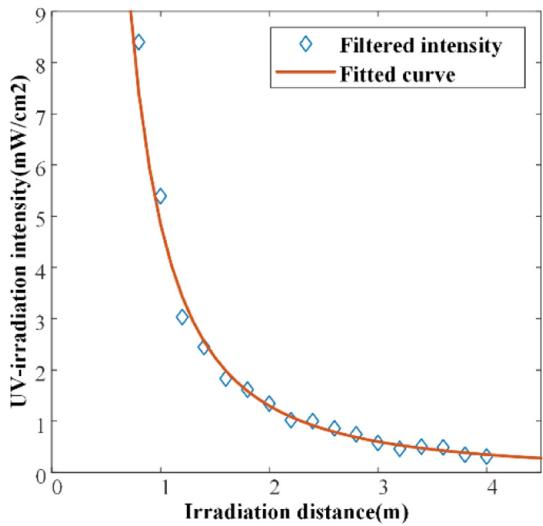  
Fig. 22. The fitting curve based on the irradiation intensity.

The experimental scenario for a four-point source search is shown in Fig. 23. This scene contains a total of four nearby sources, which together form a multi-modal radiation field. Table 7 lists the configuration of the experimental scenario.

Fig. 24 displays the flow of the robot searching for four point sources. The robot obtains the point cloud of the scene using the Velodyne VLP-16 lidar. The robot attains its location information and the grid map of the scenario based on the Cartographer simultaneous localization and mapping (SLAM) framework. Then the costmap is generated by fusing the grid map and parameters of the robot, which helps it move while avoiding obstacles. The exploration module guides the robot to move to the new observation location by combining the costmap and output of the estimation module. The SLAM framework and search strategy are all running on the NUC minicomputer.

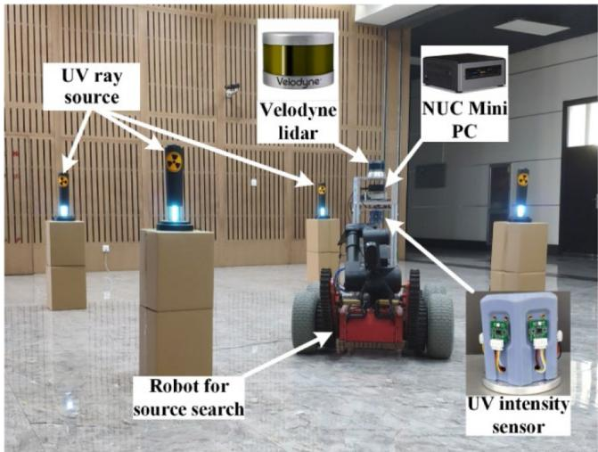  
Fig. 23. The experimental scenario for point-source search.

Fig. 25 shows the final predicted results and the observation trajectories. The PS observed the common neighborhood of the sources (Fig. 25(a)) through the alternation of tracking the suspicious source and the surrounding observations. However, the others ignored the area, and they both incorrectly estimated the number of sources.

Only the proposed strategy still observed the common neighborhood of each source. The BP strategy distributed the exploration opportunities in the whole scene to observe uniformly. The trajectory of NBVP covers almost the whole scene because its purpose is to complete the search in an unknown environment quickly. Therefore, it does not explore the source neighborhoods repeatedly. The difference between the PS and NBVP is the radiation gain, which guarantees the robot surrounds the sources. Although this evaluation criterion increases the opportunity for the robot to search the interest region, the gain correction adjusts the gravity of these regions to encourage exploration of unknown and suspicious areas.

To prevent the experimental contingency from influencing the conclusion, we repeated the search experiment. All of the parts of this experiment are the same, except for the exploration module. In the repeated experiments, we tested each strategy 20 times. Table 8 shows the results of PS, BP, and NBVP in a real scenario. The proposed strategy has the lowest LE and IE, and its SR is also the highest.

The estimation module did not accurately identify the terms because neither BP nor NBVP provided enough useful observations. The results show that the accuracy of predictions is linked to the number of observations close to the source. The PS is robust in two different types of radiation fields. In a real environment, the proposed method successfully finds all terms compared to other methods. It is shown that the exploration module can give ADE-PSPF more information about the area of interest. In addition, the alternation of three search phases is able to decouple the multi-modal radiation fields online.

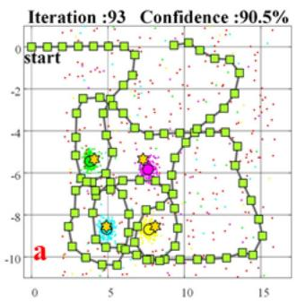

  
<!-- PDF_PAGE: 016 -->

Fig. 24. The flow of the robot searching for four point sources.

  
Fig. 25. The results and the observation trajectory of (a) PS, (b) BP, and (c) NBVP.

Table 8  
The results of PS, BP and NBVP in the real scenario.
<table><tr><td></td><td>PS</td><td>BP</td><td>NBVP</td></tr><tr><td>SR</td><td>80%</td><td>65%</td><td>60%</td></tr><tr><td>RFC</td><td> $0 . 8 8 \pm 0 . 0 2$ </td><td> $0 . 7 9 \pm 0 . 0 2$ </td><td> $0 . 7 5 \pm 0 . 0 1$ </td></tr><tr><td>LE (m)</td><td> $0 . 7 4 \pm 0 . 2 2$ </td><td> $0 . 8 4 \pm 0 . 2 4$ </td><td> $0 . 8 0 \pm 0 . 4 4$ </td></tr><tr><td>IE (nSv/h)</td><td> $1 3 4 . 8 1 \pm 1 5 . 6 9$ </td><td> $2 4 4 . 8 8 \pm 8 0 . 5 1$ </td><td> $2 9 7 . 3 7 \pm 7 5 . 3 1$ </td></tr></table>

## 6. Conclusion

We propose a novel robotic search strategy for unknown radiation environments where multiple point sources exist. In the estimation module, we combine the PSPF with ADE optimization to improve estimation accuracy under the same observation conditions. In the exploration module, we designed a planning method based on the radiation gain model that trades off exploration of unexplored areas and exploitation of known radiation fields. Furthermore, the strategy was evaluated in both simulated and real scenarios. The results verify three aspects: (1) the ability of ADE-PSPF to jump out of the local optimum; (2) the robustness of this strategy in various radiation scenarios; and (3) the contribution of the surrounding observations to the estimation module. And compared with the existing algorithms, the most apparent advantage is that it can estimate the parameters of sources while searching in an unknown environment. However, the simulated and real scenes are closed and of known size. This work did not discuss the maximum search range of the proposed strategy. In future work, we will study the MRSS strategy for large-scales scenes and other sources except for point-source.

## Declaration of competing interest

The authors declare that they have no known competing financial interests or personal relationships that could have appeared to influence the work reported in this paper.

## Data availability

Data will be made available on request.

## Acknowledgments

This research was supported by National Natural Science Foundation of China (No. 61773141 and 62273123).

## <!-- PDF_PAGE: 017 -->

Appendix A. Supplementary data

Supplementary material related to this article can be found online at https://doi.org/10.1016/j.robot.2023.104529.

## References

[1] World Health Organization, 1986-2016: Chernobyl at 30 - An update, 2016, https://www.who.int/publications/m/item/1986-2016-chernobyl-at-30.

[2] International Atomic Energy Agency, Radiation in everyday life, 2015, https://www.iaea.org/Publications/Factsheets/English/radlife.

[3] Z. Shang, Y. Dang, Y. Wang, et al., NORM survey within the second census on pollution sources in China, J. Environ. Radioact. 237 (2021) 106714.

[4] A. West, I. Tsitsimpelis, M. Licata, et al., Use of Gaussian process regression for radiation mapping of a nuclear reactor with a mobile robot, Sci. Rep. 11 (1) (2021) 1–11.

[5] T. Wright, A. West, M. Licata, et al., Simulating ionising radiation in gazebo for robotic nuclear inspection challenges, Robotics 10 (3) (2021) 86.

[6] X. Xu, N.S.V. Rao, S. Sahni, A computational geometry method for localization using differences of distances, ACM Trans. Sensor Netw. 6 (2) (2010) 1–25.

[7] J.C. Chin, D.K.Y. Yau, N.S.V. Rao, et al., Accurate localization of low-level radioactive source under noise and measurement errors, in: Proceedings of the 6th ACM conference on Embedded network sensor systems, 2008, pp. 183–196.

[8] C.D. Pahlajani, I. Poulakakis, H.G. Tanner, Networked decision making for Poisson processes with applications to nuclear detection, IEEE Trans. Automat. Control 59 (1) (2013) 193–198.

[9] J.W. Howse, L.O. Ticknor, K.R. Muske, Least squares estimation techniques for position tracking of radioactive sources, Automatica 37 (11) (2001) 1727–1737.

[10] M. Morelande, B. Ristic, A. Gunatilaka, Detection and parameter estimation of multiple radioactive sources, in: 2007 10th International Conference on Information Fusion, IEEE, 2007, pp. 1–7.

[11] Y.7. Cheng, T. Singh, Source term estimation using convex optimization, in: 2008 11th International Conference on Information Fusion, IEEE, 2008, pp. 1–8.

[12] M. Ding, X. Cheng, Fault tolerant target tracking in sensor networks, in: Proceedings of the tenth ACM international symposium on Mobile ad hoc networking and computing, 2009, pp. 125–134.

[13] J.C. Chin, D.K.Y. Yau, N.S.V. Rao, Efficient and robust localization of multiple radiation sources in complex environments, in: 2011 31st International Conference on Distributed Computing Systems, IEEE, 2011, pp. 780–789.

[14] P. Tandon, P. Huggins, R. Maclachlan, et al., Detection of radioactive sources in urban scenes using Bayesian aggregation of data from mobile spectrometers, Inf. Syst. 57 (2016) 195–206.

[15] E. Bai, A. Heifetz, P. Raptis, et al., Maximum likelihood localization of radioactive sources against a highly fluctuating background, IEEE Trans. Nucl. Sci. 62 (6) (2015) 3274–3282.

[16] J. Han, Y.Q. Chen, Multiple UAV formations for cooperative source seeking and contour mapping of a radiative signal field, J. Intell. Robot. Syst. 74 (1) (2014) 323–332.

[17] B. Li, Y. Zhu, Z. Wang, et al., Use of multi-rotor unmanned aerial vehicles for radioactive source search, Remote Sens. 10 (5) (2018) 728.

[18] J. Huo, M. Liu, K.A. Neusypin, et al., Autonomous search of radioactive sources through mobile robots, Sensors 20 (12) (2020) 3461.

[19] H. Zhu, Y. Wang, C. Du, et al., A novel odor source localization system based on particle filtering and information entropy, Robot. Auton. Syst. 132 (2020) 103619.

[20] B. Ristic, M. Morelande, A. Gunatilaka, Information driven search for point sources of gamma radiation, Signal Process. 90 (4) (2010) 1225–1239.

[21] A.A.R. Newaz, S. Jeong, H. Lee, et al., UAV-based multiple source localization and contour mapping of radiation fields, Robot. Auton. Syst. 85 (2016) 12–25.

[22] W. Gao, W. Wang, H. Zhu, et al., Robust radiation sources localization based on the peak suppressed particle filter for mixed multi-modal environments, Sensors 18 (11) (2018) 3784.

[23] W. Wang, W. Gao, H. Zhu, et al., Improved dynamic optimization of PSPFbased sources estimation in local multi-modal radiation field, IEEE Access 7 (2019) 153885–153899.

[24] D. Hellfeld, T.H.Y. Joshi, M.S. Bandstra, et al., Gamma-ray point-source localization and sparse image reconstruction using Poisson likelihood, IEEE Trans. Nucl. Sci. 66 (9) (2019) 2088–2099.

[25] T. Kishimoto, H. Woo, R. Komatsu, et al., Path planning for localization of radiation sources based on principal component analysis, Appl. Sci. 11 (10) (2021) 4707.

[26] Y. Ji, Y. Zhao, B. Chen, et al., Source searching in unknown obstructed environments through source estimation, target determination, and path planning, Build. Environ. 221 (2022) 109266.

[27] K. Groves, E. Hernandez, A. West, et al., Robotic exploration of an unknown nuclear environment using radiation informed autonomous navigation, Robotics 10 (2) (2021) 78.

[28] F. Mascarich, M. Kulkarni, P. De Petris, et al., Autonomous mapping and spectroscopic analysis of distributed radiation fields using aerial robots, Auton. Robots 47 (2) (2023) 139–160.

[29] F. Mascarich, P. De Petris, H. Nguyen, et al., Autonomous distributed 3d radiation field estimation for nuclear environment, in: 2021 IEEE International Conference on Robotics and Automation, (ICRA), IEEE, 2021, pp. 2163–2169.

[30] C.I. Thompson, E.E. Barritt, C. Shenton-Taylor, Predicting the air fluorescence yield of radiation sources, Radiat. Meas. 88 (2016) 48–54.

[31] R. Almadhoun, T. Taha, L. Seneviratne, et al., A survey on multi-robot coverage path planning for model reconstruction and mapping, SN Appl. Sci. 1 (8) (2019).

[32] C.G. Bowles, G.M. Reimer, Short-Term Fluctuations in Barometric Pressure, Soil-Gas Radon, and Gamma Radiation, Open-File Report, 1991.

[33] H.E. Johns, J.R. Cunningham, The physics of radiology, 1983.

[34] Y. Brouwer, A. Vale, R. Ventura, Informative path planner with exploration– exploitation trade-off for radiological surveys in non-convex scenarios, Robot. Auton. Syst. 136 (4) (2020).

[35] A. Bircher, M. Kamel, K. Alexis, et al., Receding horizon next-best-view planner for 3D exploration, in: IEEE International Conference on Robotics & Automation, IEEE, 2016.

[36] Hongbiao Zhu, et al., DSVP: Dual-stage viewpoint planner for rapid explo ration by dynamic expansion, in: 2021 IEEE/RSJ International Conference on Intelligent Robots and Systems, (IROS), IEEE, 2021.

[37] Hua Bai, et al., Multi-source term estimation based on parallel particle filtering and dynamic state space in unknown radiation environments, Build. Environ. 236 (2023) 110281.

  
Hua Bai received the M.S. degrees in control engineering from the Northeastern University in 2018. He is currently pursuing the Ph.D. degree at the Harbin Institute of Technology, Harbin, China. His research interests include environment exploration, probabilistic robotics and field robot.

  
Wenrui Gao was born in Liaoning, China, in 1990. He received the B.S., M.S., and Ph.D. degrees from the Harbin Institute of Technology (HIT), in 2012, 2014 and 2021, respectively. His research expertise is involved in the general areas of robotics and mechatronics, which is mainly consisted of mobile manipulator, exoskeleton robot, probabilistic robotics and computer vision.


Haofei Ma obtained the B.S degree from the school of Hebei University of Technology in 2022. He is currently pursuing the master’s degree with the Harbin Institute of Technology. His main research focuses on computer vision and intelligent control of robotic arms.


Pengchao Ding obtained his M.Sc. in Mechatronic Engineering from Harbin Institute of Technology in 2020. Currently, he is a Ph.D. student at Harbin Institute of Technology, pursuing his study in State Key Laboratory of Robotics and System at Harbin Institute of Technology. His research interests lie in ground robots and SLAM.


<!-- PDF_PAGE: 018 -->

Gongcheng Wang obtained his M.Sc. in mechanical engineering from Shandong University. Currently, he is a Ph.D. student at Harbin Institute of Technology, pursuing his study in State Key Laboratory of Robotics and System at Harbin Institute of Technology. His main research interests lie in mobile manipulator intelligent operation.

Wenda Xu obtained his M.Sc. in Mechatronic Engineering from Harbin Institute of Technology in 2022. Currently, he is a Ph.D. student at Harbin Institute of Technology, pursuing his study in State Key Laboratory of Robotics and System at Harbin Institute of Technology. His research interests mainly focus on unmanned aerial vehicles (UAVs) and navigation, exploration.


Weidong Wang received the B.S., M.S., and Ph.D. degrees in mechatronics engineering from the Harbin Institute of Technology, in 2002, 2004, and 2009, respectively, where he is currently with the State Key Laboratory of Robotics and System. His research expertise is in the general areas of robotics and mechatronics. His research interests include motion planning, computer vision, human–machine interaction, and its application in field robot and surgical robot.


Zhijiang Du received the B.S. degree in mechanical engineering and the M.S. and Ph.D. degrees in mechatronics engineering from the State Key Laboratory of Robotics and System, Harbin Institute of Technology, Harbin, China, in 1995, 1997, and 2001, respectively. He has been a Professor of Harbin Institute of Technology, since 2006. His research interests include the general areas of medical robots, industrial robots.