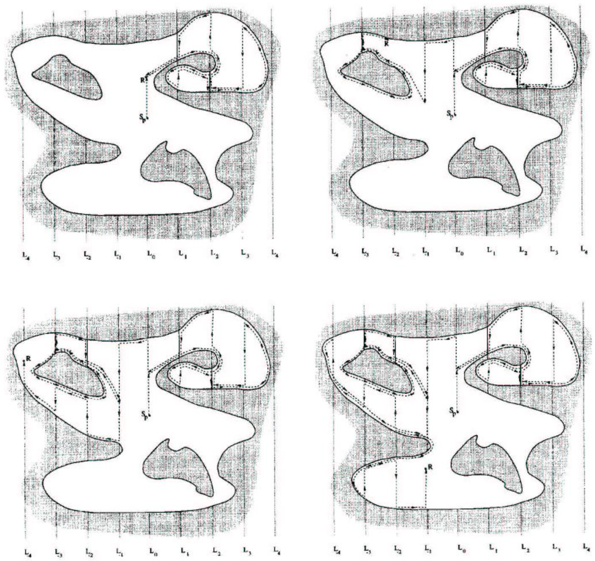
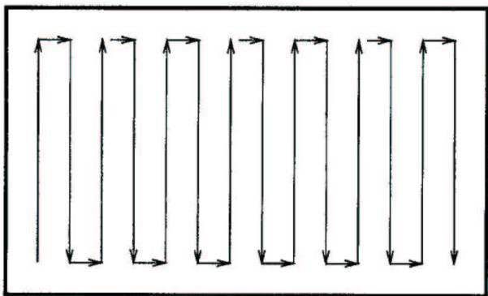
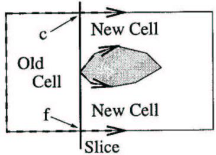
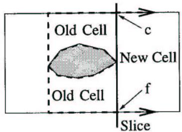
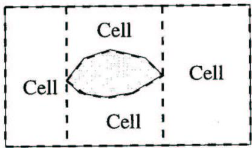
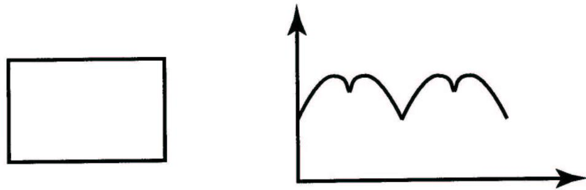
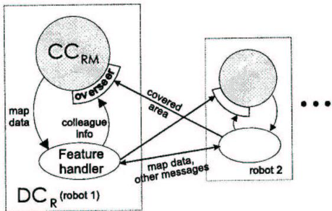
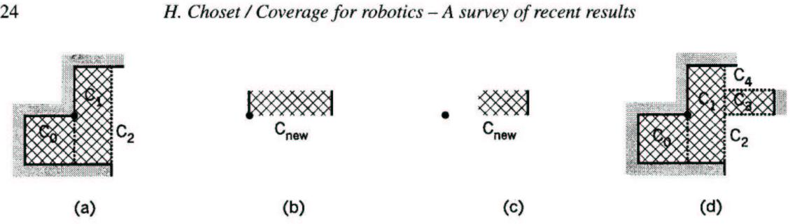

<!-- PDF_PAGE: 001 -->

# Coverage for robotics - A survey of recent results

Howie Choset

Carnegie Mellon University, Pittsburgh, PA 15213, USA

This paper surveys recent results in coverage path planning, a new path planning approach that determines a path for a robot to pass over all points in its free space. Unlike conventional point-to-point path planning, coverage path planning enables applications such as robotic demining, snow removal, lawn mowing, car-body painting, machine milling, etc. This paper will focus on coverage path planning algorithms for mobile robots constrained to operate in the plane. These algorithms can be classified as either heuristic or complete. It is our conjecture that most complete algorithms use an exact cellular decomposition, either explicitly or implicitly, to achieve coverage. Therefore, this paper organizes the coverage algorithms into four categories: heuristic, approximate, partial-approximate and exact cellular decompositions. The final section describes some provably complete multi-robot coverage algorithms.

Keywords: coverage, mobile robots, cell decompositions

## 1. Introduction

Motion planning algorithms [24] originally considered the start-goal problem whose solution determines a path (or trajectory) between two points. The motion planning literature is full of elegant solutions to this problem ranging from potential function approaches [21,33] to a provably complete sensor-based methods [26].Yap [29] and Canny [9]introduced a new method for path planning that uses a map of the environment.One benefit of map-based approaches is that a path can be generated more efficiently using a map. The idea here is that constructing the map requires a one time fixed-cost and then using the map to generate paths between two points requires a small cost each time, with an overall savings over planning paths several times using the conventional path planners.

Conventional start-goal and map-based path planning algorithms do not address applications such as floor cleaning [13], lawn mowing [20], mine hunting [23], harvesting [30], painting, etc.. These applications require a coverage path planning algorithm, which as its name suggests, specifically emphasizes the space swept out by the robot's sensor. Integrating the robot's footprint (detector range) along the coverage path yields an area identical to that of the target region. This problem is related to the covering salesman problem, a variant of the traveling salesman problem where instead of visiting each city, an agent must visit a neighborhood of each city that minimizes the travel length for the agent [3]. However with coverage, the agent must pass over all points in the target environment as opposed to just passing through all of the neighborhoods. This paper overviews recent work developed in coverage path planning for mobile robots.

<!-- PDF_PAGE: 002 -->

Some of the early work in coverage path planning relies on heuristics which are simple rules of thumb that may work well, but do not have any provable guarantees ensuring success of the coverage operation.One of the major accomplishments of several recent works in coverage is the guarantee that the planner generates a path that completely covers the free space. This is clearly important for many applications, such as de-mining. where using a heuristic is akin to using a faulty mine detector. To achieve some form of provable guarantee, many coverage path planners either implicitly or explicitly use a cellular decomposition of the free space to achieve coverage. A cellular decomposition breaks down the target region into cells such that coverage in each cell is "simple". Provably complete coverage is attained by ensuring the robot visits each cell in the decomposition. In this paper, we will look at three types of decompositions: approximate, semi-approximate, and exact. Finally, this paper overviews some works that use cellular decompositions to achieve multi-robot coverage.

Clearly, complete approaches have the advantage of removing any doubt that the robot has successfully covered a target region. However, complete approaches require more sensory and computational power than the simpler robots may have on-board. Therefore, the cost-per-quality of coverage may be better with randomized approaches.

Another issue in coverage is time-to-completion. The use of multiple robots clearly reduces the time to complete the coverage operation. For one robot, however, one can consider the area covered per unit path length traveled. Minimizing this quantity improves time-to-completion for both single and multi-robot coverage. For mobile robots, turning occupies more time (and induces more dead-reckoning error)than traveling in straight lines, so minimizing the number of turns also provides better time-tocompletion.

A final issue that we address in this survey is the availability of a priori information. Many classical path planning algorithms and some coverage approaches assume that the robot knows the layout of the environment prior to the planning event. In many situations, this assumption may be unrealistic. Instead, the robot must use its on-board sensors to acquire informationabout the environment and perform coverage on-line. This type of coverage is sometimes called sensor-based coverage because it uses sensor information to direct the coverage operation.Sensor-based approaches, both heuristic and complete, may never yield an optimal solution for all environments because one can always create an antagonistic example for any sensor-based approach.

## 2. Heuristic and randomized approaches

One class of heuristic algorithms for coverage employs an approach in which the robot is equipped with a simple set of behaviors (e.g., following a wall) [6]. A hierarchy of cooperating behaviors forms more complicated actions, such as exploration. Strong experimental resultsindicate the utility of these approaches (such as [16]), and thus these algorithms may provide a future basis for complete sensor-based planners. Balch and Arkin investigated multi-robot coverage tasks in which one to five simulated robots search for and retrieve objects to a homebase [5,27]. This behavior-based approach includes heuristic and randomized components. One of the heuristics, repulsion from other robots, ensures that the agents spread out during the search phase, and thus cover the environment more uniformly. This heuristic, and others, like avoid-obstacle, are combined to provide the oyerall behavior of the robot. The robots do not plan search paths, but rather, select directions at random until they encounter an object for retrieval.

<!-- PDF_PAGE: 003 -->

A random search does not guarantee complete coverage, but there are advantages to this approach. Balch, and separately Gage, have analyzed randomized robot search from a cost/benefit point of view [4,15]. Balch argues that robots executing random searches may not require costly localization sensors (e.g., GPs), nor do they consume valuable computational resources for calculating their position. Therefore, robots using randomized search strategies can be built for less cost than robots using methods that require precise positioning. In some simulated coverage tasks, Balch found performance ratios of 5 to 1 between multi-robot teams using methodical search strategies and teams using randomized strategies. Therefore, if robots without localization capabilities can be constructed at one-fifth the cost, it may be effective to use a randomized search.

Gage's work [15] focuses on coverage for de-mining. His analysis considers the probability of a robot's sensor detecting a mine in one pass. When this probability is less than 1.0, even complete coverage of an area by a robot will not guarantee that all mines will be found. As the probability decreases, the advantages of methodicalsearch over randomized search diminish. At a certain point, the advantage of a systematic search over a random one disappears allowing for the use of less expensive/intelligent robots.

A floor coverage approach that considers non-holonomic constraints is described in [18]. In this work, a set of templates is used to cover only a bounded region that is free of obstacles. These templates accommodate the non-holonomic constraints of the robot. However, this approach does not suggest a method by which these templates are "put" together to achieve full coverage of a target region.

## 3. Approximate cellular decompositions

An approximate cellular decomposition is a fine-grid based representation of the free space. Here, the cells are all the same size and shape, but the union of the cells only approximates the target region. This idea was pioneered by Elfes [14] and Moravac [28]. Here, it is normally assumed that once the robot enters a cell it has covered the cell; typically the cell is the size of the robot's footprint or effector.When the robot visits each cell in the decomposition, coverage is complete.

Zelinsky et al. [42] used the conventional wavefront algorithm (distance transform) to determine a coverage path. The wavefront algorithm initially assigns a O to the goal and then a 1 to all surrounding cells. Then, all unmarked cells neighboring the marked 1 are then labeled with a 2. This process repeats until the wavefront crosses the start. Once this occurs, the robot can use gradient descent on this numeric potential function [21] to find a path. 3

<!-- PDF_PAGE: 004 -->

The work in [42] does not terminate the wavefront propagation until it assigns a value to all cells in the free space. After the wavefront has spread throughout the entire free space, the robot finds a path from start to goal performing "pseudo-gradient ascent," i.e., move towards a cell that has the highest value neighboring the current cell that has not been visited. In an environment with no obstacles, this approach reduces to following the equipotential curves from top to bottom. A unique feature of their algorithm is that not only is a coverage path determined, but they can also specify a start and a goal. They can define their wavefront potential function to encode different types of cost functions, such as path safety, to optimize with their coverage algorithm. Their measure of safety uses the brushfire method (obstacle distance transform) to compute distance of each cell to the nearest obstacle. The planner then uses a weighted sum of both potentials to compute the coverage path, resulting in a path with fewer turns which is beneficial for mobile robots.

Gabriely and Rimon are currently working on a coverage approach that provides optimal paths in a grid-like representation of the free space. Their algorithm, called Spanning Tree Covering (STC), subdivides the work-area into disjoint cells and then follows a spanning tree of the graph induced by the cells, while covering every point precisely once. They are developing three versions of the STC algorithm. The first version is off-line, where the robot has perfect a priori knowledge of its environment. The off-line STC algorithm computes an optimal covering path in linear time O(N), where N is the number of cells comprising the area. The second version of STC is on-line, where the robot uses its on-board sensors to detect obstacles and construct a spanning tree of the environment while covering the work-area. The on-line STC algorithm completes an optimal covering path in time O(N), but requires O(N) memory for its implementation. The third version of STC is ant-like. In this version, too, the robot has no a priori knowledge of the environment, but it may leave pheromone-like markers during the coverage process. The ant-like STC algorithm runs in time O(N), and requires only O(1) memory. One assumption this work makes is that the free space does not get "more narrow" than double the robot or covering tool's diameter. Spires and Goldsmith [34] use an approach that bears similarity to Rimon's coverage work in which they use a Hilbert graph on an approximate cellular decomposition to find the shortest path for each robot in the grid.

## 4. Semi-approximate

Hert and Lumelsky present a coverage algorithm that relies on a partial discretization of space where cells are fixed in width but the top and bottom (or the ceiling and floor) can have any shape [17,25]. Their planar terrain-covering algorithm applies to both simply and non-simply connected environments. The simplicity of their algorithm lies in its recursive nature. A robot following this algorithm may start at an arbitrary point in the environment and will zigzag along parallel straight lines (grid lines) to cover the given area. Portions of the area that either would not be covered or would be covered twice using the zigzag procedure are detected by the robot and covered using the same procedure. These smaller areas (inlets) are covered as soon as they are detected and inlets within inlets are treated in the same way. The recursive zigzagging procedure causes the inlets to be covered in a depth-first order. The algorithm requires that the robot remember the points at which it enters and exits every inlet it covers (which define the inlet doorways). This assures that each inlet is covered only once.

<!-- PDF_PAGE: 005 -->

When entering or exiting an inlet, the robot may cover the same area more than once, or miss some area at the inlet, so special procedures are necessary for efficiently covering inlets which are called diversion inlets. The robot enters a diversion inlet by moving along its boundary. After covering a given diversion inlet, the robot exits it by resuming its path of travel as if the diversion inlet did not exist. When the area to be covered is not simply connected and contains islands as well as inlets, the same basic procedures are used with only minor modifications to ensure that the area surrounding every island is covered. By remembering certain points along its path, the robot is able to convert the part of the area around each island that would normally not be covered into an artificial inlet. Artificial inlets are covered in the same way that real diversion inlets are covered. See figure 1.

  
Figure 1. The path a robot R follows in a non-simply connected environment, i.e., has both islands and 5inlets.

<!-- PDF_PAGE: 006 -->

The algorithm is proven to be correct and its complexity is measured in two different ways: in terms of the distance traveled by the robot and in terms of the amount of memory required to store the input information. The length of the robot's path in a planar environment is in the worst case linear in the lengths of the outer boundary and the island boundaries and in the length of the grid line segments in the interior of the area to be covered. Another advantage of this approach is that it could provide complete coverage without assuming any prior information about the robot's free space, i.e., the algorithm can be performed on-line.

In a nonplanar two-dimensional environment, the upper bound on the path length differs from the bound in the planar environment by no more than a multiplicative constant that is dependent on the maximum slope of the surface the robot can cover. Hert and Lumelsky also provide a bound on the amount of memory required by the robot to implement the nonplanar algorithm. They show that, if the boundary is described by a semi-algebraic set, the amount of memory required in a planar or nonplanar environment is linear in the size of this description [17].

## 5. Exact cellular decompositions

An exact cellular decomposition is the set of non-intersecting regions, each termed a cell, whose union fills the target environment. Typically, the robot can cover each cell using simple back-and-forth motions; hence coverage path planning is reduced to planning motions from one cell to another.

One popular exact cellular decomposition technique, which can yield a complete coverage path solution, is the trapezoidal decomposition [24] (also known as the slab method [31]) in which the robot's free space is decomposed into trapezoidal cells. Since each cell is a trapezoid, coverage in each cell can easily be achieved with simple back and forth motions (see figure 2). Coverage of the environment is achieved by visiting each cell in the adjacency graph. VanderHeide and Rao [35] developed a sensor-based (on-line) version of the trapezoidal decomposition for a planar environment populated with one or two well-separated obstacles.

  
Figure 2. Back-and-forth motions.

  
<!-- PDF_PAGE: 007 -->

Figure 3. In event; as the slice moves left to right, its connectivity changes from one to two.

Figure 4. Out event; as the slice moves left to right, its connectivity changes from two to one.  
  
Figure 5. Boustrophedon decomposition.

## 5.1. Boustrophedon decomposition

Many cells in the trapezoidal decomposition can be merged such that the robot can continue performing back and forth motions while covering the cell and not intersecting an obstacle. Choset and Pignon [11,12] developed a new decomposition termed the boustrophedon decomposition' to address this "clumped" cell issue. In this method, a line segment, termed a slice, is swept through the environment. Whenever there is a change in connectivity of the slice, a new cell is formed. When the connectivity increases, two new cells are spawned, as shown in figure 3. Conversely, when connectivity decreases, two cells are merged into one cell, as shown in figure 4. Figure 5 contains a simple example of the boustrophedon decomposition.

<!-- PDF_PAGE: 008 -->

Once the decomposition and adjacency graph are determined, the robot employs a simple graph search algorithm to determine a walk through the adjacency graph that visits all nodes, i.e., visits all cells. Since simple back-and-forth motions covers each cell, complete coverage is achieved by visiting each cell.

The work in [12] assumes a priori information about the obstacle locations, and hence the critical points. Recently, Acar and Choset adapted the boustrophedon decomposition for scenarios where the environment is not known ahead of time [2]. Cells are defined in terms of critical points, points where the connectivity of the slice changes, as described above. The work in [2] describes a method to infer the location of critical points from a simple sonar ring. The second contribution of [2] is the development of an algorithm that ensures that the robot encounters all critical points, thereby allowing for complete construction of the cellular decomposition and hence guaranteeing coverage of an unknown region. Cao et al.[10] independently produced the same result as the sensor based boustrophedon decomposition, except the Cao et al. approach is limited to convex obstacles. The method in [10] is the earliest work on robotic coverage that we can find.

## 5.2. Optimal decomposition

Huang [19] adapts the boustrophedon approach to achieve optimal coverage. Instead of minimizing path length to achieve coverage, Huang's criterion for optimization is the total number of turns required to cover all the subregions. This is an approximation to minimizing the time to cover a region under the assumptions that turns are expensive because the robot must decelerate, turn, and then accelerate and the cost of travel between subregions is negligible. The number of turns to cover a boustrophedon cell is proportional (with some rounding error) to the width, sometimes called the altitude or diameter, of the region perpendicular to the boustrophedon motion. The problem then becomes that of choosing a slice direction that minimizes the sum of the altitudes of all cells in the decomposition.

Huang [19] shows that the optimal line sweep decomposition must use a sweep line that is parallel to an edge of the boundary or an obstacle or their convex hull for a polygonal environment. This is shown by expressing the sum of boustrophedon cell altitudes as the sum of the diameter functions of the boundary and the obstacles. Diameter functions (for an example see figure 6) have the property that they are piecewise sinusoidal for polygons and that they draw from the sine curve only in the region where $\theta \in ( 0 , \pi )$ To minimize this sum of diameter functions, we would find critical points and check the second derivative, but the second derivative is always positive, corresponding to a maxima, in the interior of the piecewise sinusoidal portions of the function.Therefore, the global minimum must then occur at one of the breakpoints between different sinusoidal segments of one of the constituent diameter functions. These breakpoints correspond to orientations of the sweep line where it is parallel to a side of the polygon or its convex hull. 8

  
<!-- PDF_PAGE: 009 -->

Figure 6. Diameter function.

Huang [19] also introduces the "nonuniform line sweep decomposition". Like a regular (or "uniform") line sweep decomposition, the coverage region is decomposed into monotone subregions, but now each subregion may be monotone with respect to a different sweep line orientation. Huang shows that such a decomposition can produce a more efficient coverage path and gives a greedy algorithm for finding this decomposition.

## 5.3.Degenerate decomposition

Butler et al. [7] developed an algorithm termed $C C _ { \bf R M }$ that incrementally constructs a cellular decomposition of the environment (C). After each straight-line trajectory is executed by the robot, $C C _ { \bf R M }$ chooses a new trajectory based only on C and its current position. The trajectory is determined by a list of rules that are designed to continue coverage in all possible cases. Completeness of $C C _ { \bf R M }$ is shown by creating a finite state machine (FSM) that describes all ways in which C can evolve under $C C _ { \bf R M }$ , and demonstrating that the FSM has no infinite loops and terminates only when coverage is complete. The decomposition of $C C _ { \mathrm { R M } }$ can be viewed as the boustrophedon decomposition that has only degenerate critical points. In other words, a slice is passed through the robot's free space. When the slice changes connectivity or its length, a new cell is formed. See figure 8 in section 6.2.

## 6. Multi-robot coverage

In the world of living creatures, simple animals often cooperate to achieve common goals with amazing performance. One can consider this idea in the context of robotics, and suggest models for programming a goal-oriented behavior into the members of a group of simple robots lacking global supervision. This can be done by controlling the local interactions between the robotic agents to have them jointly carry out a given mission.

The use of multiple robots clearly can divide the time to complete a task. However, multiple robots can do more, such as using each other as beacons to minimize deadreckoning error. Finally, the use of multiple robots also enhances robustness: a 100 member team of robots can tolerate 10% failure and still ensure success of the coverage operation. 9

## <!-- PDF_PAGE: 010 -->

6.1. Approximate cell

Some insects use chemicals called pheromones for various communication and coordination tasks. In [37,39] Wagner et al. investigate the ability of a group of robots, that communicate by leaving traces, to perform the task of cleaning the floor of an unmapped building. More specifically, they consider robots that leave chemical odor traces that evaporate with time, and evaluate the strength of smell at every point they reach, with some measurement error.

In [36], Wagner et al. analyze the problem of many simple robots cooperating to clean the dirty floor of a nonconvex region represented by an approximate cellular decomposition, i.e., a grid, using the dirt on the floor as the main means of inter-robot communication. Their algorithm guarantees task completion by k robots and they prove an upper bound on the time complexity of this algorithm. Again, robots communicate only through traces left on the common ground.

Borrowing ideas from computer graphics Wagner et al. preserve the connectivity of the dirty region by allowing an agent to clean only a so called noncritical point, that is: a point that does not disconnect the graph of dirty grid points. This guarantees that the robots will only stop upon completing their mission. An important advantage of this approach, in addition to the simplicity of the agents, is its fault-tolerance: even if almost all the agents cease to work before completion, the remaining ones will eventually complete the coverage.

In other words, their decentralized multi-agent system uses a shared memory, moving on a graph whose vertices are the floor tiles, and achieves cooperative coverage using an adjacency graph with smell traces encoded in it that gradually vanish with time. As opposed to existing traversal methods (e.g., depth-first search), their algorithms are reactive: they will complete the traversal of the graph even if some of the agents die or the graph changes (edges/vertices added or deleted) during the execution, as long as the graph stays connected.

On-line graph searching by a smell-oriented vertex process. An ant (i.e., robot) walks along the edges of a graph G, occasionally leaving pheromone traces at vertices, and using those traces to guide its exploration. In [38] the authors show that the ant can cover the graph within time O(nd) where n is the number of vertices and d the diameter of G. The use of traces achieves a trade-off between random and self-avoiding walks, as it can give lower priority to already visited neighbors.

In [40], Wagner et al. further consider the usage of such an ant-walk on a dynamic graph where edges may appear or disappear during the process of covering. In particular they prove that (a) if a certain spanning subgraph S is stable during the period of covering, then the their method is guaranteed to cover the graph within time $n d _ { s }$ , where $d _ { s }$ is the diameter of S, and (b) if a failure occurs on each edge with probability p, then the expected cover time is bounded from above by $n d ( \log \Delta / \log ( 1 / p ) + 1 + p / 1 - p )$ ,where $\Delta$ is the maximum vertex degree in the graph. They also show that (c) if G is nostatic tree then it is covered within time 2n.

  
<!-- PDF_PAGE: 011 -->

Figure 7. A schematic rendition of the algorithm $D C _ { \mathsf { R } } .$ , a copy of which is run independently by each robot performing coverage.

MAC vs.PC  determinism and randomness as complementary approaches to robotic exploration of continuous unknown domains. Three methods are described in [41] for exploring a continuous (i.e., nongridded) planar region by a group of robots with limited sensors and no explicit communication. After proving that the off-line version of the problem is NP-hard, they demonstrate a deterministic mark and cover (MAC) algorithm to solve the problem using short-lived navigational markers as means of navigation and indirect communication. The convergence of the algorithm is proved, and its cover time is shown to be $\mathrm { O } ( A / a )$ , A being the total area and a being the area covered by the robot in a single step. Much like other deterministic robotic algorithms, MAC is prone to sensor noise and other disturbances. This motivates a randomized probabilistic covering (PC) method, for which the expected cover time is shown to be O(np log n), where $n = \mathbf { O } ( A / a )$ and $\rho$ is a physical parameter of the region. The two methods can be combined to yield a third, hybrid algorithm with a better tradeoff between performance and tolerance for the mission of continuous covering.

## 6.2. Exact cellular approaches

Kurabayashi et al. [22] suggest an off-line multi-robot coverage strategy using a Voronoi diagram-like and boustrophedon approach. They define a cost function to pseudo-optimize the collective coverage task. Rekleitis et al. [32] use a visibility graphlike decomposition of space to enable coverage with multiple robots. Here, the goal is to use the robots as beacons for each other to eliminate dead-reckoning error.

Butler et al. develop a cooperative sensor-based coverage algorithm $D C _ { \mathrm { { R } } }$ (distributed coverage of rectilinear environments). $D C _ { \mathsf { R } }$ operates independently on each robot in a team. It applies to rectangular robots that use only contact sensing to detect obstacles and operate in a shared, connected rectilinear environment. The basic concept of $D C _ { \mathsf { R } }$ is that cooperation and coverage are algorithmically decoupled. This means that a coverage algorithm for a single robot can be used in a cooperative setting, and the proof of completeness is much easier to obtain1

  
<!-- PDF_PAGE: 012 -->

Figure 8. An example of adding new area by the overseer, in which the initial cell decomposition is depicted in (a) and the incoming cell $C _ { \mathrm { n e w } }$ in (b). The dot in each section of the figure represents a common realworld point.

$D C _ { \mathsf { R } }$ [8] is based on a complete single-robot coverage algorithm $C C _ { \mathrm { R M } } \ [ 7 ]$ which incrementally constructs a cellular decomposition of the environment (C). To produce cooperative coverage, $C C _ { \bf R M }$ is enhanced with two additional components. Of these, the overseer is the more important. Its job is to take incoming data from other robots and integrate it into $C ,$ which it must do in such a manner that $C$ remains admissible to $C C _ { \bf R M }$ . An example of how the overseer adds a completed cell to C is given in figure 8. The cell is first shrunk to avoid overlap with existing cells, then added to $C .$ Incomplete cells in C are reduced to avoid overlap with the new cell (figure 8d), and all connections between cells (which are necessary for path planning, among other things) are updated to reflect this addition. It can be shown that the overseer of $D C _ { \mathrm { { R } } }$ indeed performs this operation in such a way that coverage can continue under the direction of $C C _ { \bf R M }$ without $C C _ { \bf R M }$ even knowing that cooperation occurred.

## 7. Conclusion

Coverage path planning is the bottleneck for applications such as mine sweeping, oceanographic mapping, inspection, and painting. This paper first introduces some basic heuristic coverage algorithms. To achieve some form of guarantee (either completeness or optimality) for coverage, a provable method must be employed. Many such methods are based on a geometric structure called a cellular decomposition which is used to represent the free space of a robot. This representation allows many researchers to develop algorithms that are guaranteed to cover the free space because it breaks down the free space into simply connected regions that are "easy" to cover. Coverage is then reduced to ensuring that the robot visits each region defined by the decomposition. In this paper, we presented three types of decompositions: approximate or discrete grid, semi-approximate, and exact cellular. Each of these methods has its benefits and drawbacks, but underlying all of them is the geometry encoded in the decomposition that allows for provably complete coverage. Finally, we describe some multi-robot coverage algorithms. The use of multiple robots obviously decreases the time to cover the free space, but can also have the added benefit of reducing dead-reckoning error because the robots can use each other as beacons. 12

## <!-- PDF_PAGE: 013 -->

Acknowledgements

The author gratefully acknowledges Ercan Acar, Israel Wagner, Elon Rimon, Wes Huang, Zack Butler, Susan Hert, Alex Zelinsky, Tucker Balch, Jon Luntz, Mark Bedillion and the anonymous reviewers for their contributions to this paper.The author's work on coverage is supported by the Office of Naval Research Grant # N00014-99-1-0478.

## References

[1] Webster's Ninth New Collegiate Dictionary (Merriam-Webster, Springfield, MA, 1990).

[2] E.Acar and H. Choset, Critical point sensing in unknown environments, in: IEEE International Conference on Robotics and Automation, San Francisco, CA (2000).

[3] E.M. Arkin and H. Refael, Approximation algorithms for the geometric covering salesman problem, Discrete Appl. Math. 55 (1994) 197218.

[4] T. Balch, The case for randomized search, in: Workshop on Sensors and Motion, IEEE International Conference on Robotics and Automation, San Francisco, CA (May 2000).

[5]T. Balch and R.C. Arkin, Communication in reactive multiagent robotic systems, Autonom. Robots 1(1) (1995).

[6] R.A. Brooks, A robust layered control system for a mobile robot, IEEE J. Robotics Autom. (1986).

[7] Z.J. Butler, A.A. Rizzi and R.L. Hollis, Contact sensor-based coverage of rectilinear environments, in: Proc. of IEEE Int'l Symposium on Intelligent Control (September 1999).

[8]Z.J. Butler, A.A. Rizzi and R.L. Hollis, Complete distributed coverage of rectilinear environments. in: Proc. of the Workshop on the Algorithmic Foundations of Robotics (March 2000).

[9] J.F. Canny, The Complexity of Robot Motion Planning (MIT Press, Cambridge, MA, 1988).

[10]Z. L. Cao, Y. Huang and E. Hall, Region filling operations with random obstacle avoidance for mobile robots. J. Robotic Syst. (1988) pp. 87102.

[11] H. Choset, E. Acar, A. Rizzi and J. Luntz, Exact cellular decompositions in terms of critical points of morse functions, in: IEEE International Conference on Robotics and Automation, San Francisco, CA (2000).

[12] H. Choset and P. Pignon, Coverage path planning: The boustrophedon decomposition, in: Proceedings of the International Conference on Field and Service Robotics, Canberra, Australia (December 1997).

[13] J. Colegrave and A. Branch, A case study of autonomous household vacuum cleaner, in: AIAA/NASA CIRFFSS (1994).

[14]A. Elfes, Sonar-based real-world mapping and navigation, IEEE J. Robotics Autom. 3 (1987) 249 265.

[15] D. Gage, Randomized search strategies with imperfect sensors, in: Proc. SPIE Mobile Robots VIII Boston, MA (September 1993) pp. 270279.

[16] E. Gat and G. Dorais, Robot navigation by conditional sequencing, in: Proc. IEEE Int. Conf. on Robotics and Automation, San Diego, CA (May 1994) pp. 12931299.

[17] S. Hert, S. Tiwari and V. Lumelsky, A terrain-covering algorithm for an AUV, Autonom. Robots 3 (1996) 91119.

[18] C. Hofner and G. Schmidt, Path planning and guidance techniques for an autonomous mobile cleaning robot, Robotics Autonom. Syst. 14 (1995) 199212.

[19] W. Huang, Optimal line-sweep decompositions for coverage algorithms, Technical Report 00-3, Rensselaer Polytechnic Institute, Department of Computer Science, Troy, NY (2000).

[20] Y.Y. Huang, Z.L. Cao and E.L. Hall, Region filling operations for mobile robot using computer graphics, in: Proceedings of the IEEE Conference on Robotics and Automation (1986) pp. 1607 1614. 13

<!-- PDF_PAGE: 014 -->

[21] O. Khatib, Real-time obstacle avoidance for manipulators and mobile robots, Internat. J. Robotics Res. 5 (1986) 9098.

[22] D. Kurabayashi, J. Ota, T. Arai and E. Yoshida, Cooperative sweeping by multiple mobile robots, in: Int. Conf. on Robotics and Automation (1996).

[23] S. Land and H. Choset, Coverage path planning for landmine location, in: Third International Symposium on Technology and the Mine Problem, Monterey, CA (April 1998).

[24] J.C. Latombe, Robot Motion Planning (Kluwer Academic, Boston, MA, 1991).

[25] V. Lumelsky, S. Mukhopadhyay and K. Sun, Dynamic path planning in sensor-based terrain acquisition, IEEE Trans. Robotics Autom. 6(4) (1990) 462472.

[26] V. Lumelsky and A. Stepanov, Path planning strategies for point mobile automation moving amidst unknown obstacles of arbitrary shape, Algorithmica 2 (1987) 403430.

[27] D. MacKenzie and T. Balch, Making a clean sweep: Behavior based vacuuming, in: AAAI Fall Symposium, Instationating Real-World Agents (1996).

[28] H. Moravec and A. Elfes, High resolution maps for wide angles sonar, in: IEEE Int. Conf. on Robotics and Automation (1985).

[29] C. Ó'Dúnlaing and C.K. Yap, A "retraction" method for planning the motion of a disc, Algorithmica, 6 (1985) pp. 104111.

[30] M. Ollis and A. Stentz, First results in vision-based crop line tracking. in: IEEE International Conference on Robotics and Automation (1996).

[31] F.P. Preparata and M.I. Shamos, Computational Geometry: An Introduction (Springer-Verlag, Berlin, 1985) pp. 198257.

[32] I. Rekleitis, G. Dudek and E. Milios, Multi-robot exploration of an unknown environment, efficiently reducing the odometry error, in: IJCAI, International Joint Conference in Artificial Intelligence, Vol. 2, Nagoya, Japan, August 1997 (Morgan Kaufmann, San Mateo, CA, 1997) pp. 1340 1345.

[33] E. Rimon and D.E. Koditschek, Exact robot navigation using artificial potential functions, IEEE Trans. Robotics Autom. 8(5) (1992) 501518.

[34] S.V. Spires and S.Y. Goldsmith, Exhaustive geographic search with mobile robots along space-filling curves, in: Collective Robotics; Proceedings of the First International Workshop, CRW'98. Paris, France, July 1998, Lecture Notes in Artificial Intelligence, Vol. 1456 (Springer, Berlin, 1998) pp. 112.

[35] J. VanderHeide and N.S.V. Rao, Terrain coverage of an unknown room by an autonomous mobile robot, Technical report ORNL/TM-13117, Oak Ridge National Laboratory, Oak Ridge, TN (1995).

[36] I. A. Wagner and A. M. Bruckstein, Cooperative Cleaners  A Study in Ant-Robotics in Communications, Computation, Control, and Signal Processing: A Tribute to Thomas Kailath (Kluwer Academic, Dordrecht, 1997) pp. 289308.

[37] I.A. Wagner, M. Lindenbaum and A.M. Bruckstein, Smell as a computational resource — a lesson we can learn from the ant, in: ISTCS'96 (1996) pp. 219230.

[38] I.A. Wagner, M.Lindenbaum and A.M. Bruckstein, Efficiently searching a dynamic graph by a smelloriented vertex process, Ann. Math. Artif. Intell. 24 (1998) 211223.

[39] I.A. Wagner, M.Lindenbaum and A.M. Bruckstein, Distributed covering by ant-robots using evaporating traces, IEEE Trans. Robotics Autom. 15(5) (1999) 918933.

[40] I.A. Wagner, M. Lindenbaum and A.M. Bruckstein, ANTS: Agents, networks, trees, and subgraphs, Future Generation Computer Systems, Special issue on Ant Colony Optimization (2000).

[41] I.A. Wagner, M. Lindenbaum and A.M. Bruckstein, MAC vs. PC - determinism and randomness as complementary approaches to robotic exploration of continuous unknown domains, Internat. J. Robotics Res. 19(1) (2000) 1231.

[42] A. Zelinsky, R.A. Jarvis, J.C. Byrne and S. Yuta, Planning paths of complete coverage of an unstructured environment by a mobile robot, in: Proceedings of International Conference on Advanced Robotics, Tokyo, Japan (November 1993) pp. 533538.