# Particle filter based information-theoretic active sensing

Allison Ryan a,∗, J. Karl Hedrick a,b

a Center for Collaborative Control of Unmanned Vehicles, University of California, Berkeley, USA

b 5102 Etcheverry Hall, University of CA, Berkeley, CA, 94720, USA

## a r t i c l e i n f o

Article history: Received 18 February 2009 Accepted 8 January 2010 Available online 25 January 2010

Keywords:   
Particle filter   
Receding horizon control   
Active sensing   
Unmanned aircraft

## a b s t r a c t

This work addresses the task of active sensing, or information-seeking control of mobile sensor platforms. Formulation of a control objective in terms of information gain allows mobile sensors to be both autonomous and easily reconfigurable to include a variety of sensor and target models. Tracking a moving target using a camera mounted on a fixed-wing unmanned aircraft is considered, but the control formulation is not specific to this choice of sensor or estimation task. A control formulation is developed which minimizes the entropy of an estimate distribution over a receding horizon subject to stochastic non-linear models for both the target motion and sensors. Previous similar work has been restricted to either a stationary target, a horizon of length one, or Gaussian estimates.

The prediction of conditional entropy is shown to be inherently complex, and a computationally efficient sequential Monte Carlo method is developed. The entropy prediction depends on this Monte Carlo method as well as a novel approach for entropy calculation in the context of particle filtering. These methods are verified through simulation and post-processing of experimental flight data.

© 2010 Elsevier B.V. All rights reserved.

## 1. Introduction

Mobile platforms such as unmanned air vehicles (UAVs) are ideal for remote sensing applications in hazardous or remote environments. Although most current implementations are based on remote piloting or waypoint based control, far greater autonomy can be achieved using an active sensing formulation in which the control objective is to gather information. When the location of desired information is known, the active sensing task can be reduced to a control formulation based on the desired platform state. For example, search of a known set of locations has been implemented by the authors using waypoint control and an auction based algorithm for multiple platforms [1].

When the location of desired information is not known a priori, the active sensing task cannot be posed directly in terms of the desired platform state. Assuming that a filtering algorithm incorporates observations into a conditional probability density function (PDF), a control objective may be posed in terms of a measure on the PDF such as covariance or entropy.

The choice of filter is crucial in the active sensing formulation. Parametric estimators such as the extended Kalman filter allow simple modeling of the relationship between platform motion and estimate state, resulting in computationally inexpensive information seeking control [2–5]. However, the extended Kalman filter approximates the conditional density as a Gaussian distribution, which is not always appropriate. Many classes of sensor models result in conditional distributions which are not well approximated as Gaussians, including most limited-range sensors. This work therefore concentrates on methods for active sensing using non-Gaussian estimators. Efficient representation of arbitrary PDFs for estimation and control is an area of current research [6–8].

The work presented here follows from the development of Bourgault et al. [9,10], which begins with probabilistic modeling of sensors and target motion and implements a fixed grid representation for the two-dimensional target state PDF. This representation requires that the search domain be fixed a priori and limits the estimate resolution by the density of the grid. An optimal control is formulated to maximize the probability of detecting a moving target over a fixed time horizon for scenarios with single or multiple searchers.

Probability of detection is a less complex calculation than expected entropy. Over a horizon of length N, the expected entropy represents an expectation over a joint distribution of N observations. Probability of detection is simply the complement of the probability of the sequence of missed detections, but is a less informative measure than expected entropy. For example, the probability of detection metric does not distinguish between a trajectory which is expected to provide one observation of the target and one which provides many observations, although intuitively many observations are preferable.

The most closely related work on active sensing for non-Gaussian estimation is the development by Hoffmann et al. [11], which shares with this work the choice of a particle filter representation and the selection of entropy as a cost function. Entropy and mutual information are calculated from the particle set using quadrature techniques to evaluate the control objective over a single step planning horizon.

This work extends that of Hoffmann by allowing moving targets and planning over a horizon greater than one step. While the single step planning horizon is adequate for the quadrotor platform considered by Hoffmann, longer plans are required for a fixedwing UAV to execute maneuvers such as a 180-degree turn, and to control the non-minimum phase sensor footprint dynamics of a fixed camera [12].

A very general receding horizon control (RHC) problem where the objective function depends on the estimate distribution is described by Andrieu et al. [13] using a partially observable Markov decision process (POMDP) framework. Application of the POMDP framework for planning is also discussed in detail in [14]. Andrieu et al. comment that ‘‘solving optimal control problems for nonlinear non-Gaussian state-space models is a formidable task’’, and as in this work, address this difficulty by an approximation based on random sampling.

This paper presents an RHC formulation for active sensing using a single mobile platform, along with the necessary computational algorithms for control of a fixed-wing UAV based on a particle filter estimate. These are demonstrated both through simulation and post-processing of experimental flight data.

In order to gain further insight into the challenges of coupled sensing and control, Section 2 analyzes a very simple active sensing problem in terms of stochastic stability. Section 3 details the RHC formulation, as well as introducing the particle filter and experimental platform. Two computational methods required for the prediction of expected entropy are presented in Section $^ { 4 , }$ and applied in Section 5 for control of a simulated UAV. Section 6 applies these methods to analyze video collected from a camera mounted on a fixed-wing UAV; this is followed by conclusions in Section 7.

## 2. Canonical active sensing example

Considering a simple scenario provides insight into the coupling of estimation and control which is characteristic of active sensing. This coupling is what requires modeling of the estimation process in the control loop, leading to the RHC formulation of the following section. In this scenario, a mobile sensor with position $y _ { k }$ and control $u _ { k }$ tracks a target with position $x _ { k }$ based on observations $z _ { k } .$ The target and sensor platform models are linear, but the sensor model may be non-linear due to the function $g ( x _ { k } - y _ { k } )$ , which weights the sensor noise by the distance between the target and the sensor.

$$
\begin{array} { r l } & { x _ { k + 1 } = a x _ { k } + b w _ { k } } \\ & { y _ { k + 1 } = a _ { s } y _ { k } + u _ { k } } \\ & { z _ { k } = x _ { k } + g ( x _ { k } - y _ { k } ) v _ { k } } \\ & { w _ { k } \sim \mathcal { N } ( w _ { k } ; 0 , W ) } \\ & { v _ { k } \sim \mathcal { N } ( v _ { k } ; 0 , V ) . } \end{array}\tag{1}
$$

We assume that $| a | ~ < ~ 1$ , resulting in stable target motion. The Gaussian random noise terms are $w _ { k }$ and $v _ { k } ,$ which are white independent sequences with known covariances W and V . The target random motion has known scale b.

A solution to this tracking problem consists of an estimation policy and a control policy, which provide respectively the estimate $\hat { x } _ { k }$ and the control $u _ { k } .$ The goal is to drive the estimate error $e = x - { \hat { x } }$ and the tracking error $t = x - y$ to zero. A linear control and linear observer are selected.

$$
\begin{array} { l } { { \hat { x } _ { k + 1 } = a \hat { x } _ { k } + L ( z _ { k } - \hat { x } _ { k } ) } } \\ { { u _ { k } = K ( \hat { x } _ { k } - y _ { k } ) . } } \end{array}\tag{2}
$$

The closed loop system is analyzed in terms of the state $\begin{array} { r l } { \mathbf { x } _ { k } } & { { } = } \end{array}$ [xk ek tk]T .

## 2.1. Constant sensor noise

In the case where the sensor noise is not dependent on the tracking performance, $g ( x _ { k } - y _ { k } ) = d$ (constant) and the system is linear, resulting in the following closed loop state equations.

$$
\begin{array} { r l } & { \left[ \begin{array} { c } { x _ { k + 1 } } \\ { e _ { k + 1 } } \\ { t _ { k + 1 } } \end{array} \right] = \left[ \begin{array} { c c c } { a } & { 0 } & { 0 } \\ { 0 } & { a - L } & { 0 } \\ { a - a _ { s } } & { K } & { a _ { s } - K } \end{array} \right] \left[ \begin{array} { c } { x _ { k } } \\ { e _ { k } } \\ { t _ { k } } \end{array} \right] } \\ & { ~ + \left[ \begin{array} { c c } { b } & { 0 } \\ { b } & { - L d } \\ { b } & { 0 } \end{array} \right] \left[ \begin{array} { c } { w _ { k } } \\ { v _ { k } } \end{array} \right] . } \end{array}\tag{3}
$$

This can be written equivalently in terms of the state vector $\mathbf { x } _ { k }$ and noise vector ${ \bf n } _ { k } = [ w _ { k } v _ { k } ] ^ { T }$

$$
\mathbf { x } _ { k + 1 } = A \mathbf { x } _ { k } + B \mathbf { n } _ { k } .\tag{4}
$$

The eigenvalues of A can be noted by inspection due to its lower triangular form.

$$
\{ \lambda _ { i } ( A ) \} = \{ a , a - L , a _ { s } - K \} .\tag{5}
$$

Therefore, the observer gain L and controller gain K can be easily chosen such that A is Hurwitz, with eigenvalues inside the unit circle, guaranteeing that the expected values of x, e and t will converge to zero.

The state covariance matrix X evolves according to the following equation, as long as the sequences $w _ { k }$ and $v _ { k }$ are uncorrelated.

$$
\mathbf { X } _ { k + 1 } = A \mathbf { X } _ { k } { \boldsymbol { A } } ^ { T } + { \boldsymbol { B } } \left[ { \begin{array} { c c } { W } & { 0 } \\ { 0 } & { V } \end{array} } \right] { \boldsymbol { B } } ^ { T } .\tag{6}
$$

The selection of K and L such that A is Hurwitz also ensures that the covariance matrix X will converge to a finite steady state value $\mathbf { X } _ { s s }$ which is the solution to the following Lyapunov equation [15].

$$
\mathbf { X } _ { s s } = A \mathbf { X } _ { s s } A ^ { T } + B \left[ \begin{array} { c c } { W } & { 0 } \\ { 0 } & { V } \end{array} \right] B ^ { T } .\tag{7}
$$

The separation of controller dynamics $( a _ { s } ~ - ~ K )$ and observer dynamics $\left( A \mathrm { ~ - ~ } L \right)$ seen here corresponds to the well-known separation principle as seen in the standard linear quadratic Gaussian (LQG) formulation.

The conclusion of this linear analysis is that when the sensor noise is not effected by the tracking performance, the combination of a stable estimator and stable controller result in a stable stochastic equilibrium at the origin of the state space. Specifically, the expected values of target position, estimate error, and tracking error all converge to zero. The associated state covariances converge to constant bounded values predicted by the steady state solution of the Lyapunov equation.

## 2.2. State-dependent sensor noise

When the sensor noise is weighted by a function g(x), the closed loop system equation is no longer linear. This indicates a sensor where the accuracy of the measurement depends on the system state. For example, most sensors become less accurate at increasing range. The sensor motion dynamics $a _ { s }$ will be set to zero in order to consider the simpler problem with arbitrary sensor platform motion.

$$
\begin{array} { r l r } {  { \mathbf { x } _ { k + 1 } = A \mathbf { x } _ { k } + [ \begin{array} { l } { b } \\ { b } \\ { b } \end{array} ] w _ { k } + [ \begin{array} { l } { 0 } \\ { - L } \\ { 0 } \end{array} ] g ( \mathbf { x } _ { k } ) v _ { k } } } \\ & { } & { = A \mathbf { x } _ { k } + B w _ { k } + \tilde { L } g ( \mathbf { x } _ { k } ) v _ { k } . } \end{array}\tag{8}
$$

Continuing to assume that a stable observer and controller have been selected, we again consider the desired equilibrium point at

Table 1  
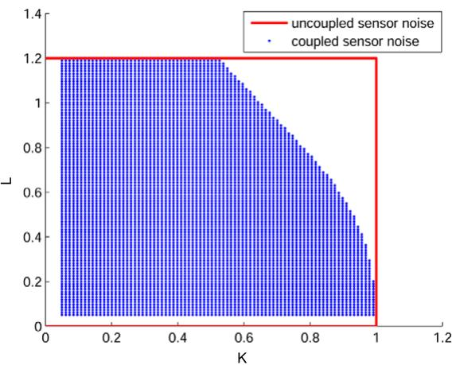

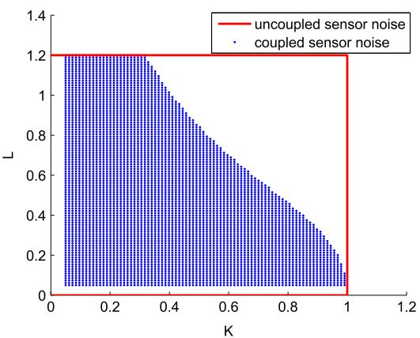  
Fig. 1. Rectangles show regions of convergence in the design space $( K , L )$ for the uncoupled problem. Shaded regions show stable gains when the sensor noise is weighted by constant c multiplied by the tracking error, for c = 1 (left) and c = 2 (right).  
Constant system parameters.

$$
\begin{array} { l } { A = 0 . 8 } \\ { b = 1 } \\ { V = 1 } \end{array}
$$

$$
\begin{array} { r } { A _ { s } = 0 } \\ { W = 1 } \end{array}
$$

the origin. The expected state evolves according to the following equation, and converges to zero if A is Hurwitz.

$$
\begin{array} { r } { \mathbf { E } [ \mathbf { x } _ { k + 1 } ] = A \mathbf { E } [ \mathbf { x } _ { k } ] + B \mathbf { E } [ w _ { k } ] + \tilde { L } \mathbf { E } [ g ( \mathbf { x } _ { k } ) v _ { k } ] } \\ { = A \mathbf { E } [ \mathbf { x } _ { k } ] . \qquad } \end{array}\tag{9}
$$

(10)

However, analysis of the covariance update equation proves more difficult.

$$
\begin{array} { r } { { \bf { X } } _ { k + 1 } = A { \bf { X } } _ { k } A ^ { T } + B W B ^ { T } + \tilde { L } \tilde { L } ^ { T } V { \bf { E } } [ g ( { \bf { x } } ) ^ { 2 } ] . } \end{array}\tag{11}
$$

The state covariance no longer evolves according to a Lyapunov equation and therefore a finite steady state solution is not guaranteed when A is Hurwitz. Although the combination of a stable controller and estimator will result in expected tracking and estimate errors converging to zero, their covariance may grow unboundedly.

The final term in the covariance update equation is ${ \bf E } [ g ( x ) ^ { 2 } ]$ which will depend on both the function g and the covariance of x. These dependencies can be examined by considering the firstorder Taylor approximation of g(x) at the equilibrium point $\mathbf { x } = 0 .$ The derivative of g at the equilibrium point will be defined as C for brevity, and since $g$ was defined as a function only of the tracking error, C has the form [0 0 c].

$$
g ( \mathbf { x } ) \approx g ( 0 ) + \left. \frac { \mathrm { d } g } { \mathrm { d } \mathbf { x } } \right| _ { \mathbf { x } = 0 } \mathbf { x }\tag{12}
$$

$$
C = \left. \frac { \mathrm { d } g } { \mathrm { d } \mathbf { x } } \right| _ { \mathbf { x } = 0 }\tag{13}
$$

$$
\mathbf { E } [ g ( \mathbf { x } ) ^ { 2 } ] \approx g ( 0 ) ^ { 2 } + C \mathbf { X } C ^ { T } .
$$

The covariance update equation using the first-order Taylor expansion has the following form.

$$
\mathbf { X } _ { k + 1 } = A \mathbf { X } _ { k } \pmb { A } ^ { T } + \tilde { L } \tilde { L } ^ { T } V C \mathbf { X } _ { k } C ^ { T } + B W \pmb { B } ^ { T } + \tilde { L } \tilde { L } ^ { T } V \pmb { g } ( 0 ) ^ { 2 } .\tag{14}
$$

The covariance matrix $X _ { k }$ is positive definite, and so the three by three matrix has six degrees of freedom. Defining $x _ { i j }$ as the element $X _ { k } ( i , j )$ , the matrix update Eq. (14) for the covariance matrix can be written as a set of linear update equations for each of the six degrees of freedom. We define $x _ { a } = [ x _ { 1 1 } x _ { 1 2 } x _ { 1 3 } ] ^ { T }$ and $x _ { n a } = [ x _ { 2 2 } x _ { 2 3 } x _ { 3 3 } ] ^ { T }$ . The linear feedback matrix governing the six independent terms of the covariance has the block lower triangular form shown.

$$
{ \left[ \begin{array} { l } { x _ { a } } \\ { x _ { n a } } \end{array} \right] } _ { k + 1 } = { \left[ \begin{array} { l l } { A _ { 1 } } & { \ 0 } \\ { A _ { 3 } } & { A _ { 2 } } \end{array} \right] } { \left[ \begin{array} { l } { x _ { a } } \\ { x _ { n a } } \end{array} \right] } _ { k } + { \tilde { B } }\tag{15}
$$

$$
A _ { 1 } = \left[ \begin{array} { c c c } { { a ^ { 2 } } } & { { 0 } } & { { 0 } } \\ { { 0 } } & { { a ( a - L ) } } & { { 0 } } \\ { { a ^ { 2 } } } & { { a K } } & { { - a K } } \end{array} \right]
$$

$$
A _ { 2 } = \left[ \begin{array} { c c c } { { ( a - L ) ^ { 2 } } } & { { 0 } } & { { c ^ { 2 } V L ^ { 2 } } } \\ { { ( a - L ) K } } & { { ( L - a ) K } } & { { 0 } } \\ { { K ^ { 2 } } } & { { - 2 K ^ { 2 } } } & { { K ^ { 2 } } } \end{array} \right]
$$

$$
A _ { 3 } = { \left[ \begin{array} { l l l } { 0 } & { \quad 0 } & { 0 } \\ { 0 } & { a ( a - L ) } & { 0 } \\ { 0 } & { \quad 0 } & { 0 } \end{array} \right] }
$$

$$
\tilde { B } = \left[ \begin{array} { c } { { b ^ { 2 } W } } \\ { { b ^ { 2 } W } } \\ { { b ^ { 2 } W } } \\ { { L ^ { 2 } g ( 0 ) ^ { 2 } V + b ^ { 2 } W } } \\ { { b ^ { 2 } W } } \\ { { b ^ { 2 } W } } \end{array} \right] .
$$

The terms $x _ { a } = [ x _ { 1 1 } x _ { 1 2 } x _ { 1 3 } ] ^ { T }$ evolve autonomously according to feedback dynamics $x _ { a , k + 1 } = A _ { 1 } x _ { a , k }$ , where the eigenvalues of $\mathbf { \dot { A } } _ { 1 }$ are $a ^ { 2 } , a ( a - L ) , \mathrm { a n d } - a K$ . Recall that the dynamics of the expectation of x, in (4), have eigenvalues a, $a - L ,$ , and K. Therefore, if K and L are chosen so that the expectation dynamics are stable, the dynamics of the covariance components $x _ { a }$ will be stable as well.

The dynamics of the covariance components $x _ { n a } = [ x _ { 2 2 } x _ { 2 3 } x _ { 3 3 } ] ^ { T }$ determine the stability of the remainder of the covariance matrix terms. Therefore, in addition to L and K satisfying the stability conditions for the expectation dynamics (4), they must also result in stable eigenvalues for $A _ { 2 }$ in order to provide stable covariance dynamics.

The system parameters given in Table 1 will be held constant while examining the range of K and L which result in stochastic stability for a system with $g ( { \bf x } ) ~ = ~ [ 0 ~ 0 ~ c ] { \bf x } + d _ { \bf \theta }$ based on an eigenvalue analysis of $A _ { 2 } .$ Fig. 1 shows the values of L and K which result in a finite steady state covariance (and therefore stochastic stability). The stable range of parameters for the uncoupled problem $( g ( \mathbf { x } ) = 0 )$ is also plotted for reference.

It is clear from the figure that the coupling between tracking error and sensor noise impacts the stability even in this simple problem, suggesting that estimation and control cannot be designed independently in active sensing tasks. The set of (K , L) pairs which are stable in the uncoupled problem and unstable in the coupled problem grows with increasing c, as shown in the plots for c = 1 and $c = 2$

## 3. Problem formulation

## 3.1. Receding horizon control

Having considered a simplified active sensing formulation, we now consider the more complex task of controlling a mobile sensor platform in order to minimize the uncertainty of the conditional estimate of an unknown state x in domain X. In the discrete time formulation, $x _ { k }$ is correlated with observation $z _ { k }$ according to the sensor model $p ( Z _ { k } | X _ { k } )$ and $x _ { k + 1 }$ is correlated with $x _ { k }$ according to the process model $p ( X _ { k + 1 } | X _ { k } )$ . The platform motion control $u _ { k }$ determines the platform state $y _ { k + 1 }$ through the platform motion model $y _ { k + 1 } ~ = ~ g ( y _ { k } , u _ { k } )$ , which thereby influences the filtering density $p ( X _ { k } | z _ { 1 } , \dots , z _ { k } )$ through the sensor model, which depends on $y _ { k } .$ The sensor model could therefore be written more explicitly as $p ( Z _ { k } | X _ { k } ; y _ { k } )$

The control objective is to reduce the expected uncertainty of the filtering density $p ( X _ { k } | z _ { 1 } , \dots , z _ { k } )$ , where the uncertainty is measured using the information entropy H.

$$
H ( p ( x ) ) = \int _ { x \in X } - p ( x ) \log p ( x ) { \mathrm { d } } x .\tag{16}
$$

Entropy is a direct measure of the uncertainty or randomness in a random variable [16]. In contrast, covariance measures the spread of a distribution about its mean, and for non-Gaussian distributions, it is not equivalent to entropy. In considering a conditional distribution $p ( X | Z )$ for which the value z of random variable Z is not yet known, the expected entropy $\mathbf { H } ( p ( X | Z ) )$ measures the expected value of the conditional entropy.

$$
\mathbf { H } ( p ( X | Z ) ) = \int _ { z \in Z } p ( z ) H ( p ( X | z ) ) \ : \mathrm { d } z .\tag{17}
$$

An optimal control is formulated to minimize the expected entropy of the filtering density summed over a receding horizon. The summation represents a desire to minimize the time-averaged uncertainty, and a receding horizon is chosen as a computationally feasible approximation to the infinite horizon problem. The sensor, platform and process models appear as constraints in the optimization, which selects an optimal control sequence $u _ { k } , \ldots , u _ { k + N } . \mathrm { A t }$ each step k, the optimization is recalculated and the first control $u _ { k }$ is applied.

$$
\begin{array} { l } { \displaystyle \operatorname* { m i n } _ { u _ { k } , \ldots , u _ { k + N } } \quad \displaystyle \sum _ { j = 1 } ^ { N } \mathbf { H } ( p ( X _ { k + j } | Z _ { 1 } , \ldots , Z _ { k + j } ) ) } \\ { \mathrm { s u b j e c t ~ t o } } \\ { y _ { j + 1 } = g ( y _ { j } , u _ { j } ) } \\ { x _ { j + 1 } \sim p ( X _ { j + 1 } | X _ { j } ) } \\ { z _ { j } \sim p ( Z _ { j } | X _ { j } ; y _ { j } ) . } \end{array}\tag{18}
$$

## 3.2. Filtering

The conditional distribution $p ( X _ { k } | z _ { 1 } , \dots , z _ { k } )$ is calculated from a prior belief and a series of observations using one of the many implementations of recursive Bayesian filtering. An optimal recursive Bayes estimator is defined by the time prediction equation (19) and the measurement update equation (20).

$$
p ( x _ { k + 1 } | z _ { 1 } , \dots , z _ { k } ) = \int _ { x _ { k } } p ( x _ { k + 1 } | x _ { k } ) p ( x _ { k } | z _ { 1 } , \dots , z _ { k } ) \mathrm { d } x _ { k }\tag{19}
$$

$$
p ( x _ { k } | z _ { k } ) = { \frac { p ( z _ { k } | x _ { k } ) p ( x _ { k } | z _ { 1 } , \dots , z _ { k - 1 } ) } { p ( z _ { k } | z _ { 1 } , \dots , z _ { k - 1 } ) } } .\tag{20}
$$

When these can be implemented exactly, the result is the conditional density $p ( X _ { k } | z _ { 1 } , \dots , z _ { k } )$ . However, approximate methods are often required in order to incorporate non-linear models and non-Gaussian distributions.

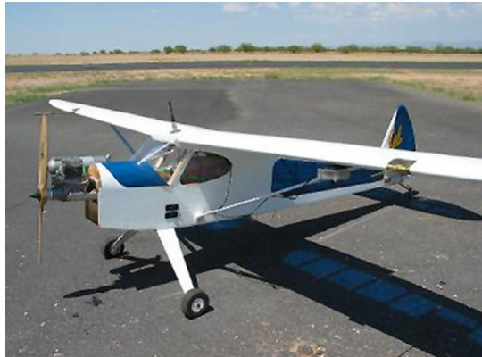  
Fig. 2. Sig Rascal UAV.

The particle filter has been successfully applied to tracking applications [17,18]; it allows non-linear sensor and motion models and can represent arbitrary distributions. In a particle filter, a distribution $p ( X )$ is represented by a set of N weighted Dirac delta functions (particles) at locations {xi} in the same domain as x: (21).

$$
p ( x ) = \sum _ { i = 1 } ^ { N } w ^ { i } \delta ( x - x ^ { i } ) .\tag{21}
$$

The measurement update equation (20) is applied directly to the particle set, and has the effect of changing the particle weights.

$$
w _ { k } ^ { i } = \frac { w _ { k - 1 } ^ { i } } { \displaystyle \sum _ { j = 1 } ^ { N } p ( z _ { k } | x _ { k } ^ { j } ) } p ( z _ { k } | x _ { k } ^ { i } ) .\tag{22}
$$

Applying the prediction equation (19) to the particle set results in a sum of conditional densities. Random samples are drawn from the conditional densities to form the particle set at time k + 1.

$$
p ( x _ { k + 1 } | z _ { 1 } , \dots , z _ { k } ) = \sum _ { i = 1 } ^ { N } w _ { k } ^ { i } p ( x _ { k + 1 } | x _ { k } ^ { i } ) .\tag{23}
$$

For process models of the form $x _ { k + 1 } = f ( x _ { k } ) + n _ { k }$ , where $n _ { k }$ is random noise with a known distribution, the new state $x _ { k + 1 } ^ { i }$ of a particle i can be predicted by passing the current state $x _ { k } ^ { i }$ through f and adding a random sample from the distribution of $\ddot { n _ { k } } ( 2 4 )$

$$
\boldsymbol { x } _ { k + 1 } ^ { i } = \boldsymbol { f } ( \boldsymbol { x } _ { k } ^ { i } ) + \boldsymbol { n } _ { k } .\tag{24}
$$

The particle filter also includes a resampling step which does not follow directly from the optimal Bayes filter, but is required to avoid particle set degeneracy. Many variations of particle filtering exist, differing largely by how they address resampling and the prediction step. The Sampling Importance Resampling (SIR) filter [19], in which the particle set is resampled at each filter iteration, is applied in this work.

## 3.3. Experimental platform

This work was conducted at the Berkeley Center for Collaborative Control of Unmanned Vehicles and tested using data collected from a Sig Rascal UAV, shown in Fig. 2. A variety of single and multiple sensor missions have been demonstrated by the authors using this platform [20,21]. Low-level control is provided by a Piccolo autopilot [22], allowing the stabilized UAV to be represented by a standard kinematic model based on constant velocity V and heading angle ψ with discrete time step ∆. The constant altitude model is controlled by a turn rate command ψ˙ with magnitude bounded by $u _ { \mathrm { m a x } } .$ . The roll angle is modeled based on the coordinated turn assumption that the lift in the vertical direction must cancel the acceleration due to gravity $( g )$ . The model is in local UAV coordinates $y _ { x }$ (forward) and $y _ { y }$ (right).

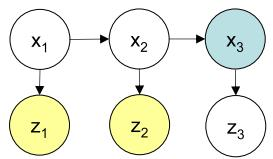  
Fig. 3. Hidden Markov model for target state and observations. Node $x _ { 3 }$ is marginalized to calculate p(Z |z , z ) after z and z are observed.

$$
\begin{array} { r l } & { y _ { x , k + 1 } = y _ { x , k } + \displaystyle \frac { V } { \dot { \psi } } s \sin ( \varDelta \dot { \psi } ) } \\ & { y _ { y , k + 1 } = y _ { y , k } + \displaystyle \frac { V } { \dot { \psi } } ( 1 - \cos ( \varDelta \dot { \psi } ) ) } \\ & { \phi = - \arctan \left( \displaystyle \frac { V \dot { \psi } } { g } \right) } \\ & { \psi _ { k + 1 } = \psi _ { k } + \dot { \psi } \varDelta , ~ | \dot { \psi } | \leq u _ { \mathrm { m a x } } . } \end{array}\tag{25}
$$

## 4. Computational techniques for entropy prediction

Having formulated the control as a receding horizon entropy minimization and selected an SIR particle filter for the estimation algorithm, a technique is required to predict the expected filtering density entropy which results from application of a control sequence.

In the receding horizon cost, calculation of the expectation over $Z _ { k + 1 } , \ldots , Z _ { i }$ is limited by the lack of analytical expression for the joint distribution $p ( Z _ { k + 1 } , \ldots , Z _ { i } | z _ { 1 } , \ldots , z _ { k } )$ . One could numerically integrate over the domain $Z _ { k }$ to calculate the expectation over a single observation, but the cost of this method would grow exponentially with the length of the observation sequence. It is inefficient because large computational effort may be devoted to calculation in areas of low probability.

Instead, we approximate the expectation by drawing random samples from the distribution $p ( Z _ { k + 1 } , \ldots , Z _ { i } | z _ { 1 } , \ldots , z _ { k } )$ and replacing the expectation with the sample mean. A technique is then required to calculate the entropy of the conditional distribution resulting from a single sample.

## 4.1. Expected entropy by random sampling

Each expected entropy term $\mathbf { H } ( p ( X _ { i } | Z _ { 1 } , \dots , Z _ { i } ) )$ in the cost function will be replaced by a sample mean based on random samples from $p ( Z _ { k + 1 } , \ldots , Z _ { i } | z _ { 1 } , \ldots , z _ { k } )$ . This is the distribution of future observations (running from the present until time i) conditioned on the observations which have already occurred. The sampling procedure will make use of the hidden Markov structure shown in $\mathrm { F i g . } \ 3 ,$ where state $x _ { k + 1 }$ is conditioned only on state $x _ { k }$ and observation $z _ { k }$ is conditioned only on state $x _ { k } . ~ \mathsf { A }$ single sample from $p ( Z _ { k + 1 } , \ldots , Z _ { i } | z _ { 1 } , \ldots , z _ { k } )$ is generated based on the chain rule by first drawing a sample $\tilde { z } _ { k + 1 } ^ { s }$ from $p ( Z _ { k + 1 } | z _ { 1 } , \dots , z _ { k } )$ followed by a sample $\tilde { z } _ { k + 2 } ^ { s }$ from $p ( Z _ { k + 2 } | \mathcal { \bar { z } } _ { 1 } , \dots , z _ { k } , \mathcal { \tilde { z } } _ { k + 1 } ^ { s } )$ , and so on. The hidden Markov structure shows that the unknown state x must be marginalized at each step in the sample generation.

$$
p ( Z _ { k + 1 } , \ldots , Z _ { i } | z _ { 1 } , \ldots , z _ { k } )
$$

$$
= p ( Z _ { k + 1 } | z _ { 1 } , \dots , z _ { k } ) \dots p ( Z _ { i } | z _ { 1 } , \dots , Z _ { i - 1 } )\tag{26}
$$

$$
p ( Z _ { i } | z _ { 1 } , \dots , z _ { i - 1 } ) = \int _ { X _ { i } } p ( Z _ { i } | x _ { i } ) \quad p ( x _ { i } | z _ { 1 } , \dots , z _ { i - 1 } ) \mathrm { d } x _ { i } .\tag{27}
$$

The conditional state estimate $p ( X _ { i } | z _ { 1 } , \dots , z _ { i - 1 } )$ is a filtering density conditioned on the preceding sampled observations. Therefore, the sample from the observation sequence is drawn by simulation of the estimation process. Algorithm 1 draws a single random sample from $p ( Z _ { k + 1 } , \ldots , Z _ { k + T } | z _ { 1 } , \ldots , z _ { k } )$ and calculates the associated sample cost $J _ { k } ^ { s } ,$ which is the contribution of that sample to the cost $J _ { k } .$

J ≈ Xk+T 1N XNs H(p(X |z˜s , . . . , z˜s))   
i=k+1 =   
1 N   
≈ N X J sk (28)   
=1   
$J _ { k } ^ { s } = \sum _ { i = k + 1 } ^ { k + T } H ( p ( X _ { i } | \tilde { z } _ { 1 } ^ { s } , \dots , \tilde { z } _ { i } ^ { s } ) ) .$   
This algorithm is not specific to a particular filtering implemen  
tation, as long as the recursive Bayes filter structure of predictions   
and updates is present.

Algorithm 1 Sample generation and cost calculation from   
observation sequence of length T for any recursive Bayes filter   
variant   
1: Begin with filtering density at time k, $\overline { { p ( X _ { k } | z _ { 1 } , \ldots , z _ { k } ) } }$   
2: $i = 1$   
3: while $i \leq T$ do   
4: Apply time prediction equation.   
Result is $p ( \bar { X } _ { k + i } | z _ { 1 } , \dots , \bar { z } _ { k + i - 1 } ^ { s } ) .$   
5: Sample $\tilde { z } _ { k + i } ^ { s }$ from $p ( Z _ { k + i } | \tilde { z } _ { k + 1 } ^ { s } , \dots , \tilde { z } _ { k + i - 1 } ^ { s } )$ using (26).   
6: Update filtering density based on sample observation   
$\tilde { z } _ { k + i } ^ { s }$ using measurement update equation. Result is   
$p ( \ddot { X } _ { k + i } | z _ { 1 } , \ldots , \tilde { z } _ { k + i } ^ { s } ) .$   
7: Calculate entropy from updated filtering density. Result is   
$H ( p ( X _ { k + i } | z _ { 1 } , \dots , \tilde { z } _ { k + i } ^ { s } ) ) .$   
8: $i = i + 1$   
9: end while   
10: Sample from observation sequence is $[ \tilde { z } _ { k + 1 } ^ { s } , \dots , \tilde { z } _ { k + T } ^ { s } ]$   
11: Sample cost is $\begin{array} { r c l } { J _ { k _ { \mathrm { ~ s ~ } } } ^ { s } } & { = } & { \bar { H ( } p ( X _ { k + 1 } | z _ { 1 } , \dots , \tilde { z } _ { k + 1 } ^ { s } ) { \bar { ) } } ^ { \scriptscriptstyle 1 } + \ \dots + } \end{array}$   
$H ( p ( X _ { k + T } | z _ { 1 } , \dots , \tilde { { z } } _ { k + T } ^ { s } ) )$

The two challenges in Algorithm 1 are the entropy calculation in line 7 and drawing the sample in line 5. A sample is required from $p ( Z _ { k + i } | z _ { k } , \dots , z _ { k + i - 1 } )$ , which is written in terms of the sensor model $p ( Z _ { k } | X _ { k } )$ and the filtering density conditioned on the previous observations. When a particle filter has been selected as the estimation algorithm, this sampling is straightforward. Substituting the particle set representation (21) into the marginalization in (26) replaces an integral over the target state domain with a summation over N particles. The particle locations and weights reflect all preceding observations, including previously drawn samples, which have been incorporated into the filtering density.

$$
p ( z _ { k } | z _ { 1 } , \dots , z _ { k - 1 } ) = \sum _ { i = 1 } ^ { N } w _ { k } ^ { i } p ( z _ { k } | x _ { k } ^ { i } ) .\tag{29}
$$

Many sensor models can be written in the form $p ( z | x ) \ =$ $\mathcal { N } ( z ; \mu ( x ) , \varSigma ( x ) ) \colon \mathsf { a }$ normal distribution with mean and covariance as functions of $x .$ In this case, the distribution $p ( Z _ { k } | z _ { 1 } , \dots ,$ $z _ { k - 1 } )$ is a Gaussian mixture model, for which random sampling techniques are well known.

$$
p ( \boldsymbol { z } _ { k } | \boldsymbol { z } _ { 1 } , \dots , \boldsymbol { z } _ { k - 1 } ) = \sum _ { i = 1 } ^ { N } w _ { k } ^ { i } \mathcal { N } ( \boldsymbol { z } _ { k } ; \mu ( \boldsymbol { x } _ { k } ^ { i } ) , \boldsymbol { \Sigma } ( \boldsymbol { x } _ { k } ^ { i } ) ) .\tag{30}
$$

Having drawn N samples from $p ( Z _ { k + 1 } , \ldots , Z _ { k + T } | z _ { 1 } , \ldots , z _ { k } )$ and calculated the resulting entropies, the result is N samples from the distribution of $\cdot \sum \bar { H ( p ( X _ { i } | Z _ { 1 } , \dots , Z _ { i } ) ) }$ . The expectation ${ } _ { , \mu }$ of the true distribution has been defined as the cost function $J _ { k } .$ . Under independent identically distributed sampling conditions, it is well known that the sample mean µ is an unbiased estimate of√ $\dot { \mu }$ with standard deviation $\hat { \sigma } _ { N } = \sigma _ { N } / \sqrt { N _ { s } - 1 }$ , where $\sigma _ { N }$ is the standard deviation of the sample set. A similar analysis can be used to predict 3σ bounds for the realized conditional entropy relative, which do not decrease with the number of samples. Bounds on both the sample expectation and the realization are calculated by these methods in Sections 5 and 6.

The 3σ bound for the sampled cost estimate is used in order to gage the accuracy of the optimization. If the error bound is large compared to the cost difference between control choices, then the accuracy of the sampling methods is not sufficient to detect the optimal control. If a set of candidate controls {ui} are to be evaluated in order to select the minimizer for $J ( u ) , \hat { \sigma } _ { N }$ should be small compared to the differences between the costs $\{ J ( u ^ { i } ) \}$ . Since this set of costs is the result of the sampling procedure, an iterative process may be required to increase the number of samples until the desired accuracy is reached.

## 4.2. Entropy computation for particle filter

As described in the previous section, Algorithm 1 generates a sample from an observation sequence assuming that a recursive filtering algorithm has been selected. The algorithm is independent of the choice of filter, but implementation of the individual calculations will obviously vary. This section presents an efficient technique for entropy calculation from a particle filter.

In the strictest sense, the entropy of a continuous distribution represented by a particle set is −∞ regardless of the particle weights or locations. This can be understood by considering the particle set as the limiting case of a Gaussian mixture model in which the component covariances approach zero. Therefore, the desire in the control setting is to form an alternate continuous distribution which corresponds to the particle set but results in a more useful entropy measurement.

It is common to form a differentiable PDF from a particle set by Gaussian smoothing, in which the particle PDF is convolved with a Gaussian kernel [23]. Gaussian smoothing can be used to calculate information measures on a particle set by first forming a differentiable distribution and then calculating the information measure (such as entropy or mutual information) using numerical integration. For Gaussian motion models, the Gaussian smoothing method may produce a result similar to the one developed in the remainder of this section. However, in Gaussian smoothing the covariance of the Gaussian kernel must be selected as a design parameter.

An alternative technique for entropy calculation from a particle set has been developed by Orguner [24] and does not require tuning of any design parameters. This calculation applies the entropy definition (16) directly to the particle set, but then makes a substitution based on the Bayes rule for the term log p(x). The entropy calculation converges to less than one per cent error (compared with the theoretical Kalman filter solution) for greater than 500 particles in a one-dimensional problem. However, in a two-dimensional problem with 2000 particles, the RMS error using this method is seven per cent, compared to two per cent using the technique developed below.

This technique follows directly from the optimal Bayes filter and thereby avoids the need to tune the choice of smoothing parameters. Instead, a continuous PDF at time k is realized at a computational cost similar to Gaussian smoothing by applying optimal Bayes updates to the particle set at time $k - 1$

From the particle set $\{ w _ { k - 1 } ^ { i } , x _ { k - 1 } ^ { i } \}$ , the prediction density $p ( X _ { k } | z _ { 1 } , \dots , z _ { k - 1 } )$ is calculated using the Bayes filter prediction equation (19), where the integral over $X _ { k - 1 }$ results in a sum over particles due to the Dirac delta functions.

$$
p ( X _ { k } | z _ { 1 } , \dots , z _ { k - 1 } ) = \sum _ { i = 1 } ^ { N } w _ { k - 1 } ^ { i } p ( X _ { k } | x _ { k - 1 } ^ { i } ) .\tag{31}
$$

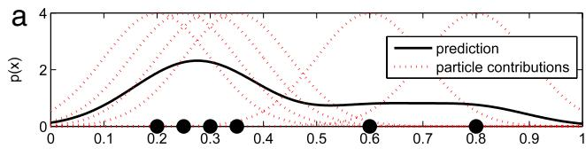

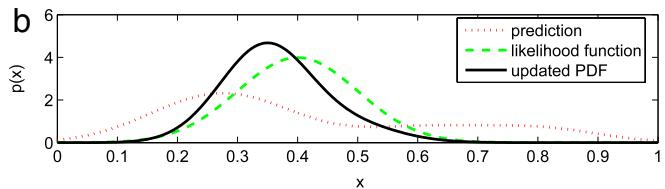

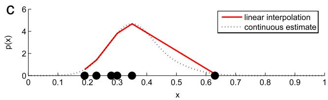  
Fig. 4. Illustrative example for the derivation of a piecewise linear approximation of a PDF represented by a particle set. Unnormalized PDFs are shown.

The most recent observation $z _ { k }$ is then incorporated using the recursive form of the Bayes rule (20).

$$
p ( X _ { k } | z _ { 1 } , \dots , z _ { k } ) = \frac { p ( z _ { k } | X _ { k } ) } { p ( z _ { k } | z _ { 1 } , \dots , z _ { k - 1 } ) } \sum _ { i = 1 } ^ { N } w _ { k - 1 } ^ { i } p ( X _ { k } | x _ { k - 1 } ^ { i } ) .\tag{32}
$$

Entropy calculation from this PDF would require numerical integration over the domain $X _ { k } .$ The cost of quadrature grows quickly with the dimension of the domain and may devote large computational effort to integration over areas with small contribution. Instead, a piecewise linear approximation of (32) over appropriately chosen regions could allow entropy calculation as a sum of analytical contributions from each region.

In order to accurately represent the continuous distribution given by (32) at low computational cost, the piecewise linear elements must be strategically placed. The particle filter places particles in areas of high probability, providing more detailed approximation in areas of higher contribution to the entropy calculation. Taking advantage of this, we choose the particle locations $\{ x _ { k } ^ { i } \}$ to define the vertices of regions for a piecewise linear approximation. The entropy calculation will be performed on the piecewise linear function f (x) defined by interpolation between points $\{ x _ { k } ^ { i } \}$ with values $f ( x _ { k } ^ { i } )$ ).

$$
f ( x _ { k } ^ { i } ) = p ( z _ { k } | x _ { k } ^ { i } ) \sum _ { j = 1 } ^ { N } w _ { k - 1 } ^ { j } p ( x _ { k } ^ { i } | x _ { k - 1 } ^ { j } ) .\tag{33}
$$

The constant $p ( z _ { k } | z _ { 1 } , \dots , z _ { k - 1 } )$ is calculated to normalize $f ( x )$ to form a valid PDF. The entropy contribution from each region is now an analytical function of the vertex locations and their function values $f ( x ^ { i } )$ . The entropy contribution ∆h from a triangular region (with $\boldsymbol { x } ~ \in \ \mathbf { R } ^ { 2 } )$ with area a and unique vertex values $f _ { 1 } , f _ { 2 } , f _ { 3 }$ is shown, and special cases for non-unique vertex values can be easily derived.

$$
\begin{array} { l } { { \varDelta h = \displaystyle \frac { a } { 3 } \left\{ - f _ { 3 } ^ { 3 } \frac { \frac { 5 } { 6 } - \log f _ { 3 } } { ( f _ { 2 } - f _ { 3 } ) ( f 1 - f _ { 3 } ) } \right. } } \\ { { \left. ~ + f _ { 2 } ^ { 3 } \frac { \frac { 5 } { 6 } - \log f _ { 2 } } { ( f _ { 1 } - f _ { 2 } ) ( f _ { 2 } - f _ { 3 } ) } - f _ { 1 } ^ { 3 } \frac { \frac { 5 } { 6 } - \log f _ { 1 } } { ( f _ { 1 } - f _ { 2 } ) ( f _ { 1 } - f _ { 3 } ) } \right\} . } } \end{array}\tag{34}
$$

Fig. 4 illustrates an example formulation of a piecewise linear approximation of the filtering density beginning from the particle set representation of $p ( X _ { k - 1 } | z _ { 1 } , \dots , z _ { k - 1 } )$ . An unrealistically small number of particles is shown for clarity. In subfigure (a), the motion model centered at each particle is summed to form the prediction $p ( X _ { k } | z _ { 1 } , \dots , z _ { k - 1 } )$ . In subfigure (b), the prediction distribution is multiplied by the likelihood function $p ( z _ { k } | X _ { k } )$ and normalized to form the updated distribution. In subfigure (c), the updated distribution is evaluated at each of the new particle locations, and the piecewise linear function is formed by interpolation.

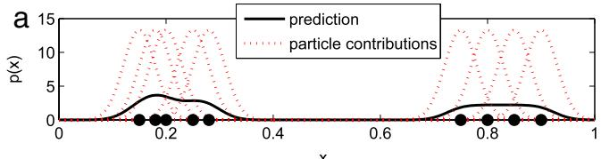

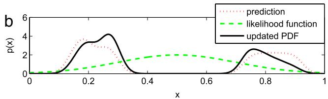

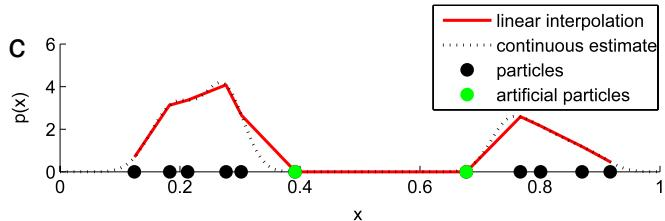  
Fig. 5. Example for the derivation of a piecewise linear approximation of a PDF represented by a particle set, with artificial particles used to force zero value in areas of low particle density. Unnormalized PDFs are shown.

A final detail in defining the interpolated function is required to represent areas of low particle density. Linear interpolation between particles which are far apart may not be desired. For example, in a very bimodal distribution, there may be no probability mass in the area between the two modes. Accordingly, the interpolated function should be driven to zero in locations which are far from any particle, in a sense defined by the motion model. The predicted distribution consists of a sum over the particles of the target motion model centered at each particle location. The target state transition probability $p ( X _ { k } | X _ { k - 1 } ^ { i } )$ will always tend toward zero with increasing distance $\| x _ { k } - x _ { k - 1 } ^ { i } \|$ k for a target with bounded velocity. Therefore, a radius r(x) can be selected such that, if $\lvert \lvert x _ { k } - x _ { k - 1 } ^ { i } \rvert \rvert > r ( x _ { k - 1 } ^ { i } )$ ∀i, then $p ( x _ { k } | x _ { k - 1 } ) <$ . For a Gaussian motion model, this radius can be chosen to correspond to the 3σ bound. This is implemented in the linear interpolation by placing virtual particles with $f ( x ^ { i } ) = 0$ at distance $r ( x ^ { i } )$ from the true particles, as shown in Fig. 5.

Figs. 4 and 5 show the steps for calculating the entropy from a distribution on a scalar domain. The particles are arranged in order of increasing xi and the definition of regions for linear interpolation is trivial. When $X ~ \subset ~ { \mathbb { R } } ^ { N }$ the particle locations $\{ x ^ { i } \}$ are vectors, and partitioning the domain is no longer trivial. The regions between particles are defined by a Delaunay triangulation [25] on the particle locations, which produces a set of simplices with a particle at each vertex and none on the interior. Fig. 6 shows the Delaunay triangulation and linear surface interpolation for a few particles with $\boldsymbol { x } \in \mathbf { R } ^ { 2 }$ . The probability density p(x) forms the third dimension.

This technique for entropy calculation is applied for particle filtering of a state in one or two dimensions. Mathematically, the procedure of forming regions by Delaunay triangulation and then forming a piecewise linear PDF can be extended to arbitrary dimensionality. However, the computational cost of this procedure grows quickly with the dimension of the state, and so this method becomes less practical. Although it may be appropriate for extension to a three-dimensional tracking state, other methods should be considered for high-dimensional problems.

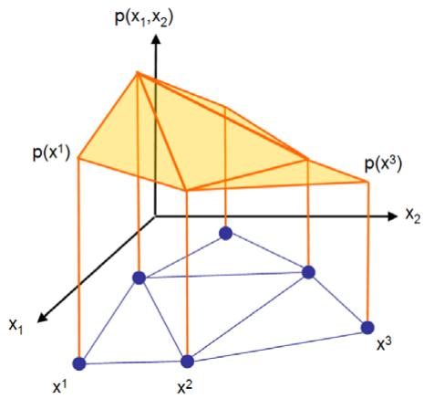  
Fig. 6. Linear interpolation of a PDF on $( x _ { 1 } , x _ { 2 } ) .$ . Linear interpolation regions are shown in the X plane, and the piecewise linear PDF is shaded.

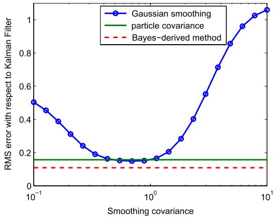

Fig. 7. Root mean square error of the Gaussian smoothing calculation with respect to the steady state Kalman filter entropy of 5.05. The error under the proposed Bayes filter method is shown for reference, as well as the entropy calculated from the particle filter covariance. All particle filter calculations are from the same filter with 2000 particles.  
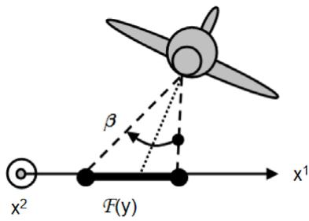  
Fig. 8. Sensor footprint.

## 4.3. Comparison to Gaussian smoothing

A simulation based on Kalman filtering demonstrates that the proposed technique for calculating the entropy based on the recursive Bayes filter equations is more accurate than Gaussian smoothing. The Kalman filter provides an exact implementation of the optimal Bayes filtering equations for a system with linear dynamics and Gaussian uncertainty, resulting in an analytical expression for the estimate entropy throughout the simulation.

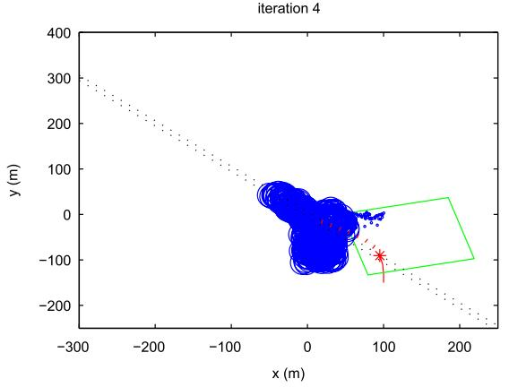

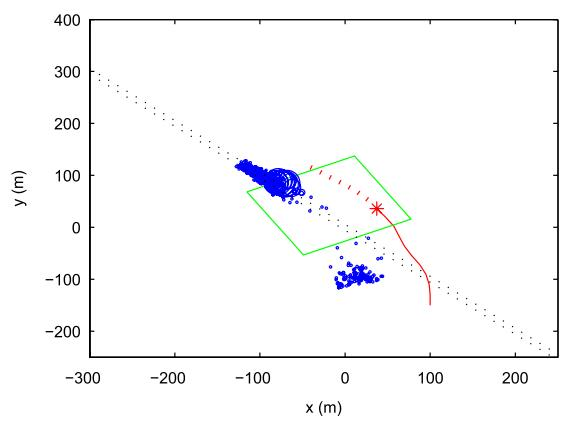

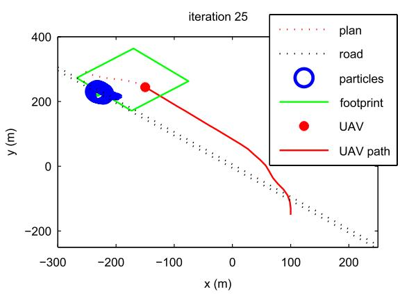

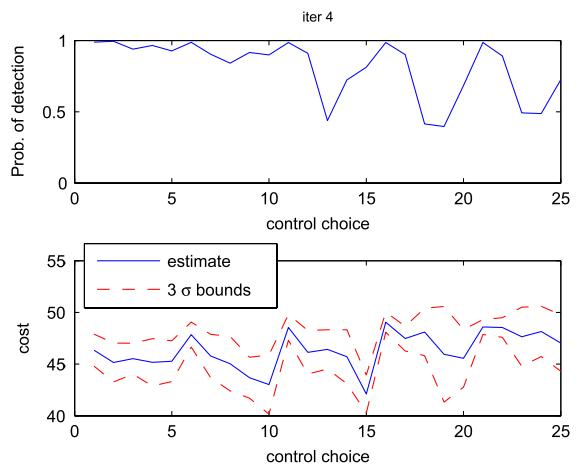  
Fig. 9. UAV position, sensor footprint, and particle filter estimate throughout simulation under 6 s receding horizon control. The lower right plot shows predicted cost versus control choice at iteration 4. For each of 25 candidate controls, both the information-theoretic cost and the probability of detection are compared.

$$
x _ { k + 1 } = x _ { k } + w _ { m }\tag{35}
$$

$$
\begin{array} { r l } & { \quad \cdots \quad \cdots } \\ & { \quad z _ { k } = x _ { k } + w _ { s } } \\ & { \quad p ( x _ { 0 } ) \sim \mathcal { N } \left( \left[ 0 _ { 0 } \right] , \left[ \begin{array} { c c } { 1 5 } & { 0 } \\ { 0 } & { 1 5 } \end{array} \right] \right) , \quad w _ { m } \sim \mathcal { N } \left( \left[ 0 _ { 0 } ^ { 0 } \right] \left[ \begin{array} { c c } { 5 } & { 0 } \\ { 0 } & { 5 } \end{array} \right] \right) } \\ & { \quad w _ { s } \sim \mathcal { N } \left( \left[ 0 _ { 0 } ^ { 0 } \right] , \left[ \begin{array} { c c } { 2 5 } & { 0 } \\ { 0 } & { 2 5 } \end{array} \right] \right) . } \end{array}
$$

During a single simulation of 20 time steps, the entropy is calculated at each step using four different techniques. The entropy calculated from the Kalman filter covariance Z by $H =$ log $\sqrt { ( 2 \pi e ) ^ { 2 } | Z | } )$ is regarded as truth. Then, the covariance $Z _ { p }$ of the particle distribution is used to calculate the entropy of a corresponding Gaussian distribution, again using $H \quad =$ log $\sqrt { ( 2 \pi e ) ^ { 2 } | Z _ { p } | }$ . This method should converge to the Kalman filter result as the number of particle approaches infinity. The error in this method represents how much the particle distribution differs from the ideal Gaussian distribution provided by the Kalman filter.

Finally, the entropy is calculated by linear interpolation between particle locations, where $p ( { \boldsymbol { x } } ^ { i } )$ at each particle i comes from either Gaussian smoothing or the method developed in the previous section. A range of values are selected for the covariance of the Gaussian smoothing kernel. In practice, the covariance of the Gaussian smoothing kernel is usually selected according to a heuristic, and may require many iterations in order to achieve the desired result. Fig. 7 shows the effect of Gaussian smoothing covariance on the filtering error, along with the performance of the two other methods for reference.

In typical Gaussian smoothing implementations, the entropy is calculated by numerical integration over the state space. Direct numerical integration is not used here because it is far more computationally expensive than the technique based on triangulation between particles, and therefore not an appropriate solution for the receding horizon control computation.

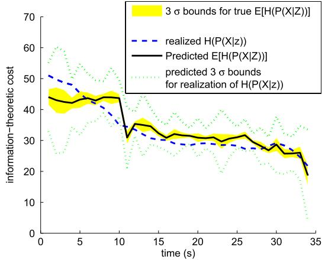  
Fig. 10. Predicted cost compared to conditional entropy, with estimated 3σ bounds, under receding horizon control.

The proposed technique based on the Bayes filter equations produces a more accurate entropy measurement than the optimal choice of smoothing covariance, and does not require a search procedure to choose the design parameters.

## 5. Receding horizon control simulation

The techniques developed in Section 4 are now applied for receding horizon control of a fixed-wing UAV modeled to correspond to the Sig Rascal experimental platform.

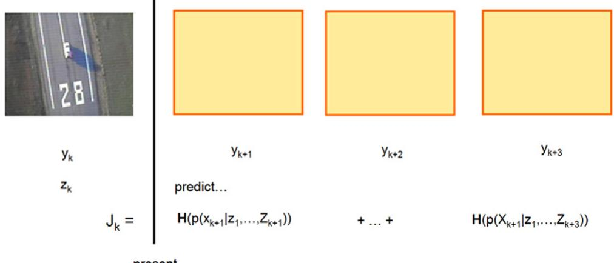  
Fig. 11. Diagram of entropy prediction based on collected video. The cost at time k is predicted based on the future UAV states, which are available, and predictions of th future observations, which are not.

Table 2 Simulation parameters.
<table><tr><td>∑ 5</td><td></td><td>V</td><td>20 m/s</td></tr><tr><td> $u _ { \mathrm { m a x } }$ </td><td> $0 . 2 ~ \mathrm { r } / s$ </td><td> $g 9 . 8$ </td><td> $\mathrm { m } / { \mathsf { s } } ^ { 2 }$ </td></tr><tr><td> $\varDelta$ </td><td>1s</td><td> $P _ { m }$ </td><td>0.1</td></tr><tr><td> $\beta$ </td><td>48 deg.</td><td>σ</td><td>2.5 deg.</td></tr><tr><td> $\mathsf { U A V }$  altitude</td><td>150 m</td><td>no. particles</td><td>500</td></tr><tr><td> $V _ { n o m }$ </td><td>15 m/s</td><td></td><td></td></tr></table>

## 5.1. Sensor model

The bearing-only sensor model (36) approximates monocular vision based on a noisy measurement of the bearing angle $\theta ( x , y )$ from the UAV to the target. A sensor footprint $\mathcal { F } ( y )$ is defined by the UAV state y as shown in Fig. 8, modeling a fixed downwardlooking camera with limited field of view angle $\beta .$

The sensor model is provided in the form of a joint distribution of z and x. The model must include the case where $z ~ = ~ \emptyset$ (no detection) and the case where $z \in \mathrm { ~ \bf ~ R ~ }$ is a noisy bearing measurement. The dependence on x also must be divided into the case where $\mathfrak { \iota } \in \mathcal { F } ( y _ { k } ) \ \mathrm { o r } \ x \ \notin \ \mathcal { F } ( y _ { k } )$ . For example, $p ( z = \varnothing | x \in$ $\mathcal { F } ( y _ { k } ) )$ is the probability that the target is not detected although it lies within the sensor footprint.

$$
\begin{array} { r l } & { p ( z = \emptyset | x ) = 1 \quad \forall x \notin \mathcal { F } ( y ) } \\ & { p ( z = \emptyset | x ) = P _ { m } \quad \forall x \in \mathcal { F } ( y ) } \\ & { p ( z \in \mathbf { R } | x ) = 0 \quad \forall x \notin \mathcal { F } ( y ) } \\ & { p ( z \in \mathbf { R } | x ) = ( 1 - P _ { m } ) \mathcal { N } ( z ; \theta ( x , y ) , \sigma ^ { 2 } ) \quad \forall x \in \mathcal { F } ( y ) . } \end{array}\tag{36}
$$

This model can easily be extended to include the possibility of false detections. The various model constants for the UAV (modeled as in Section 3.3 and sensor are given in Table 2.

## 5.2. Target motion model

A particle filter is implemented to track a target with terrain dependent motion. When the target is on a road it has a known nominal velocity $V _ { n o m }$ parallel to the road in addition to random Gaussian motion with covariance Σ. When the target is not on a road, $V _ { n o m } = 0$ . This target motion corresponds to the following model.

p(x0) = uniform over rectangle

$$
p ( x _ { k + 1 } | x _ { k } ) = \mathcal { N } ( x _ { k + 1 } ; x _ { k } + V _ { n o m } \varDelta , \varSigma ) .\tag{37}
$$

## 5.3. Tracking with terrain-dependent motion

The information-theoretic RHC formulated in Section 3 is applied to track a target which may be moving along a road. The optimization is approximated by enumerating a set of candidate controls and using the techniques developed in Section 4 to predict the cost of each. If all candidate controls result in a very low probability of detecting the target (less than 0.1), the control which maximizes the probability of detection is applied. The maximum probability of detection control has been shown to nearly solve the minimum entropy problem when the probability of detection is low [26].

The first three plots of Fig. 9 show the UAV path, sensor footprint, and particle filter estimate at various times in the simulation. The predicted UAV trajectory resulting from the selected control sequence (a 6 s plan) is also shown.

The lower right plot of Fig. 9 shows the cost predictions used to select the optimal control at iteration 4. For each of 25 candidate control sequences, the probability of detection and the expected information-theoretic cost are calculated. Probability of detection is clearly not a sufficient metric because 6 of the 25 candidate controls predict certain detection at least once through the control horizon. At iteration 4, the target position is still quite uncertain, and therefore so is the distribution of observations. As a result, the 3σ bounds for the cost estimate are significant compared to the variation between one control and another. In this case, it would have been advantageous to draw more observation samples in order to more reliably choose the optimal control.

Fig. 10 shows the predicted and observed information theoretic costs. Due to the receding horizon of 6 s, the realized cost is a sum (over 6 s) of the filtering density entropy. Therefore, the realized cost begins to decrease at 5 s due to detection of the target at 11 s. The expected entropy prediction obviously cannot account for this detection before it occurs. The predicted cost before 11 s is dominated by the assumption of continued failure to detect the target. As the probability of detecting the target grows, the sampling procedure will begin to draw detection samples, and so the predicted entropy decreases slightly. This trend would be more detectable by drawing a larger number of sample observations.

## 6. Flight experiment

Video acquired from a Sig Rascal UAV is post-processed to show the extension of the techniques developed in Section 4 to an experimental system. This experiment demonstrates the ability to predict conditional entropy due to future observations, given the future UAV state.

At time k, the filtering density $p ( x _ { k } | z _ { 1 } , \dots , z _ { k } )$ is available. The future UAV states $y _ { k + 1 } , \ldots , y _ { k + N }$ are available from logged data. They could be equivalently generated (with some uncertainty) by applying a candidate control sequence $u _ { k } , \ldots , u _ { k + N - 1 }$ to the UAV motion model. Given the future UAV trajectory, the entropy predicting techniques from Section 4 are used to predict the expected entropy of the filtering density conditioned on the future observations $z _ { k + 1 } , \ldots , z _ { k + N }$ . Each observation corresponds to a frame of video which is not yet available. The result is a prediction of the cost $J _ { k } ,$ , which is a sum of expected entropy terms, as shown in Fig. 11.

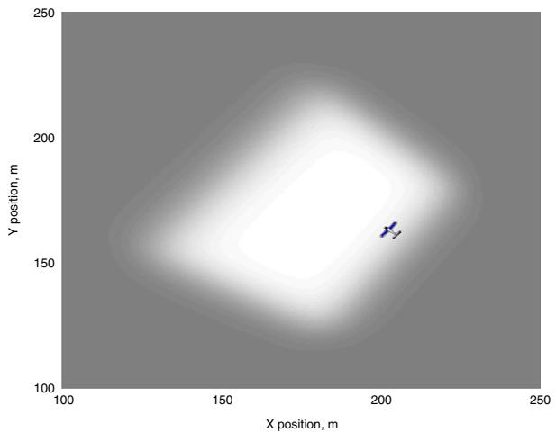  
Fig. 12. An example of a no-detect likelihood function. Dark areas indicate values close to 1, whereas the lighter areas indicate values closer to zero.

After the video frames up to time k + N are incorporated into the particle filter, the conditional entropy of the filtering density is available. The realized cost for time k depends on the particular sequence of observations up to time k+N. The desired outcome for this experiment is that the realized cost lies within the uncertainty bounds of the prediction.

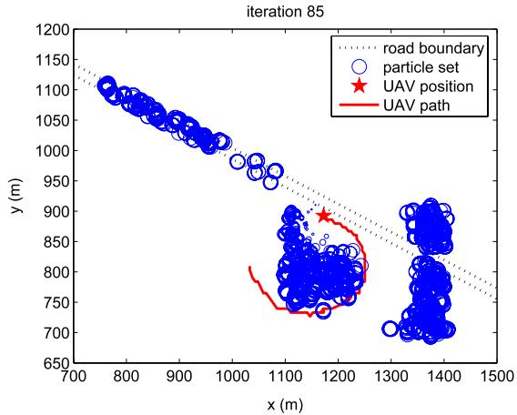

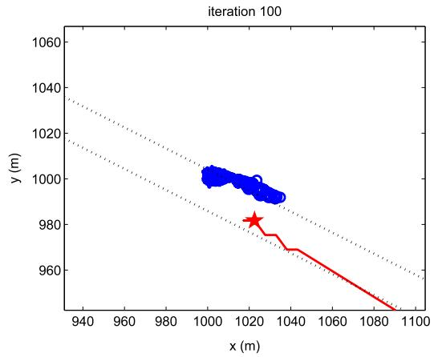

## 6.1. Sensor modeling

The probabilistic sensor model consisting of likelihood functions for both the detection and no detection cases was developed and implemented by Kim and Sengupta [27] based on the standard pinhole camera model. These likelihood functions incorporate uncertainty in the UAV state estimate as well as uncertainty inherent in the sensor. A likelihood function for a video frame which does not contain the target is shown in Fig. 12, where dark areas indicate high value. This is a plot of $P ( z = \emptyset | X )$ for the UAV position as shown.

## 6.2. Results

A Sig Rascal UAV under manual control collected video of a truck driving on a road. One such video frame is shown in Fig. 11. The upper left plot of Fig. 13 shows the particle distribution before the target has been detected, where the center of the initial grid has been searched and some particles have traveled along the road (shown by dotted lines). The searched area is centered to the right of the UAV’s path due to the bank angle effect on the fixed camera. The upper right plot shows the particle distribution after the target has been observed in a single frame. The few particles near the observed target location have high weight and all others have low weight, although they have not yet been eliminated. In the lower left plot, the target has been observed in multiple frames and all particles are clustered in an area approximately 30 meters by 5 meters. (Note that this plot has a reduced axis scale.) The random target motion and the poor UAV state estimate prevent the target position from being more tightly localized. Improved UAV state estimation will be critical for future experimental work.

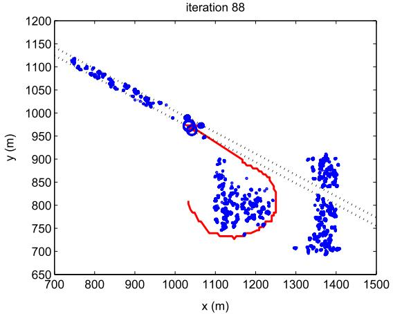

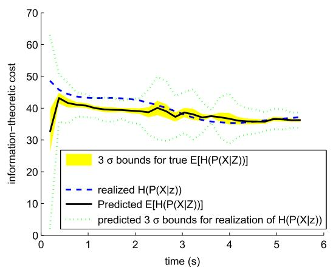  
Fig. 13. Particle filtering density before target detection (upper left), immediately after truck is detected (upper right) and after many detections (lower left). Dotted lines mark road borders. Predicted and realized cost with prediction horizon of six steps (1.14 s), lower right.

The lower right plot of Fig. 13 shows predicted and realized cost for a post-processed sequence of video containing the moving target with a prediction horizon of six steps (1.14 s). The tight shaded bounds around the predicted cost are 3σ bounds for the expected entropy. The wide dotted bounds show the 3σ uncertainty for the realization of the conditional entropy. The realized cost falls within the prediction bounds, verifying the accuracy of the entropy prediction process. Ten random samples are used to approximate the expectation over observation sequences.

## 7. Conclusions

An active sensing task has been formulated as a receding horizon control with the objective of minimizing the information entropy of a Bayesian estimate. In order to implement the RHC, original computational techniques have been developed to allow prediction of expected entropy in a non-Gaussian filter over a long horizon. The example of tracking a moving vehicle using computer vision has been considered in both simulation and a UAV flight experiment. Simulations demonstrate the ability of the RHC to track the target vehicle using a fixed-wing UAV, and post-processing of flight data verifies the accuracy of the entropy prediction techniques in an experimental setting.

An immediate area of future work is to improve the real-time performance of the entropy prediction to enable flight experiments under the proposed RHC. Investigation of alternative optimization methods such as stochastic gradient descent will also benefit from a more efficient cost computation.

## References

[1] A. Ryan, J. Tisdale, M. Godwin, D. Coatta, D. Nguyen, S. Spry, R. Sengupta, J.K. Hedrick, Decentralized control of unmanned aerial vehicle sensing missions, in: Proc. of the American Controls Conference, New York, NY, July 2007.

[2] B. Grocholsky, Information driven coordinated air–ground proactive sensing, in: Proc. of the IEEE International Conference on Robotics and Automation, April 2005.

[3] D.T. Cole, A.H. Goktogan, S. Sukkarieh, The demonstration of a cooperative control architecture for UAV teams, in: Proc. of the International Symposium on Experimental Robotics, Rio de Janiero, 2006.

[4] K.M. Lynch, I.B. Schwartz, P. Yang, R.A. Freeman, Decentralized environmental modeling by mobile sensor networks, IEEE Transactions on Robotics 24 (3) (2008) 710–724.

[5] T.H. Chung, J.W. Burdick, R.M. Murray, A decentralized motion coordination strategy for dynamic target tracking, in: Proc. of the IEEE International Conference on Robotics and Automation, Orlando, FL, 2006.

[6] H. Lau, S. Huang, G. Dissanayake, T. Furukawa, Optimal search for multiple targets in a built environment, in: Proc. of the IEEE/RSJ International Conference on Intelligent Robots and Systems, Edmonton, Canada, August 2005.

[7] B. Lavis, T. Furukawa, H.F. Durrant-Whyte, Dynamic space reconfiguration for Bayesian search and tracking with moving targets, Autonomous Robotics 24 (4) (2008) 387–399.

[8] B. Jung, G.S. Sukhatme, A generalized region-based approach for multitarget tracking in outdoor environments, in: Proc. of the IEEE International Conference on Robotics and Automation, vol. 3, 2004, pp. 2189–2195.

[9] F. Bourgault, T. Furukawa, H.F. Durrant-Whyte, Coordinated decentralized search for a lost target in a Bayesian world, in: Proceedings of the 2003 IEEE/RSJ International Conference on Intelligent Robots and Systems, Las Vegas, NV, 2003.

[10] F. Bourgault, T. Furukawa, H.F. Durrant-Whyte, Process model, constraints, and the coordinated search strategy, in: Proc. of the IEEE International Conference on Robotics and Automation, 2004.

[11] G.M. Hoffmann, C.J. Tomlin, Mobile sensor network control using mutual information methods and particle filters, IEEE Transactions on Automatic Control 55 (1) (2010) 32–47.

[12] S. Jackson, J. Tisdale, M. Kamgarpour, B. Basso, J.K Hedrick, Tracking controllers for small UAVs with wind disturbances: Theory and flight results, in: Proc. of the IEEE Conference on Decision and Control, Cancun, December 2008.

[13] C. Andrieu, A. Doucet, S.S. Singh, V.B. Tadic, Particle methods for change detection, system identification, and control, Proceedings of the IEEE 92 (3) (2004) 423–438.

[14] A. Brooks, Parametric POMDPs for planning in continuous state spaces, Ph.D. Thesis, University of Sydney, 2007.

[15] F.M. Callier, C.A. Desoer, Linear System Theory, in: Springer Texts in Electrical Engineering, Springer-Verlag, 1991.

[16] C.E. Shannon, W. Weaver, The Mathematical Theory of Information, University of Illinois Press, 1949.

[17] C.F. Chung, T. Furukawa, Coordinated search-and-capture using particle filters, in: Proc. of the International Conference on Control, Automation, Robotics and Vision, December 2006.

[18] A. Doucet, B. Vo, C. Andrieu, M. Davy, Particle filtering for multi-target tracking and sensor management, in: Proc. of International Conference on Information Fusion, vol. 1, 2002, pp. 474–481.

[19] N.J. Gordon, D.J. Salmond, A.F.M. Smith, Novel approach to nonlinear/non-Gaussian Bayesian state estimation, Radar and Signal Processing, IEE Proceedings 140 (2) (1993) 107–113.

[20] A. Ryan, X. Xiao, S. Rathinam, J. Tisdale, D. Caveney, R. Sengupta, J.K. Hedrick, A modular software infrastructure for distributed control of collaborating unmanned aerial vehicles, in: Proc. of the AIAA Guidance, Navigation, and Control Conference and Exhibit, August 2006.

[21] J. Tisdale, A. Ryan, Z. Kim, D. Tornqvist, J.K. Hedrick, A multiple UAV system for vision-based search and localization, in: Proc. of the American Controls Conference, June 2008.

[22] B. Vaglienti, R. Hoag, M. Niculescu, Piccolo system user’s guide, Technical report, Cloud Cap Technology, March 2008. www.cloudcaptech.com.

[23] G. Hendeby, Performance and implementation aspects of nonlinear filtering. Ph.D. Thesis, Department of Electrical Engineering, Linköping University, 2008.

[24] U. Orguner, Notes on differential entropy calculation using particles, Technical Report LiTH-ISY-R-2857, Department of Electrical Engineering, Linköping University, SE-581 83 Linkping, Sweden, August 2008.

[25] C.B. Barber, D.P. Dobkin, H.T. Huhdanpaa, The quickhull algorithm for convex hulls, ACM Transactions on Mathematical Software 22 (4) (1996).

[26] A. Ryan, Information-theoretic control for mobile sensor teams, Ph.D. Thesis, University of California, Berkeley, 2008.

[27] Z. Kim, R. Sengupta, Target detection and position likelihood using an aerial image sensor, in: Proc. of the International Conference on Robotics and Automation, Pasadena, CA, May 2008.

  
Allison Ryan is a recent graduate from the Berkeley Center for Collaborative Control of Unmanned Vehicles. She was a National Science Foundation Fellow and winner of the Best Student Paper award from the 2008 AIAA Guidance Navigation and Control Conference. She is currently employed as a Senior Algorithms Engineer at a biotechnology startup.

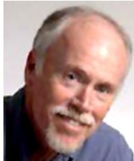  
J. Karl Hedrick is the James Marshall Wells professor of Mechanical Engineering at the University of California at Berkeley, where he teaches graduate and undergraduate courses in automatic control theory. He is currently the director of Berkeley’s Vehicle Dynamics Laboratory as well as the principal investigator of the Office of Naval Research center at Berkeley, the Center for the Collaborative Control of Unmanned Vehicles.