# On exploiting -negative sensor evidence for target tracking and sensor data fusion q

Wolfgang Koch

FGAN-FKIE, Sensor Networks and Data Fusion, Neuenahrer Strasse 20, D 53343 Wachtberg, Germany

Received 28 October 2004; received in revised form 16 August 2005; accepted 1 September 2005 Available online 25 October 2005

## Abstract

In various applications of target tracking and sensor data fusion all available information related to the sensor systems used and the underlying scenario should be exploited for improving the tracking/fusion results. Besides the individual sensor measurements themselves, this in particular includes the use of more refined models for describing the sensor performance. By incorporating this type of background information into the processing chain, it is possible to exploit -negative sensor evidence. The notion of -negative sensor evidence covers the conclusions to be drawn from expected but actually missing sensor measurements for improving the position or velocity estimates of targets under track. Even a failed attempt to detect a target is a useful sensor output, which can be exploited by appropriate sensor models providing background information. The basic idea is illustrated by selected examples taken from more advanced tracking and sensor data fusion applications such as group target tracking, tracking with agile beam radar, ground moving target tracking, or tracking under jamming conditions.

\- 2005 Elsevier B.V. All rights reserved.

Keywords: Negative information/evidence; Target tracking; Sensor resolution; Local search; Adaptive beam positioning; GMTI sensor fusion

## 1. Introduction

For sophisticated sensor systems, under difficult operational conditions, and in advanced tracking and sensor data fusion applications all available information must be taken into account for improving the situation picture demanded by the user. Besides the processing of the current sensor measurements themselves, this task also includes the exploitation of all available background information on the targets kinematical behavior, the underlying sensor environment, and the performance characteristics of the sensor systems involved.

## 1.1. The notion of -negative evidence

In this paper we emphasize the practical use of background information on the sensor characteristics being formulated in terms of refined statistical models of the sensor performance. In particular, we discuss selected aspects of group target tracking, adaptive local search in the context of phased-array tracking, ground moving target tracking, and missile tracking in presence of main lobe jammer suppression (i.e. adaptive nulling).

By exploiting -negative sensor evidence in target tracking and sensor data fusion applications we mean rigorous inference from expected but actually missing sensor measurements. Thus, the aim is to improve the position or velocity estimates for the targets currently kept under track. For the selected examples discussed in this paper we can show that also a failed attempt to detect a target in the field of view of a sensor is to be considered as a useful sensor output, which can be exploited by using appropriate sensor performance models. In terms of these models valuable background information is formulated which can assist the tasks of target tracking, sensor management, and sensor data fusion.

The technical term chosen here for denoting such pieces of evidence, i.e. -negative evidence, seems to be accepted in the tracking and sensor data fusion community (see, e.g., Refs. [2,3]). Speaking of a -negated sensor output in this context is perhaps a more appropriate way of expressing what is meant.

## 1.2. Bayesian approach to target tracking

In a Bayesian view track maintenance is an iterative updating of conditional probability densities $p ( \mathbf { x } _ { k } | \mathcal { Z } ^ { k } )$ of the (joint) kinematical target state $\mathbf { X } _ { k }$ at time $t _ { k }$ given all accumulated sensor data $\bar { \mathcal { Z } } ^ { k }$ and available a priori information on the target dynamics and the sensor performance in terms of statistical models. Each update consists of a prediction, $p ( \mathbf { x } _ { k - 1 } | \mathcal { X } ^ { k - 1 } )  p ( \mathbf { x } _ { k } | \mathcal { X } ^ { k - 1 } )$ which is determined by the target dynamics model. The prediction is followed by a filtering step, which exploits the current sensor data and the sensor model. The $m _ { k }$ sensor data $Z _ { k } = \left\{ \mathbf { z } _ { k } \right\} _ { j = 1 } ^ { m _ { k } }$ at each scan k as well as the sensor models are the constituents of the likelihood function $p ( Z _ { k } , m _ { k } \vert \mathbf { x } _ { k } )$ . According to Bayes rule the conditional density $p ( \mathbf { x } _ { k } | \mathcal { X } ^ { k } )$ is proportional to:

$$
p ( \mathbf { x } _ { k } | \mathcal { X } ^ { k } ) \propto p ( Z _ { k } , m _ { k } | \mathbf { x } _ { k } ) p ( \mathbf { x } _ { k } | \mathcal { X } ^ { k - 1 } )\tag{ð1Þ}
$$

up to a normalizing constant. In many cases the sensor data $Z _ { k }$ are ambiguous; i.e. there exists a set of exhaustive and mutually exclusive data interpretations $E _ { k }$ . We thus have to deal with densities obeying the following structure:

$$
p ( \mathbf { x } _ { k } | \mathcal { Z } ^ { k } ) \propto \sum _ { E _ { k } } p ( Z _ { k } , m _ { k } , E _ { k } | \mathbf { x } _ { k } ) p ( \mathbf { x } _ { k } | \mathcal { Z } ^ { k - 1 } ) .\tag{ð2Þ}
$$

Evidently, the conditional densities $p ( \mathbf { x } _ { k } | \mathcal { Z } ^ { k } )$ prove to be finite mixtures, weighted sums of individual densities. This is a consequence of ambiguities inherent in the data or the models used. From the densities optimal estimators can be derived according to particular cost functions.

## 1.3. -Negative evidence and Bayes formalism

The discussion of practical examples in the subsequent sections of this paper makes evident that a missing but expected, i.e. -negative or -negated sensor output can well convey quantitative information on the current target position or, in general, a more abstract function of the kinematical target state. In particular, this special type of sensor information can well be included into the sensor data fusion chain within the rigorous framework of Bayes formalism—-there is no need for recourse to ad hoc or empirical schemes.

The basic prerequisite for processing -negative sensor evidence is a more refined model of the sensor performance. In other words, the formulation of an appropriate, problem specific likelihood function is required. By this, additional background information is quantitatively described, which needs to be exploited for adequately explaining the current sensor output.

According to our experience in applying the proposed idea to real world applications, it does not seem to be necessary to deal with highly sophisticated sensor models. For obtaining practically useful results it is in many cases sufficient to model the relevant sensor characteristics in a merely qualitatively correct way; i.e. the sensor model must be more or less a mirror of the basic physical principles relevant to the problem considered.

As the discussion of the examples shows, -negative evidence often appears in the form of an artificial measurement, characterized by a corresponding measurement matrix and measurement error covariance. This ficticious error covariance is characterized by application specific sensor parameters such as sensor resolution, radar beam width, or minimum detectable velocity.

For the sake of simplicity, we consider approximations of the underlying probability densities $p ( \mathbf { x } _ { k } | \mathcal { L } ^ { k } )$ by normal mixtures, i.e. by a weighted sum of Gaussians. This in particular implies certain ‘‘Gaussian type’’ restrictions in the formulation of the various sensor models. We believe that by this the inherent structure of our dealing with -negative evidence becomes more visible. Other, perhaps more obvious sensor models, require techniques like particle filtering in order to exploit the likelihood structure [21,20].

## 2. -Negative evidence in group tracking

Due to the limited resolution capabilities of every physical sensor, closely-spaced objects moving as a group will continuously transition from being resolved to unresolved and back again. For the sake of simplicity let us consider a medium range radar producing range and azimuth measurements for a target formation consisting of two targets with state vectors $\mathbf { x } _ { k } ^ { \top , 2 }$ given in polar coordinates.

## 2.1. Sensor resolution model

In case of a resolution conflict we interpret an unresolved plot $\mathbf { z } _ { k } ^ { g }$ at time $t _ { k }$ as a measurement of the group center, i.e.

$$
\begin{array} { r } { { \bf z } _ { k } ^ { g } = { \bf H } _ { g } { \bf x } _ { k } + { \bf u } _ { k } ^ { g } , } \end{array}\tag{ð3Þ}
$$

$$
\mathrm { w i t h } \quad \mathbf { H } _ { g } \mathbf { x } _ { k } = \frac { 1 } { 2 } \mathbf { H } ( \mathbf { x } _ { k } ^ { 1 } + \mathbf { x } _ { k } ^ { 2 } ) ,\tag{ð4Þ}
$$

where ${ \bf u } _ { k } ^ { g } \sim N ( 0 , { \bf R } _ { g } )$ denotes the measurement error characterized by a corresponding group measurement error covariance matrix $\mathbf { R } _ { g } \ [ 1 6 ] .$ Let H be the underlying measurement matrix defined by $\mathbf { H } \mathbf { x } _ { k } ^ { i } = ( r _ { k } ^ { i } , \varphi _ { k } ^ { i } ) , \ i = 1 , \bar { 2 }$ 2, with $r _ { i }$ and $\varphi _ { i }$ denoting the range and azimuth angle of target i with respect to the sensor. In the previous measurement equation both targets enter with equal weight. For a more general approach see [6].

We expect that the resolution performance of the sensor strongly depends on the current sensor-to-group geometry and the relative orientation of the targets within the group. For physical reasons the resolution in range and azimuth will be independent from each other. The sensors resolution capability also depends on the particular signal processing used and on the random target fluctuations. As a complete description is rather complicated, we are looking for a simplified, but qualitatively correct and mathematically tractable model.

In any case the resolution capability in range and azimuth is limited by the band- and beam-width of the sensor characterized by the parameters $\alpha _ { r } , \alpha _ { \varphi } .$ These radar specific parameters must explicitly enter into any processing of possibly unresolved plots. The typical size of resolution cells in a medium distance radar is about 50 m (range) and 500 m (cross range). As in target formations the mutual distance may well be 50–500 m or even less, the limited sensor resolution is a real problem in target tracking [7].

Resolution phenomena will be observed if the range and angular distances are small compared with $\alpha _ { r } , \alpha _ { \varphi } ; \Delta r / \alpha _ { r } < 1$ $\Delta \varphi / \alpha _ { \varphi } < 1$ . The targets within the group are resolvable if $\Delta r / \alpha _ { r } \gg 1$ or $\Delta \varphi / \alpha _ { \varphi } \gg 1$ . Furthermore we expect a narrow transient region. A more quantitative description is provided by introducing a resolution probability $P _ { r } =$ $P _ { r } ( \Delta r , \Delta \varphi )$ depending on the sensor-to-group geometry. It can be expressed by a corresponding probability of being unresolvable $P _ { u } .$ Let us describe $P _ { u }$ by a Gaussian-type function of the relative range and angular distances:

$$
P _ { r } ( \Delta r , \Delta \varphi ) = 1 - P _ { u } ( \Delta r , \Delta \varphi ) ,\tag{ð5Þ}
$$

$$
\begin{array} { r l } { \mathrm { w i t h } } & { P _ { u } ( \Delta r , \Delta \varphi ) = \mathrm { e x p } \left[ - ( { \log 2 } ) { \left( \frac { \Delta r } { \alpha _ { r } } \right) } ^ { 2 } \right] } \\ & { \times \mathrm { e x p } \left[ - ( { \log 2 } ) { \left( \frac { \Delta \varphi } { \alpha _ { \varphi } } \right) } ^ { 2 } \right] . } \end{array}\tag{ð6Þ}
$$

See Refs. [16,14,11] for a more detailed discussion of this model. Evidently, this simple model for describing resolution phenomena reflects the previous, more qualitative discussion. We in particular observe that $P _ { u }$ is reduced by a factor of 2 if $\Delta r$ is increased from zero to $\mathsf { \alpha } _ { r } .$ . Due to the Gaussian character of its dependency on the state vector $\mathbf { X } _ { k }$ the probability $P _ { u }$ can be written in terms of a normal density:

$$
P _ { u } = \exp \left[ - ( \log 2 ) [ ( r _ { k } ^ { 1 } - r _ { k } ^ { 2 } ) / \alpha _ { r } ] ^ { 2 } \right]
$$

$$
\times \exp \left[ - ( \log 2 ) [ ( \varphi _ { k } ^ { 1 } - \varphi _ { k } ^ { 2 } ) / \alpha _ { \varphi } ] ^ { 2 } \right]\tag{ð7Þ}
$$

$$
= \exp \left[ - ( \log 2 ) ( \mathbf { H } \mathbf { x } _ { k } ^ { 1 } - \mathbf { H } \mathbf { x } _ { k } ^ { 2 } ) ^ { \top } \mathbf { A } ^ { - 1 } ( \mathbf { H } \mathbf { x } _ { k } ^ { 1 } - \mathbf { H } \mathbf { x } _ { k } ^ { 2 } ) \right]\tag{ð8Þ}
$$

$$
\mathbf { \Sigma } = \exp \left[ - ( \log 2 ) ( \mathbf { H } _ { u } \mathbf { x } _ { k } ) ^ { \top } \mathbf { A } ^ { - 1 } \mathbf { H } _ { u } \mathbf { x } _ { k } \right] .\tag{ð9Þ}
$$

Here the resolution matrix A is defined by $\mathbf { A } = \mathbf { d i a g } ( \alpha _ { r } ^ { 2 } , \alpha _ { \varphi } ^ { 2 } )$ , while the quantity $\mathbf { H } _ { u } \mathbf { x } _ { k } = \mathbf { H } ( \mathbf { x } _ { k } ^ { 1 } - \mathbf { x } _ { k } ^ { 2 } )$ can be interpreted a measurement matrix for distance measurements.

Up to a constant factor the resolution probability probability $P _ { u } ( \mathbf { x } _ { k } )$ might formally be interpreted as the ficticious likelihood function of a measurement 0 of the distance $\mathbf { H } ( \mathbf { x } _ { k } ^ { 1 } - \mathbf { x } _ { k } ^ { 2 } )$ between the targets with a corresponding ficticious measurement error covariance matrix $\mathbf { R } _ { u }$ defined by the resolution parameters $\alpha _ { r } , \ : \alpha _ { \varphi } .$

$$
P _ { u } ( \mathbf { x } _ { k } ) = | 2 \pi \mathbf { R } _ { u } | ^ { 1 / 2 } \mathcal { N } ( \mathbf { O } ; \mathbf { H } _ { u } \mathbf { x } _ { k } , \mathbf { R } _ { u } ) ,\tag{ð10Þ}
$$

$$
\mathrm { w i t h ~ { \bf ~ R } } _ { u } = \frac { { \bf A } } { 2 ( \log 2 ) } = \frac { 1 } { 2 \log 2 } \mathrm { d i a g } [ \alpha _ { r } ^ { 2 } , \alpha _ { \varphi } ^ { 2 } ] .\tag{ð11Þ}
$$

According to a first order Taylor expansion around the predicted range $r _ { k | k - 1 } ^ { g }$ and azimuth $\varphi _ { k | k - 1 } ^ { g }$ of the group center, the resolution matrix $\mathbf { A } _ { \mathrm { c } }$ describing the resolution cells in Cartesian coordinates proves to be time dependent and results from the matrix A by applying a rotation $\mathbf { R } _ { \varphi _ { k | k } ^ { g } }$ around $\varphi _ { k | k - 1 } ^ { g }$ and a dilatation diag $[ 1 , r _ { k | k - 1 } ^ { g } ]$ -1

$$
\begin{array} { r l } & { { \bf A } _ { \mathrm { c } } = \mathbf { R } _ { \varphi _ { k \mid k - 1 } ^ { g } } \left( \begin{array} { c c } { \alpha _ { r } ^ { 2 } } & { 0 } \\ { 0 } & { ( r _ { k \mid k - 1 } ^ { g } \alpha _ { \varphi } ) ^ { 2 } } \end{array} \right) \mathbf { R } _ { \varphi _ { k \mid k - 1 } ^ { g } } ^ { \top } . } \end{array}\tag{ð12Þ}
$$

## 2.2. Impact of the sensor-to-target geometry

As an example let us consider the simplified situation in Fig. 1a. A formation with two targets is passing a radar. We here consider $d _ { 1 } = d _ { 2 }$ , i.e. an echelon formation. R is the minimum distance of the group center from the radar. Fig. 1b shows the resulting resolution probability $P _ { u }$ depending on the range between the group center and parameterized by $R = 0 , 1 0 , 3 0$ , 60 km. The solid lines refer to a formation approaching the radar $( \dot { r } < 0 )$ , the dashed lines to $\dot { r } > 0$ . For $R \neq 0$ both flight phases differ substantially. Near R the probability $P _ { u }$ varies strongly $( . 8 5  . 1 5 ! )$ For a radial flight $( R = 0 )$ we observe no asymmetry and $P _ { u }$ is constant over a wide range $( r \gg r _ { \mathrm { c } } )$ . Obviously, the sensors resolution capability strongly depends on the underlying sensor-to-target geometry and the relative position of the targets. This dependence is reflected by the resolution model previously introduced.

## 2.3. Update by exploiting -negative evidence

The targets to be tracked can produce a single unresolved group measurement, which is detected or not, or they are resolved and each target is detected (or not). According to the discussion in the introduction we have to formulate an explicit expression for the components of the likelihood function in Eq. (2):

$$
p ( Z _ { k } , m _ { k } , E _ { k } | \mathbf { x } _ { k } ) = p ( Z _ { k } , m _ { k } | E _ { k } , \mathbf { x } _ { k } ) P ( E _ { k } | \mathbf { x } _ { k } ) .\tag{ð13Þ}
$$

Firstly, let us introduce the data interpretation $E _ { k } ^ { i i }$ denoting that both objects have not been resolved but were detected as a group producing the group measurement $\mathbf { z } _ { k } ^ { i } \in Z _ { k }$ and all other sensor plots in $Z _ { k }$ being false returns, assumed to be uniformly distributed over the sensors field of view. Under this interpretation we obtain:

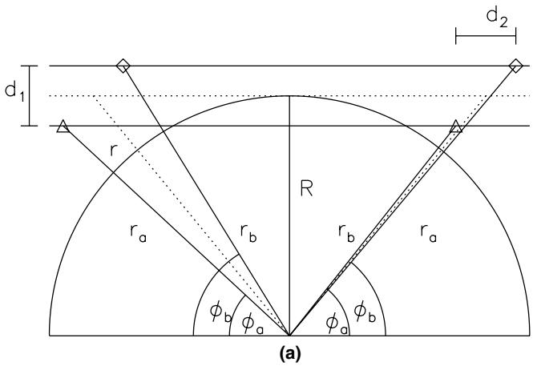

$\mathsf { P } _ { \mathsf { u } } { = } \mathsf { P } _ { \mathsf { u } } ( \mathsf { r } ; \mathsf { R } )$ : Echelon Formation  
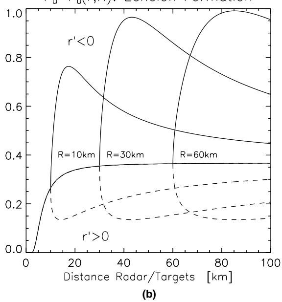  
Fig. 1. Resolution (effect of sensor-to-target geometry): (a) scenario and (b) resolution.

$$
p ( Z _ { k } , m _ { k } | E _ { k } ^ { i i } , \mathbf { x } _ { k } ) = \mathcal { N } ( \mathbf { z } _ { k } ^ { i } ; \mathbf { H } _ { k } ^ { g } \mathbf { x } _ { k } , \mathbf { R } _ { k } ^ { g } ) \frac { p _ { \mathrm { F } } ( m _ { k } - 1 ) } { | \mathrm { F o V } | ^ { m _ { k } - 1 } } ,\tag{ð14Þ}
$$

$$
P ( E _ { k } ^ { i i } | \mathbf { x } _ { k } ) = \frac { 1 } { m _ { k } } P _ { u } ( \mathbf { x } _ { k } ) P _ { \mathrm { D } } ^ { u } .\tag{ð15Þ}
$$

In this expression $p _ { \mathrm { F } } ( m )$ is the probability of having m false returns, $| \mathrm { F o V } |$ denotes the volume of the field of View, and $P _ { \mathrm { ~ D ~ } } ^ { u }$ is the detection probability for unresolved targets. By exploiting Eq. (10) we can write $p ( Z _ { k } , m _ { k } , E _ { k } ^ { i i } | \mathbf { x } _ { k } )$ up to a constant factor as:

$$
p ( Z _ { k } , m _ { k } , E _ { k } ^ { i i } | \mathbf { x } _ { k } ) = \mathrm { c o n s t . } ~ { \mathcal { N } } { \left( \binom { \mathbf { Z } _ { k } ^ { i } } { 0 } ; \binom { \mathbf { H } _ { g } } { \mathbf { H } _ { u } } \mathbf { x } _ { k } , \left( \begin{array} { l l } { \mathbf { R } _ { g } } & { \mathbf { O } } \\ { \mathbf { O } } & { \mathbf { R } _ { u } } \end{array} \right) \right) } .\tag{ð16Þ}
$$

Hence under the hypothesis $E _ { k } ^ { i i }$ two measurements are to be processed: the (real) plot $\mathbf { z } _ { k } ^ { i }$ of the group center $\begin{array} { r } { \mathbf { H } _ { k } ^ { g } \mathbf { x } _ { k } = \frac { 1 } { 2 } \mathbf { H } ( \mathbf { x } _ { k } ^ { 1 } + \mathbf { x } _ { k } ^ { 2 } ) } \end{array}$ and a (ficticious) measurement -zero of the distance $\mathbf { H } _ { u } \mathbf { x } _ { k } = \mathbf { H } ( \mathbf { x } _ { k } ^ { 1 } - \mathbf { x } _ { k } ^ { 2 } )$ between the objects.

We speak of -negative sensor evidence, as the lack of a second target measurement conveys information on the target position. For in case of a resolution conflict the relative target distance must be smaller than the resolution.

Let it be emphasized that the constant in the previous equation is by no means unimportant. It has to be used in the full Bayesian calculation to produce the posterior density $p ( \mathbf { x } _ { k } | \mathcal { Z } ^ { k } )$ . Explicitly it is given by

$$
\begin{array} { l } { \mathrm { c o n s t . } = \displaystyle \frac { p _ { \mathrm { F } } ( m _ { k } - 1 ) } { | \mathrm { F o V } | ^ { m _ { k } - 1 } } \displaystyle \frac { 1 } { m _ { k } } | 2 \pi \mathbf { R } _ { u } | ^ { 1 / 2 } P _ { \mathrm { D } } ^ { u } } \\ { \displaystyle \phantom { \frac { 1 } { | \mathrm { F o V } | ^ { m _ { k } - 1 } } \frac { 1 } { m _ { k } } | 2 \pi \mathbf { R } _ { u } | ^ { 1 / 2 } P _ { \mathrm { D } } ^ { u } } } \end{array}\tag{ð17Þ}
$$

ð18Þ

In the last equation we assumed the number of false returns in the sensors field of view to be Poisson-distributed with a spatial false return density $\rho _ { \mathrm { F } }$

Secondly, let $E _ { k } ^ { 0 0 }$ denote the interpretation -both objects are neither resolved nor detected; all plots in $Z _ { k }$ are false. We obtain for the likelihood function:

$$
p ( Z _ { k } , m _ { k } | E _ { k } ^ { 0 0 } , \mathbf { x } _ { k } ) = \frac { p _ { \mathrm { F } } ( m _ { k } ) } { | \mathrm { F o V } | ^ { m _ { k } } } ,\tag{ð19Þ}
$$

$$
\begin{array} { r } { P ( E _ { k } ^ { 0 0 } | x _ { k } ) = P _ { u } ( \mathbf { x } _ { k } ) ( 1 - P _ { \mathrm { D } } ^ { u } ) , } \end{array}\tag{ð20Þ}
$$

$$
\begin{array} { l } { { \displaystyle p ( { \boldsymbol Z } _ { k } , { \boldsymbol m } _ { k } , { \boldsymbol E } _ { k } ^ { 0 0 } | { \bf x } _ { k } ) = \frac { p _ { \mathrm { F } } ( { \boldsymbol m } _ { k } ) } { | { \bf F } \boldsymbol { 0 } { \bf V } | ^ { m _ { k } } } | 2 \pi { \bf R } _ { u } | ^ { 1 / 2 } ( 1 - P _ { \mathrm { D } } ^ { u } ) } } \\ { ~ \times ~ \mathcal { N } ( 0 ; { \bf H } _ { u } { \bf x } , { \bf R } _ { u } ) } \\ { ~ = \frac { \mathrm { e } ^ { \rho _ { \mathrm { F } } | { \bf F } \boldsymbol { 0 } { \mathrm { \boldsymbol v } } | } } { m _ { k } ! } \rho _ { \mathrm { F } } ^ { m _ { k } } | 2 \pi { \bf R } _ { u } | ^ { 1 / 2 } ( 1 - P _ { \mathrm { D } } ^ { u } ) } \\ { ~ \times ~ \mathcal { N } ( 0 ; { \bf H } _ { u } { \bf x } , { \bf R } _ { u } ) } \\ { ~ \propto \mathcal { N } ( 0 ; { \bf H } _ { u } { \bf x } , { \bf R } _ { u } ) . } \end{array}\tag{ð 21Þ}
$$

ð 22Þ

ð23Þ

Even under the hypothesis of a missing unresolved plot at least a ficticious distance measurement 0 is being processed with a measurement error given by the sensor resolution.

Finally, let us consider $E _ { k } ^ { i j }$ denoting that the objects are resolved and detected, $\mathbf { z } _ { k } ^ { i } , \mathbf { z } _ { k } ^ { j } \in Z _ { k }$ are considered to be the measurements $( m _ { k } - 2$ false returns). We obtain for the likelihood function $( P _ { \mathrm { D } } \colon$ detection probability):

$$
p ( Z _ { k } , m _ { k } | E _ { k } ^ { i j } , \mathbf { x } _ { k } ) = \mathcal { N } \Big ( \binom { \mathbf { z } _ { k } ^ { i } } { \mathbf { z } _ { k } ^ { j } } ; \binom { \mathbf { H } } { \mathbf { H } } \mathbf { x } _ { k } ,
$$

$$
\begin{array} { r l r } & { } & { ( \begin{array} { l l } { { \bf R } } & { { \bf O } } \\ { { \bf O } } & { { \bf R } } \end{array} ) [ \frac { p _ { \mathrm { F } } ( m _ { k } - 2 ) } { | \mathrm { F o V } | ^ { m _ { k } - 2 } } , } \\ & { } & { P ( E _ { k } ^ { i j } | { \bf x } _ { k } ) = \displaystyle \frac { [ 1 - P _ { u } ( { \bf x } _ { k } ) ] P _ { \mathrm { D } } ^ { 2 } } { m _ { k } ( m _ { k } - 1 ) } . \qquad } \end{array}\tag{ð24Þ}
$$

According to the factor $1 - P _ { u } ( \mathbf { x } _ { k } ) = 1 - | 2 \pi \mathbf { R } _ { u } | ^ { \frac { 1 } { 2 } }$ $\mathcal { N } ( 0 ; { \bf H } _ { u } { \bf x } , { \bf R } _ { u } )$ the likelihood function becomes a mixture, in which negative weighting factors can occur. Nevertheless the coefficients sum up to one and, due to the factor $| 2 \pi \mathbf { R } _ { u } | ^ { 1 / 2 }$ $P ( E _ { k } ^ { i j } | \mathbf { x } _ { k } ) \geqslant 0$ The density $p ( \mathbf { x } _ { k } | \mathcal { Z } ^ { k } )$ is thus well-defined. This reflects the fact that in case of a resolved group the targets must have a certain minimum distance between each other which is given by the sensor resolution. Otherwise they would not have been resolvable.

The discussion for remaining cases $E _ { k } ^ { 0 j } , E _ { k } ^ { i 0 }$ (target resolvable, but only one was detected) and $E _ { k } ^ { 0 o }$ (target resolvable, but none detected) follows the same lines. For details see [16].

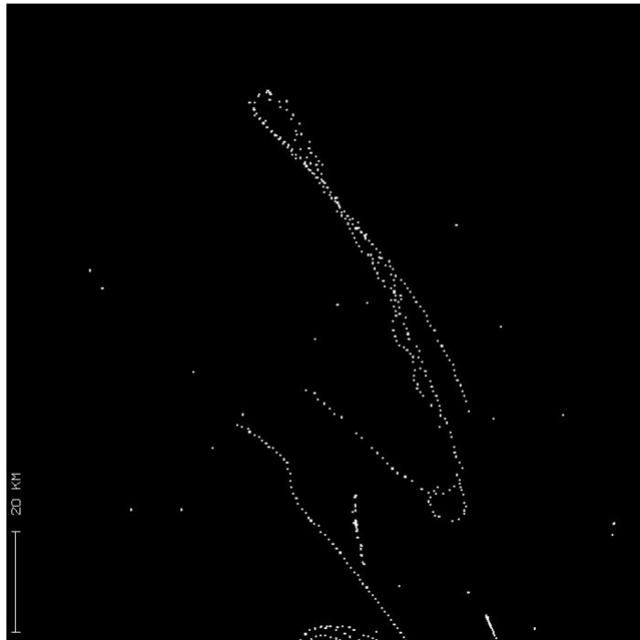  
Fig. 2. Radar raw data of a formation flight.

## 2.4. Verification with real radar data

Fig. 2 shows a characteristic detail taken from a set of raw (real) data that were collected at the plot level from a typical 2D L-band medium-range radar. The antenna is rotating with a scan period of 5 s; the corresponding pulse width is 1 ls, the beam-width 1.5 , and the detection probability about 80%. As in this example the spatial false return density is low, JPDA-type filtering [4] is applied.

The sensor model used for tracking is characterized by the following parameters: sensor resolution in range and azimuth $\alpha _ { r } = 1 5 0 \mathrm { m }$ , $\alpha _ { \varphi } = 1 . 5 ^ { \circ }$ measurement error $\sigma _ { r } =$ 30 m, $\sigma _ { \varphi } = . 2 ^ { \circ } \mathrm { ~ }$ , measurement error for unresolved returns $\sigma _ { r } ^ { u } = 7 5 \mathrm { m } , \sigma _ { \omega } ^ { u } = . 7 5 \mathrm { ^ c }$ , detection probability $P _ { \mathrm { D } } = P _ { \mathrm { D } } ^ { u } = . 8 ,$ and spatial false return density $\rho _ { \mathrm { F } } = 1 0 ^ { - 4 } / \mathrm { k m } ^ { 2 }$

The example demonstrates that the limited sensor resolution must explicitly be taken into account as soon as the targets become close and thus illustrates the practical use of -negative evidence in the sense previously discussed.

For this purpose Fig. 3a and b show the estimation error ellipses for two targets (red, white)1 that result from JPDA filtering. While in Fig. 3a perfect sensor resolution wrongly was assumed, i.e. $\alpha _ { r } = \alpha _ { \varphi } = 0$ , in Fig. 3b the above resolution parameters were used.

JPDA filtering without considering resolution phenomena evidently fails after a few frames as indicated by diverging tracking error ellipses. This has a simple explanation: Without modeling the limited sensor resolution, an actually produced unresolved plot can only be treated as a single target measurement along with a missed detection. In consequence the related covariances increase in size. This effect is further intensified by subsequent unresolved returns.

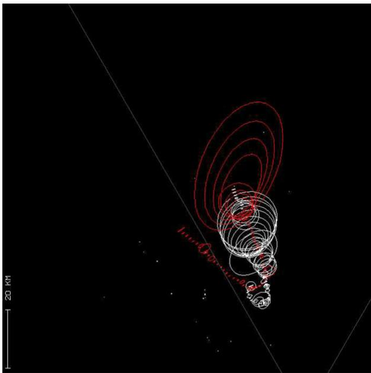  
(a)

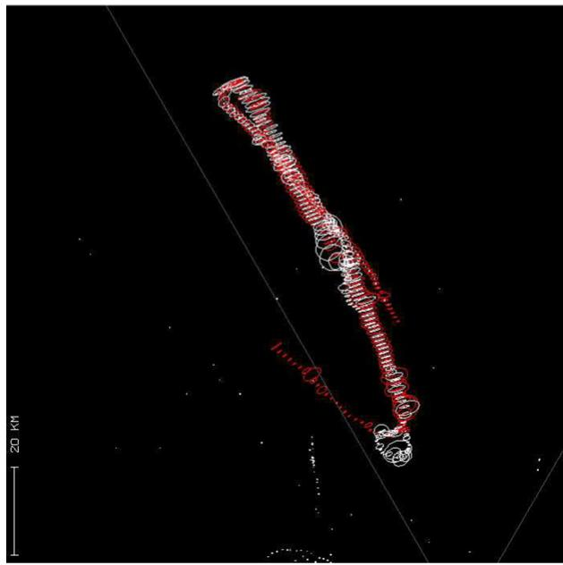  
(b)  
Fig. 3. Tracking of possibly unresolved targets: (a) without exploiting -negative evidence and (b) with exploiting -negative evidence.

If hypotheses related to resolution conflicts are taken into account, however, the tracking remains stable. The error ellipses in Fig. 3a and b have been enlarged to make their data-driven adaptivity more visible. The ellipses shrink, for instance, if both targets are actually resolved in a particular scan. The transient enlargement halfway during the formation flight is caused by a crossing target situation. The corresponding track for the third target involved is not displayed in the figure.

## 3. -Negative evidence in ESA tracking

For electronically scanned array radar (ESA, phasedarray radar), basic sensor parameters are variable over a wide range and can be chosen individually for each track. This increased flexibility calls for combined tracking and sensor control for optimizing the time and energy management.

Let us consider air situations typical of military air surveillance. Even agile targets will not always maneuver. Nevertheless, abrupt transitions to high-g turns can occur. For describing this behavior IMM models are well suited. They are defined by multiple dynamics models with predescribed transition probabilities for the switching between these models $[ 5 , 9 ] .$ Due to the local target illumination by a pencil beam, however, the abrupt onset of strong maneuvers is challenging for phased-array tracking. Track loss must be avoided as far as possible, because each reinitiation is highly time and energy consuming. For this reason, we have to consider adaptive beam positioning techniques for local search [13].

## 3.1. Radar pencil beam model

Before each sensor allocation the tracking system must select the appropriate revisit time $t _ { k } ,$ the beam position $\mathbf { b } _ { k }$ at this time, and the transmitted energy proportional to the time on target [22]. If no detection occurs, we consider repeated dwells until the sensor allocation delivers measurements of the direction cosines $\mathbf { d } _ { k } = ( u _ { k } , v _ { k } ) ^ { \top }$ and the range of the target. The adaptive calculation of the revisit time $t _ { k }$ is determined by the minimum track quality required, while the corresponding beam position is usually given by the predicted direction cosines of the target: $\mathbf { b } _ { k } = ( u _ { k | k - 1 } , v _ { k | k - 1 } ) ^ { \top }$

For a ESA radar the signal-to-noise ratio SNR strongly depends on the correct beam positioning which is in the responsibility of the tracking system. Therefore, any sensor model for ESA tracking has to provide a functional relationship between the expected SN ${ \bf R } _ { k }$ at time $t _ { k }$ and the sensor/target parameters. Assuming a Gaussian beam form and using the radar equation [8], we model the mean SNR by a simple Gaussian-type function:

$$
\mathbf { S N R } _ { k } = \mathbf { S N R } _ { 0 } \bigg ( \frac { r _ { k } } { r _ { 0 } } \bigg ) ^ { - 4 } \mathrm { e } ^ { - ( \log 2 ) | \mathbf { d } _ { k } - \mathbf { b } _ { k } | ^ { 2 } / b ^ { 2 } } .\tag{ð25Þ}
$$

b is the one-sided 3dB beam width, i.e. SNR is reduced by a factor 2 in case of an illumination error of $| \mathbf { d } _ { k } - \mathbf { b } _ { k } | = b .$ The radar parameter $\mathrm { { S N R } _ { 0 } }$ depends on the transmitted energy and the targets radar cross section.

For the sake of simplicity let us consider a simple quadrature detector deciding on target detection if the received signal exceeds a certain threshold. For a Swerling I fluctuation model of the radar cross section of the targets, the detection probability is a function of the signal-to-noise ratio SNR and the false alarm probability $P _ { \mathrm { F A } }$ determined by the detection threshold. We obtain the well-known relationship:

$$
P _ { \mathrm { D } } ( \mathbf { d } _ { k } , r _ { k } ; \mathbf { b } _ { k } ) = P _ { \mathrm { F A } } ^ { \frac { 1 } { 1 + \mathrm { S N R } ( \mathbf { d } _ { k } , r _ { k } ; \mathbf { b } _ { k } ) } } .\tag{ð26Þ}
$$

Detection probabilities depending on the target state are also discussed in [17].

## 3.2. Search by exploiting -negative evidence

Intelligent algorithms for beam positioning and local search are crucial for IMM-type phased-array tracking. Too simple strategies may easily destroy the benefits of the adaptive dynamics model, because track loss immediately after a model switch can easily occur. To avoid this phenomenon, we adapt the optimal approach based on the predicted densities $p ( \mathbf { x } _ { k } | \mathcal { \dot { L } } ^ { k - 1 } )$ proposed in [8] to IMM tracking [13].

1. The beam position $\mathbf { b } _ { k } ^ { 1 }$ of the first dwell at time $t _ { k }$ is simply given by the predicted direction ${ \bf d } _ { k \lvert k - 1 }$ to be derived from the predicted density function $p ( \mathbf { x } _ { k } | \mathcal { Z } ^ { k - 1 } )$

2. If no detection occurs in the first dwell, this very result provides useful information on the target. We thus have to calculate the conditional density of the target state given the event : $\neg \mathrm { D } _ { k } ^ { 1 } \colon$ -no detection at time $t _ { k }$ in the direction $\mathbf { b } _ { k } ^ { 1 , }$

3. An application of Bayes Rule directly yields:

$$
p ( \mathbf { d } _ { k } | \mathbf { \Theta } \mathbf { \to } \mathbf { D } _ { k } ^ { 1 } , \mathcal { X } ^ { k - 1 } ) \propto \big ( 1 - P _ { \mathrm { D } } ( \mathbf { d } _ { k } ; \mathbf { b } _ { k } ^ { 1 } ) \big ) p ( \mathbf { d } _ { k } | \mathcal { X } ^ { k - 1 } )\tag{ð27Þ}
$$

up to a normalizing factor. In this expression the detection probability $P _ { \mathrm { { D } } }$ depends on the expected SNR (Eq. (25)) and thus on the current beam and target position $\mathbf { b } _ { k } , \mathbf { d } _ { k } .$

4. The two dimensional density $p ( \mathbf { d } _ { k } | \mathbf { \bar { \Lambda } } \mathbf { D } _ { k } ^ { 1 } , \mathcal { Z } ^ { k - 1 } )$ can easily be calculated on a grid. The beam position for the next dwell is then simply provided by its maximum.

5. This computational scheme for Bayesian local search is repeated until a detection occurs. Since the maximum of the densities $p ( \mathbf { d } _ { k } | \mathbf { \Theta } \mathbf { \to } \mathbf { D } _ { k } ^ { 1 } , \mathbf { \to } \mathbf { D } _ { k } ^ { 2 } , \ldots , \mathcal { X } ^ { k - 1 } )$ is searched, the computation of the normalization integral is not required. Numerically efficient realizations are possible.

Alternatively, $p ( \mathbf { d } _ { k } | \mathbf { \bar { \Lambda } } \mathbf { D } _ { k } ^ { 1 } , \mathcal { Z } ^ { k - 1 } )$ might be used for calculating the expected SNR in a certain direction ${ \bf { b } } _ { k } \mathbf { { \dot { \theta } } }$

$$
\mathrm { S N R } ( \mathbf { \mathsf { b } } _ { k } ) = \int \mathrm { d } \mathbf { \mathsf { d } } _ { k } \mathrm { S N R } ( \mathbf { \mathsf { b } } _ { k } , \mathbf { \mathsf { d } } _ { k } ) p ( \mathbf { \mathsf { d } } _ { k } | \neg \mathbf { D } _ { k } ^ { 1 } , \mathcal { X } ^ { k - 1 } ) .
$$

Searching the maximum of $\mathrm { S N R } ( \mathbf { b } _ { k } )$ results in a different local search strategy. In the examples considered below, however, no significant performance improvements were observed. Nevertheless, there might be applications where the maximization of $\mathrm { S N R } ( \mathbf { b } _ { k } )$ is advantageous (e.g. for track recovery in case of intermittent operating modes).

This local search scheme exploits -negative evidence, as also here the lack of an expected measurement carries information on the current target position. We here in particular observe a direct impact on adaptive sensor management. Again, the prerequisite for dealing with negative evidence is an adequate sensor performance model. As in the case of resolution phenomena (Section 2), the processing of negative sensor evidence implies mixture densities with possibly negative mixture coefficients, i.e. not each mixture component has a direct probabilistic interpretation. As the mixture coefficients sum up to one, the overall density nevertheless has a well-defined probabilistic meaning.

## 3.3. Discussion of a simulated example

Fig. 4 illustrates this scheme of Bayesian local search for a particular example. In Fig. 4a the predicted pdf $p ( \mathbf { d } _ { k } | \mathcal { L } ^ { k - 1 } )$ , a mixture density, is shown for some time $t _ { k } .$ With high probability the target is expected to be in the bright region, the true target position being indicated by a green dot. The blue dot denotes the beam position of the next dwell. The related detection probability is 26%. However, no detection occurred during the first dwell. We thus calculate the conditional pdf $p ( \mathbf { d } _ { k } | \mathbf { \bar { \Lambda } } \mathbf { D } _ { k } ^ { 1 } , \mathcal { Z } ^ { k - 1 } )$ given that event. As visible in Fig. 4b, it differs significantly from $p ( \mathbf { d } _ { k } | \mathcal { Z } ^ { k - 1 } )$ . The previous maximum decreased in height, while the global maximum is at a different location. Again no detection occurred; the resulting density $p ( \mathbf { \bar { d } } _ { k } | \mathbf { \bar { \Lambda } } | , \mathbf { D } _ { k } ^ { 1 } , \mathbf { \Lambda } \mathbf { \bar { \Lambda } } \mathbf { \Lambda } \mathbf { \bar { \Lambda } } )$ reflecting the two pieces of -negative evidence $\neg \mathbf { D } _ { k } ^ { 1 }$ and :D2 is shown in Fig. 4c. Now the search algorithm decides to look again near the position at dwell 1. Although wrong in this case, this does not seem to be unreasonable. In addition, two smaller local maxima appear that increase in size as in the next dwell also no detection occurred. According to Fig. 4d the next decision is ambiguous. We finally obtain a decision which leads to success. The last picture shows the updated pdf (Fig. 4f).

(c)  
(f)  
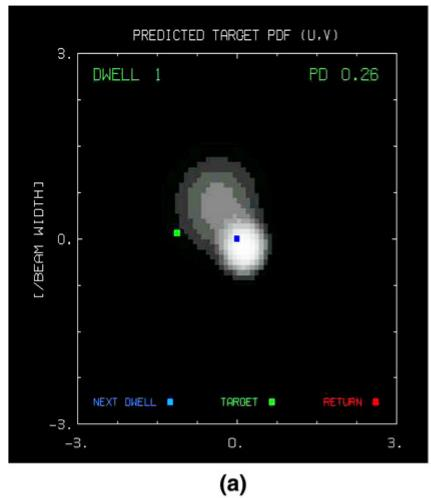

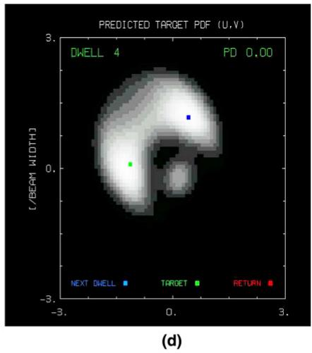

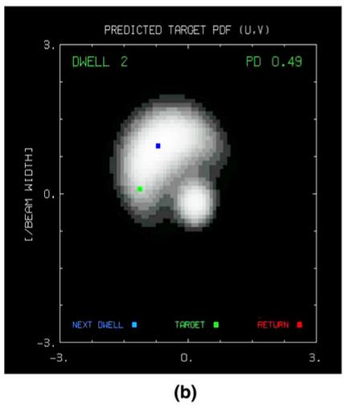

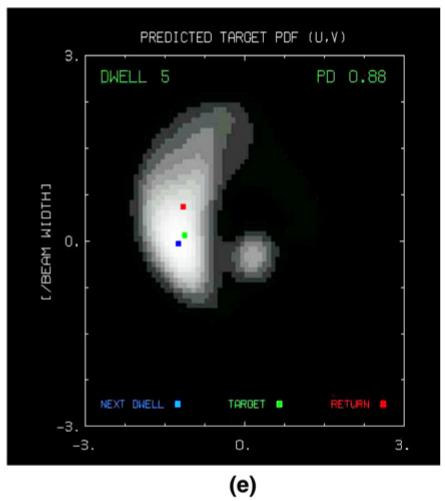

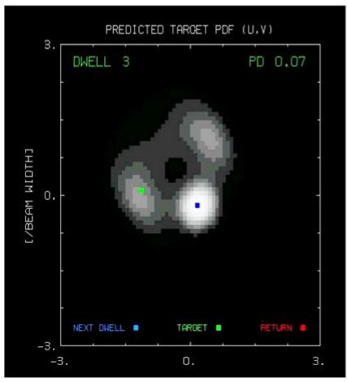

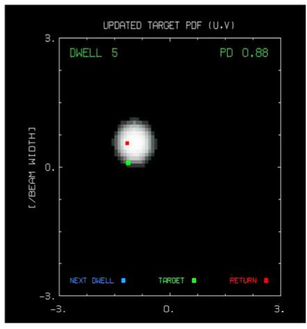  
Fig. 4. Bayesian local search (exploitation of -negative evidence).

## 4. -Negative evidence in GMTI tracking

Airborne GMTI radar provides estimates of the kinematical parameters of ground moving vehicles along with related measurement errors and certain technical sensor parameters (GMTI: Ground Moving Target Indicator). In such applications the phenomenon of Doppler blindness occurs as a direct consequence of the GMTI clutter notch. It can be interpreted in terms of -negative evidence in the sense of the previous discussion. In our discussion we stress its particular relevance to sensor fusion for ground surveillance and sensor scheduling.

## 4.1. GMTI detection model

Even after platform motion compensation by STAP filtering low-Doppler targets can be masked by the clutter notch of the GMTI radar [10]. Let $\mathbf { e } _ { k } ^ { p } = ( \mathbf { r } _ { k } - \mathbf { p } _ { k } ) / | \mathbf { r } _ { k } - \mathbf { p } _ { k } |$ denote the unit vector pointing from the platform position $\mathbf { p } _ { k }$ at time $t _ { k }$ to the target at the position $\mathbf { r } _ { k }$ moving with the velocity $\dot { \mathbf { r } } _ { k } .$ The kinematical target state is thus given by $\mathbf { x } _ { k } = ( \mathbf { \widetilde { r } } _ { k } ^ { \top } , \mathbf { \dot { r } } _ { k } ^ { \top } ) ^ { \top }$ . Doppler blindness occurs if the radial velocities of the target as well as of the surrounding main-lobe clutter return are identical, i.e. if the function

$$
h _ { n } ( \mathbf { r } _ { k } , \dot { \mathbf { r } } _ { k } ; \mathbf { p } _ { k } ) = \frac { \left( \mathbf { r } _ { k } - \mathbf { p } _ { k } \right) ^ { \top } \dot { \mathbf { r } } _ { k } } { \left| \mathbf { r } _ { k } - \mathbf { p } _ { k } \right| }\tag{ð28Þ}
$$

is close to zero. In other words, $h _ { \mathrm { c } } ( \mathbf { x } _ { k } ; \mathbf { p } _ { k } ) \approx 0$ holds if the targets velocity vector is nearly perpendicular to the sensor-to-target line-of-sight. For this reason, the equation $h _ { \mathrm { c } } ( \mathbf { x } _ { k } ; \mathbf { p } _ { k } ) = 0$ defines the location of the GMTI clutter notch in the state space of a ground target and as such reflects a fundamental physical/technical fact without implying any further modeling assumptions. The detection model must thus reflect the following phenomena:

1. The detection probability $P _ { \mathrm { { D } } }$ depends on the target state and the sensor/target geometry.

2. $P _ { \mathrm { { D } } }$ is small in a certain region around the clutter notch characterized by the Minimum Detectable Velocity (MDV), being an important sensor parameter, which must enter into the tracking process.

3. Far from the clutter notch, the detection probability depends only on the directivity pattern of the sensor and the target range.

4. There exists a narrow transient region between these two domains.

This qualitative discussion of the observed detection phenomena related to the GMTI clutter notch is very similar to that of resolution effects in Section 2. For the same reasons as before, the following simple model for the detection probability reflecting the current sensor-to-target geometry seems to be reasonable and reflects the basic underlying physical/technical facts [12,15]:

$$
\begin{array} { r } { P _ { \mathrm { D } } ( \mathbf { x } _ { k } ; \mathbf { p } _ { k } ) = P _ { \mathrm { d } } \bigg ( 1 - \mathrm { e } ^ { - ( \log 2 ) \big ( \frac { h _ { n } ( \mathbf { x } _ { k } ; \mathbf { p } _ { k } ) } { \mathrm { M D V } } \big ) ^ { 2 } } \bigg ) } \end{array}\tag{ð29Þ}
$$

$$
\begin{array} { r } { = P _ { \mathrm { d } } - P _ { \mathrm { d } } ^ { n } \mathcal { N } ( 0 ; h _ { n } ( \mathbf { x } _ { k } ; \mathbf { p } _ { k } ) , R _ { n } ) ) , } \end{array}\tag{ð30Þ}
$$

with $P _ { \mathrm { d } } ^ { n }$ and a related -variance $R _ { n }$ given by

$$
P _ { \mathrm { d } } ^ { n } = P _ { \mathrm { d } } \sqrt { 2 \pi R _ { n } } \quad \mathrm { a n d } \quad R _ { n } = { \bf M D V } ^ { 2 } / ( 2 \log 2 ) .\tag{ð31Þ}
$$

## 4.2. GMTI-specific likelihood function

According to the introductory discussion, the filtering update is driven by the likelihood function. Under standard assumptions well-accepted in the literature [4,11] (false returns being uniformly distributed in the sensors field of view and Poisson distributed in number, Gaussian measurement errors), the likelihood is given by the following expression (single vehicle, mild residual clutter density $\rho _ { \mathrm { F } } , m _ { k }$ plots in each sensor scan $Z _ { k } = \{ \mathbf { z } _ { k } ^ { j } \} _ { j = 1 } ^ { m _ { k } } ) :$

$$
p ( Z _ { k } , m _ { k } | \mathbf { x } _ { k } ) = ( 1 - P _ { \mathrm { D } } ( \mathbf { x } _ { k } ; \mathbf { p } _ { k } ) ) \rho _ { \mathrm { F } } + P _ { \mathrm { D } } ( \mathbf { x } _ { k } ; \mathbf { p } _ { k } )
$$

$$
\times \sum _ { j = 1 } ^ { m _ { k } } \mathcal { N } ( \mathbf { x } _ { k } ; \mathbf { h } ( \mathbf { x } _ { k } ) , \mathbf { R } )\tag{ð 32Þ}
$$

$$
\begin{array} { r } { = p _ { 0 } ( Z _ { k } , m _ { k } | \mathbf { x } _ { k } ) + p _ { n } ( Z _ { k } , m _ { k } | \mathbf { x } _ { k } ) , } \end{array}\tag{ð33Þ}
$$

where $p _ { 0 } = p _ { 0 } ( Z _ { k } , m _ { k } | \mathbf { x } _ { k } )$ denotes the standard likelihood without considering clutter notches:

$$
p _ { 0 } = ( 1 - P _ { \mathrm { d } } ) \rho _ { \mathrm { F } } + P _ { \mathrm { d } } \sum _ { j = 1 } ^ { m _ { k } } \mathcal { N } ( \mathbf { x } _ { k } ; \mathbf { h } ( \mathbf { x } _ { k } ) , \mathbf { R } ) ,\tag{ð34Þ}
$$

while $p _ { n } = p _ { n } ( Z _ { k } , m _ { k } | \mathbf { x } _ { k } )$ is the part of the overall likelihood function characteristic of the GMTI problem:

$$
\begin{array} { l } { { \displaystyle p _ { n } = \rho _ { \mathrm { F } } P _ { \mathrm { d } } ^ { n } { \mathcal { N } } ( 0 ; h _ { n } ( \mathbf { x } _ { k } ; \mathbf { p } _ { k } ) , R _ { n } ) - P _ { \mathrm { d } } ^ { n } } \ ~ } \\ { { \displaystyle ~ \times \sum _ { j = 1 } ^ { m _ { k } } { \mathcal { N } } ( \mathbf { z } _ { k } ^ { n i } ; \mathbf { h } _ { n } ( \mathbf { x } _ { k } ; \mathbf { p } _ { k } ) , \mathbf { R } _ { n } ) } , } \end{array}\tag{ð35Þ}
$$

where the quantities $\mathbf { z } _ { k } ^ { n i } , \mathbf { h } _ { n } ( \mathbf { x } _ { k } ; \mathbf { p } _ { k } )$ , and $\mathbf { R } _ { n }$ are given by

$$
\begin{array} { r } { \mathbf { z } _ { k } ^ { n i } = \left( \mathbf { z } _ { k } ^ { j } \right) , \mathbf { h } _ { n } ( \mathbf { x } _ { k } ; \mathbf { p } _ { k } ) = \left( \begin{array} { c } { \mathbf { h } ( \mathbf { x } _ { k } ) } \\ { h _ { n } ( \mathbf { x } _ { k } ; \mathbf { p } _ { k } ) } \end{array} \right) , \mathbf { R } _ { n } = \left( \begin{array} { c c } { \mathbf { R } } & { \mathbf { O } } \\ { \mathbf { O } } & { R _ { n } } \end{array} \right) . } \end{array}\tag{ð36Þ}
$$

## 4.3. Update by exploiting -negative evidence

By using the predicted density $p ( \mathbf { x } _ { k } | \mathcal { Z } ^ { k - 1 } )$ and the likelihood function $p ( Z _ { k } , m _ { k } | \mathbf { x } _ { k } )$ introduced above the filtering step is performed according to Bayes rule:

$$
p ( \mathbf { x } _ { k } | Z _ { k } , m _ { k } , \mathcal { X } ^ { k - 1 } ) = \frac { p ( Z _ { k } , m _ { k } | \mathbf { x } _ { k } ) p ( \mathbf { x } _ { k } | \mathcal { X } ^ { k - 1 } ) } { \int \mathrm { d } \mathbf { x } _ { k } p ( Z _ { k } , m _ { k } | \mathbf { x } _ { k } ) p ( \mathbf { x } _ { k } | \mathcal { X } ^ { k - 1 } ) } .\tag{ð37Þ}
$$

Evidently, the likelihood depends on the sensor data, the sensor models functional form and sensor parameters. A first order Taylor-expansions of the non-linear functions $\mathbf { h } ( \mathbf { x } _ { k } )$ and $h _ { n } ( \mathbf { x } _ { k } ; \mathbf { p } _ { k } )$ around the predicted target state ${ \bf X } _ { k | k - 1 }$ yields:

$$
\begin{array} { r } { \mathbf { h } ( \mathbf { x } _ { k } ) \approx \mathbf { h } ( \mathbf { x } _ { k \left| k - 1 \right. } ) + \mathbf { H } _ { k } ( \mathbf { x } _ { k \left| k - 1 \right. } ; \mathbf { p } _ { k } ) [ \mathbf { x } _ { k } - \mathbf { x } _ { k \left| k - 1 \right. } ] , } \end{array}\tag{ð38Þ}
$$

$$
\begin{array} { r } { h _ { n } ( \mathbf { x } _ { k } ; \mathbf { p } _ { k } ) \approx h _ { n } ( \mathbf { x } _ { k | k - 1 } ; \mathbf { p } _ { k } ) + \mathbf { H } _ { n } ( \mathbf { x } _ { k | k - 1 } ; \mathbf { p } _ { k } ) [ \mathbf { x } _ { k } - \mathbf { x } _ { k | k - 1 } ] . } \end{array}\tag{ð39Þ}
$$

With this approximation the likelihood function proves to be a Gaussian Mixture. Explicitly the ficticious measurement matrix $ { \mathbf { H } } _ { n } (  { \mathbf { x } } _ { k | k - 1 } ;  { \mathbf { p } } _ { k } )$ is given by

$$
\mathbf { H } _ { n } ( \mathbf { x } _ { k | k - 1 } ; \mathbf { p } _ { k } ) = { \frac { { \widehat { \otimes } } h _ { n } } { { \widehat { \otimes } } \mathbf { x } _ { k } } } { \bigg | } _ { \mathbf { x } _ { k } = \mathbf { x } _ { k | k - 1 } }\tag{ð40Þ}
$$

$$
= \left( \frac { \dot { \mathbf { r } } _ { k | k - 1 } ^ { \top } - ( \mathbf { e } _ { k | k - 1 } ^ { p \top } \dot { \mathbf { r } } _ { k | k - 1 } ) \mathbf { e } _ { k | k - 1 } ^ { p \top } } { | \mathbf { r } _ { k | k - 1 } - \mathbf { p } _ { k } | } , \mathbf { e } _ { k | k - 1 } ^ { p \top } \right) ,\tag{ð41Þ}
$$

with $\mathbf { e } _ { k | k - 1 } ^ { p } = { \frac { \mathbf { r } _ { k | k - 1 } - \mathbf { p } _ { k } } { | \mathbf { r } _ { k | k - 1 } - \mathbf { p } _ { k } | } } .$

ð42Þ

This particular structure of the approximated likelihood function makes the mathematical treatment of the filtering update tractable. Also here $p ( \mathbf { x } _ { k } | \mathcal { Z } ^ { k } )$ proves to be a Gaussian mixture. For the same reasons as in case of tracking a possible unresolved group target (Section 2) we have to be aware of possibly negative mixture coefficients. This reflects the fact that in case of a detection the target must have a certain minimum distance from the clutter notch. Otherwise it could not have been detected at all. Nevertheless also the possibly negative coefficients sum up to one. The density $\bar { p ( \mathbf { x } _ { k } | \mathcal { L } ^ { k } ) }$ is well-defined.

Following the spirit of the techniques used in standard PDA or IMM methods [4], the number of mixture components can be kept under control.

## 4.4. Fusion of -negative sensor evidence

From the previous discussion it becomes evident, the -negative sensor evidence, i.e. the lack of an expected sensor measurement, can convey information on the kinematical state of the target: the target seems to move in such a way that it is buried in the clutter notch. According to the

GMTI specific part of the likelihood function (Eq. (32)) this information is equivalent to an abstract ficticious measurement, which at least provides some information. As the measured quantity $h _ { n } ( \mathbf { x } _ { k } ; \mathbf { p } _ { k } )$ explicitly depends on the current platform position, we expect that the fusion of this ficticious, abstract measurement from sensors at different platform positions $\mathbf { p } _ { k } ^ { i }$ will help to detect stopping targets. One might view this a form $\mathrm { o f } ^ { \cdot }$ triangulation with -negative evidence.

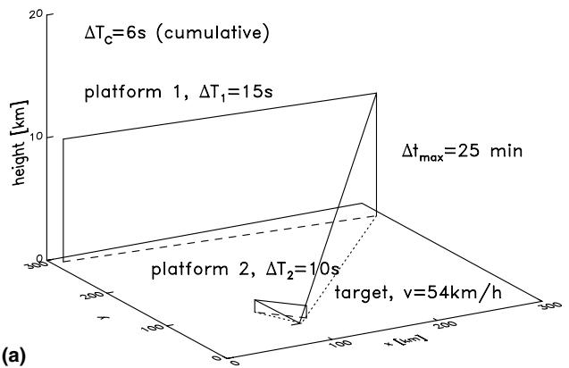

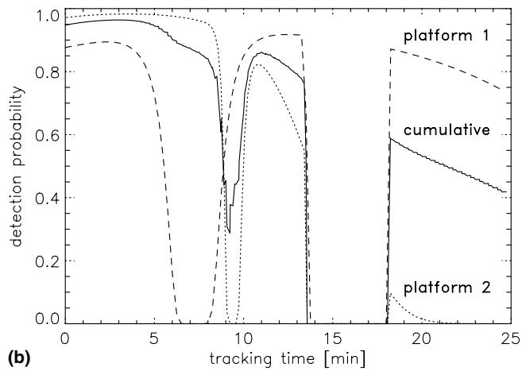

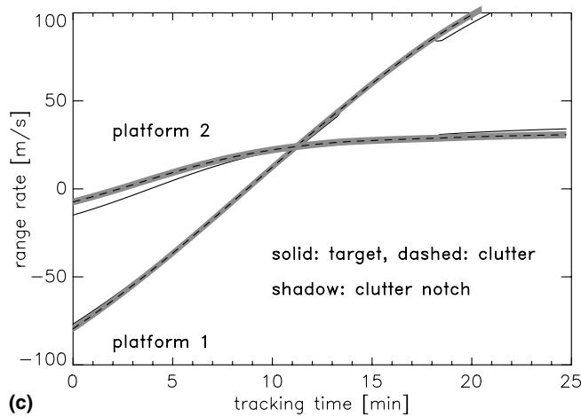  
Fig. 5. Simplified scenario for GMTI tracking: (a) target and sensor platforms, (b) detection probability and (c) radial velocity (ground, target).

## 4.4.1. Scenario

Let us consider a simplified example typical of ground surveillance. Fig. 5a shows two airborne sensor platforms observing a ground moving target (stand-off surveillance, gap-filling mission). The revisit intervals are 15 and 10 s, respectively. Fig. 5b shows the detection probability for both sensor platforms as a function of the tracking time. In both cases the detection probability shows a deep notch. In the second part of the time axis $P _ { \mathrm { { D } } }$ is zero for both sensors over several minutes. This behavior is explained by Fig. 5c showing the radial velocities of the target and the main-lobe clutter for both sensor platforms. When both radial velocities are identical, the target can not be separated from the ground by Doppler processing. For a centralized fusion architecture we obtain a mean cumulative revisit interval of 6 s.

The mean cumulative revisit interval $\Delta T _ { \mathrm { c } } =$ $\begin{array} { r } { \big ( \sum _ { i = 1 } \Delta T _ { i } ^ { - 1 } \big ) ^ { - 1 } } \end{array}$ results from the individual revisit intervals $\Delta T _ { i }$ of the sensors. Here we have $\Delta T _ { \mathrm { c } } = 6 \ : \mathrm { s }$ . The mean cumulative detection probability $P _ { \mathrm { ~ D ~ } } ^ { c }$ referring to $\Delta T _ { \mathrm { c } }$ is given by $\begin{array} { r } { P _ { \mathrm { D } } ^ { c } = 1 - \prod _ { i = 1 } ( 1 - P _ { \mathrm { D } } ^ { i } ) ^ { \Delta T _ { \mathrm { c } } / \Delta T _ { i } } } \end{array}$ with $P _ { \mathrm { ~ D ~ } } ^ { i }$ denoting the detection probabilities of the individual sensors, which depend on the corresponding sensor-to-target geometries. Evidently, the corresponding revisit intervals $\Delta T _ { i }$ enter into this overall detection performance to be expected by sensor data fusion. The larger $\Delta T _ { i } ,$ the smaller is the effect of sensor i on the collective performance, even if $P _ { \mathrm { ~ D ~ } } ^ { i }$ is large. $\Delta T _ { \mathrm { c } }$ and $P _ { \mathrm { ~ D ~ } } ^ { c }$ are averaged quantities, by which the expected performance improvement can be predicted in an overall sense. The solid line in Fig. 5b denotes the mean cumulative detection probability with reference to cumulative revisit interval for the example discussed.

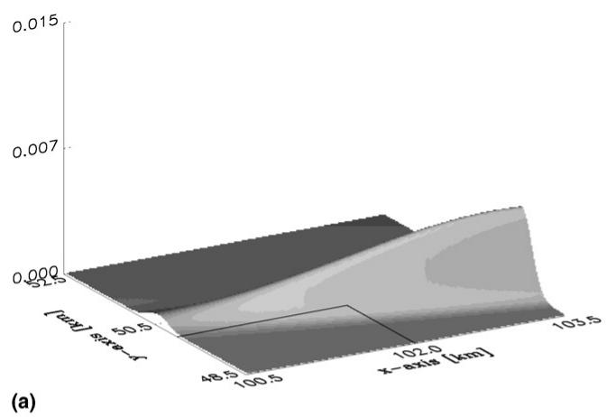

After about 14 min the target stops for several minutes. For this reason it is invisible to both GMTI sensors. The early detection of a stopping event can be of military interest as it might initiate a sensor request for a spot-light SAR picture (sensor scheduling) in which a stationary scene can be analyzed.

## 4.4.2. Discussion

The probability densities shown in Fig. 6a and b are related to the position of the single vehicle (Cartesian ground coordinates) and have been calculated at a time when the target has stopped for several minutes (see Fig. 5a). The density in Fig. 6a is based on the processing of data from sensor 1 (including -negative evidence in the above sense), while in Fig. 6b data from sensor 2 only have been processed. Evidently, the dissipation of both density functions is confined to a particular direction as a consequence of processing -negative sensor evidence. I.e. instead of actual sensor data the very information that several successively missing detections occurred was processed. This event provides a hint to the filter that the kinematical target state probably obeys a certain relation determined by the clutter notch. Apparently, this piece of evidence proves to be as valuable as a measurement of one of the abstract components of the target state. The exploitation of the GMTI sensor model can thus be considered as some kind of information fusion. In the situation previously discussed the densities are slightly rotated against each other. We thus expect that their combination will provide some -fusion gain. Fig. 6c shows the probability density obtained by sensor data fusion. We observe a significant fusion gain. It is a consequence of the different orientation of the density functions and leads to improved state estimates. In the present example the orientation of the densities is only slightly different. An even higher gain would be observed in case of an -orthogonal intersection of the target pdfs. Since the target stopped for 3 min, this result is particularly remarkable. Though no sensor data are available from both sensors, the very fusion of the sensor output -target under track is no longer detected implies an improved target localization. As no -sensor data in a proper sense are involved, this result is also due to information fusion and a direct consequence of the different target/sensor geometries.

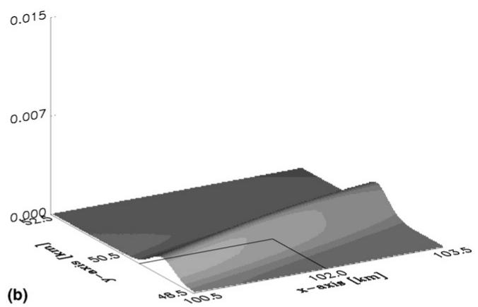

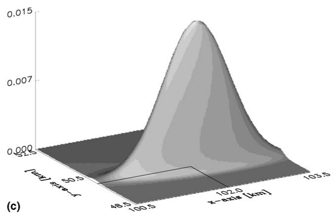  
Fig. 6. GMTI tracking (fusion of -negative evidence): (a) sensor 1 (stand-off), (b) sensor 2 (gap-filling) and (c) fusion result.

## 5. -Negative evidence and jamming

The degrees of freedom available in phased-array radar applications enable main-lobe jammer suppression by adaptive array processing techniques [18]. Following the spirit of the previous discussions the current position of the resulting jammer notch as well as information on the distribution of the related monopulse measurements [18] can be incorporated into a more sophisticated sensor performance model of a fighter radar, for example.

By this approach more detailed a priori information on the sensor specific properties can be exploited also at the tracking level; in particular expected but missing sensor information can be interpreted as negative evidence in terms of ficticious measurements. This does not only improve target tracking in the vicinity of a jammer notch in terms of a shorter extraction delay, improved track accuracy/continuity, e.g. for tracking an attacking missile. It also has strong impact on strategies for adaptive sensor control. For details see [19].

The sensor model is based on an expression for the signal-to-noise + jammer ratio after completing the signal processing chain. The following simple formula seems to mirror all relevant phenomena observed:

$$
\begin{array} { r } { \mathrm { S N J R } ( \mathbf { d } _ { k } , r _ { k } ; \mathbf { b } _ { k } , \mathbf { j } _ { k } ) = \mathrm { S N R } ( \mathbf { d } _ { k } , r _ { k } ) \times \mathrm { e } ^ { - ( \log 2 ) | \mathbf { d } _ { k } - \mathbf { b } _ { k } | ^ { 2 } / b ^ { 2 } } } \\ { \times \left( 1 - \mathrm { e } ^ { - ( \log 2 ) | \mathbf { d } _ { k } - \mathbf { j } _ { k } | ^ { 2 } / j ^ { 2 } } \right) , \quad \quad } \end{array}\tag{ð43Þ}
$$

$$
\mathrm { S N R } ( \mathbf { d } _ { k } , r _ { k } ) = \mathbf { S N R } _ { 0 } \bigg ( \frac { r _ { k } } { r _ { 0 } } \bigg ) ^ { - 4 } D ( \mathbf { d } _ { k } ) .\tag{ð44Þ}
$$

The vectors $\mathbf { b } _ { k }$ and $\mathbf { j } _ { k }$ denote the angular position of the current beam and the jammer, respectively (assumed to be known). b is a measure of the beam width, while j indicates the width of the jammer notch produced by adaptive nulling. The matrix $\mathbf { H } _ { d }$ extracts the targets direction $\begin{array} { r l } { \mathbf { x } _ { k } . } & { { } D ( \mathbf { H } _ { d } \mathbf { x } _ { k } ) } \end{array}$ reflects the antennas directivity pattern.

In case of Swerling I fluctuations of the targets radar cross section and for a simple detection model, the detection probability is a function of $\mathbf { x } _ { k } , \mathbf { b } _ { k } ,$ and $\mathbf { j } _ { k } \colon$

$$
P _ { \mathrm { d } } ( \mathbf { x } _ { k } ; \mathbf { b } _ { k } , \mathbf { j } _ { k } ) = P _ { \mathrm { F A } } ^ { \frac { 1 } { 1 + \mathrm { S N J R } ( \mathbf { x } _ { k } ; \mathbf { b } _ { k } , \mathbf { j } _ { k } ) } } .\tag{ð45Þ}
$$

$P _ { \mathrm { d } }$ can be approximated by using Gaussians linearly depending on the target state and enter into a likelihood function analogous to Eq. (32). The filtering is as sketched above.

## 6. Summary and conclusions

From our discussion of selected examples several conclusions can be drawn.

We observed that missing but expected (i.e. -negative) sensor data can convey information on the current target position or a more abstract function of the kinematical target state. This type of -negative evidence can be included in data fusion within the rigorous Bayesian structure—there is no need for recourse to ad hoc or empirical schemes.

The prerequisite for processing -negative evidence is a refined sensor model, which provides additional background information for explaining its data. As a consequence, -negative evidence often appears as an artificial sensor measurement, characterized by a corresponding measurement matrix and a measurement error covariance. The particular form of the ficticious measurement equation involved to be used is determined by the underlying model of the sensor performance, while the ficticious measurement error covariance is characterized by sensor parameters such as sensor resolution, radar beam width, or minimum detectable velocity.

-Negative evidence implies well-defined pdfs of the target states that prove to be Gaussian mixtures with possibly negative coefficients summing up to one. Intuitively speaking, these components reflect that the targets keep a certain distance from each other, from the last beam position, or the clutter/jammer notch. If the ficticious measurement depends on the underlying sensor-to-target geometry, we can introduce -triangulation with -negative evidence in some sense.

We in particular observed benefits of processing -negative sensor evidence for improving tracking of possibly unresolved group targets, local search for IMM-tracking (ESA radar), early detection of stopping ground targets, and tracking in case of radar with adaptive nulling.

## References

[1] W. Koch, On -negative information in tracking and sensor data fusion: discussion of selected examples, in: Proceedings of the Seventh International Conference on Information Fusion (FUSION 2004), Stockholm, Sweden, July 2004, pp. 91–98.

[2] K.J.S. Agate, Utilizing negative information to track ground vehicles through move-stop-move cycles, in: Proceedings of Signal Processing, Sensor Fusion, and Target Recognition XIII, vol. 5429, SPIE, Orlando, FL, 2004.

[3] H. Sidenbladh, Multi-target particle filtering for the probability hypothesis density, in: Proceedings of the Seventh International Conference on Information Fusion (FUSION 2003), Cairns, Australia, 2003, pp. 800–806.

[4] Y. Bar-Shalom, X.-R. Li, T. Kirubarajan, Estimation with Applications to Tracking and Navigation, Wiley & Sons, 2001.

[5] S. Blackman, R. Populi, Design and Analysis of Modern Tracking Systems, Artech House, 1999.

[6] K.C. Chang, Y. Bar-Shalom, Joint probabilistic data association for multitarget tracking with possibly unresolved measurements and maneuvers, IEEE Transactions on Automatic Control AC 29 (7) (1984) 585–594.

[7] F.E. Daum, R.J. Fitzgerald, The importance of resolution in multiple target tracking, in: Proceedings of SPIE 2235, Signal & Data Processing of Small Targets, vol. 329, 1994.

[8] G. van Keuk, S. Blackman, On phased-array tracking and parameter control, IEEE Transactions on Aerospace and Electronic Systems (AES) 29 (1) (1993).

[9] T. Kirubarajan, Y. Bar-Shalom, W.D. Blair, G.A. Watson, IMMP-DAF solution to benchmark for radar resource allocation and tracking targets in the presence of ECM, IEEE Transactions on Aerospace and Electronic Systems (AES) 35 (4) (1998).

[10] R. Klemm, Principles of Space–Time Adaptive Processing, IEE Publishers, London, UK, 2002.

[11] W. Koch, Target tracking, in: S. Stergiopoulos (Ed.), Advanced Signal Processing Handbook: Theory and Applications for Radar, Sonar, and Medical Imaging Systems, CRC Press, 2000 (Chapter 8).

[12] W. Koch, GMTI-tracking and information fusion for ground surveillanceProceedings of Signal & Data Processing of Small Targets, vol. 4473, SPIE, San Diego, 2001, pp. 381–393.

[13] W. Koch, On adaptive parameter control for phased-array tracking, in: Proceedings of Signal & Data Processing of Small Targets, vol. 3809, SPIE, Denver, USA, 1999, pp. 444–455.

[14] W.m. Koch, On Bayesian MHT for formations with possibly unresolved measurements—quantitative results, in: Proceedings of SPIE 3163, Signal and Data Processing of Small Targets, vol. 417, 1997.

[15] W. Koch, R. Klemm, -Ground target tracking with STAP radar, in: IEE Proceedings Radar, Sonar and Navigation Systems, Special Issue: Modeling and Simulation of Radar Systems, 2001, vol. 148 (3), invited paper.

[16] W. Koch, G. van Keuk, Multiple hypothesis track maintenance with possibly unresolved measurements, IEEE Transactions on Aerospace and Electronic Systems (AES) 33 (2) (1997).

[17] S. Mori, C.-Y. Chong, E. Tse, R.P. Wishner, Tracking and classifying multiple targets without a priori identification, IEEE Transactions on Automatic Control, AC-31 401 (1986).

[18] U. Nickel, Performance measure for monopulse with space–time adaptive processing, in: Proceedings of the RTO-SET Symposium on Target Tracking and Data Fusion for Military Observation Systems, Budapest, October 2003.

[19] W. Blanding, W. Koch, U. Nickel, On adaptive phased-array tracking in presence of main-lobe jammer suppression, FGAN-FKIE Research Report Nr. 97 (available from the author). To be presented at SPIE Signal and Data Processing of Small Targets (SPIE SMT 2006), April 17–21, 2006, Orlando, FL, USA.

[20] B. Ristic, S. Arulampalam, N. Gordon, Beyond the Kalman Filter: Particle Filters for Tracking Applications, Artech House Radar Library, 2004.

[21] D. Salmond, N. Gordon, Group tracking with limited sensor resolution an a finite field of view, Signal & Data Processing of Small Targets, vol. 4048, SPIE, 2000, pp. 532–540.

[22] P.W. Sarunic, R.J. Evans, Adaptive update rate tracking using IMM nearest neighbour algorithm incorporating rapid re-looks, in: IEE Proceeding on Radar, Sonar, and Navigation, vol. 144 (4), 1997.