# On coverage issues in directional sensor networks: A survey

M. Amac Guvensan ⇑ , A. Gokhan Yavuz

Department of Computer Engineering, Yildiz Technical University, Istanbul, Turkey

## a r t i c l e i n f o

Article history:   
Received 21. September 2010   
Received in revised form 11 February 2011   
Accepted 15 February 2011   
Available online 22 February 2011

Keywords:   
Directional sensor networks   
Coverage   
Field of view   
Working direction   
Network lifetime   
Motility   
Mobility

## a b s t r a c t

The coverage optimization problem has been examined thoroughly for omni-directional sensor networks in the past decades. However, the coverage problem in directional sensor networks (DSN) has newly taken attraction, especially with the increasing number of wireless multimedia sensor network (WMSN) applications. Directional sensor nodes equipped with ultrasound, infrared, and video sensors differ from traditional omni-directional sensor nodes with their unique characteristics, such as angle of view, working direction, and line of sight (LoS) properties. Therefore, DSN applications require specific solutions and techniques for coverage enhancement. In this survey article, we mainly aim at categorizing available coverage optimization solutions and survey their problem definitions, assumptions, contributions, complexities and performance results. We categorize available studies about coverage enhancement into four categories. Target-based coverage enhancement, area-based coverage enhancement, coverage enhancement with guaranteed connectivity, and network lifetime prolonging. We define sensing models, design issues and challenges for directional sensor networks and describe their (dis)similarities to omni-directional sensor networks. We also give some information on the physical capabilities of directional sensors available on the market. Moreover, we specify the (dis)advantages of motility and mobility in terms of the coverage and network lifetime of DSNs.

\- 2011 Elsevier B.V. All rights reserved.

## 1. Introduction

Research on wireless sensor networks (WSNs) becomes more popular nowadays, since more powerful embedded platforms with high capabilities are being designed at rapidly decreasing costs. Moreover, multimedia capability has been added to sensor nodes with the improvement on micro electro mechanical systems (MEMS) [1]. Thus, researchers have recently started to work on wireless multimedia sensor networks and discuss their difficulties and problems. Directionality is one of those problems. Not only video sensors but also ultrasound and infrared sensors sense based on the directional sensing model. Both directional sensing and directional communication directly affect the coverage, the network connectivity, and the network lifetime.

The coverage issue is a fundamental problem for wireless sensor networks. There are extensive number of studies about the coverage problem in omni-directional sensor networks [2–5]. However, coverage optimization in directional sensor networks has newly taken attraction of the research community. Since traditional sensor networks assume the omni-directional sensing model, solutions for WSNs do not overcome difficulties of directional sensor nodes, such as angle of view, directionality, and LoS. Ma and Liu [6] have presented the concept of directional sensor network and have primarily discussed coverage problems of DSNs. They also proposed a method to solve the connectivity problem for randomly deployed sensors under the directional communication model.

Directional sensor nodes work in a specified direction at a given time t. They may adjust their working direction based on the requirements of the application. This ability of the node is called motility. Coverage enhancing methods exploit motility to minimize the occlusion and overlapped regions. On the other hand, due to limited battery capacity of sensor nodes, prolonging the network lifetime is the secondary goal of researchers who primarily aim at maximizing coverage in DSNs. Extending the network lifetime can be achieved via putting redundant sensors to sleep.

This article discusses directional sensing models for 2D and 3D, the characteristics of DSNs, and available coverage approaches in the literature for DSNs. In Section 2, we introduce real-world directional sensors and present their physical metrics. In Section 3, we discuss sensing models and present directional sensing capabilities. Section 4 discusses the design issues and challenges of DSNs. The terminology for directional sensor networks is also given in this section. In Section 5, we give coverage enhancement principles and explain their pros and cons. In Section 6, we first categorize the existing studies into four groups, and then survey each group in terms of problem definition, assumptions, complexities and performance results.

## 2. Directional sensors

In this section, we will introduce real-world directional sensors and present their physical metrics. Directional sensors do mainly include video sensors, infrared sensors, and ultrasound sensors.

## 2.1. Video sensors

Video sensors collect visual information from the physical environment to monitor the region of interest. Several wireless multimedia sensor nodes have been designed recently, and almost all of them do have video sensors on them. These sensors basically depend either on the Charge-Coupled Device technology (CCD) or on the Complementary Metal–Oxide–Semiconductor (CMOS) imaging technology. CMOS imaging technology enables the integration of lens, image sensor, and image compression and processing technology into a single chip, whereas the camera modules using CCD technology are larger, heavier, and costly [7].

Before presenting the physical metrics of available video sensors we will briefly describe the camera terminology [8] which slightly differs from the terminology of the directional sensing model. In optics, the depth of field (DoF) represents the portion of a scene that appears sharp in the image. To characterize the DoF of a camera, the following lens parameters need to be explained.

Focal Length (f). For a convex lens, all parallel rays will be focused to a point referred to as the principal focal point. The distance from the lens to that point is the principal focal length f of the lens.

Focus Distance (s). s describes the distance between the camera and the point on which the camera is focused.

Aperture. An aperture is a hole or an opening through which light travels to the lens. The size of the aperture stop is one factor that affects the DoF. Smaller stops (larger f numbers) produce a longer DoF, allowing objects at a wide range of distances to be in focus at the same time.

f-number (N). f-number is the diameter of the entrance pupil in terms of the focal length and is often notated as N. N is calculated by the division of the focal length(f) to the effective aperture diameter (d) as shown in Eq. (1).

$$
N = { \frac { f } { d } } .\tag{ð1Þ}
$$

Circle of Confusion (c). c is used to determine the DoF, the part of an image that is acceptably sharp. Thus, the DoF can be expressed as the region where the c is less than the resolution of the human eye.

Hyperfocal Distance (H). The hyperfocal distance is the closest distance at which a lens can be focused while keeping objects at infinity acceptably sharp, that is the focus distance with the maximum DoF.

Hyperfocal distance (H), near distance of acceptable sharpness $( D _ { n } )$ , and far distance of acceptable sharpness (Df) are calculated using the following equations:

$$
H = \frac { f ^ { 2 } } { N c } + f ,\tag{ð2Þ}
$$

$$
D _ { n } = \frac { s ( H - f ) } { H + s - 2 f } ,\tag{ð3Þ}
$$

$$
D _ { f } = \frac { s ( H - f ) } { H - s } .\tag{ð4Þ}
$$

Angle of View (AoV). A camera’s angle of view can be measured horizontally, vertically, and diagonally. To compute the angle of view of the camera, we exploit the focal length (f) and the dimensions $( d , h , \nu )$ of the image sensor. Eqs. $( 5 ) - ( 7 )$ are used for the calculation of the horizontal, vertical, and diagonal angle of view of a camera. Note that, in several datasheets and references, the field of view (FoV) term denotes the AoV of the camera.

$$
\alpha _ { h } = 2 \arctan \frac { h } { 2 f } ,\tag{ð5Þ}
$$

$$
\alpha _ { \upsilon } = 2 \arctan \frac { \upsilon } { 2 f } ,\tag{ð6Þ}
$$

$$
\alpha _ { d } = 2 \arctan \frac { d } { 2 f } .\tag{ð7Þ}
$$

An analysis of the above mentioned parameters yields that $D _ { f }$ of a lens represents the sensing radius (R ), whereas the AoV of a camera stands for the AoV in the directional sensing model. However in real-world applications, the FoV of a video sensor should be defined, as shown in Fig. 1, since the acceptable sharpness can be obtained between the near and far point.

Let say we want to calculate the sensing radius and the AoV of a $1 / 3 "$ lens of the CMUCam3 video sensor[9]. Assuming that the lens parameters f, s, N, and c are equal to 50 mm, 50 m, 2.8 and 0.011 mm respectively, we can say that the sensing radius $R _ { s }$ is 132 m. However, the real field of view of the CMUCam3 is between 31 m and 132 m in terms of the camera terminology. On the other hand, in the datasheet of the CMUCam3, the horizontal, vertical and diagonal AoVs of the video sensor are given as 56, 42 and 70, respectively.

Available video sensor nodes usually use video sensors manufactured by Omnivision [10] and Agilent [11]. These companies have a large range of products. A short list of these products is given in Table 1. Note that, only parameters specific to video sensors are given in Table 1. These parameters were obtained from datasheets released by the respective manufacturers.

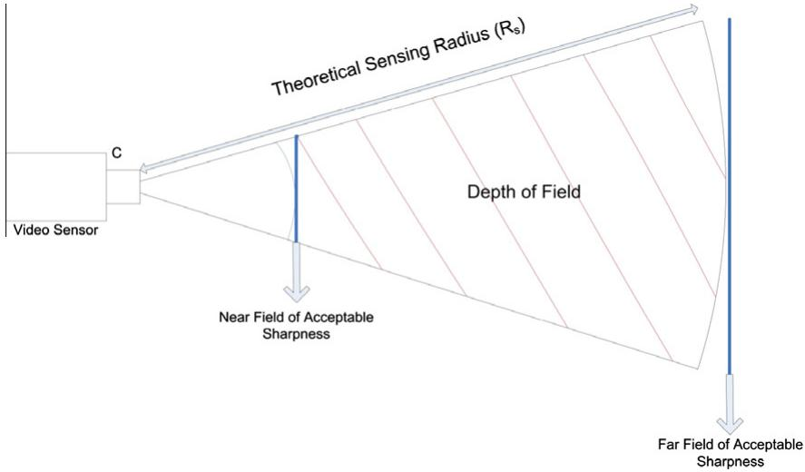  
Fig. 1. The DoF of a video sensor is defined between the near and the far field of acceptable sharpness. However, in video sensor applications, the region between the camera and the near field of acceptable sharpness is also included in the FoV.

## 2.2. Infrared sensors

An infrared (IR) sensor is an electronic device that emits and/or detects infrared radiation in order to sense some aspect of its surroundings. Infrared sensors can measure the heat of an object, as well as detect motion. There are several types of infrared sensors. A common type of infrared sensors, Passive Infrared Sensors (PIR), only measure infrared radiation, rather than emitting it. Infrared sensors, working as motion detectors, monitor the environment and report when a sudden change or movement in the field of view occurs. Reflective IR sensors use the IR light reflected from objects, whereas interrupter IR sensors detect the disconnection of the IR light caused by a passing object.

Infrared sensors can be categorized into three types in terms of their sensing radius, as shown in Table 2. shortrange IR sensors, mid-range IR sensors and long-range IR sensors.

A short list of commercially available IR sensors is given in Table 3. Table 3 includes both small size IR sensors placed on common motes and more powerful IR sensors for military applications.

Table 2  
IR sensors according to their sensing radius
<table><tr><td>Type of IR sensor</td><td>Short-range</td><td>Mid-range</td><td>Long-range</td></tr><tr><td>Reflective</td><td>&lt;4 cm</td><td>20 cm to 3 m</td><td>&gt;3 m</td></tr><tr><td>Interrupter</td><td>3mm</td><td>20 cm to 45 m</td><td>&gt;45 m</td></tr></table>

## 2.3. Ultrasound sensors

Ultrasonic sensors generate high frequency sound waves and evaluate the echo received back at the sensor. Ultrasonic sensors calculate the time interval between sending the signal and receiving the echo to determine the distance to an object. Ultrasonic sensors are often used on robots to build the region map, detect and avoid obstacles, and to navigate in the environment. Besides, these sensors may be used for measuring the size of objects and the amount of liquids in a box/tank, for the classification of objects based on their sizes, in park-assistance systems and car alarm mechanisms. There are several ultrasonic sensors with different sensing capabilities. A short list of ultrasonic sensors available on the market is given in Table 4.

Table 1  
A short list of video sensors.
<table><tr><td>Video sensor</td><td>Manufacturer</td><td>Platform</td><td>Image technology</td><td>Lens size</td><td>f-Number</td><td>Default resolution</td></tr><tr><td>ADCM-1700</td><td>Agilent</td><td>Mesheye</td><td>CMOS</td><td>N/A</td><td>2.8</td><td>352x288</td></tr><tr><td>ADCM-2650</td><td>Agilent</td><td>N/A</td><td>CMOS</td><td>N/A</td><td>2.8</td><td>480x640</td></tr><tr><td>ADCM-2700</td><td>Agilent</td><td>Mesheye</td><td>CMOS</td><td>N/A</td><td>N/A</td><td>640x480</td></tr><tr><td>OV6620</td><td>Omnivision</td><td>CMUCam3</td><td>CMOS</td><td>1/4&quot;</td><td>N/A</td><td>352x488</td></tr><tr><td>OV7620</td><td>Omnivision</td><td>CMUCam3</td><td>CMOS</td><td>1/3&quot;</td><td>N/A</td><td>640x480</td></tr><tr><td>0V9630</td><td>Omnivision</td><td>N/A</td><td>CMOS</td><td>1/3&quot;</td><td>N/A</td><td>1280x1024</td></tr></table>

N/A: Not available.

Table 3  
A short list of IR sensors.
<table><tr><td>IR sensor</td><td>Platform</td><td>Sensing radius (m)</td><td>Angle of view</td></tr><tr><td>Parallax PIR sensor [12]</td><td>Squid Bee Mote</td><td>4</td><td>60°</td></tr><tr><td>PIR sensor[ [13]</td><td>TTrio Mote</td><td>8</td><td>N/A</td></tr><tr><td>MP Motion sensor [14]</td><td>N/A</td><td>10</td><td>110°</td></tr><tr><td>Hydra PIR sensor (Type-I²) [15]</td><td>N/A</td><td>15</td><td>30°</td></tr><tr><td>Hydra PIR sensor  $\left( { \mathrm { T y p e - I I ^ { a } } } \right) \left[ 1 5 \right]$ </td><td>N/A</td><td>40</td><td>10°</td></tr><tr><td>Hydra PIR sensor (Type-II²) [15]</td><td>N/A</td><td>100</td><td>4°</td></tr></table>

N/A: Not available.  
a Powerful IR sensors for military applications.

Table 4  
A short list of ultrasonic sensors.
<table><tr><td>Ultrasound sensor</td><td>Manufacturer</td><td>Sensing radius (cm)</td><td>Angle of view (°)</td></tr><tr><td>Ultra-U family [16]</td><td>Senix</td><td>5-11</td><td>15</td></tr><tr><td>RU18-D90 family [17]</td><td>Riko</td><td>9</td><td>7</td></tr><tr><td>RU18-D160 family [17]</td><td>Riko</td><td>16</td><td>8</td></tr><tr><td>Ultrasonic sensor [18]</td><td>N/A</td><td>5</td><td>60</td></tr></table>

N/A: Not available.

## 3. Sensing models for directional sensors

Sensor nodes may have different types of sensors. Sensors, such as temperature, humidity, infrared, and video, are selected based on the requirements of the application[19]. There are several attributes for categorizing available sensors. One of them is the sensing model of the sensor. In the literature, sensing model has been defined as either to express the sensitivity or the capability of the sensor [20]. To prevent the confusion about the term ‘‘sensing model’’, we define two subcategories, shown in Fig. 2 for the sensing model. Mathematical sensing model and physical sensing model. The mathematical sensing model describes the sensitivity model [21] of the sensor. Theoretically, a sensor either covers a point or not. This simple model is called as the binary sensing model. Most of the researchers assume that sensors sense according to the binary model. However, a more realistic model, the probabilistic model, expresses the detection of a target within the sensing range of a sensor according to a probability function. Sensors, which sense according to a probabilistic model, may not detect the event, even if the event occurs within the sensing range (Rs).

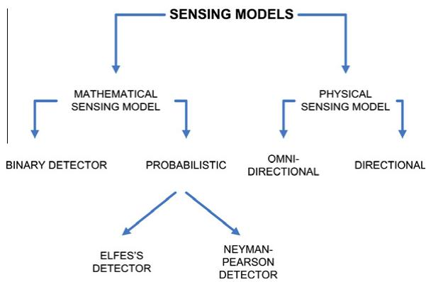  
Fig. 2. Sensing models.

Physical sensing model gives information about the sensing direction of the sensor node. There are two different physical sensing models. omni-directional and directional. Many legacy sensor nodes equipped with temperature, humidity, and magnetic sensors are able to sense with 360. Thus, omni-directional sensing can also be named as traditional sensing. This type of sensors cover a unit of circle with a radius $( R _ { s } ) ,$ i.e. they have only one working direction. As we mainly aim at presenting coverage optimization algorithms in directional sensor networks, in the rest of the article, we will use the term sensing model to indicate the physical sensing model and we will mainly concentrate on directional sensing.

## 3.1. Directional sensing

Unlike an omni-directional sensor, a directional sensor, such as infrared, ultrasound and video sensor, has a finite angle of view and thus cannot sense the whole circular area. Directional sensor nodes may have several working directions and may adjust their sensing directions during their operation. In principle, the directional sensor networks are more accurately characterized by the 3D sensing model. However, due to the high complexity in the design and analysis imposed by the 3D sensing model, most existing work focus on the simplified 2D sensing model and the associated coverage-control methods.

The sector covered by a directional sensor node S is denoted by a 4-tuple $( P , R _ { s } , W _ { d } , \alpha ) .$ . P is the position of the sensor node, $R _ { s }$ is the sensing radius, $W _ { d }$ is the working direction and a is the angle of view. The common directional sensing capability for 2D spaces is illustrated in Fig. 3. The special case of this model, where $\alpha = 3 6 0 ^ { \circ }$ can be described as omni-sensing model.

The relationship between a directional sensor and a target is determined by the Target In Sector (TIS) test [22]. The following two conditions are tested in order to determine whether a target is covered by a directional sensor S.

$$
\begin{array} { r } { d ( P , T ) \leqslant R _ { s } , } \end{array}\tag{ð8Þ}
$$

$$
\vec { P T } \cdot \vec { W } _ { d } \geqslant d ( P , T ) \cos \Big ( \frac { \alpha } { 2 } \Big ) .\tag{ð9Þ}
$$

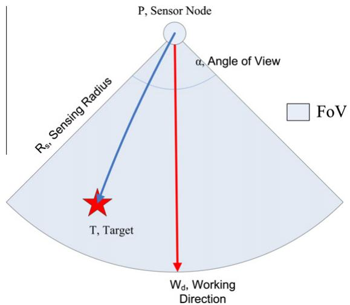  
Fig. 3. A directional sensor node senses a unit of sector described with the position (P), the working direction $( W _ { d } ) _ { \cdot }$ the sensing radius (R ), and the angle of view (a). A target (T) may be covered if it is located within the FoV of the node. It is found by the Target In Sector (TIS) test.

An area A is covered by sensor S, if and only if for any point $P \in A , P$ is covered by S. Note that the mathematical sensing model of S is the binary model. This model guarantees that the target is detected if it is located anywhere within the defined sector.

Different than the previous 2D directional sensing capability, 3D sensing capability focuses on two distinct features of a Pan Tilt Zoom (PTZ) directional sensor node:

1. The sensor, at a fixed 3D point, may change its sensing direction in three dimensions.

2. The coverage area of the sensor is constrained by the FoV, and functions as the projecting quadrilateral area in the monitored scene plane.

3D directional sensing capability is denoted by a 5-tuple $( P , D , A , \alpha , \beta )$ . P is the location $( x , y , z )$ of a directional sensor in 3D space, $\vec { W } _ { d }$ is the sensing orientation of the directional sensor at the time $t , A$ is the maximal value of the tilt angle $\textstyle { \Gamma \left( 0 \leqslant { \cal { T } } \leqslant { \cal { A } } \right) }$ , a and b are the horizontal and vertical offset angles of the FoV around $\vec { W _ { d } } . \vec { W } _ { d } = ( d x ( t ) , d y ( t ) , d z ( t ) )$ is of unit length, where dx(t), dy(t), and dz(t) are the components along $x , y ,$ and z axes, respectively.

Fig. 4 illustrates the 3D sensing model [23]. The following conditions guarantee that a target T in the monitored area is covered by the 3D directional model.

1. T is located in the projecting quadrilateral area of the sensor viewing space. $R _ { s } = z * \tan ( A + \beta )$ is called the radius of its acting area.

2. The intersection point (C) between the scene plane $( z = 0 )$ and the viewing central-line with the direction $\vec { W } _ { d }$ is called the centroid of the sensing area, which is given by:

$$
( x _ { c } , y _ { c } ) = \bigg ( - \frac { d y } { d z } z + x , - \bigg ( \frac { d y } { d z } \bigg ) z + y \bigg ) .\tag{ð10Þ}
$$

## 4. DSN versus WSN

Before examining existing coverage approaches in DSNs, we will go through the design criteria (Fig. 5) and the difficulties in DSNs. Directional sensor networks inherit all the technical challenges introduced by the traditional WSNs [20]. In addition, they introduce new ones that are unique to them. For example, the directionality of the sensors has significant impact on the overall network coverage. Studies about DSNs have primarily focused on the following items:

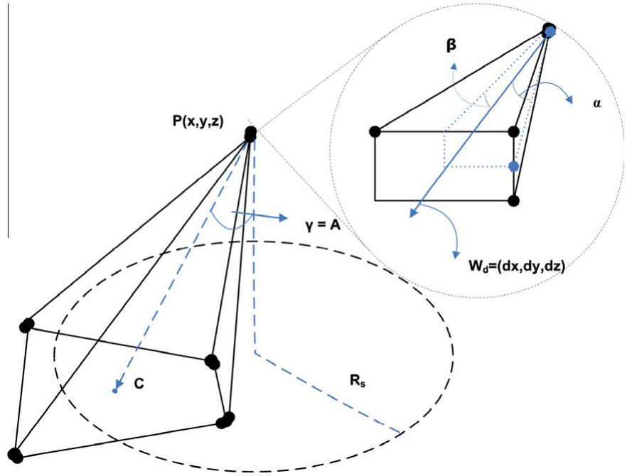  
Fig. 4. 3D directional sensing model [23].

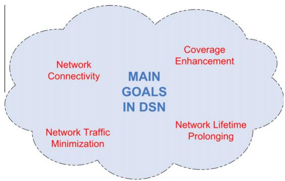  
Fig. 5. The main goals in directional sensor networks.

## 4.1. Coverage

Obtaining data from the environment is the main function of wireless sensor applications. Each application has different goals and collects different types of data. However, most of the sensor applications aim at maximum coverage with minimum number of sensors. Thus, the coverage problem in wireless sensor networks has been researched extensively in the past decades. This problem has some subcategories, such as area coverage, target coverage, k-coverage, each of which requires different strategies for the solution. In Section 6, these subcategories will be explained in more detail.

## 4.2. Connectivity

Connectivity is part of the coverage problem. It ensures that there is at least one communication path between any pair of active sensors. Since direct communication in WSNs consumes much more energy due to long-range packet delivery, multi-hop communication is mostly preferred. Thus, connectivity becomes a problem for wireless sensor networks. To the communication model in directional sensor networks, there are four cases: (a) omni-sending and omni-receiving. (b) directional sending and omni-receiving, (c) omni-sending and directional receiving, and (d) directional sending and directional receiving. The first one is the same as in the omni-directional sensor networks. In the latter three, there are also two cases. (i) the sensing and sending directions are the same, (ii) the sensing and sending directions are different. Therefore, connectivity maintenance problem under directional sending model is complicated and hard. Many of the existing solutions for DSNs assume that sensor nodes communicate omni-directional and the communication range of the sensor node is at least as twice as the sensing range [22].

## 4.3. Network lifetime

Sensor nodes suffer mostly from their limited battery capacity. Due to the small size of existing batteries, sensor nodes do not last as long as desired. Thus, research community have studied several solutions for prolonging the network lifetime of WSNs. Energy-aware MAC-layers and routing protocols [24–26], cross-layer design [27], various deployment strategies [28], base-station positioning algorithms [29–32] have been proposed to minimize the energy consumption of regular WSN activities. Reducing the energy consumption of communication, which is relatively higher compared to other energy consuming activities, is the main focus of researchers. Since directional sensor nodes have several working directions, rotatable mechanical design is required to utilize all working directions. Physical movement consumes definitely much more power than other activities [33]. Therefore, physical activities like rotating a sensor node around its axes or moving it to another position should be well planned to minimize the energy consumption.

## 4.4. Network traffic

Message traffic directly affects the network lifetime of sensor networks. The more messages are delivered, the more energy is consumed. Therefore, a sensor network should minimize its message traffic. There are two types of messages. application-specific messages and network-specific messages. Application-specific messages contain only the data sensed from the environment. On the other hand, network-specific messages consist of the information such as the position, the status, the working direction, the angle of view, the sensing range, and the residual energy, of the sensor node. To minimize the communication burden, i.e. to maximize the network lifetime, delivering redundant messages should be avoided. In-network processing is the common method for minimizing redundant data about the environment. However, this process cannot be applied to the network-specific messages. Network-specific messages are exchanged especially during the initial setup of the network. Each sensor node determines its position and the position of its neighbors via network-specific messages. Repositioning algorithms aim at calculating the final position of the sensor nodes. These algorithms work iteration-based which require excessive message traffic. There are two approaches for repositioning algorithms: (i) physical movement and (ii) virtual movement, after each iteration. In WSNs, using physical movement strategy, sensor nodes change their position physically after each step. Conversely, with the virtual movement strategy, sensor nodes move to their final destination after the iteration process ends. This strategy minimizes physical energy consumption albeit an increase in the message traffic of the network. Since communication process consumes less power than physical movement, virtual movement strategy outperforms physical movement strategy in terms of the network lifetime [34].

## 4.5. Characteristics and constraints of a directional sensor node

A directional sensor node has unique characteristics which cause new challenges when formulating solutions for DSN problems or designing DSN applications. In this subsection, we will examine the characteristics of a directional sensor node, which (in)directly affect the solutions to the coverage problem. The main characteristics and the main behaviors of a directional sensor node have been shown in Fig. 6.

## 4.5.1. Angle of view

Research in traditional sensor networks is based on the assumption of having omni-directional sensors with an omni-angle sensing coverage. However, directional sensors have a limited angle of sensing coverage due to technical constraints and/or cost considerations. The size of the angle of view may theoretically change from 1 to 360. If the angle equals to 360, the sensing model of the node can be described as omni-directional. DSNs consisting of sensor nodes with smaller angle of view require excessive number of nodes to achieve a given coverage ratio.

## 4.5.2. Working direction

The direction to which a directional sensor faces is the working direction of this sensor. In DSNs, sensors may have different working directions after a random deployment. In this case, orientation of sensors is required, to maximize the coverage. Moreover, due to external effects or application-specific queries in DSNs, sensor nodes may need to change/re-orient their working direction over time. Also, nodes may fail due to battery outage or external effects which should be handled by a dynamic update of the working directions. Adjusting working directions can be performed via local information exchange among sensors.

## 4.5.3. Line of sight

A multimedia/video-based sensor network [35] is also a directional sensor network. Multimedia coverage could be occluded by any obstacle such as trees, and buildings, present in the deployment environment [36]. This fact is described as the occlusion effect. The FoV of video sensors highly depends on the size and distance of the obstacles. Video sensors can only capture useful images when there is a line of sight between the event and the sensor itself [1]. Hence, coverage models developed for traditional wireless sensor networks are insufficient for the deployment planning of multimedia sensor networks.

## 4.5.4. Motility

Actuation yields a significant improvement in coverage, especially when two or more simple forms of actuation are combined together. There are three defined motions for video sensor nodes. pan, tilt and zoom. Motility [37] represents these three motions which occur along any of x, y, and z axes. It relies on reduced complexity motion primitives to reconfigure the network in response to environmental change. Due to its low hardware and low energy overhead motility can be easily incorporated into embedded systems. It is intuitive to expect that motility will enhance coverage, but it is not immediately obvious when such an approach is better than other alternatives. These alternatives could be using a higher density of static sensors or mobility. In [37], the authors show that motility can significantly improve the quality of sensing, within reasonable delay constraints on motion. They also state with the following items why motility is amenable to directional sensor networks;

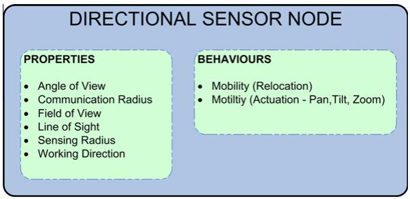  
Fig. 6. Characteristics of a directional sensor node.

1. Energy requirements are low, since only the sensor transducer has to be moved while the bulkier parts such as the motors, the battery, and the processor board, can remain stationary.

2. Navigation support required is minimal. No extra sensors are needed to obtain terrain feedback, since the actuation does not depend on unreliable or arbitrary terrain characteristics.

3. The motion is self contained and infra-structural support, such as localization beacons or trajectory markings, is not required.

4. Motility is also feasible in tethered sensor nodes, such as power intensive or high bandwidth sensors, since the node itself does not move.

Researches show that motility and mobility can significantly improve the coverage ratio of the network. Nevertheless, networks consisting of motile/mobile directional sensor nodes require high budgets due to the considerable production cost of those nodes. As an example, in [38], the costs are given USD800 for a static network camera, USD1300 for a pan-tilt-zoom network camera and USD35,000 for a fully mobile node. The gap between the costs have definitely decreased and will continue to decrease in the future. However, there will always be a reasonable cost ratio between static, motile and mobile nodes. Thus, we believe that hybrid directional sensor networks consisting of heterogeneous sensor nodes should also be considered for additional coverage performance to balance the coverage gain ratio and the cost of the network.

## 5. Coverage enhancement principles in DSNs

Coverage quality is closely related to the deployment strategy. Deployment strategies for DSNs do not differ from the strategies applied to the traditional sensor networks. Directional sensor networks can be deployed in two distinct ways: (i) controlled deployment and (ii) random deployment.

In controlled deployment, directional sensors are orderly placed following a pre-processed plan. In this approach, the coverage is maximized with a minimum number of sensors, reducing the final cost of the sensor network. This deployment strategy is usually opted for indoor applications, such as the surveillance of an art gallery. Directional sensor networks, deployed according to a plan, mostly do not have overlapping and occlusion problems.

Compared to the deterministic deployment, the random deployment is easy and less expensive for large directional sensor networks, and may be the only feasible option in remote or inhospitable environments. Moreover, to compensate for the lack of exact positioning and to improve the fault tolerance, nodes are typically deployed in excess, and thus redundant sensors usually arise. This type of deployment certainly causes overlapped areas and occluded regions. Thus, the coverage problem for randomly deployed directional sensor networks is very popular in recent years.

Researchers have proposed several coverage enhancing solutions for randomly deployed directional sensor networks. We believe that the theoretical coverage probability formulation could help the researchers to evaluate the performance of their proposed solutions. The theoretical coverage probability for directional sensing can be formulated using the sensing range, the angle of view of the sensor, the number of sensor nodes and the size of the targeted area [6].

In directional sensor networks, the following five main principles can be used for attaining high coverage rates;

 deployment of excessive number of directional sensors

 exploiting the motility of directional sensors

 exploiting the mobility of directional sensor nodes

 redeployment

 hybrid solution

Available studies using these techniques will be discussed in detail in Section 6.

## 5.1. Redundant deployment

Like traditional sensor networks, deploying more directional sensor nodes than theoretically necessary will cover more regions. However, sensor applications, where sensor nodes are deployed randomly, cannot guarantee 100% coverage. Thus, it is impossible to determine the number of redundant sensor nodes. Moreover, this technique requires very high budgets.

## 5.2. Adjustment of working direction, sensing radius, and angle of view

Since the probability of overlapped regions for directional sensor nodes is high, almost all of the studies focus on adjusting the working directions of the deployed sensor nodes. Their main goal is to both minimize the occlusion effect and the overlapped regions. This technique was examined in several studies with different assumptions [39,36,40,41]. To reposition a directional sensor (video, infrared, etc.) after the initial deployment, the sensor node should contain a mechanical hardware which enables the sensor to rotate 360 around its center. Most of the existing studies, described in Table 5, propose algorithms for the 2D environment. There exist a few algorithms proposed for the 3D environment [23]. On the other hand adjusting sensor parameters may heal coverage holes or help to cover more target points [42]. Nevertheless, increasing sensing radius and/or angle of view has a cost in terms of energy depletion and budget.

## 5.3. Deployment of mobile directional sensor nodes

Mobility is very important for sensor networks, since it may heal several network problems [43], including coverage and connectivity. A certain number of nodes may loose their functionality due to sensor node-specific reasons, such as running out of battery or damages originated from the environment. Thus, there may occur non-reachable regions during the network lifetime. The only way to cover these regions is to relocate the nearest mobile nodes. There are several solutions using mobility for the coverage problem in omni-directional sensor networks [34,45,46]. However, to the best of our knowledge, the idea of moving a directional sensor node to a different location has been only studied in [47].

A directional sensor node with mobility feature is expensive and more prone to failures. Moreover, moving a sensor node only 1 m consumes almost 30 times more energy than transmitting 1 KBytes of data. Despite of these disadvantages mobility increases the adaptability of the sensor network. Though motility has a significant improvement on coverage, just rotating the sensor node does not supply full coverage. To heal the coverage holes, coverage problems for DSNs need also consider the mobility.

## 5.4. Redeployment

Considering that the random deployment of sensor nodes is performed via an airplane or a catapult, deploying additional nodes to the estimated positions is extremely difficult. Thus, in the monitored area, there will be many redundant nodes. Moreover, each attempt for redeployment will cost more due to the nature of available redeployment methods [48,43].

## 5.5. Hybrid solution

Sensor networks with static nodes are rigid after the initial deployment. Conversely, mobile sensor networks have the ability to adapt themselves to dynamic changes in the topology, target tracking and etc. However, the cost of mobile sensor nodes is very expensive compared to the cost of the static nodes. Thus, researchers proposed a new type of a sensor network, called the hybrid sensor network. They believe that a balance can be achieved by using a combination of static and mobile nodes, while still ensuring sufficient coverage.

## 6. Coverage improvement solutions in DSNs

In the previous section, we have given the coverage enhancing principles for directional sensor networks. Research community exploit these principles and propose unique solutions for coverage improvement in DSNs.

Table 5  
List of most remarkable and leading solutions for coverage optimization in DSNs.
<table><tr><td>Paper</td><td>Field</td><td>Method</td><td>Dimension</td><td>Algorithm</td><td>Primary objective</td><td>Secondary objective</td><td>Approach/solution</td></tr><tr><td>[49]</td><td>AC</td><td>D</td><td>2D</td><td>DGreedy</td><td>Maximizing coverage</td><td></td><td>Adjusting WD</td></tr><tr><td>[50]</td><td>AC</td><td>D</td><td>2D</td><td></td><td>Maintaining full coverage</td><td>Prolonging network lifetime</td><td>Adaptive scheduling</td></tr><tr><td>[18]</td><td>AC</td><td>C</td><td>2D</td><td>Greedy algorithm</td><td>Maximizing coverage</td><td></td><td>Adjusting WD and scheduling</td></tr><tr><td>[40]</td><td>AC</td><td>D</td><td>2D</td><td>based on VD EFCEA</td><td>Enhancing AC</td><td>Maximizing network</td><td>√ Adjusting WD/scheduling sensors</td></tr><tr><td>[51]</td><td>AC</td><td>D</td><td>2D</td><td>E-SURF</td><td>Prolonging network lifetime</td><td>lifetime</td><td>Semantic neighbor selection</td></tr><tr><td>[36]</td><td>AC</td><td>D</td><td>2D</td><td>Self-orienting</td><td>Maximizing coverage</td><td></td><td>Adjusting WD by minimizing occlusions/overlapping</td></tr><tr><td>[52]</td><td>AC</td><td>C</td><td>2D</td><td>Adaptive deployment</td><td>Minimizing total cost while satisfying desired coverage</td><td></td><td>Adaptive redeployment</td></tr><tr><td>[39]</td><td>AC</td><td>C</td><td>2D</td><td>Coverage</td><td>requirement Maximizing coverage</td><td></td><td>Adjusting WD</td></tr><tr><td>[53]</td><td>AC/</td><td>C</td><td>2D</td><td>enhancing Greedy</td><td>Guaranteeing k-coverage w/</td><td></td><td>Adjusting WD/scheduling sensors</td></tr><tr><td>[53]</td><td>TC AC/</td><td></td><td></td><td></td><td>minimum sensors Guaranteeing k-coverage w/</td><td></td><td></td></tr><tr><td></td><td>TC</td><td>D</td><td>2D</td><td>DGA</td><td>minimum sensors</td><td></td><td>Adjusting WD/scheduling sensors</td></tr><tr><td>[54]</td><td>OT</td><td>D</td><td></td><td>Adaptive basis Sector-based</td><td>Estimating directions, speeds of tracked object</td><td></td><td>Detecting an object w/high DS</td></tr><tr><td>[55]</td><td>PC</td><td>C</td><td>2D</td><td>percolation model</td><td>Exposure-path prevention</td><td></td><td>Increasing sensing density</td></tr><tr><td>[34]</td><td>TC</td><td>C</td><td>2D</td><td>Direction partition</td><td>Prolonging network lifetime</td><td></td><td>Selecting subsets of sensors by adjusting WD according to weighted utility graph</td></tr><tr><td>[22]</td><td>TC</td><td>C</td><td>2D</td><td>ILP,SNCS</td><td>Maximizing coverage w/ minimum sensors</td><td>Prolonging network lifetime</td><td>Adjusting WD/scheduling sensors</td></tr><tr><td>[22]</td><td>TC</td><td>C</td><td>2D</td><td>CGA,SNCS</td><td>Maximizing coverage w/ minimum sensors</td><td>Prolonging network lifetime</td><td>Adjusting WD/scheduling sensors</td></tr><tr><td>[22]</td><td>TC</td><td>D</td><td>2D</td><td>DGA,SNCS</td><td>Maximizing coverage w/ minimum sensors</td><td>Prolonging network lifetime</td><td>Adjusting WD/scheduling sensors</td></tr><tr><td>[56]</td><td>TC</td><td>C</td><td>2D</td><td>DCS-GA,WT- Greedy</td><td>Covering all targets</td><td>Prolonging network lifetime</td><td>Adjusting WD regarding residual lifetime of DS</td></tr><tr><td>[56]</td><td>TC</td><td>D</td><td>2D</td><td>DCS-GA,WT- Dist</td><td>Covering all targets</td><td>Prolonging network lifetime</td><td>Adjusting WD based on target priorities</td></tr><tr><td>[57] [58]</td><td>TC</td><td>C</td><td>2D</td><td>WCGA</td><td>Maximizing covered targets</td><td></td><td>Adjusting WD</td></tr><tr><td>[58]</td><td>TC TC</td><td>C D</td><td>2D 2D</td><td>GDA EDO</td><td>Direction optimization Covering critical targets</td><td>Minimizing</td><td>Adjusting WD Adjusting WD</td></tr><tr><td></td><td></td><td></td><td></td><td></td><td>superiorly</td><td>coverage difference between nodes</td><td></td></tr><tr><td>[58] 59]</td><td>TC TC</td><td>D</td><td>2D 2D</td><td>NSS ILP</td><td>Maximizing network lifetime Minimizing total cost</td><td>Maximizing</td><td>Activating cover sets alternately Adjusting sensor parameters (Rs,</td></tr><tr><td></td><td></td><td></td><td></td><td></td><td></td><td>coverage/network lifetime</td><td>FoV, orientation)</td></tr><tr><td>[60] 60]</td><td>TC TC</td><td>C D</td><td>2D 2D</td><td>ILP CBDA</td><td>Prolonging network lifetime Prolonging network lifetime</td><td></td><td>Scheduling sensor nodes Utilizes a back-off timer to decide</td></tr><tr><td>[23]</td><td>TC</td><td></td><td></td><td>VFA-ACE</td><td>Improving coverage</td><td></td><td>active sensors and their direction Adjusting WD</td></tr><tr><td>2]</td><td>TC</td><td>D D</td><td>3D 3D</td><td>Simulated</td><td>Improving the coverage</td><td></td><td>Adjusting WD</td></tr><tr><td>[44]</td><td>TC</td><td>C</td><td></td><td>annealing Direction</td><td>Covering all targets w/</td><td></td><td>Adjusting WD</td></tr><tr><td>[61]</td><td></td><td></td><td>2D</td><td>partition</td><td>minimum sensors</td><td></td><td>Adjusting WD</td></tr><tr><td>[42]</td><td>TC TC</td><td>C C</td><td>2D 2D</td><td>ILP ILP</td><td>Minimizing sensors Minimizing total cost</td><td></td><td>Adjusting sensor parameters (R,</td></tr><tr><td>[62]</td><td>TC</td><td>C</td><td>2D</td><td>Greedy</td><td>Forming connected network</td><td></td><td>FoV, WD) Pattern-based deployment</td></tr><tr><td></td><td></td><td></td><td></td><td>algorithm</td><td>w/minimum sensors</td><td></td><td></td></tr><tr><td>[62]</td><td>TC</td><td>C</td><td>2D</td><td>Strip-based algorithm</td><td>Forming connected network</td><td></td><td>Pattern-based deployment</td></tr></table>

AC: Area Coverage, OT: Object Tracking, PC: Partial Coverage, TC: Target Coverage.  
C: Centralized, D: Distributed.  
WD: Working Directions, VD: Voronoi Diagram.

Which principle could/should be applied to a specific reallife application is dictated by the requirements of that specific application. However, a comprehensive literature review shows that research community have basically focused on two general solutions. adjusting the working directions of the sensor nodes and scheduling the sleep durations of redundant sensors. A directional sensor node may theoretically work in N different directions. The main goal for determining the best working direction of a directional sensor node is to find a direction, where the occlusion effect and overlapped areas are minimized. Thus, the directional sensor node serves with high efficiency. On the other hand, adjustment of working directions is not enough to prolong the network lifetime, since there may be some redundant nodes, which cover the same area and/ or targets. Some scheduling algorithms aim at putting redundant nodes to sleep in order to save energy.

Exploring the literature comprehensively convinced us to categorize available studies in directional sensor networks into four main types.

1. target-based coverage solutions

2. area-based coverage solutions

3. coverage solutions with guaranteed connectivity

4. network lifetime prolonging solutions

The most remarkable and leading solutions are listed in Table 5 to ease their comparison.

## 6.1. Target-based coverage solutions

Some sensor applications are only interested in stationary target points, such as buildings, doors, flags, and boxes, whereas other applications aim at tracking mobile targets like intruders. Stationary targets can be located anywhere in the observed area. To cover only the interested targets instead of the whole area, researchers have defined target-based coverage problems. In some studies, researchers name the target coverage approach as point coverage [3]. Unlike the area coverage, this issue puts emphasis on how to cover the maximum number of targets. In target coverage, each target is monitored continuously by at least one sensor. However, some DSN applications may require at least k sensors for each target in order to increase the reliability of the network. k-coverage problem has been formulated based on this requirement. In addition, k-barrier coverage [63] is used to detect an object, that penetrates the protected region. In this case, the sensor network would detect each penetrating object by at least k distinct sensors before it crosses the barrier of wireless sensors. It aims at minimizing the number of sensors that form such functionality.

A considerable number of studies have focused on the maximization of covered stationary targets with a minimum number of sensors. In [56], the authors call a subset of directions of the sensors as a cover set, in which the directions cover all the targets. The problem of finding a cover set in a DSN is named as the directional cover set problem. They propose a centralized algorithm, DCS-Greedy, and a distributed algorithm, DCS-Dist, that determine the working directions of sensor nodes while covering maximum number of targets. Both proposed algorithms basically accept the number of targets M, the number of sensors N and the number of directions per sensor W as input. They define two sets, the set of targets and the set of directions that cover at least one target in the set of targets. Their pivot policy is to find a direction to cover the target that can be covered by a minimal number of directions. DCS-Dist algorithm is proposed for the large-scale applications where centralized solutions are ineffective. In this algorithm, a sensor node repositions itself only based on the information from its neighbors. The algorithm consists of two stages, the deployment stage and the decision stage. In the deployment stage, each target is labeled with a priority number indicating by how many directions of sensor nodes it is being covered. The more times a target can be covered by the directions of a sensor and its neighbors, the lower priority it is assigned to. In the decision stage, a sensor node looks for uncovered targets with highest priorities while assessing messages received from its neighbors. The time complexity of DCS-Greedy algorithm is $O ( N ^ { 2 } W M )$ , whereas the time complexity of the DCS-Dist algorithm is O(NWM). Experimental results show that DCS-Greedy algorithm has a higher possibility to find a cover set, and has a greater coverage percentage than the DCS-Dist algorithm.

Ai and Abouzeid have proposed the Maximum Coverage with Minimum Sensors (MCMS) problem [22]. Given a set of targets $T = \{ t _ { 1 } , t _ { 2 } , \dots \dots , t _ { m } \}$ and a set of n homogenous directional sensors, each of which has p possible orientations, MCMS aims at maximizing the number of covered targets while minimizing the number of activated directional sensors. The authors first show that the MCMS problem is NPhard by proving that MCMS is a sub-problem of MAX\_- COVER [64], a classic NP-complete problem. The decision version of the MAX\_COVER problem can be stated as follows. Given a set of targets T and a collection C of subsets, MAX\_COVER problem searches for a subcollection of C with u subsets which cover at least v elements in T. For the MAX\_COVER problem, any u subsets $\phi _ { 1 } , \phi _ { 2 } , . . . , \phi _ { u }$ are picked from C. Then, for each subset $\phi _ { i } ( 1 \leqslant i \leqslant u ) , p$ copies of itself are constructed and rewritten as $\phi _ { i 1 } , \phi _ { i 2 } , . . . , \phi _ { i p }$ similarly to that in the MCMS problem. Such an expanded subcollection can be used as the input to the MCMS problem.

In [22], the authors also describe the sensing model of a directional sensor and the Target In Sector test where the decision is made if a target is located within the FoV of the related sensor or not. They have presented an exact Integer Linear Programming (ILP) formulation and two greedy algorithms, Centralized Greedy Algorithm (CGA) and Distributed Greedy Algorithm (DGA). ILP formulation takes the number of directional sensors n, the number of targets m, and the number of orientations available for each directional sensor p, as input. The objective function of this formulation maximizes the number of targets to be covered and imposes a penalty by multiplying the number of sensors to be activated by a positive penalty coefficient - whose value must be small enough $( \epsilon \leqslant 1 )$ to guarantee a unique solution.

Although ILP formulation chooses optimal working directions for the directional sensor nodes, it is not scalable for large problem instances. For large-scale networks, the authors present a polynomial-time heuristic greedy algorithm rather than giving an LP-relaxation algorithm to the MCMS problem.

CGA is a centralized solution for the MCMS problem. In each iteration, CGA searches for an inactive sensor and its orientation where the number of covered targets is maximized, and then activates the chosen node and its working direction. Random choices are made for any ties. This algorithm runs in loops and terminates if there are no more targets to be covered or no more unselected directional sensors remain. Since there are at most n loops, the time complexity of CGA is $O ( ( m + 1 ) n ^ { 2 } p )$

DGA is a distributed solution for MCMS where only local information is taken into account. Although this algorithm cannot perform as good as the centralized methods, it is computationally more scalable and requires less message traffic. In the DGA algorithm, each node assigns itself a unique variable, called as priority. Sensor nodes make their decisions based on the priority level of their neighbors located within $2 R _ { s } .$ Sensor nodes with higher priority levels choose their working direction first. These nodes look for the direction where the number of covered targets is at maximum. In each iteration, nodes within the same communication range exchange their priorities, location and orientation information. A transition timer prevents a sensor with zero targets from finalizing its decision.

According to the simulation results, ILP outperforms CGA and DGA in terms of coverage ratio, whereas DGA activates the largest number of sensors in most of the scenarios with 150 sensors or more. To evaluate the performance of their distributed algorithm the authors chose OGDC algorithm [65] which outperforms other existing distributed solutions [66–68] for omni-directional sensor networks. They achieved omni-directional sensing model, a special case of directional sensing model, by setting the value of p to 1 in order to compare their algorithm with OGDC. The results show that in most cases the coverage ratio of DGA is better than the coverage ratio of OGDC.

In [58], two new direction optimizing algorithms, greedy direction adjusting (GDA) and equitable direction optimizing (EDO) algorithms, have been proposed. GDA algorithm optimizes directions according to the amount of covered targets, whereas EDO algorithm adjusts the directions of nodes to cover the critical targets and allocates sensing resources among nodes fairly to minimize the coverage difference between nodes. To minimize covering collision, shown in Fig. 7, equivalent coverage model is presented. The basic idea of EDO is estimating the utilization for each sensor via constructing a target-direction mapping which contains the target number and the status of the target as whether or not being covered by neighboring sensors. In contrast to GDA, EDO improves coverage by 30% on average.

Similar to previously described solutions, the proposed algorithm in [57] looks for possible orientations of sensor nodes to cover targets as much as possible. Weighted Centralized Greedy Algorithm (WCGA) chooses the orientations with the larger weights. This algorithm takes three inputs, the set of all targets, the sensors and their orientations. It outputs the set of selected orientations. The authors define two weight functions, target weight and orientation weight. They also describe the Maximally be Covered Number (MCN) for each target. MCN is the maximal number of sensor nodes that cover the related target. In the target weight function $( w ( t _ { k } ) )$ , given in Eq. (11), a target with a small MCN, that is a target covered by less number of sensors will have a greater weight. The authors discovered that priority adjusting of the MCN and the amount of targets in the orientation according to the density of sensors could improve the target coverage rate. WCGA algorithm improves the coverage rate and decreases the number of active sensors compared to the CGA algorithm. The weight function determines how much the improvement will be.

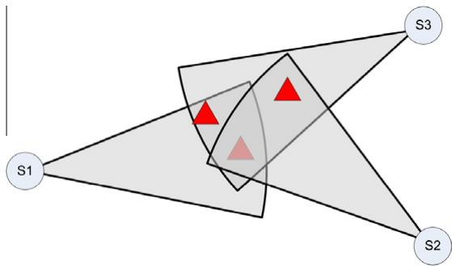  
Fig. 7. Covering collision occurs when a target is covered by more than the minimum required number of sensors. In this figure, all targets should be covered only by one sensor, whereas they were covered by at least two sensors yielding to covering collision [58].

$$
w ( t _ { k } ) = \frac { 1 / \alpha m } { M ( t _ { k } ) } ,\tag{ð11Þ}
$$

where m is the total number of targets and a is the positive factor to adjust the weight $( w ( t _ { k } ) )$ of the target $t _ { k } . M ( t _ { k } )$ represents the maximal number of sensor nodes that cover the target $t _ { k } .$

Individual targets may be associated with different priorities. The authors, in [44], propose the priority-based target coverage problem and they aim at selecting a minimum subset of directional sensors that can monitor all targets, satisfying their prescribed priorities. A genetic algorithm was offered to solve this minimum subset problem. This genetic algorithm has been run on MATLAB, since it provides strong optimization toolboxes. The simulation results show the effects of various factors including the sensing radius, angle of view, and the targets on the subset of sensors. With an increasing sensing range, the number of sensors decrease to acquire the same coverage ratio. On the other hand, an increment on the sensing angle reduces the number of sensors, but relatively less than enlarging the sensing range.

In [59], Osais et al. discuss directional sensor placement problem in a different way. They present an ILP model, where both a set of control points and a set of placement sites for sensors are defined previously. The objective is to place sensors in the sensor field such that every control point is covered by at least one sensor and the overall cost of the sensors is minimum. The impact of the three parameters of a directional sensor node, i.e. sensing range, FoV and orientation, has been examined thoroughly, since these parameters have significant impact on the overall cost of the DSN. Contrary to the other available solutions, the sensors in this model might have unequal sensing ranges and angle of views. Their experimental results show that if the number of potential placement sites increases, the total cost of the DSN will generally decrease and the number of required sensors will be reduced by as high as 95%.

## 6.2. Area-based coverage solutions

In the previous section, we examined the studies that focused on target-coverage in DSNs. This section is about the research on the enhancement of area-coverage in DSNs. Some studies [44] refer to area coverage as field coverage. Enhancing area coverage is very important for DSNs to fulfill the specified sensing tasks. The objective is to achieve maximal sensing region with a finite number of sensors. Some of the published papers, especially early ones, use the ratio of the covered area to the overall deployment region as a metric for the quality of the coverage [69]. However, some work focuses on the worst-case coverage, usually referred to as the least exposure. Worst-case coverage aims at measuring the probability that a target would travel across an area or an event would happen without being detected [70].

Grid-based coverage approach [71] has been used to simulate area coverage problems for DSNs. Each vertex on the grid represents a point in the monitored area. The grid resolution shows with how much detail an area is simulated. However, increasing grid resolution causes coverage optimization algorithms to run longer.

Several solutions [72,39,49,40,23,18] and algorithms have been proposed to enlarge the covered area with a minimization of the occlusion and overlapping. The study in [39] is one of the pioneer works on coverage enhancement in DSNs. The authors present a new method based on a rotatable directional sensing model. They propose to divide a directional sensor network into several components, called as sensing connected sub-graphs (SCSGs). Partitioning a directional sensor network into several SCSGs is dividing and conquering a centralized issue into a distributed one, thus decreasing the time complexity. The number of SCSGs, $n _ { s } ,$ reflects the performance of the area coverage. The less $n _ { s }$ is, the worse the coverage rate becomes, i.e., the more coverage holes occur. They also model each sensing connected sub-graph as a multi-layered convex hull set to address the enhancing coverage problem. Once forming a multi-layer convex hull set in each SCSG, the sensing directions of nodes are rotated to obtain the maximal sensing coverage. To achieve less overlapping area between two neighboring directional nodes on the same convex hull, the directional node repositions itself on the reverse direction of the interior angle-bisector. The interior angle bisector is calculated based on the position of two neighbor nodes as shown in Fig. 8.

Their algorithm consists of three steps. (i) depth-first search for finding SCSGs (ii) Graham algorithm for the construction of multi-layer convex hull set for each SCSG (iii) rotation of the sensing directions according to the corresponding interior angle-bisectors. Given n directional nodes, calculated k convex hulls in a convex hull set and m nodes in a SCSG, the time complexity of each step is $O ( n ^ { 2 } )$ , O(kmlogm), and $O ( n )$ respectively.

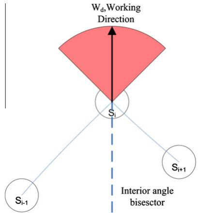  
Fig. 8. Interior angle bisector.

The numerical results show that the coverage rate increases with an increase in the sensing radius $R _ { s } .$ . However, once the value of $R _ { s }$ exceeds a threshold, coverage rate turns to be inversely proportional to $R _ { s } .$ The same results were also observed by the relationship of coverage rate to the angle of view (a). The proposed algorithm optimizes the scale of node deployment by quantifying the requirements of deploying directional sensors for a given coverage rate.

Cheng et al. describe the area-coverage enhancement problem as Maximum Directional Area Coverage (MDAC) problem and prove the MDAC to be NP-complete [49]. They propose one distributed scheduling algorithm, named Dgreedy, for the MDAC. Their objective is to maximize the area coverage of a randomly deployed DSN. In their study, the authors define two new concepts, virtual sensor and virtual field. A virtual sensor represents one working direction of a directional sensor, whereas a virtual field is a minimal region that is formed by the intersection of sensing regions of a number of virtual sensors. The idea behind presenting a distributed solution is that it is computationally more scalable and does not incur high communication overhead as required by a centralized solution.

For every directional sensor, Dgreedy algorithm chooses the least overlapped direction as its working direction. The authors assume that sensing neighbors are definitely located within $2 R _ { s }$ distance. Similar to the possible solutions in target-based coverage enhancement, each sensor was assigned a unique priority to put the sensing neighbors into an order. Higher priority sensing neighbors make their decision earlier than lower priority neighbors. The authors observe that the scarce sensors are highly critical to achieve maximal coverage, thus they utilize the number of sensing neighbors to differentiate the priority. Simulation results show that Dgreedy algorithm outperforms the Random algorithm, shown in Fig. 9. The performance improvement becomes obvious especially when the number of sensors increase, since the ratio of overlapped area is greater in a dense network.

The theory of the virtual potential field has already been applied to the coverage enhancement problems in omnidirectional mobile sensor networks[46,73]. Zhao and Zeng [40] has adapted this approach to wireless multimedia sensor network for coverage improvement. They proposed an electrostatic field-based coverage-enhancing algorithm (EFCEA) to enhance the area coverage of WMSNs by turning sensors to the correct orientation and decreasing the coverage overlap of active sensors. They also aim at maximizing the network lifetime by shutting off as much redundant sensors as possible based on the theory of grid approach, and waking them up according to a correlation degree. The grid’s number covered by every neighbor represents the value of an electric charge. The repel force between two sensors is defined according to the Coulomb’s law of the electrostatic field theory. This force is applied to the centroid of every sense sector (Fig. 10). The resultant force $F _ { i }$ to the sensor i’s centroid is calculated then by the following formula:

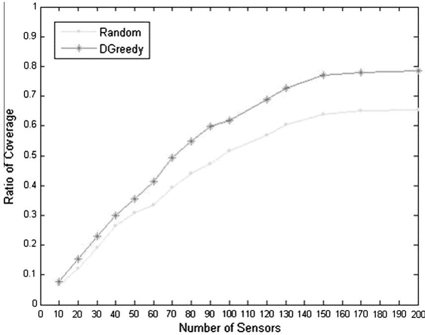  
Fig. 9. Performance comparison of DGreedy vs random algorithm [49].

$$
F _ { i } = \sum _ { j = 1 } ^ { m } k * \frac { q _ { i j } } { R _ { s } ^ { 2 } } \vec { r _ { 0 } } ,\tag{ð12Þ}
$$

where k is a constant describing the strength of the field, $\vec { r _ { 0 } }$ is a vector of unit length and describes the direction of the force. $R _ { s }$ represents the distance of two sensor nodes. $q _ { i j }$ describes the size of the area covered by the neighboring sensor nodes, whereas m is the number of neighboring nodes. A sensor node becomes stable after the composition of the forces caused by all neighbors is less than a predefined threshold -.

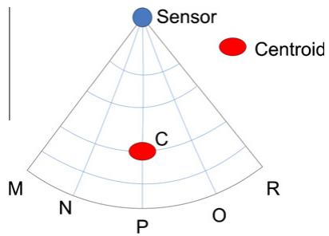  
Fig. 10. Centroid of a video sensor node.

The performance of EFCEA algorithm depends on the number of the deployed sensors. If it is small, the coverage ratio can be enhanced much, whereas the coverage ratio does not increase significantly when there is already a large number of sensors. However, in the latter case, many redundant sensors go into sleeping and the lifetime of WMSNs is prolonged along with the higher coverage ratio.

In [18], the authors name the above mentioned coverage problem as optimal coverage problem in directional sensor networks (OCDSN). Like other studies, they aim at covering maximal area while activating as few sensors as possible. They propose a greedy approximation algorithm to the solution of the OCDSN problem, based on the boundary Voronoi diagram. The Voronoi diagram is an important data structure in computational geometry, which is a fundamental construct defined by a discrete set of points [74]. By constructing the Voronoi diagram of a directional sensor network one could find the maximal breach path of this network. This path shows the weakest parts of the network and the probability of target detection is at minimum along this breach. The authors introduce an assistant sensor that can obtain the global information by traveling the edges of Voronoi diagram. While moving, the assistant sensor senses whether being covered by active sensors per unit time. If not, it checks whether there is an inactive directional sensor within its sensing circle in time. This condition ensures that an inactive sensor with the shortest

Euclidean distance to the edge will be chosen. Then, the inactive sensor is woken up and it selects its orientation as to make the borderline of its sensing sector to go through the assistant sensor.

Given n sensors, the best known algorithms for the generation of the Voronoi diagram have O(nlogn) complexity, whereas the assistant sensor needs O(n) complexity to traverse all edges of the Voronoi diagram. For each edge, the assistant sensor may detect n sensors in the worst case. Thus, the total time of their algorithm is: $O ( n \log n ) + O ( n ^ { 2 } )$ .

The effect of the number of sensors, sensing ranges and angle of views on the coverage ratio have been examined by the authors via several tests executed in MATLAB. Overall, the simulation results show that their algorithm outperforms the Random algorithm.

Some sensor applications require high reliability. Therefore, monitored points need to be covered by k sensors. These type of coverage problems are defined as k-coverage problems. Some researchers have focused on k-coverage problems in directional sensor networks [60,53]. In [53], Fusco and Gupta address the problem of selecting a minimum number of sensors and assigning orientations such that the given area or the set of target points is k-covered. The authors design a simple greedy algorithm that delivers a solution that k-covers at least half of the target points using at most M  logkjCj sensors, where jCj is the maximum number of target points covered by a sensor and M is the minimum of sensor required to k-cover all the given points.

We have presented several solutions for coverage improvement in the 2D directional sensing model. However, the realistic scene of an image/video sensor cannot be accurately described by a 2D directional sensing model. Due to the high complexity in the design analysis imposed by 3D sensing model, most existing works focus on the simplified 2D sensing model and its solutions. To model an application scene more accurately, Ma et al. have proposed a 3D sensor coverage-control model with tunable orientations [23]. They developed a virtual potential-field based coverage-enhancing scheme to improve the coverage performance. The virtual-force-analysis based areacoverage enhancing algorithm (VFA-ACE) determines the new working directions of directional sensors according to the neighborhood forces. These forces are applied to the centroid of the 3D covered area. VFA-ACE terminates when all centroid points are stable, i.e. the DSN reaches to the equilibrium.

The global area coverage optimization is clearly an NPhard problem. Since the authors cannot find the analytic relationship between the optimization objective and the tunable parameters, they select the heuristic optimization technique, Simulated Annealing (SA) algorithm, to optimize the area coverage-enhancing for 3D directional sensor networks. The SA is a global optimization method that tries to find optimal solution in the candidate solution space.

Both of the proposed algorithms, VFA-ACE and SA-ACE, have been implemented on a 3D simulation platform 3Dsenetest 1.0. The simulation results show that SA-ACE algorithm can achieve faster convergence speed.

## 6.3. Coverage solutions with guaranteed connectivity

Like omni-directional sensor networks, connected coverage in DSNs is crucial for the reliability of the network. This problem has been discussed for a long time and involves many disciplines [67,75]. Recently, one sub-topic of the connected coverage problem has drawn more attention than others, namely how to find the geometric optimal deployment pattern to achieve full coverage and a certain degree of connectivity [76].

The sensing and the communication ranges of a sensor node directly affect the deployment strategy of DSNs. In most studies, directional sensor nodes sense directional, while they communicate omni-directional. Most of these studies assume that communication radius of a sensor node is at least twice greater than the sensing radius of the node $\left( R _ { c } \geqslant 2 R _ { s } \right)$ , whereas other researchers study the coverage problem under connectivity constraint. Their main goal is to maximize the coverage while assuring network connectivity. Especially, neighborhood exploration for distributed solutions in DSNs has been carried out based on the communication range. The coverage for connectivity approach evaluates both the sensing and the communication radius while solving coverage problems.

Like directional sensing, some sensor nodes may communicate directional via their directional antennas. Directional antennas may actually promote communication quality by focusing transmission energy in one direction and reducing interference and fading [77]. Several studies about the miniaturization of directional antennas have been published recently [78–80]. They will make the applications using sensor nodes with directional antennas more popular. Directional communication model is similar to the directional sensing model and can be found in [6].

In [76], the authors consider the problem of providing full coverage of a planar region with sensors equipped with directional antennas. They give the probability of having full coverage in terms of number of sensors, coverage angle and communication radius. On the other hand, many directional sensor nodes are equipped with omni-directional antennas. Han et al. [62] investigate the connected coverage problem in directional sensor networks for the first time. They consider the problem of deploying a minimum number of directional sensors to form a connected network to cover either a set of point locations or the entire target sensing area. The authors state that Connected Point-Coverage Deployment (CPD) is NP-hard. They propose two approximation algorithms for CPD. The approximation ratio of the first algorithm is $\log P + 1$ , where P is the given set of target points. Second algorithm works only for sector where the angle of view is greater than $\scriptstyle { \frac { \pi } { 3 } } .$ Its approximation ratio is 9. Connected Region-Coverage Deployment (CRD) searches for a pattern with minimum covering density to deploy directional sensors to form a connected network to cover an area A. Assuming that A is sufficiently large, the authors propose two deployment patterns. Disk-based and pattern-based. Both Point-Coverage and Area-Coverage problems accepts $R _ { c } , R _ { s } ,$ and a as input.

Coverage enhancement with guaranteed connectivity is an open problem in DSNs for researchers. This non-trivial problem needs to be studied further in the future.

## 6.4. Network lifetime prolonging solutions

Due to their limited battery capacity sensor nodes have to manage their energy consuming activities. They should avoid unnecessary energy consumption during their operation to increase the network lifetime. Scheduling sensor nodes is the common way of prolonging network lifetime in directional sensor networks [81] as in WSNs [82–84]. The main goal of sensor scheduling algorithms is to shut off redundant sensor nodes and make them active when necessary.

Coverage enhancement algorithms organize the working directions of sensor nodes and determine a set of active nodes once after the initial deployment. However, active nodes need to be replaced by inactive nodes repeatedly and vice versa. Thus, several scheduling algorithms [85,50] have been proposed to increase the network lifetime of DSNs.

Ai and Abouzeid have proposed a new protocol [22], Sensing Neighborhood Cooperative Sleeping (SNCS), which performs dynamic scheduling among sensors depending on the amount of residual energy. SNCS protocol consists of two phases; scheduling and sensing. Each sensor node becomes active in each scheduling phase. Afterwards, the status of each sensor node is determined according to the result of the DGA algorithm. After the final decision, the inactive sensor nodes turn off their sensing and communication units and remaining active sensors perform their tasks. These two steps are repeated periodically. DGA algorithm uses the residual energy of a sensor as its priority. The residual energy is calculated based on the behavior of the node, such as transmitting, receiving, or sleeping. There is a trade-off between coverage enhancement and network lifetime prolonging. SNCS aims at achieving energy balancing across the network, while providing a solution to the MCMS problem.

Similar to the SNCS protocol, WT-Greedy and WT-Dist algorithms [56] take the residual lifetime of each sensor into consideration, while computing the set of non-conflicting directions of the sensors. WT-Greedy is a centralized solution where the work time of each cover set is determined as a fixed value, Dt. This algorithm finds the uncovered target $t _ { u }$ that can be covered by minimal number of directions and assigns it to the sensor s with the longest residual lifetime. Then, the sensor adjusts its working direction to cover that target. This algorithm terminates after the residual lifetime of all the sensors drops below Dt. On the other hand, WT-Dist is a distributed algorithm with two stages; the deploying stage and the monitoring stage. The deploying stage is the same as the DCS-Dist algorithm. In the monitoring stage, a sensor probes the states of its neighbors and decides its working direction so that the maximum number of targets are covered. The simulation results show that the coverage percentage drops afterwards, since both algorithms aim at prolonging network lifetime while maximizing coverage. However, WC-Dist’ drop is faster than WT-Greedy as the first one is a distributed solution.

The authors, in [40], examined the trade-off between coverage and network lifetime. They proposed to shut off the nodes, whose overlap ratio is greater than a predefined value. On the other hand, for waking up the nodes, they used a correlation degree, i.e. the distance between the related node and its neighbors. Their algorithm runs once after the initial deployment and terminates after the network reaches an equilibrium. The authors have increased the coverage ratio by 3% where they were able to shut off 40% of the deployed sensor nodes. Their results also show that the coverage ratio can be enhanced much with small number of the sensor nodes, whereas the network lifetime is prolonged with a large number of redundant sensor nodes.

Wen et al. proposed a distributed protocol, Neighbors Sensing Scheduling (NSS), determining whether sensors sleep or work, based on their local information. This protocol generates multiple cover sets from the sensor nodes and each cover set works for a predefined optimal time duration to prolong the network lifetime. A sleeping node decides to wake up if its remaining energy is more than its neighbors. Conversely, an active node changes its status as inactive if each of the targets around it is covered, i.e. if it becomes a redundant node. To compare the performance of their protocol with a centralized algorithm, designed for omni-directional sensor networks, Greedy-MSC [86], the authors set the angle of view to 360. The numerical results show that NSS achieves a similar performance to the Greedy-MSC. Moreover, this distributed solution is more scalable with its low communication overhead.

A couple of work in video sensor networks apply image processing techniques to find the sensors whose FoVs are the same or similar. Bai and Qi developed a so-called Extend Speeded-UP Robust Features (E-SURF) image comparison algorithm [51] based on two feature extraction schemes, SURF [87] and SIFT. They aim at removing redundancy through semantic neighbor selection in video sensor networks and they achieved 90% coverage with more than doubled network lifetime. The results show that E-SURF is computationally faster than SURF and it also has a low communication overhead compared to SURF.

In most of the aforementioned solutions, sensor nodes basically utilize their residual lifetime whether to become active or inactive in each round. In studies based on targetcoverage they also check the status of their neighbors’ targets to sleep or to wake up. Both coverage enhancement and network lifetime prolonging are essential to DSNs. Researchers should aim at balancing the two critical network goals.

## 7. Conclusion

In this survey article, first, the (dis)similarities of DSNs to WSNs have been explored. DSNs have many similarities to WSNs, but they totally differ from WSNs especially with regard of their sensing model. Directional sensor nodes may sense in several directions and they only cover a unit sector based on the angle of view and the sensing radius. In most studies, authors prefer not to work on 3D coverage model due to its high complexity in the design and analysis. Thus, the formulation of 3D coverage problems remains a challenging problem in DSNs.

In particular, we point out the two common behaviors of a directional sensor node. Both motility and mobility are essential for directional sensor nodes to minimize the occlusion effect and the overlapped regions. However, motility outperforms mobility in terms of the network cost and energy saving. Therefore, almost all of the studies aim at solving coverage problems exploiting motility. Nevertheless, mobility may heal coverage holes which can never be compensated by motility. Thus, we identify applying mobility to the coverage problems as an open research area in DSNs.

We also have discussed ongoing research on coverage enhancement techniques in directional sensor networks and classified existing studies for DSNs. Existing studies show that adjusting the working directions of sensor nodes is the main method for coverage improvement, whereas scheduling sensor nodes has been proposed for network lifetime prolonging. Authors have designed both centralized and distributed algorithms. The numerical results show that centralized algorithms outperform distributed ones. However, distributed algorithms are more scalable for large sensor networks. Distributed solutions do not need global information. Sensor nodes only exchange messages with their neighboring nodes. Thus, the required communication overhead for organizing the working directions is lower than the centralized solutions.

## References

[1] I.F. Akyildiz, T. Melodia, K.R. Chowdhury, A survey on wireless multimedia sensor networks, Computer Networks (Elsevier) 51 (4) (2007) 921–960.

[2] H. Liu, P. Wan, C.-W. Yi, X. Jia, S. Makki, N. Pissinou, Maximal lifetime scheduling in sensor surveillance networks, 4 (2005) 2482–2491, doi:10.1109/INFCOM.2005.1498533.

[3] M. Cardei, M. Thai, Y. Li, W. Wu, Energy–efficient target coverage in wireless sensor networks, 3 (2005) 1976–1984, doi:10.1109/ INFCOM.2005.1498475.

[4] C.-F. Huang, Y.-C. Tseng, A survey of solutions to the coverage problems in wireless sensor networks, Journal of Internet Technology 6 (2005) 1–8.

[5] S. Megerian, F. Koushanfar, M. Potkonjak, M. Srivastava, Worst and best-case coverage in sensor networks, IEEE Transactions on Mobile Computing 4 (1) (2005) 84–92, doi:10.1109/TMC.2005.1(410).

[6] H. Ma, Y. Liu, On coverage problems of directional sensor networks, in: Lecture Notes in Computer Science: Mobile Ad-hoc and Sensor Networks, vol. 3794, 2005, pp. 721–731.

[7] I. Akyildiz, T. Melodia, K. Chowdhury, Wireless multimedia sensor networks: applications and testbeds, Proceedings of the IEEE 96 (10) (2008) 1588–1605, doi:10.1109/JPROC.2008.928756.

[8] A. Greenleaf, Photographic Optics, Macmillan, 1950.

[9] Carnegie Mellon University, CMUcam3 Datasheet Version 1.02, September 2007.

[10] Omnivision Technologies <http://www.ovt.com>.

[11] Agilent Technologies <http://www.home.agilent.com>.

[12] Wireless Sensor Networks Research Group: Squid bee <http:// www.sensor-networks.org/>.

[13] P. Chen, O. Songhwai, M. Manzo, B. Sinopoli, C. Sharp, K. Whitehouse, O. Tolle, J. Jaein, P. Dutta, J. Hui, S. Schaffert, K. Sukun, J. Taneja, B. Zhu, T. Roosta, M. Howard, D. Culler, S. Sastry, Instrumenting wireless sensor networks for real-time surveillance, in: Proc. of Intl. IEEE Conf. on Robotics and Automation (ICRA 2006), 2006, pp. 3128–3133, doi:10.1109/ROBOT.2006.1642177.

[14] Mp Motion Sensor Panasonic Inc.

[15] Hydra Pir Sensor Datasheet <http://www.selex-sas.com>.

[16] Senix Ultrasonic Distance Sensors <http://www.senix.com>.

[17] Riko Ultrasonic Sensors <http://www.riko.com>.

[18] J. Li, R.-C. Wang, H.-P. Huang, L.-J. Sun, Voronoi based area coverage optimization for directional sensor networks, in: Proc. of Intl. Symposium on Electronic Commerce and Security (ISECS’09), vol. 1, Nanchang, China, 2009, pp. 488–493, doi:10.1109/ISECS.2009.116.

[19] I.F. Akyildiz, W. Su, Y. Sankarasubramaniam, E. Cayirci, Wireless sensor networks: a survey, Computer Networks 38 (2002) 393–422.

[20] A. Ghosh, S.K. Das, Coverage and connectivity issues in wireless sensor networks: a survey, Pervasive and Mobile Computing 4 (3) (2008) 303–334, doi:10.1016/j.pmcj.2008.02.001.

[21] E. Onur, C. Ersoy, H. Delic, L. Akarun, Surveillance wireless sensor networks: deployment quality analysis, Network, IEEE 21 (6) (2007) 48–53, doi:10.1109/MNET.2007.4395110.

[22] J. Ai, A.A. Abouzeid, Coverage by directional sensors in randomly deployed wireless sensor networks, Journal of Combinatoria Optimization 11 (1) (2006) 21–41, doi:10.1007/s10878-006-5975-x.

[23] H. Ma, X. Zhang, A. Ming, A coverage-enhancing method for 3d directional sensor networks, in: Proc. of IEEE Intl. Conf. on Computer Communications (INFOCOM’09), Rio de Janerio, Brazil, 2009, pp. 2791–2795, doi:10.1109/INFCOM.2009.5062233.

[24] K. Akkaya, M. Younis, A survey of routing protocols in wireless sensor networks, Ad Hoc Networks (Elsevier) 3 (3) (2005) 325–349.

[25] H. Tian, H. Shen, T. Matsuzawa, Coverage-enhancing algorithm for directional sensor networks, in: Lecture Notes in Computer Science: Network and Parallel Computing, vol. 3779, 2005, pp. 461–469, doi:10.1007/11577188.

[26] I. Demirkol, C. Ersoy, F. Alagoz, Mac protocols for wireless sensor networks: a survey, IEEE Communications Magazine 44 (4) (2006) 115–121.

[27] T. Melodia, M.C. Vuran, D. Pompili, The state of the art in cross-layer design for wireless sensor networks, in: Proceedings of EuroNGI Workshops on Wireless and Mobility, Springer Lecture Notes in Computer Science 3883, Como, Italy, 2005.

[28] Y. Mohamed, K. Akkaya, Strategies and techniques for node placement in wireless sensor networks: a survey, Ad Hoc Networks 6 (4) (2008) 621–655. http://dx.doi.org/10.1016/ j.adhoc.2007.05.00.

[29] E. Oyman, C. Ersoy, Multiple sink network design problem in large scale wireless sensor networks, in: Proc. of the IEEE Intl. Conf. on Communications, Paris, France, 2004, pp. 3663–3667.

[30] J. Pan, L. Cai, Y. Hou, Y. Shi, S. Shen, Optimal base-station locations in two-tiered wireless sensor networks, IEEE Transactions on Mobile Computing 4 (5) (2005) 458–473.

[31] Z. Vincze, R. Vida, A. Vidacs, Deploying multiple sinks in multi-hop wireless sensor networks, in: Proc. of the IEEE Intl. Conf. on Pervasice Services (ICPS’07), Istanbul, Turkey, 2007, pp. 55–63.

[32] Y. Lin, Q. Wu, X. Cai, X. Du, K.-H. Kwon, On deployment of multiple base stations for energy–efficient communication in wireless sensor networks, Hindawi Intl, Journal of Distributed Sensor Networks (2010), doi:10.1155/2010/563256.

[33] K. Dantu, M. Rahimi, H. Shah, E. Babel, A. Dhariwal, G.S. Sukhatme, Robomote: enabling mobility in sensor networks, in: Proc. of IEEE/ ACM Intl. Conf. on Information Processing in Sensor Networks (IPSN-SPOTS), 2005, pp. 404–409.

[34] G.G. Wang, G. Cao, P. Berman, T.F. La Porta, Bidding protocols for deploying mobile sensors, IEEE Transactions on Mobile Computing 6 (5) (2007) 563–576. http://dx.doi.org/10.1109/TMC.2007.1022.

[35] S. Soro, W. Heinzelman, A survey of visual sensor networks, Hindawi Advances in Multimedia 2009, doi:10.1155/2009/640386.

[36] N. Tezcan, W. Wang, Self-orienting wireless multimedia sensor networks for occlusion-free viewpoints, Computer Networks: International Journal of Computer and Telecommunications Networking 52 (13) (2008) 2558–2567. doi:http://dx.doi.org/ 10.1016/j.comnet.2008.05.014.

[37] A. Kansal, W.J. Kaiser, G.J. Pottie, M.B. Srivastava, Actuation techniques for sensing uncertainty reduction, Tech. rep. (March 2005).

[38] A. Kansal, W. Kaiser, G. Pottie, M. Srivastava, G. Sukhatme, Reconfiguration methods for mobile sensor networks, ACM Transactions on Sensor Networks 3 (4), doi:10.1145/1281492. 1281497.

[39] D. Tao, H. Ma, L. Liu, Coverage-enhancing algorithm for directiona sensor networks, in: Lecture Notes in Computer Science: Mobile Adhoc and Sensor Networks, vol. 4325, 2006, pp. 256–267.

[40] J. Zhao, J.-C. Zeng, An electrostatic field-based coverage-enhancing algorithm for wireless multimedia sensor networks, in: Proc. of IEEE Intl. Conf. on Wireless Communications, Networking and Mobile Computing (WiCom’09), Beijing, China, 2009, pp. 1–5, doi:10.1109/ WICOM.2009.5302443.

[41] A. Newell, K. Akkaya, Self-actuation of camera sensors for redundant data elimination in wireless multimedia sensor networks, 2009, pp. 1–5, doi:10.1109/ICC.2009.5199448.

[42] Y. Osais, M. St-Hilaire, F. Yu, The minimum cost sensor placement problem for directional wireless sensor networks, in: Proc. of. IEEE Intl. Conf. on Vehicular Technology (VTC’08), Calgary, Canada, 2008, pp. 1–5, doi:10.1109/VETECF.2008.289.

[43] Y. Yang, M. Cardei, Movement-assisted sensor redeployment scheme for network lifetime increase, in: Proc. of ACM Intl. Symposium on Modeling, Analysis, and Simulation of Wireless and Mobile Systems (MSWiM’07), 2007, pp. 13–20, doi:http://doi.acm.org/10.1145/ 1298126.1298132.

[44] J. Wang, C. Niu, R. Shen, Priority-based target coverage in directional sensor networks using a genetic algorithm, Computers and Mathematics with Applications 57 (11-12) (2009) 1915–1922, doi:10.1016/j.camwa.2008.10.019.

[45] S. Chellappan, W. Gu, X. Bai, D. Xuan, B. Ma, K. Zhang, Deploying wireless sensor networks under limited mobility constraints, IEEE Transactions on Mobile Computing 6 (2007) 1142–1157. http:// doi.ieeecomputersociety.org/10.1109/TMC.2007.1032.

[46] N. Heo, P. Varshney, Energy–efficient deployment of intelligent mobile sensor networks, IEEE Transactions on Systems, Man and Cybernetics, Part A: Systems and Humans 35 (1) (2005) 78–92, doi:10.1109/TSMCA.2004.838486.

[47] C.-K. Liang, M.-C. He, C.-H. Tsai, Movement assisted sensor deployment in directional sensor networks, in: Proc. of Intl. Conf. on Mobile Ad-Hoc and Sensor Networks, 2010, doi:10.1109/ MSN.2010.42.

[48] P. Xingyu, Y. Hongyi, Redeployment problem for wireless sensor networks, in: Proc. of Intl. Conf. on Communication Technology (ICCT’06), 2006, pp. 1–4, doi:10.1109/ICCT.2006.341957.

[49] W. Cheng, S. Li, X. Liao, S. Changxiang, H. Chen, Maximal coverage scheduling in randomly deployed directional sensor networks, in: Proc. of Intl. Conf. on Parallel Processing Workshops (ICPPW’07), Xi-An, China, 2007, pp. 68–68, doi:10.1109/ICPPW.2007.51.

[50] A. Makhoul, R. Saadi, C. Pham, Adaptive scheduling of wireless video sensor nodes for surveillance applications, in: Proc. of ACM Workshop on Performance Monitoring and Measurement of Heterogeneous Wireless and Wired Networks (PM2HW2N’09), Tenerife, Canary Islands, Spain, 2009, pp. 54–60, doi:http:// doi.acm.org/10.1145/1641913.1641921.

[51] Y. Bai, H. Qi, Redundancy removal through semantic neighbor selection in visual sensor networks, in: Proc. of ACM/IEEE Intl. Conf. on Distributed Smart Cameras (ICDSC’09), Como, Italy, 2009, pp. 1–8, doi:10.1109/ICDSC.2009.5289402.

[52] Y.-T. Lin, K. Saluja, S. Megerian, Cost efficient wireless camera sensor deployment strategy for environment monitoring applications, in: IEEE GLOBECOM Workshops, 2008, pp. 1–6, doi:10.1109/ GLOCOMW.2008.ECP.42.

[53] G. Fusco, H. Gupta, Selection and orientation of directional sensors for coverage maximization, in: Proc. of IEEE Intl. Conf. on Sensor, Mesh and Ad Hoc Communications and Networks (SECON’09), Rome, Italy, 2009, pp. 1–9, doi:10.1109/SAHCN.2009. 5168968.

[54] K. Plarre, P. Kumar, Tracking objects with networked scattered directional sensors, EURASIP Journal on Advances in Signal Processing (360912) (2008) 10, doi:10.1155/2008/360912.

[55] L. Liu, X. Zhang, H. Ma, Exposure-path prevention in directional sensor networks using sector model based percolation, in: Proc. of IEEE Intl. Conf. on Communications (ICC’09), Dresden, Germany, 2009, pp. 1–5, doi:10.1109/ICC.2009.5199019.

[56] Y. Cai, W. Lou, M. Li, Cover set problem in directional sensor networks, in: Proc. of IEEE Intl. Conf. on Future Generation Communication and Networking (FGCN’07), Washington, DC, USA, 2007, pp. 274–278, doi:http://dx.doi.org/10.1109/FGCN.2007.94.

[57] U.-R. Chen, B.-S. Chiou, J.-M. Chen, W. Lin, An adjustable target coverage method in directional sensor networks, in: Asia-Pacific Conference on Services Computing, Los Alamitos, CA, USA, 2008, pp. 174–180, doi:http://doi.ieeecomputersociety.org/10.1109/APSCC. 2008.37.

[58] J. Wen, L. Fang, J. Jiang, W. Dou, Coverage optimizing and node scheduling in directional wireless sensor networks, in: Proc. of IEEE Intl. Conf. on Wireless Communications, Networking and Mobile Computing (WiCom’08), Dalian, China, 2008, pp. 1–4, doi:10.1109/ WiCom.2008.984.

[59] Y. Osais, M. St-Hilaire, F. Yu, Directional sensor placement with optimal sensing range, field of view and orientation, in: Proc. of. IEEE Intl. Conf. on Wireless and Mobile Computing (WIMOB’08), Avignon, France, 2008, pp. 19–24, doi:10.1109/WiMob.2008.88.

[60] Y. Wu, J. Yin, M. Li, Z. En, Z. Xie, Efficient algorithms for probabilistic k-coverage in directional sensor networks, in: Proc. of IEEE Intl. Conf. on Intelligent Sensors Networks and Information Processing (ISSNIP’08), Sydney, Australia, 2008, pp. 587–592, doi:10.1109/ ISSNIP.2008.4762053.

[61] Y. Osais, M. St-Hilaire, F. Yu, On sensor placement for directional wireless sensor networks, in: Proc. of IEEE Intl. Conf. on

Communications (ICC’09), Dresden, Germany, 2009, pp. 1–5, doi:10.1109/ICC.2009.5199248.

[62] X. Han, X. Cao, E. Lloyd, C.-C. Shen, Deploying directional sensor networks with guaranteed connectivity and coverage, in: Proc. of. IEEE Intl. Conf. on Sensor, Mesh and Ad Hoc Communications and Networks (SECON’08), San Francisco, USA, 2008, pp. 153–160, doi:10.1109/SAHCN.2008.28.

[63] S. Kumar, T.H. Lai, A. Arora, Barrier coverage with wireless sensors, in: Proc. of ACM Intl. Conf. on Mobile computing and networking (MobiCom’05), 2005, pp. 284–298, doi:http://doi.acm.org/10.1145/ 1080829.1080859.

[64] D.S. Hochbaum, Approximating covering and packing problems: set cover, vertex cover, independent set, and related problems (1997) 94–143.

[65] H. Zhang, J. Hou, Maintaining sensing coverage and connectivity in large sensor networks, Ad Hoc & Sensor Wireless Networks 1 (1–2).

[66] D. Tian, N.D. Georganas, A coverage-preserving node scheduling scheme for large wireless sensor networks, in: Proc. of ACM Intl. Workshop on Wireless Sensor Networks and Applications (WSNA’02), 2002, pp. 32–41, doi:http://doi.acm.org/10.1145/ 570738.570744.

[67] X. Wang, G. Xing, Y. Zhang, C. Lu, R. Pless, C. Gill, Integrated coverage and connectivity configuration in wireless sensor networks, in: Proc. of ACM Intl. Conf. on Embedded Networked Sensor Systems (SenSys’03), 2003, pp. 28–39, doi:http://doi.acm.org/10.1145/ 958491.958496.

[68] F. Ye, G. Zhong, S. Lu, L. Zhang, Peas: a robust energy conserving protocol for long-lived sensor networks, in: Proc. of IEEE Intl. Conf. on Network Protocols, 2002, pp. 200–201.

[69] C.-F. Huang, Y.-C. Tseng, The coverage problem in a wireless sensor network, Mobile Networks and Applications 10 (2005) 519–528.

[70] S. Meguerdichian, F. Koushanfar, M. Potkonjak, M. Srivastava, Coverage problems in wireless ad-hoc sensor networks, in: Proc. of IEEE Intl. Conf. onf Computer and Communications (INFOCOM’01), vol. 3, 2001, pp. 1380–1387, doi:10.1109/INFCOM.2001.916633.

[71] H. Chen, H. Wu, N.-F. Tzeng, Grid-based approach for working node selection in wireless sensor networks, in: Proc. Intl. Conf on Communications, vol. 6, Paris, France, 2004, pp. 3673–3678, doi:10.1109/ICC.2004.1313228.

[72] C. Kandoth, S. Chellappan, Angular mobility assisted coverage in directional sensor networks, 2009, pp. 376–379, doi:10.1109/ NBiS.2009.69.

[73] G. Wang, G. Cao, T.L. Porta, Movement-assisted sensor deployment, IEEE Transactions on Mobile Computing 5 (6) (2006) 640–652, doi:10.1109/TMC.2006.80.

[74] F. Aurenhammer, Voronoi diagrams—a survey of a fundamental geometric data structure, ACM Computing Surveys 23 (3) (1991) 345–405. http://doi.acm.org/10.1145/116873.116880.

[75] R. Iyengar, K. Kar, S. Banerjee, Low-coordination topologies for redundancy in sensor networks, in: Proc. of ACM Intl. Conf. on Mobile Ad hoc Networking and Computing (MobiHoc’05), 2005, pp. 332–342, doi:http://doi.acm.org/10.1145/1062689.1062732.

[76] E. Kranakis, D. Krizanc, J. Urrutia, Coverage and connectivity in networks with directional sensors, in: Euro-Par 2004 Parallel Processing, Lecture Notes in Computer Science, vol. 3149, Springer, Berlin, Heidelberg, pp. 917–924.

[77] Z. Yu, J. Teng, X. Bai, D. Xuan, W. Jia, Connected coverage in wireless sensor networks with directional antennas, doi:http:// citeseerx.ist.psu.edu/viewdoc/summary?doi=10.1.1.151.1560.

[78] G. Giorgetti, A. Cidronali, S. Gupta, G. Manes, Exploiting low-cost directional antennas in 2.4 GHz IEEE 802.15.4 wireless sensor networks, in: European Conference on Wireless Technologies, 2007, pp. 217–220, doi:10.1109/ECWT.2007.4403985.

[79] C. Kakoyiannis, S. Troubouki, P. Constantinou, Design and implementation of printed multi-element antennas on wireless sensor nodes, in: Wireless Pervasive Computing, 2008, ISWPC 2008, 3rd International Symposium on, 2008, pp. 224–228, doi:10.1109/ ISWPC.2008.4556202.

[80] D. Leang, A. Kalis, Smart sensordvb: sensor network development boards with smart antennas, in: Proc. of Intl. Conf. on Communications, Circuits and Systems (ICCCAS’04), vol. 2, 2004, pp. 1476–1480.

[81] H. Yang, D. Li, H. Chen, Coverage quality based target-oriented scheduling in directional sensor networks, 2010, pp. 1–5, doi:10.1109/ICC.2010.5501996.

[82] J. Deng, Y.S. Han, W.B. Heinzelman, P.K. Varshney, Balanced-energy sleep scheduling scheme for high-density cluster-based sensor networks, Computer Communication 28 (14) (2005) 1631–1642. http://dx.doi.org/10.1016/j.comcom.2005.02.019.

[83] J. Deng, Y.S. Han, W.B. Heinzelman, P.K. Varshney, Scheduling sleeping nodes in high density cluster-based sensor networks, Mobile Networks and Applications 10 (6) (2005) 825–835. http:// dx.doi.org/10.1007/s11036-005-4441-9.

[84] W. Mo, D. Qiao, Z. Wang, Lifetime maximization of sensor networks under connectivity and k-coverage constraints (2006).

[85] J. Wang, C. Niu, R. Shen, A utility-based maximum lifetime algorithm for directional sensor network, in: Proc. of IEEE Intl. Conf. on Wireless Communications, Networking and Mobile Computing (WiCom’07), Shanghai, China, 2007, pp. 2424–2427, doi:10.1109/ WICOM.2007.604.

[86] M. Cardei, D.-Z. Du, Improving wireless sensor network lifetime through power aware organization, Wireless Networks 11 (3) (2005) 333–340. http://dx.doi.org/10.1007/s11276-005-6615-6.

[87] H. Bay, A. Ess, T. Tuytelaars, L. Van Gool, Speeded-up robust features (surf), Computer Vision and Image Understanding 110 (3).

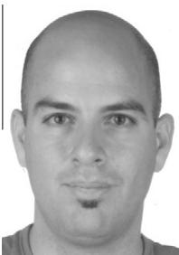

M. Amac Guvensan received his B.Sc., and M.Sc., degrees in computer engineering from the Yildiz Technical University, Turkey, in 2002 and 2006 respectively. Currently he is pursuing his Ph.D. degree at the Department of Computer Engineering, Yildiz Technical University, Istanbul. He is a research assistant at the Department of Computer Engineering, YTU. His current research interests include coverage optimization in directional sensor networks, deployment strategies and signa processing algorithms in wireless multimedia

sensor networks. Mr. Guvensan visited the Wireless Networks and Embedded Systems Laboratory, University at Buffalo, The State University of New York, for 6 months within 2009–2010.

  
embedded systems.

A. Gokhan Yavuz received his B.Sc., M.Sc., and Ph.D. degrees in computer engineering from the Yildiz Technical University, Istanbul, Turkey, in 1990, 1994, and 1999, respectively. He is currently an assistant professor at the Computer Engineering Department of Yildiz Technical University. He is also affiliated with the Scientific and Technological Research Council of Turkey as a senior researcher. He has received the IBM Faculty Award in 2008. His research interests include wireless sensor networks, operating systems, and real-time